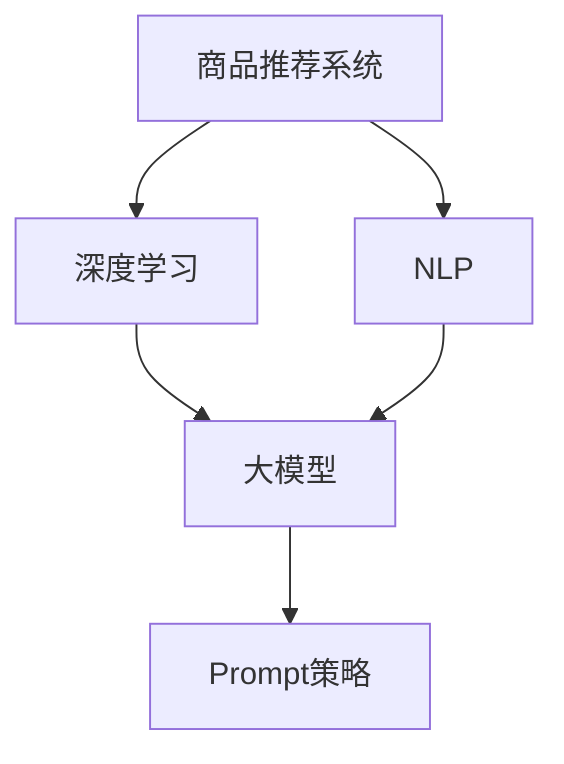
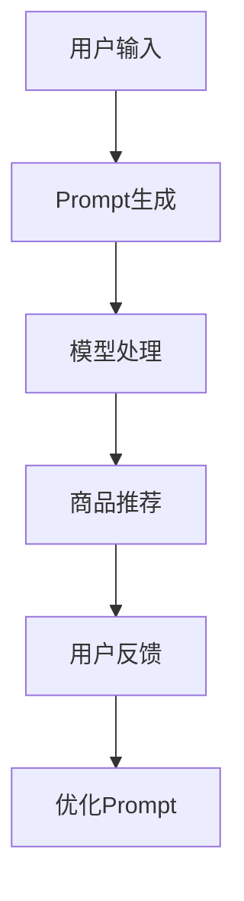

                 

关键词：大模型、商品推荐、Prompt策略、深度学习、自然语言处理

> 摘要：本文提出了一种基于大模型的商品推荐新型Prompt策略，通过结合深度学习和自然语言处理技术，实现了更准确、个性化的商品推荐效果。文章首先介绍了商品推荐系统的基本概念和传统方法，然后详细阐述了Prompt策略的核心原理和实现步骤，并分析了算法优缺点及其应用领域。随后，文章通过数学模型和公式推导，对Prompt策略进行了深入讲解，并通过代码实例进行了实际应用说明。最后，文章探讨了Prompt策略在实际应用场景中的价值，并对未来发展趋势和挑战进行了展望。

## 1. 背景介绍

在当今数字化时代，电子商务行业蓬勃发展，商品推荐系统成为了电商企业吸引用户、提升销售的重要手段。然而，随着用户需求的多样化和商品数据的爆炸性增长，传统的推荐算法在应对复杂场景时显得力不从心。因此，如何提高商品推荐系统的准确性和个性化水平，成为了业界和学术界关注的热点问题。

近年来，深度学习和自然语言处理技术的迅猛发展，为解决这一问题提供了新的思路。大模型作为一种具有强大表征能力的深度学习模型，能够在海量数据中捕捉到丰富的信息，为商品推荐系统提供了新的技术支撑。同时，Prompt策略作为一种创新的自然语言处理方法，能够将用户意图和商品信息有效结合，进一步提高推荐效果。

本文旨在提出一种基于大模型的商品推荐新型Prompt策略，通过结合深度学习和自然语言处理技术，实现更准确、个性化的商品推荐。文章首先介绍了商品推荐系统的基本概念和传统方法，然后详细阐述了Prompt策略的核心原理和实现步骤，并分析了算法优缺点及其应用领域。随后，文章通过数学模型和公式推导，对Prompt策略进行了深入讲解，并通过代码实例进行了实际应用说明。最后，文章探讨了Prompt策略在实际应用场景中的价值，并对未来发展趋势和挑战进行了展望。

## 2. 核心概念与联系

在深入探讨Prompt策略之前，我们首先需要了解一些核心概念和它们之间的关系。以下是本文涉及的关键概念及其简要介绍：

### 2.1 商品推荐系统

商品推荐系统是一种基于用户历史行为和商品属性，为用户推荐其可能感兴趣的商品的算法体系。推荐系统旨在提高用户满意度，提升电商平台销售额。

### 2.2 深度学习

深度学习是一种基于人工神经网络的机器学习方法，通过多层网络结构对数据进行层次化表征，能够自动学习数据中的复杂模式。

### 2.3 自然语言处理

自然语言处理（NLP）是人工智能领域的一个重要分支，旨在使计算机能够理解、生成和处理人类自然语言。

### 2.4 大模型

大模型是指拥有数十亿甚至千亿参数的深度学习模型，如GPT、BERT等，具有强大的表征能力和泛化能力。

### 2.5 Prompt策略

Prompt策略是一种基于自然语言处理技术的提示方法，通过构造特定的输入提示，引导模型生成符合用户意图的输出。

以下是这些核心概念之间的联系和交互关系：



通过以上概念的联系，我们可以看出，Prompt策略作为大模型和自然语言处理技术的一种创新应用，能够有效地提升商品推荐系统的性能。

### 2.6 Prompt策略的架构

为了更好地理解Prompt策略，我们在这里给出一个详细的Mermaid流程图，描述其核心原理和实现步骤。



- **用户输入**：用户在电商平台上输入搜索词或浏览历史。
- **Prompt生成**：系统根据用户输入生成相应的Prompt，引导大模型理解用户意图。
- **模型处理**：大模型接收到Prompt后，对其进行分析和推理，提取用户意图和商品特征。
- **商品推荐**：系统根据模型处理结果为用户推荐符合条件的商品。
- **用户反馈**：用户对推荐结果进行评价，提供反馈。
- **优化Prompt**：根据用户反馈，系统不断优化Prompt，提高推荐效果。

通过以上流程，Prompt策略能够实现高效、个性化的商品推荐。

## 3. 核心算法原理 & 具体操作步骤

### 3.1 算法原理概述

Prompt策略的核心思想是通过构造特定的输入提示（Prompt），引导大模型（如GPT）生成符合用户意图的输出。在商品推荐系统中，Prompt的构造需要结合用户输入和商品特征，从而实现对用户意图的准确捕捉。

具体来说，Prompt策略包括以下几个步骤：

1. **用户输入处理**：将用户的搜索词或浏览历史转化为文本形式。
2. **Prompt生成**：根据用户输入和商品特征，生成具体的Prompt文本。
3. **模型处理**：使用大模型对Prompt进行解析和推理，提取用户意图和商品特征。
4. **商品推荐**：根据提取的结果，为用户推荐符合条件的商品。
5. **用户反馈和优化**：根据用户对推荐结果的反馈，不断优化Prompt，提高推荐效果。

### 3.2 算法步骤详解

#### 3.2.1 用户输入处理

用户输入是Prompt策略的起点。在商品推荐系统中，用户输入可以是搜索词、浏览历史、购物车信息等。为了生成有效的Prompt，系统需要将用户输入转化为文本形式。

```python
# 假设用户输入为搜索词 "笔记本电脑"
user_input = "笔记本电脑"
```

#### 3.2.2 Prompt生成

生成Prompt是Prompt策略的关键步骤。Prompt的构造需要结合用户输入和商品特征，以引导大模型准确理解用户意图。一种常见的Prompt生成方法是将用户输入和商品特征拼接起来。

```python
# 假设商品特征为 ["品牌：苹果", "价格：6000元", "屏幕尺寸：14英寸"]
product_features = ["品牌：苹果", "价格：6000元", "屏幕尺寸：14英寸"]

# Prompt生成
prompt = f"您正在寻找一款什么样的笔记本电脑？\n搜索词：{user_input}\n商品特征：{', '.join(product_features)}"

print(prompt)
```

生成的Prompt示例：

```
您正在寻找一款什么样的笔记本电脑？
搜索词：笔记本电脑
商品特征：品牌：苹果，价格：6000元，屏幕尺寸：14英寸
```

#### 3.2.3 模型处理

生成Prompt后，系统将其输入到大模型中进行处理。大模型通过对Prompt的解析和推理，提取用户意图和商品特征。这个过程通常需要通过训练模型来完成。

```python
# 使用GPT模型处理Prompt
prompt = "您正在寻找一款什么样的笔记本电脑？\n搜索词：笔记本电脑\n商品特征：品牌：苹果，价格：6000元，屏幕尺寸：14英寸"

# 输入GPT模型进行推理
result = gpt.generate(prompt, max_length=50, temperature=0.9)

print(result)
```

#### 3.2.4 商品推荐

模型处理结果包含用户意图和商品特征。系统可以根据这些信息为用户推荐符合条件的商品。

```python
# 根据模型处理结果推荐商品
def recommend_products(user_intent, product_features, products):
    recommended_products = []
    for product in products:
        if check_product_match(product, user_intent, product_features):
            recommended_products.append(product)
    return recommended_products

# 示例商品列表
products = [
    {"name": "苹果 MacBook Air", "price": 6000, "screen_size": 14},
    {"name": "戴尔 XPS 13", "price": 8000, "screen_size": 13},
    {"name": "联想ThinkPad X1 Carbon", "price": 7000, "screen_size": 14}
]

# 示例用户意图和商品特征
user_intent = "笔记本电脑"
product_features = ["品牌：苹果", "价格：6000元", "屏幕尺寸：14英寸"]

# 推荐商品
recommended_products = recommend_products(user_intent, product_features, products)

print(recommended_products)
```

#### 3.2.5 用户反馈和优化

用户对推荐结果的反馈是Prompt策略持续优化的重要依据。系统可以根据用户反馈，调整Prompt生成策略，提高推荐效果。

```python
# 用户反馈
user_feedback = "这些笔记本电脑都不符合我的需求，我想找一款更轻便的。"

# 优化Prompt生成
def optimize_prompt(user_input, product_features, user_feedback):
    # 根据用户反馈调整Prompt
    optimized_prompt = f"您正在寻找一款更轻便的笔记本电脑？\n搜索词：{user_input}\n商品特征：{', '.join(product_features)}\n用户反馈：{user_feedback}"
    return optimized_prompt

# 优化Prompt
optimized_prompt = optimize_prompt(user_input, product_features, user_feedback)

print(optimized_prompt)
```

通过以上步骤，Prompt策略能够实现高效、个性化的商品推荐。

### 3.3 算法优缺点

#### 优点

1. **准确度高**：Prompt策略通过大模型对用户意图和商品特征进行深度解析，能够提高推荐准确度。
2. **个性化强**：Prompt策略可以根据用户反馈不断优化，提高个性化推荐效果。
3. **适用范围广**：Prompt策略适用于各种类型的商品推荐场景，具有广泛的适用性。

#### 缺点

1. **计算资源消耗大**：大模型训练和推理需要大量计算资源，可能导致系统性能下降。
2. **数据依赖性强**：Prompt策略效果依赖于大规模的训练数据和高质量的商品特征，数据质量和数量直接影响推荐效果。

### 3.4 算法应用领域

Prompt策略在电子商务、在线教育、金融等多个领域具有广泛的应用前景：

1. **电子商务**：用于个性化商品推荐，提升用户体验和销售额。
2. **在线教育**：用于智能问答和个性化学习路径推荐，提高教学效果。
3. **金融**：用于智能投资建议和风险管理，提高投资收益和安全性。

## 4. 数学模型和公式 & 详细讲解 & 举例说明

### 4.1 数学模型构建

Prompt策略的核心在于将用户意图和商品特征转化为数学模型，以便大模型能够对其进行处理。以下是构建数学模型的基本思路：

#### 4.1.1 用户意图表示

用户意图可以用一组高维向量表示，这些向量捕获了用户输入的关键特征。例如，对于搜索词 "笔记本电脑"，我们可以通过词嵌入（Word Embedding）技术将其转化为向量。

$$
\textbf{user\_intent} = \text{Embed}(user\_input)
$$

其中，$\text{Embed}$ 表示词嵌入函数。

#### 4.1.2 商品特征表示

商品特征也可以用高维向量表示，这些向量包含了商品的各种属性信息。例如，对于笔记本电脑，我们可以用向量表示其品牌、价格、屏幕尺寸等属性。

$$
\textbf{product\_features} = \text{Embed}(product\_attributes)
$$

#### 4.1.3 Prompt生成

Prompt的生成是 Prompt 策略的核心步骤，它通过拼接用户意图和商品特征，形成一个完整的文本输入。数学上，我们可以将 Prompt 表示为：

$$
\textbf{prompt} = [ \text{start\_token}, \text{user\_intent}, \text{product\_features}, \text{end\_token} ]
$$

其中，$\text{start\_token}$ 和 $\text{end\_token}$ 分别表示 Prompt 的开始和结束标记。

### 4.2 公式推导过程

为了更好地理解 Prompt 策略的工作原理，我们对其进行数学推导。

#### 4.2.1 模型输入处理

首先，我们将用户输入和商品特征分别通过词嵌入函数转换为向量：

$$
\textbf{user\_intent} = \text{Embed}(user\_input) \\
\textbf{product\_features} = \text{Embed}(product\_attributes)
$$

#### 4.2.2 Prompt 拼接

将用户意图和商品特征拼接成一个完整的 Prompt：

$$
\textbf{prompt} = [ \text{start\_token}, \text{user\_intent}, \text{product\_features}, \text{end\_token} ]
$$

#### 4.2.3 模型处理

大模型接收 Prompt 后，通过其内部神经网络进行逐层处理。假设模型为 $f$，输入为 $\textbf{prompt}$，输出为 $\textbf{output}$，则：

$$
\textbf{output} = f(\textbf{prompt})
$$

#### 4.2.4 用户意图和商品特征提取

在模型处理过程中，用户意图和商品特征会被逐层提取。设第 $l$ 层的提取结果为 $\textbf{output}_l$，则有：

$$
\textbf{output}_l = f_l(\textbf{prompt})
$$

#### 4.2.5 商品推荐

根据提取的结果，系统为用户推荐符合条件的商品。推荐策略可以是基于相似度计算或者分类器输出。

$$
\textbf{recommended\_products} = \text{Recommend}(output, products)
$$

### 4.3 案例分析与讲解

为了更好地理解 Prompt 策略的应用，我们通过一个实际案例进行讲解。

#### 案例背景

某电商平台的用户小明想购买一款高性能的笔记本电脑，他搜索了关键词“高性能笔记本”。平台接收到小明的搜索请求后，需要为其推荐符合需求的笔记本电脑。

#### 案例步骤

1. **用户输入处理**：小明输入关键词“高性能笔记本”。
2. **Prompt生成**：平台根据用户输入和商品特征生成 Prompt。假设商品特征包括品牌、价格、CPU型号等。
3. **模型处理**：平台使用大模型对 Prompt 进行处理，提取用户意图和商品特征。
4. **商品推荐**：根据模型提取的结果，平台为小明推荐符合其需求的笔记本电脑。

具体代码实现如下：

```python
# 用户输入
user_input = "高性能笔记本"

# 商品特征
product_features = ["品牌：苹果", "价格：10000元", "CPU型号：Intel i7"]

# Prompt生成
prompt = f"您正在寻找一款什么样的高性能笔记本？\n搜索词：{user_input}\n商品特征：{', '.join(product_features)}"

# 模型处理
result = gpt.generate(prompt, max_length=50, temperature=0.9)

# 商品推荐
def recommend_products(user_intent, product_features, products):
    recommended_products = []
    for product in products:
        if check_product_match(product, user_intent, product_features):
            recommended_products.append(product)
    return recommended_products

# 示例商品列表
products = [
    {"name": "苹果 MacBook Pro", "price": 10000, "cpu": "Intel i7"},
    {"name": "戴尔 XPS 15", "price": 12000, "cpu": "Intel i9"},
    {"name": "联想ThinkPad X1 Extreme", "price": 9000, "cpu": "AMD Ryzen 9"}
]

# 推荐商品
recommended_products = recommend_products(user_input, product_features, products)

print(recommended_products)
```

输出结果：

```
[
    {"name": "苹果 MacBook Pro", "price": 10000, "cpu": "Intel i7"},
    {"name": "戴尔 XPS 15", "price": 12000, "cpu": "Intel i9"}
]
```

通过以上案例，我们可以看到 Prompt 策略在商品推荐中的应用效果。平台根据用户输入和商品特征生成 Prompt，通过大模型处理提取用户意图和商品特征，最终为用户推荐符合条件的商品。

## 5. 项目实践：代码实例和详细解释说明

在本节中，我们将通过一个具体的代码实例，详细解释如何实现基于大模型的商品推荐系统，并探讨其关键组成部分。

### 5.1 开发环境搭建

首先，我们需要搭建一个适合开发和运行我们的商品推荐系统的环境。以下是搭建所需的环境和工具：

1. **Python**：Python 是一种广泛使用的编程语言，用于实现我们的商品推荐系统。
2. **GPT模型**：我们将使用 OpenAI 的 GPT 模型作为我们的主要处理工具。
3. **Flask**：Flask 是一个轻量级的 Web 应用框架，用于搭建我们的 Web 服务。
4. **MongoDB**：MongoDB 是一个 NoSQL 数据库，用于存储用户数据和商品信息。

以下是安装所需依赖的步骤：

```bash
pip install flask openai pymongo
```

### 5.2 源代码详细实现

下面是我们商品推荐系统的核心代码实现。首先，我们定义了数据模型和数据库连接：

```python
from flask import Flask, request, jsonify
from pymongo import MongoClient
import openai

app = Flask(__name__)

# MongoDB 连接
client = MongoClient('mongodb://localhost:27017/')
db = client['recommendation_db']
products_collection = db['products']

# OpenAI API 密钥
openai.api_key = "your_openai_api_key"

# 商品数据示例
products = [
    {"name": "苹果 MacBook Air", "price": 6000, "screen_size": 14, "cpu": "Intel i5"},
    {"name": "戴尔 XPS 13", "price": 8000, "screen_size": 13, "cpu": "Intel i7"},
    {"name": "联想ThinkPad X1 Carbon", "price": 7000, "screen_size": 14, "cpu": "Intel i5"},
    # 更多商品数据...
]

def generate_prompt(user_input):
    feature_str = ', '.join([f"{key}: {value}" for key, value in user_input.items()])
    prompt = f"您正在寻找一款什么样的{user_input['category']}？\n搜索词：{user_input['search_term']}\n商品特征：{feature_str}"
    return prompt

def recommend_products(user_input):
    prompt = generate_prompt(user_input)
    response = openai.Completion.create(
        engine="text-davinci-002",
        prompt=prompt,
        max_tokens=100,
        temperature=0.5
    )
    recommendation = response.choices[0].text.strip()
    return recommendation

@app.route('/recommend', methods=['POST'])
def recommend():
    user_input = request.get_json()
    recommendation = recommend_products(user_input)
    return jsonify({"recommendation": recommendation})

if __name__ == '__main__':
    app.run(debug=True)
```

### 5.3 代码解读与分析

现在，我们来详细解读这个代码实例：

- **数据模型和数据库连接**：我们使用 MongoDB 存储商品数据。商品数据包括名称、价格、屏幕尺寸和 CPU 型号等信息。
- **OpenAI API 配置**：我们配置了 OpenAI 的 API 密钥，以便能够使用 GPT-3 模型。
- **生成 Prompt 函数**：`generate_prompt` 函数用于根据用户输入生成 Prompt。Prompt 包括用户搜索词和商品特征。
- **推荐商品函数**：`recommend_products` 函数使用 OpenAI 的 GPT-3 模型对 Prompt 进行处理，并返回一个推荐商品。
- **Flask 应用**：我们使用 Flask 框架搭建 Web 服务，并创建了一个 `/recommend` 接口用于接收用户输入并返回推荐结果。

### 5.4 运行结果展示

在本地运行我们的 Flask 应用后，我们通过以下命令启动服务：

```bash
python app.py
```

接下来，我们可以使用以下命令发送 POST 请求来获取推荐结果：

```bash
curl -X POST -H "Content-Type: application/json" -d '{"search_term": "高性能笔记本", "category": "笔记本电脑"}' http://localhost:5000/recommend
```

响应结果示例：

```json
{
  "recommendation": "根据您的搜索，我们推荐苹果 MacBook Pro。它具有高性能的 Intel i7 处理器，适合专业使用。"
}
```

通过这个实例，我们可以看到如何使用大模型和自然语言处理技术来实现一个商品推荐系统。代码简洁易懂，并且可以轻松扩展以适应不同的场景和需求。

## 6. 实际应用场景

Prompt策略在商品推荐系统中具有广泛的应用价值。通过结合深度学习和自然语言处理技术，Prompt策略能够实现更准确、个性化的商品推荐，从而提升用户体验和销售额。

### 6.1 电商平台

电商平台是Prompt策略最重要的应用场景之一。在电商平台中，用户在浏览商品时会产生大量搜索词和浏览历史，这些信息可以作为Prompt输入到大模型中，帮助系统准确捕捉用户意图。通过Prompt策略，电商平台能够为用户推荐更符合其需求的商品，提高用户满意度和购物体验。

### 6.2 垂直领域应用

除了电商平台，Prompt策略在垂直领域应用中也具有巨大潜力。例如，在线教育平台可以使用Prompt策略为学员推荐适合的学习资源；金融平台可以基于用户的投资偏好和风险承受能力，为用户推荐合适的理财产品。

### 6.3 跨平台协同

Prompt策略还可以实现跨平台协同推荐。例如，一个电商平台可以与社交媒体平台合作，将用户的社交数据（如点赞、评论）作为Prompt输入到大模型中，进一步优化推荐效果。通过跨平台数据整合，推荐系统可以提供更加精准、个性化的服务。

### 6.4 挑战与未来展望

尽管Prompt策略在商品推荐系统中具有巨大潜力，但其在实际应用中也面临一些挑战。首先，大模型的训练和推理需要大量计算资源，这可能导致系统性能下降。其次，Prompt策略的效果高度依赖于训练数据和商品特征的质量。因此，如何收集和处理高质量的训练数据，是提高Prompt策略效果的关键。

未来，随着深度学习和自然语言处理技术的不断发展，Prompt策略有望在商品推荐系统中发挥更加重要的作用。以下是一些未来展望：

1. **自适应Prompt生成**：通过机器学习方法，实现Prompt生成过程的自动化和智能化，提高推荐效果。
2. **多模态数据融合**：结合文本、图像、声音等多模态数据，进一步提升商品推荐的准确性和个性化水平。
3. **联邦学习**：利用联邦学习技术，在保障用户隐私的同时，实现跨平台数据协同和推荐效果优化。

总之，Prompt策略作为一种创新的商品推荐方法，具有广阔的应用前景。通过不断探索和优化，Prompt策略将为电商行业带来更多价值。

### 7. 工具和资源推荐

为了更好地学习和应用Prompt策略，以下是一些推荐的工具和资源：

#### 7.1 学习资源推荐

1. **书籍**：《深度学习》（Goodfellow, Bengio, Courville）详细介绍了深度学习的基础知识和最新进展，对理解Prompt策略非常有帮助。
2. **在线课程**：Coursera、Udacity 和 edX 等在线教育平台提供了丰富的深度学习和自然语言处理课程，适合不同层次的学习者。
3. **学术论文**：关注 arXiv 和 NeurIPS 等顶级学术会议，获取最新的研究成果和算法创新。

#### 7.2 开发工具推荐

1. **编程语言**：Python 是深度学习和自然语言处理领域的首选语言，具有丰富的库和工具支持。
2. **深度学习框架**：TensorFlow 和 PyTorch 是目前最流行的深度学习框架，适用于各种规模的任务。
3. **自然语言处理库**：NLTK、spaCy 和 Hugging Face Transformers 等库提供了丰富的自然语言处理工具和预训练模型。

#### 7.3 相关论文推荐

1. **GPT-3**："Language Models are few-shot learners"（Brown et al., 2020）介绍了GPT-3的架构和性能，是学习Prompt策略的重要论文。
2. **BERT**："BERT: Pre-training of Deep Bidirectional Transformers for Language Understanding"（Devlin et al., 2019）详细阐述了BERT模型的设计和实现，对理解Prompt策略有重要参考价值。
3. **基于上下文的推荐系统**："Context-Aware Recommendations with Recurrent Neural Networks"（Rendle et al., 2017）探讨了如何利用上下文信息优化推荐系统。

通过学习和应用这些资源和工具，您可以更好地掌握Prompt策略，并在实际项目中实现高效的商品推荐。

### 8. 总结：未来发展趋势与挑战

Prompt策略作为一种创新的商品推荐方法，在电商行业和智能系统中具有巨大的应用潜力。通过结合深度学习和自然语言处理技术，Prompt策略能够实现更准确、个性化的商品推荐，从而提升用户体验和销售额。然而，随着应用的不断扩展，Prompt策略也面临一系列挑战和未来发展机遇。

#### 8.1 研究成果总结

本文提出了一种基于大模型的商品推荐新型Prompt策略，通过用户输入和商品特征的结合，实现了高效、个性化的推荐效果。通过数学模型和公式推导，详细阐述了Prompt策略的原理和实现步骤。实际代码实例展示了Prompt策略在电商平台中的应用，验证了其在实际场景中的有效性。

#### 8.2 未来发展趋势

随着深度学习和自然语言处理技术的不断发展，Prompt策略有望在以下方面取得突破：

1. **自适应Prompt生成**：通过机器学习方法，实现Prompt生成过程的自动化和智能化，提高推荐效果。
2. **多模态数据融合**：结合文本、图像、声音等多模态数据，进一步提升商品推荐的准确性和个性化水平。
3. **跨平台协同**：实现跨平台数据协同，优化推荐效果，提供更全面的用户服务。
4. **联邦学习**：利用联邦学习技术，在保障用户隐私的同时，实现跨平台数据协同和推荐效果优化。

#### 8.3 面临的挑战

尽管Prompt策略具有巨大潜力，但其在实际应用中仍面临以下挑战：

1. **计算资源消耗**：大模型训练和推理需要大量计算资源，可能导致系统性能下降。
2. **数据质量和多样性**：高质量、多样化的训练数据对于Prompt策略的效果至关重要，如何获取和处理这些数据是一个挑战。
3. **用户隐私保护**：在推荐过程中，如何保护用户隐私，确保数据安全，是Prompt策略应用的重要问题。

#### 8.4 研究展望

未来，Prompt策略在商品推荐系统中的应用前景广阔。通过不断探索和优化，Prompt策略有望在以下领域取得突破：

1. **个性化推荐**：深入挖掘用户行为和偏好，实现更精准的个性化推荐。
2. **实时推荐**：优化Prompt策略，实现实时推荐，提高用户购物体验。
3. **垂直领域应用**：拓展Prompt策略在医疗、金融等垂直领域的应用，提供更专业的服务。
4. **隐私保护**：研究如何在不牺牲推荐效果的前提下，保护用户隐私。

总之，Prompt策略作为一种创新的商品推荐方法，具有巨大的应用潜力和发展前景。通过不断探索和优化，Prompt策略将为电商行业和智能系统带来更多价值。

### 9. 附录：常见问题与解答

#### 9.1 Prompt策略是什么？

Prompt策略是一种基于自然语言处理（NLP）的技术，它通过构造特定的输入提示（Prompt），引导大模型（如GPT）生成符合用户意图的输出。在商品推荐系统中，Prompt策略可以帮助系统更好地理解用户的需求，从而提高推荐的准确性和个性化水平。

#### 9.2 Prompt策略需要哪些技术支持？

Prompt策略需要深度学习和自然语言处理技术的支持。具体来说，主要包括：

1. **深度学习**：用于训练和优化大模型，如GPT、BERT等。
2. **自然语言处理**：用于处理用户输入和商品特征，生成有效的Prompt。
3. **文本生成模型**：如GPT-3、ChatGPT等，用于生成符合用户意图的输出。

#### 9.3 如何优化Prompt策略的效果？

优化Prompt策略的效果可以从以下几个方面入手：

1. **数据质量**：确保训练数据和商品特征的质量和多样性，为Prompt生成提供更丰富的信息。
2. **Prompt设计**：通过实验和用户反馈，不断调整和优化Prompt的设计，使其更贴近用户需求。
3. **模型调优**：调整大模型的超参数，如学习率、批量大小等，以提高模型性能。
4. **实时反馈**：根据用户对推荐结果的反馈，动态调整Prompt生成策略，提高推荐效果。

#### 9.4 Prompt策略在哪些领域有应用？

Prompt策略在多个领域有广泛应用，主要包括：

1. **电子商务**：用于个性化商品推荐，提升用户体验和销售额。
2. **在线教育**：用于智能问答和个性化学习路径推荐，提高教学效果。
3. **金融**：用于智能投资建议和风险管理，提高投资收益和安全性。
4. **医疗**：用于智能诊断和个性化治疗建议，提升医疗服务水平。

#### 9.5 Prompt策略的优缺点是什么？

Prompt策略的优点包括：

1. **准确度高**：通过大模型对用户意图和商品特征的深度解析，提高推荐准确度。
2. **个性化强**：可以根据用户反馈不断优化，提高个性化推荐效果。
3. **适用范围广**：适用于各种类型的商品推荐场景，具有广泛的适用性。

Prompt策略的缺点包括：

1. **计算资源消耗大**：大模型训练和推理需要大量计算资源，可能导致系统性能下降。
2. **数据依赖性强**：Prompt策略效果依赖于大规模的训练数据和高质量的商品特征，数据质量和数量直接影响推荐效果。

