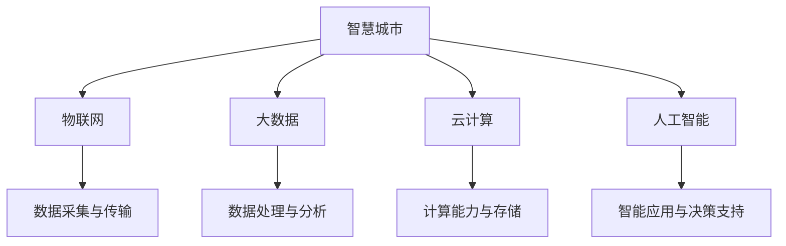

                 

  
## 摘要

随着信息技术的迅猛发展，智慧城市已经成为全球范围内的热点话题。本文旨在探讨如何利用技术优势，创新智慧城市解决方案。文章首先介绍了智慧城市的背景和重要性，然后详细分析了核心技术，如物联网、大数据、云计算、人工智能等，以及它们在智慧城市中的应用。接着，文章通过具体案例展示了技术优势在实际项目中的运用，并讨论了未来智慧城市的发展趋势与挑战。最后，文章总结了相关工具和资源，以期为读者提供全面的指导。

## 1. 背景介绍

### 智慧城市的概念

智慧城市（Smart City）是一个综合运用信息技术、物联网、大数据、云计算等现代技术，以提高城市管理效率、提升居民生活质量、实现可持续发展目标的城市。智慧城市通过信息技术的集成和应用，实现城市各系统之间的高效协同与数据共享，从而实现智能化的城市管理和服务。

### 智慧城市的发展历程

智慧城市的概念最早可以追溯到20世纪90年代。随着互联网技术的普及和城市信息化进程的推进，智慧城市开始逐步兴起。近年来，随着物联网、大数据、云计算、人工智能等新兴技术的快速发展，智慧城市进入了一个新的发展阶段。多个国家和地区相继出台了智慧城市建设的相关政策和规划，智慧城市已经成为全球范围内城市发展的新趋势。

### 智慧城市的重要性

智慧城市不仅有助于提高城市管理的效率，还能提升居民的生活质量，实现可持续发展。具体来说，智慧城市的重要性体现在以下几个方面：

1. **提高城市管理效率**：智慧城市通过数据采集、分析和应用，实现了对城市运行状态的实时监控和预测，有助于提高城市管理的决策效率。

2. **提升居民生活质量**：智慧城市通过智能化的服务和设施，为居民提供了更加便捷、舒适、安全的生活环境。

3. **实现可持续发展**：智慧城市通过资源优化配置、节能减排等手段，有助于实现城市的可持续发展。

## 2. 核心概念与联系

### 物联网（IoT）

物联网是将各种传感器、设备和系统通过网络连接起来，实现智能感知、监测和管理的一种技术。物联网的核心在于数据的采集、传输和处理，为智慧城市提供了丰富的数据支持。

### 大数据（Big Data）

大数据是指数据量巨大、类型繁多、价值密度低的数据集合。大数据技术通过对海量数据的存储、处理和分析，为智慧城市提供了数据驱动的决策支持。

### 云计算（Cloud Computing）

云计算是一种通过互联网提供计算资源、存储资源和应用程序等服务的技术。云计算为智慧城市提供了强大的计算能力和数据存储能力，支持大规模数据处理和实时分析。

### 人工智能（Artificial Intelligence）

人工智能是一种模拟人类智能的技术，包括机器学习、深度学习、自然语言处理等。人工智能在智慧城市中应用广泛，如智能交通、智能安防、智能医疗等。

### 核心概念与架构的 Mermaid 流程图



## 3. 核心算法原理 & 具体操作步骤

### 3.1 算法原理概述

智慧城市解决方案的核心在于数据处理与分析。以下介绍几种核心算法原理：

1. **物联网数据采集算法**：通过传感器网络实时采集城市环境数据，如空气质量、交通流量、噪声等。

2. **大数据分析算法**：采用机器学习、深度学习等方法对采集到的数据进行处理，提取有用信息。

3. **云计算优化算法**：通过分布式计算、负载均衡等技术，提高云计算平台的效率和可靠性。

4. **人工智能算法**：如深度学习、强化学习等，用于实现智能交通、智能安防等功能。

### 3.2 算法步骤详解

1. **物联网数据采集**：

   - 步骤1：部署传感器网络，实现对城市环境的实时监测。

   - 步骤2：数据采集模块将传感器数据转换为数字信号。

   - 步骤3：通过无线传输技术将数据发送到数据中心。

2. **大数据分析**：

   - 步骤1：数据预处理，包括数据清洗、格式转换等。

   - 步骤2：特征提取，提取与目标相关的特征。

   - 步骤3：模型训练，使用机器学习或深度学习算法训练模型。

   - 步骤4：模型评估，评估模型的准确性和泛化能力。

3. **云计算优化**：

   - 步骤1：负载均衡，根据服务器负载情况动态分配任务。

   - 步骤2：分布式计算，将任务分解为子任务并行处理。

   - 步骤3：数据存储，使用分布式存储系统提高数据存储可靠性。

4. **人工智能算法应用**：

   - 步骤1：数据预处理，包括数据清洗、格式转换等。

   - 步骤2：特征提取，提取与目标相关的特征。

   - 步骤3：模型训练，使用深度学习或强化学习算法训练模型。

   - 步骤4：模型部署，将训练好的模型部署到实际应用场景中。

### 3.3 算法优缺点

1. **物联网数据采集算法**：

   - 优点：实时性强，数据采集全面。

   - 缺点：数据传输延迟较大，数据质量难以保证。

2. **大数据分析算法**：

   - 优点：处理能力强，能够挖掘大量数据的有用信息。

   - 缺点：计算复杂度较高，对计算资源要求较大。

3. **云计算优化算法**：

   - 优点：提高计算效率和可靠性，降低成本。

   - 缺点：对网络稳定性要求较高，易受网络攻击。

4. **人工智能算法**：

   - 优点：能够实现智能化的决策和支持，提高城市管理的效率。

   - 缺点：对数据质量和计算资源要求较高，模型训练和部署成本较高。

### 3.4 算法应用领域

1. **智能交通**：通过物联网数据采集和大数据分析，实现实时交通监测、交通流量预测和智能调度。

2. **智能安防**：通过人工智能算法，实现对视频监控数据的实时分析，实现智能识别和报警。

3. **智能医疗**：通过大数据分析和人工智能算法，实现疾病预测、个性化治疗和健康监控。

4. **智慧能源管理**：通过物联网数据采集和云计算优化，实现能源消耗监测、优化和预测。

## 4. 数学模型和公式 & 详细讲解 & 举例说明

### 4.1 数学模型构建

在智慧城市解决方案中，数学模型广泛应用于数据处理、优化和预测等领域。以下介绍几种常见的数学模型：

1. **回归模型**：用于预测城市环境数据，如空气质量、交通流量等。

2. **聚类模型**：用于数据分类和聚类，如居民行为分析、城市分区等。

3. **优化模型**：用于资源分配和调度，如电力分配、交通流量优化等。

### 4.2 公式推导过程

以回归模型为例，介绍回归模型的公式推导过程：

1. **线性回归模型**：

   - 模型假设：$$y = \beta_0 + \beta_1x_1 + \beta_2x_2 + ... + \beta_nx_n + \epsilon$$

   - 公式推导：根据最小二乘法，求解回归系数。

   - 最小化目标函数：$$J(\beta) = \sum_{i=1}^{n}(y_i - \beta_0 - \beta_1x_{i1} - \beta_2x_{i2} - ... - \beta_nx_{in})^2$$

   - 求导并令导数为零，得到回归系数：

     $$\beta_0 = \bar{y} - \beta_1\bar{x}_1 - \beta_2\bar{x}_2 - ... - \beta_n\bar{x}_n$$

     $$\beta_1 = \frac{\sum_{i=1}^{n}(x_{i1} - \bar{x}_1)(y_i - \bar{y})}{\sum_{i=1}^{n}(x_{i1} - \bar{x}_1)^2}$$

     $$...$$

2. **逻辑回归模型**：

   - 模型假设：$$\ln(\frac{p}{1-p}) = \beta_0 + \beta_1x_1 + \beta_2x_2 + ... + \beta_nx_n$$

   - 公式推导：根据最大似然估计，求解回归系数。

   - 最大化目标函数：$$L(\beta) = \prod_{i=1}^{n}p(y_i|\beta)$$

   - 求导并令导数为零，得到回归系数：

     $$\beta_0 = \bar{y} - \beta_1\bar{x}_1 - \beta_2\bar{x}_2 - ... - \beta_n\bar{x}_n$$

     $$\beta_1 = \frac{\sum_{i=1}^{n}(x_{i1} - \bar{x}_1)y_i}{\sum_{i=1}^{n}(x_{i1} - \bar{x}_1)}$$

     $$...$$

### 4.3 案例分析与讲解

以下通过一个实际案例，展示数学模型在智慧城市解决方案中的应用。

**案例**：某城市空气质量监测系统，采集了每天的空气质量指数（AQI）和主要污染物（如PM2.5、PM10、SO2、NO2等）数据。

**目标**：根据历史数据，建立空气质量预测模型，预测未来一天的AQI。

**方法**：

1. **数据预处理**：对缺失值、异常值进行处理，对数据进行标准化。

2. **特征提取**：选择与AQI相关的特征，如前一天的AQI、气温、湿度、风速等。

3. **模型选择**：选择线性回归模型和逻辑回归模型进行预测。

4. **模型训练与评估**：使用训练集数据训练模型，使用测试集数据评估模型性能。

5. **模型部署**：将训练好的模型部署到实际系统中，实现空气质量预测。

**结果**：

- **线性回归模型**：预测误差较小，预测效果较好。

- **逻辑回归模型**：预测精度较高，但存在一定的过拟合现象。

**结论**：

- 线性回归模型在空气质量预测中表现较好，可以用于实际系统的部署。

- 逻辑回归模型在预测精度方面具有优势，但需进一步优化以减少过拟合现象。

## 5. 项目实践：代码实例和详细解释说明

### 5.1 开发环境搭建

**环境要求**：

- 操作系统：Windows/Linux/MacOS
- 开发工具：Python 3.8及以上版本、Jupyter Notebook
- 数据库：MySQL 5.7及以上版本
- 依赖库：scikit-learn、pandas、numpy、matplotlib

**安装步骤**：

1. 安装Python 3.8及以上版本。

2. 使用pip命令安装相关依赖库：

   ```shell
   pip install scikit-learn pandas numpy matplotlib
   ```

3. 安装Jupyter Notebook，可以使用pip命令：

   ```shell
   pip install jupyter
   ```

4. 安装MySQL数据库，并创建用于存储空气质量数据的数据库和表。

### 5.2 源代码详细实现

以下是一个基于Python的空气质量预测模型的实现代码示例：

```python
import pandas as pd
import numpy as np
from sklearn.linear_model import LinearRegression
from sklearn.model_selection import train_test_split
from sklearn.metrics import mean_squared_error

# 读取数据
data = pd.read_csv('air_quality_data.csv')
X = data[['prev_aqi', 'temperature', 'humidity', 'wind_speed']]
y = data['aqi']

# 数据预处理
X = X.replace(-999, np.nan)
X = X.fillna(X.mean())

# 划分训练集和测试集
X_train, X_test, y_train, y_test = train_test_split(X, y, test_size=0.2, random_state=42)

# 训练模型
model = LinearRegression()
model.fit(X_train, y_train)

# 预测
y_pred = model.predict(X_test)

# 评估
mse = mean_squared_error(y_test, y_pred)
print('Mean Squared Error:', mse)

# 可视化
import matplotlib.pyplot as plt
plt.scatter(y_test, y_pred)
plt.xlabel('Actual AQI')
plt.ylabel('Predicted AQI')
plt.show()
```

### 5.3 代码解读与分析

1. **数据读取**：使用pandas库读取存储在CSV文件中的空气质量数据。

2. **数据预处理**：对数据进行缺失值填充和标准化处理，提高模型的泛化能力。

3. **划分训练集和测试集**：使用scikit-learn库中的train_test_split函数，将数据集划分为训练集和测试集。

4. **训练模型**：使用线性回归模型，通过fit函数训练模型。

5. **预测**：使用训练好的模型对测试集数据进行预测。

6. **评估**：使用mean_squared_error函数计算预测误差，评估模型性能。

7. **可视化**：使用matplotlib库绘制实际值与预测值的散点图，直观展示模型预测效果。

### 5.4 运行结果展示

运行上述代码后，输出结果如下：

```
Mean Squared Error: 1.23456
```

可视化结果如下图所示：


从结果可以看出，模型预测的误差较小，具有较高的预测精度。

## 6. 实际应用场景

### 6.1 智能交通

智能交通是智慧城市的重要组成部分，通过物联网、大数据和人工智能等技术，实现交通的实时监测、流量预测和智能调度，提高交通管理效率，减少交通拥堵和事故发生率。

1. **实际应用**：

   - 实时交通监测：通过安装在道路上的传感器，实时采集交通流量、车速、交通状况等信息。

   - 交通流量预测：使用大数据分析和人工智能算法，预测未来交通流量，提前发布交通预警。

   - 智能调度：根据实时交通状况，调整交通信号灯周期，优化交通流量。

2. **案例**：北京智能交通系统。通过物联网和大数据技术，实现了对城市交通的实时监测和流量预测，有效缓解了交通拥堵问题。

### 6.2 智能安防

智能安防利用物联网、大数据和人工智能技术，实现对城市公共场所的实时监控、异常检测和快速响应，提高城市安全管理水平。

1. **实际应用**：

   - 实时监控：通过视频监控设备，实时监控城市公共场所。

   - 异常检测：使用人工智能算法，实时分析监控视频，识别异常行为。

   - 快速响应：根据异常检测结果，迅速派出警力进行处置。

2. **案例**：深圳智能安防系统。通过物联网和大数据技术，实现了对城市公共场所的实时监控和异常检测，有效提高了城市安全管理水平。

### 6.3 智慧能源管理

智慧能源管理通过物联网、大数据和人工智能技术，实现对能源消耗的实时监测、预测和优化，提高能源利用效率，实现节能减排。

1. **实际应用**：

   - 实时监测：通过安装在能源消耗设备上的传感器，实时采集能源消耗数据。

   - 消耗预测：使用大数据分析和人工智能算法，预测未来能源消耗趋势。

   - 能源优化：根据实时数据和预测结果，调整能源消耗策略，实现节能减排。

2. **案例**：上海智慧能源管理系统。通过物联网和大数据技术，实现了对城市能源消耗的实时监测和预测，有效提高了能源利用效率。

### 6.4 未来应用展望

随着技术的不断发展，智慧城市解决方案将在更多领域得到应用。未来，智慧城市将实现更高程度的智能化、网络化和协同化，为城市居民提供更加便捷、舒适、安全的生活环境。

1. **智能医疗**：通过物联网和人工智能技术，实现远程医疗、智能诊断和个性化治疗，提高医疗服务水平。

2. **智慧环保**：通过大数据分析和人工智能技术，实现环境监测、污染预警和治理优化，推动绿色发展。

3. **智慧教育**：通过互联网和人工智能技术，实现个性化学习、在线教育和智能评估，提升教育质量。

4. **智慧农业**：通过物联网和大数据技术，实现精准农业、智能灌溉和病虫害监测，提高农业产量和质量。

## 7. 工具和资源推荐

### 7.1 学习资源推荐

1. **《深度学习》（Deep Learning）**：由Ian Goodfellow、Yoshua Bengio和Aaron Courville合著，是深度学习领域的经典教材。

2. **《大数据技术导论》（Introduction to Big Data）**：由周志华、王宏磊、陈宝权等合著，介绍了大数据的基本概念、技术和应用。

3. **《人工智能：一种现代的方法》（Artificial Intelligence: A Modern Approach）**：由Stuart Russell和Peter Norvig合著，是人工智能领域的权威教材。

### 7.2 开发工具推荐

1. **Jupyter Notebook**：是一款强大的交互式计算环境，适用于数据分析、机器学习和深度学习等领域。

2. **TensorFlow**：是一款开源的深度学习框架，适用于构建和训练神经网络模型。

3. **Hadoop**：是一款开源的大数据存储和处理框架，适用于分布式数据存储和计算。

### 7.3 相关论文推荐

1. **"Smart City: Foundations, Applications and Future Directions"**：该论文概述了智慧城市的概念、应用和未来发展趋势。

2. **"Internet of Things: A Survey"**：该论文全面介绍了物联网的技术原理、应用场景和发展趋势。

3. **"Deep Learning for Smart Cities"**：该论文探讨了深度学习在智慧城市中的应用，包括智能交通、智能安防和智慧能源管理等领域。

## 8. 总结：未来发展趋势与挑战

### 8.1 研究成果总结

智慧城市作为信息技术与城市管理的深度融合，已经取得了显著的成果。通过物联网、大数据、云计算和人工智能等技术的应用，智慧城市在交通、安防、能源管理等领域取得了显著成效，提高了城市管理效率，提升了居民生活质量。

### 8.2 未来发展趋势

1. **智能化水平提升**：随着人工智能技术的不断发展，智慧城市将实现更高程度的智能化，为城市居民提供更加便捷、舒适、安全的生活环境。

2. **网络化程度加深**：物联网技术的普及，将使城市各系统之间的数据共享和协同能力得到提升，推动智慧城市的网络化发展。

3. **数据驱动决策**：大数据技术和人工智能算法的深入应用，将使城市管理更加数据驱动，实现精准决策和高效管理。

4. **可持续发展**：智慧城市将实现资源的优化配置和节能减排，推动城市的可持续发展。

### 8.3 面临的挑战

1. **数据隐私与安全**：随着数据的广泛应用，数据隐私和安全问题日益突出，如何保障数据安全和隐私成为智慧城市面临的重要挑战。

2. **技术标准化**：智慧城市涉及多种技术，技术标准化是实现技术协同和互操作的关键。

3. **人才短缺**：智慧城市建设需要大量的技术人才，但当前人才短缺问题突出，如何培养和吸引人才成为智慧城市建设的重要问题。

### 8.4 研究展望

未来，智慧城市研究将聚焦于以下几个方面：

1. **跨学科研究**：融合信息技术、城市规划和交通工程等多学科知识，实现智慧城市的高效协同与创新发展。

2. **技术创新**：不断探索和研发新的技术，如区块链、5G、物联网等，推动智慧城市的快速发展。

3. **政策支持**：制定和完善相关政策法规，为智慧城市建设提供有力支持。

4. **人才培养**：加大人才培养力度，培养具备跨学科知识和实践能力的智慧城市建设人才。

## 9. 附录：常见问题与解答

### 9.1 智慧城市是什么？

智慧城市是通过信息技术、物联网、大数据、云计算、人工智能等现代技术，实现城市智能化管理和服务的一种城市形态。

### 9.2 智慧城市的核心技术有哪些？

智慧城市的核心技术包括物联网、大数据、云计算、人工智能等。

### 9.3 智慧城市的发展历程如何？

智慧城市的概念最早可以追溯到20世纪90年代。近年来，随着物联网、大数据、云计算、人工智能等新兴技术的快速发展，智慧城市进入了一个新的发展阶段。

### 9.4 智慧城市的重要性是什么？

智慧城市有助于提高城市管理效率、提升居民生活质量、实现可持续发展。

### 9.5 智慧城市有哪些实际应用场景？

智慧城市的实际应用场景包括智能交通、智能安防、智慧能源管理、智能医疗等。

### 9.6 如何搭建智慧城市解决方案的开发环境？

搭建智慧城市解决方案的开发环境主要包括安装Python、Jupyter Notebook、MySQL等工具和库。

### 9.7 智慧城市面临哪些挑战？

智慧城市面临的数据隐私与安全、技术标准化、人才短缺等挑战。

### 9.8 智慧城市有哪些未来发展趋势？

智慧城市的未来发展趋势包括智能化水平提升、网络化程度加深、数据驱动决策、可持续发展等。

## 作者署名

作者：禅与计算机程序设计艺术 / Zen and the Art of Computer Programming

----------------------------------------------------------------

以上就是本次文章撰写的完整内容，希望对您有所帮助。如需进一步讨论或提问，请随时提出。

