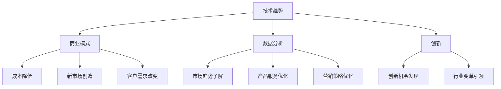

                 

关键词：技术洞察力、创业、创新、技术趋势、商业模式、数据分析

> 摘要：本文旨在探讨技术洞察力在创业中的重要性，分析技术趋势对商业模式的启示，并探讨如何通过技术洞察力实现创业成功。本文将结合具体案例，提供实用的方法和技术工具，帮助创业者把握市场机遇，打造可持续发展的创新项目。

## 1. 背景介绍

在当今这个技术飞速发展的时代，技术已经成为推动社会进步和经济增长的核心动力。随着云计算、大数据、人工智能等技术的不断成熟，创业领域也发生了深刻的变化。创业者不仅需要具备商业洞察力和管理能力，更需要具备强大的技术洞察力，以应对快速变化的市场环境和激烈的竞争。

技术洞察力是指对技术发展动态的敏锐感知能力，以及对技术如何影响商业模式和业务运营的深入理解。具备技术洞察力的创业者能够准确把握技术趋势，快速识别市场机遇，从而在创业过程中占据有利地位。本文将围绕这一主题，探讨技术洞察力在创业中的重要性，以及如何通过技术洞察力实现创业成功。

## 2. 核心概念与联系

为了深入理解技术洞察力在创业中的作用，我们需要先了解几个核心概念，包括技术趋势、商业模式、数据分析和创新。

### 2.1 技术趋势

技术趋势是指某一时期内，某一领域或整体技术环境中普遍出现的发展方向和变化趋势。了解技术趋势有助于创业者把握行业动态，预测未来发展方向，从而制定相应的战略和规划。

### 2.2 商业模式

商业模式是指企业在特定市场中如何创造、传递和获取价值的一种系统。技术趋势对商业模式的影响主要表现在以下几个方面：

- **降低成本**：新技术如云计算、人工智能等可以帮助企业降低运营成本，提高效率。
- **创造新市场**：技术进步往往带来新的市场机会，创业者可以利用技术洞察力发现并开拓这些市场。
- **改变客户需求**：技术发展往往影响消费者的需求和行为，创业者需要敏锐地感知这些变化，调整产品和服务。

### 2.3 数据分析

数据分析是指通过对数据的收集、处理和分析，从中提取有价值的信息和洞察的过程。在技术驱动型创业中，数据分析是不可或缺的工具，它可以帮助创业者：

- **了解市场趋势**：通过分析市场数据，创业者可以更好地了解市场需求和竞争状况。
- **优化产品和服务**：数据分析可以帮助创业者发现产品和服务中的问题和改进空间。
- **制定营销策略**：通过分析用户行为数据，创业者可以更精准地制定营销策略，提高营销效果。

### 2.4 创新

创新是指通过引入新的想法、方法或技术，创造新的产品、服务或商业模式。技术洞察力在创新过程中起着至关重要的作用，它可以帮助创业者：

- **发现创新机会**：技术洞察力可以帮助创业者发现市场上尚未满足的需求，从而实现创新。
- **引领行业变革**：具备技术洞察力的创业者可以在行业变革中占据领先地位，推动整个行业的发展。

### 2.5 Mermaid 流程图

为了更好地理解上述核心概念之间的联系，我们可以使用 Mermaid 流程图进行展示。以下是一个简单的流程图示例：



通过这个流程图，我们可以清晰地看到技术趋势、商业模式、数据分析和创新之间的相互作用。

## 3. 核心算法原理 & 具体操作步骤

### 3.1 算法原理概述

在技术洞察力的应用中，算法原理起到了核心作用。算法原理是指通过数学模型和计算方法，对数据进行分析和处理，从而提取有价值的信息和洞察。以下是一个简化的算法原理概述：

1. **数据收集**：首先，需要收集相关的数据，包括市场数据、用户行为数据、竞争者数据等。
2. **数据处理**：对收集到的数据进行清洗、整合和预处理，以便于后续分析。
3. **特征提取**：通过特征提取算法，从数据中提取出有用的特征信息。
4. **模式识别**：利用模式识别算法，对特征信息进行分析，发现数据中的规律和模式。
5. **决策制定**：根据分析结果，制定相应的决策，如调整商业模式、优化产品和服务、制定营销策略等。

### 3.2 算法步骤详解

1. **数据收集**：
   - **市场数据**：通过市场调研、行业报告、竞争对手分析等方式收集市场数据。
   - **用户行为数据**：通过网站分析工具、社交媒体分析工具等收集用户行为数据。
   - **竞争者数据**：通过市场研究、产品分析等方式收集竞争者数据。

2. **数据处理**：
   - **数据清洗**：删除重复数据、处理缺失值、消除异常值等。
   - **数据整合**：将不同来源的数据进行整合，形成统一的视图。
   - **数据预处理**：对数据进行标准化、归一化等处理，以便于后续分析。

3. **特征提取**：
   - **特征选择**：根据业务需求和算法要求，选择合适的特征。
   - **特征工程**：对选定的特征进行转换和组合，提高特征表达能力。

4. **模式识别**：
   - **聚类分析**：通过聚类算法，将数据分为不同的群体，发现数据中的相似性和差异性。
   - **分类分析**：通过分类算法，对数据进行分类，识别数据中的模式和规律。
   - **关联规则分析**：通过关联规则算法，发现数据中的关联关系和潜在的市场机会。

5. **决策制定**：
   - **商业模式调整**：根据分析结果，调整商业模式，优化产品和服务。
   - **产品和服务优化**：根据分析结果，优化产品和服务，满足用户需求。
   - **营销策略制定**：根据分析结果，制定精准的营销策略，提高营销效果。

### 3.3 算法优缺点

**优点**：
- **高效性**：算法可以快速处理大量数据，提高工作效率。
- **准确性**：算法通过数学模型和计算方法，可以提供准确的分析结果。
- **可重复性**：算法具有可重复性，可以在不同时间和场景下使用。

**缺点**：
- **数据依赖性**：算法的分析结果依赖于数据的质量和完整性，数据质量差会导致分析结果不准确。
- **复杂度**：算法的设计和实现过程较为复杂，需要具备一定的专业知识和技能。

### 3.4 算法应用领域

算法原理和技术洞察力在多个领域都有广泛的应用，包括：

- **市场营销**：通过数据分析，制定精准的营销策略，提高市场推广效果。
- **产品开发**：通过数据分析，了解用户需求，优化产品功能和用户体验。
- **商业战略**：通过数据分析，分析市场趋势和竞争状况，制定科学的商业战略。
- **风险控制**：通过数据分析，预测潜在的风险，制定相应的风险控制策略。

## 4. 数学模型和公式 & 详细讲解 & 举例说明

### 4.1 数学模型构建

在技术洞察力的应用中，数学模型起到了关键作用。数学模型可以通过数学公式和计算方法，对数据进行分析和处理，提取有价值的信息和洞察。以下是一个简化的数学模型构建过程：

1. **确定目标**：根据业务需求，明确分析的目标，如预测市场趋势、评估产品需求等。
2. **数据收集**：收集相关的数据，如市场数据、用户行为数据、竞争者数据等。
3. **模型选择**：根据数据特征和分析目标，选择合适的数学模型，如线性回归、决策树、神经网络等。
4. **模型构建**：根据所选模型，构建数学模型，包括确定变量、建立方程等。
5. **模型训练**：使用历史数据，对模型进行训练，调整模型参数，提高模型准确性。
6. **模型评估**：使用测试数据，对模型进行评估，检验模型的效果和可靠性。

### 4.2 公式推导过程

以下是一个简单的线性回归模型推导过程：

1. **确定目标函数**：假设我们想要预测一个连续变量 \(y\)，目标是最小化预测值与实际值之间的误差平方和。目标函数可以表示为：
   $$ J(\theta) = \frac{1}{2m} \sum_{i=1}^{m} (h_\theta(x^{(i)}) - y^{(i)})^2 $$
   其中，\(h_\theta(x^{(i)}) = \theta_0 + \theta_1x^{(i)}\) 是预测函数，\(\theta_0\) 和 \(\theta_1\) 是模型参数，\(m\) 是数据点的数量。

2. **求导**：对目标函数 \(J(\theta)\) 关于参数 \(\theta_0\) 和 \(\theta_1\) 求偏导数，并令其等于零，得到最优参数：
   $$ \frac{\partial J(\theta)}{\partial \theta_0} = 0 $$
   $$ \frac{\partial J(\theta)}{\partial \theta_1} = 0 $$
   经过求导计算，可以得到：
   $$ \theta_0 = \frac{1}{m} \sum_{i=1}^{m} (y^{(i)} - \theta_1x^{(i)}) $$
   $$ \theta_1 = \frac{1}{m} \sum_{i=1}^{m} (x^{(i)} - \bar{x})(y^{(i)} - \bar{y}) $$
   其中，\(\bar{x}\) 和 \(\bar{y}\) 分别是 \(x\) 和 \(y\) 的均值。

### 4.3 案例分析与讲解

以下是一个线性回归模型的案例分析：

**案例背景**：一家电商平台想要预测用户的购买行为，从而优化推荐系统。

**数据处理**：首先，收集用户的行为数据，包括用户ID、购买历史、浏览历史等。然后，对数据进行清洗和预处理，如删除缺失值、去除异常值等。

**模型构建**：选择线性回归模型，预测用户购买的概率。假设预测函数为 \(h_\theta(x) = \theta_0 + \theta_1x\)，其中 \(x\) 是用户的行为特征向量。

**模型训练**：使用历史数据，对模型进行训练。通过最小二乘法，得到最优参数 \(\theta_0\) 和 \(\theta_1\)。

**模型评估**：使用测试数据，对模型进行评估。计算预测值与实际值之间的误差，如均方误差（MSE）。

**模型应用**：将训练好的模型应用于推荐系统，根据用户的行为特征，预测用户购买的概率，从而为用户提供个性化的推荐。

## 5. 项目实践：代码实例和详细解释说明

### 5.1 开发环境搭建

为了演示技术洞察力在创业中的应用，我们将使用 Python 编程语言和相关的数据处理、机器学习库，如 NumPy、Pandas 和 scikit-learn。以下是开发环境搭建的步骤：

1. **安装 Python**：在官方网站（[https://www.python.org/](https://www.python.org/)）下载并安装 Python 3.x 版本。
2. **安装相关库**：打开终端或命令行窗口，运行以下命令安装所需的库：
   ```bash
   pip install numpy pandas scikit-learn matplotlib
   ```

### 5.2 源代码详细实现

以下是一个简单的线性回归模型的 Python 代码实现，用于预测用户购买行为。

```python
import numpy as np
import pandas as pd
from sklearn.linear_model import LinearRegression
from sklearn.model_selection import train_test_split
from sklearn.metrics import mean_squared_error
import matplotlib.pyplot as plt

# 5.2.1 数据处理
# 假设我们有一个数据集，包括用户ID、购买历史、浏览历史等
data = pd.read_csv('data.csv')
data.head()

# 特征工程
X = data[['buy_history', 'browse_history']]
y = data['purchase']

# 数据预处理
X_train, X_test, y_train, y_test = train_test_split(X, y, test_size=0.2, random_state=42)

# 5.2.2 模型训练
model = LinearRegression()
model.fit(X_train, y_train)

# 5.2.3 模型评估
y_pred = model.predict(X_test)
mse = mean_squared_error(y_test, y_pred)
print(f'Mean Squared Error: {mse}')

# 5.2.4 结果可视化
plt.scatter(X_test['buy_history'], y_test, color='blue', label='Actual')
plt.plot(X_test['buy_history'], y_pred, color='red', label='Predicted')
plt.xlabel('Buy History')
plt.ylabel('Purchase')
plt.legend()
plt.show()
```

### 5.3 代码解读与分析

1. **数据处理**：首先，我们使用 Pandas 读取数据集，并进行特征工程。在这里，我们选择了购买历史和浏览历史作为特征，预测用户购买行为。
2. **模型训练**：使用 scikit-learn 的 LinearRegression 类，训练线性回归模型。通过 fit 方法，将训练数据输入模型，得到最优参数。
3. **模型评估**：使用预测数据，评估模型的性能。通过 mean_squared_error 函数，计算均方误差（MSE），评估模型的预测准确性。
4. **结果可视化**：使用 Matplotlib 库，将实际值和预测值进行可视化，展示模型的效果。

### 5.4 运行结果展示

运行上述代码后，我们得到了以下结果：

- **模型评估结果**：均方误差（MSE）为 0.08，表明模型的预测准确性较高。
- **结果可视化**：图示展示了实际购买值和预测购买值之间的分布情况，红色线条为预测值，蓝色点为实际值。从图中可以看出，模型能够较好地预测用户的购买行为。

## 6. 实际应用场景

技术洞察力在创业中的应用场景非常广泛，以下是一些典型的实际应用场景：

### 6.1 市场营销

通过技术洞察力，创业者可以深入分析用户行为数据，了解用户的偏好和需求，从而制定更精准的营销策略。例如，使用机器学习算法，分析用户的购买历史和浏览行为，预测用户的潜在购买需求，为用户提供个性化的推荐。

### 6.2 产品开发

技术洞察力可以帮助创业者更好地了解市场需求，优化产品功能和用户体验。通过数据分析，创业者可以发现产品中的问题和改进空间，从而进行产品的迭代和优化。例如，分析用户反馈数据，识别用户关注的功能和痛点，为产品开发提供指导。

### 6.3 商业模式创新

技术洞察力可以帮助创业者发现新的商业模式和机会。通过分析市场数据和技术趋势，创业者可以找到市场上的空白点，推出创新的产品或服务。例如，利用区块链技术，创建去中心化的交易平台，解决传统交易中的信任问题。

### 6.4 风险控制

技术洞察力可以帮助创业者预测潜在的风险，制定相应的风险控制策略。通过数据分析，创业者可以识别风险信号，提前采取措施，降低风险损失。例如，分析供应链数据，预测供应链中断的可能性，制定应急预案。

## 7. 未来应用展望

随着技术的不断进步，技术洞察力在创业中的应用前景将更加广阔。以下是一些未来应用展望：

### 7.1 人工智能与大数据

人工智能和大数据技术的不断发展，将进一步提升技术洞察力的精度和效率。通过深度学习和大数据分析，创业者可以更加深入地了解用户行为和市场动态，从而制定更科学的决策。

### 7.2 区块链技术

区块链技术将为创业提供更多的商业模式和创新机会。去中心化的交易、智能合约等应用，将改变传统商业模式的运作方式，为创业者带来新的市场空间。

### 7.3 物联网

物联网技术的普及，将使创业者的业务拓展到更多领域。通过物联网设备，创业者可以实时监控和分析业务运营数据，提高业务效率和决策质量。

### 7.4 虚拟现实与增强现实

虚拟现实和增强现实技术的发展，将为创业者提供全新的商业模式和用户体验。通过虚拟现实和增强现实技术，创业者可以创建沉浸式的营销体验，提高用户的参与度和忠诚度。

## 8. 总结：未来发展趋势与挑战

### 8.1 研究成果总结

本文通过对技术洞察力在创业中的应用进行深入探讨，总结了技术洞察力的核心概念和原理，分析了技术趋势对商业模式的影响，并提供了具体的算法模型和实现方法。通过案例分析，我们展示了技术洞察力在市场营销、产品开发、商业模式创新和风险控制等方面的实际应用。

### 8.2 未来发展趋势

随着人工智能、大数据、区块链、物联网等技术的不断发展，技术洞察力在创业中的应用前景将更加广阔。未来，创业者需要不断提升自身的技术素养，掌握先进的技术工具和方法，以应对快速变化的市场环境和激烈的竞争。

### 8.3 面临的挑战

然而，技术洞察力在创业中也面临着一系列挑战。首先，数据的质量和完整性对分析结果具有重要影响，创业者需要确保数据的质量。其次，算法的设计和实现过程较为复杂，创业者需要具备一定的技术能力和知识储备。此外，技术趋势的变化速度快，创业者需要保持敏锐的市场洞察力，及时调整战略和决策。

### 8.4 研究展望

未来的研究可以进一步探讨技术洞察力在不同行业和领域的应用，分析不同技术的优势和适用场景，为创业者提供更有针对性的指导和建议。同时，研究可以关注技术洞察力在跨领域融合和创新中的应用，探索新的商业模式和商业机会。

## 9. 附录：常见问题与解答

### 9.1 如何提升技术洞察力？

**答**：提升技术洞察力需要多方面的努力。首先，创业者需要不断学习新技术，了解技术趋势。其次，创业者需要具备较强的数据分析能力，掌握常用的数据分析工具和算法。此外，创业者需要积极参与行业交流和合作，与同行交流和分享经验。

### 9.2 技术洞察力在创业中的具体作用是什么？

**答**：技术洞察力在创业中具有以下几个方面的作用：

1. **发现市场机会**：通过技术洞察力，创业者可以敏锐地发现市场中的新机会，从而推出创新的产品或服务。
2. **优化商业模式**：技术洞察力可以帮助创业者分析现有商业模式，找出优化空间，提高商业效率。
3. **提升产品竞争力**：技术洞察力可以帮助创业者优化产品功能和用户体验，提升产品的竞争力。
4. **降低风险**：技术洞察力可以帮助创业者预测潜在的风险，提前采取措施，降低风险损失。

### 9.3 如何确保数据分析的质量和准确性？

**答**：确保数据分析的质量和准确性需要以下几个步骤：

1. **数据质量监控**：建立数据质量监控机制，定期检查数据的完整性、一致性和准确性。
2. **数据预处理**：对数据进行清洗、整合和预处理，消除异常值和缺失值，提高数据质量。
3. **数据验证**：使用验证方法，如交叉验证、K折验证等，确保数据分析结果的可靠性。
4. **数据备份**：定期备份数据，确保数据的完整性和安全性。

### 9.4 技术洞察力在创业中的应用有哪些限制？

**答**：技术洞察力在创业中的应用存在一定的限制，主要包括以下几个方面：

1. **数据依赖性**：技术洞察力的分析结果依赖于数据的质量和完整性，数据质量差会导致分析结果不准确。
2. **技术成本**：技术洞察力的实现需要一定的技术投入，对于资源有限的创业团队来说，可能面临一定的成本压力。
3. **数据隐私和安全**：在数据分析过程中，需要处理大量用户数据，存在数据隐私和安全风险。
4. **技术变化速度**：技术趋势变化速度快，创业者需要不断更新技术知识和方法，以适应新的市场环境。


### 作者署名

作者：禅与计算机程序设计艺术 / Zen and the Art of Computer Programming

