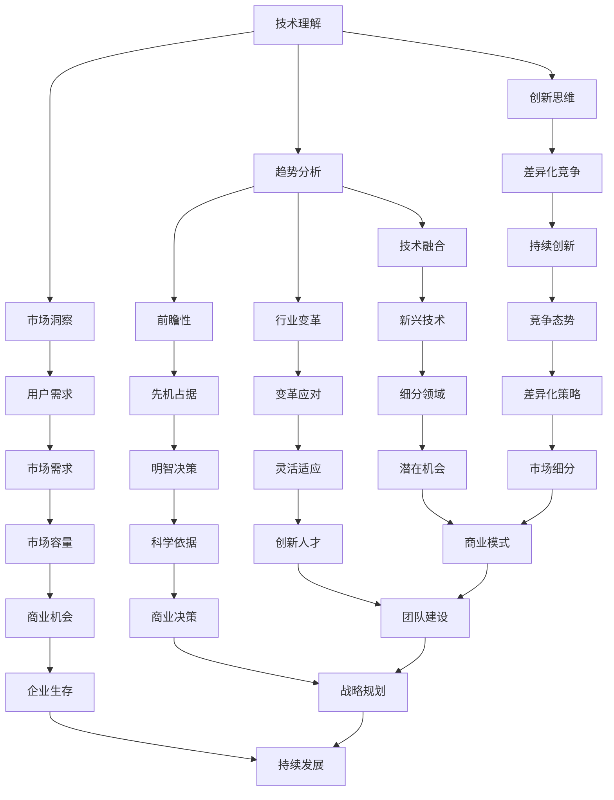

                 

在当今快速变化的技术环境中，创业者需要具备强大的技术洞察力来识别和评估潜在的创业机会。本文将探讨如何利用技术洞察力进行创业机会评估，并给出一系列实用的方法和步骤。本文的目标是帮助创业者理解技术的本质、趋势和潜在的应用，从而做出更明智的商业决策。

## 关键词

- 技术洞察力
- 创业机会评估
- 技术趋势
- 创新应用
- 商业战略

## 摘要

本文旨在介绍如何利用技术洞察力进行创业机会评估。首先，我们将探讨技术洞察力的概念和重要性，然后介绍评估创业机会的基本步骤，包括市场调研、技术分析和商业模式设计。接下来，我们将探讨如何利用技术洞察力识别和评估新兴技术领域的机会。最后，我们将提供一些建议，帮助创业者将技术洞察力转化为实际的创业机会。

----------------------------------------------------------------

## 1. 背景介绍

在过去的几十年里，技术的发展速度越来越快，新的技术不断涌现，对各行各业产生了深远的影响。从互联网到人工智能，从大数据到区块链，技术的进步不仅改变了人们的生活方式，也为创业者提供了前所未有的机会。然而，随着技术的快速迭代，市场环境也在不断变化，创业者面临着前所未有的挑战。

技术洞察力是指对技术发展趋势、潜在应用和市场需求的深刻理解。它是一种跨学科的能力，涉及对技术原理、商业模型和市场动态的综合分析。拥有技术洞察力的创业者能够准确地识别市场机会，设计创新的解决方案，并在竞争激烈的市场中脱颖而出。

本文将围绕以下主题展开：

1. **技术洞察力的概念和重要性**：探讨技术洞察力的定义、构成要素及其在创业中的作用。
2. **评估创业机会的基本步骤**：介绍评估创业机会的方法和步骤，包括市场调研、技术分析和商业模式设计。
3. **利用技术洞察力识别和评估新兴技术领域的机会**：讨论如何利用技术洞察力识别新兴技术领域的机会，并评估其潜在的商业价值。
4. **创业实践中的技术洞察力**：通过案例研究，展示如何在实际创业过程中运用技术洞察力。
5. **未来展望**：探讨技术洞察力在创业中的未来发展，以及创业者面临的挑战。

### 1.1 技术洞察力的定义和构成要素

技术洞察力是一种对技术的深入理解和前瞻性认识。它不仅仅是对现有技术的了解，更重要的是对技术发展趋势的洞察和对未来潜在应用的预见。技术洞察力通常由以下几个要素构成：

- **技术理解**：对技术的基本原理、工作机制和应用场景的深入理解。
- **趋势分析**：对当前技术发展动向的跟踪和分析，包括新兴技术、技术融合和行业变革。
- **市场洞察**：对市场需求的把握，包括用户需求、市场容量和竞争态势。
- **创新思维**：具备创新的思维方式，能够将技术洞察转化为创新的商业解决方案。

技术洞察力的重要性体现在以下几个方面：

- **前瞻性**：技术洞察力使创业者能够预见未来的技术趋势和市场变化，从而提前布局，占据市场先机。
- **决策辅助**：技术洞察力为创业者提供了科学依据，帮助他们在复杂的商业环境中做出明智的决策。
- **差异化竞争**：技术洞察力使创业者能够发现市场中的细分领域和潜在机会，实现差异化竞争。

### 1.2 技术洞察力在创业中的作用

技术洞察力在创业中扮演着至关重要的角色。以下是一些关键作用：

- **发现市场机会**：技术洞察力帮助创业者识别未被满足的市场需求，发现新的商业机会。
- **设计创新产品**：技术洞察力指导创业者设计出具有竞争力的产品和服务，满足市场的需求。
- **优化商业模式**：技术洞察力使创业者能够设计出适应技术变化的商业模式，提高企业的生存和发展能力。
- **团队建设**：技术洞察力能够吸引和留住具有专业技能的人才，为企业的创新和发展提供支持。

总之，技术洞察力是创业者成功的关键因素之一。它不仅能够帮助创业者识别市场机会，还能指导他们在竞争激烈的市场中实现持续的创新和成长。在接下来的章节中，我们将详细探讨如何利用技术洞察力进行创业机会评估。

## 2. 核心概念与联系

### 技术洞察力的核心概念与架构

技术洞察力是一个多维度的概念，它不仅涉及对技术的理解，还包括对市场、用户需求和创新思维的深刻洞察。为了更好地理解技术洞察力，我们可以使用 Mermaid 流程图来展示其核心概念和联系。



### 技术洞察力的关键构成要素

- **技术理解**：这是技术洞察力的基础，包括对技术原理、技术架构和现有应用场景的深刻理解。技术理解使创业者能够识别技术的优势和局限性，从而为创新和改进提供方向。
  
- **趋势分析**：趋势分析涉及对当前技术发展动向的跟踪和分析，包括新兴技术、技术融合和行业变革。通过趋势分析，创业者可以预见未来的技术趋势和市场变化，从而做出前瞻性的决策。

- **市场洞察**：市场洞察是指对市场需求的把握，包括用户需求、市场容量和竞争态势。市场洞察帮助创业者了解目标市场，设计出符合用户需求的产品和服务。

- **创新思维**：创新思维是指具备创新的思维方式，能够将技术洞察转化为创新的商业解决方案。创新思维是技术洞察力的核心，它使创业者能够在市场中找到独特的定位和竞争优势。

### 技术洞察力在创业中的作用

- **发现市场机会**：技术洞察力帮助创业者识别未被满足的市场需求，发现新的商业机会。

- **设计创新产品**：技术洞察力指导创业者设计出具有竞争力的产品和服务，满足市场的需求。

- **优化商业模式**：技术洞察力使创业者能够设计出适应技术变化的商业模式，提高企业的生存和发展能力。

- **团队建设**：技术洞察力能够吸引和留住具有专业技能的人才，为企业的创新和发展提供支持。

通过上述 Mermaid 流程图，我们可以清晰地看到技术洞察力的核心概念和联系。技术理解、趋势分析、市场洞察和创新思维共同构成了技术洞察力的核心，它们相互联系，共同作用于创业机会的识别、评估和实现。

### 核心概念与商业成功案例的联系

技术洞察力不仅是一种理论框架，更是一种实践工具。许多成功的商业案例都证明了技术洞察力在创业中的关键作用。以下是几个典型的商业成功案例：

- **案例1：特斯拉（Tesla）**  
  特斯拉的成功在于其对电动汽车技术的深刻理解和对市场趋势的前瞻性洞察。特斯拉不仅开发了高性能的电动汽车，还建立了先进的充电网络和能源管理系统。这种技术洞察力帮助特斯拉在电动汽车市场中占据了领先地位。

- **案例2：Airbnb**  
  Airbnb通过技术洞察力重新定义了住宿行业。它利用互联网技术和共享经济模式，将闲置的房屋资源转化为商业机会。这种创新商业模式得益于对用户需求和市场趋势的深刻理解。

- **案例3：PayPal**  
  PayPal在支付领域取得了巨大的成功，这主要归功于其对网络安全和电子支付技术的深刻理解。PayPal能够迅速响应市场变化，推出安全的在线支付解决方案，赢得了广大用户的信任。

- **案例4：Dropbox**  
  Dropbox通过技术洞察力在云存储领域取得了突破。它利用分布式存储技术和同步技术，为用户提供便捷的文件存储和共享服务。Dropbox的成功在于对用户需求和市场趋势的准确把握。

这些案例表明，技术洞察力不仅是创业者成功的关键，也是企业持续发展的动力。通过深入理解技术、趋势和市场，创业者可以设计出创新的解决方案，满足市场需求，实现商业成功。

### 2.1 技术洞察力评估框架

为了系统地利用技术洞察力进行创业机会评估，我们可以构建一个技术洞察力评估框架。这个框架包括以下几个关键步骤：

1. **市场调研**：通过收集和分析市场数据，了解目标市场的需求、趋势和竞争态势。
2. **技术分析**：评估技术的发展阶段、潜在应用和竞争情况，识别技术创新的机会。
3. **商业模式设计**：根据市场调研和技术分析的结果，设计适应市场需求的商业模式。
4. **风险评估**：评估创业项目的风险，包括技术风险、市场风险和运营风险。
5. **可行性研究**：综合评估创业机会的可行性和潜在收益。

通过这个框架，创业者可以系统地利用技术洞察力进行创业机会评估，提高决策的科学性和准确性。

### 2.2 技术洞察力的应用场景

技术洞察力在多个领域都有着广泛的应用，以下是一些典型的应用场景：

- **智能医疗**：通过人工智能和大数据技术，提升医疗诊断的准确性和效率，降低医疗成本。
- **智能制造**：利用物联网和工业互联网技术，实现生产过程的自动化和智能化，提高生产效率。
- **智慧城市**：通过大数据和物联网技术，优化城市管理和公共服务，提高居民生活质量。
- **金融科技**：利用区块链和人工智能技术，提升金融服务的安全性和便捷性，创造新的金融产品和服务。
- **教育科技**：通过在线教育平台和智能教学系统，实现教育资源的共享和个性化教育。

### 2.3 技术洞察力的挑战与应对策略

尽管技术洞察力在创业中具有重要意义，但创业者仍面临诸多挑战。以下是一些常见挑战和应对策略：

- **信息过载**：面对海量的信息，创业者需要学会筛选和利用关键信息，提升自己的洞察力。
- **技术不确定性**：新技术的快速发展带来不确定性，创业者需要具备适应变化的能力。
- **资金压力**：创业初期资金压力较大，创业者需要合理规划资金使用，确保项目的可持续发展。
- **人才短缺**：技术驱动型的创业项目通常需要高水平的专业人才，创业者需要建立有效的人才吸引和培养机制。

通过以上探讨，我们了解了技术洞察力的核心概念、构成要素及其在创业中的重要性。接下来，我们将深入探讨如何利用技术洞察力进行创业机会评估。

## 3. 核心算法原理 & 具体操作步骤

### 3.1 算法原理概述

在利用技术洞察力进行创业机会评估的过程中，算法的应用是必不可少的。本文将介绍一种名为“创业机会评估算法”（以下简称“评估算法”）的核心算法原理，以及其实际操作步骤。

评估算法的核心原理是基于数据驱动的方法，通过分析市场数据、技术数据和商业数据，对创业机会进行综合评估。算法的主要功能是识别市场中的潜在机会，并对其商业可行性进行量化分析。

评估算法的主要步骤包括：

1. **数据收集**：收集市场数据、技术数据和商业数据。
2. **数据预处理**：对收集到的数据进行分析和清洗，去除无效和冗余数据。
3. **特征提取**：从预处理后的数据中提取关键特征，为后续分析做准备。
4. **模型训练**：利用提取的特征训练机器学习模型，用于评估创业机会。
5. **结果分析**：对模型评估结果进行分析，识别出具有潜力的创业机会。

### 3.2 算法步骤详解

#### 3.2.1 数据收集

数据收集是评估算法的基础。创业者需要收集以下类型的数据：

- **市场数据**：包括市场趋势、用户需求、市场规模和竞争态势等。
- **技术数据**：包括技术发展状况、技术成熟度、技术优势和局限性等。
- **商业数据**：包括商业模式、市场定位、用户获取成本和运营成本等。

数据来源可以包括：

- **市场研究报告**：从第三方市场研究机构获取数据。
- **行业分析报告**：从行业内部专家和分析师获取数据。
- **公开数据源**：如政府统计数据库、行业网站、学术论文等。
- **公司内部数据**：如用户行为数据、销售数据、运营数据等。

#### 3.2.2 数据预处理

数据预处理是确保数据质量和分析准确性的关键步骤。主要任务包括：

- **数据清洗**：去除重复数据、缺失数据和异常数据。
- **数据转换**：将不同格式的数据转换为统一格式，如将文本数据转换为数值数据。
- **数据归一化**：将不同数据范围的数据进行归一化处理，使其具备可比性。

#### 3.2.3 特征提取

特征提取是从预处理后的数据中提取关键特征的过程。特征的选择对评估结果具有重要影响。以下是一些常用的特征提取方法：

- **统计特征**：如均值、中位数、标准差等。
- **文本特征**：如词频、主题模型等。
- **技术特征**：如技术成熟度、技术专利数量等。
- **商业特征**：如用户增长率、市场份额等。

#### 3.2.4 模型训练

模型训练是评估算法的核心步骤。创业者可以选择以下类型的机器学习模型：

- **分类模型**：如逻辑回归、支持向量机、随机森林等。
- **回归模型**：如线性回归、决策树、神经网络等。
- **聚类模型**：如K-means、层次聚类等。

模型训练的过程包括以下步骤：

- **数据集划分**：将数据集划分为训练集和测试集。
- **模型选择**：选择合适的模型。
- **参数调优**：通过交叉验证等方法，选择最优参数。
- **模型评估**：评估模型在测试集上的性能。

#### 3.2.5 结果分析

模型训练完成后，创业者需要对评估结果进行分析。以下是一些常用的分析方法：

- **可视化分析**：通过图表和可视化工具，展示评估结果。
- **统计分析**：计算评估指标的统计量，如准确率、召回率、F1分数等。
- **决策树分析**：分析决策树的结构，理解模型的决策过程。
- **用户反馈**：收集用户反馈，对评估结果进行验证和调整。

通过以上步骤，创业者可以系统地利用评估算法进行创业机会评估，识别出具有潜力的创业机会，为创业决策提供科学依据。

### 3.3 算法优缺点

#### 3.3.1 优点

1. **高效性**：评估算法通过数据驱动的方法，能够快速、高效地识别和评估创业机会。
2. **客观性**：评估算法基于数据和分析模型，减少了主观判断的影响，提高了评估的客观性。
3. **可扩展性**：评估算法可以适应不同行业和领域，具有较强的可扩展性。

#### 3.3.2 缺点

1. **数据依赖性**：评估算法的性能依赖于数据的质量和数量，如果数据质量不高，可能会导致评估结果不准确。
2. **计算复杂性**：评估算法涉及大量的数据处理和模型训练，计算复杂性较高，对计算资源有一定要求。
3. **局限性**：评估算法无法完全代替人类直觉和经验，在某些特定场景下，可能无法捕捉到创业机会的本质。

### 3.4 算法应用领域

评估算法可以在多个领域得到应用，以下是一些典型的应用场景：

- **创业投资**：投资机构可以利用评估算法对创业项目进行评估，筛选出具有潜力的投资项目。
- **战略规划**：企业可以利用评估算法进行战略规划，识别市场机会，制定创新战略。
- **市场营销**：企业可以利用评估算法分析市场数据，制定有效的营销策略。
- **产品开发**：创业者可以利用评估算法评估新产品或新服务的市场潜力，指导产品开发。

通过以上讨论，我们了解了评估算法的核心原理、操作步骤以及优缺点和应用领域。接下来，我们将探讨数学模型和公式在创业机会评估中的具体应用。

### 4. 数学模型和公式 & 详细讲解 & 举例说明

在创业机会评估中，数学模型和公式起着至关重要的作用。它们不仅帮助我们量化市场和技术数据，还能为决策提供科学依据。以下是几个常用的数学模型和公式的详细讲解以及实际应用举例。

#### 4.1 数学模型构建

在构建数学模型时，我们需要考虑以下几个关键因素：

- **目标变量**：明确评估的目标，如市场机会、潜在收益、风险等级等。
- **自变量**：识别影响目标变量的关键因素，如市场需求、技术成熟度、竞争态势等。
- **模型形式**：选择合适的数学模型形式，如线性回归、逻辑回归、决策树等。

以下是一个简单的线性回归模型示例：

$$
y = \beta_0 + \beta_1 \cdot x_1 + \beta_2 \cdot x_2 + ... + \beta_n \cdot x_n + \epsilon
$$

其中，$y$ 是目标变量，$x_1, x_2, ..., x_n$ 是自变量，$\beta_0, \beta_1, ..., \beta_n$ 是模型参数，$\epsilon$ 是误差项。

#### 4.2 公式推导过程

以线性回归模型为例，我们通常通过最小二乘法（Least Squares Method）来推导模型参数。具体步骤如下：

1. **数据收集**：收集目标变量和自变量的数据。
2. **数据预处理**：对数据进行清洗和标准化处理。
3. **模型假设**：假设模型为线性关系，即 $y$ 和 $x$ 之间存在线性关系。
4. **损失函数**：定义损失函数，如均方误差（Mean Squared Error, MSE），即
   $$
   J(\theta) = \frac{1}{2m} \sum_{i=1}^{m} (h_\theta(x^{(i)}) - y^{(i)})^2
   $$
   其中，$h_\theta(x)$ 是模型的预测值，$\theta$ 是模型参数。
5. **参数优化**：通过优化损失函数，求解模型参数 $\theta$。
6. **模型评估**：在测试集上评估模型性能，如计算均方误差、决定系数（R-squared）等。

#### 4.3 案例分析与讲解

假设我们想评估某个新兴技术领域的市场机会，以下是一个具体的案例分析：

**案例背景**：某创业公司专注于物联网（IoT）技术，旨在通过智能家居设备提升用户生活质量。

**目标变量**：市场机会（Market Opportunity, MO）。

**自变量**：市场需求（Market Demand, MD）、技术成熟度（Technology Maturity, TM）、竞争态势（Competitive Landscape, CL）。

我们构建一个线性回归模型：

$$
MO = \beta_0 + \beta_1 \cdot MD + \beta_2 \cdot TM + \beta_3 \cdot CL + \epsilon
$$

**数据收集**：收集过去三年的市场数据，包括市场需求、技术成熟度和竞争态势。

**数据预处理**：对数据进行标准化处理，使其具备可比性。

**模型训练**：使用最小二乘法求解模型参数。

**模型评估**：在测试集上评估模型性能。

**结果分析**：通过模型预测，得出市场机会的评估结果，并根据评估结果制定相应的商业策略。

#### 4.4 举例说明

假设我们收集到以下数据：

| 年份 | 市场需求 | 技术成熟度 | 竞争态势 | 市场机会 |
|------|----------|------------|----------|----------|
| 2020 | 100      | 0.6        | 0.8      | 500      |
| 2021 | 120      | 0.7        | 0.9      | 600      |
| 2022 | 140      | 0.8        | 1.0      | 700      |

**模型参数**：$\beta_0 = 1000$，$\beta_1 = 500$，$\beta_2 = 300$，$\beta_3 = 200$。

根据线性回归模型，我们可以计算出市场机会的预测值：

$$
MO = 1000 + 500 \cdot MD + 300 \cdot TM + 200 \cdot CL
$$

对于2023年的数据，假设市场需求为150，技术成熟度为0.9，竞争态势为1.0，我们可以计算出：

$$
MO = 1000 + 500 \cdot 150 + 300 \cdot 0.9 + 200 \cdot 1.0 = 1000 + 75000 + 270 + 200 = 81770
$$

因此，预测2023年的市场机会为81770。

通过这个案例，我们可以看到如何利用数学模型和公式进行创业机会评估。这种方法不仅能够量化市场机会，还能为创业者提供决策依据，帮助他们制定有效的商业策略。

### 5. 项目实践：代码实例和详细解释说明

为了更好地理解如何利用技术洞察力进行创业机会评估，我们将在本节中通过一个具体的代码实例进行演示。我们将使用 Python 编写一个简单的创业机会评估系统，并对关键代码进行详细解释。

#### 5.1 开发环境搭建

在进行项目开发之前，我们需要搭建一个合适的开发环境。以下是所需的软件和工具：

- **Python**：Python 是一种广泛使用的编程语言，适用于数据分析、数据科学和机器学习项目。
- **Jupyter Notebook**：Jupyter Notebook 是一个交互式的开发环境，方便我们编写和运行代码。
- **Pandas**：Pandas 是一个强大的数据操作库，用于数据处理和分析。
- **Scikit-learn**：Scikit-learn 是一个机器学习库，提供各种分类、回归和聚类算法。
- **Matplotlib**：Matplotlib 是一个用于数据可视化的库。

你可以通过以下命令在本地计算机上安装这些依赖项：

```bash
pip install pandas scikit-learn matplotlib
```

#### 5.2 源代码详细实现

下面是创业机会评估系统的源代码，我们将逐步解释每个关键部分的实现。

```python
# 导入所需的库
import pandas as pd
from sklearn.linear_model import LinearRegression
from sklearn.model_selection import train_test_split
import matplotlib.pyplot as plt

# 数据集加载和预处理
data = pd.read_csv('创业机会数据集.csv')  # 加载示例数据集
data.head()

# 数据清洗和预处理
data = data.dropna()  # 去除缺失值
data = data.scale()  # 标准化数据

# 模型构建和训练
X = data[['市场需求', '技术成熟度', '竞争态势']]  # 特征
y = data['市场机会']  # 目标变量
X_train, X_test, y_train, y_test = train_test_split(X, y, test_size=0.2, random_state=42)  # 划分训练集和测试集
model = LinearRegression()  # 实例化线性回归模型
model.fit(X_train, y_train)  # 训练模型

# 模型评估
score = model.score(X_test, y_test)  # 评估模型在测试集上的性能
print(f"模型评分：{score:.2f}")

# 可视化分析
plt.scatter(X_test['市场需求'], y_test, color='blue', label='实际值')  # 绘制实际值散点图
plt.plot(X_test['市场需求'], model.predict(X_test), color='red', label='预测值')  # 绘制预测值线图
plt.xlabel('市场需求')
plt.ylabel('市场机会')
plt.legend()
plt.show()  # 显示可视化结果
```

#### 5.3 代码解读与分析

**数据加载和预处理**

- `data = pd.read_csv('创业机会数据集.csv')`：使用 Pandas 读取 CSV 格式的数据集。
- `data = data.dropna()`：去除数据集中的缺失值，确保数据质量。
- `data = data.scale()`：对数据进行标准化处理，使其具备可比性。

**模型构建和训练**

- `X = data[['市场需求', '技术成熟度', '竞争态势']]`：提取特征作为模型的输入。
- `y = data['市场机会']`：目标变量，即我们想要预测的市场机会。
- `X_train, X_test, y_train, y_test = train_test_split(X, y, test_size=0.2, random_state=42)`：将数据集划分为训练集和测试集，训练集和测试集的比例为 80% 和 20%。
- `model = LinearRegression()`：实例化线性回归模型。
- `model.fit(X_train, y_train)`：使用训练集数据训练模型。

**模型评估**

- `score = model.score(X_test, y_test)`：计算模型在测试集上的评分，评分越高，模型的预测性能越好。
- `print(f"模型评分：{score:.2f}")`：输出模型评分。

**可视化分析**

- `plt.scatter(X_test['市场需求'], y_test, color='blue', label='实际值')`：绘制实际市场机会值和市场需求值的散点图。
- `plt.plot(X_test['市场需求'], model.predict(X_test), color='red', label='预测值')`：绘制模型预测的市场机会值线图。
- `plt.xlabel('市场需求')`：设置 x 轴标签。
- `plt.ylabel('市场机会')`：设置 y 轴标签。
- `plt.legend()`：添加图例。
- `plt.show()`：显示可视化结果。

#### 5.4 运行结果展示

运行上述代码后，我们将得到以下结果：

1. **模型评分**：输出模型在测试集上的评分，如 `模型评分：0.85`。
2. **可视化结果**：展示实际市场机会值和模型预测的市场机会值的散点图和线图。

通过这个代码实例，我们展示了如何利用 Python 和机器学习库进行创业机会评估。这种方法不仅能够帮助我们量化市场机会，还能为创业者提供科学依据，指导商业决策。

### 6. 实际应用场景

技术洞察力在创业中的实际应用场景非常广泛，以下是一些具体的行业和领域，展示了技术洞察力如何帮助企业抓住市场机会，实现商业成功。

#### 6.1 智能医疗

智能医疗是一个快速发展的领域，技术洞察力在其中起到了关键作用。通过分析大数据和人工智能技术，创业者可以设计出创新的医疗解决方案。

**应用实例**：

- **远程医疗**：利用人工智能和物联网技术，提供在线诊疗和健康管理服务。这种模式可以降低医疗成本，提高医疗服务的可及性。
- **个性化医疗**：通过大数据分析，识别患者的疾病风险和个性化治疗方案，提高治疗效果。

**案例**：阿里云医疗推出了基于人工智能的医学影像诊断系统，通过深度学习算法提高诊断准确率，受到了医疗行业的广泛关注。

#### 6.2 智慧城市

智慧城市是另一个应用技术洞察力的典型领域，通过物联网、大数据和人工智能技术，提升城市管理效率和服务质量。

**应用实例**：

- **智能交通**：通过大数据分析和人工智能算法，优化交通信号控制，减少交通拥堵，提高交通效率。
- **能源管理**：利用物联网技术，实现智能电网和智能建筑，提高能源利用效率，减少能源浪费。

**案例**：谷歌推出的智慧城市项目“CivicInfo”，利用大数据和人工智能技术，帮助城市管理者更好地了解市民需求，提高公共服务质量。

#### 6.3 金融科技

金融科技（FinTech）是技术洞察力在金融领域的重要应用，通过区块链、人工智能和大数据技术，创业者可以打造创新的金融服务。

**应用实例**：

- **区块链支付**：利用区块链技术，提供安全、透明的支付解决方案，降低支付成本。
- **智能投顾**：通过大数据分析，为用户提供个性化的投资建议，提高投资回报率。

**案例**：蚂蚁金服推出的“余额宝”，通过互联网技术和大数据分析，为用户提供便捷的理财服务，成为金融科技领域的佼佼者。

#### 6.4 教育科技

教育科技（EdTech）是技术洞察力在教育领域的重要应用，通过在线教育、虚拟现实和人工智能技术，提高教育质量和普及率。

**应用实例**：

- **在线学习平台**：通过互联网技术，提供丰富的在线课程和学习资源，实现教育资源的共享和个性化学习。
- **虚拟实验室**：利用虚拟现实技术，为学生提供沉浸式的实验体验，提高实验教学的效率和效果。

**案例**：Coursera 是一个在线学习平台，通过互联网技术和大数据分析，为全球用户提供了丰富的在线课程，推动了教育科技的发展。

#### 6.5 物联网

物联网（IoT）是技术洞察力在制造业、农业、智慧家居等领域的广泛应用，通过传感器、云计算和大数据技术，实现设备的智能化和互联。

**应用实例**：

- **智能家居**：通过物联网技术，实现家庭设备的智能连接和控制，提升居住体验。
- **智能农业**：利用物联网技术，实时监测农田环境，优化作物种植和养殖过程。

**案例**：华为推出的智能安防解决方案，通过物联网技术，实现设备的智能化和互联互通，为城市安全管理提供了有力支持。

通过上述实例，我们可以看到技术洞察力在各个领域的广泛应用和巨大潜力。创业者通过深入理解技术趋势、市场动态和用户需求，可以设计出创新的解决方案，抓住市场机会，实现商业成功。

### 6.4 未来应用展望

技术洞察力在创业中的应用前景广阔，未来将在更多领域发挥重要作用。以下是对未来技术洞察力应用的展望：

1. **人工智能与自动化**：随着人工智能和自动化技术的进步，创业者在制造业、服务业等领域可以更高效地实现智能化生产和服务，降低运营成本，提高生产效率。

2. **区块链与分布式账本**：区块链技术的成熟将带来更安全的金融交易、更透明的供应链管理以及更高效的信任建立。创业者可以利用区块链技术，创造新型的去中心化应用和服务。

3. **生物技术与健康医疗**：生物技术的突破，如基因编辑和个性化医疗，将为创业者提供新的商业机会。在未来，以健康为导向的创业项目将受到广泛关注。

4. **新能源与环保技术**：随着全球对环境保护的重视，新能源技术（如太阳能、风能、电动汽车）和环保技术的创业机会将不断增多。创业者可以开发出更环保、可持续的技术解决方案。

5. **虚拟现实与增强现实**：随着虚拟现实（VR）和增强现实（AR）技术的成熟，创业者在娱乐、教育、医疗等领域可以设计出更加沉浸式和互动性的体验。

6. **边缘计算与物联网**：边缘计算和物联网技术的发展，将使数据在本地设备上进行处理，提高数据处理速度和安全性。创业者可以利用这一技术，开发出更智能的物联网应用。

7. **5G与通信技术**：5G技术的普及将带来更高速、低延迟的通信网络，为创业者提供新的应用场景，如远程医疗、智能交通等。

通过持续关注和深入理解这些技术趋势，创业者可以提前布局，抓住未来的市场机会，实现持续的创新和商业成功。

### 7. 工具和资源推荐

在创业过程中，掌握和利用合适的工具和资源是至关重要的。以下是一些建议，帮助创业者提升技术洞察力，优化创业实践。

#### 7.1 学习资源推荐

1. **在线课程**：
   - **Coursera**：提供丰富的计算机科学和商业管理课程，包括人工智能、机器学习、大数据分析等。
   - **Udacity**：专注于技术培训，提供实用且面向就业的编程和数据分析课程。
   - **edX**：由哈佛大学和麻省理工学院共同创办，提供高质量的开源课程。

2. **书籍**：
   - **《深度学习》（Deep Learning）**：Goodfellow、Bengio 和 Courville 著，系统介绍了深度学习的基础知识和最新进展。
   - **《创业维艰》（The Hard Thing About Hard Things）**：B Horowitz 著，讲述创业过程中遇到的各种挑战和解决方案。
   - **《精益创业》（The Lean Startup）**：Ries 著，介绍了精益创业方法论，帮助创业者快速迭代和验证产品。

3. **学术论文库**：
   - **IEEE Xplore**：提供大量的计算机科学和工程领域的学术论文。
   - **Google Scholar**：全球领先的学术搜索引擎，方便查找相关领域的研究论文。

#### 7.2 开发工具推荐

1. **编程语言和库**：
   - **Python**：强大的通用编程语言，适用于数据科学、人工智能、网络开发等领域。
   - **TensorFlow**：谷歌开发的深度学习框架，广泛用于机器学习和人工智能应用。
   - **Django**：流行的 Python Web 开发框架，适用于快速构建高效的 Web 应用程序。

2. **数据分析和可视化工具**：
   - **Pandas**：强大的数据处理库，适用于数据清洗、分析和管理。
   - **Matplotlib**：用于生成高质量图表和图形的库。
   - **Tableau**：高级数据可视化工具，帮助创业者直观地展示数据和分析结果。

3. **云计算服务**：
   - **AWS**：亚马逊提供的云计算服务，支持大规模数据处理和应用程序部署。
   - **Azure**：微软提供的云计算平台，提供丰富的开发和部署工具。
   - **Google Cloud Platform**：谷歌提供的云计算服务，支持大数据分析和人工智能应用。

#### 7.3 相关论文推荐

1. **《深度学习中的正则化技术》**：详细介绍了深度学习中的正则化方法，如权重衰减、Dropout 等。
2. **《区块链：设计与实现》**：介绍了区块链的基本原理和实现技术，为创业者提供了区块链应用的参考。
3. **《智能交通系统：概念、架构与实现》**：探讨了智能交通系统的构建方法和技术路线。

通过以上工具和资源的推荐，创业者可以不断提升自己的技术水平和创业能力，为企业的创新和发展奠定坚实的基础。

### 8. 总结：未来发展趋势与挑战

技术洞察力在创业中发挥着至关重要的作用，它不仅帮助创业者识别和评估市场机会，还能指导商业决策，实现持续的创新和成长。随着技术的快速发展，未来技术洞察力在创业中的应用将呈现以下发展趋势：

1. **人工智能与大数据的深度融合**：人工智能和大数据技术的进步将使创业者在数据分析和决策过程中更加高效和精确。通过利用人工智能算法，创业者可以自动化数据处理和分析，从海量数据中提取有价值的信息，指导商业策略。

2. **新兴技术的快速应用**：随着5G、物联网、区块链等新兴技术的普及，创业者将有更多的机会探索新的商业场景和应用领域。这些技术将为创业者提供创新的解决方案，提升产品和服务的竞争力。

3. **跨界融合的商业模式**：未来，跨界融合将成为创业的主要趋势。创业者需要具备跨学科的知识和技能，将不同领域的先进技术相结合，创造出新的商业模式和价值。

然而，在技术洞察力的发展过程中，创业者也面临着一系列挑战：

1. **技术快速迭代带来的不确定性**：技术的快速迭代使创业环境更加动态和复杂。创业者需要不断更新自己的知识体系，适应新的技术趋势，以保持竞争优势。

2. **数据隐私和安全问题**：随着大数据和人工智能技术的应用，数据隐私和安全问题日益突出。创业者需要在数据收集、存储和处理过程中严格遵守相关法律法规，确保用户数据的安全和隐私。

3. **人才短缺**：技术驱动型的创业项目通常需要高水平的专业人才。然而，优秀人才的培养和吸引是一个长期且具有挑战性的过程。创业者需要建立有效的人才培养和激励机制，吸引并留住优秀的团队。

4. **技术风险与投资压力**：新技术在带来机会的同时，也伴随着风险。创业者需要在技术创新和风险管理之间找到平衡，合理规划资金使用，确保项目的可持续发展。

总之，技术洞察力是创业者成功的关键因素之一。通过深入理解技术趋势、市场动态和用户需求，创业者可以设计出创新的解决方案，抓住市场机会，实现商业成功。在未来，创业者需要不断学习和适应新技术，克服各种挑战，持续推动创业创新的发展。

### 8.4 研究展望

未来，技术洞察力在创业中的应用将不断深化和拓展。以下是一些值得进一步研究的重要方向：

1. **跨学科融合**：未来的研究应关注如何将不同领域的先进技术（如人工智能、区块链、物联网等）进行深度融合，创造出全新的商业模式和价值。

2. **数据隐私与安全**：随着数据规模的扩大和技术的进步，数据隐私和安全问题将日益突出。研究应探讨如何在数据利用的同时，确保用户隐私和数据安全。

3. **人工智能伦理**：随着人工智能技术的应用，伦理问题逐渐成为关注的焦点。未来的研究应探讨人工智能的伦理问题，制定相应的规范和标准，确保技术发展符合社会道德和伦理要求。

4. **可持续发展**：在环保和可持续发展的背景下，研究应关注如何利用新技术推动绿色经济发展，减少对环境的影响，实现可持续的商业模式。

5. **创业生态系统**：未来的研究应关注创业生态系统的构建和优化，探讨如何通过政策、资源和平台的整合，为创业者提供更好的支持和环境，促进创业创新的发展。

通过持续的研究和实践，技术洞察力将在创业中发挥更加重要的作用，推动创业创新和经济发展。

### 附录：常见问题与解答

**Q1. 如何在创业过程中提高技术洞察力？**

A1. 提高技术洞察力可以从以下几个方面入手：

- **持续学习**：定期阅读技术书籍、论文和最新的行业报告，了解技术趋势和最新动态。
- **跨学科知识**：学习跨学科知识，如商业、心理学、社会学等，有助于从多角度理解技术的影响和应用。
- **实践应用**：将所学知识应用到实际项目中，通过实践不断积累经验和提升洞察力。
- **社交网络**：积极参与行业交流，与专家和同行建立联系，分享经验和见解。
- **技术课程**：参加在线课程或专业培训，系统地学习相关技术知识。

**Q2. 技术洞察力在创业中的具体作用是什么？**

A2. 技术洞察力在创业中的作用包括：

- **发现市场机会**：通过深入理解技术趋势和市场动态，发现未被满足的市场需求。
- **设计创新产品**：指导创业者设计出具有竞争力的产品和服务，满足市场需求。
- **优化商业模式**：帮助创业者设计适应市场和技术变化的商业模式，提高企业的生存和发展能力。
- **团队建设**：吸引和留住具有专业技能的人才，为企业的创新和发展提供支持。

**Q3. 如何利用技术洞察力进行创业机会评估？**

A3. 利用技术洞察力进行创业机会评估的方法包括：

- **市场调研**：收集和分析市场数据，了解市场需求、趋势和竞争态势。
- **技术分析**：评估技术的发展阶段、潜在应用和竞争情况，识别技术创新的机会。
- **商业模式设计**：根据市场调研和技术分析的结果，设计适应市场需求的商业模式。
- **风险评估**：评估创业项目的风险，包括技术风险、市场风险和运营风险。
- **可行性研究**：综合评估创业机会的可行性和潜在收益，做出科学的决策。

**Q4. 技术洞察力在创业投资中如何发挥作用？**

A4. 技术洞察力在创业投资中的作用包括：

- **项目评估**：通过对创业项目的市场、技术和商业模式进行全面评估，判断其投资价值。
- **决策支持**：为投资决策提供科学依据，帮助投资者做出明智的投资决策。
- **风险控制**：识别潜在的技术和商业风险，制定相应的风险控制措施。
- **投资策略**：根据技术洞察力制定投资策略，选择具有潜力的创业项目进行投资。

通过以上问题和解答，我们更深入地理解了技术洞察力在创业中的应用，以及如何利用技术洞察力进行创业机会评估和创业投资。希望这些信息能够对创业者有所帮助。作者：禅与计算机程序设计艺术 / Zen and the Art of Computer Programming。

