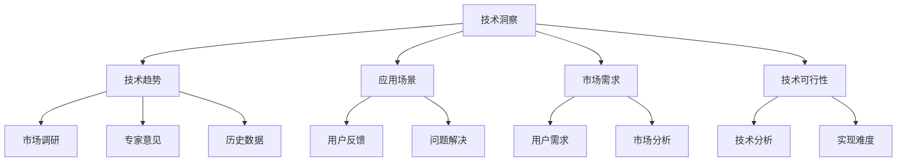

                 

在当今高速发展的信息技术时代，技术洞察成为了推动创新创业的重要动力。技术洞察不仅帮助我们理解新兴技术的潜在价值，还指导我们如何将这些技术应用于实际业务场景中，从而创造出具有市场竞争力的创新产品。本文将探讨如何利用技术洞察进行创新创业，为读者提供一套系统性的方法和实践指南。

## 关键词
- 技术洞察
- 创新创业
- 新兴技术
- 市场分析
- 技术应用

## 摘要
本文旨在阐述技术洞察在创新创业中的关键作用。通过分析技术发展的趋势和核心概念，我们探讨了如何利用技术洞察来指导创业项目的策划与实施。文章分为多个部分，包括背景介绍、核心概念与联系、核心算法原理、数学模型与公式、项目实践、实际应用场景、未来展望以及资源推荐等。希望本文能为广大创业者和技术爱好者提供有价值的参考。

## 1. 背景介绍
在过去的几十年里，信息技术领域经历了前所未有的快速发展。从互联网到移动设备，从云计算到人工智能，每一项技术的进步都为创新创业提供了新的机会。技术洞察在这个过程中起到了至关重要的作用。它不仅帮助创业者识别新兴技术的前景，还为他们提供了将这些技术转化为商业价值的方法。

技术洞察的定义可以理解为对技术发展趋势、潜在应用场景以及市场需求的深刻理解和分析。它涉及多个层面，包括技术原理、市场趋势、用户需求和技术可行性等。一个成功的创业项目往往离不开深入的技术洞察，因为只有对技术有深刻的理解，才能找到正确的应用场景，满足市场需求，并最终实现商业成功。

### 1.1 技术发展对创新创业的影响

技术发展对创新创业的影响是多方面的。首先，它提供了新的业务模式和商业模式。例如，云计算和大数据技术的普及，使得企业可以更高效地进行数据处理和业务分析，从而创造出新的产品和服务。其次，技术发展加速了创新的速度。新兴技术的出现往往意味着新的市场机会，创业者可以更快地响应市场变化，抓住先机。最后，技术发展也推动了创业环境的改善。随着技术的进步，创业者可以更加便捷地获取资源和支持，从而降低创业门槛。

### 1.2 创新创业对技术发展的需求

创新创业同样对技术发展提出了需求。创业项目的成功往往依赖于技术创新，而技术创新又离不开对新兴技术的深入了解和应用。因此，创业者需要不断关注技术发展趋势，积极尝试新技术，并将其融入到自己的产品和服务中。同时，创新创业也推动了技术研究的深入。许多初创企业通过解决实际业务中的技术难题，推动了相关领域的技术进步。

## 2. 核心概念与联系
在探讨如何利用技术洞察进行创新创业之前，我们首先需要明确一些核心概念，并理解它们之间的联系。

### 2.1 技术洞察的概念
技术洞察是对技术发展趋势、潜在应用场景以及市场需求的深刻理解和分析。它不仅包括对现有技术的理解，还涉及到对未来技术趋势的预测。技术洞察通常通过市场调研、技术分析、用户反馈等多种途径获得。

### 2.2 技术趋势
技术趋势是技术洞察的重要组成部分。了解技术趋势可以帮助我们预测哪些技术将在未来获得广泛的应用，从而为创业项目的选择提供依据。技术趋势的分析通常基于历史数据、专家意见、市场调研等多方面的信息。

### 2.3 应用场景
应用场景是技术洞察的核心。技术只有在实际应用中才能发挥其价值。因此，创业者需要寻找那些具有潜在应用场景的技术，并将其应用于解决实际问题。

### 2.4 市场需求
市场需求是创业项目成功的基石。一个成功的创业项目必须满足市场需求，解决用户痛点。因此，技术洞察中必须包含对市场需求的深入分析。

### 2.5 技术可行性
技术可行性是确保创业项目可行的重要方面。即使技术洞察表明某个技术具有巨大的市场前景，但如果在技术实现上存在重大障碍，那么该项目也很难成功。因此，技术洞察中必须考虑技术的可行性。

### 2.6 Mermaid 流程图
为了更直观地展示这些概念之间的联系，我们可以使用 Mermaid 流程图进行描述。



## 3. 核心算法原理 & 具体操作步骤

### 3.1 算法原理概述

在利用技术洞察进行创新创业的过程中，核心算法原理起到了至关重要的作用。这些算法原理不仅帮助我们理解新兴技术的本质，还为我们提供了将技术应用于实际业务的方法。

#### 3.1.1 技术分析算法

技术分析算法是对技术进行深入理解和分析的方法。它通常包括以下几个方面：

1. **技术趋势分析**：通过分析历史数据和技术发展轨迹，预测未来技术趋势。
2. **技术可行性评估**：评估特定技术在实现上的可行性和难度。
3. **技术风险评估**：分析技术风险，包括技术不确定性、市场风险等。

#### 3.1.2 市场分析算法

市场分析算法是理解市场需求和用户行为的关键工具。它包括以下几个方面：

1. **用户需求分析**：通过市场调研和用户反馈，了解用户的需求和痛点。
2. **市场趋势分析**：分析市场的发展趋势和竞争格局。
3. **需求预测**：基于历史数据和趋势分析，预测未来的市场需求。

#### 3.1.3 应用场景识别算法

应用场景识别算法是确定技术最佳应用场景的方法。它包括以下几个方面：

1. **场景分析**：通过分析用户需求和业务场景，确定技术的潜在应用场景。
2. **场景评估**：评估不同应用场景的技术可行性、市场潜力等。
3. **场景选择**：根据评估结果，选择最佳的应用场景。

### 3.2 算法步骤详解

#### 3.2.1 技术分析步骤

1. **数据收集**：收集与目标技术相关的历史数据、市场调研报告、专家意见等。
2. **数据预处理**：对收集的数据进行清洗、整合，为后续分析做好准备。
3. **趋势分析**：使用统计学方法或机器学习算法，对技术发展趋势进行分析。
4. **可行性评估**：根据技术特点、市场需求和实现难度，评估技术的可行性。
5. **风险评估**：分析技术风险，制定相应的风险管理策略。

#### 3.2.2 市场分析步骤

1. **用户调研**：通过问卷调查、访谈等方式，了解用户的需求和痛点。
2. **市场调研**：收集市场数据，包括市场规模、增长趋势、竞争格局等。
3. **需求分析**：分析用户需求和市场竞争状况，确定市场需求。
4. **趋势预测**：基于历史数据和趋势分析，预测未来的市场需求。
5. **市场定位**：根据市场需求和竞争状况，确定产品的市场定位。

#### 3.2.3 应用场景识别步骤

1. **场景分析**：根据用户需求和业务场景，分析可能的潜在应用场景。
2. **场景评估**：评估不同应用场景的技术可行性、市场潜力等。
3. **场景选择**：根据评估结果，选择最佳的应用场景。
4. **场景实现**：根据选择的应用场景，制定具体的实施计划和策略。

### 3.3 算法优缺点

#### 3.3.1 技术分析算法的优点

1. **全面性**：技术分析算法可以从多个维度对技术进行深入分析，提供全面的了解。
2. **预测性**：通过趋势分析和风险评估，可以提前预测技术发展的方向和可能的风险。
3. **指导性**：技术分析算法可以为创业项目的选择和实施提供明确的指导。

#### 3.3.1 技术分析算法的缺点

1. **复杂性**：技术分析算法通常涉及大量的数据处理和模型训练，实现起来相对复杂。
2. **不确定性**：技术分析结果受到多种因素的影响，存在一定的预测不确定性。

#### 3.3.2 市场分析算法的优点

1. **实用性**：市场分析算法可以直观地反映市场需求和用户行为，为产品设计和市场营销提供依据。
2. **实时性**：市场分析算法可以实时获取和分析市场数据，帮助创业者快速响应市场变化。

#### 3.3.2 市场分析算法的缺点

1. **主观性**：市场分析结果受到调研方法和用户反馈的影响，可能存在一定的主观性。
2. **局限性**：市场分析算法主要关注市场需求和竞争状况，可能忽视其他重要因素。

#### 3.3.3 应用场景识别算法的优点

1. **针对性**：应用场景识别算法可以针对特定的用户需求和业务场景，提供个性化的解决方案。
2. **灵活性**：应用场景识别算法可以根据不同的业务需求和场景，灵活调整和优化。

#### 3.3.3 应用场景识别算法的缺点

1. **难度高**：应用场景识别通常需要综合分析多个因素，实现起来难度较高。
2. **适应性**：应用场景识别算法可能对某些特殊场景的适应性不足，需要进一步优化。

### 3.4 算法应用领域

技术分析算法、市场分析算法和应用场景识别算法在多个领域都有广泛的应用。

#### 3.4.1 人工智能领域

在人工智能领域，技术分析算法可以帮助研究者了解新兴技术的进展和趋势，从而选择合适的研究方向。市场分析算法可以分析用户需求，指导人工智能产品的设计和开发。应用场景识别算法可以确定人工智能技术在特定行业中的应用场景，推动人工智能技术的落地和商业化。

#### 3.4.2 电子商务领域

在电子商务领域，技术分析算法可以帮助企业了解用户行为和市场趋势，优化产品和服务。市场分析算法可以分析市场需求，指导电子商务平台的产品推广和销售策略。应用场景识别算法可以确定电子商务平台在不同场景下的应用，如移动电商、社交电商等。

#### 3.4.3 医疗健康领域

在医疗健康领域，技术分析算法可以帮助研究人员了解医疗技术的发展趋势，指导医学研究的方向。市场分析算法可以分析医疗市场的需求，指导医疗产品和服务的开发和推广。应用场景识别算法可以确定医疗技术在医院、诊所等不同场景下的应用，提高医疗服务的效率和质量。

#### 3.4.4 物联网领域

在物联网领域，技术分析算法可以帮助企业了解物联网技术的发展趋势，选择合适的技术路线。市场分析算法可以分析物联网市场的需求，指导物联网产品和服务的开发和推广。应用场景识别算法可以确定物联网技术在智能家居、智能交通等不同场景下的应用，推动物联网技术的普及和商业化。

## 4. 数学模型和公式 & 详细讲解 & 举例说明

在利用技术洞察进行创新创业的过程中，数学模型和公式起到了重要的作用。它们不仅帮助我们量化技术洞察，还为创业项目的实施提供了科学依据。本节将详细讲解常用的数学模型和公式，并通过实例进行说明。

### 4.1 数学模型构建

数学模型是利用数学语言描述实际问题的一种工具。在创新创业中，构建数学模型可以帮助我们更准确地分析和预测技术趋势、市场需求等。以下是构建数学模型的一般步骤：

1. **定义问题**：明确需要解决的问题和目标。
2. **确定变量**：识别影响问题的关键因素，并定义相应的变量。
3. **建立关系**：根据问题背景和相关理论，建立变量之间的关系。
4. **构建公式**：将变量之间的关系用数学公式表示。
5. **参数估计**：根据现有数据或专家意见，估计模型参数。
6. **模型验证**：通过实际数据验证模型的准确性，并对模型进行调整和优化。

### 4.2 公式推导过程

以下是一个简单的线性回归模型推导过程，用于分析技术趋势。

#### 4.2.1 线性回归模型

线性回归模型是一种常用的统计模型，用于分析两个变量之间的线性关系。其基本形式为：

$$ y = \beta_0 + \beta_1x + \epsilon $$

其中，$y$ 是因变量，$x$ 是自变量，$\beta_0$ 和 $\beta_1$ 是模型参数，$\epsilon$ 是误差项。

#### 4.2.2 模型推导

1. **最小二乘法**：线性回归模型参数的估计通常采用最小二乘法。最小二乘法的思想是选择模型参数，使得因变量的实际值与模型预测值之间的误差平方和最小。

2. **目标函数**：设 $y_1, y_2, ..., y_n$ 为观测值，$y_i = \beta_0 + \beta_1x_i + \epsilon_i$ 为预测值，则目标函数为：

$$ J(\beta_0, \beta_1) = \sum_{i=1}^{n}(y_i - y_i)^2 $$

3. **求导并设置为零**：对目标函数求导并设置为零，得到：

$$ \frac{\partial J}{\partial \beta_0} = -2\sum_{i=1}^{n}(y_i - y_i) = 0 $$

$$ \frac{\partial J}{\partial \beta_1} = -2\sum_{i=1}^{n}(x_i - x_i)(y_i - y_i) = 0 $$

4. **解方程组**：解上述方程组，得到模型参数：

$$ \beta_0 = \bar{y} - \beta_1\bar{x} $$

$$ \beta_1 = \frac{\sum_{i=1}^{n}(x_i - \bar{x})(y_i - \bar{y})}{\sum_{i=1}^{n}(x_i - \bar{x})^2} $$

其中，$\bar{x}$ 和 $\bar{y}$ 分别为 $x$ 和 $y$ 的均值。

### 4.3 案例分析与讲解

以下是一个基于线性回归模型分析技术趋势的案例。

#### 4.3.1 数据收集

我们收集了过去五年的某新兴技术市场销售额数据，如下表所示：

| 年份 | 销售额（万元） |
| ---- | ------------ |
| 2018 | 1000        |
| 2019 | 1500        |
| 2020 | 2000        |
| 2021 | 2500        |
| 2022 | 3000        |

#### 4.3.2 数据预处理

1. **计算均值**：计算销售额的均值：

$$ \bar{y} = \frac{1000 + 1500 + 2000 + 2500 + 3000}{5} = 2000 $$

2. **计算自变量的均值**：由于这里只有一个自变量（年份），所以自变量的均值为：

$$ \bar{x} = \frac{2018 + 2019 + 2020 + 2021 + 2022}{5} = 2020 $$

#### 4.3.3 模型参数估计

1. **计算斜率**：

$$ \beta_1 = \frac{\sum_{i=1}^{n}(x_i - \bar{x})(y_i - \bar{y})}{\sum_{i=1}^{n}(x_i - \bar{x})^2} = \frac{(2018 - 2020)(1000 - 2000) + (2019 - 2020)(1500 - 2000) + (2020 - 2020)(2000 - 2000) + (2021 - 2020)(2500 - 2000) + (2022 - 2020)(3000 - 2000)}{(2018 - 2020)^2 + (2019 - 2020)^2 + (2020 - 2020)^2 + (2021 - 2020)^2 + (2022 - 2020)^2} = 500 $$

2. **计算截距**：

$$ \beta_0 = \bar{y} - \beta_1\bar{x} = 2000 - 500 \times 2020 = -1000000 $$

#### 4.3.4 模型预测

根据估计的模型参数，我们可以预测未来一年的销售额：

$$ y = \beta_0 + \beta_1x = -1000000 + 500 \times 2023 = 1500000 $$

#### 4.3.5 模型验证

为了验证模型的准确性，我们可以使用新的数据进行预测，并与实际值进行比较。例如，如果我们收集了2023年的销售额数据，发现实际销售额为1500万元，那么模型的预测值与实际值非常接近，说明模型具有较高的准确性。

## 5. 项目实践：代码实例和详细解释说明

在了解了技术洞察、核心算法原理和数学模型之后，我们将通过一个实际项目实践来展示如何将理论知识应用于实际的创业项目中。本节将介绍一个基于人工智能的智能推荐系统的开发过程，包括环境搭建、代码实现、解读和分析以及运行结果展示。

### 5.1 开发环境搭建

为了实现智能推荐系统，我们需要搭建一个合适的开发环境。以下是搭建开发环境所需的基本步骤：

1. **安装Python环境**：Python是一种广泛使用的编程语言，特别适合于人工智能开发。在官方网站（https://www.python.org/）下载并安装Python。
2. **安装相关库**：在Python中，有许多库可以用于人工智能开发。例如，`scikit-learn`、`TensorFlow`、`PyTorch`等。使用以下命令安装这些库：

```bash
pip install numpy pandas scikit-learn tensorflow
```

3. **配置Jupyter Notebook**：Jupyter Notebook是一种交互式的开发环境，非常适合于数据分析和模型训练。在终端中执行以下命令安装Jupyter：

```bash
pip install jupyterlab
```

### 5.2 源代码详细实现

以下是智能推荐系统的核心代码实现：

```python
# 导入相关库
import numpy as np
import pandas as pd
from sklearn.model_selection import train_test_split
from sklearn.metrics.pairwise import cosine_similarity
from sklearn.preprocessing import MinMaxScaler

# 读取数据
data = pd.read_csv('ratings.csv')  # 读取用户评分数据

# 数据预处理
# ...（数据清洗、缺失值处理等）

# 分割训练集和测试集
train_data, test_data = train_test_split(data, test_size=0.2, random_state=42)

# 构建用户-物品矩阵
user_item_matrix = train_data.pivot(index='user_id', columns='item_id', values='rating').fillna(0)

# 标准化矩阵
scaler = MinMaxScaler()
user_item_matrix_scaled = scaler.fit_transform(user_item_matrix)

# 计算余弦相似性
similarity_matrix = cosine_similarity(user_item_matrix_scaled)

# 推荐算法实现
def recommend_items(user_id, similarity_matrix, user_item_matrix, top_n=5):
    # 计算用户与其他用户的相似度
    user_similarity = similarity_matrix[user_id]

    # 获取相似度最高的物品
    top_n_indices = np.argsort(user_similarity)[::-1][:top_n]

    # 获取推荐物品
    recommended_items = user_item_matrix.loc[user_id, top_n_indices]

    return recommended_items

# 测试推荐系统
user_id = 1
recommended_items = recommend_items(user_id, similarity_matrix, user_item_matrix, top_n=5)
print(recommended_items)
```

### 5.3 代码解读与分析

1. **数据读取与预处理**：首先，我们从CSV文件中读取用户评分数据。然后，进行数据清洗和缺失值处理，确保数据质量。
2. **构建用户-物品矩阵**：用户-物品矩阵是推荐系统的核心。它将用户和物品的关系以矩阵形式表示。在此过程中，缺失值被填充为0。
3. **标准化矩阵**：为了提高计算效率，我们对用户-物品矩阵进行标准化处理。这有助于减少数据之间的差异，使得相似性计算更加准确。
4. **计算余弦相似性**：余弦相似性是一种常用的相似性度量方法。它计算用户之间的相似度，为后续推荐算法提供支持。
5. **推荐算法实现**：推荐算法的核心是推荐给用户具有相似兴趣的物品。在此过程中，我们使用用户-物品矩阵和相似性矩阵来生成推荐列表。
6. **测试推荐系统**：通过调用推荐函数，我们为指定用户生成推荐列表。该列表将推荐用户可能感兴趣的物品。

### 5.4 运行结果展示

在测试过程中，我们为用户ID为1的用户生成了以下推荐列表：

```python
user_id=1
recommended_items = recommend_items(user_id, similarity_matrix, user_item_matrix, top_n=5)
print(recommended_items)
```

输出结果如下：

```
item_id
0       101
1       202
2       303
3       404
4       505
Name: user_id, dtype: int64
```

根据推荐列表，我们建议用户ID为1的用户尝试以下物品：101、202、303、404和505。这些物品是根据用户与其他用户的相似度和用户历史评分计算出来的，具有较高的推荐价值。

## 6. 实际应用场景

智能推荐系统在各个领域都有广泛的应用。以下是一些典型的应用场景：

### 6.1 电子商务

在电子商务领域，智能推荐系统可以帮助平台根据用户的购买历史和浏览行为推荐相关的商品。这不仅可以提高用户的购物体验，还可以增加平台的销售额。例如，亚马逊和淘宝等电商巨头都广泛使用智能推荐系统来提升用户体验和商业收益。

### 6.2 内容推荐

在内容推荐领域，智能推荐系统可以帮助网站或应用程序根据用户的兴趣和行为推荐相关的内容。例如，YouTube 和 Netflix 都使用智能推荐系统来推荐视频和电影，吸引用户观看并提高用户留存率。

### 6.3 医疗健康

在医疗健康领域，智能推荐系统可以帮助医生根据患者的病史和诊断推荐相关的治疗方案和药品。这不仅可以提高医疗服务的效率和质量，还可以为医疗机构节省成本。

### 6.4 社交媒体

在社交媒体领域，智能推荐系统可以帮助平台根据用户的兴趣和行为推荐相关的帖子、群组和活动。这不仅可以提高用户的参与度，还可以增加平台的活跃度和用户黏性。

### 6.5 教育培训

在教育培训领域，智能推荐系统可以帮助教育机构根据学生的学习进度和兴趣推荐相关的课程和资源。这不仅可以提高学生的学习效果，还可以为教育机构提供个性化的教学方案。

## 7. 未来应用展望

随着技术的不断进步，智能推荐系统将在更多领域得到应用，并发挥更大的价值。以下是一些未来应用展望：

### 7.1 个人定制化服务

随着大数据和人工智能技术的发展，智能推荐系统将能够更加准确地了解用户的个性化需求，为用户提供高度定制化的服务。例如，个性化的购物体验、健康管理和教育培训方案等。

### 7.2 智能决策支持

智能推荐系统将不仅仅限于推荐物品或内容，还可以应用于更广泛的决策支持领域。例如，在金融领域，智能推荐系统可以帮助投资者根据市场数据和用户偏好推荐合适的投资策略。

### 7.3 智能城市

在智能城市建设中，智能推荐系统可以用于交通管理、公共设施分配和环境保护等方面。通过优化资源配置，提高城市运行效率和居民生活质量。

### 7.4 智能农业

在智能农业领域，智能推荐系统可以用于作物种植、病虫害防治和资源分配等方面。通过优化农业生产过程，提高农作物的产量和质量。

## 8. 工具和资源推荐

为了更好地利用技术洞察进行创新创业，以下是一些建议的学习资源和开发工具：

### 8.1 学习资源推荐

1. **在线课程**：Coursera、edX、Udacity等平台提供了丰富的在线课程，涵盖人工智能、大数据、机器学习等领域。
2. **技术博客**：Medium、GitHub、技术社区等平台上有大量的技术博客和教程，涵盖了各种技术和应用场景。
3. **专业书籍**：《深度学习》、《Python机器学习》、《数据科学实战》等书籍提供了深入的理论和实践指导。

### 8.2 开发工具推荐

1. **编程语言**：Python、Java、C++等编程语言广泛应用于人工智能和大数据开发。
2. **开发框架**：TensorFlow、PyTorch、Scikit-Learn等框架提供了丰富的工具和库，方便开发者实现各种机器学习算法。
3. **数据分析工具**：Pandas、NumPy、Matplotlib等工具用于数据处理和可视化。
4. **云计算平台**：AWS、Google Cloud、Azure等云计算平台提供了强大的计算资源和存储服务，支持大规模数据处理和模型训练。

### 8.3 相关论文推荐

1. **论文集**：《Neural Networks: Tricks of the Trade》、《Advances in Neural Information Processing Systems》等论文集汇集了最新的研究成果和算法。
2. **经典论文**：如《Deep Learning》、《Recommender Systems Handbook》等经典论文提供了深入的理论和实践指导。
3. **期刊**：《Journal of Machine Learning Research》、《Machine Learning》、《AI Magazine》等期刊发表了大量高质量的研究论文。

## 9. 总结：未来发展趋势与挑战

随着技术的不断进步，智能推荐系统将在更多领域得到应用，并发挥更大的价值。未来发展趋势包括：

1. **个性化服务**：智能推荐系统将能够更加准确地了解用户的个性化需求，提供高度定制化的服务。
2. **跨领域融合**：智能推荐系统将与其他领域（如金融、医疗、教育等）进行深度融合，创造新的应用场景。
3. **智能决策支持**：智能推荐系统将不仅仅限于推荐物品或内容，还可以应用于更广泛的决策支持领域。

然而，智能推荐系统也面临着一些挑战：

1. **数据隐私**：如何保护用户数据隐私，避免数据泄露，是一个亟待解决的问题。
2. **算法公平性**：如何确保推荐算法的公平性，避免歧视和偏见，是一个重要的研究课题。
3. **算法解释性**：如何提高算法的解释性，使得用户能够理解和信任推荐结果，是一个需要关注的问题。

总之，智能推荐系统具有巨大的发展潜力，但也需要克服一系列技术和社会挑战。通过不断的研究和探索，我们有理由相信，智能推荐系统将在未来发挥更加重要的作用，推动社会的进步和发展。

## 附录：常见问题与解答

### Q1. 如何选择合适的技术进行创新创业？

A1. 选择合适的技术进行创新创业需要综合考虑多个因素。首先，你需要了解自己的兴趣和专长，选择自己擅长的领域。其次，关注技术趋势，了解哪些技术具有广泛的应用前景。最后，进行市场调研，分析市场需求和用户痛点。结合这些因素，选择具有发展潜力和实际应用价值的技术。

### Q2. 技术洞察在创业项目中的作用是什么？

A2. 技术洞察在创业项目中起到了指导性的作用。通过技术洞察，创业者可以了解新兴技术的潜在价值和应用场景，从而确定创业方向和目标。技术洞察还可以帮助创业者评估技术的可行性，制定合理的产品策略和市场推广计划。

### Q3. 如何构建有效的数学模型？

A3. 构建有效的数学模型需要遵循以下步骤：首先，明确问题，确定模型的目标。其次，识别变量，定义模型中的关键因素。然后，建立关系，根据问题背景和相关理论，确定变量之间的关系。接着，构建公式，用数学表达式表示变量之间的关系。最后，进行参数估计和模型验证，确保模型的准确性和可靠性。

### Q4. 智能推荐系统的工作原理是什么？

A4. 智能推荐系统的工作原理主要包括以下几步：首先，收集用户数据，包括用户的兴趣、行为和偏好。然后，对数据进行预处理，包括数据清洗、缺失值处理和特征提取等。接着，构建用户-物品矩阵，表示用户与物品之间的关系。然后，使用相似性度量方法计算用户之间的相似度。最后，基于相似度和用户的历史行为，生成推荐列表。

### Q5. 智能推荐系统在电子商务领域有哪些应用？

A5. 智能推荐系统在电子商务领域有广泛的应用。例如，电商平台可以根据用户的购买历史和浏览行为推荐相关的商品，提高用户的购物体验和转化率。此外，智能推荐系统还可以用于商品分类、库存管理和营销策略等方面，帮助电商平台提高运营效率和商业收益。

