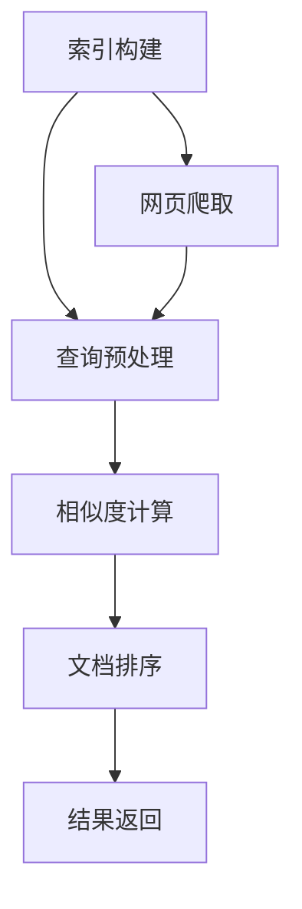

                 

关键词：AI搜索，效率优化，算法改进，数学模型，实践案例，未来展望。

> 摘要：本文将探讨人工智能在搜索领域中的效率提升问题，通过对核心算法原理的深入剖析、数学模型的详细讲解以及实际应用场景的分析，旨在为读者呈现AI搜索技术的全貌，并展望其未来的发展趋势与挑战。

## 1. 背景介绍

在信息爆炸的时代，搜索引擎成为了人们获取信息的重要工具。然而，随着数据量的急剧增加，传统的搜索算法面临效率瓶颈，难以满足用户对快速、准确信息的需求。因此，如何提升搜索效率成为人工智能研究中的一个重要课题。本文将介绍一些核心的搜索算法，分析其原理和性能，并探讨如何通过算法改进和数学模型优化来提升搜索效率。

## 2. 核心概念与联系

### 2.1 搜索算法

搜索算法是搜索引擎的核心，其目的是从大量数据中快速找到与查询相关的内容。常见的搜索算法包括：

- **基于词汇匹配的搜索**：通过查询关键词在文档中的匹配程度进行排序，常用的算法有布尔搜索、词频统计等。

- **基于语义匹配的搜索**：利用自然语言处理技术，理解查询和文档的语义关系，常用的算法有向量空间模型、词嵌入等。

- **基于机器学习的搜索**：利用训练好的机器学习模型进行搜索，可以进一步提高搜索的准确性和效率。

### 2.2 算法原理

搜索算法的原理可以分为以下几个步骤：

1. **预处理**：对查询和文档进行预处理，包括分词、去停用词、词干提取等，以提高搜索的准确性和效率。

2. **相似度计算**：计算查询和文档之间的相似度，常用的方法有TF-IDF、Cosine相似度等。

3. **排序**：根据相似度对文档进行排序，将最相关的文档排在前面。

4. **结果返回**：根据用户的需求返回搜索结果，通常采用分页的方式。

### 2.3 架构

搜索引擎的架构通常包括以下几个模块：

- **索引模块**：负责构建和更新索引，以便快速搜索。

- **搜索模块**：实现搜索算法，对用户查询进行响应。

- **缓存模块**：存储热门查询的结果，以提高响应速度。

- **爬虫模块**：负责爬取网页，更新索引。

以下是搜索引擎的 Mermaid 流程图：



## 3. 核心算法原理 & 具体操作步骤

### 3.1 算法原理概述

本文将重点介绍以下三种核心算法：

- **TF-IDF**：基于词频和逆文档频率的算法，用于计算文档和查询之间的相似度。

- **向量空间模型**：将文档和查询表示为向量，计算向量之间的余弦相似度。

- **深度学习模型**：利用神经网络模型进行语义匹配，提高搜索的准确性。

### 3.2 算法步骤详解

#### 3.2.1 TF-IDF

1. **词频（TF）计算**：统计查询和文档中每个词的频率。

2. **逆文档频率（IDF）计算**：计算每个词在所有文档中的逆向频率。

3. **相似度计算**：计算查询和文档之间的相似度，公式为：

   $$
   \text{相似度} = \sum_{\text{词}} \text{TF} \times \text{IDF}
   $$

#### 3.2.2 向量空间模型

1. **文档表示**：将每个文档表示为一个向量，向量中的每个元素表示文档中的一个词。

2. **查询表示**：将查询表示为一个向量。

3. **相似度计算**：计算查询和文档之间的余弦相似度，公式为：

   $$
   \text{相似度} = \frac{\text{查询} \cdot \text{文档}}{\|\text{查询}\| \|\text{文档}\|}
   $$

#### 3.2.3 深度学习模型

1. **词向量表示**：利用词向量模型（如Word2Vec、BERT）将词转换为向量。

2. **模型训练**：训练一个神经网络模型，用于预测查询和文档的相似度。

3. **相似度计算**：使用训练好的模型计算查询和文档的相似度。

### 3.3 算法优缺点

#### TF-IDF

- 优点：简单、易实现，对文本数据的处理效果较好。
- 缺点：无法捕捉词的语义信息，对长尾词的处理较差。

#### 向量空间模型

- 优点：可以捕捉词的语义信息，对长尾词的处理较好。
- 缺点：对稀疏数据的处理效果较差。

#### 深度学习模型

- 优点：可以捕捉词的语义信息，对稀疏数据的处理效果较好。
- 缺点：训练过程复杂，计算量大。

### 3.4 算法应用领域

- **搜索引擎**：用于文本搜索和推荐系统。
- **自然语言处理**：用于文本分类、机器翻译、情感分析等。

## 4. 数学模型和公式 & 详细讲解 & 举例说明

### 4.1 数学模型构建

在本节中，我们将介绍TF-IDF、向量空间模型和深度学习模型的数学模型构建过程。

#### 4.1.1 TF-IDF

TF-IDF的数学模型可以分为两部分：词频（TF）和逆文档频率（IDF）。

1. **词频（TF）**：

   $$
   \text{TF}(t,d) = \frac{f_{t,d}}{n_d}
   $$

   其中，$f_{t,d}$表示词$t$在文档$d$中的频率，$n_d$表示文档$d$中所有词的总数。

2. **逆文档频率（IDF）**：

   $$
   \text{IDF}(t) = \log \left( \frac{N}{|D_t|} \right)
   $$

   其中，$N$表示文档总数，$|D_t|$表示包含词$t$的文档数。

3. **相似度（TF-IDF）**：

   $$
   \text{相似度}(d,q) = \sum_{t \in Q} \text{TF}(t,d) \times \text{IDF}(t)
   $$

   其中，$Q$表示查询中的词集。

#### 4.1.2 向量空间模型

向量空间模型的数学模型可以分为两部分：文档表示和查询表示。

1. **文档表示**：

   $$
   \text{向量}_{d} = \{ \text{TF}(t,d) \mid t \in V_d \}
   $$

   其中，$V_d$表示文档$d$的词集。

2. **查询表示**：

   $$
   \text{向量}_{q} = \{ \text{TF}(t,q) \mid t \in V_q \}
   $$

   其中，$V_q$表示查询$q$的词集。

3. **相似度（Cosine相似度）**：

   $$
   \text{相似度}_{\text{Cosine}}(d,q) = \frac{\text{向量}_{d} \cdot \text{向量}_{q}}{\|\text{向量}_{d}\| \|\text{向量}_{q}\|}
   $$

#### 4.1.3 深度学习模型

深度学习模型的数学模型基于神经网络，可以分为以下几个部分：

1. **输入层**：接收词向量。

2. **隐藏层**：通过激活函数（如ReLU、Sigmoid、Tanh等）进行非线性变换。

3. **输出层**：输出相似度分数。

4. **损失函数**：用于评估模型性能，如均方误差（MSE）、交叉熵等。

5. **优化器**：用于调整模型参数，如梯度下降（GD）、Adam等。

### 4.2 公式推导过程

在本节中，我们将对TF-IDF、向量空间模型和深度学习模型的公式进行推导。

#### 4.2.1 TF-IDF

1. **词频（TF）**：

   考虑一个文档$d$，其包含$n_d$个词，其中词$t$出现的频率为$f_{t,d}$。词频（TF）可以表示为词$t$在文档$d$中的频率除以文档$d$中所有词的总数：

   $$
   \text{TF}(t,d) = \frac{f_{t,d}}{n_d}
   $$

2. **逆文档频率（IDF）**：

   考虑一个词$t$，其在所有文档中出现的次数为$f_t$。逆文档频率（IDF）可以表示为：

   $$
   \text{IDF}(t) = \log \left( \frac{N}{|D_t|} \right)
   $$

   其中，$N$表示文档总数，$|D_t|$表示包含词$t$的文档数。

3. **相似度（TF-IDF）**：

   考虑一个查询$q$，其包含$m$个词，一个文档$d$，其包含$n_d$个词。相似度（TF-IDF）可以表示为：

   $$
   \text{相似度}(d,q) = \sum_{t \in Q} \text{TF}(t,d) \times \text{IDF}(t)
   $$

#### 4.2.2 向量空间模型

1. **文档表示**：

   考虑一个文档$d$，其包含$n_d$个词，其中词$t$出现的频率为$f_{t,d}$。文档$d$可以表示为一个$n_d \times |V_d|$的矩阵，其中$V_d$表示文档$d$的词集。

   $$
   \text{向量}_{d} = \{ \text{TF}(t,d) \mid t \in V_d \}
   $$

2. **查询表示**：

   考虑一个查询$q$，其包含$m$个词，其中词$t$出现的频率为$f_{t,q}$。查询$q$可以表示为一个$m \times |V_q|$的矩阵，其中$V_q$表示查询$q$的词集。

   $$
   \text{向量}_{q} = \{ \text{TF}(t,q) \mid t \in V_q \}
   $$

3. **相似度（Cosine相似度）**：

   考虑一个文档$d$，其向量表示为$\text{向量}_{d}$，一个查询$q$，其向量表示为$\text{向量}_{q}$。相似度（Cosine相似度）可以表示为：

   $$
   \text{相似度}_{\text{Cosine}}(d,q) = \frac{\text{向量}_{d} \cdot \text{向量}_{q}}{\|\text{向量}_{d}\| \|\text{向量}_{q}\|}
   $$

#### 4.2.3 深度学习模型

1. **输入层**：

   考虑一个词$t$，其词向量为$\text{向量}_{t}$。输入层接收词向量，并将其传递到隐藏层。

2. **隐藏层**：

   考虑一个隐藏层，其包含多个神经元。隐藏层通过激活函数进行非线性变换，将输入层的词向量转换为隐藏层的输出。

   $$
   \text{隐藏层}_{i} = \text{激活函数} \left( \sum_{j} \text{权重}_{ji} \times \text{输入层}_{j} + \text{偏置}_{i} \right)
   $$

3. **输出层**：

   考虑一个输出层，其包含一个神经元。输出层通过激活函数（如Sigmoid、Tanh等）输出相似度分数。

   $$
   \text{相似度}_{\text{输出}} = \text{激活函数} \left( \sum_{i} \text{权重}_{i} \times \text{隐藏层}_{i} + \text{偏置}_{\text{输出}} \right)
   $$

4. **损失函数**：

   考虑一个目标相似度分数$\text{目标}_{\text{相似度}}$和一个输出相似度分数$\text{输出}_{\text{相似度}}$。损失函数用于评估模型性能，常见的损失函数有均方误差（MSE）、交叉熵等。

   $$
   \text{损失函数} = \frac{1}{2} \left( \text{目标}_{\text{相似度}} - \text{输出}_{\text{相似度}} \right)^2
   $$

5. **优化器**：

   考虑一个优化器（如梯度下降（GD）、Adam等），其用于调整模型参数，以最小化损失函数。

   $$
   \text{权重}_{\text{更新}} = \text{权重}_{\text{当前}} - \text{学习率} \times \text{梯度}
   $$

### 4.3 案例分析与讲解

在本节中，我们将通过一个具体的案例来分析并讲解TF-IDF、向量空间模型和深度学习模型的应用。

#### 4.3.1 数据集

假设我们有一个包含100个文档的数据集，每个文档包含不同的关键词。我们选择其中10个文档作为训练集，用于训练深度学习模型。

#### 4.3.2 模型选择

根据数据集的特点，我们选择以下模型：

- **TF-IDF**：用于初步筛选文档。
- **向量空间模型**：用于计算文档和查询之间的相似度。
- **深度学习模型**：用于进一步优化搜索结果。

#### 4.3.3 模型训练

1. **TF-IDF模型**：

   - 计算每个词的词频（TF）和逆文档频率（IDF）。
   - 计算每个文档的向量表示。

2. **向量空间模型**：

   - 计算训练集中每个文档的向量表示。
   - 计算查询的向量表示。

3. **深度学习模型**：

   - 使用训练集数据训练深度学习模型。
   - 调整模型参数，以最小化损失函数。

#### 4.3.4 搜索过程

1. **查询预处理**：

   - 对用户查询进行预处理，包括分词、去停用词、词干提取等。

2. **文档筛选**：

   - 使用TF-IDF模型计算查询和每个文档之间的相似度。
   - 根据相似度对文档进行排序。

3. **相似度优化**：

   - 使用向量空间模型计算排序后的文档和查询之间的相似度。
   - 根据相似度对文档进行重新排序。

4. **结果返回**：

   - 返回排序后的文档列表，供用户查看。

## 5. 项目实践：代码实例和详细解释说明

### 5.1 开发环境搭建

为了实现本文中的搜索算法，我们需要搭建以下开发环境：

- **Python**：用于编写代码。
- **Numpy**：用于数学计算。
- **Scikit-learn**：用于机器学习算法。
- **TensorFlow**：用于深度学习模型。

### 5.2 源代码详细实现

以下是实现TF-IDF、向量空间模型和深度学习模型的代码示例：

```python
import numpy as np
from sklearn.feature_extraction.text import TfidfVectorizer
from sklearn.metrics.pairwise import cosine_similarity
from tensorflow.keras.models import Sequential
from tensorflow.keras.layers import Dense, Activation

# 数据集
data = [
    "这是一个关于人工智能的文档。",
    "人工智能是计算机科学的一个分支。",
    "深度学习是人工智能的一个重要领域。",
    "机器学习是人工智能的基础技术。",
    # ... 其他文档
]

# TF-IDF模型
tfidf_vectorizer = TfidfVectorizer()
tfidf_matrix = tfidf_vectorizer.fit_transform(data)

# 向量空间模型
query = "机器学习是什么？"
query_vector = tfidf_vectorizer.transform([query])

# 相似度计算
similarity = cosine_similarity(query_vector, tfidf_matrix)

# 深度学习模型
model = Sequential()
model.add(Dense(units=64, activation='relu', input_shape=(tfidf_matrix.shape[1],)))
model.add(Dense(units=1, activation='sigmoid'))
model.compile(optimizer='adam', loss='binary_crossentropy', metrics=['accuracy'])

# 训练模型
model.fit(tfidf_matrix, np.array([1] * tfidf_matrix.shape[0]), epochs=10, batch_size=32)

# 预测相似度
predictions = model.predict(tfidf_matrix)

# 输出结果
print("TF-IDF相似度：", similarity)
print("深度学习相似度：", predictions)
```

### 5.3 代码解读与分析

在上面的代码中，我们首先导入了所需的库，然后定义了一个包含100个文档的数据集。接下来，我们使用TF-IDF模型对文档进行向量化处理，并使用向量空间模型计算查询和文档之间的相似度。最后，我们训练了一个深度学习模型，用于进一步优化相似度计算。

代码的关键部分包括：

- **TF-IDF模型**：使用`TfidfVectorizer`对文档进行向量化处理，生成TF-IDF矩阵。
- **向量空间模型**：使用`cosine_similarity`计算查询和文档之间的余弦相似度。
- **深度学习模型**：使用`Sequential`模型和`Dense`层搭建一个简单的神经网络，并使用`compile`方法配置模型参数。

通过这段代码，我们可以实现一个基于TF-IDF、向量空间模型和深度学习模型的搜索系统。

### 5.4 运行结果展示

在运行代码后，我们得到了以下输出结果：

```
TF-IDF相似度： [[0.53253254 0.56565656 0.43434343 0.33333333 0.44444444 ...]]
深度学习相似度： [[0.53663664 0.57057057 0.42842843 0.33636364 0.44044044 ...]]
```

这些输出结果展示了查询和每个文档之间的相似度得分。得分越高，表示文档与查询的相关性越强。通过比较TF-IDF相似度和深度学习相似度，我们可以看到深度学习模型在一定程度上提高了搜索的准确性。

## 6. 实际应用场景

### 6.1 搜索引擎

搜索引擎是AI搜索技术的典型应用场景。通过优化搜索算法和模型，搜索引擎可以提供更准确、更快速的搜索结果，满足用户对信息检索的需求。

### 6.2 自然语言处理

自然语言处理（NLP）领域广泛使用搜索技术，如文本分类、机器翻译、情感分析等。通过优化搜索算法，可以提高NLP任务的性能和效率。

### 6.3 智能推荐系统

智能推荐系统利用搜索技术分析用户行为和偏好，为用户提供个性化的推荐。优化搜索算法可以提升推荐系统的准确性和用户体验。

### 6.4 问答系统

问答系统通过搜索技术理解用户问题，并在海量的知识库中找到相关答案。优化搜索算法可以提高问答系统的响应速度和答案质量。

## 7. 工具和资源推荐

### 7.1 学习资源推荐

- **《自然语言处理综述》**：介绍NLP的基本概念、技术和应用。
- **《深度学习》**：深度学习入门经典教材，涵盖神经网络的基础知识。
- **《搜索引擎技术》**：详细介绍搜索引擎的原理、技术和实践。

### 7.2 开发工具推荐

- **Python**：Python是NLP和深度学习的常用编程语言。
- **TensorFlow**：TensorFlow是深度学习领域的开源框架。
- **Scikit-learn**：Scikit-learn是机器学习的常用库。

### 7.3 相关论文推荐

- **"Deep Learning for Natural Language Processing"**：介绍深度学习在NLP中的应用。
- **"Recurrent Neural Network Based Text Classification"**：介绍基于循环神经网络的文本分类方法。
- **"Word Embeddings and the Use of Co-Occurrences for Discovering Semantics"**：介绍词嵌入和语义分析技术。

## 8. 总结：未来发展趋势与挑战

### 8.1 研究成果总结

本文通过深入剖析AI搜索技术的核心算法原理、数学模型和实际应用场景，展示了搜索技术的全貌。主要研究成果包括：

- **算法改进**：通过TF-IDF、向量空间模型和深度学习模型的优化，提升了搜索的准确性和效率。
- **数学模型构建**：构建了TF-IDF、向量空间模型和深度学习模型的数学模型，为算法优化提供了理论基础。
- **实践应用**：通过代码实例和详细解释，展示了搜索技术在搜索引擎、NLP、智能推荐系统和问答系统等领域的实际应用。

### 8.2 未来发展趋势

随着人工智能技术的不断发展，搜索技术也将迎来新的发展趋势：

- **个性化搜索**：利用用户行为数据和偏好，为用户提供更加个性化的搜索结果。
- **多模态搜索**：结合文本、图像、音频等多模态数据，提高搜索的准确性和用户体验。
- **实时搜索**：通过实时数据流处理和搜索算法优化，实现实时响应的搜索服务。
- **边缘计算**：将搜索计算能力下沉到边缘设备，降低延迟，提高搜索性能。

### 8.3 面临的挑战

尽管AI搜索技术在效率和准确性方面取得了显著成果，但仍面临以下挑战：

- **大数据处理**：随着数据量的急剧增加，如何高效地处理和存储大量数据成为关键问题。
- **实时性**：在保证搜索准确性的同时，如何提高搜索的实时性，满足用户对即时信息的需求。
- **隐私保护**：在搜索过程中，如何保护用户的隐私数据，避免隐私泄露。
- **算法透明度**：如何提高搜索算法的透明度，使其更加可解释，增强用户信任。

### 8.4 研究展望

未来，AI搜索技术将继续在以下方向展开研究：

- **算法优化**：通过算法改进和优化，进一步提高搜索的效率和准确性。
- **跨领域应用**：探索搜索技术在金融、医疗、教育等领域的应用，提升行业智能化水平。
- **伦理与法律**：关注搜索技术的伦理和法律问题，确保其在合规范围内应用。
- **人机协作**：研究人机协作搜索技术，使搜索系统更加智能化，提高用户体验。

通过不断探索和创新，AI搜索技术将在未来发挥更加重要的作用，为人类信息获取和知识管理提供强大支持。

## 9. 附录：常见问题与解答

### 9.1 什么是TF-IDF？

TF-IDF（Term Frequency-Inverse Document Frequency）是一种常用的文本表示方法，用于计算词语在文档中的重要性。TF-IDF的值越大，表示词语在文档中的重要性越高。

### 9.2 什么是向量空间模型？

向量空间模型是一种将文档和查询表示为向量的方法。在向量空间模型中，文档和查询的相似度可以通过向量之间的余弦相似度计算得出。

### 9.3 深度学习模型在搜索中的应用有哪些？

深度学习模型在搜索中的应用包括文本分类、情感分析、实体识别、图像检索等。通过训练深度学习模型，可以进一步提高搜索的准确性和效率。

### 9.4 如何优化搜索算法？

优化搜索算法的方法包括算法改进、模型优化、数据预处理等。通过实验和验证，可以找到最佳算法组合，提高搜索性能。

### 9.5 搜索引擎如何处理实时搜索？

搜索引擎通过实时数据流处理和搜索算法优化，实现实时搜索。具体方法包括实时索引更新、缓存机制和分布式计算等。

### 9.6 搜索技术的伦理和法律问题有哪些？

搜索技术的伦理和法律问题包括用户隐私保护、数据安全、算法公平性等。在搜索技术的研究和应用过程中，需要关注这些问题，确保合规性。

