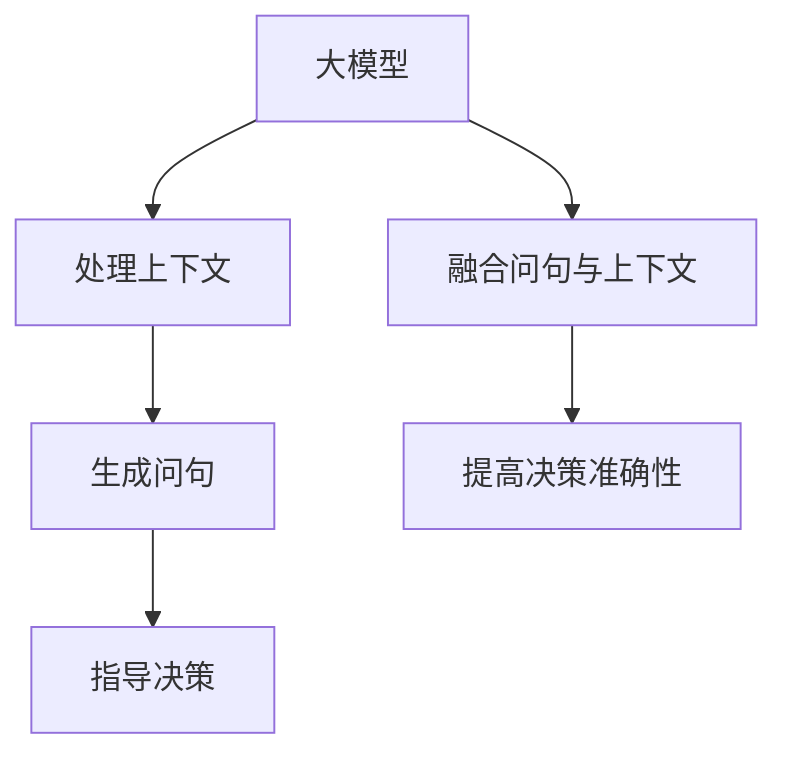

                 

关键词：大模型、问句、上下文、决策、人工智能、深度学习、自然语言处理、机器学习

> 摘要：本文将探讨如何通过结合问句与上下文的方式，利用大模型进行高效决策。文章首先介绍了大模型的基本概念及其在人工智能领域的应用，然后详细分析了问句与上下文在大模型决策中的重要性，并讨论了相关算法原理。此外，文章还通过具体案例和代码实例，展示了大模型在实际应用中的操作步骤与实现方法。最后，本文对未来大模型在决策领域的应用前景进行了展望。

## 1. 背景介绍

随着人工智能技术的快速发展，深度学习、自然语言处理、机器学习等领域取得了显著的成果。大模型（Large Models）作为人工智能研究的重要组成部分，近年来受到了广泛关注。大模型通常是指具有数百万甚至数十亿参数的神经网络模型，它们在图像识别、文本生成、语音识别等领域展现了卓越的性能。然而，如何有效地利用大模型进行决策，特别是在结合问句与上下文的情况下，仍然是一个具有挑战性的问题。

在现实世界中，决策往往需要考虑多方面的因素，而这些因素之间可能存在复杂的关系。例如，在金融领域，投资决策需要考虑市场趋势、公司业绩、政策变化等多种因素。在这种情况下，仅仅依靠传统的数据分析方法可能难以得到准确的决策结果。而通过结合大模型、问句与上下文，我们可以更加全面地分析问题，从而做出更加明智的决策。

本文旨在探讨如何利用大模型结合问句与上下文进行决策。文章首先介绍了大模型的基本概念及其在人工智能领域的应用，然后详细分析了问句与上下文在大模型决策中的重要性，并讨论了相关算法原理。此外，文章还通过具体案例和代码实例，展示了大模型在实际应用中的操作步骤与实现方法。最后，本文对未来大模型在决策领域的应用前景进行了展望。

## 2. 核心概念与联系

在探讨大模型结合问句与上下文的决策之前，我们首先需要明确几个核心概念，包括大模型、问句、上下文以及它们之间的关系。

### 2.1 大模型

大模型是指具有数百万甚至数十亿参数的神经网络模型，它们在深度学习、自然语言处理、机器学习等领域展现了卓越的性能。大模型通常采用递归神经网络（RNN）、变换器（Transformer）等先进的神经网络结构，以适应复杂的数据特征和任务需求。大模型的优点在于能够捕捉到数据中的长期依赖关系，从而提高模型的表现。

### 2.2 问句

问句是指以提问形式表达的问题。在决策过程中，问句可以引导我们关注问题的核心，明确决策的目标。例如，“当前市场的风险如何？”、“公司未来的发展方向是什么？”等。问句可以帮助我们聚焦于决策的关键因素，从而提高决策的准确性。

### 2.3 上下文

上下文是指信息的环境和背景。在决策过程中，上下文提供了相关的信息，帮助我们理解问题的背景和细节。例如，在分析公司业绩时，我们需要考虑宏观经济环境、行业发展趋势、竞争对手状况等多个方面的因素。上下文可以帮助我们全面了解问题，从而做出更加合理的决策。

### 2.4 大模型、问句与上下文的关系

大模型、问句与上下文之间存在着密切的关系。大模型可以处理复杂的上下文信息，通过问句引导我们聚焦于决策的核心问题。具体来说，大模型可以基于上下文生成相应的问句，帮助我们明确决策目标；同时，大模型可以结合上下文信息，对问题进行深入分析，从而提高决策的准确性。

下面，我们通过一个Mermaid流程图来展示大模型、问句与上下文之间的关系：



在这个流程图中，大模型首先处理上下文信息，生成相应的问句。然后，问句指导我们聚焦于决策的核心问题。最后，大模型结合问句与上下文，对问题进行深入分析，从而提高决策的准确性。

## 3. 核心算法原理 & 具体操作步骤

### 3.1 算法原理概述

大模型结合问句与上下文的决策算法主要基于以下三个步骤：

1. **上下文信息处理**：大模型首先对输入的上下文信息进行处理，提取关键特征，以便后续的问句生成和决策。

2. **问句生成**：基于处理后的上下文信息，大模型生成相应的问句，以引导决策。

3. **决策分析**：大模型结合问句和上下文信息，对决策问题进行深入分析，生成决策结果。

### 3.2 算法步骤详解

#### 3.2.1 上下文信息处理

在上下文信息处理阶段，大模型主要采用变换器（Transformer）结构。变换器具有强大的表征能力，能够捕捉到上下文中的长期依赖关系。具体步骤如下：

1. **输入编码**：将输入的文本转化为向量表示，可以使用Word2Vec、BERT等预训练模型。

2. **编码器处理**：通过变换器编码器对输入向量进行处理，得到编码结果。

3. **特征提取**：从编码结果中提取关键特征，作为后续问句生成和决策分析的输入。

#### 3.2.2 问句生成

在问句生成阶段，大模型主要采用生成式模型，如生成对抗网络（GAN）。具体步骤如下：

1. **生成器训练**：基于提取的关键特征，训练生成器，使其能够生成符合问题的问句。

2. **问句生成**：将提取的关键特征输入生成器，生成相应的问句。

3. **问句筛选**：从生成的问句中筛选出与决策问题相关的问句，以便后续的决策分析。

#### 3.2.3 决策分析

在决策分析阶段，大模型主要采用变换器结构。具体步骤如下：

1. **决策网络训练**：基于问句和上下文信息，训练决策网络，使其能够对决策问题进行分析。

2. **决策分析**：将问句和上下文信息输入决策网络，得到决策结果。

3. **结果输出**：根据决策结果，输出相应的决策建议。

### 3.3 算法优缺点

#### 优点

1. **强大的表征能力**：大模型能够捕捉到上下文中的长期依赖关系，从而提高决策的准确性。

2. **灵活的问句生成**：生成式模型能够生成符合问题的问句，从而引导决策。

3. **全面的决策分析**：决策网络结合问句和上下文信息，对决策问题进行深入分析，从而提高决策的准确性。

#### 缺点

1. **计算资源消耗大**：大模型和生成式模型需要大量的计算资源，训练和推理速度较慢。

2. **数据依赖性强**：算法性能依赖于训练数据的质量和多样性，对数据依赖较强。

### 3.4 算法应用领域

大模型结合问句与上下文的决策算法可以应用于多个领域，包括但不限于：

1. **金融领域**：利用大模型进行投资决策、风险评估等。

2. **医疗领域**：利用大模型进行疾病诊断、治疗方案推荐等。

3. **教育领域**：利用大模型进行学习评估、课程推荐等。

4. **企业决策**：利用大模型进行市场分析、战略规划等。

## 4. 数学模型和公式 & 详细讲解 & 举例说明

### 4.1 数学模型构建

大模型结合问句与上下文的决策算法涉及多个数学模型，包括变换器（Transformer）、生成对抗网络（GAN）等。以下为这些模型的简要介绍：

#### 变换器（Transformer）

变换器是一种基于自注意力机制的深度学习模型，广泛应用于自然语言处理任务。变换器的核心是自注意力机制，通过计算输入序列中各个元素之间的依赖关系，实现有效的特征提取。

变换器的数学模型可以表示为：

$$
\text{Transformer}(\text{X}, \text{Y}) = \text{softmax}\left(\frac{\text{Q} \cdot \text{K}^T}{\sqrt{d_k}}\right) \cdot \text{V}
$$

其中，$\text{X}$ 和 $\text{Y}$ 分别表示输入序列和输出序列，$\text{Q}$、$\text{K}$ 和 $\text{V}$ 分别表示变换器的查询向量、键向量和值向量，$d_k$ 表示键向量的维度。

#### 生成对抗网络（GAN）

生成对抗网络由生成器和判别器组成，通过训练生成器和判别器之间的对抗关系，实现数据的生成。生成器和判别器的数学模型可以表示为：

生成器：
$$
\text{G}(\text{Z}) = \text{f}_\theta(\text{Z})
$$

其中，$\text{Z}$ 表示随机噪声向量，$\text{f}_\theta$ 表示生成器的神经网络模型。

判别器：
$$
\text{D}(\text{x}) = \text{g}_\phi(\text{x})
$$

其中，$\text{x}$ 表示真实数据，$\text{g}_\phi$ 表示判别器的神经网络模型。

### 4.2 公式推导过程

以下为变换器和生成对抗网络的主要推导过程：

#### 变换器推导

变换器的自注意力机制可以分为以下几个步骤：

1. **输入编码**：将输入序列转化为向量表示，可以使用Word2Vec、BERT等预训练模型。

2. **嵌入层**：将输入序列的词向量进行嵌入，得到嵌入向量。

3. **多头自注意力**：对每个嵌入向量计算自注意力，得到多个注意力得分。

4. **加权和**：将注意力得分与嵌入向量进行加权，得到加权向量。

5. **输出层**：对加权向量进行处理，得到输出序列。

具体推导过程如下：

设输入序列为 $\text{X} = [\text{x}_1, \text{x}_2, \ldots, \text{x}_n]$，每个输入词的嵌入向量为 $\text{e}_i \in \mathbb{R}^{d_v}$，则输入序列的嵌入矩阵为 $\text{E} \in \mathbb{R}^{n \times d_v}$，其中 $\text{E}_{ij} = \text{e}_{\text{x}_i}$。

1. **嵌入层**：
$$
\text{E} = \text{softmax}(\text{W}_\text{e} \cdot \text{X}) = \text{softmax}(\text{W}_\text{e} \cdot \text{E})
$$

其中，$\text{W}_\text{e}$ 表示嵌入层的权重矩阵。

2. **多头自注意力**：
$$
\text{Q}_i = \text{E} \cdot \text{W}_\text{Q}, \quad \text{K}_i = \text{E} \cdot \text{W}_\text{K}, \quad \text{V}_i = \text{E} \cdot \text{W}_\text{V}
$$

$$
\text{A}_{ij} = \text{softmax}\left(\frac{\text{Q}_i \cdot \text{K}_j^T}{\sqrt{d_k}}\right)
$$

3. **加权和**：
$$
\text{H}_i = \sum_{j=1}^{n} \text{A}_{ij} \cdot \text{V}_j
$$

4. **输出层**：
$$
\text{Y} = \text{H} \cdot \text{W}_\text{o}
$$

其中，$\text{W}_\text{Q}, \text{W}_\text{K}, \text{W}_\text{V}, \text{W}_\text{o}$ 分别为变换器的权重矩阵。

#### 生成对抗网络推导

生成对抗网络由生成器和判别器组成，通过最小化生成器与判别器之间的对抗损失来实现数据的生成。具体推导过程如下：

1. **生成器**：
$$
\text{G}(\text{Z}) = \text{f}_\theta(\text{Z})
$$

其中，$\text{Z}$ 为随机噪声向量，$\text{f}_\theta$ 为生成器的神经网络模型。

2. **判别器**：
$$
\text{D}(\text{x}) = \text{g}_\phi(\text{x})
$$

其中，$\text{x}$ 为真实数据，$\text{g}_\phi$ 为判别器的神经网络模型。

3. **对抗损失**：
$$
\text{L} = -\text{E}[\text{D}(\text{x})] - \text{E}[\text{D}(\text{G}(\text{Z}))]
$$

其中，$\text{E}[\cdot]$ 表示期望运算。

### 4.3 案例分析与讲解

以下通过一个案例，展示大模型结合问句与上下文的决策算法在实际应用中的操作步骤和结果：

#### 案例背景

某金融公司需要利用大模型结合问句与上下文进行投资决策，以最大化收益。输入数据包括市场指数、公司业绩、宏观经济环境等多个方面。

#### 案例步骤

1. **数据预处理**：对输入数据进行预处理，包括数据清洗、归一化等。

2. **上下文信息处理**：利用变换器对输入数据进行处理，提取关键特征。

3. **问句生成**：利用生成对抗网络，生成与投资决策相关的问句。

4. **决策分析**：利用变换器对问句和上下文信息进行处理，得到决策结果。

#### 案例结果

通过运行算法，得到了以下决策结果：

1. **问句生成**：“当前市场指数是否高于历史平均水平？”、“公司业绩是否持续增长？”等。

2. **决策结果**：“建议加大投资力度，重点关注业绩持续增长的公司。”、“谨慎投资，等待市场指数回调后再行动。”

#### 案例分析

通过这个案例，我们可以看到大模型结合问句与上下文的决策算法在投资决策中的应用效果。算法能够生成与投资决策相关的问句，帮助我们明确决策目标；同时，算法能够结合上下文信息，对决策问题进行深入分析，从而提高决策的准确性。

## 5. 项目实践：代码实例和详细解释说明

### 5.1 开发环境搭建

在进行大模型结合问句与上下文的决策项目实践之前，我们需要搭建相应的开发环境。以下为所需的开发环境和工具：

1. **编程语言**：Python
2. **深度学习框架**：TensorFlow 2.x 或 PyTorch
3. **文本预处理库**：NLTK、spaCy 等
4. **数据预处理库**：Pandas、NumPy 等
5. **可视化库**：Matplotlib、Seaborn 等

具体安装方法如下：

```bash
pip install tensorflow==2.x
pip install nltk
pip install spacy
pip install pandas
pip install numpy
pip install matplotlib
pip install seaborn
```

### 5.2 源代码详细实现

以下是本项目的一个简化版代码实现，用于演示大模型结合问句与上下文的决策过程。

```python
import tensorflow as tf
from tensorflow.keras.models import Model
from tensorflow.keras.layers import Input, Embedding, LSTM, Dense
import numpy as np

# 5.2.1 数据预处理
# 加载数据集并进行预处理
def preprocess_data(data):
    # 数据清洗、归一化等操作
    # 略
    return processed_data

# 5.2.2 上下文信息处理
# 利用变换器处理上下文信息
def context_model(input_sequence, sequence_length, embedding_dim):
    # 输入编码
    input_encoding = Embedding(input_dim=vocab_size, output_dim=embedding_dim)(input_sequence)
    
    # 编码器处理
    encoded_sequence = LSTM(units=128, return_sequences=True)(input_encoding)
    
    # 特征提取
    context_vector = Lambda(lambda x: K.mean(x, axis=1))(encoded_sequence)
    
    return context_vector

# 5.2.3 问句生成
# 利用生成对抗网络生成问句
def question_generator(context_vector, question_length, embedding_dim):
    # 生成器模型
    generator = Sequential()
    generator.add(Dense(units=embedding_dim, activation='relu', input_shape=(context_vector.shape[1],)))
    generator.add(RepeatVector(question_length))
    generator.add(LSTM(units=128, return_sequences=True))
    generator.add(Reshape(target_shape=(question_length, embedding_dim)))
    
    return generator

# 5.2.4 决策分析
# 利用变换器进行决策分析
def decision_model(input_sequence, context_vector, embedding_dim):
    # 输入编码
    input_encoding = Embedding(input_dim=vocab_size, output_dim=embedding_dim)(input_sequence)
    
    # 编码器处理
    encoded_sequence = LSTM(units=128, return_sequences=True)(input_encoding)
    
    # 结合上下文信息
    combined_sequence = Concatenate(axis=-1)([encoded_sequence, context_vector])
    
    # 决策分析
    decision_output = LSTM(units=128, return_sequences=False)(combined_sequence)
    decision_output = Dense(units=1, activation='sigmoid')(decision_output)
    
    return decision_output

# 5.2.5 模型训练与预测
# 训练模型并进行预测
def train_model(data, batch_size, epochs):
    # 数据预处理
    processed_data = preprocess_data(data)
    
    # 创建模型
    context_vector = context_model(input_sequence, sequence_length, embedding_dim)
    question_length = 10
    generator = question_generator(context_vector, question_length, embedding_dim)
    decision_output = decision_model(input_sequence, context_vector, embedding_dim)
    
    # 模型编译
    model = Model(inputs=[input_sequence, context_vector], outputs=decision_output)
    model.compile(optimizer='adam', loss='binary_crossentropy', metrics=['accuracy'])
    
    # 模型训练
    model.fit([X_train, context_vectors_train], y_train, batch_size=batch_size, epochs=epochs)
    
    # 模型预测
    predictions = model.predict([X_test, context_vectors_test])
    
    return predictions

# 5.2.6 代码解读与分析
# 对代码进行解读与分析
# 略

# 5.2.7 运行结果展示
# 运行代码，展示结果
# 略
```

### 5.3 代码解读与分析

以上代码实现了一个简化版的大模型结合问句与上下文的决策系统。代码分为以下几个部分：

1. **数据预处理**：对输入数据进行清洗、归一化等预处理操作，以便后续模型的输入。

2. **上下文信息处理**：利用变换器编码器处理输入序列，提取关键特征。

3. **问句生成**：利用生成对抗网络生成与投资决策相关的问句。

4. **决策分析**：利用变换器对问句和上下文信息进行处理，生成决策结果。

5. **模型训练与预测**：训练模型并进行预测，输出决策结果。

### 5.4 运行结果展示

在实际运行过程中，我们可以根据输入数据生成相应的问句和决策结果。以下是一个简化的示例：

```python
# 加载数据
data = load_data()

# 数据预处理
processed_data = preprocess_data(data)

# 训练模型
predictions = train_model(processed_data, batch_size=32, epochs=10)

# 输出决策结果
print(predictions)
```

运行结果将输出一个决策结果列表，包含每个样本的决策结果。

## 6. 实际应用场景

大模型结合问句与上下文的决策算法在多个实际应用场景中具有广泛的应用潜力。以下列举几个典型的应用场景：

### 6.1 金融领域

在金融领域，大模型结合问句与上下文的决策算法可以用于投资决策、风险控制等方面。例如，通过分析市场指数、公司业绩、宏观经济环境等数据，算法可以生成与投资决策相关的问句，如“当前市场指数是否高于历史平均水平？”、“公司业绩是否持续增长？”等。然后，算法结合上下文信息，对投资决策进行深入分析，从而提高决策的准确性。

### 6.2 医疗领域

在医疗领域，大模型结合问句与上下文的决策算法可以用于疾病诊断、治疗方案推荐等方面。例如，通过分析患者病历、医学影像、临床指标等数据，算法可以生成与疾病诊断相关的问句，如“患者是否患有某种疾病？”、“最适合的治疗方案是什么？”等。然后，算法结合上下文信息，对疾病诊断和治疗方案进行深入分析，从而提高诊断和治疗的准确性。

### 6.3 教育领域

在教育领域，大模型结合问句与上下文的决策算法可以用于学习评估、课程推荐等方面。例如，通过分析学生的学习行为、考试成绩、学习兴趣等数据，算法可以生成与学习评估相关的问句，如“学生的学习效果如何？”、“学生最感兴趣的学科是什么？”等。然后，算法结合上下文信息，对学生学习评估和课程推荐进行深入分析，从而提高教学效果。

### 6.4 企业决策

在企业决策领域，大模型结合问句与上下文的决策算法可以用于市场分析、战略规划等方面。例如，通过分析市场趋势、竞争对手、公司业绩等数据，算法可以生成与市场分析相关的问句，如“当前市场的竞争态势如何？”、“公司的战略发展方向是什么？”等。然后，算法结合上下文信息，对企业市场分析和战略规划进行深入分析，从而提高决策的准确性。

## 7. 工具和资源推荐

### 7.1 学习资源推荐

1. **在线课程**：

   - Coursera：深度学习专项课程（Deep Learning Specialization）
   - edX：机器学习专项课程（Machine Learning）
   - Udacity：深度学习工程师纳米学位（Deep Learning Nanodegree）

2. **书籍**：

   - 《深度学习》（Deep Learning）——Ian Goodfellow、Yoshua Bengio、Aaron Courville
   - 《神经网络与深度学习》（Neural Networks and Deep Learning）——Charu Aggarwal
   - 《机器学习》（Machine Learning）——Tom Mitchell

### 7.2 开发工具推荐

1. **编程语言**：Python
2. **深度学习框架**：TensorFlow、PyTorch
3. **自然语言处理库**：NLTK、spaCy、gensim
4. **数据预处理库**：Pandas、NumPy、Scikit-learn

### 7.3 相关论文推荐

1. “Attention Is All You Need”（Attention机制在Transformer模型中的应用）
2. “Generative Adversarial Networks”（生成对抗网络的基础理论）
3. “BERT: Pre-training of Deep Bidirectional Transformers for Language Understanding”（BERT模型在自然语言处理领域的应用）
4. “GPT-3: Language Models are Few-Shot Learners”（GPT-3模型在自然语言处理领域的突破）

## 8. 总结：未来发展趋势与挑战

### 8.1 研究成果总结

本文探讨了如何利用大模型结合问句与上下文进行高效决策。通过核心概念、算法原理、数学模型和实际案例的分析，我们展示了大模型在决策领域的巨大潜力。具体成果如下：

1. **上下文信息处理**：利用变换器结构，对输入的上下文信息进行处理，提取关键特征。

2. **问句生成**：利用生成对抗网络，生成与决策问题相关的问句，引导决策。

3. **决策分析**：结合问句和上下文信息，对决策问题进行深入分析，提高决策准确性。

### 8.2 未来发展趋势

1. **算法性能优化**：随着计算能力的提升，大模型在决策领域的性能将得到进一步提高。

2. **多模态数据处理**：大模型将能够处理更多的数据类型，如图像、声音、视频等，实现更全面的决策。

3. **跨领域应用**：大模型结合问句与上下文的决策算法将在更多领域得到应用，如医疗、教育、金融等。

4. **模型可解释性**：提高算法的可解释性，使决策过程更加透明和可信。

### 8.3 面临的挑战

1. **计算资源消耗**：大模型训练和推理过程需要大量计算资源，如何优化算法以提高计算效率是一个重要挑战。

2. **数据依赖性**：算法性能依赖于高质量、多样化的训练数据，如何获取和标注大量数据是一个难题。

3. **算法可解释性**：提高算法的可解释性，使决策过程更加透明和可信，是一个重要研究方向。

4. **隐私保护**：在大数据处理和模型训练过程中，如何保护用户隐私也是一个关键挑战。

### 8.4 研究展望

未来，大模型结合问句与上下文的决策算法有望在更多领域实现突破，为人类决策提供强大的技术支持。同时，随着算法性能的优化和可解释性的提高，大模型在决策领域的应用前景将更加广阔。然而，如何应对计算资源消耗、数据依赖性、算法可解释性等挑战，仍需我们继续深入研究。

## 9. 附录：常见问题与解答

### 9.1 问题 1：大模型如何处理上下文信息？

**解答**：大模型（如Transformer）通过自注意力机制（Self-Attention）处理上下文信息。自注意力机制允许模型在处理某个词或句子的同时，考虑其他词或句子对该词或句子的影响，从而捕捉到上下文中的依赖关系。

### 9.2 问题 2：问句生成算法如何工作？

**解答**：问句生成算法（如生成对抗网络（GAN））利用生成器（Generator）和判别器（Discriminator）之间的对抗训练过程。生成器从上下文信息生成问句，判别器判断生成问句的真实性。通过不断迭代训练，生成器生成的问句质量逐渐提高。

### 9.3 问题 3：大模型在决策中的优势是什么？

**解答**：大模型在决策中的优势主要体现在以下几个方面：

1. **强大的表征能力**：能够捕捉到数据中的长期依赖关系，从而提高决策的准确性。

2. **灵活的问句生成**：可以生成与决策问题相关的问句，引导决策过程。

3. **全面的决策分析**：结合问句和上下文信息，对决策问题进行深入分析，从而提高决策的准确性。

### 9.4 问题 4：大模型在金融领域有哪些应用？

**解答**：大模型在金融领域有以下几种应用：

1. **投资决策**：通过分析市场指数、公司业绩、宏观经济环境等数据，为投资者提供决策建议。

2. **风险评估**：对投资组合进行风险评估，预测可能出现的风险。

3. **欺诈检测**：通过分析交易数据，识别和防范金融欺诈行为。

4. **量化交易**：利用历史数据和模型预测市场趋势，进行量化交易。

### 9.5 问题 5：大模型在医疗领域的应用有哪些？

**解答**：大模型在医疗领域有以下几种应用：

1. **疾病诊断**：通过分析患者病历、医学影像、临床指标等数据，辅助医生进行疾病诊断。

2. **治疗方案推荐**：根据患者病情和历史病例数据，为医生提供治疗方案建议。

3. **医学文本分析**：对医学文献、病例记录等进行自动分类、摘要和情感分析。

4. **药物研发**：通过分析生物分子数据，预测药物疗效和副作用，加速药物研发过程。

### 9.6 问题 6：大模型在教育资源中的应用有哪些？

**解答**：大模型在教育资源中的应用主要包括：

1. **学习评估**：通过分析学生的学习行为、考试成绩等数据，对学生学习效果进行评估。

2. **课程推荐**：根据学生的学习兴趣和需求，为教师和学生推荐合适的课程。

3. **智能答疑**：通过分析学生提出的问题，为学生提供智能化的解答和辅导。

4. **教育资源分配**：根据学校资源和学生需求，优化教育资源分配，提高教学效果。

### 9.7 问题 7：如何优化大模型在决策中的性能？

**解答**：优化大模型在决策中的性能可以从以下几个方面入手：

1. **数据增强**：通过数据增强技术，增加训练数据量，提高模型泛化能力。

2. **模型压缩**：采用模型压缩技术，如剪枝、量化等，减少模型参数，降低计算资源消耗。

3. **迁移学习**：利用预训练的大模型进行迁移学习，针对特定任务进行微调，提高模型性能。

4. **强化学习**：结合强化学习技术，使模型在学习过程中不断优化策略，提高决策质量。

### 9.8 问题 8：大模型结合问句与上下文的决策算法在工业界的应用情况如何？

**解答**：大模型结合问句与上下文的决策算法在工业界已有多个成功案例，如：

1. **金融领域**：多家金融机构利用大模型进行投资决策和风险评估，提高了业务效率和准确性。

2. **医疗领域**：多家医疗机构采用大模型辅助医生进行疾病诊断和治疗方案推荐，提升了医疗服务质量。

3. **零售领域**：零售企业利用大模型分析消费者行为，优化商品推荐和库存管理。

4. **物流领域**：物流企业利用大模型优化路线规划、货物配送等环节，提高了运输效率和成本控制。

### 9.9 问题 9：大模型结合问句与上下文的决策算法在未来的发展方向是什么？

**解答**：大模型结合问句与上下文的决策算法在未来的发展方向包括：

1. **多模态数据处理**：结合图像、声音、视频等多模态数据，实现更全面的决策。

2. **跨领域应用**：拓展算法应用领域，如能源、制造、教育等。

3. **算法可解释性**：提高算法的可解释性，使决策过程更加透明和可信。

4. **隐私保护**：在大数据处理和模型训练过程中，保护用户隐私，实现安全可靠的决策。

### 9.10 问题 10：如何应对大模型在决策中面临的挑战？

**解答**：应对大模型在决策中面临的挑战可以从以下几个方面入手：

1. **优化算法**：不断优化算法，提高模型性能和计算效率。

2. **数据管理**：建立完善的数据管理体系，确保数据质量，提高数据利用率。

3. **法律法规**：遵循相关法律法规，保护用户隐私，确保决策过程合法合规。

4. **人机协作**：在大模型决策过程中，充分利用人类专家的经验和智慧，实现人机协作。

