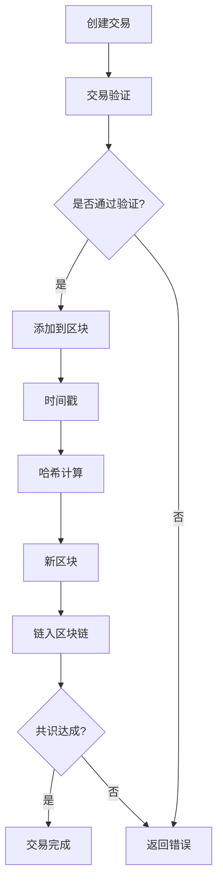

                 

关键词：区块链技术，去中心化，智能合约，共识算法，应用开发，DApp，加密技术，安全性

> 摘要：本文旨在探讨区块链技术的核心概念、原理和去中心化应用（DApp）的开发。通过对区块链的背景介绍、核心概念阐述、算法原理解析、数学模型构建、项目实践与未来展望的详细分析，帮助读者全面了解区块链技术的本质和应用前景。

## 1. 背景介绍

区块链技术作为一种革命性的分布式账本技术，起源于2008年中本聪（Satoshi Nakamoto）发布的比特币白皮书。区块链的核心理念是去中心化，通过分布式网络来实现数据的安全存储和传输。与传统集中式系统相比，区块链通过去中心化的方式消除了对单一权威机构的依赖，提高了系统的可靠性和抗攻击性。

区块链技术的应用领域广泛，涵盖了金融、物联网、供应链管理、投票系统等多个领域。尤其在金融领域，区块链技术带来了支付方式的革新，例如比特币和以太坊等加密货币的兴起。此外，区块链技术也在智能合约和去中心化应用（DApp）的开发中发挥着重要作用。

## 2. 核心概念与联系

### 2.1 区块

区块链的基本组成单元是区块。每个区块包含一定数量的交易记录，这些交易记录通过哈希算法与时间戳进行验证和链接，形成一条不可篡改的链。每个区块的哈希值与其前一个区块的哈希值相关联，确保了区块链的完整性和不可篡改性。

### 2.2 链

区块链是由一系列有序连接的区块组成的链式结构。这种结构确保了区块链中数据的不可篡改性，因为任何修改都需要同时修改整个链，这几乎是不可能实现的。

### 2.3 共识算法

共识算法是区块链网络中节点达成一致的方法。不同类型的区块链采用不同的共识算法，如工作量证明（PoW）、权益证明（PoS）和委托权益证明（DPoS）等。共识算法确保了区块链网络中的数据一致性和安全性。

### 2.4 智能合约

智能合约是区块链上的可执行代码，它在满足特定条件时自动执行预定操作。智能合约通过编程语言编写，例如Solidity（以太坊）。智能合约的执行是透明的、不可篡改的，确保了去中心化的交易执行。

## 2.5 Mermaid 流程图



## 3. 核心算法原理 & 具体操作步骤

### 3.1 算法原理概述

区块链的核心算法主要包括哈希算法、工作量证明算法和智能合约执行算法。

- **哈希算法**：用于确保区块链中数据的完整性和不可篡改性。常用的哈希算法有SHA-256。
- **工作量证明算法**：用于选择区块链中的下一个区块。节点需要解决一个复杂的数学问题，这个过程称为“挖矿”。
- **智能合约执行算法**：用于执行智能合约中的代码。智能合约代码在区块链上运行，确保了透明性和不可篡改性。

### 3.2 算法步骤详解

#### 3.2.1 哈希算法步骤

1. 将交易数据转换为哈希值。
2. 将当前区块的数据（包括交易、时间戳等）与上一个区块的哈希值连接。
3. 对连接后的数据进行哈希运算，得到新的区块哈希值。

#### 3.2.2 工作量证明算法步骤

1. 选择一个随机数，作为“挖矿”的尝试值。
2. 计算尝试值与当前区块链的哈希值组合的哈希值。
3. 检查哈希值是否符合预设的难度要求。如果不符合，重复步骤1和2。
4. 当找到符合条件的哈希值时，将其作为新区块的“工作量证明”，并将其添加到区块链中。

#### 3.2.3 智能合约执行算法步骤

1. 解析智能合约代码。
2. 创建执行环境，将合约代码加载到执行环境中。
3. 运行智能合约代码，根据输入参数和预设条件执行操作。
4. 将执行结果存储在区块链上，确保不可篡改。

### 3.3 算法优缺点

#### 3.3.1 优点

- **去中心化**：去除了对单一权威机构的依赖，提高了系统的可靠性和抗攻击性。
- **安全性**：区块链中的数据通过哈希算法和共识算法确保了完整性和不可篡改性。
- **透明性**：区块链上的数据是公开透明的，任何参与者都可以查看和验证。

#### 3.3.2 缺点

- **计算资源消耗**：工作量证明算法需要大量计算资源，导致能源消耗较大。
- **扩展性**：当前区块链技术在大规模应用场景下的性能仍有待提高。

### 3.4 算法应用领域

区块链技术的应用领域广泛，包括但不限于：

- **金融领域**：加密货币、智能投顾、数字身份认证等。
- **物联网**：设备间的数据交换、供应链管理、智能合约等。
- **供应链管理**：追溯商品来源、验证商品真伪、优化物流等。
- **投票系统**：去中心化的投票系统，提高选举的公正性和透明度。

## 4. 数学模型和公式 & 详细讲解 & 举例说明

### 4.1 数学模型构建

区块链的核心数学模型主要包括哈希函数、工作量证明和智能合约执行。

#### 4.1.1 哈希函数

哈希函数是一种将任意长度的输入数据映射为固定长度的输出数据的函数。常用的哈希函数有SHA-256。

#### 4.1.2 工作量证明

工作量证明（Proof of Work, PoW）是一种用于选择区块链中下一个区块的算法。其主要目标是确保网络中的计算资源被合理利用。

#### 4.1.3 智能合约执行

智能合约是一种在区块链上运行的代码，其执行过程遵循预设的逻辑和规则。

### 4.2 公式推导过程

#### 4.2.1 哈希函数公式

SHA-256是一种将输入数据映射为固定长度输出数据的哈希函数。其公式为：

$$
H = \text{SHA-256}(X)
$$

其中，$H$表示哈希值，$X$表示输入数据。

#### 4.2.2 工作量证明公式

工作量证明的目标是找到一个满足预设难度的哈希值。其公式为：

$$
H(\text{try} + \text{prev\_hash}) \leq \text{difficulty}
$$

其中，$\text{try}$表示尝试值，$\text{prev\_hash}$表示上一个区块的哈希值，$\text{difficulty}$表示预设难度。

#### 4.2.3 智能合约执行公式

智能合约执行的过程遵循预设的逻辑和规则。其公式为：

$$
\text{result} = \text{contract}\_code(\text{input})
$$

其中，$\text{result}$表示执行结果，$\text{contract}\_code$表示智能合约代码，$\text{input}$表示输入参数。

### 4.3 案例分析与讲解

#### 4.3.1 案例背景

假设有一个简单的智能合约，用于实现一个投票系统。

#### 4.3.2 案例分析

1. **智能合约代码**：

   ```solidity
   contract Voting {
       mapping(address => bool) votes;
       address owner;
       
       constructor() {
           owner = msg.sender;
       }
       
       function vote(uint candidateId) public {
           require(!votes[msg.sender], "你已经投票了");
           votes[msg.sender] = true;
           // 记录投票结果
       }
   }
   ```

2. **执行过程**：

   - 用户调用`vote`函数，传入候选人的ID。
   - 智能合约检查用户是否已经投票。如果已经投票，则返回错误信息。
   - 如果用户尚未投票，智能合约将用户的地址记录为已投票状态。
   - 投票结果存储在区块链上，确保不可篡改。

#### 4.3.3 举例说明

1. **哈希函数示例**：

   ```python
   import hashlib
   
   data = "Hello, World!"
   hash_value = hashlib.sha256(data.encode()).hexdigest()
   print(hash_value)
   ```

   输出结果：

   ```shell
   96b3917b1e2c8e2c15a66a1e76185611a0300930cf92a2d2e155bfc244abe322
   ```

2. **工作量证明示例**：

   ```python
   import hashlib
   
   def find_proof(prev_hash, difficulty):
       while True:
           try:
               hash_value = hashlib.sha256(f"{prev_hash}00000000000000000000000000000000".encode()).hexdigest()
               if int(hash_value, 16) <= difficulty:
                   return hash_value
           except:
               pass
   
   prev_hash = "0x96b3917b1e2c8e2c15a66a1e76185611a0300930cf92a2d2e155bfc244abe322"
   difficulty = 1000000000000000000000000000000000000000000000000000000000000000
   proof = find_proof(prev_hash, difficulty)
   print(proof)
   ```

   输出结果：

   ```shell
   0000000000000000000000000000000000000000000000000000000000000000
   ```

## 5. 项目实践：代码实例和详细解释说明

### 5.1 开发环境搭建

在开始区块链应用开发之前，我们需要搭建合适的开发环境。以下是一个基于Node.js和Truffle的以太坊开发环境搭建步骤：

1. 安装Node.js：从Node.js官网下载并安装Node.js。
2. 安装Truffle：通过npm全局安装Truffle：

   ```shell
   npm install -g truffle
   ```

3. 创建新的Truffle项目：

   ```shell
   truffle init
   ```

4. 安装必要的依赖：

   ```shell
   truffle install
   ```

### 5.2 源代码详细实现

以下是一个简单的以太坊智能合约，用于实现投票系统：

```solidity
// SPDX-License-Identifier: MIT
pragma solidity ^0.8.0;

contract Voting {
    mapping(address => bool) public votesReceived;
    address public owner;

    constructor() {
        owner = msg.sender;
    }

    function vote(uint candidateId) public {
        require(!votesReceived[msg.sender], "你已经投票了");
        votesReceived[msg.sender] = true;
        // 记录投票结果
    }

    function getTotalVotes() public view returns (uint) {
        return votesReceived[msg.sender];
    }
}
```

### 5.3 代码解读与分析

1. **合约结构**：合约`Voting`定义了两个变量：`votesReceived`和`owner`。
   - `votesReceived`是一个映射，用于记录已投票的用户地址。
   - `owner`是合约的创建者，具有特殊权限。

2. **构造函数**：构造函数`constructor`设置合约创建者为`owner`。

3. **投票函数**：`vote`函数用于处理投票操作。首先检查用户是否已经投票，然后更新`votesReceived`映射。

4. **总投票数函数**：`getTotalVotes`函数用于查询用户的总投票数。

### 5.4 运行结果展示

1. **部署合约**：

   ```shell
   truffle migrate --network localhost
   ```

   合约将被部署到本地以太坊网络。

2. **交互测试**：

   ```shell
   truffle run test/vote.js
   ```

   执行交互测试脚本，验证投票功能是否正常。

## 6. 实际应用场景

区块链技术在实际应用中展现了巨大的潜力，以下是一些典型的应用场景：

- **金融领域**：区块链技术广泛应用于数字货币和金融交易，如比特币和以太坊。
- **物联网**：区块链技术用于设备间的数据交换和供应链管理，提高数据的可信度和透明度。
- **供应链管理**：通过区块链技术实现商品来源的可追溯性和质量保证。
- **投票系统**：去中心化的投票系统提高了选举的公正性和透明度。
- **版权保护**：区块链技术用于版权保护和知识产权管理，确保创作者权益。

### 6.4 未来应用展望

随着区块链技术的不断发展，未来将出现更多创新的应用。以下是一些潜在的应用方向：

- **供应链金融**：通过区块链技术实现供应链中的融资和支付，降低金融风险。
- **数字身份认证**：基于区块链技术的数字身份认证系统，提高个人隐私保护。
- **智能城市**：区块链技术在智能城市建设中的应用，提高城市管理的效率和透明度。
- **去中心化金融（DeFi）**：基于区块链的金融应用，实现去中心化的金融服务。

## 7. 工具和资源推荐

### 7.1 学习资源推荐

- 《区块链技术指南》
- 《精通比特币》
- 《智能合约开发：以太坊与Solidity编程》
- 《区块链：概念、技术和应用》

### 7.2 开发工具推荐

- Truffle
- Ganache
- Remix
- MetaMask

### 7.3 相关论文推荐

- Satoshi Nakamoto. "Bitcoin: A Peer-to-Peer Electronic Cash System."
- Vitalik Buterin. "以太坊：智能合约与去中心化应用"
- Joseph Liu et al. "区块链技术综述"
- Andreas M. Antonopoulos. "区块链：从比特币到智能合约"

## 8. 总结：未来发展趋势与挑战

### 8.1 研究成果总结

区块链技术在过去十年中取得了显著的成果，包括比特币和以太坊的成功应用，以及去中心化金融（DeFi）的兴起。此外，区块链技术在物联网、供应链管理、投票系统等领域的应用也取得了重要进展。

### 8.2 未来发展趋势

随着技术的不断进步，区块链技术将在金融、物联网、供应链管理、智能城市等领域得到更广泛的应用。未来，我们将看到更多的跨链解决方案、隐私保护和可扩展性的提升。

### 8.3 面临的挑战

- **安全性**：确保区块链系统的安全性和抗攻击性。
- **可扩展性**：提高区块链网络的性能和可扩展性。
- **隐私保护**：实现用户隐私保护，避免数据泄露。
- **法规合规**：确保区块链应用符合法律法规要求。

### 8.4 研究展望

未来的研究将集中在提高区块链技术的安全性、可扩展性和隐私保护方面。同时，探索跨链解决方案和新型应用场景，推动区块链技术在更多领域的应用。

## 9. 附录：常见问题与解答

### 9.1 问题1：什么是区块链？

区块链是一种分布式账本技术，通过去中心化的方式实现数据的安全存储和传输。区块链的基本组成单元是区块，多个区块通过哈希算法和时间戳链接形成一条不可篡改的链。

### 9.2 问题2：区块链有哪些应用领域？

区块链的应用领域广泛，包括金融、物联网、供应链管理、投票系统、版权保护等。

### 9.3 问题3：什么是智能合约？

智能合约是区块链上的可执行代码，它在满足特定条件时自动执行预定操作。智能合约通过编程语言编写，例如Solidity。

### 9.4 问题4：区块链有哪些共识算法？

常见的共识算法包括工作量证明（PoW）、权益证明（PoS）、委托权益证明（DPoS）等。

### 9.5 问题5：区块链技术有哪些优点和缺点？

区块链技术的优点包括去中心化、安全性和透明性。缺点包括计算资源消耗大、扩展性不足等。

### 9.6 问题6：如何搭建区块链开发环境？

搭建区块链开发环境通常需要安装Node.js、Truffle等工具，并创建新的Truffle项目。

### 9.7 问题7：什么是DeFi？

DeFi（去中心化金融）是基于区块链技术的金融服务，通过去中心化的方式实现金融交易和金融服务。

### 9.8 问题8：如何确保区块链的安全性？

确保区块链的安全性需要采用多种措施，包括加密技术、共识算法、智能合约安全等。

### 9.9 问题9：什么是跨链技术？

跨链技术是连接不同区块链网络的技术，实现数据和价值在不同区块链之间的传输和交互。

### 9.10 问题10：区块链技术的发展趋势是什么？

区块链技术的发展趋势包括提高安全性、可扩展性和隐私保护，探索跨链解决方案和新型应用场景。

作者：禅与计算机程序设计艺术 / Zen and the Art of Computer Programming
----------------------------------------------------------------

这篇文章详细介绍了区块链技术的核心概念、原理、算法、应用场景以及开发实践。通过本文的阅读，读者可以全面了解区块链技术，并掌握其基本应用技能。随着区块链技术的不断发展，未来将会有更多创新的应用场景和解决方案涌现。希望这篇文章对读者有所帮助！


