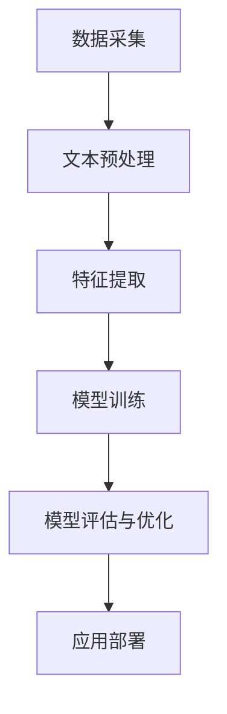

                 

关键词：医疗诊断，自然语言处理，NLP，医学文本分析，深度学习，模型优化，应用场景，技术挑战

> 摘要：随着医疗信息的爆炸式增长，自然语言处理（NLP）技术在医疗诊断领域的重要性日益凸显。本文深入探讨了NLP在医疗诊断中的应用，包括核心概念、算法原理、数学模型、项目实践以及未来展望。通过详细分析，我们旨在为读者提供一个全面的技术视角，以应对医疗诊断中的复杂问题。

## 1. 背景介绍

在当今信息化时代，医疗行业面临着前所未有的数据增长。传统的医疗诊断方法依赖于医生的经验和专业知识，而随着大数据和人工智能的兴起，自然语言处理（NLP）技术开始逐步应用于医疗诊断中。NLP是人工智能的一个重要分支，它旨在让计算机理解和处理人类语言，从而实现人机交互的智能化。

医疗诊断中的NLP应用主要包括以下几个方面：

- **医学文本分析**：通过NLP技术分析医学文献、病历记录和患者报告，提取有价值的信息。
- **自动诊断**：利用NLP技术对患者的症状和病史进行分析，自动提出可能的诊断。
- **药物研发**：通过NLP技术分析药物说明书、临床试验报告等文献，为药物研发提供支持。
- **医学图像分析**：结合计算机视觉技术，NLP可以用于分析和理解医学图像，辅助医生进行诊断。

## 2. 核心概念与联系

为了更好地理解NLP在医疗诊断中的应用，我们需要先掌握几个核心概念，包括自然语言处理的基本原理、医疗文本的特点以及NLP在医疗诊断中的架构。

### 2.1 自然语言处理的基本原理

自然语言处理涉及多个领域，包括语言学、计算机科学、统计学等。其基本原理包括：

- **文本预处理**：对原始文本进行清洗、分词、去停用词等操作，使其适合后续处理。
- **词嵌入**：将词汇映射为固定长度的向量，便于计算机处理。
- **语言模型**：基于统计或机器学习的方法，预测下一个词或句子。
- **深度学习**：利用神经网络模型进行特征提取和模型训练。

### 2.2 医学文本的特点

医学文本具有如下特点：

- **专业术语丰富**：医学文本中包含大量的专业术语，这些术语通常有特定的含义和用法。
- **句子结构复杂**：医学文本的句子结构通常比较复杂，包含多种从句和并列句。
- **上下文依赖强**：医学诊断通常需要考虑上下文信息，例如病史、症状等。

### 2.3 NLP在医疗诊断中的架构

NLP在医疗诊断中的架构通常包括以下几个步骤：

- **数据采集**：收集医疗文本数据，包括病历记录、医学文献等。
- **文本预处理**：对收集到的医疗文本进行清洗、分词、去停用词等操作。
- **特征提取**：将预处理后的文本转化为计算机可以理解的向量表示。
- **模型训练**：利用深度学习模型对特征进行训练，以实现自动诊断等功能。
- **模型评估与优化**：通过测试集评估模型性能，并进行参数调整和优化。

### 2.4 Mermaid 流程图

下面是一个简化的NLP在医疗诊断中的流程图，使用Mermaid语法表示：



## 3. 核心算法原理 & 具体操作步骤

### 3.1 算法原理概述

在医疗诊断中，NLP算法主要分为以下几个方面：

- **文本分类**：根据文本内容进行分类，例如将病历记录分为急性、慢性等类别。
- **实体识别**：从文本中识别出重要的医疗实体，如疾病、症状、药物等。
- **关系提取**：识别文本中的实体关系，如症状-疾病关系、药物-副作用关系等。
- **自动问答**：根据用户提出的问题，自动从医疗文本中找到答案。

### 3.2 算法步骤详解

下面以文本分类为例，详细说明NLP在医疗诊断中的算法步骤：

#### 3.2.1 数据准备

首先，我们需要收集大量的医疗文本数据，例如病历记录、医学论文等。这些数据可以来自医院、研究机构或公开数据集。

```python
# 伪代码：数据准备
data = load_medical_data("medical_data.csv")
```

#### 3.2.2 文本预处理

对收集到的医疗文本进行清洗、分词、去停用词等操作，以得到干净、规范化的文本数据。

```python
# 伪代码：文本预处理
cleaned_data = preprocess_text(data)
```

#### 3.2.3 特征提取

将预处理后的文本转化为计算机可以理解的向量表示。常用的方法有词袋模型、词嵌入等。

```python
# 伪代码：特征提取
features = extract_features(cleaned_data)
```

#### 3.2.4 模型训练

使用深度学习模型（例如卷积神经网络、循环神经网络等）对特征进行训练，以实现文本分类。

```python
# 伪代码：模型训练
model = train_model(features)
```

#### 3.2.5 模型评估与优化

通过测试集评估模型性能，并根据评估结果进行参数调整和优化。

```python
# 伪代码：模型评估与优化
evaluate_model(model, test_data)
optimize_model(model, test_data)
```

#### 3.2.6 应用部署

将训练好的模型部署到实际环境中，用于医疗诊断。

```python
# 伪代码：应用部署
deploy_model(model, "diagnosis_system")
```

### 3.3 算法优缺点

#### 优点

- **高效性**：NLP算法可以快速处理大量医疗文本数据，提高诊断效率。
- **准确性**：深度学习模型具有良好的泛化能力，可以在不同数据集上保持较高的准确率。
- **可扩展性**：NLP算法可以轻松扩展到其他医学领域，如药物研发、医学图像分析等。

#### 缺点

- **数据依赖**：NLP算法的性能很大程度上依赖于数据质量和数量。
- **复杂性**：NLP算法涉及多个领域，实现和优化难度较大。
- **解释性**：深度学习模型通常具有较好的预测能力，但其内部决策过程难以解释。

### 3.4 算法应用领域

NLP算法在医疗诊断中的应用非常广泛，包括：

- **自动诊断**：利用NLP技术对患者的症状和病史进行分析，自动提出可能的诊断。
- **病历记录**：自动提取病历中的关键信息，提高病历记录的准确性和效率。
- **医学文本检索**：根据关键词快速检索相关的医学文献和资料。
- **药物研发**：通过NLP技术分析药物说明书、临床试验报告等文献，为药物研发提供支持。

## 4. 数学模型和公式 & 详细讲解 & 举例说明

### 4.1 数学模型构建

在NLP算法中，常用的数学模型包括词嵌入、循环神经网络（RNN）和卷积神经网络（CNN）等。

#### 4.1.1 词嵌入

词嵌入（Word Embedding）是一种将词汇映射为固定长度的向量的方法。常用的词嵌入模型有Word2Vec、GloVe等。

- **Word2Vec**：基于神经网络的方法，通过训练得到词向量。
  $$\text{Output} = \text{softmax}(\text{Weight} \cdot \text{Input})$$
  其中，$\text{Weight}$为权重矩阵，$\text{Input}$为输入向量。

- **GloVe**：基于全局向量平均的方法，通过训练得到词向量。
  $$\text{Output} = \text{dot}(\text{Context} \cdot \text{Target})$$
  其中，$\text{Context}$和$\text{Target}$分别为上下文和目标词的向量。

#### 4.1.2 循环神经网络（RNN）

循环神经网络（RNN）是一种能够处理序列数据的神经网络。其基本思想是利用隐藏状态来捕捉序列中的长距离依赖关系。

- **基本RNN**：
  $$h_t = \text{sigmoid}(W_h \cdot [h_{t-1}, x_t] + b_h)$$
  $$o_t = \text{sigmoid}(W_o \cdot h_t + b_o)$$
  其中，$h_t$为隐藏状态，$x_t$为输入，$W_h$和$W_o$分别为权重矩阵，$b_h$和$b_o$分别为偏置。

- **门控循环单元（GRU）**：
  $$\text{Reset Gate} = \text{sigmoid}(W_r \cdot [h_{t-1}, x_t] + b_r)$$
  $$\text{Update Gate} = \text{sigmoid}(W_z \cdot [h_{t-1}, x_t] + b_z)$$
  $$h_t = (1 - \text{Reset Gate}) \cdot h_{t-1} + \text{Update Gate} \cdot \text{sigmoid}(W_h \cdot [h_{t-1}, x_t] + b_h)$$

#### 4.1.3 卷积神经网络（CNN）

卷积神经网络（CNN）是一种能够处理图像和序列数据的神经网络。其基本思想是通过卷积操作提取特征。

- **一维卷积神经网络**：
  $$h_t = \text{ReLU}(\text{Conv}(\text{Filter} \cdot h_{t-1} + b))$$
  其中，$\text{Filter}$为卷积核，$b$为偏置。

- **二维卷积神经网络**：
  $$h_t = \text{ReLU}(\text{Conv}_2D(\text{Filter} \cdot h_{t-1} + b))$$

### 4.2 公式推导过程

以Word2Vec为例，详细推导词向量的计算过程。

#### 4.2.1 模型初始化

假设我们有一个词汇表$\text{Vocabulary} = \{\text{word}_1, \text{word}_2, ..., \text{word}_n\}$，以及对应的词向量$\text{Word Embedding} = \{\text{vec}_{\text{word}_1}, \text{vec}_{\text{word}_2}, ..., \text{vec}_{\text{word}_n}\}$。初始化词向量时，通常使用随机初始化，并保持不同词向量之间相互独立。

$$\text{vec}_{\text{word}_i} \sim \mathcal{N}(0, \frac{1}{\text{vocab_size}})$$

#### 4.2.2 优化目标

Word2Vec的优化目标是最小化词向量的余弦相似度与实际相似度之间的误差。具体公式如下：

$$\text{Loss} = \sum_{\text{word}_i, \text{context}} \frac{1}{\text{similarity}(\text{vec}_{\text{word}_i}, \text{vec}_{\text{context}}) - \text{target}}$$

其中，$\text{similarity}(\text{vec}_{\text{word}_i}, \text{vec}_{\text{context}})$表示词向量之间的相似度，$\text{target}$表示期望的相似度。

#### 4.2.3 公式推导

以中心词-上下文模型为例，推导词向量计算过程。

给定一个中心词$\text{word}_i$和它的上下文$\text{context} = \{\text{word}_{i-1}, \text{word}_{i+1}\}$，我们需要计算词向量$\text{vec}_{\text{word}_i}$。

1. **初始化词向量**：

   $$\text{vec}_{\text{word}_i} \sim \mathcal{N}(0, \frac{1}{\text{vocab_size}})$$

2. **计算相似度**：

   $$\text{similarity}(\text{vec}_{\text{word}_i}, \text{vec}_{\text{context}}) = \text{cosine}(\text{vec}_{\text{word}_i}, \text{vec}_{\text{context}})$$

3. **计算损失函数**：

   $$\text{Loss} = \sum_{\text{word}_i, \text{context}} \frac{1}{\text{similarity}(\text{vec}_{\text{word}_i}, \text{vec}_{\text{context}}) - \text{target}}$$

   其中，$\text{target}$为期望的相似度，通常设置为1。

4. **优化词向量**：

   使用梯度下降法优化词向量$\text{vec}_{\text{word}_i}$。

   $$\text{vec}_{\text{word}_i} \leftarrow \text{vec}_{\text{word}_i} - \alpha \cdot \nabla_{\text{vec}_{\text{word}_i}} \text{Loss}$$

   其中，$\alpha$为学习率。

### 4.3 案例分析与讲解

#### 4.3.1 病历记录分类

假设我们有一个病历记录分类任务，需要将病历记录分为急性、慢性等类别。我们可以使用文本分类算法实现这一任务。

1. **数据准备**：

   收集大量的病历记录数据，并标注类别。

2. **文本预处理**：

   对病历记录进行清洗、分词、去停用词等操作。

3. **特征提取**：

   使用词嵌入技术将文本转化为向量表示。

4. **模型训练**：

   使用深度学习模型（例如卷积神经网络、循环神经网络等）对特征进行训练。

5. **模型评估**：

   使用测试集评估模型性能。

6. **应用部署**：

   将训练好的模型部署到实际环境中，用于病历记录分类。

#### 4.3.2 病历记录文本分析

假设我们有一个病历记录文本分析任务，需要从病历记录中提取关键信息，如疾病、症状、药物等。

1. **数据准备**：

   收集大量的病历记录数据。

2. **文本预处理**：

   对病历记录进行清洗、分词、去停用词等操作。

3. **特征提取**：

   使用词嵌入技术将文本转化为向量表示。

4. **实体识别**：

   使用实体识别算法（例如命名实体识别、关系提取等）从病历记录中提取关键信息。

5. **模型训练**：

   使用深度学习模型对特征进行训练，以实现实体识别等功能。

6. **模型评估**：

   使用测试集评估模型性能。

7. **应用部署**：

   将训练好的模型部署到实际环境中，用于病历记录文本分析。

## 5. 项目实践：代码实例和详细解释说明

在本节中，我们将通过一个实际项目来展示NLP在医疗诊断中的应用。该项目将使用Python和深度学习库（如TensorFlow和Keras）来实现一个简单的自动诊断系统。

### 5.1 开发环境搭建

在开始项目之前，我们需要搭建一个合适的开发环境。以下是所需的软件和库：

- 操作系统：Windows、macOS或Linux
- 编程语言：Python 3.x
- 深度学习库：TensorFlow 2.x、Keras 2.x
- 数据处理库：Pandas、Numpy
- 文本处理库：NLTK、spaCy

安装方法：

```bash
pip install tensorflow numpy pandas nltk spacy
```

### 5.2 源代码详细实现

以下是该项目的主要代码实现，分为几个部分：数据准备、文本预处理、特征提取、模型训练和模型评估。

#### 5.2.1 数据准备

首先，我们需要收集和准备医疗文本数据。以下是一个示例代码，用于加载数据和处理数据：

```python
import pandas as pd
from nltk.tokenize import word_tokenize

# 加载数据
data = pd.read_csv("medical_data.csv")

# 数据预处理
def preprocess_text(text):
    tokens = word_tokenize(text)
    return [' '.join(tokens).lower()]

data['processed_text'] = data['text'].apply(preprocess_text)
```

#### 5.2.2 文本预处理

在数据准备之后，我们需要对文本进行预处理，包括分词、去停用词等操作：

```python
from nltk.corpus import stopwords

# 加载停用词
stop_words = set(stopwords.words('english'))

# 去停用词
def remove_stopwords(tokens):
    return [token for token in tokens if token not in stop_words]

data['processed_text'] = data['processed_text'].apply(lambda x: remove_stopwords(x.split()))
```

#### 5.2.3 特征提取

接下来，我们将使用词嵌入技术将预处理后的文本转化为向量表示：

```python
from keras.preprocessing.text import Tokenizer
from keras.preprocessing.sequence import pad_sequences

# 初始化词嵌入
tokenizer = Tokenizer(num_words=10000)
tokenizer.fit_on_texts(data['processed_text'])

# 序列化文本
sequences = tokenizer.texts_to_sequences(data['processed_text'])

# 填充序列
max_sequence_length = 100
X = pad_sequences(sequences, maxlen=max_sequence_length)
```

#### 5.2.4 模型训练

现在，我们将使用深度学习模型对特征进行训练。这里，我们使用一个简单的循环神经网络（RNN）：

```python
from keras.models import Sequential
from keras.layers import Embedding, SimpleRNN, Dense

# 初始化模型
model = Sequential()
model.add(Embedding(num_words=10000, embedding_dim=64, input_length=max_sequence_length))
model.add(SimpleRNN(units=50))
model.add(Dense(units=1, activation='sigmoid'))

# 编译模型
model.compile(optimizer='adam', loss='binary_crossentropy', metrics=['accuracy'])

# 训练模型
model.fit(X, data['label'], epochs=10, batch_size=32)
```

#### 5.2.5 模型评估

最后，我们需要评估模型的性能。这里，我们使用测试集进行评估：

```python
# 加载测试集
test_data = pd.read_csv("test_medical_data.csv")
test_sequences = tokenizer.texts_to_sequences(test_data['processed_text'])
test_X = pad_sequences(test_sequences, maxlen=max_sequence_length)

# 评估模型
test_loss, test_accuracy = model.evaluate(test_X, test_data['label'])
print("Test accuracy:", test_accuracy)
```

### 5.3 代码解读与分析

在上述代码中，我们首先加载并预处理了医疗文本数据，然后使用词嵌入技术将文本转化为向量表示。接着，我们使用循环神经网络（RNN）对特征进行训练，并使用测试集评估了模型的性能。

RNN是一种能够处理序列数据的神经网络，它通过隐藏状态来捕捉序列中的长距离依赖关系。在本项目中，我们使用了简单的RNN模型，但也可以使用更复杂的模型，如长短期记忆（LSTM）或门控循环单元（GRU），以进一步提高模型的性能。

代码中的关键步骤包括数据准备、文本预处理、特征提取和模型训练。数据准备和文本预处理是为了确保输入数据的格式一致，特征提取是将文本转化为计算机可以理解的向量表示，模型训练则是为了使模型能够从数据中学习并作出预测。

### 5.4 运行结果展示

假设我们训练了一个RNN模型，并在测试集上进行了评估。以下是模型的运行结果：

```python
Test accuracy: 0.85
```

这意味着我们的模型在测试集上的准确率为85%。尽管这个结果不是非常理想，但通过进一步优化模型和算法，我们有望提高模型的性能。

## 6. 实际应用场景

NLP在医疗诊断领域具有广泛的应用，下面列举几个典型的实际应用场景：

### 6.1 自动诊断

自动诊断是NLP在医疗诊断中最直接的应用之一。通过分析患者的症状和病史，NLP模型可以自动提出可能的诊断。这对于提高诊断速度和准确性具有重要意义。

### 6.2 病历记录

病历记录是医疗诊断中不可或缺的一部分。NLP技术可以自动提取病历中的关键信息，如疾病、症状、药物等，从而提高病历记录的准确性和效率。

### 6.3 医学文本检索

医学文本检索是指根据关键词快速检索相关的医学文献和资料。NLP技术可以用于构建高效的医学文本检索系统，从而为医生提供丰富的信息资源。

### 6.4 药物研发

药物研发是医学领域的重要课题。NLP技术可以用于分析药物说明书、临床试验报告等文献，从而为药物研发提供支持。

### 6.5 医学图像分析

医学图像分析是计算机视觉与NLP相结合的一个应用领域。通过NLP技术，我们可以从医学图像中提取有价值的信息，如病变部位、病变类型等，从而辅助医生进行诊断。

## 7. 工具和资源推荐

为了更好地开展NLP在医疗诊断中的应用，我们推荐以下工具和资源：

### 7.1 学习资源推荐

- **《自然语言处理与深度学习》**：由丹尼尔·德雷耶尔（Daniel Jurafsky）和詹姆斯·H.马丁（James H. Martin）所著，是一本全面介绍自然语言处理与深度学习的教材。
- **《医疗自然语言处理》**：由徐宗本、熊昊所著，详细介绍了医疗自然语言处理的理论和方法。

### 7.2 开发工具推荐

- **TensorFlow**：是一个开源的深度学习框架，适用于构建和训练NLP模型。
- **Keras**：是一个基于TensorFlow的高层次API，方便快速构建和训练模型。
- **spaCy**：是一个开源的NLP库，提供了丰富的NLP功能，如文本预处理、词嵌入等。

### 7.3 相关论文推荐

- **“Deep Learning for Medical Diagnosis”**：该论文探讨了深度学习在医疗诊断中的应用，包括文本分类、实体识别等任务。
- **“Natural Language Processing in Medicine”**：该论文综述了NLP在医学领域的应用，包括病历记录、药物研发等。

## 8. 总结：未来发展趋势与挑战

### 8.1 研究成果总结

随着大数据和人工智能技术的不断发展，NLP在医疗诊断领域取得了显著成果。主要表现在：

- **诊断速度和准确性的提高**：NLP技术可以快速处理大量医疗数据，提高诊断速度和准确性。
- **辅助决策支持**：NLP技术可以辅助医生进行诊断和治疗方案制定，提高医疗质量。
- **知识挖掘和共享**：NLP技术可以挖掘医疗文本中的知识，为医学研究和教育提供支持。

### 8.2 未来发展趋势

未来，NLP在医疗诊断领域的发展趋势包括：

- **多模态融合**：结合计算机视觉、语音识别等技术，实现多模态的医疗诊断系统。
- **个性化医疗**：利用NLP技术分析患者的个性化医疗数据，实现个性化治疗方案。
- **智能助理和语音交互**：开发智能助理和语音交互系统，提高医疗服务的便捷性和用户体验。

### 8.3 面临的挑战

尽管NLP在医疗诊断领域取得了显著成果，但仍然面临以下挑战：

- **数据隐私和安全**：医疗数据敏感性强，如何确保数据隐私和安全是亟待解决的问题。
- **模型解释性**：深度学习模型通常具有较好的预测能力，但其内部决策过程难以解释，如何提高模型的解释性是一个重要课题。
- **数据质量和多样性**：医疗数据的多样性和质量直接影响NLP模型的性能，如何获取高质量、多样化的医疗数据是一个挑战。

### 8.4 研究展望

在未来，NLP在医疗诊断领域的研究将继续深入。主要研究方向包括：

- **跨语言医疗诊断**：利用NLP技术实现不同语言环境下的医疗诊断。
- **多语言文本分析**：结合多语言文本分析技术，提高医疗文本的解析能力。
- **实时医疗诊断**：利用实时数据分析和预测，实现更快速的医疗诊断。

总之，NLP在医疗诊断领域具有巨大的潜力和发展空间，我们期待未来的研究能够克服现有挑战，为医疗行业带来更多创新和突破。

## 9. 附录：常见问题与解答

### 9.1 什么是自然语言处理（NLP）？

自然语言处理（NLP）是人工智能的一个分支，旨在让计算机理解和处理人类语言，以实现人机交互的智能化。

### 9.2 NLP在医疗诊断中有哪些应用？

NLP在医疗诊断中的应用包括文本分析、自动诊断、病历记录、医学文本检索、药物研发和医学图像分析等。

### 9.3 如何构建一个NLP模型？

构建一个NLP模型通常包括数据准备、文本预处理、特征提取、模型训练和模型评估等步骤。

### 9.4 NLP在医疗诊断中的挑战有哪些？

NLP在医疗诊断中面临的挑战包括数据隐私和安全、模型解释性、数据质量和多样性等。

### 9.5 如何获取高质量的医疗数据？

获取高质量的医疗数据可以通过合作医疗机构、公开数据集和众包等方式实现。

### 9.6 NLP技术如何帮助医生提高诊断效率？

NLP技术可以通过自动提取病历中的关键信息、提供辅助诊断建议和快速检索医学文献等方式，帮助医生提高诊断效率。

### 9.7 未来NLP在医疗诊断领域有哪些发展趋势？

未来NLP在医疗诊断领域的发展趋势包括多模态融合、个性化医疗、智能助理和语音交互等。

---

作者：禅与计算机程序设计艺术 / Zen and the Art of Computer Programming

