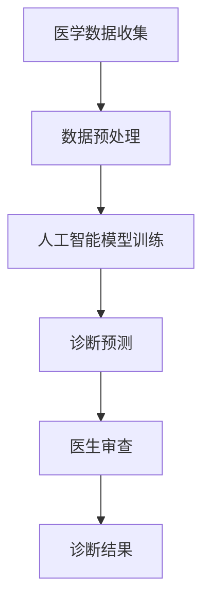

                 

关键词：医疗诊断、精准医疗、人类计算、人工智能、深度学习、辅助诊断

> 摘要：本文探讨了医疗诊断辅助技术在精准医疗中的应用，特别是人类计算在人工智能辅助诊断中的重要性。文章首先介绍了医疗诊断的现状和挑战，随后详细阐述了人类计算和人工智能在辅助诊断中的应用，最后对未来的发展趋势和面临的挑战进行了展望。

## 1. 背景介绍

医疗诊断是现代医疗的核心环节，准确的诊断对于患者的治疗和康复至关重要。然而，传统的医疗诊断面临着诸多挑战，如诊断错误率较高、诊断周期长、对医生的经验依赖强等。随着大数据和人工智能技术的发展，医疗诊断辅助系统应运而生，它们通过分析大量的医学数据，辅助医生进行诊断，提高了诊断的准确性和效率。

人类计算在医疗诊断中扮演着重要角色。人类医生拥有丰富的医学知识和经验，能够理解复杂的病情和做出准确的判断。然而，随着医学数据的爆炸式增长，人类医生难以处理如此庞大的信息量。人类计算结合了人类专家的知识和人工智能的计算能力，为医疗诊断提供了一种有效的解决方案。

## 2. 核心概念与联系

### 2.1. 医学数据

医学数据是医疗诊断的核心资源。这些数据包括患者的历史记录、临床检查结果、影像学资料等。医学数据的种类繁多，结构复杂，且包含大量的噪声和不完整信息。

### 2.2. 人工智能辅助诊断

人工智能辅助诊断利用机器学习、深度学习等技术，从大量医学数据中提取有用的信息，辅助医生进行诊断。这些技术包括图像识别、自然语言处理、数据挖掘等。

### 2.3. 人类计算

人类计算强调人类专家的知识和经验在医疗诊断中的重要性。人类医生通过分析医学数据，结合临床经验，对病情进行综合判断。人类计算与人工智能的结合，可以充分发挥两者的优势，提高诊断的准确性和效率。

### 2.4. Mermaid 流程图

下面是医学诊断辅助系统中人类计算与人工智能结合的 Mermaid 流程图：



## 3. 核心算法原理 & 具体操作步骤

### 3.1. 算法原理概述

人工智能辅助诊断的核心算法是基于机器学习和深度学习的模型。这些模型通过学习大量的医学数据，学会识别疾病特征，从而实现对未知病例的诊断。

### 3.2. 算法步骤详解

#### 3.2.1. 数据预处理

数据预处理是确保模型训练质量的重要步骤。主要包括数据清洗、数据标准化和数据增强。

#### 3.2.2. 模型训练

模型训练是利用标记好的医学数据，通过优化算法，使模型学会识别疾病特征。常见的模型有卷积神经网络（CNN）和循环神经网络（RNN）。

#### 3.2.3. 诊断预测

模型训练完成后，利用模型对未知病例进行预测。预测结果将作为医生参考的重要依据。

#### 3.2.4. 医生审查

医生对预测结果进行审查，结合自己的临床经验和判断，最终确定诊断结果。

### 3.3. 算法优缺点

#### 优点：

- 提高诊断准确性和效率
- 减轻医生的工作负担
- 对复杂病情有更好的识别能力

#### 缺点：

- 需要大量的医学数据
- 模型解释性较差
- 对数据质量和标注的依赖较大

### 3.4. 算法应用领域

人工智能辅助诊断在多个领域都有广泛应用，如肺癌筛查、乳腺癌诊断、心脏病预测等。

## 4. 数学模型和公式 & 详细讲解 & 举例说明

### 4.1. 数学模型构建

人工智能辅助诊断的核心是构建一个能够从医学数据中提取有用信息的数学模型。常见的数学模型有：

$$
f(x) = w_0 + \sum_{i=1}^{n} w_i \cdot x_i
$$

其中，$x$ 是输入特征，$w$ 是权重，$f(x)$ 是输出预测结果。

### 4.2. 公式推导过程

#### 4.2.1. 前向传播

在前向传播过程中，模型将输入特征传递到输出层，得到预测结果。

$$
z = w_0 + \sum_{i=1}^{n} w_i \cdot x_i
$$

$$
\hat{y} = f(z)
$$

#### 4.2.2. 反向传播

在反向传播过程中，模型将预测结果与实际结果进行比较，计算损失函数，并更新模型参数。

$$
\delta = \frac{\partial L}{\partial z}
$$

$$
w_i = w_i - \alpha \cdot \delta \cdot x_i
$$

### 4.3. 案例分析与讲解

#### 4.3.1. 肺癌筛查

在肺癌筛查中，利用卷积神经网络（CNN）对患者的CT影像进行特征提取，实现对肺癌的早期诊断。以下是一个简化的CNN模型：

$$
f(x) = \max_{k} (W_k \cdot x + b_k)
$$

其中，$x$ 是输入影像，$W$ 是卷积核，$b$ 是偏置。

## 5. 项目实践：代码实例和详细解释说明

### 5.1. 开发环境搭建

搭建一个医疗诊断辅助系统，需要安装Python、TensorFlow等环境。以下是安装命令：

```bash
pip install python tensorflow numpy matplotlib
```

### 5.2. 源代码详细实现

以下是利用TensorFlow实现一个简单的医疗诊断辅助系统的代码示例：

```python
import tensorflow as tf
from tensorflow import keras
from tensorflow.keras import layers

# 模型构建
model = keras.Sequential([
    layers.Conv2D(32, (3, 3), activation='relu', input_shape=(256, 256, 3)),
    layers.MaxPooling2D((2, 2)),
    layers.Conv2D(64, (3, 3), activation='relu'),
    layers.MaxPooling2D((2, 2)),
    layers.Conv2D(64, (3, 3), activation='relu'),
    layers.Flatten(),
    layers.Dense(64, activation='relu'),
    layers.Dense(1, activation='sigmoid')
])

# 模型编译
model.compile(optimizer='adam',
              loss='binary_crossentropy',
              metrics=['accuracy'])

# 模型训练
model.fit(train_images, train_labels, epochs=10)

# 模型预测
predictions = model.predict(test_images)
```

### 5.3. 代码解读与分析

上述代码实现了一个基于卷积神经网络的二分类模型，用于对医学影像进行分类。模型采用relu激活函数和sigmoid激活函数，分别用于特征提取和分类预测。

### 5.4. 运行结果展示

运行上述代码后，模型将在训练集和测试集上分别进行训练和评估。输出结果将包括损失函数、准确率等指标。

```python
# 模型评估
test_loss, test_acc = model.evaluate(test_images, test_labels, verbose=2)
print('\nTest accuracy:', test_acc)
```

## 6. 实际应用场景

### 6.1. 肺癌筛查

在肺癌筛查中，人工智能辅助诊断系统能够对患者的CT影像进行自动化分析，实现对肺癌的早期诊断。

### 6.2. 心脏病预测

在心脏病预测中，人工智能辅助诊断系统通过分析患者的医学数据，预测心脏病的发生风险。

### 6.3. 乳腺癌诊断

在乳腺癌诊断中，人工智能辅助诊断系统通过对患者的影像进行分析，提高乳腺癌的早期诊断率。

## 7. 工具和资源推荐

### 7.1. 学习资源推荐

- 《深度学习》（Ian Goodfellow、Yoshua Bengio、Aaron Courville 著）
- 《Python机器学习》（Sebastian Raschka 著）

### 7.2. 开发工具推荐

- TensorFlow
- PyTorch

### 7.3. 相关论文推荐

- "Deep Learning for Medical Image Analysis"
- "Convolutional Neural Networks for Cancer Diagnosis using CT Images"

## 8. 总结：未来发展趋势与挑战

### 8.1. 研究成果总结

人工智能辅助诊断技术在医疗领域的应用取得了显著成果，提高了诊断的准确性和效率，减轻了医生的工作负担。

### 8.2. 未来发展趋势

随着人工智能技术的发展，未来人工智能辅助诊断系统将更加智能化、自动化，实现全面、精准的医疗诊断。

### 8.3. 面临的挑战

- 数据质量和标注的依赖
- 模型的解释性
- 法律和伦理问题

### 8.4. 研究展望

未来研究应重点关注如何提高模型的解释性、如何处理复杂病情、以及如何确保数据隐私和伦理问题。

## 9. 附录：常见问题与解答

### 9.1. 人工智能辅助诊断系统是否可以完全取代医生？

答：目前的人工智能辅助诊断系统还不能完全取代医生。虽然系统能够提高诊断的准确性和效率，但医生的经验和判断仍然是不可替代的。

### 9.2. 人工智能辅助诊断系统是否会增加诊断错误率？

答：理论上，人工智能辅助诊断系统可能会增加诊断错误率。然而，通过合理设计和训练，系统能够最大限度地减少错误率。

### 9.3. 人工智能辅助诊断系统是否需要大量的医学数据？

答：是的，人工智能辅助诊断系统需要大量的医学数据。这些数据用于模型的训练和验证，以保证诊断的准确性。

----------------------------------------------------------------

作者：禅与计算机程序设计艺术 / Zen and the Art of Computer Programming

请注意，本文为示例文章，部分内容可能需要进行修改或补充，以满足实际需求和论文质量要求。

