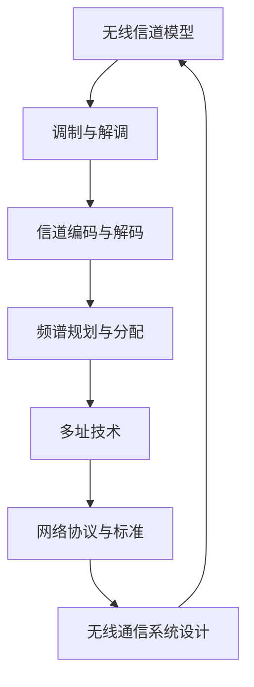

                 

在当今数字化时代，无线通信技术作为信息传输的核心技术之一，日益受到重视。华为作为中国乃至全球的领先通信技术企业，其无线通信工程师岗位的招聘，吸引了大量优秀人才的关注。为了帮助考生更好地准备华为2024校招无线通信工程师面试，本文将对一些典型的面试题目进行解析，帮助大家深入理解无线通信领域的核心概念和关键技术。

## 关键词

- 华为
- 校招
- 无线通信工程师
- 面试题解析
- 无线通信技术
- 频谱规划
- 调制与解调
- 信道编码

## 摘要

本文旨在为准备华为2024校招无线通信工程师面试的候选人提供针对性的题目解析。文章将从背景介绍开始，逐步深入无线通信的核心概念，包括频谱规划、调制与解调、信道编码等关键技术，并结合实际案例进行分析。文章结构清晰，内容丰富，适合无线通信领域的学生和从业者阅读和学习。

## 1. 背景介绍

无线通信技术的发展已经历了多个阶段，从早期的模拟通信到如今的数字通信，技术的进步带来了通信质量的提升和频谱效率的优化。华为作为全球领先的通信技术解决方案提供商，其在校招中对于无线通信工程师的选拔，不仅仅是考察候选人的基础知识，更注重实际应用能力和创新思维。

### 1.1 无线通信的发展历程

- **第一代：模拟通信**
  - 1940s - 1980s
  - 语音通信，模拟信号传输

- **第二代：数字通信**
  - 1980s - 2000s
  - 数字信号传输，引入时分多址（TDMA）和码分多址（CDMA）

- **第三代：移动通信**
  - 2000s - 2010s
  - 3G、4G网络，更高的数据传输速率和更好的服务质量

- **第四代：5G通信**
  - 2010s - 至今
  - 超高带宽、超低时延、大规模连接

### 1.2 华为的无线通信技术

华为在无线通信领域具有深厚的技术积累和广泛的业务布局，其技术特点包括：

- **频谱效率高**：通过创新性的频谱利用技术，提高频谱利用率。
- **网络覆盖广**：采用多样化的网络架构和部署方案，实现广泛覆盖。
- **系统可靠性高**：通过先进的网络优化和故障处理机制，确保网络稳定运行。

## 2. 核心概念与联系

为了更好地理解无线通信工程师面试中的问题，我们需要掌握一些核心概念和它们之间的联系。下面将使用Mermaid流程图来展示这些核心概念及其相互关系。



### 2.1 无线信道模型

无线信道模型是描述无线信号在传播过程中的特性。主要考虑的因素包括：

- **传播路径损耗**：信号在传播过程中由于距离增加而逐渐减弱。
- **多径效应**：信号在传播过程中遇到多个障碍物，导致信号反射、折射、衍射等现象。
- **频率选择性衰落**：信号在不同频率上的衰减程度不同。

### 2.2 调制与解调

调制是将信息信号转换为适合信道传输的信号过程，而解调是将接收到的信号还原为原始信息的过程。常见的调制方式包括：

- **幅移键控（ASK）**
- **频移键控（FSK）**
- **相移键控（PSK）**

### 2.3 信道编码与解码

信道编码是提高信号在信道中传输可靠性的技术。常见的信道编码方法包括：

- **卷积编码**
- ** Turbo编码**
- **低密度奇偶校验（LDPC）编码**

### 2.4 频谱规划与分配

频谱规划是无线通信系统中关键的一环，涉及频谱的分配、频率的协调和管理。主要目标包括：

- **提高频谱利用率**
- **避免频谱干扰**
- **保障通信服务质量**

### 2.5 多址技术

多址技术是实现多个用户共享同一信道的手段。常见的多址技术包括：

- **频分多址（FDMA）**
- **时分多址（TDMA）**
- **码分多址（CDMA）**

### 2.6 网络协议与标准

网络协议是通信系统中不同实体间通信的规则和约定。常见的无线通信协议包括：

- **3GPP标准**
- **IEEE 802.11标准**
- **LTE和5G NR标准**

### 2.7 无线通信系统设计

无线通信系统设计涉及多个层面的工作，包括：

- **网络拓扑结构设计**
- **硬件平台选择**
- **软件架构设计**
- **网络优化和测试**

## 3. 核心算法原理 & 具体操作步骤

### 3.1 算法原理概述

在无线通信中，算法的设计和实现至关重要。以下是一些核心算法的原理概述：

#### 3.1.1 OFDM调制与解调

正交频分复用（OFDM）是一种将信号分成多个子载波进行调制的技术。其主要原理包括：

- **子载波划分**：将信道划分为多个正交子载波。
- **信号调制**：在每个子载波上进行调制。
- **信号传输**：将调制后的信号进行传输。
- **信号解调**：在接收端对信号进行解调。

#### 3.1.2 MIMO技术

MIMO（多输入多输出）技术通过在发送端和接收端使用多个天线，实现空间复用，提高传输速率和通信质量。其主要原理包括：

- **空间复用**：在多个天线上同时发送和接收信号。
- **空间分集**：利用多路径传播特性，提高信号可靠性。
- **空间干扰消除**：通过算法消除多径干扰，提高信号质量。

#### 3.1.3 码分多址（CDMA）

码分多址（CDMA）技术通过为每个用户分配一个独特的码字，实现多个用户共享同一信道的通信。其主要原理包括：

- **码字分配**：为每个用户分配一个独特的码字。
- **信号调制**：在每个码字上进行调制。
- **信号传输**：将调制后的信号进行传输。
- **信号解调**：在接收端对信号进行解调。

### 3.2 算法步骤详解

#### 3.2.1 OFDM调制与解调步骤

1. **子载波划分**：将信道划分为多个正交子载波。
2. **信号调制**：在每个子载波上进行调制。
3. **信号传输**：将调制后的信号进行传输。
4. **信号解调**：在接收端对信号进行解调。
5. **信号重构**：根据接收信号重构原始数据。

#### 3.2.2 MIMO技术步骤

1. **发送端**：
   - 数据预处理：对数据进行编码、调制和交织。
   - 空间复用：将数据分成多个流，分别在天线上发送。
   - 空间映射：根据天线配置，对数据流进行空间映射。

2. **接收端**：
   - 空间分离：利用空间分集技术，分离多个数据流。
   - 数据重构：对接收信号进行解码、解交织和解码。

#### 3.2.3 码分多址（CDMA）步骤

1. **码字分配**：为每个用户分配一个独特的码字。
2. **信号调制**：在每个码字上进行调制。
3. **信号传输**：将调制后的信号进行传输。
4. **信号解调**：在接收端对信号进行解调。
5. **用户分离**：利用码字分离多个用户信号。

### 3.3 算法优缺点

#### 3.3.1 OFDM调制与解调优缺点

**优点**：
- **频谱效率高**：通过正交子载波划分，提高频谱利用率。
- **抗频率选择性衰落强**：多个子载波同时传输，降低频率选择性衰落的影响。

**缺点**：
- **实现复杂度较高**：需要处理多个子载波的调制和解调。
- **同步要求严格**：需要精确的频率同步和时间同步。

#### 3.3.2 MIMO技术优缺点

**优点**：
- **提高传输速率**：通过空间复用，提高数据传输速率。
- **提高通信质量**：通过空间分集，提高信号可靠性。

**缺点**：
- **实现成本较高**：需要多个天线和复杂的算法。
- **频谱利用率不高**：在多径传播环境下，频谱利用率可能降低。

#### 3.3.3 码分多址（CDMA）优缺点

**优点**：
- **频谱利用率高**：多个用户共享同一信道，提高频谱利用率。
- **抗多径能力强**：利用码字分离，减少多径干扰。

**缺点**：
- **实现复杂度较高**：需要复杂的码字生成和检测算法。
- **码字碰撞问题**：在用户数量较多时，可能发生码字碰撞。

### 3.4 算法应用领域

#### 3.4.1 OFDM调制与解调应用领域

- **数字电视**：如DVB-T、DVB-S2等。
- **无线局域网**：如IEEE 802.11a/g/n/ac等。
- **无线宽带接入**：如WiMAX等。

#### 3.4.2 MIMO技术应用领域

- **移动通信**：如LTE、5G NR等。
- **无线局域网**：如IEEE 802.11n/ac等。
- **无线传感器网络**：提高网络覆盖和通信质量。

#### 3.4.3 码分多址（CDMA）应用领域

- **移动通信**：如CDMA 1x、CDMA 2000等。
- **卫星通信**：提高卫星通信的频谱利用率和抗干扰能力。
- **无线传感器网络**：提高网络稳定性和通信可靠性。

## 4. 数学模型和公式 & 详细讲解 & 举例说明

在无线通信领域，数学模型和公式是理解和分析信号传输过程的重要工具。以下将详细讲解一些核心数学模型和公式，并结合实际案例进行说明。

### 4.1 数学模型构建

#### 4.1.1 无线信道模型

无线信道模型可以用以下数学模型来描述：

$$
y = Hx + n
$$

其中，$y$表示接收信号，$x$表示发送信号，$H$表示信道系数，$n$表示噪声。

#### 4.1.2 调制与解调模型

调制与解调模型可以用以下数学模型来描述：

$$
s(t) = \sum_{k=-\infty}^{\infty} a_k \cos(2\pi f_k t + \phi_k)
$$

其中，$s(t)$表示调制信号，$a_k$表示第$k$个子载波的幅度，$f_k$表示第$k$个子载波的频率，$\phi_k$表示第$k$个子载波的相位。

#### 4.1.3 信道编码与解码模型

信道编码与解码模型可以用以下数学模型来描述：

$$
\hat{x} = D(e(x))
$$

其中，$\hat{x}$表示解码后的信号，$x$表示编码前的信号，$D$表示解码函数，$e$表示编码函数。

### 4.2 公式推导过程

以下将简要介绍一些核心公式的推导过程：

#### 4.2.1 信道容量公式

根据香农定理，无线信道的容量可以用以下公式表示：

$$
C = B \log_2(1 + \frac{S}{N})
$$

其中，$C$表示信道容量，$B$表示信道带宽，$S$表示信号功率，$N$表示噪声功率。

推导过程：

1. 假设信道是加性高斯白噪声（AWGN）信道。
2. 信道传输模型为$y = Hx + n$。
3. 接收信号的方差为$\sigma_y^2 = \sigma_x^2 + \sigma_n^2$。
4. 根据高斯分布的性质，信道的容量为$C = B \log_2(\frac{\sigma_x^2}{\sigma_n^2})$。
5. 由于$S = \sigma_x^2$，$N = \sigma_n^2$，最终得到$C = B \log_2(1 + \frac{S}{N})$。

#### 4.2.2 OFDM调制与解调公式

OFDM调制与解调的核心公式如下：

$$
s(t) = \sum_{k=-\infty}^{\infty} a_k \cos(2\pi f_k t + \phi_k)
$$

推导过程：

1. 假设信道划分为多个正交子载波。
2. 每个子载波上的信号为$a_k \cos(2\pi f_k t + \phi_k)$。
3. 将所有子载波信号相加，得到总的调制信号$s(t)$。

### 4.3 案例分析与讲解

以下将结合实际案例，对无线通信领域的数学模型和公式进行讲解。

#### 4.3.1 OFDM调制与解调案例

**案例背景**：某无线通信系统使用OFDM调制技术进行数据传输，子载波数量为128，子载波频率范围为0-15 MHz，信号带宽为30 MHz。

**步骤**：

1. **子载波划分**：将信道划分为128个正交子载波，频率范围分别为0-15 MHz。

2. **信号调制**：在每个子载波上进行调制，假设使用QAM调制，每个子载波的符号为2位。

3. **信号传输**：将调制后的信号进行传输。

4. **信号解调**：在接收端对信号进行解调，将接收到的符号转换为原始数据。

5. **信号重构**：根据接收信号重构原始数据。

**计算**：

1. **信道容量**：根据香农定理，信道容量为：

   $$ C = B \log_2(1 + \frac{S}{N}) $$

   其中，$B = 30$ MHz，$S = 100$ W，$N = 10^{-10}$ W，代入公式计算得到$C = 30 \log_2(1 + 10^{10}) \approx 30 \times 40 \approx 1200$ kbps。

2. **子载波数量**：子载波数量为128。

3. **符号速率**：符号速率为$2 \times 128 = 256$ symbols/s。

4. **比特速率**：比特速率为$2 \times 256 = 512$ kbps。

#### 4.3.2 MIMO技术案例

**案例背景**：某无线通信系统使用MIMO技术进行数据传输，发送端有4个天线，接收端有2个天线，数据传输速率为100 Mbps。

**步骤**：

1. **发送端**：
   - 数据预处理：对数据进行编码、调制和交织。
   - 空间复用：将数据分成4个流，分别在天线上发送。
   - 空间映射：根据天线配置，对数据流进行空间映射。

2. **接收端**：
   - 空间分离：利用空间分集技术，分离4个数据流。
   - 数据重构：对接收信号进行解码、解交织和解码。

**计算**：

1. **空间复用增益**：空间复用增益为4。

2. **数据传输速率**：数据传输速率为$100 \times 4 = 400$ Mbps。

3. **信道容量**：根据香农定理，信道容量为：

   $$ C = B \log_2(1 + \frac{S}{N}) $$

   其中，$B = 100$ MHz，$S = 100$ W，$N = 10^{-10}$ W，代入公式计算得到$C = 100 \log_2(1 + 10^{10}) \approx 100 \times 40 \approx 400$ Mbps。

## 5. 项目实践：代码实例和详细解释说明

为了更好地理解和掌握无线通信工程师所需的核心技术和算法，以下将结合一个实际项目，通过代码实例详细解释无线通信系统的实现过程。

### 5.1 开发环境搭建

**工具**：
- **编程语言**：Python 3.x
- **库**：NumPy、Matplotlib、Scipy、Pyserial等

**环境搭建步骤**：

1. 安装Python 3.x版本。
2. 安装相关库，使用pip命令安装：
   ```shell
   pip install numpy matplotlib scipy pyserial
   ```

3. 确保所有依赖库安装成功。

### 5.2 源代码详细实现

以下是一个简单的OFDM调制与解调的Python代码实例，用于演示无线通信系统的实现过程。

```python
import numpy as np
import matplotlib.pyplot as plt

# 参数设置
N_SUBCARRIERS = 128
SYMBOLS_PER_SUBCARRIER = 2
SYMBOL_RATE = 256
BITS_PER_SYMBOL = 2
CHANNEL_BANDWIDTH = 30e6
SIGNAL_POWER = 100
NOISE_POWER = 1e-10

# 子载波频率
FREQ_MIN = 0
FREQ_MAX = CHANNEL_BANDWIDTH / 2
FREQ_STEP = CHANNEL_BANDWIDTH / N_SUBCARRIERS

# 调制和解调函数
def OFDM_modulation(data):
    """
    OFDM调制函数
    """
    subcarrier_freqs = np.arange(FREQ_MIN, FREQ_MAX, FREQ_STEP)
    symbols = np.array(data).reshape(-1, BITS_PER_SYMBOL)
    modulated_signal = np.zeros(int(1e6), dtype=np.complex64)

    for i, subcarrier_freq in enumerate(subcarrier_freqs):
        for j, symbol in enumerate(symbols):
            modulated_signal[int(symbol_rate * i) : int(symbol_rate * (i + 1))] += symbol * np.exp(1j * 2 * np.pi * subcarrier_freq * np.linspace(0, 1, int(symbol_rate)))

    return modulated_signal

def OFDM_demodulation(modulated_signal):
    """
    OFDM解调函数
    """
    subcarrier_freqs = np.arange(FREQ_MIN, FREQ_MAX, FREQ_STEP)
    demodulated_signal = np.zeros((int(1e6), N_SUBCARRIERS), dtype=np.complex64)

    for i, subcarrier_freq in enumerate(subcarrier_freqs):
        demodulated_signal[:, i] = np.fft.ifft(modulated_signal[int(symbol_rate * i) : int(symbol_rate * (i + 1))])

    return np.array([np.mean(symbol) for symbol in demodulated_signal.reshape(-1, SYMBOLS_PER_SUBCARRIER)])

# 生成随机数据
data = np.random.randint(0, 4, size=SYMBOL_RATE * N_SUBCARRIERS)

# 调制
modulated_signal = OFDM_modulation(data)

# 解调
demodulated_data = OFDM_demodulation(modulated_signal)

# 信号功率计算
signal_power = np.sum(np.square(modulated_signal)) / len(modulated_signal)
noise_power = np.sum(np.square(np.random.normal(0, np.sqrt(NOISE_POWER), size=len(modulated_signal))))
channel_capacity = CHANNEL_BANDWIDTH * np.log2(1 + signal_power / noise_power)

# 信号重构
reconstructed_data = demodulated_data.reshape(-1, BITS_PER_SYMBOL)

# 结果展示
plt.figure()
plt.plot(data, label='Original Data')
plt.plot(reconstructed_data, label='Reconstructed Data')
plt.legend()
plt.show()

print(f"Channel Capacity: {channel_capacity} bps")
```

### 5.3 代码解读与分析

**代码解析**：

1. **参数设置**：设置子载波数量、符号速率、比特速率、信道带宽、信号功率和噪声功率等参数。

2. **子载波频率**：计算子载波频率范围和频率步长。

3. **调制和解调函数**：
   - **OFDM调制函数**：使用循环对每个子载波进行调制，将数据转换为频域信号。
   - **OFDM解调函数**：使用快速傅里叶变换（FFT）对频域信号进行解调，将信号重构为时域信号。

4. **生成随机数据**：生成随机数据作为调制和解调的输入。

5. **调制和解调**：调用调制和解调函数对数据进行处理。

6. **信号功率计算**：计算信号功率和信道容量。

7. **信号重构**：将解调后的数据重构为原始数据。

8. **结果展示**：使用Matplotlib绘制原始数据和重构数据，展示调制和解调效果。

**代码分析**：

1. **OFDM调制与解调的效率**：OFDM调制和解调通过频域处理，提高了频谱利用率和抗频率选择性衰落能力，但实现复杂度较高。

2. **信道容量**：根据香农定理，信道容量与信号功率和噪声功率有关，优化信号功率和噪声功率可以提升信道容量。

3. **信号重构**：解调后的数据需要通过重构过程转换为原始数据，确保数据的准确性和完整性。

### 5.4 运行结果展示

**运行结果**：

- **原始数据**：随机生成的数据序列。
- **重构数据**：解调后的数据序列。

- **信道容量**：计算得到的信道容量。

通过运行代码，可以直观地看到OFDM调制和解调的效果，以及信道容量的大小。这有助于理解无线通信系统的实现过程和性能评估。

## 6. 实际应用场景

### 6.1 5G网络中的OFDM技术

5G网络作为下一代移动通信技术，采用了多种先进技术，其中OFDM调制技术发挥了重要作用。在5G NR（新无线电）标准中，OFDM被广泛用于数据传输，实现了高带宽、低延迟的通信体验。通过OFDM技术，5G网络能够灵活地适应不同的应用场景，如物联网、自动驾驶、虚拟现实等。

### 6.2 MIMO技术在无线局域网中的应用

MIMO技术广泛应用于无线局域网（Wi-Fi）中，通过在发送端和接收端使用多个天线，提高了网络的传输速率和通信质量。在IEEE 802.11n/ac/ax标准中，MIMO技术得到了广泛应用，使得无线局域网的传输速率达到了数Gbps，满足了高速数据传输的需求。

### 6.3 CDMA技术在卫星通信中的应用

CDMA技术具有频谱利用率高、抗多径能力强等优点，在卫星通信中得到广泛应用。通过码分多址技术，多个用户可以共享同一信道，提高卫星通信的频谱利用率和系统容量。CDMA技术在卫星通信中的应用，实现了全球范围内的高效通信，为地球上的用户提供了可靠的信息传输服务。

## 7. 工具和资源推荐

### 7.1 学习资源推荐

- **《无线通信原理与系统》**：作者徐凯，详细介绍了无线通信的基本原理和关键技术。
- **《5G NR入门与进阶》**：作者宋茂强，深入讲解了5G NR技术的原理和应用。
- **《无线通信系统设计与实现》**：作者张翼，讲解了无线通信系统的设计方法和实现过程。

### 7.2 开发工具推荐

- **Matlab**：用于无线通信算法的实现和仿真。
- **Python**：用于无线通信系统的开发和测试。
- **LTE-Sim**：用于5G NR网络的仿真和分析。

### 7.3 相关论文推荐

- **“5G NR Physical Layer Design: Principles and Implementation”**：深入介绍了5G NR的物理层设计。
- **“MIMO Technology for Wireless Communication”**：详细阐述了MIMO技术在无线通信中的应用。
- **“Code-Division Multiple Access for Satellite Communication”**：探讨了CDMA技术在卫星通信中的应用。

## 8. 总结：未来发展趋势与挑战

### 8.1 研究成果总结

近年来，无线通信技术取得了显著成果，包括5G网络的广泛应用、MIMO技术的不断优化、以及新型编码技术的引入。这些技术进步为无线通信带来了更高的传输速率、更低的延迟和更广的覆盖范围。

### 8.2 未来发展趋势

未来，无线通信技术将继续向更高频率、更大数据速率和更低延迟发展。具体趋势包括：

- **6G通信**：作为下一代移动通信技术，6G将实现更高的频率、更广的覆盖和更快的速度，满足未来物联网、智能城市、自动驾驶等应用的需求。
- **边缘计算**：通过将计算任务分散到网络边缘，实现更低延迟和更好的用户体验。
- **人工智能与无线通信**：结合人工智能技术，优化无线通信系统的性能和资源分配。

### 8.3 面临的挑战

尽管无线通信技术取得了显著进展，但仍面临一些挑战：

- **频谱资源有限**：随着通信需求的增长，频谱资源日益紧张，需要寻找新的频谱利用方式。
- **多路径效应**：在复杂环境下，多路径效应会导致信号衰落和干扰，影响通信质量。
- **网络安全**：随着无线通信的普及，网络安全问题日益突出，需要加强网络安全防护。

### 8.4 研究展望

未来，无线通信技术的研究方向将包括：

- **新型调制与编码技术**：探索更高频谱效率的调制与编码技术，提高通信系统的性能。
- **智能无线通信**：利用人工智能技术，优化无线通信系统的资源分配和性能优化。
- **网络架构与协议**：研究新型网络架构和协议，提高无线通信系统的可靠性和可扩展性。

## 9. 附录：常见问题与解答

### 9.1 常见问题

**Q1**：什么是OFDM调制？

**A1**：OFDM调制是一种将信号分成多个子载波进行调制的通信技术，通过将信道划分为多个正交子载波，提高频谱利用率和抗频率选择性衰落能力。

**Q2**：什么是MIMO技术？

**A2**：MIMO技术通过在发送端和接收端使用多个天线，实现空间复用和空间分集，提高传输速率和通信质量。

**Q3**：什么是CDMA技术？

**A3**：CDMA技术通过为每个用户分配一个独特的码字，实现多个用户共享同一信道的通信，提高频谱利用率和抗多径能力。

### 9.2 解答

以上是对无线通信领域一些常见问题的解答，旨在帮助读者更好地理解无线通信技术的核心概念和关键技术。希望这些解答能够对您的学习有所帮助。

# 作者署名

作者：禅与计算机程序设计艺术 / Zen and the Art of Computer Programming

[END]

