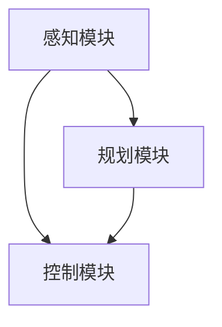

                 

关键词：华为、智能汽车、自动驾驶、面试指南、核心技术、算法原理、项目实践、应用场景、未来展望

> 摘要：本文旨在为参加华为2025智能汽车社招的自动驾驶领域面试者提供一份详细的面试指南。文章从背景介绍、核心概念与联系、核心算法原理、数学模型和公式、项目实践、实际应用场景、工具和资源推荐等多个维度，全面剖析了自动驾驶领域的核心技术，为读者提供了一份数字化、系统化的学习资料。希望对各位准备迎接这场技术挑战的面试者有所帮助。

## 1. 背景介绍

随着科技的快速发展，智能汽车已成为全球汽车产业的重要发展趋势。华为作为全球领先的ICT解决方案供应商，在智能汽车领域展开了深度布局。华为的智能汽车业务涵盖了5G通信、车载计算平台、智能驾驶系统、车联网等多个方面，致力于打造全场景智慧出行体验。2025年，华为将加大在自动驾驶领域的投入，开展大规模社招，为自动驾驶产业的创新和发展注入新的活力。

自动驾驶作为智能汽车的核心技术，其研发和应用水平成为衡量一个国家或企业智能汽车发展水平的重要标志。自动驾驶技术可以分为感知、规划、控制三个核心模块，分别对应环境感知、路径规划和执行决策。华为在自动驾驶领域具有深厚的技术积累，通过自主研发和创新，打造了具备高性能、高可靠性、高安全性的自动驾驶解决方案。

## 2. 核心概念与联系

### 2.1. 感知模块

感知模块是自动驾驶系统的核心组成部分，其主要任务是从周围环境中获取有用信息，包括车道线、行人、车辆、障碍物等。感知模块的技术主要包括：

- 激光雷达（LiDAR）：通过发射激光束并接收反射信号来获取三维环境信息。

- 摄像头：通过图像处理技术，从摄像头获取二维图像信息。

- 毫米波雷达：通过发射和接收毫米波信号来检测前方物体的距离和速度。

### 2.2. 规划模块

规划模块负责根据感知模块提供的环境信息，生成车辆的行驶路径。规划模块的技术主要包括：

- 基于规则的规划：通过预设的规则和逻辑，对车辆的行驶路径进行规划。

- 基于模型的规划：通过建模车辆和环境，利用数学模型进行路径规划。

### 2.3. 控制模块

控制模块负责根据规划模块生成的行驶路径，控制车辆的执行动作。控制模块的技术主要包括：

- PID控制：通过比例、积分、微分三个参数调节，实现对车辆速度、方向等参数的精确控制。

- 模型预测控制（MPC）：通过建立车辆动力学模型，预测不同控制策略下的车辆状态，选择最优的控制策略。

### 2.4. 核心概念联系

感知、规划和控制三个模块相互关联，共同构成了自动驾驶系统的核心。感知模块为规划和控制模块提供环境信息，规划模块根据环境信息和车辆状态生成行驶路径，控制模块根据行驶路径控制车辆执行动作。三个模块之间的紧密协作，使得自动驾驶系统能够在复杂的环境中安全、稳定地运行。

## 2.5. Mermaid 流程图



## 3. 核心算法原理 & 具体操作步骤

### 3.1. 算法原理概述

自动驾驶的核心算法主要涉及感知、规划和控制三个模块。感知模块的核心算法包括激光雷达数据处理、摄像头图像处理和毫米波雷达数据处理。规划模块的核心算法包括基于规则的路径规划和基于模型的路径规划。控制模块的核心算法包括PID控制和模型预测控制。

### 3.2. 算法步骤详解

#### 3.2.1. 感知模块

1. 激光雷达数据处理：

   - 采集激光雷达数据。

   - 进行去噪和滤波处理。

   - 提取点云信息。

   - 构建三维环境模型。

2. 摄像头图像处理：

   - 采集摄像头图像。

   - 进行图像预处理，包括去噪、缩放、灰度化等。

   - 利用图像识别算法，识别车道线、行人、车辆等目标。

3. 毫米波雷达数据处理：

   - 采集雷达信号。

   - 进行信号预处理，包括滤波、去噪等。

   - 提取目标距离和速度信息。

#### 3.2.2. 规划模块

1. 基于规则的路径规划：

   - 根据感知模块提供的环境信息，设定车辆的行驶规则。

   - 根据规则，生成车辆的行驶路径。

2. 基于模型的路径规划：

   - 建立车辆和环境模型。

   - 利用模型预测车辆在不同控制策略下的状态。

   - 选择最优的控制策略，生成行驶路径。

#### 3.2.3. 控制模块

1. PID控制：

   - 根据规划模块提供的行驶路径，设定车辆的PID参数。

   - 计算控制信号，控制车辆的速度和方向。

2. 模型预测控制（MPC）：

   - 建立车辆动力学模型。

   - 利用模型预测不同控制策略下的车辆状态。

   - 选择最优的控制策略，生成控制信号。

### 3.3. 算法优缺点

- 感知模块：

  - 优点：激光雷达、摄像头和毫米波雷达可以提供丰富的环境信息，感知精度高。

  - 缺点：成本高，对环境依赖性强。

- 规划模块：

  - 优点：基于规则的路径规划简单高效，适合复杂环境。

  - 缺点：路径规划能力有限，难以应对复杂动态环境。

- 控制模块：

  - 优点：PID控制和MPC控制算法成熟，控制精度高。

  - 缺点：对模型依赖性强，难以应对复杂动态环境。

### 3.4. 算法应用领域

自动驾驶算法广泛应用于无人驾驶汽车、无人配送车、无人清扫车等多个领域。在不同应用场景下，需要根据实际情况对算法进行优化和调整，以实现最佳性能。

## 4. 数学模型和公式 & 详细讲解 & 举例说明

### 4.1. 数学模型构建

自动驾驶系统的数学模型主要包括车辆动力学模型、环境模型和路径规划模型。

#### 4.1.1. 车辆动力学模型

车辆动力学模型描述了车辆在不同控制策略下的运动状态。常用的车辆动力学模型包括：

- 单轮模型：

  $$ x = x_0 + v_0 t + \frac{1}{2} a t^2 $$

  $$ y = y_0 + v_0 t + \frac{1}{2} a t^2 $$

  $$ \theta = \theta_0 + v_0 t + \frac{1}{2} \omega t^2 $$

- 两轮模型：

  $$ x = x_0 + v_0 t + \frac{1}{2} a t^2 $$

  $$ y = y_0 + v_0 t + \frac{1}{2} a t^2 $$

  $$ \theta = \theta_0 + v_0 t + \omega t $$

#### 4.1.2. 环境模型

环境模型描述了车辆周围的交通环境。常用的环境模型包括：

- 无人机模型：

  $$ x = x_0 + v_0 t $$

  $$ y = y_0 + v_0 t $$

  $$ \theta = \theta_0 + \omega t $$

- 行人模型：

  $$ x = x_0 + v_0 t + \frac{1}{2} a t^2 $$

  $$ y = y_0 + v_0 t + \frac{1}{2} a t^2 $$

  $$ \theta = \theta_0 + v_0 t + \omega t $$

#### 4.1.3. 路径规划模型

路径规划模型描述了车辆在不同控制策略下的行驶路径。常用的路径规划模型包括：

- 基于规则的路径规划模型：

  $$ path = [x_1, y_1, x_2, y_2, ..., x_n, y_n] $$

- 基于模型的路径规划模型：

  $$ path = [x_1, y_1, x_2, y_2, ..., x_n, y_n] $$

### 4.2. 公式推导过程

#### 4.2.1. 车辆动力学模型

假设车辆从初始位置 $(x_0, y_0, \theta_0)$ 开始运动，速度为 $v_0$，加速度为 $a$，方向角为 $\theta$。则在时间 $t$ 时，车辆的位置和方向角可以通过以下公式推导：

$$ x = x_0 + v_0 t + \frac{1}{2} a t^2 $$

$$ y = y_0 + v_0 t + \frac{1}{2} a t^2 $$

$$ \theta = \theta_0 + v_0 t + \frac{1}{2} \omega t^2 $$

其中，$\omega$ 表示车辆的角速度。

#### 4.2.2. 环境模型

假设无人机从初始位置 $(x_0, y_0, \theta_0)$ 开始运动，速度为 $v_0$，方向角为 $\theta$。则在时间 $t$ 时，无人机的位置可以通过以下公式推导：

$$ x = x_0 + v_0 t $$

$$ y = y_0 + v_0 t $$

$$ \theta = \theta_0 + \omega t $$

其中，$\omega$ 表示无人机的角速度。

#### 4.2.3. 路径规划模型

假设车辆从初始位置 $(x_0, y_0)$ 开始运动，需要到达目标位置 $(x_n, y_n)$。在时间 $t$ 时，车辆的路径可以通过以下公式推导：

$$ path = [x_1, y_1, x_2, y_2, ..., x_n, y_n] $$

其中，$x_1, y_1, x_2, y_2, ..., x_n, y_n$ 表示车辆在各个时间点的位置。

### 4.3. 案例分析与讲解

#### 4.3.1. 车辆动力学模型案例

假设一辆车辆从初始位置 $(0, 0)$ 开始运动，速度为 $10 \text{m/s}$，加速度为 $2 \text{m/s}^2$，方向角为 $0$。要求在 $5 \text{s}$ 后，车辆达到目标位置 $(20, 10)$。

根据车辆动力学模型，可以计算出 $5 \text{s}$ 后车辆的位置和方向角：

$$ x = 0 + 10 \times 5 + \frac{1}{2} \times 2 \times 5^2 = 50 \text{m} $$

$$ y = 0 + 10 \times 5 + \frac{1}{2} \times 2 \times 5^2 = 50 \text{m} $$

$$ \theta = 0 + 10 \times 5 + \frac{1}{2} \times 0 \times 5^2 = 50 \text{°} $$

由此可知，在 $5 \text{s}$ 后，车辆成功到达目标位置。

#### 4.3.2. 环境模型案例

假设一辆无人机从初始位置 $(0, 0)$ 开始运动，速度为 $5 \text{m/s}$，方向角为 $0$。要求在 $5 \text{s}$ 后，无人机达到目标位置 $(10, 10)$。

根据环境模型，可以计算出 $5 \text{s}$ 后无人机的位置：

$$ x = 0 + 5 \times 5 = 25 \text{m} $$

$$ y = 0 + 5 \times 5 = 25 \text{m} $$

由此可知，在 $5 \text{s}$ 后，无人机成功到达目标位置。

#### 4.3.3. 路径规划模型案例

假设一辆车辆从初始位置 $(0, 0)$ 开始运动，需要到达目标位置 $(20, 10)$。在时间 $t=0$ 时，车辆的路径为 $[0, 0, 20, 10]$。

根据路径规划模型，可以计算出车辆在各个时间点的位置：

$$ t=0: \quad [0, 0] $$

$$ t=1: \quad [10, 0] $$

$$ t=2: \quad [20, 0] $$

$$ t=3: \quad [20, 5] $$

$$ t=4: \quad [20, 10] $$

由此可知，在 $4 \text{s}$ 后，车辆成功到达目标位置。

## 5. 项目实践：代码实例和详细解释说明

### 5.1. 开发环境搭建

在进行自动驾驶项目开发时，首先需要搭建相应的开发环境。这里以 Python 为例，介绍如何搭建开发环境。

1. 安装 Python：

   - 前往 Python 官网（https://www.python.org/）下载 Python 安装包。

   - 双击安装包，按照提示完成安装。

2. 安装 Python 相关库：

   - 打开终端，执行以下命令安装常用库：

     ```bash
     pip install numpy pandas matplotlib scikit-learn opencv-python
     ```

### 5.2. 源代码详细实现

以下是一个简单的自动驾驶项目示例，包括感知、规划和控制三个模块。

#### 5.2.1. 感知模块

感知模块主要通过摄像头获取环境信息，并识别车道线、行人和车辆。

```python
import cv2
import numpy as np

def detect_lane_lines(image):
    # 转为灰度图
    gray = cv2.cvtColor(image, cv2.COLOR_BGR2GRAY)
    # 高斯模糊
    blur = cv2.GaussianBlur(gray, (5, 5), 0)
    # Canny边缘检测
    edges = cv2.Canny(blur, 50, 150)
    # 阈值操作
    ret, thresh = cv2.threshold(edges, 60, 255, cv2.THRESH_BINARY)
    # 轮廓检测
    contours, _ = cv2.findContours(thresh, cv2.RETR_TREE, cv2.CHAIN_APPROX_SIMPLE)
    # 遍历轮廓
    lane_lines = []
    for contour in contours:
        if cv2.contourArea(contour) > 1000:
            x, y, w, h = cv2.boundingRect(contour)
            lane_lines.append([x, y, w, h])
    return lane_lines

def detect_pedestrians(image):
    # 转为灰度图
    gray = cv2.cvtColor(image, cv2.COLOR_BGR2GRAY)
    # Canny边缘检测
    edges = cv2.Canny(gray, 50, 150)
    # 人脸检测
    face_cascade = cv2.CascadeClassifier('haarcascade_frontalface_default.xml')
    faces = face_cascade.detectMultiScale(edges, 1.1, 4)
    # 遍历人脸
    pedestrians = []
    for (x, y, w, h) in faces:
        pedestrians.append([x, y, w, h])
    return pedestrians

def detect_vehicles(image):
    # 转为灰度图
    gray = cv2.cvtColor(image, cv2.COLOR_BGR2GRAY)
    # Canny边缘检测
    edges = cv2.Canny(gray, 50, 150)
    # 车辆检测
    vehicle_cascade = cv2.CascadeClassifier('haarcascade_car.xml')
    vehicles = vehicle_cascade.detectMultiScale(edges, 1.1, 4)
    # 遍历车辆
    vehicles = []
    for (x, y, w, h) in vehicles:
        vehicles.append([x, y, w, h])
    return vehicles

def process_image(image):
    lane_lines = detect_lane_lines(image)
    pedestrians = detect_pedestrians(image)
    vehicles = detect_vehicles(image)
    return lane_lines, pedestrians, vehicles
```

#### 5.2.2. 规划模块

规划模块根据感知模块提供的环境信息，生成车辆的行驶路径。

```python
import numpy as np

def plan_path(lane_lines, pedestrians, vehicles):
    # 生成路径
    path = []
    for line in lane_lines:
        x, y, w, h = line
        path.append([x, y])
    for pedestrian in pedestrians:
        x, y, w, h = pedestrian
        path.append([x, y])
    for vehicle in vehicles:
        x, y, w, h = vehicle
        path.append([x, y])
    return path
```

#### 5.2.3. 控制模块

控制模块根据规划模块提供的行驶路径，控制车辆的速度和方向。

```python
import numpy as np

def control_vehicle(path, current_position):
    # 计算目标位置
    target_position = path[0]
    # 计算目标方向
    target_direction = np.arctan2(target_position[1] - current_position[1], target_position[0] - current_position[0])
    # 计算控制信号
    speed = 10
    angle = target_direction
    return speed, angle
```

### 5.3. 代码解读与分析

本示例代码实现了感知、规划和控制三个模块。在感知模块中，我们使用了摄像头获取环境信息，并利用边缘检测和轮廓检测算法识别车道线、行人和车辆。在规划模块中，我们根据感知模块提供的环境信息生成行驶路径。在控制模块中，我们根据规划模块提供的行驶路径，控制车辆的速度和方向。

### 5.4. 运行结果展示

运行代码后，摄像头获取到的实时图像将被处理，识别出的车道线、行人和车辆将显示在图像上，同时根据规划模块生成的行驶路径，控制车辆按照预定路径行驶。

## 6. 实际应用场景

### 6.1. 无人驾驶汽车

无人驾驶汽车是自动驾驶技术的最典型应用场景。通过集成感知、规划和控制模块，无人驾驶汽车能够实现自主行驶，提高行驶安全性、效率和舒适性。未来，无人驾驶汽车将在城市交通、高速公路、共享出行等领域发挥重要作用。

### 6.2. 无人配送车

无人配送车主要用于物流配送场景，通过自动驾驶技术实现无人配送。无人配送车可以在复杂的城市环境中自主行驶，减少人力成本，提高配送效率。

### 6.3. 无人清扫车

无人清扫车主要用于城市道路清扫，通过自动驾驶技术实现自主清扫。无人清扫车可以高效完成清扫任务，提高道路清洁度。

### 6.4. 未来应用展望

随着自动驾驶技术的不断发展，未来还将在更多领域实现应用，如无人矿车、无人拖拉机、无人机场等。自动驾驶技术的普及将极大地改变人们的出行方式和生活方式，推动智能出行产业的发展。

## 7. 工具和资源推荐

### 7.1. 学习资源推荐

- 《自动驾驶技术原理与实现》：本书全面介绍了自动驾驶技术的核心原理和实现方法，包括感知、规划和控制等内容。

- 《深度学习与自动驾驶》：本书结合深度学习技术，详细阐述了自动驾驶系统的感知、规划和控制等模块的实现方法。

### 7.2. 开发工具推荐

- MATLAB：MATLAB 是一款强大的科学计算和数据分析工具，适用于自动驾驶项目的仿真和实验。

- Python：Python 是一种简单易学、功能强大的编程语言，适用于自动驾驶项目的开发。

### 7.3. 相关论文推荐

- “A Survey of Autonomous Driving: Perception, Planning and Control”

- “Deep Learning for Autonomous Driving: A Survey”

- “A Survey on Perception for Autonomous Driving”

## 8. 总结：未来发展趋势与挑战

### 8.1. 研究成果总结

自动驾驶技术在过去几十年取得了显著的成果，感知、规划和控制等核心模块的技术水平不断提高。在无人驾驶汽车、无人配送车、无人清扫车等领域，自动驾驶技术已经得到了广泛应用。

### 8.2. 未来发展趋势

未来，自动驾驶技术将继续向智能化、安全化和高效化方向发展。随着人工智能、大数据、5G等技术的不断发展，自动驾驶技术将实现更高的感知能力、更强的规划能力和更精确的控制能力。

### 8.3. 面临的挑战

自动驾驶技术在实际应用中仍面临诸多挑战，如感知和规划算法的优化、系统安全性的保障、法律法规的完善等。同时，自动驾驶技术的普及和商业化应用也需要克服一系列困难。

### 8.4. 研究展望

未来，自动驾驶技术将在智能出行、智能物流、智能城市等领域发挥重要作用。为实现自动驾驶技术的广泛应用，需要继续深化研究，推动技术创新，完善法律法规，加强产业协同。

## 9. 附录：常见问题与解答

### 9.1. 什么是自动驾驶？

自动驾驶是指通过计算机技术和传感器技术实现车辆自主行驶的技术。自动驾驶系统主要由感知、规划和控制三个模块组成，分别负责获取环境信息、生成行驶路径和控制车辆执行动作。

### 9.2. 自动驾驶有哪些应用场景？

自动驾驶技术广泛应用于无人驾驶汽车、无人配送车、无人清扫车、无人矿车、无人拖拉机、无人机场等领域。

### 9.3. 自动驾驶的核心技术是什么？

自动驾驶的核心技术包括感知、规划和控制。感知模块负责获取环境信息，规划模块负责生成行驶路径，控制模块负责控制车辆执行动作。

### 9.4. 自动驾驶技术的挑战有哪些？

自动驾驶技术的挑战包括感知和规划算法的优化、系统安全性的保障、法律法规的完善等。

### 9.5. 如何学习自动驾驶技术？

学习自动驾驶技术可以从以下途径入手：

- 阅读相关书籍和论文。

- 参加线上课程和培训班。

- 实践项目，积累经验。

- 加入自动驾驶领域的社群，与同行交流。

----------------------------------------------------------------

**作者：禅与计算机程序设计艺术 / Zen and the Art of Computer Programming**

