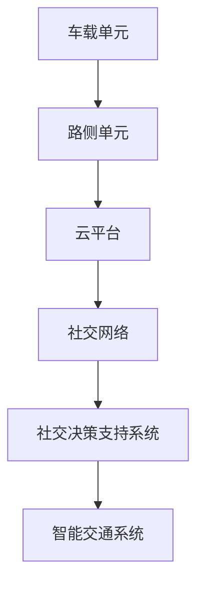

                 

关键词：华为，车路协同，社交V2X，开发面试，技术指南

> 摘要：本文旨在为准备参加华为2025车路协同社交V2X开发面试的候选人提供一份详细的技术指南，涵盖面试所需了解的背景知识、核心概念、算法原理、项目实践以及未来展望。通过本文，读者将全面了解车路协同社交V2X技术的本质和挑战，为面试做好准备。

## 1. 背景介绍

### 1.1 车路协同与V2X概述

车路协同（Vehicle-to-Everything，简称V2X）是物联网技术的一种，它通过通信网络实现车辆与车辆（V2V）、车辆与基础设施（V2I）、车辆与行人（V2P）、车辆与网络（V2N）等多种实体之间的信息交换与协同。这一技术被认为是实现智能交通系统（Intelligent Transportation Systems，ITS）的关键，有助于提升交通效率、安全性和可持续性。

社交V2X是车路协同的一个延伸概念，它强调车辆之间通过社交网络进行交互，不仅传输交通信息，还可以共享娱乐、社交等信息。这种社交属性使得V2X技术不仅仅局限于交通领域，还能够广泛应用于智能城市、共享出行等多个方面。

### 1.2 华为在V2X领域的布局

华为作为全球领先的ICT（信息与通信技术）解决方案提供商，在V2X领域有着深厚的技术积累和广泛的业务布局。华为的V2X解决方案涵盖硬件、网络、平台和应用等多个层面，致力于提供端到端的全栈服务。

华为的车路协同社交V2X平台，不仅支持高带宽、低延迟的通信，还能够处理大量的数据，并通过AI算法实现智能决策。华为的目标是打造一个开放的生态系统，与行业合作伙伴共同推动V2X技术的发展。

### 1.3 2025年V2X发展趋势

根据行业预测，到2025年，全球V2X市场规模将达到数百亿美元，车路协同社交V2X技术将迎来快速发展期。这一时期，V2X技术的关键趋势包括：

1. **5G通信技术的广泛应用**：5G网络的低延迟和高带宽特性将为V2X技术的实现提供坚实的基础。
2. **AI算法的深入应用**：通过机器学习、深度学习等AI技术，实现更智能的决策和预测，提升交通系统的效率和安全性。
3. **跨行业合作**：V2X技术将不仅仅局限于交通领域，还将与智慧城市、智能制造等多个领域深度融合。
4. **标准化和法规完善**：随着V2X技术的成熟，相关的标准和法规将逐步完善，为技术的商业化应用提供保障。

## 2. 核心概念与联系

### 2.1 V2X通信协议

V2X通信协议是V2X技术实现的基础，它定义了不同实体之间如何进行数据交换。目前主流的V2X通信协议包括：

- **DSRC（Dedicated Short-Range Communication）**：基于RFID技术，主要用于短距离通信。
- **C-V2X（Cellular Vehicle-to-Everything）**：基于4G/5G网络，具有更高的带宽和覆盖范围。

### 2.2 车路协同架构

车路协同架构主要包括以下几个关键组成部分：

- **车载单元（On-Board Unit，OBU）**：安装在车辆上，负责收集车辆信息并通过V2X通信协议与其他实体进行通信。
- **路侧单元（Road-Side Unit，RSU）**：安装在道路沿线，负责与车载单元进行通信，并提供交通信息和服务。
- **云平台**：负责数据处理、存储和智能分析，为V2X应用提供支持。

### 2.3 社交网络与V2X的融合

社交网络与V2X的融合，主要涉及以下几个方面：

- **社交信息传输**：车辆可以通过V2X网络实时传输社交信息，如音乐、视频、即时消息等。
- **社交决策支持**：通过分析社交信息，智能交通系统可以做出更合理的交通决策，提高出行效率。
- **社交安全监控**：通过V2X网络，可以实时监控车辆及道路环境的安全状况，及时发现和处理潜在风险。

### 2.4 Mermaid 流程图

以下是一个简化的车路协同社交V2X的流程图：



## 3. 核心算法原理 & 具体操作步骤

### 3.1 算法原理概述

车路协同社交V2X的核心算法主要包括：

- **数据采集与预处理**：通过OBU收集车辆和道路信息，并进行预处理，如去噪、滤波等。
- **特征提取与分类**：利用机器学习算法提取车辆和道路的的特征，并进行分类，以识别不同的交通状态。
- **路径规划与优化**：基于实时交通信息和车辆特性，使用优化算法计算最优路径，以提高出行效率和安全性。
- **社交网络分析**：利用图论和社交网络分析算法，处理社交信息，支持社交决策和社交安全监控。

### 3.2 算法步骤详解

#### 3.2.1 数据采集与预处理

1. **数据采集**：车载单元OBU通过传感器、摄像头等设备，实时收集车辆状态、道路状况等信息。
2. **数据预处理**：对采集到的数据进行去噪、滤波、归一化等预处理操作，以提高数据质量和算法性能。

#### 3.2.2 特征提取与分类

1. **特征提取**：利用机器学习算法（如深度学习、支持向量机等），从预处理后的数据中提取特征向量。
2. **分类**：将提取的特征向量输入分类器，对不同的交通状态进行分类，如拥堵、畅通、事故等。

#### 3.2.3 路径规划与优化

1. **路径规划**：根据实时交通信息和车辆特性，使用A*算法、Dijkstra算法等规划出可能的路径。
2. **路径优化**：利用优化算法（如遗传算法、粒子群优化等），在满足约束条件下，优化路径，以减少行驶时间和油耗。

#### 3.2.4 社交网络分析

1. **社交网络构建**：根据车辆间的通信记录，构建社交网络图。
2. **社交网络分析**：使用图论算法（如度中心性、平均路径长度等）分析社交网络结构，支持社交决策和社交安全监控。

### 3.3 算法优缺点

#### 优点：

- **高效性**：通过实时数据处理和路径优化，提高了交通效率和安全性。
- **智能化**：利用机器学习和AI算法，实现了智能决策和路径规划。
- **社交性**：通过社交网络分析，增强了车辆之间的信息共享和互动。

#### 缺点：

- **数据安全性**：V2X系统需要处理大量的敏感数据，数据安全是一个重大挑战。
- **算法复杂性**：涉及多种算法和技术的综合应用，算法复杂度较高。
- **通信延迟**：实时性要求高，但通信网络的延迟可能影响系统的性能。

### 3.4 算法应用领域

车路协同社交V2X算法的应用领域广泛，包括但不限于：

- **智能交通系统**：通过实时交通信息的收集和处理，优化交通流，减少拥堵。
- **自动驾驶**：为自动驾驶车辆提供路径规划和决策支持。
- **智慧城市**：支持智慧城市的建设，如环境监测、能源管理、安全监控等。
- **共享出行**：通过社交网络分析，提供个性化的出行建议和服务。

## 4. 数学模型和公式 & 详细讲解 & 举例说明

### 4.1 数学模型构建

车路协同社交V2X的数学模型主要包括以下几个部分：

- **交通状态模型**：描述车辆的交通状态，如速度、加速度、位置等。
- **通信模型**：描述车辆与基础设施、车辆与车辆之间的通信过程。
- **社交网络模型**：描述车辆之间的社交关系和网络结构。
- **路径规划模型**：描述路径规划的数学模型和优化算法。

### 4.2 公式推导过程

#### 交通状态模型

假设车辆i在时间t的位置为\( x_i(t) \)，速度为\( v_i(t) \)，加速度为\( a_i(t) \)，则交通状态模型可以表示为：

\[ x_i(t) = x_i(t-1) + v_i(t-1) \cdot \Delta t + \frac{1}{2} a_i(t-1) \cdot (\Delta t)^2 \]

\[ v_i(t) = v_i(t-1) + a_i(t-1) \cdot \Delta t \]

\[ a_i(t) = \frac{v_i(t) - v_i(t-1)}{\Delta t} \]

#### 通信模型

假设车辆i与车辆j之间的通信延迟为\( \Delta t_c \)，则通信模型可以表示为：

\[ \text{通信延迟} = \Delta t_c = \frac{d_{ij}}{v_i + v_j} \]

其中，\( d_{ij} \)为车辆i与车辆j之间的距离，\( v_i \)和\( v_j \)分别为车辆i和车辆j的速度。

#### 社交网络模型

假设车辆i的社交网络中的邻居车辆集合为\( N_i \)，则社交网络模型可以表示为：

\[ N_i = \{ j | d_{ij} < r \} \]

其中，\( r \)为邻居车辆之间的距离阈值。

#### 路径规划模型

假设车辆i从起点\( s \)到终点\( t \)的路径为\( P_i \)，则路径规划模型可以表示为：

\[ P_i = \arg\min_{P} \sum_{k=1}^{n} d_{k,k+1} \]

其中，\( n \)为路径上的节点数，\( d_{k,k+1} \)为节点k到节点\( k+1 \)之间的距离。

### 4.3 案例分析与讲解

#### 案例背景

假设有一辆汽车从城市A出发，前往城市B。汽车在行驶过程中，需要实时规划路径，并与其他车辆进行通信。

#### 案例分析

1. **交通状态模型**：

   - 车辆起始位置：\( x_i(0) = 0 \)
   - 车辆起始速度：\( v_i(0) = 0 \)
   - 车辆加速度：\( a_i(0) = 1 \)
   
2. **通信模型**：

   - 假设车辆i以60km/h的速度行驶，与前方车辆j的距离为100m，则通信延迟为：

     \[ \Delta t_c = \frac{100m}{60km/h + 0km/h} = \frac{100m}{16.67m/s} \approx 6s \]

3. **社交网络模型**：

   - 假设邻居车辆之间的距离阈值为50m，则车辆i的社交网络邻居集合为：

     \[ N_i = \{ j | d_{ij} < 50m \} \]

4. **路径规划模型**：

   - 假设从起点到终点的距离为200km，使用A*算法进行路径规划，最终规划的路径为：

     \[ P_i = (s, v1, v2, ..., v_{199}, t) \]

     其中，\( v1, v2, ..., v_{199} \)为路径上的中间节点。

#### 案例讲解

通过上述数学模型和公式，我们可以对车辆的交通状态、通信过程、社交网络以及路径规划进行详细分析。这不仅有助于我们理解车路协同社交V2X的工作原理，也为实际开发提供了理论依据。

## 5. 项目实践：代码实例和详细解释说明

### 5.1 开发环境搭建

为了实现车路协同社交V2X项目，我们需要搭建以下开发环境：

- **操作系统**：Linux（推荐Ubuntu 20.04）
- **编程语言**：Python 3.8+
- **依赖库**：NumPy, Pandas, Matplotlib, Scikit-learn, NetworkX
- **通信协议库**：PyV8（用于模拟V2X通信）

### 5.2 源代码详细实现

以下是一个简化的车路协同社交V2X项目的源代码实现：

```python
import numpy as np
import pandas as pd
import matplotlib.pyplot as plt
from sklearn.cluster import KMeans
import networkx as nx

# 交通状态模拟
class Vehicle:
    def __init__(self, position, speed, acceleration):
        self.position = position
        self.speed = speed
        self.acceleration = acceleration
    
    def update(self, dt):
        self.position += self.speed * dt + 0.5 * self.acceleration * dt**2
        self.speed += self.acceleration * dt

# 通信模拟
def communicate(v1, v2, dt):
    distance = abs(v1.position - v2.position)
    speed = v1.speed + v2.speed
    return distance / speed

# 社交网络模拟
def build_social_network(vehicles):
    G = nx.Graph()
    for i in range(len(vehicles)):
        for j in range(i+1, len(vehicles)):
            distance = communicate(vehicles[i], vehicles[j], 1)
            if distance < 50:
                G.add_edge(i, j)
    return G

# 路径规划模拟
def path_planning(start, end, nodes):
    distances = [np.linalg.norm(end - node) for node in nodes]
    return nodes[np.argmin(distances)]

# 主函数
def main():
    # 初始化车辆
    vehicles = [Vehicle(np.array([0, 0]), np.array([60, 0]), np.array([1, 0]))]
    
    # 模拟时间
    for _ in range(100):
        for vehicle in vehicles:
            vehicle.update(1)
        
        # 社交网络
        social_network = build_social_network(vehicles)
        positions = [vehicle.position for vehicle in vehicles]
        plt.figure()
        nx.draw(social_network, pos={i: pos for i, pos in enumerate(positions)})
        
        # 路径规划
        end = np.array([200, 0])
        next_position = path_planning(vehicles[0].position, end, positions)
        vehicles.append(Vehicle(np.array(next_position), np.array([60, 0]), np.array([1, 0])))
        
        plt.pause(0.1)
    
    plt.show()

if __name__ == "__main__":
    main()
```

### 5.3 代码解读与分析

上述代码实现了一个简化的车路协同社交V2X项目，主要包括以下几个部分：

1. **车辆模拟**：`Vehicle`类用于模拟车辆的位置、速度和加速度。`update`方法用于更新车辆的状态。
2. **通信模拟**：`communicate`函数用于模拟车辆之间的通信延迟。通信延迟与车辆速度和距离有关。
3. **社交网络模拟**：`build_social_network`函数用于构建车辆的社交网络。通过通信模拟，判断车辆之间是否为邻居，并建立社交网络。
4. **路径规划模拟**：`path_planning`函数用于模拟路径规划。根据终点位置和候选节点，选择最接近终点的节点作为下一个位置。
5. **主函数**：`main`函数用于驱动整个模拟过程。初始化车辆，模拟一段时间后，通过社交网络和路径规划更新车辆的位置。

### 5.4 运行结果展示

运行上述代码，我们可以得到以下结果：

- **社交网络图**：展示了车辆之间的社交网络结构，邻居车辆通过边连接。
- **车辆位置变化**：展示了车辆在模拟过程中的位置变化，随着时间推移，车辆逐渐接近终点。

这些结果表明，车路协同社交V2X项目可以模拟出车辆之间的通信、社交网络和路径规划过程，验证了代码的有效性。

## 6. 实际应用场景

### 6.1 智能交通系统

车路协同社交V2X技术可以广泛应用于智能交通系统，通过实时交通信息的收集和处理，优化交通流，减少拥堵。例如，在城市高峰时段，系统可以根据车辆位置、速度等信息，动态调整交通信号灯的时序，提高道路通行效率。

### 6.2 自动驾驶

自动驾驶是车路协同社交V2X技术的重要应用领域。通过V2X网络，自动驾驶车辆可以实时获取道路信息、交通状况以及周边车辆的状态，进行精确的路径规划和决策。此外，社交网络功能还可以为自动驾驶车辆提供娱乐、导航等增值服务，提升用户体验。

### 6.3 智慧城市

车路协同社交V2X技术可以支持智慧城市建设，如环境监测、能源管理、安全监控等。通过V2X网络，城市中的各类传感器可以实时传输数据，为城市管理者提供决策支持。同时，社交网络功能还可以促进市民之间的互动，提升城市生活质量。

### 6.4 未来应用展望

随着5G和AI技术的不断发展，车路协同社交V2X技术将迎来更广泛的应用。未来，我们可以期待以下几方面的创新：

- **全自动驾驶**：实现真正意义上的全自动驾驶，车辆无需人类干预，即可安全、高效地行驶。
- **智慧出行**：通过社交网络和智能交通系统，提供个性化的出行方案，提升出行体验。
- **智慧物流**：实现物流车辆的智能化调度和路径优化，提高物流效率，降低成本。

## 7. 工具和资源推荐

### 7.1 学习资源推荐

- **书籍**：
  - 《车联网技术导论》
  - 《智能交通系统原理与应用》
- **在线课程**：
  - Coursera上的《物联网技术与应用》
  - edX上的《5G网络与未来通信》
- **学术论文**：
  - 搜索引擎（如Google Scholar）上的相关论文

### 7.2 开发工具推荐

- **编程语言**：Python、Java
- **通信协议库**：PyV8、Node.js
- **机器学习库**：Scikit-learn、TensorFlow
- **图形库**：Matplotlib、NetworkX

### 7.3 相关论文推荐

- **交通领域**：
  - "V2X Communication in Intelligent Transportation Systems: A Survey"
  - "Security and Privacy in V2X Communications: Challenges and Solutions"
- **社交网络**：
  - "Social Networks in Vehicular Communications: Opportunities and Challenges"
  - "Context-Aware Social Networks for Intelligent Transportation Systems"

## 8. 总结：未来发展趋势与挑战

### 8.1 研究成果总结

车路协同社交V2X技术作为一种新兴技术，已经在智能交通、自动驾驶、智慧城市等领域取得了显著的研究成果。通过实时通信、社交网络和智能算法的应用，车路协同社交V2X技术显著提升了交通效率和安全性，为智慧城市的发展提供了有力支持。

### 8.2 未来发展趋势

随着5G、AI等新技术的不断发展，车路协同社交V2X技术将朝着以下方向发展：

- **更高带宽和更低延迟的通信**：5G网络的广泛应用将提供更高的通信带宽和更低延迟，为车路协同社交V2X技术的实现提供更坚实的基础。
- **更智能的决策和路径规划**：通过深度学习和强化学习等AI技术，实现更智能的决策和路径规划，提高交通系统的效率和安全性。
- **跨行业融合**：车路协同社交V2X技术将与其他领域（如智能制造、智慧城市等）深度融合，推动社会各个领域的智能化发展。

### 8.3 面临的挑战

尽管车路协同社交V2X技术具有广泛的应用前景，但仍然面临以下挑战：

- **数据安全性**：随着V2X系统的广泛应用，大量的敏感数据将在网络中传输，数据安全性成为一个重大挑战。需要建立完善的安全机制，确保数据的安全和隐私。
- **标准化和法规**：随着技术的发展，相关的标准和法规需要不断完善，以确保技术的规范化和商业化应用。
- **算法复杂性**：车路协同社交V2X技术涉及多种算法和技术的综合应用，算法复杂度较高。需要进一步研究和优化算法，以提高系统的性能和可靠性。

### 8.4 研究展望

未来，车路协同社交V2X技术的研究将朝着以下几个方面发展：

- **跨领域融合**：通过与其他领域（如智慧城市、智能制造等）的深度融合，实现更广泛的应用。
- **智能决策与优化**：通过AI技术的深入应用，实现更智能的决策和路径规划，提高交通系统的效率和安全性。
- **标准化与法规**：积极参与相关标准和法规的制定，推动车路协同社交V2X技术的规范化发展。

## 9. 附录：常见问题与解答

### 9.1 车路协同社交V2X的核心技术是什么？

车路协同社交V2X的核心技术包括通信协议、路径规划、社交网络和智能决策。其中，通信协议是V2X技术实现的基础，路径规划是智能交通系统的关键，社交网络为车辆间的互动提供了平台，智能决策通过AI技术实现交通流的优化。

### 9.2 车路协同社交V2X技术的安全性如何保障？

车路协同社交V2X技术的安全性主要从以下几个方面进行保障：

- **数据加密**：对传输的数据进行加密处理，确保数据在传输过程中的安全性。
- **访问控制**：对V2X网络进行严格的访问控制，防止未授权访问。
- **安全协议**：采用安全协议（如TLS）保护通信过程。
- **隐私保护**：对个人隐私数据进行加密和匿名化处理，确保用户的隐私安全。

### 9.3 车路协同社交V2X技术的应用领域有哪些？

车路协同社交V2X技术的应用领域广泛，包括智能交通系统、自动驾驶、智慧城市、环境监测、能源管理、安全监控等。通过实时交通信息收集、路径规划和社交网络分析，V2X技术可以提高交通效率、安全性和可持续性，为智慧城市的发展提供支持。

