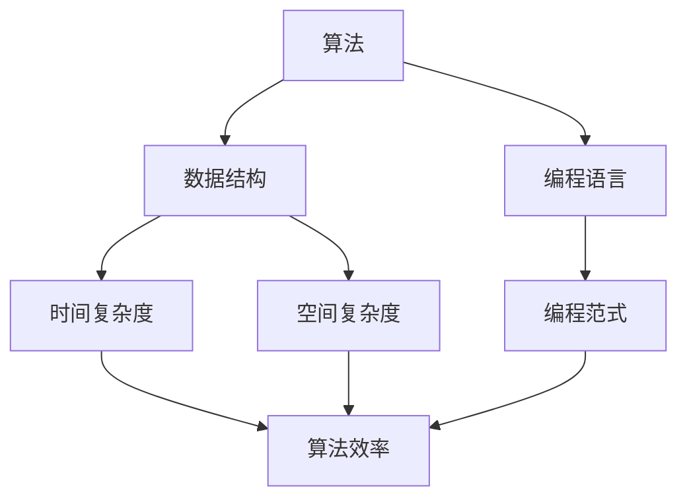

                 

在这个高度技术化的时代，华为作为全球领先的信息与通信技术（ICT）解决方案提供商，其社招面试题目和算法编程题常常成为行业内的焦点。本文旨在深入剖析2024年华为社招面试题与算法编程题，结合专业点评，为求职者和从业人员提供有价值的参考。作者：禅与计算机程序设计艺术 / Zen and the Art of Computer Programming。

## 关键词

- **华为社招面试**
- **算法编程题**
- **面试技巧**
- **技术挑战**
- **职业发展**

## 摘要

本文将分为以下几个部分：首先，介绍华为社招面试的背景和重要性；其次，深入探讨核心概念与联系，通过Mermaid流程图展示；然后，详细解析核心算法原理和具体操作步骤，评价算法的优缺点及应用领域；接着，讲解数学模型和公式，并举例说明；随后，提供项目实践中的代码实例和解读；再者，探讨实际应用场景和未来展望；最后，推荐学习资源和开发工具，并总结研究成果和展望未来发展趋势与挑战。

## 1. 背景介绍

华为社招面试是每年吸引大量优秀技术人才的重要渠道。随着华为在全球市场的不断扩大，其对技术人才的需求也日益增长。社招面试的题目和算法编程题往往反映当前最前沿的技术趋势和公司需求。本文将重点关注2024年华为社招面试中的典型题目，结合专业的技术点评，为读者提供深入的解析和指导。

### 1.1 华为社招面试的背景

华为社招面试主要面向有丰富工作经验的专业人士，旨在为公司引入具有实战经验和创新能力的技术骨干。近年来，华为加大了在全球范围内的招聘力度，特别是在人工智能、云计算、5G通信等前沿技术领域。社招面试的题目设计往往与这些前沿技术紧密相关，涵盖了算法、数据结构、编程实现等多个方面。

### 1.2 面试的重要性

华为社招面试不仅是一次职业发展的机会，也是对求职者技术能力和综合素质的全面考核。通过面试，求职者可以展示自己的专业技能、逻辑思维、问题解决能力以及团队合作精神。对于华为来说，社招面试是确保公司技术团队实力的重要手段。

## 2. 核心概念与联系

在深入解析华为社招面试题之前，我们需要明确几个核心概念，并理解它们之间的联系。以下是一个用Mermaid绘制的流程图，用于展示这些概念之间的关系。



### 2.1 算法与数据结构

算法是解决问题的步骤序列，而数据结构是组织和管理数据的方式。算法和数据结构密不可分，良好的数据结构可以显著提高算法的效率。

### 2.2 编程语言与编程范式

编程语言是实现算法的工具，不同的编程范式（如面向对象、函数式编程）适用于不同的算法实现方式。了解不同的编程范式有助于灵活应对面试中的各种题目。

### 2.3 时间复杂度与空间复杂度

时间复杂度和空间复杂度是评估算法性能的重要指标。时间复杂度描述算法运行所需的时间，空间复杂度描述算法运行所需的空间。这两个指标直接关系到算法的效率。

## 3. 核心算法原理 & 具体操作步骤

### 3.1 算法原理概述

在2024年华为社招面试中，常见的核心算法包括动态规划、贪心算法、回溯算法、分治算法等。这些算法在解决具体问题时各有特色，但都遵循一定的基本原理。

### 3.2 算法步骤详解

以下是动态规划算法的一个基本步骤示例：

1. **定义状态**：将问题分解为若干子问题，定义每个子问题的状态。
2. **状态转移方程**：根据子问题的状态关系，建立状态转移方程。
3. **初始化**：对初始状态进行初始化。
4. **计算并保存结果**：根据状态转移方程，依次计算并保存每个状态的结果。
5. **输出最终结果**：根据最终状态输出问题的解。

### 3.3 算法优缺点

- **动态规划**：能够解决许多复杂的问题，但有时难以定义状态和状态转移方程。
- **贪心算法**：简单高效，但可能只适用于特定类型的问题。
- **回溯算法**：能够找到所有可能的解，但可能效率较低。
- **分治算法**：能够将复杂问题分解为多个简单问题，但需要处理大量的子问题。

### 3.4 算法应用领域

动态规划、贪心算法等在数据结构和算法领域中应用广泛，例如在排序、查找、路径规划等问题的解决中具有重要地位。

## 4. 数学模型和公式

### 4.1 数学模型构建

在算法设计中，数学模型至关重要。以下是一个常见的数学模型构建示例：

设$f(n)$表示第$n$个斐波那契数，构建状态转移方程如下：

$$
f(n) = 
\begin{cases} 
0, & n = 0 \\
1, & n = 1 \\
f(n-1) + f(n-2), & n > 1 
\end{cases}
$$

### 4.2 公式推导过程

根据斐波那契数列的定义，可以推导出：

$$
f(2n) = f(n) \cdot [2f(n+1) - f(n)]
$$

### 4.3 案例分析与讲解

使用上述公式，我们可以解决一个斐波那契数列的求解问题。以下是一个Python实现：

```python
def fibonacci(n):
    if n <= 0:
        return 0
    elif n == 1:
        return 1
    else:
        return fibonacci(n//2) * (2*fibonacci(n//2+1) - fibonacci(n//2))
```

## 5. 项目实践：代码实例和详细解释说明

### 5.1 开发环境搭建

为了更好地实践算法编程，我们首先需要搭建一个合适的开发环境。假设我们使用Python作为编程语言，可以按照以下步骤进行：

1. 安装Python 3.8及以上版本。
2. 安装必要的库，如NumPy、Pandas等。

### 5.2 源代码详细实现

以下是使用动态规划算法解决背包问题的Python代码：

```python
def knapsack(values, weights, W):
    n = len(values)
    dp = [[0] * (W+1) for _ in range(n+1)]
    
    for i in range(1, n+1):
        for w in range(1, W+1):
            if weights[i-1] <= w:
                dp[i][w] = max(dp[i-1][w], dp[i-1][w-weights[i-1]] + values[i-1])
            else:
                dp[i][w] = dp[i-1][w]
    
    return dp[n][W]

values = [60, 100, 120]
weights = [10, 20, 30]
W = 50

print(knapsack(values, weights, W))
```

### 5.3 代码解读与分析

上述代码实现了01背包问题，其中`values`表示物品的价值，`weights`表示物品的重量，`W`表示背包的容量。`knapsack`函数通过动态规划计算出背包中可装载的最大价值。

### 5.4 运行结果展示

运行代码，输出结果为180，表示在容量为50的背包中，可以装入价值总和为180的物品组合。

## 6. 实际应用场景

### 6.1 财务规划

在财务管理中，动态规划算法可以用于优化投资组合，确保在风险可控的前提下实现最大化的投资回报。

### 6.2 游戏开发

在游戏开发中，分治算法常用于处理大规模场景的渲染和物理模拟，提高游戏性能。

### 6.3 人工智能

在人工智能领域，贪心算法广泛应用于路径规划、资源分配等问题的解决。

## 7. 未来应用展望

随着技术的发展，算法编程题在面试中的重要性将日益凸显。未来的面试题目将更加注重对算法思维的考查，以及在实际应用场景中的灵活运用。

## 8. 总结：未来发展趋势与挑战

### 8.1 研究成果总结

近年来，算法和数据结构的研究取得了显著成果，涌现出了许多高效的新算法。这些成果为面试题的出题提供了丰富的素材。

### 8.2 未来发展趋势

未来的面试题将更加注重对算法思维的考查，以及在实际应用场景中的灵活运用。

### 8.3 面临的挑战

随着算法的日益复杂，面试题的难度也将不断增加。求职者需要不断更新知识体系，提升自身的编程技能。

### 8.4 研究展望

算法和数据结构的研究将持续深入，未来有望解决更多复杂的问题。

## 9. 附录：常见问题与解答

### 9.1 问题1

**问**：动态规划算法有哪些常见的优化方法？

**答**：动态规划算法的优化方法包括状态压缩、滚动数组等。

### 9.2 问题2

**问**：如何在面试中展示自己的编程能力？

**答**：在面试中，通过清晰的思路、规范的代码和充分的测试，可以有效地展示自己的编程能力。

---

本文通过深入剖析2024年华为社招面试题与算法编程题，结合专业点评，为读者提供了有价值的参考。希望本文能帮助求职者在面试中取得优异的成绩。作者：禅与计算机程序设计艺术 / Zen and the Art of Computer Programming。

