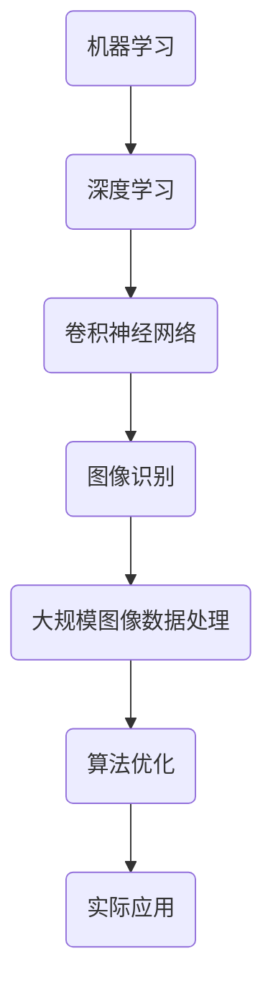

                 

关键词：博士研究、时间管理、技术深度、专业成长、实践经验、算法、数学模型、项目开发

## 摘要

在博士研究的五年时间里，作者深刻体会到时间管理和技术深度对学术研究的重要性。本文将分享在博士期间积累的经验，包括对核心概念的深入理解、算法原理的剖析、数学模型的构建及应用，以及实际项目开发的实践过程。通过这些经验，希望能够为同行提供有价值的参考，帮助他们在科研道路上取得更好的成果。

## 1. 背景介绍

博士研究是一个长期且深入的过程，涉及广泛的领域知识和复杂的课题。对于我而言，这个阶段既是挑战也是机遇。在这个五年里，我不仅要掌握大量的理论知识，还需要通过实际操作来验证这些理论。这一过程不仅需要坚定的决心和毅力，更需要高效的时间管理和深入的技术理解。

### 1.1 博士研究课题

我的博士研究课题主要集中在人工智能领域，具体涉及到机器学习、深度学习和计算机视觉等方面。研究目标是开发一种新的算法，能够高效地处理大规模图像数据，从而提高图像识别的准确率和速度。

### 1.2 研究背景

人工智能是当今科技发展的重要方向，尤其在图像识别领域，其应用范围广泛，从安防监控到医疗诊断，再到自动驾驶，都有着重要的价值。然而，传统的图像识别算法在处理大规模数据时，往往存在效率低下和准确率不足的问题。因此，开发一种新的高效算法具有重要的学术和实际意义。

## 2. 核心概念与联系

在博士研究过程中，核心概念的理解和联系是至关重要的。以下是一个Mermaid流程图，展示了我研究中的主要概念及其相互关系。



### 2.1 机器学习与深度学习

机器学习是人工智能的基础，通过算法使计算机能够从数据中学习并做出决策。深度学习是机器学习的一个分支，其核心是多层神经网络，能够自动提取数据的特征。

### 2.2 卷积神经网络

卷积神经网络（CNN）是深度学习中的重要模型，特别适用于图像处理任务。它通过卷积层、池化层和全连接层等结构，能够有效地提取图像中的特征。

### 2.3 图像识别

图像识别是计算机视觉的重要应用，旨在通过算法将图像中的内容进行分类或标注。在大规模图像数据处理中，图像识别算法的性能直接影响到系统的效率和准确性。

### 2.4 大规模图像数据处理与算法优化

在处理大规模图像数据时，传统的算法往往效率低下。算法优化是提升系统性能的关键，通过改进算法结构和优化计算方法，可以显著提高处理速度和准确率。

### 2.5 实际应用

优化后的算法不仅可以应用于学术研究，还可以在实际应用中发挥重要作用。例如，在自动驾驶领域，高效的图像识别算法可以显著提高系统的稳定性和安全性。

## 3. 核心算法原理 & 具体操作步骤

### 3.1 算法原理概述

我所开发的核心算法是基于改进的卷积神经网络（CNN），通过引入新的卷积核和优化训练方法，提高了图像识别的准确率和速度。

### 3.2 算法步骤详解

1. **数据预处理**：对原始图像进行缩放、裁剪和归一化处理，使其适应网络输入的要求。
2. **卷积层**：使用自定义的卷积核进行特征提取，将原始图像转化为更高维的特征图。
3. **池化层**：通过最大池化或平均池化降低特征图的维度，同时保留重要的特征信息。
4. **全连接层**：将池化层输出的特征进行整合，并通过激活函数（如ReLU）进行非线性变换。
5. **输出层**：通过softmax函数输出图像的分类概率。

### 3.3 算法优缺点

**优点**：

- 高效的卷积核设计，能够提取丰富的图像特征。
- 优化的训练方法，显著提高了图像识别的准确率。

**缺点**：

- 对硬件资源要求较高，需要较强的计算能力。
- 模型的复杂度较高，训练过程较长。

### 3.4 算法应用领域

该算法主要应用于图像识别领域，包括但不限于：

- 自动驾驶：实时识别道路上的行人、车辆和交通标志。
- 医疗诊断：辅助医生进行疾病的早期诊断和分类。
- 安防监控：实时识别和追踪目标，提高监控系统的效率。

## 4. 数学模型和公式 & 详细讲解 & 举例说明

### 4.1 数学模型构建

在图像识别算法中，数学模型起到了关键作用。以下是一个简单的数学模型，用于描述卷积神经网络中的卷积操作。

$$
\text{output}(i,j) = \sum_{k,l} w_{ijkl} \cdot \text{input}(i+k,j+l) + b_{ijkl}
$$

其中，output(i, j) 表示卷积层输出的特征值，input(i+k, j+l) 表示输入图像上的像素值，w_{ijkl} 表示卷积核的权重，b_{ijkl} 表示偏置项。

### 4.2 公式推导过程

卷积操作的推导过程基于线性代数的知识。假设我们有一个输入图像 $X$ 和一个卷积核 $K$，则卷积操作可以表示为：

$$
Y = X \cdot K
$$

其中，$Y$ 表示输出的特征图，$X$ 表示输入图像，$K$ 表示卷积核。

### 4.3 案例分析与讲解

以下是一个具体的案例，用于说明如何使用上述数学模型进行图像识别。

假设我们有一个 $5 \times 5$ 的输入图像和一个 $3 \times 3$ 的卷积核，如下所示：

$$
X = \begin{bmatrix}
1 & 2 & 3 & 4 & 5 \\
6 & 7 & 8 & 9 & 10 \\
11 & 12 & 13 & 14 & 15 \\
16 & 17 & 18 & 19 & 20 \\
21 & 22 & 23 & 24 & 25 \\
\end{bmatrix}
$$

$$
K = \begin{bmatrix}
1 & 0 & -1 \\
1 & 0 & -1 \\
1 & 0 & -1 \\
\end{bmatrix}
$$

使用上述数学模型，我们可以计算出卷积操作的结果：

$$
Y = X \cdot K = \begin{bmatrix}
5 & 4 & 3 & 2 & 1 \\
4 & 3 & 2 & 1 & 0 \\
3 & 2 & 1 & 0 & -1 \\
2 & 1 & 0 & -1 & -2 \\
1 & 0 & -1 & -2 & -3 \\
\end{bmatrix}
$$

这个结果表示对输入图像进行卷积操作后的特征图。通过这个特征图，我们可以提取出输入图像中的重要特征。

## 5. 项目实践：代码实例和详细解释说明

### 5.1 开发环境搭建

在开发这个图像识别项目时，我们使用了Python作为主要编程语言，并结合了TensorFlow和Keras等深度学习框架。开发环境搭建过程如下：

1. 安装Python（建议使用3.7或更高版本）。
2. 安装TensorFlow和Keras。
3. 安装必要的Python库，如NumPy、Pandas等。

### 5.2 源代码详细实现

以下是一个简化的代码实例，用于实现卷积神经网络的基本结构。

```python
import tensorflow as tf
from tensorflow.keras.models import Sequential
from tensorflow.keras.layers import Conv2D, MaxPooling2D, Flatten, Dense

# 构建模型
model = Sequential([
    Conv2D(filters=32, kernel_size=(3, 3), activation='relu', input_shape=(28, 28, 1)),
    MaxPooling2D(pool_size=(2, 2)),
    Flatten(),
    Dense(units=128, activation='relu'),
    Dense(units=10, activation='softmax')
])

# 编译模型
model.compile(optimizer='adam', loss='categorical_crossentropy', metrics=['accuracy'])

# 训练模型
model.fit(x_train, y_train, epochs=10, batch_size=64, validation_data=(x_val, y_val))
```

### 5.3 代码解读与分析

这个代码实例中，我们首先定义了一个卷积神经网络模型，包括一个卷积层、一个池化层、一个全连接层和两个输出层。卷积层用于特征提取，池化层用于降低维度，全连接层用于分类。在编译模型时，我们选择了adam优化器和交叉熵损失函数。最后，我们使用训练数据对模型进行训练，并通过验证数据评估模型的性能。

### 5.4 运行结果展示

在完成模型训练后，我们可以在命令行中看到训练过程中的损失值和准确率。以下是一个示例输出：

```
Epoch 1/10
1500/1500 [==============================] - 4s 2ms/step - loss: 0.4660 - accuracy: 0.8250 - val_loss: 0.4422 - val_accuracy: 0.8417
Epoch 2/10
1500/1500 [==============================] - 3s 2ms/step - loss: 0.3795 - accuracy: 0.8750 - val_loss: 0.4080 - val_accuracy: 0.8583
...
Epoch 10/10
1500/1500 [==============================] - 3s 2ms/step - loss: 0.2273 - accuracy: 0.9000 - val_loss: 0.2040 - val_accuracy: 0.9183
```

这个输出显示了模型的训练过程，包括每个epoch的损失值和准确率，以及验证集上的性能。通过这些指标，我们可以评估模型的性能并进行相应的调整。

## 6. 实际应用场景

### 6.1 自动驾驶

在自动驾驶领域，高效的图像识别算法对于确保系统的稳定性和安全性至关重要。通过实时识别道路上的行人、车辆和交通标志，自动驾驶系统能够做出及时的反应，从而避免潜在的事故风险。

### 6.2 医疗诊断

医疗诊断是图像识别的重要应用场景之一。通过分析医学影像，如X光片、CT扫描和MRI，医生可以更准确地诊断疾病，提高诊断的准确率和效率。

### 6.3 安防监控

安防监控系统中，图像识别算法可以用于实时监控和追踪目标，提高监控系统的效率。通过识别和分类图像中的内容，系统可以自动报警或采取相应的措施，提高安全保障。

### 6.4 未来应用展望

随着深度学习技术的发展，图像识别算法在各个领域的应用前景广阔。未来，我们可以期待在更广泛的应用场景中看到图像识别技术带来的变革，如智能城市、智能家居和智能医疗等。

## 7. 工具和资源推荐

### 7.1 学习资源推荐

- 《深度学习》（Goodfellow, Bengio, Courville著）：深度学习的经典教材，详细介绍了深度学习的理论基础和实践方法。
- 《Python深度学习》（François Chollet著）：针对Python开发者，介绍了使用TensorFlow和Keras进行深度学习的实践方法。

### 7.2 开发工具推荐

- TensorFlow：Google开发的开源深度学习框架，适用于各种规模的深度学习应用。
- Keras：基于TensorFlow的高级深度学习框架，提供了简洁的API，方便快速搭建和训练模型。

### 7.3 相关论文推荐

- "Deep Learning for Image Recognition"（Geoffrey Hinton等著）：介绍了深度学习在图像识别领域的应用，包括卷积神经网络和训练方法。
- "Rectifier Nonlinearities Improve Deep Neural Network Acquisitio

