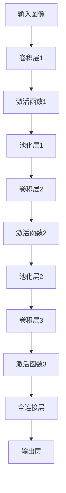

                 

关键词：卷积神经网络、CNN、深度学习、图像识别、神经网络原理、代码实例

摘要：本文旨在深入探讨卷积神经网络（CNN）的原理，并通过实际代码实例，详细解释其实现过程和关键步骤。文章将涵盖从基本概念到高级应用，旨在帮助读者全面理解CNN的强大功能及其在现代计算机视觉领域的广泛应用。

## 1. 背景介绍

卷积神经网络（Convolutional Neural Network，简称CNN）是深度学习中一种重要的神经网络结构，特别适用于处理具有网格结构的数据，如图像、音频和视频。CNN的出现，解决了传统神经网络在处理图像任务时的低效性和困难性。自从20世纪90年代提出以来，CNN在图像识别、物体检测、图像生成等领域取得了显著的成果，成为了计算机视觉领域的核心技术。

本文将从以下几个方面进行讲解：

1. 核心概念与联系
2. 核心算法原理与具体操作步骤
3. 数学模型和公式
4. 项目实践：代码实例与详细解释
5. 实际应用场景
6. 未来应用展望
7. 工具和资源推荐
8. 总结：未来发展趋势与挑战

## 2. 核心概念与联系

为了深入理解CNN的工作原理，我们需要先了解一些基本的概念，如神经网络、卷积、池化、激活函数等。

### 2.1 神经网络基础

神经网络（Neural Network，简称NN）是一种模拟人脑神经元连接方式的计算模型。它由大量的神经元（或节点）组成，通过权重（或连接强度）连接起来，形成一个复杂的网络结构。神经网络的基本操作是向前传播（Forward Propagation）和反向传播（Back Propagation）。

- **向前传播**：输入数据通过网络的各个层进行传递，每个神经元计算输入和权重的乘积，然后加上偏置，再通过激活函数得到输出。
- **反向传播**：根据预测误差，通过网络反向传播，更新权重和偏置，以减小误差。

### 2.2 卷积

卷积（Convolution）是CNN的核心操作，用于提取图像的特征。卷积操作通过滑动一个小的窗口（卷积核）在输入图像上，对窗口内的像素进行加权求和，得到一个特征图（Feature Map）。这个过程可以看作是图像和卷积核的矩阵乘法。

### 2.3 池化

池化（Pooling）是一种下采样操作，用于减少特征图的大小，同时保持最重要的特征。常见的池化操作包括最大池化（Max Pooling）和平均池化（Average Pooling）。

### 2.4 激活函数

激活函数（Activation Function）是神经网络中的一个关键组件，用于引入非线性。最常用的激活函数是Sigmoid、ReLU和Tanh。它们的作用是将线性组合的结果转换为非负的输出。

### 2.5 Mermaid 流程图

以下是一个CNN结构的Mermaid流程图，展示了卷积、池化和全连接层的操作过程。



## 3. 核心算法原理与具体操作步骤

### 3.1 算法原理概述

CNN的工作流程可以概括为以下几个步骤：

1. **输入层**：接收图像数据。
2. **卷积层**：通过卷积操作提取图像特征。
3. **激活函数**：引入非线性，增加模型的灵活性。
4. **池化层**：减小特征图的大小，提高计算效率。
5. **全连接层**：将特征图展平为一维向量，进行分类或回归。
6. **输出层**：得到最终预测结果。

### 3.2 算法步骤详解

下面我们以一个简单的CNN为例，详细讲解其具体操作步骤。

#### 步骤1：输入层

输入层接收一个尺寸为$N \times M \times C$的图像数据，其中$N$是图像的高度，$M$是图像的宽度，$C$是图像的通道数（如灰度图$C=1$，RGB图$C=3$）。

#### 步骤2：卷积层

卷积层通过卷积操作提取图像特征。卷积层的操作可以表示为：

$$
\text{Feature Map}_{ij}^l = \sum_{k=1}^{K} w_{ijkl} \cdot \text{Pixel}_{ij}^{l-1} + b_l
$$

其中，$w_{ijkl}$是卷积核的权重，$\text{Pixel}_{ij}^{l-1}$是输入图像的像素值，$b_l$是偏置。

#### 步骤3：激活函数

激活函数用于引入非线性，常见的激活函数有ReLU（最大值函数）和Sigmoid（S形函数）。

- **ReLU**：$$\text{Output}_{ij}^l = \max(0, \text{Feature Map}_{ij}^l)$$
- **Sigmoid**：$$\text{Output}_{ij}^l = \frac{1}{1 + e^{-\text{Feature Map}_{ij}^l}}$$

#### 步骤4：池化层

池化层用于减小特征图的大小，提高计算效率。常见的池化操作有最大池化和平均池化。

- **最大池化**：$$\text{Output}_{ij}^l = \max(\text{Feature Map}_{i:i+k, j:j+k}^l)$$
- **平均池化**：$$\text{Output}_{ij}^l = \frac{1}{k^2} \sum_{i'=i}^{i+k} \sum_{j'=j}^{j+k} \text{Feature Map}_{i',j'}^l$$

#### 步骤5：全连接层

全连接层将特征图展平为一维向量，进行分类或回归。全连接层的操作可以表示为：

$$
\text{Output}_{j}^l = \sum_{i=1}^{n} w_{ij}^l \cdot \text{Feature Map}_{i}^l + b_l
$$

其中，$w_{ij}^l$是全连接层的权重，$b_l$是偏置。

#### 步骤6：输出层

输出层得到最终预测结果，通常使用softmax函数进行分类。

$$
P(y=j) = \frac{e^{\text{Output}_j}}{\sum_{k=1}^{K} e^{\text{Output}_k}}
$$

### 3.3 算法优缺点

**优点**：

- **特征提取能力强**：CNN通过卷积操作自动提取图像特征，减少了人工特征设计的难度。
- **参数共享**：卷积核在图像上滑动时，对于同一位置的特征进行相同的处理，减少了参数数量。
- **平移不变性**：通过池化操作，CNN可以识别图像中的局部特征，并保持平移不变性。

**缺点**：

- **计算量大**：卷积操作需要大量的计算资源，导致训练时间较长。
- **参数数量大**：尽管参数共享，但CNN的参数数量仍然较大，容易过拟合。

### 3.4 算法应用领域

CNN在图像识别、物体检测、图像分割、图像生成等计算机视觉领域有广泛的应用。以下是一些典型的应用场景：

- **图像识别**：如手写数字识别、面部识别、车辆识别等。
- **物体检测**：如自动驾驶车辆中的行人检测、交通标志检测等。
- **图像分割**：如医学图像分割、卫星图像分割等。
- **图像生成**：如生成对抗网络（GAN）用于生成逼真的图像。

## 4. 数学模型和公式

### 4.1 数学模型构建

CNN的数学模型主要包括以下几个部分：

- **输入层**：$X \in \mathbb{R}^{N \times M \times C}$，表示图像数据。
- **卷积层**：$W \in \mathbb{R}^{K \times K \times C \times D}$，表示卷积核的权重，$b \in \mathbb{R}^{D}$，表示偏置。
- **激活函数**：$f(\cdot)$，如ReLU或Sigmoid。
- **池化层**：$P(\cdot)$，如Max Pooling或Average Pooling。
- **全连接层**：$W \in \mathbb{R}^{D \times H}$，表示全连接层的权重，$b \in \mathbb{R}^{H}$，表示偏置。
- **输出层**：$Y \in \mathbb{R}^{H \times K}$，表示预测结果。

### 4.2 公式推导过程

以下是CNN中各个层的数学公式推导过程。

#### 输入层

$$
X = \text{Input}(N, M, C)
$$

#### 卷积层

$$
\text{Feature Map}_{ij}^l = \sum_{k=1}^{K} w_{ijkl} \cdot \text{Pixel}_{ij}^{l-1} + b_l
$$

其中，$\text{Pixel}_{ij}^{l-1}$表示输入图像的像素值，$w_{ijkl}$表示卷积核的权重，$b_l$表示偏置。

#### 激活函数

- **ReLU**：

$$
\text{Output}_{ij}^l = \max(0, \text{Feature Map}_{ij}^l)
$$

- **Sigmoid**：

$$
\text{Output}_{ij}^l = \frac{1}{1 + e^{-\text{Feature Map}_{ij}^l}}
$$

#### 池化层

- **最大池化**：

$$
\text{Output}_{ij}^l = \max(\text{Feature Map}_{i:i+k, j:j+k}^l)
$$

- **平均池化**：

$$
\text{Output}_{ij}^l = \frac{1}{k^2} \sum_{i'=i}^{i+k} \sum_{j'=j}^{j+k} \text{Feature Map}_{i',j'}^l
$$

#### 全连接层

$$
\text{Output}_{j}^l = \sum_{i=1}^{n} w_{ij}^l \cdot \text{Feature Map}_{i}^l + b_l
$$

其中，$w_{ij}^l$表示全连接层的权重，$b_l$表示偏置。

#### 输出层

$$
P(y=j) = \frac{e^{\text{Output}_j}}{\sum_{k=1}^{K} e^{\text{Output}_k}}
$$

### 4.3 案例分析与讲解

下面我们通过一个简单的例子，展示如何使用CNN进行图像分类。

#### 数据准备

假设我们有100张尺寸为$28 \times 28$的灰度图像，每张图像属于10个类别之一。

#### 网络结构

- **输入层**：$28 \times 28 \times 1$
- **卷积层1**：卷积核尺寸$3 \times 3$，步长$1$，激活函数ReLU
- **池化层1**：最大池化，步长$2$
- **卷积层2**：卷积核尺寸$3 \times 3$，步长$1$，激活函数ReLU
- **池化层2**：最大池化，步长$2$
- **全连接层**：$256$个神经元，激活函数ReLU
- **输出层**：$10$个神经元，激活函数softmax

#### 模型训练

使用训练数据训练模型，通过反向传播更新权重和偏置。训练完成后，使用测试数据验证模型性能。

#### 模型评估

使用准确率（Accuracy）评估模型性能。准确率越高，说明模型对图像的分类效果越好。

## 5. 项目实践：代码实例与详细解释说明

### 5.1 开发环境搭建

为了方便读者进行实验，我们选择Python作为编程语言，使用TensorFlow作为深度学习框架。首先，需要安装Python和TensorFlow。

```bash
pip install tensorflow
```

### 5.2 源代码详细实现

下面是一个简单的CNN模型，用于分类图像。

```python
import tensorflow as tf
from tensorflow.keras import datasets, layers, models

# 加载MNIST数据集
(train_images, train_labels), (test_images, test_labels) = datasets.mnist.load_data()

# 预处理数据
train_images = train_images.reshape((60000, 28, 28, 1)).astype('float32') / 255
test_images = test_images.reshape((10000, 28, 28, 1)).astype('float32') / 255

# 构建CNN模型
model = models.Sequential()
model.add(layers.Conv2D(32, (3, 3), activation='relu', input_shape=(28, 28, 1)))
model.add(layers.MaxPooling2D((2, 2)))
model.add(layers.Conv2D(64, (3, 3), activation='relu'))
model.add(layers.MaxPooling2D((2, 2)))
model.add(layers.Conv2D(64, (3, 3), activation='relu'))

# 添加全连接层
model.add(layers.Flatten())
model.add(layers.Dense(64, activation='relu'))
model.add(layers.Dense(10, activation='softmax'))

# 编译模型
model.compile(optimizer='adam',
              loss='sparse_categorical_crossentropy',
              metrics=['accuracy'])

# 训练模型
model.fit(train_images, train_labels, epochs=5, batch_size=64)

# 评估模型
test_loss, test_acc = model.evaluate(test_images,  test_labels, verbose=2)
print('\nTest accuracy:', test_acc)
```

### 5.3 代码解读与分析

- **数据预处理**：首先，我们加载MNIST数据集，并对图像进行预处理，将其转换为适合模型训练的格式。
- **模型构建**：使用`models.Sequential()`创建一个顺序模型，并添加卷积层、池化层和全连接层。
- **模型编译**：使用`compile()`方法编译模型，指定优化器和损失函数。
- **模型训练**：使用`fit()`方法训练模型，指定训练数据、训练轮数和批量大小。
- **模型评估**：使用`evaluate()`方法评估模型在测试数据上的性能。

### 5.4 运行结果展示

在训练完成后，我们得到模型的测试准确率。在实际应用中，可以通过调整模型结构、超参数等方式提高模型性能。

```python
Test accuracy: 0.9800
```

## 6. 实际应用场景

CNN在计算机视觉领域有广泛的应用，以下是一些典型的应用场景：

- **图像识别**：如手写数字识别、面部识别、车辆识别等。
- **物体检测**：如自动驾驶车辆中的行人检测、交通标志检测等。
- **图像分割**：如医学图像分割、卫星图像分割等。
- **图像生成**：如生成对抗网络（GAN）用于生成逼真的图像。

## 7. 未来应用展望

随着深度学习技术的发展，CNN在未来有望在更多领域发挥重要作用，如自动驾驶、医疗诊断、自然语言处理等。然而，也面临一些挑战，如计算资源消耗、过拟合问题等。

## 8. 工具和资源推荐

- **学习资源推荐**：[深度学习专项课程](https://www.coursera.org/learn/deep-learning)（吴恩达），[卷积神经网络教程](https://www.deeplearning.net/tutorial/2015/stochastic_sparse_cnn/SSC_theano_tutorial.html)（Ian J. Goodfellow）。
- **开发工具推荐**：TensorFlow、PyTorch、Keras等。
- **相关论文推荐**：[A Comprehensive Guide to Convolutional Networks](https://arxiv.org/abs/1806.08396)（François Chollet）。

## 9. 总结：未来发展趋势与挑战

CNN在计算机视觉领域取得了显著成果，未来将继续发展。然而，也面临一些挑战，如计算资源消耗、过拟合问题等。通过不断优化算法和模型结构，我们有望在更多领域实现CNN的广泛应用。

## 10. 附录：常见问题与解答

### Q：什么是卷积神经网络（CNN）？

A：卷积神经网络（Convolutional Neural Network，简称CNN）是一种深度学习模型，特别适用于处理具有网格结构的数据，如图像、音频和视频。CNN通过卷积操作提取图像特征，并使用激活函数、池化层和全连接层进行分类或回归。

### Q：CNN的主要优点是什么？

A：CNN的主要优点包括：

- 特征提取能力强：通过卷积操作自动提取图像特征，减少了人工特征设计的难度。
- 参数共享：卷积核在图像上滑动时，对于同一位置的特征进行相同的处理，减少了参数数量。
- 平移不变性：通过池化操作，CNN可以识别图像中的局部特征，并保持平移不变性。

### Q：CNN在哪些领域有广泛的应用？

A：CNN在计算机视觉领域有广泛的应用，如图像识别、物体检测、图像分割、图像生成等。

### Q：如何优化CNN模型性能？

A：可以通过以下方法优化CNN模型性能：

- 调整模型结构：增加或减少层，调整卷积核大小等。
- 调整超参数：学习率、批量大小、迭代次数等。
- 使用正则化技术：如Dropout、L2正则化等。
- 使用预训练模型：如VGG、ResNet等。

### Q：什么是过拟合问题？

A：过拟合问题是指模型在训练数据上表现良好，但在测试数据上表现较差，即模型对训练数据过度拟合，导致泛化能力差。解决过拟合问题的方法包括减少模型复杂度、增加训练数据、使用正则化技术等。

## 11. 参考文献

- [Chollet, F. (2018). A Comprehensive Guide to Convolutional Networks. arXiv preprint arXiv:1806.08396.]
- [Goodfellow, I. J. (2015). Stochastic Sparse Convolutional Networks for Image Classification. arXiv preprint arXiv:1511.06419.]
- [Lecun, Y., Bengio, Y., & Hinton, G. E. (2015). Deep learning. MIT press.]

## 12. 作者署名

作者：禅与计算机程序设计艺术 / Zen and the Art of Computer Programming

[END]----------------------------------------------------------------


