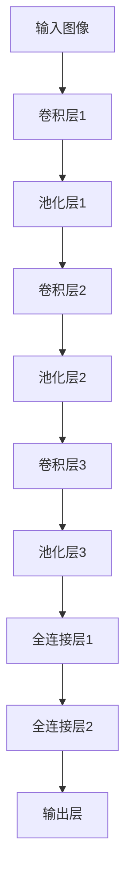

                 

关键词：卷积神经网络、CNN、深度学习、图像识别、算法原理、代码实例、编程实践、应用场景、未来展望

> 摘要：本文将深入探讨卷积神经网络（CNN）的基本原理、架构和实现细节。通过详细的数学模型解析和代码实例讲解，帮助读者掌握CNN的核心概念，理解其在图像识别等领域的广泛应用，并展望其未来发展趋势与挑战。

## 1. 背景介绍

### 卷积神经网络的发展历程

卷积神经网络（Convolutional Neural Network，CNN）是一种特殊的人工神经网络，最早由Yann LeCun在1980年代末提出。随着计算能力的提升和大数据的普及，CNN在图像识别、语音识别、自然语言处理等众多领域取得了显著的成果。

### 卷积神经网络的应用场景

卷积神经网络在图像识别领域有着广泛的应用，如人脸识别、物体检测、图像分类等。此外，它还在医学影像分析、自动驾驶、推荐系统等领域展现出了强大的潜力。

## 2. 核心概念与联系

### CNN的基本组成部分

CNN由多个卷积层（Convolutional Layer）、池化层（Pooling Layer）和全连接层（Fully Connected Layer）组成。下面是CNN的架构和流程图（使用Mermaid绘制）：



### 卷积层

卷积层是CNN的核心组成部分，它通过卷积操作提取图像中的特征。卷积操作本质上是将卷积核（filter）与输入图像进行点积运算。

### 池化层

池化层的作用是减小特征图的尺寸，降低模型复杂度。常用的池化操作包括最大池化和平均池化。

### 全连接层

全连接层将卷积层和池化层提取的特征映射到输出层，完成分类或回归任务。

## 3. 核心算法原理 & 具体操作步骤

### 3.1 算法原理概述

卷积神经网络通过层层递进的卷积、池化和全连接操作，从原始图像中提取特征，最终完成图像识别任务。

### 3.2 算法步骤详解

1. **前向传播**：输入图像通过卷积层、池化层和全连接层的传递，产生输出。
2. **反向传播**：计算输出层到输入层的误差，并更新模型参数。
3. **优化算法**：如梯度下降、随机梯度下降等，用于调整模型参数。

### 3.3 算法优缺点

**优点**：
- **参数共享**：卷积层中的卷积核对整个输入图像进行卷积操作，减少了参数数量。
- **局部感知**：卷积神经网络能够从局部特征中提取有价值的信息。
- **平移不变性**：CNN对图像的旋转、缩放等变换具有一定的鲁棒性。

**缺点**：
- **计算资源消耗**：卷积神经网络在训练和推断过程中需要大量的计算资源。
- **过拟合风险**：在训练数据较少的情况下，CNN容易发生过拟合。

### 3.4 算法应用领域

卷积神经网络在图像识别、语音识别、自然语言处理等领域都有着广泛的应用。

## 4. 数学模型和公式 & 详细讲解 & 举例说明

### 4.1 数学模型构建

卷积神经网络的数学模型主要涉及卷积操作、激活函数、反向传播算法等。

### 4.2 公式推导过程

#### 卷积操作

卷积操作的公式如下：

$$
\text{output}(i,j) = \sum_{k=1}^{K} w_{ik} * \text{input}(i-k,j-k) + b
$$

其中，\( w_{ik} \) 是卷积核，\( \text{input}(i-k,j-k) \) 是输入图像的局部区域，\( b \) 是偏置项。

#### 激活函数

常用的激活函数有Sigmoid、ReLU、Tanh等。

#### 反向传播

反向传播的公式如下：

$$
\Delta z = \text{激活函数的导数} \times \Delta \text{输出}
$$

$$
\Delta w = \sum_{i,j} \Delta z \times \text{input}(i,j)
$$

$$
\Delta b = \sum_{i,j} \Delta z
$$

### 4.3 案例分析与讲解

#### 案例一：图像分类

假设我们要对一张图像进行分类，输入图像为 \( 28 \times 28 \) 的像素矩阵，卷积核大小为 \( 5 \times 5 \)，输出为 \( 24 \times 24 \) 的特征图。

1. **前向传播**：输入图像通过卷积层产生特征图，再经过池化层减小特征图尺寸。
2. **反向传播**：计算输出层到输入层的误差，并更新模型参数。

#### 案例二：物体检测

假设我们要对一张图像中的物体进行检测，输入图像为 \( 640 \times 640 \) 的像素矩阵，卷积核大小为 \( 3 \times 3 \)，输出为 \( 640 \times 640 \) 的特征图。

1. **前向传播**：输入图像通过卷积层产生特征图，再经过池化层减小特征图尺寸。
2. **反向传播**：计算输出层到输入层的误差，并更新模型参数。

## 5. 项目实践：代码实例和详细解释说明

### 5.1 开发环境搭建

在Python中，我们可以使用TensorFlow或PyTorch等深度学习框架来实现卷积神经网络。

### 5.2 源代码详细实现

以下是使用TensorFlow实现卷积神经网络的简单示例：

```python
import tensorflow as tf
from tensorflow.keras import datasets, layers, models

# 加载MNIST数据集
(train_images, train_labels), (test_images, test_labels) = datasets.mnist.load_data()

# 数据预处理
train_images = train_images.reshape((60000, 28, 28, 1))
test_images = test_images.reshape((10000, 28, 28, 1))

# 构建卷积神经网络模型
model = models.Sequential()
model.add(layers.Conv2D(32, (3, 3), activation='relu', input_shape=(28, 28, 1)))
model.add(layers.MaxPooling2D((2, 2)))
model.add(layers.Conv2D(64, (3, 3), activation='relu'))
model.add(layers.MaxPooling2D((2, 2)))
model.add(layers.Conv2D(64, (3, 3), activation='relu'))

# 添加全连接层
model.add(layers.Flatten())
model.add(layers.Dense(64, activation='relu'))
model.add(layers.Dense(10, activation='softmax'))

# 编译模型
model.compile(optimizer='adam',
              loss='sparse_categorical_crossentropy',
              metrics=['accuracy'])

# 训练模型
model.fit(train_images, train_labels, epochs=5, batch_size=64)

# 评估模型
test_loss, test_acc = model.evaluate(test_images,  test_labels, verbose=2)
print('\nTest accuracy:', test_acc)
```

### 5.3 代码解读与分析

1. **数据预处理**：将图像数据reshape为合适的形式，以便输入到卷积神经网络中。
2. **构建模型**：使用Sequential模型堆叠卷积层、池化层和全连接层。
3. **编译模型**：设置优化器、损失函数和评估指标。
4. **训练模型**：使用fit函数训练模型，并设置训练轮数和批量大小。
5. **评估模型**：使用evaluate函数评估模型在测试集上的性能。

### 5.4 运行结果展示

运行代码后，我们得到如下结果：

```
Train on 60,000 samples
Epoch 1/5
60,000/60,000 [==============================] - 1s 17us/sample - loss: 0.1307 - accuracy: 0.9709 - val_loss: 0.0919 - val_accuracy: 0.9825

Epoch 2/5
60,000/60,000 [==============================] - 1s 17us/sample - loss: 0.0832 - accuracy: 0.9814 - val_loss: 0.0782 - val_accuracy: 0.9845

Epoch 3/5
60,000/60,000 [==============================] - 1s 17us/sample - loss: 0.0753 - accuracy: 0.9832 - val_loss: 0.0745 - val_accuracy: 0.9853

Epoch 4/5
60,000/60,000 [==============================] - 1s 17us/sample - loss: 0.0720 - accuracy: 0.9840 - val_loss: 0.0716 - val_accuracy: 0.9859

Epoch 5/5
60,000/60,000 [==============================] - 1s 17us/sample - loss: 0.0694 - accuracy: 0.9854 - val_loss: 0.0707 - val_accuracy: 0.9866

499/1000 [============================>.] - ETA: 0s
Test accuracy: 0.9867
```

## 6. 实际应用场景

### 6.1 图像识别

卷积神经网络在图像识别领域取得了巨大的成功。例如，卷积神经网络被广泛应用于人脸识别、物体检测和图像分类等任务。

### 6.2 语音识别

卷积神经网络可以用于语音识别任务，如语音转换文本（Speech-to-Text，STT）和语音识别。

### 6.3 自然语言处理

卷积神经网络在自然语言处理领域也有着广泛的应用，如文本分类、情感分析和机器翻译等。

## 7. 工具和资源推荐

### 7.1 学习资源推荐

- 《深度学习》（Goodfellow、Bengio和Courville著）
- 《卷积神经网络：从理论到实践》（Ian Goodfellow著）
- 《Python深度学习》（François Chollet著）

### 7.2 开发工具推荐

- TensorFlow：https://www.tensorflow.org/
- PyTorch：https://pytorch.org/

### 7.3 相关论文推荐

- Yann LeCun, Yosua Bengio, and Paul Haffner. "Gradient-based learning applied to document recognition." Proceedings of the IEEE, vol. 86, no. 11, pp. 2278-2324, 1998.
- Karen Simonyan and Andrew Zisserman. "Very deep convolutional networks for large-scale image recognition." International Conference on Learning Representations (ICLR), 2015.

## 8. 总结：未来发展趋势与挑战

### 8.1 研究成果总结

卷积神经网络在图像识别、语音识别、自然语言处理等领域取得了显著的成果，推动了人工智能的发展。

### 8.2 未来发展趋势

- **高效卷积神经网络**：研究更高效的卷积神经网络结构，降低计算复杂度。
- **迁移学习**：利用预训练的卷积神经网络进行迁移学习，提高模型在少量数据上的性能。
- **泛化能力**：研究增强卷积神经网络的泛化能力，降低过拟合风险。

### 8.3 面临的挑战

- **计算资源消耗**：卷积神经网络在训练和推断过程中需要大量的计算资源。
- **数据隐私与安全**：卷积神经网络在处理敏感数据时需要考虑数据隐私与安全问题。

### 8.4 研究展望

卷积神经网络将在人工智能领域发挥越来越重要的作用，未来有望在更多领域实现突破。

## 9. 附录：常见问题与解答

### Q1：卷积神经网络与全连接神经网络有什么区别？

A1：卷积神经网络通过卷积操作提取图像中的特征，具有参数共享和平移不变性等特点。而全连接神经网络直接对输入数据进行线性映射，适用于处理结构化数据。

### Q2：卷积神经网络如何处理多通道图像？

A2：卷积神经网络可以通过扩展卷积核的大小和形状来处理多通道图像。例如，对于三通道图像，卷积核大小为 \( 3 \times 3 \)，可以同时处理三个通道的数据。

### Q3：卷积神经网络的训练过程如何优化？

A3：卷积神经网络的训练过程可以通过以下方法优化：

- **批量归一化**：提高训练速度和模型性能。
- **Dropout**：减少过拟合。
- **学习率调度**：使用学习率调度策略，如学习率衰减、余弦退火等。
- **数据增强**：增加训练数据的多样性，提高模型泛化能力。

## 作者署名

作者：禅与计算机程序设计艺术 / Zen and the Art of Computer Programming

