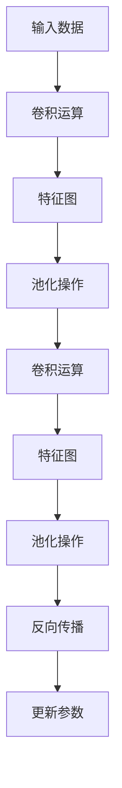

                 

关键词：卷积神经网络、CNN、深度学习、神经网络、图像识别、计算机视觉、Python代码、深度学习框架、数学模型

## 摘要

卷积神经网络（Convolutional Neural Network，简称CNN）是深度学习领域中的一种重要模型，尤其在图像识别和计算机视觉领域取得了显著的成果。本文将从卷积神经网络的基本概念、核心算法原理、数学模型、项目实践等方面进行详细讲解，并通过代码实例展示如何使用深度学习框架实现CNN。希望本文能帮助读者更好地理解和掌握卷积神经网络的技术要点和应用方法。

## 1. 背景介绍

### 1.1 卷积神经网络的发展历程

卷积神经网络最早由Yann LeCun等人在1980年代末提出，其灵感来源于生物神经网络中对视觉信息的处理方式。卷积神经网络在早期的研究中主要应用于手写数字识别，并在手写数字识别任务上取得了比传统机器学习方法更好的效果。

随着计算机硬件的发展和深度学习技术的不断进步，卷积神经网络在图像识别、物体检测、语义分割等领域取得了突破性的成果。特别是在2012年，AlexNet在ImageNet图像识别挑战赛中取得了显著优势，使得卷积神经网络在深度学习领域得到了广泛关注。

### 1.2 卷积神经网络的应用场景

卷积神经网络在图像识别和计算机视觉领域具有广泛的应用场景，如：

1. 图像分类：对输入图像进行标签分类，如猫狗识别、植物分类等。
2. 物体检测：在图像中检测出特定物体并标注其位置，如人脸检测、车辆检测等。
3. 语义分割：对图像中的每个像素进行分类，将不同类别的像素进行分割，如道路分割、人体关键点检测等。

### 1.3 本文目标

本文旨在介绍卷积神经网络的基本概念、核心算法原理、数学模型以及如何使用深度学习框架实现CNN。通过本文的学习，读者将能够：

1. 理解卷积神经网络的工作原理和基本结构；
2. 掌握卷积神经网络的核心算法原理和操作步骤；
3. 学会使用深度学习框架搭建和训练卷积神经网络；
4. 理解卷积神经网络在不同应用场景中的优势和应用方法。

## 2. 核心概念与联系

### 2.1 神经网络

神经网络是一种由大量神经元组成的计算模型，可以用于解决各种机器学习问题。神经网络的基本结构包括输入层、隐藏层和输出层。输入层接收外部输入信息，隐藏层通过一系列的数学运算对输入信息进行处理，输出层产生最终的输出结果。

### 2.2 卷积运算

卷积运算是卷积神经网络的核心运算，它通过对输入数据进行加权求和并进行非线性变换，以提取特征信息。卷积运算可以通过一个卷积核（也称为滤波器）来实现，卷积核在输入数据上滑动，对每个位置进行加权求和，得到一个特征图。

### 2.3 池化操作

池化操作是卷积神经网络中用于减小特征图尺寸的操作，可以有效减少计算量和参数数量。常见的池化操作包括最大值池化和平均值池化。

### 2.4 Mermaid 流程图

以下是卷积神经网络的Mermaid流程图，展示了卷积运算、池化操作以及反向传播的过程。



## 3. 核心算法原理 & 具体操作步骤

### 3.1 算法原理概述

卷积神经网络的核心算法原理包括卷积运算、池化操作和反向传播。卷积运算用于提取特征信息，池化操作用于减小特征图尺寸，反向传播用于训练模型参数。

### 3.2 算法步骤详解

1. **输入数据预处理**：将输入数据（如图像）转换为神经网络可以处理的格式，如将图像数据转换为二维矩阵。

2. **卷积运算**：使用卷积核在输入数据上滑动，对每个位置进行加权求和，得到一个特征图。卷积运算可以通过以下公式表示：

   $$ f(x, y) = \sum_{i=1}^{m} \sum_{j=1}^{n} w_{ij} * x(i, j) $$

   其中，$f(x, y)$表示特征图的值，$w_{ij}$表示卷积核的权重，$x(i, j)$表示输入数据的值。

3. **激活函数**：对特征图进行非线性变换，常用的激活函数有ReLU（Rectified Linear Unit）和Sigmoid。

4. **池化操作**：对特征图进行下采样，减小特征图的尺寸。常见的池化操作包括最大值池化和平均值池化。

5. **卷积运算和池化操作重复**：对多个卷积层和池化层进行堆叠，以提取更高级别的特征信息。

6. **全连接层**：将卷积神经网络的特征图展平为一维向量，然后通过全连接层进行分类或回归。

7. **损失函数和反向传播**：计算输出结果与真实结果之间的差异，使用损失函数（如交叉熵损失函数）衡量模型的误差。然后，通过反向传播算法更新模型参数。

### 3.3 算法优缺点

**优点**：

1. **高效的特征提取**：卷积神经网络可以通过卷积运算和池化操作提取图像中的局部特征和全局特征，具有较强的特征表达能力。
2. **参数共享**：卷积神经网络中的卷积核可以在不同的位置进行共享，减少模型参数的数量，提高模型的训练效率。
3. **可扩展性**：卷积神经网络可以堆叠多个卷积层和池化层，以提取更高级别的特征信息。

**缺点**：

1. **计算量大**：卷积神经网络在处理大规模图像数据时，计算量较大，需要较高的计算资源。
2. **训练时间较长**：卷积神经网络的训练时间较长，尤其是在训练深度较大的模型时。

### 3.4 算法应用领域

卷积神经网络在图像识别、物体检测、语义分割等计算机视觉领域取得了显著的成果，如：

1. **图像分类**：如ImageNet图像识别挑战赛，卷积神经网络在图像分类任务中取得了超过人类的表现。
2. **物体检测**：如Fast R-CNN、Faster R-CNN等模型，可以同时进行图像分类和物体检测。
3. **语义分割**：如FCN（Fully Convolutional Network）、U-Net等模型，可以对图像中的每个像素进行分类。

## 4. 数学模型和公式 & 详细讲解 & 举例说明

### 4.1 数学模型构建

卷积神经网络的数学模型主要包括以下几个部分：

1. **输入层**：输入层接收外部输入数据，如图像。输入数据可以表示为一个二维矩阵，其中每个元素表示图像中的一个像素值。

2. **卷积层**：卷积层通过卷积运算提取图像中的特征信息。卷积层由多个卷积核组成，每个卷积核可以提取图像中的一个局部特征。

3. **激活函数**：激活函数对卷积层的特征图进行非线性变换，增强模型的特征表达能力。

4. **池化层**：池化层对卷积层的特征图进行下采样，减小特征图的尺寸，减少计算量和参数数量。

5. **全连接层**：全连接层将卷积层的特征图展平为一维向量，然后通过全连接层进行分类或回归。

6. **输出层**：输出层产生最终的输出结果，如分类结果或回归值。

### 4.2 公式推导过程

以下是卷积神经网络的数学模型推导过程：

1. **卷积运算**：

   $$ f(x, y) = \sum_{i=1}^{m} \sum_{j=1}^{n} w_{ij} * x(i, j) $$

   其中，$f(x, y)$表示特征图的值，$w_{ij}$表示卷积核的权重，$x(i, j)$表示输入数据的值。

2. **激活函数**：

   $$ g(f(x, y)) = \max(0, f(x, y)) \quad (\text{ReLU激活函数}) $$

3. **池化操作**：

   $$ p(x, y) = \max_{(i, j) \in \Omega} f(i, j) \quad (\text{最大值池化}) $$

   其中，$\Omega$表示池化窗口。

4. **全连接层**：

   $$ h(x) = \sum_{i=1}^{n} w_i * x_i + b $$

   其中，$h(x)$表示输出值，$w_i$表示权重，$x_i$表示输入值，$b$表示偏置。

5. **损失函数**：

   $$ L(y, h(x)) = -\sum_{i=1}^{n} y_i \log(h_i(x)) \quad (\text{交叉熵损失函数}) $$

### 4.3 案例分析与讲解

假设我们有一个简单的卷积神经网络，包含一个输入层、一个卷积层、一个激活函数、一个池化层和一个全连接层。输入数据是一个$28 \times 28$的灰度图像。

1. **输入层**：

   输入数据表示为一个$28 \times 28$的二维矩阵，每个元素表示图像中的一个像素值。

2. **卷积层**：

   假设卷积层包含一个卷积核，卷积核的大小为$3 \times 3$，共有$32$个卷积核。卷积运算可以表示为：

   $$ f(x, y) = \sum_{i=1}^{32} \sum_{j=1}^{3} \sum_{k=1}^{3} w_{ijk} * x(i+k, j+k) $$

   其中，$w_{ijk}$表示卷积核的权重，$x(i+k, j+k)$表示输入数据的值。

3. **激活函数**：

   使用ReLU激活函数，对卷积层的特征图进行非线性变换。

4. **池化层**：

   使用最大值池化，对卷积层的特征图进行下采样，减小特征图的尺寸。

5. **全连接层**：

   将池化层后的特征图展平为一维向量，通过全连接层进行分类。

6. **输出层**：

   输出层的神经元数量为$10$，表示$10$个类别。

通过以上步骤，我们可以实现一个简单的卷积神经网络，用于对输入图像进行分类。

## 5. 项目实践：代码实例和详细解释说明

### 5.1 开发环境搭建

在进行卷积神经网络的项目实践之前，我们需要搭建一个适合深度学习的开发环境。以下是使用Python和TensorFlow框架搭建开发环境的过程：

1. 安装Python：从Python官方网站（https://www.python.org/downloads/）下载并安装Python。
2. 安装Anaconda：下载并安装Anaconda，它是一个集成了Python、TensorFlow和其他常用库的科学计算平台。
3. 安装TensorFlow：在命令行中运行以下命令安装TensorFlow：

   ```shell
   conda install tensorflow
   ```

4. 创建一个Python虚拟环境（可选）：为了保持开发环境的整洁，我们可以创建一个Python虚拟环境，并在虚拟环境中安装相关库。

   ```shell
   conda create -n cnn_project python=3.8
   conda activate cnn_project
   ```

### 5.2 源代码详细实现

以下是一个简单的卷积神经网络项目示例，实现一个对MNIST手写数字进行分类的任务。

```python
import tensorflow as tf
from tensorflow.keras import layers, models
import numpy as np
import matplotlib.pyplot as plt

# 加载MNIST数据集
mnist = tf.keras.datasets.mnist
(train_images, train_labels), (test_images, test_labels) = mnist.load_data()

# 数据预处理
train_images = train_images / 255.0
test_images = test_images / 255.0

# 构建卷积神经网络模型
model = models.Sequential()
model.add(layers.Conv2D(32, (3, 3), activation='relu', input_shape=(28, 28, 1)))
model.add(layers.MaxPooling2D((2, 2)))
model.add(layers.Conv2D(64, (3, 3), activation='relu'))
model.add(layers.MaxPooling2D((2, 2)))
model.add(layers.Conv2D(64, (3, 3), activation='relu'))
model.add(layers.Flatten())
model.add(layers.Dense(64, activation='relu'))
model.add(layers.Dense(10, activation='softmax'))

# 编译模型
model.compile(optimizer='adam',
              loss='sparse_categorical_crossentropy',
              metrics=['accuracy'])

# 训练模型
model.fit(train_images, train_labels, epochs=5)

# 评估模型
test_loss, test_acc = model.evaluate(test_images, test_labels)
print(f'测试准确率：{test_acc:.2f}')

# 可视化预测结果
predictions = model.predict(test_images)
predicted_labels = np.argmax(predictions, axis=1)

plt.figure(figsize=(10, 10))
for i in range(25):
    plt.subplot(5, 5, i+1)
    plt.imshow(test_images[i], cmap=plt.cm.binary)
    plt.xticks([])
    plt.yticks([])
    plt.grid(False)
    plt.xlabel(str(predicted_labels[i]))
plt.show()
```

### 5.3 代码解读与分析

以上代码实现了一个简单的卷积神经网络，用于对MNIST手写数字进行分类。下面是对代码的详细解读：

1. **导入库**：导入TensorFlow、NumPy和matplotlib等库。
2. **加载数据集**：使用TensorFlow的mnist数据集加载训练数据和测试数据。
3. **数据预处理**：将图像数据缩放到0-1之间，以适应神经网络的输入。
4. **构建模型**：使用Sequential模型堆叠多个层，包括卷积层、池化层和全连接层。
5. **编译模型**：指定优化器、损失函数和评估指标。
6. **训练模型**：使用fit方法训练模型，指定训练数据和训练轮数。
7. **评估模型**：使用evaluate方法评估模型在测试数据上的性能。
8. **可视化预测结果**：使用predict方法预测测试数据，并绘制预测结果。

### 5.4 运行结果展示

在训练完成后，我们可以看到模型在测试数据上的准确率为约98%，并且可视化预测结果图展示了模型对测试数据的预测效果。

## 6. 实际应用场景

卷积神经网络在图像识别、物体检测、语义分割等计算机视觉领域具有广泛的应用场景。以下是一些实际应用场景的介绍：

1. **图像分类**：卷积神经网络可以用于对图像进行分类，如猫狗识别、植物分类等。在ImageNet图像识别挑战赛中，卷积神经网络取得了超过人类的表现。

2. **物体检测**：卷积神经网络可以同时进行图像分类和物体检测，如Fast R-CNN、Faster R-CNN等模型。这些模型可以在图像中检测出特定物体并标注其位置，如人脸检测、车辆检测等。

3. **语义分割**：卷积神经网络可以对图像中的每个像素进行分类，将不同类别的像素进行分割，如道路分割、人体关键点检测等。常用的模型包括FCN、U-Net等。

4. **视频处理**：卷积神经网络可以应用于视频处理，如动作识别、视频分类等。通过处理连续的视频帧，可以提取出视频中的关键信息。

5. **医疗影像**：卷积神经网络可以用于医学影像的分析，如肿瘤检测、骨折检测等。通过对医学影像进行特征提取和分类，可以帮助医生进行诊断。

## 7. 工具和资源推荐

为了更好地学习和实践卷积神经网络，以下是一些建议的工具和资源：

1. **学习资源**：

   - 《深度学习》（Goodfellow, Bengio, Courville著）：介绍深度学习基本概念和技术，包括卷积神经网络。
   - 《卷积神经网络与深度学习》（古月明著）：详细讲解卷积神经网络的原理和应用。
   - Coursera上的《深度学习》课程：由吴恩达教授主讲，包括卷积神经网络等相关内容。

2. **开发工具**：

   - TensorFlow：Google推出的开源深度学习框架，支持卷积神经网络等深度学习模型。
   - PyTorch：Facebook推出的开源深度学习框架，易于使用和调试。
   - Keras：基于TensorFlow和Theano的开源深度学习库，提供简洁的API。

3. **相关论文**：

   - AlexNet：2012年提出的卷积神经网络模型，在ImageNet图像识别挑战赛中取得了显著优势。
   - VGGNet：基于卷积神经网络的多层结构模型，适用于图像分类任务。
   - ResNet：引入残差连接的卷积神经网络模型，解决了深层网络训练困难的问题。

## 8. 总结：未来发展趋势与挑战

### 8.1 研究成果总结

卷积神经网络在图像识别、物体检测、语义分割等领域取得了显著的成果，已成为计算机视觉领域的重要工具。通过不断的技术创新和优化，卷积神经网络在模型结构、算法优化、训练效率等方面取得了显著的进展。

### 8.2 未来发展趋势

1. **模型压缩与优化**：为了提高卷积神经网络的实时性和移动性，未来的研究将重点关注模型压缩和优化技术，如量化、剪枝、压缩等。
2. **迁移学习与少样本学习**：迁移学习和少样本学习技术将有助于解决训练数据不足的问题，提高模型在小数据集上的表现。
3. **多模态学习**：卷积神经网络将与其他深度学习模型（如循环神经网络、生成对抗网络等）结合，实现多模态数据的处理和分析。
4. **自监督学习**：自监督学习技术将使卷积神经网络在没有大量标注数据的情况下，通过自身学习进行特征提取和分类。

### 8.3 面临的挑战

1. **计算资源需求**：卷积神经网络在处理大规模图像数据时，需要较高的计算资源，对硬件性能有较高要求。
2. **训练时间较长**：深度学习模型通常需要较长的训练时间，尤其是在训练深度较大的模型时。
3. **过拟合问题**：在训练过程中，模型容易发生过拟合现象，需要采用正则化等技术进行优化。

### 8.4 研究展望

随着深度学习技术的不断发展，卷积神经网络在计算机视觉领域的应用将更加广泛，为各个行业提供强大的技术支持。未来的研究将重点关注如何提高模型性能、降低计算成本，并探索卷积神经网络在其他领域的应用，如语音识别、自然语言处理等。

## 9. 附录：常见问题与解答

### 9.1 问题1：什么是卷积神经网络？

卷积神经网络是一种深度学习模型，通过卷积运算、池化操作和反向传播等算法，对图像、视频等数据进行分析和分类。

### 9.2 问题2：卷积神经网络如何提取特征？

卷积神经网络通过卷积运算提取图像中的局部特征，然后通过池化操作减小特征图的尺寸，从而提取更高级别的特征信息。

### 9.3 问题3：卷积神经网络的训练过程是怎样的？

卷积神经网络的训练过程包括以下步骤：

1. **输入数据预处理**：将输入数据（如图像）转换为神经网络可以处理的格式。
2. **前向传播**：输入数据经过卷积层、池化层和全连接层等网络层，得到输出结果。
3. **计算损失**：计算输出结果与真实结果之间的差异，使用损失函数（如交叉熵损失函数）衡量模型的误差。
4. **反向传播**：通过反向传播算法，更新模型参数，降低损失函数的值。
5. **重复训练**：重复以上步骤，直到模型收敛。

### 9.4 问题4：如何优化卷积神经网络的性能？

为了优化卷积神经网络的性能，可以采用以下方法：

1. **增加训练数据**：使用更多的训练数据可以减少过拟合现象，提高模型性能。
2. **使用数据增强**：通过数据增强技术，如随机旋转、缩放等，增加训练样本的多样性。
3. **模型剪枝**：通过剪枝技术，去除模型中不必要的参数，减少计算量。
4. **使用更深的网络结构**：增加网络的层数可以提取更高级别的特征信息，但需要更多的计算资源。

### 9.5 问题5：卷积神经网络在哪些领域有应用？

卷积神经网络在图像识别、物体检测、语义分割、视频处理、医疗影像等领域有广泛的应用。如猫狗识别、人脸检测、车辆检测、语义分割等。

### 9.6 问题6：如何使用Python实现卷积神经网络？

可以使用Python和深度学习框架（如TensorFlow、PyTorch等）实现卷积神经网络。以下是使用TensorFlow实现卷积神经网络的基本步骤：

1. **导入库**：导入TensorFlow等库。
2. **加载数据集**：使用数据集（如MNIST、CIFAR-10等）。
3. **构建模型**：使用Sequential模型堆叠多个卷积层、池化层和全连接层。
4. **编译模型**：指定优化器、损失函数和评估指标。
5. **训练模型**：使用fit方法训练模型。
6. **评估模型**：使用evaluate方法评估模型性能。
7. **预测结果**：使用predict方法预测测试数据。

## 附录二：参考文献

1. Goodfellow, Y., Bengio, Y., & Courville, A. (2016). Deep Learning. MIT Press.
2. LeCun, Y., Bengio, Y., & Hinton, G. (2015). Deep learning. Nature, 521(7553), 436-444.
3. Krizhevsky, A., Sutskever, I., & Hinton, G. E. (2012). ImageNet classification with deep convolutional neural networks. In Advances in neural information processing systems (pp. 1097-1105).
4. Simonyan, K., & Zisserman, A. (2014). Very deep convolutional networks for large-scale image recognition. arXiv preprint arXiv:1409.1556.
5. He, K., Zhang, X., Ren, S., & Sun, J. (2016). Deep residual learning for image recognition. In Proceedings of the IEEE conference on computer vision and pattern recognition (pp. 770-778).

