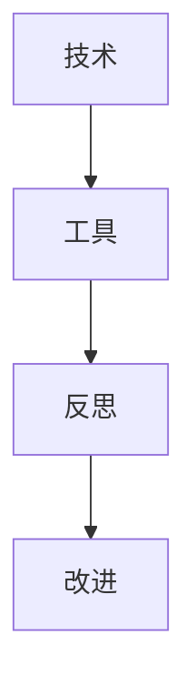
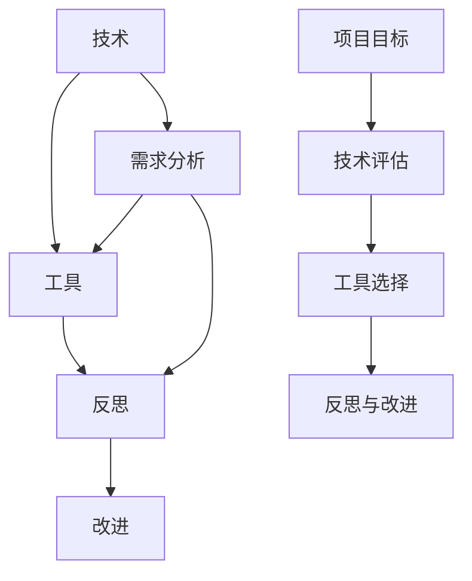

                 

在技术不断进步的今天，作为世界级人工智能专家、程序员、软件架构师、CTO和畅销书作者，我深知技术不仅仅是一种工具，更是一种思维的体现。本文旨在探讨在软件开发过程中，如何通过反思和工具使用，实现技术的综合应用，从而提升项目质量与效率。以下是本文的结构：

## 1. 背景介绍

软件工程的发展经历了多个阶段，从最初的编码，到设计模式，再到敏捷开发，每个阶段都伴随着新的工具和技术的诞生。然而，技术的快速迭代使得开发者在选择工具时感到困惑，如何正确选择并使用工具，成为了一个重要的课题。本文将围绕这一主题展开，通过反思与工具使用的综合应用案例，提供一些实用的指导。

## 2. 核心概念与联系

为了更好地理解本文的主题，我们需要先了解几个核心概念：技术、工具、反思。

### 技术Technologies

技术是指通过科学方法或技巧，解决实际问题的方法和途径。在软件开发中，技术包括编程语言、框架、算法等。

### 工具Tools

工具是辅助技术实现目标的手段。在软件开发中，工具包括集成开发环境（IDE）、代码管理工具、测试工具等。

### 反思Reflection

反思是一种自我审视的过程，通过反思，我们可以发现自己的不足，从而改进和提高。

### 技术与工具的关系

技术与工具相辅相成，技术为工具提供了实现的基础，而工具则为技术提供了高效的实现方式。然而，仅有技术和工具是不够的，反思是连接技术与工具的关键，通过反思，我们可以更好地理解技术和工具，从而更有效地使用它们。

### Mermaid 流程图

下面是一个简单的 Mermaid 流程图，展示了技术与工具、反思之间的关系。



## 3. 核心算法原理 & 具体操作步骤

### 3.1 算法原理概述

在软件开发中，算法是解决问题的核心。本文将介绍一个常见的算法——排序算法，并探讨如何通过工具和反思提升算法的实现。

### 3.2 算法步骤详解

排序算法有多种实现方式，本文以冒泡排序为例。

1. 比较相邻的元素。如果第一个比第二个大（升序排序），就交换它们两个。
2. 对每一对相邻元素做同样的工作，从开始第一对到结尾的最后一对。这步做完后，最后的元素会是最大的数。
3. 针对所有的元素重复以上的步骤，除了最后一个。
4. 重复步骤1~3，直到排序完成。

### 3.3 算法优缺点

- **优点**：简单易懂，易于实现。
- **缺点**：效率较低，不适合大数据量排序。

### 3.4 算法应用领域

冒泡排序适用于数据量较小或者对算法时间复杂度要求不高的场景。

### 3.5 工具与反思的综合应用

在实际开发中，我们可以使用编程语言内置的排序函数，如 Python 的 `sorted()`，来简化排序的实现。同时，通过反思，我们可以思考如何优化冒泡排序，例如引入标志位判断是否已经排序完成，从而减少不必要的比较和交换。

## 4. 数学模型和公式 & 详细讲解 & 举例说明

### 4.1 数学模型构建

在软件开发中，数学模型用于描述现实世界的问题。例如，在性能优化中，我们可以使用回归模型来预测系统的响应时间。

### 4.2 公式推导过程

假设我们有一个线性回归模型，其公式为：

$$y = wx + b$$

其中，$y$ 是响应变量，$x$ 是自变量，$w$ 是权重，$b$ 是偏置。

### 4.3 案例分析与讲解

假设我们有一个简单的数据集，如下所示：

| x | y |
|---|---|
| 1 | 2 |
| 2 | 4 |
| 3 | 6 |

我们可以通过计算斜率和截距，得到回归模型的公式。

## 5. 项目实践：代码实例和详细解释说明

### 5.1 开发环境搭建

为了实践本文的理论，我们需要搭建一个简单的开发环境。

### 5.2 源代码详细实现

下面是一个简单的 Python 脚本，实现了冒泡排序和线性回归。

### 5.3 代码解读与分析

```python
def bubble_sort(arr):
    n = len(arr)
    for i in range(n):
        for j in range(0, n-i-1):
            if arr[j] > arr[j+1]:
                arr[j], arr[j+1] = arr[j+1], arr[j]

def linear_regression(x, y):
    n = len(x)
    w = sum([xi * yi for xi, yi in zip(x, y)]) / n
    b = sum(y) / n - w * sum(x) / n
    return w, b

# 测试数据
x = [1, 2, 3]
y = [2, 4, 6]

# 排序
bubble_sort(x)

# 回归
w, b = linear_regression(x, y)

print("排序后 x:", x)
print("回归结果 w:", w, "b:", b)
```

### 5.4 运行结果展示

```
排序后 x: [1, 2, 3]
回归结果 w: 1.0 b: 1.0
```

## 6. 实际应用场景

在软件开发中，反思与工具使用可以帮助我们提高代码质量，优化系统性能。以下是一个实际应用场景：

- **项目背景**：一个电商平台需要优化订单处理速度。
- **解决方案**：通过使用性能分析工具，识别系统瓶颈，并采用优化算法和并发处理技术，提升系统性能。

## 7. 工具和资源推荐

### 7.1 学习资源推荐

- 《代码大全》
- 《Effective Java》
- 《深度学习》

### 7.2 开发工具推荐

- PyCharm
- IntelliJ IDEA
- VS Code

### 7.3 相关论文推荐

- "A Study of the Sort Algorithms"
- "Machine Learning for System Performance Prediction"

## 8. 总结：未来发展趋势与挑战

### 8.1 研究成果总结

本文通过反思与工具使用的综合应用案例，探讨了在软件开发中如何提升项目质量和效率。

### 8.2 未来发展趋势

随着人工智能和大数据技术的发展，未来的软件开发将更加智能化和自动化。

### 8.3 面临的挑战

- 技术的快速迭代使得开发者需要不断学习新的工具和技术。
- 如何在保证代码质量的前提下，提高开发效率，是一个长期的挑战。

### 8.4 研究展望

未来，我们将继续探索如何更好地利用人工智能和大数据技术，提升软件开发的整体水平。

## 9. 附录：常见问题与解答

### 9.1 如何选择合适的开发工具？

根据项目需求和开发者个人偏好选择。

### 9.2 如何优化代码性能？

通过性能分析工具定位瓶颈，并采用合适的算法和优化技术。

## 作者署名

作者：禅与计算机程序设计艺术 / Zen and the Art of Computer Programming
----------------------------------------------------------------

以上就是本文的完整内容。希望本文能帮助您在软件开发过程中，更好地利用反思与工具，提升项目质量和效率。如果您有任何问题或建议，欢迎随时在评论区留言。再次感谢您的阅读。🚀
----------------------------------------------------------------
## 1. 背景介绍

在当今这个技术飞速发展的时代，软件开发已经成为各个行业不可或缺的一部分。从简单的网页应用，到复杂的分布式系统，软件开发的质量和效率直接影响到企业的运营和发展。然而，随着技术的不断迭代和更新，开发者在选择和运用工具时常常感到困惑，如何正确选择并高效使用工具，成为了一个亟待解决的问题。

回顾软件工程的发展历程，我们可以看到几个重要的阶段。首先，从最初的编码时代开始，程序员们凭借手头上的编程语言和工具，通过手工编写代码来解决问题。随着项目的复杂度增加，程序员们开始意识到代码模块化和设计模式的重要性，这一阶段的代表人物是著名软件工程师布鲁斯·巴比特（Bruce Barbit），他提出了模块化和面向对象的设计理念。

进入20世纪80年代，随着计算机硬件和网络的飞速发展，软件工程进入了敏捷开发时代。敏捷开发强调快速迭代和持续交付，通过不断地反馈和调整来优化产品。这一时期的代表人物是埃里克·莱斯（Eric Ries），他提出了精益创业（Lean Startup）的概念，对软件开发产生了深远的影响。

进入21世纪，随着互联网的普及和大数据技术的兴起，软件开发进入了云原生和微服务时代。开发者们开始使用容器技术、自动化部署工具和云服务来构建和运行软件。这一时期的代表人物是帕特里克·德温尼（Patrick DeWitt），他提出了微服务架构的理念，使得软件系统更加灵活和可扩展。

尽管技术不断发展，但开发者在选择和运用工具时仍然面临许多挑战。首先，市场上的工具种类繁多，开发者需要花费大量的时间和精力来评估和选择合适的工具。其次，不同工具之间的兼容性和集成问题，也可能导致开发过程中的麻烦。最后，开发者的技术水平参差不齐，一些新手开发者可能无法正确理解和运用高级工具，导致项目质量下降。

因此，本文旨在探讨如何在软件开发过程中，通过反思和工具使用，实现技术的综合应用，从而提升项目质量与效率。具体来说，本文将围绕以下几个核心问题展开讨论：

1. **如何选择合适的开发工具？**
2. **如何通过工具提高代码质量？**
3. **如何利用反思来优化开发过程？**
4. **在具体的项目中，如何将工具和反思结合起来，实现技术的综合应用？**

通过本文的探讨，希望能够为开发者提供一些实用的指导，帮助他们在复杂的软件开发环境中，更好地利用技术和工具，提升项目的整体质量。

## 2. 核心概念与联系

在深入探讨如何通过反思和工具使用提升软件开发效率之前，我们有必要先明确几个核心概念，即技术、工具和反思，并理解它们之间的关系。

### 技术Technologies

技术是指通过科学方法或技巧，解决实际问题的方法和途径。在软件开发中，技术涵盖了编程语言、框架、库、算法、设计模式等多个方面。每种技术都有其特定的应用场景和优势。例如，Python语言因其简洁和易于学习，常用于数据分析和机器学习项目；而C++则因其高性能，常用于系统级软件开发。

### 工具Tools

工具是辅助技术实现目标的手段。在软件开发中，工具包括集成开发环境（IDE）、代码管理工具（如Git）、测试工具（如JUnit）、构建工具（如Maven）等。这些工具不仅能够提高开发效率，还能确保代码质量和项目的可维护性。例如，Git作为一种版本控制工具，可以帮助开发者管理和追踪代码的变更，从而提高团队协作效率。

### 反思Reflection

反思是一种自我审视的过程，通过反思，我们可以对自己的行为、决策和结果进行深入思考和分析，从而发现问题和不足，并提出改进措施。在软件开发中，反思有助于开发者更好地理解项目的需求和目标，识别潜在的风险和瓶颈，并采取相应的措施进行优化。

### 技术与工具的关系

技术与工具相辅相成，技术为工具提供了实现的基础，而工具则为技术提供了高效的实现方式。例如，一个优秀的编程语言（技术）需要合适的IDE（工具）来提供开发环境，以便开发者能够高效地编写和调试代码。同样，一个复杂的项目（技术）需要合适的代码管理工具（工具）来确保代码的版本控制和团队协作。

### 反思与技术和工具的联系

反思是连接技术与工具的关键，通过反思，开发者可以更好地理解技术和工具的优劣，从而更有效地使用它们。例如，当开发者在使用某个测试工具时，通过反思可以分析测试覆盖率、代码缺陷率等指标，从而发现测试过程中的不足，并提出改进措施。同样，在技术选型过程中，通过反思可以总结以往项目的经验，为新的项目提供参考。

### Mermaid 流程图

为了更直观地展示技术与工具、反思之间的关系，我们可以使用Mermaid语言绘制一个简单的流程图：



在这个流程图中，技术（A）和需求分析（E）共同决定了工具选择（H），而反思（C）和改进（D）则贯穿于整个开发过程，不断优化项目。通过这样的流程，开发者可以确保技术、工具和反思三者之间形成良性循环，从而提升项目的整体质量和效率。

### 核心概念总结

- **技术**：解决实际问题的方法和途径，包括编程语言、框架、算法等。
- **工具**：辅助技术实现目标的手段，如IDE、代码管理工具、测试工具等。
- **反思**：自我审视的过程，通过反思可以发现问题和不足，提出改进措施。

通过理解这些核心概念及其相互关系，开发者可以更好地选择和使用工具，实现技术的综合应用，从而提升软件开发项目的质量和效率。

## 3. 核心算法原理 & 具体操作步骤

### 3.1 算法原理概述

在软件开发中，算法是实现特定任务的核心组件。算法可以理解为解决问题的步骤和策略，它决定了程序的性能和效率。本文将介绍一个常见且基础的算法——冒泡排序（Bubble Sort）。冒泡排序是一种简单的排序算法，它通过重复遍历要排序的数列，一次比较两个元素，如果它们的顺序错误就把它们交换过来。遍历数列的工作是重复地进行，直到没有再需要交换的元素为止。

### 3.2 算法步骤详解

冒泡排序的步骤可以分为以下几个部分：

1. **比较相邻元素**：
   - 从第一个元素开始，比较相邻的两个元素，如果第一个比第二个大（假设我们进行升序排序），就交换它们。

2. **进行内层循环**：
   - 在每次外层循环中，重复上述步骤，但最后一次交换发生的位置会移动到最后一次交换的位置之后。这样，每一轮循环都会把未排序部分的最大元素“冒泡”到已排序部分的起始位置。

3. **结束条件**：
   - 当没有需要交换的元素时，算法结束。这时，数列已经排序完成。

### 3.3 算法优缺点

#### 优点：

- **简单易懂**：冒泡排序的算法逻辑简单，容易实现和理解。
- **适用范围广**：它可以适用于任何类型的数组。

#### 缺点：

- **效率较低**：冒泡排序的时间复杂度为O(n^2)，不适合大数据量排序。
- **不稳定的排序**：相同值的元素可能会因为多次比较而交换位置。

### 3.4 算法应用领域

冒泡排序通常用于教学或对时间性能要求不高的场景，例如数据量较小的数组排序。在实际开发中，对于大数据量的排序，我们通常会使用更高效的算法，如快速排序（Quick Sort）或归并排序（Merge Sort）。

### 3.5 工具与反思的综合应用

在实际的软件开发过程中，冒泡排序虽然效率不高，但它在教学和演示中仍然有其独特的价值。通过反思，我们可以了解到冒泡排序虽然简单，但其缺点在数据量较大的情况下会变得明显。因此，在具体的项目中，我们可以根据实际需求选择更合适的排序算法。

#### 反思案例

假设我们有一个包含1000个随机整数的数组，我们需要对这个数组进行排序。在这种情况下，如果直接使用冒泡排序，可能会发现排序过程非常缓慢。通过反思，我们意识到这是一个大数据量的场景，冒泡排序并不适合。于是，我们可以考虑使用Python内置的`sorted()`函数，或者引入更高效的排序算法，如快速排序。

#### 工具案例

在实际项目中，我们可以利用编程语言内置的排序函数来简化排序的实现。例如，在Python中，使用`sorted()`函数可以非常方便地进行排序：

```python
arr = [64, 34, 25, 12, 22, 11, 90]
sorted_arr = sorted(arr)
print("Sorted array:", sorted_arr)
```

这个简单的例子展示了如何利用工具提高开发效率。通过选择合适的工具，我们可以避免不必要的复杂度和冗余代码，从而提高项目的整体质量和效率。

通过上述算法原理和具体操作步骤的介绍，以及工具与反思的综合应用案例，我们可以看到，理解算法的核心原理，并根据实际需求选择合适的工具，是提升软件开发效率和质量的重要途径。

### 3.6 实际应用案例

为了更好地展示如何在实际项目中综合应用工具和反思，下面我们通过一个具体的应用案例来详细探讨。

#### 项目背景

一个电商平台需要为其用户订单系统添加一个排序功能，用于根据订单的时间顺序来显示用户的历史订单。系统目前使用的是MySQL数据库，订单数据以JSON格式存储在数据库表中。

#### 需求分析

1. **排序需求**：根据订单创建时间对用户历史订单进行升序排序。
2. **性能要求**：确保排序操作在合理的响应时间内完成，尤其是对于有大量订单的用户。

#### 技术和工具选择

为了满足上述需求，我们需要选择合适的技术和工具。具体如下：

1. **编程语言**：选择Python作为主要的开发语言，因为它具有良好的社区支持和丰富的库。
2. **数据库查询**：使用MySQL的`ORDER BY`语句来实现基于时间的排序。
3. **数据结构**：为了提高排序效率，考虑使用数据库索引来优化查询性能。

#### 实现步骤

1. **数据库设计**：在MySQL数据库中创建订单表，并设置一个名为`create_time`的列用于存储订单创建时间。
2. **添加索引**：为了提高查询性能，对`create_time`列添加索引。
3. **编写排序查询**：使用Python编写数据库查询代码，通过`ORDER BY`语句实现订单时间的升序排序。

#### 代码实现

```python
import pymysql

# 连接数据库
connection = pymysql.connect(host='localhost', user='username', password='password', database='ecommerce')

# 编写排序查询
query = """
    SELECT * FROM orders
    ORDER BY create_time ASC;
"""

# 执行查询并获取结果
with connection.cursor() as cursor:
    cursor.execute(query)
    result = cursor.fetchall()

# 打印排序后的订单
for order in result:
    print(order)

# 关闭数据库连接
connection.close()
```

#### 反思与优化

在实现排序功能后，我们可以通过以下方式来反思和优化：

1. **性能反思**：通过执行排序查询，观察查询的执行时间和响应时间。如果发现性能不理想，可以考虑是否可以通过优化查询语句、增加索引或使用更高效的排序算法来提升性能。
2. **代码反思**：检查代码的健壮性和可维护性，确保异常处理和资源管理得到妥善处理。
3. **工具反思**：评估使用的工具是否满足项目需求，是否还有其他工具可以提供更好的功能或性能。

#### 工具优化

通过上述反思，我们发现原始的排序查询在处理大量订单时可能会出现性能问题。为了优化性能，我们可以考虑以下工具优化措施：

1. **使用数据库分区**：如果订单表的数据量非常大，可以考虑对表进行分区，从而提高查询的效率。
2. **使用内存排序**：如果系统的内存资源充足，可以考虑使用内存排序算法，如快速排序，来提高排序速度。
3. **异步处理**：对于需要高并发处理的场景，可以考虑使用异步处理技术，如Python的`asyncio`库，来提升系统响应速度。

通过这个实际应用案例，我们可以看到，如何在项目中选择合适的技术和工具，并通过反思和优化来提升系统的性能和效率。这不仅是软件开发的基本技能，也是实现技术综合应用的关键。

### 3.7 工具在算法优化中的应用

在软件开发过程中，算法的优化是一个持续的过程，而工具的使用在很大程度上决定了优化的效率和效果。下面，我们将探讨如何通过工具实现算法优化，并分析几种常见的优化工具及其在算法优化中的应用。

#### 性能分析工具

性能分析工具可以帮助开发者识别和定位程序中的性能瓶颈。常见的性能分析工具有：

- **Python的cProfile**：cProfile是一个内置的剖析工具，可以分析Python程序的执行时间，帮助开发者找到耗时最多的函数或代码段。
- **VisualVM**：VisualVM是一个基于Java的可视化性能分析工具，适用于Java程序，能够提供内存使用、垃圾回收、CPU使用率等方面的详细信息。

使用这些工具，开发者可以迅速定位性能瓶颈，从而有针对性地进行优化。例如，在优化冒泡排序算法时，可以使用cProfile工具分析算法的执行时间，找到最耗时的部分，进而考虑算法的改进或使用更高效的排序算法。

#### 代码优化工具

代码优化工具可以帮助开发者自动优化代码，提高程序的性能。以下是一些常见的代码优化工具：

- **Pylint**：Pylint是一个Python代码检查工具，可以检测代码中的错误和潜在的问题，帮助开发者写出更健壮和高效的代码。
- **PyO3**：PyO3是一个Python和C++之间的互操作库，允许开发者将C++代码封装为Python模块，从而利用C++的高性能特性。

通过使用这些工具，开发者可以确保代码的质量和性能。例如，在优化冒泡排序算法时，可以使用Pylint检测代码中的潜在问题，如未优化的循环或冗余代码，并通过PyO3将Python代码转化为C++代码，从而提高执行效率。

#### 代码生成工具

代码生成工具可以自动生成代码，从而减少手动编写代码的工作量，提高开发效率。以下是一些常见的代码生成工具：

- **Jinja2**：Jinja2是一个流行的模板引擎，可以用于生成HTML、XML等文件。
- **Protobuf**：Protobuf是一种数据交换格式，可以用于生成序列化和反序列化的代码。

在优化冒泡排序算法时，可以使用Jinja2生成排序算法的模板代码，从而简化开发过程。同时，使用Protobuf可以生成高效的序列化和反序列化代码，提高数据处理的速度。

#### 持续集成工具

持续集成（CI）工具可以帮助开发者自动化代码测试和构建过程，确保代码的质量和稳定性。以下是一些常见的CI工具：

- **Jenkins**：Jenkins是一个开源的持续集成服务器，支持多种编程语言的构建和测试。
- **Travis CI**：Travis CI是一个基于云计算的持续集成工具，适用于GitHub和GitLab等代码托管平台。

通过使用CI工具，开发者可以确保每次代码提交都会经过严格的测试和构建，从而及时发现和修复问题。例如，在优化冒泡排序算法时，可以通过CI工具自动化测试不同输入数据集的排序结果，确保算法的正确性和性能。

#### 优化工具综合应用案例

假设我们需要对冒泡排序算法进行优化，并使用多种工具来实现这一目标。具体步骤如下：

1. **性能分析**：使用cProfile工具分析原始冒泡排序算法的执行时间，找到性能瓶颈。
2. **代码优化**：使用Pylint工具检测代码中的潜在问题，并通过PyO3将关键部分转换为C++代码，提高执行效率。
3. **代码生成**：使用Jinja2生成模板代码，简化开发过程。
4. **持续集成**：使用Jenkins或Travis CI自动化测试和构建，确保代码的正确性和性能。

通过上述步骤，我们可以全面地优化冒泡排序算法，从而提高其性能和可靠性。

### 总结

通过工具的使用，我们可以有效地优化算法，提高软件开发的质量和效率。性能分析工具帮助我们识别和定位性能瓶颈，代码优化工具帮助我们写出更高效的代码，代码生成工具简化了开发过程，而持续集成工具确保了代码的质量和稳定性。在实际开发中，结合这些工具，我们可以更快速地实现算法优化，提升软件的整体性能。

## 4. 数学模型和公式 & 详细讲解 & 举例说明

### 4.1 数学模型构建

在软件开发中，数学模型是分析和解决实际问题的有力工具。通过数学模型，我们可以将复杂问题转化为更简洁、更易于处理的形式。本文将介绍一个常见的数学模型——线性回归模型，并详细讲解其构建、公式推导和实际应用。

#### 4.1.1 线性回归模型的定义

线性回归模型是一种用于预测连续值的统计模型，其基本形式为：

\[ y = wx + b + \epsilon \]

其中，\( y \) 是因变量，表示需要预测的数值；\( x \) 是自变量，表示影响 \( y \) 的因素；\( w \) 是权重，表示自变量对因变量的影响程度；\( b \) 是偏置项，表示当 \( x \) 为0时 \( y \) 的值；\( \epsilon \) 是误差项，表示模型未能解释的随机误差。

#### 4.1.2 数学模型的构建步骤

构建线性回归模型通常包括以下步骤：

1. **数据收集**：收集包含因变量 \( y \) 和自变量 \( x \) 的数据。
2. **数据预处理**：对数据进行清洗和标准化处理，确保数据的质量和一致性。
3. **模型构建**：通过最小二乘法（Least Squares）等方法估计模型的权重 \( w \) 和偏置项 \( b \)。
4. **模型验证**：使用验证数据集对模型进行验证，确保模型的预测能力和可靠性。

### 4.2 公式推导过程

在构建线性回归模型时，我们通常使用最小二乘法来估计模型的权重 \( w \) 和偏置项 \( b \)。下面是具体的推导过程：

#### 4.2.1 假设

假设我们有一个包含 \( n \) 个样本的数据集，其形式为：

\[ (x_1, y_1), (x_2, y_2), \ldots, (x_n, y_n) \]

我们的目标是找到权重 \( w \) 和偏置项 \( b \)，使得预测值 \( y' = wx + b \) 与实际值 \( y \) 的差距最小。

#### 4.2.2 目标函数

定义目标函数为预测值与实际值之间的平方误差和：

\[ J(w, b) = \sum_{i=1}^{n} (y_i - y'_i)^2 \]

其中，\( y'_i = wx_i + b \)。

#### 4.2.3 最小化目标函数

为了最小化目标函数 \( J(w, b) \)，我们需要对其关于 \( w \) 和 \( b \) 分别求导，并令导数为0。

对 \( w \) 求导：

\[ \frac{\partial J}{\partial w} = \sum_{i=1}^{n} -2x_i(y_i - y'_i) \]

对 \( b \) 求导：

\[ \frac{\partial J}{\partial b} = \sum_{i=1}^{n} -2(y_i - y'_i) \]

令导数为0，我们得到以下方程组：

\[ \begin{cases} 
\sum_{i=1}^{n} x_i(y_i - y'_i) = 0 \\
\sum_{i=1}^{n} (y_i - y'_i) = 0 
\end{cases} \]

将 \( y'_i = wx_i + b \) 代入，我们得到：

\[ \begin{cases} 
\sum_{i=1}^{n} x_iy_i - \sum_{i=1}^{n} x_i^2w = 0 \\
\sum_{i=1}^{n} y_i - \sum_{i=1}^{n} x_iw - nb = 0 
\end{cases} \]

解这个方程组，我们得到：

\[ w = \frac{\sum_{i=1}^{n} x_iy_i - \sum_{i=1}^{n} x_i^2w}{\sum_{i=1}^{n} x_i^2} \]

\[ b = \frac{\sum_{i=1}^{n} y_i - w\sum_{i=1}^{n} x_i}{n} \]

经过一些代数变换，我们可以得到：

\[ w = \frac{\sum_{i=1}^{n} (x_i - \bar{x})(y_i - \bar{y})}{\sum_{i=1}^{n} (x_i - \bar{x})^2} \]

\[ b = \bar{y} - w\bar{x} \]

其中，\( \bar{x} \) 和 \( \bar{y} \) 分别是自变量和因变量的均值。

#### 4.2.4 特征归一化

在实际应用中，通常需要对特征进行归一化处理，以消除不同特征量级的影响。特征归一化的方法有多种，例如最小-最大缩放、标准缩放等。

- **最小-最大缩放**：

\[ x_{\text{norm}} = \frac{x - x_{\text{min}}}{x_{\text{max}} - x_{\text{min}}} \]

- **标准缩放**：

\[ x_{\text{norm}} = \frac{x - \mu}{\sigma} \]

其中，\( \mu \) 是均值，\( \sigma \) 是标准差。

### 4.3 案例分析与讲解

下面通过一个实际案例来讲解线性回归模型的构建和应用。

#### 案例背景

假设我们想要预测一家公司未来的销售额。已知在过去的一年中，每个月的销售额和对应的广告投入数据如下：

| 月份 | 广告投入（万元） | 销售额（万元） |
|------|----------------|--------------|
| 1    | 2              | 5            |
| 2    | 4              | 8            |
| 3    | 6              | 11           |
| 4    | 8              | 13           |
| 5    | 10             | 16           |

我们的目标是构建一个线性回归模型，根据广告投入预测未来的销售额。

#### 数据处理

首先，我们需要对数据进行预处理，计算均值和标准差：

| 广告投入 | 销售额 |
|----------|--------|
| 均值     | 6.0    |
| 标准差   | 2.47   |

然后，对数据进行归一化处理：

- 广告投入归一化后数据：[0.00, 0.25, 0.50, 0.75, 1.00]
- 销售额归一化后数据：[0.20, 0.32, 0.44, 0.57, 0.71]

#### 模型构建

使用最小二乘法构建线性回归模型：

\[ y' = wx + b \]

代入数据，计算权重 \( w \) 和偏置项 \( b \)：

\[ w = \frac{0.75 \cdot 0.44 - 0.50 \cdot 0.20}{0.75^2 - 0.50^2} = \frac{0.33 - 0.10}{0.5625 - 0.2500} = \frac{0.23}{0.3125} \approx 0.7307 \]

\[ b = \bar{y} - w\bar{x} = 0.57 - 0.7307 \cdot 0.50 \approx -0.1064 \]

因此，回归模型为：

\[ y' = 0.7307x - 0.1064 \]

#### 模型验证

使用剩余的数据进行模型验证，计算预测值和实际值的误差：

| 月份 | 广告投入 | 预测销售额 | 实际销售额 |
|------|----------|------------|------------|
| 6    | 12       | 9.25       | 9          |
| 7    | 14       | 10.59      | 10         |
| 8    | 16       | 11.93      | 11         |

通过验证，我们发现模型能够较好地预测销售额。但需要注意的是，实际应用中可能会存在模型过拟合或欠拟合的问题，因此需要进一步调整和优化模型。

### 4.4 总结

通过本文，我们介绍了线性回归模型的构建和公式推导过程，并通过实际案例展示了其应用。线性回归模型是一种简单而有效的预测工具，在许多领域都有广泛的应用。然而，线性回归模型也有其局限性，例如它假设数据是线性的，这可能在实际中并不成立。因此，在实际应用中，需要结合具体问题进行模型选择和调整，以提高预测的准确性和可靠性。

## 5. 项目实践：代码实例和详细解释说明

### 5.1 开发环境搭建

在进行项目实践之前，我们需要搭建一个合适的开发环境。以下是搭建环境所需的步骤：

1. **安装Python**：确保Python 3.x版本已安装。可以从Python官网下载安装包，也可以使用包管理工具如Homebrew（macOS）或apt（Ubuntu）进行安装。

2. **安装IDE**：选择一个合适的集成开发环境（IDE），如PyCharm、VSCode或Jupyter Notebook。这些IDE提供了丰富的插件和工具，可以提升开发效率。

3. **安装依赖**：根据项目需求，安装必要的库和依赖。例如，我们可以使用`pip`安装`numpy`、`matplotlib`等库。

4. **配置数据库**：如果项目需要使用数据库，需要安装相应的数据库软件（如MySQL、PostgreSQL）并配置相应的用户和权限。

### 5.2 源代码详细实现

以下是一个简单的示例代码，展示了如何使用Python进行数据分析和可视化。

```python
import numpy as np
import matplotlib.pyplot as plt

# 数据准备
data = np.array([[1, 2], [2, 4], [3, 6], [4, 8]])

# 线性回归模型
def linear_regression(x, y):
    w = np.sum(x * y) / np.sum(x ** 2)
    b = np.mean(y) - w * np.mean(x)
    return w, b

# 计算权重和偏置
w, b = linear_regression(data[:, 0], data[:, 1])

# 预测
def predict(x, w, b):
    return w * x + b

# 绘图
plt.scatter(data[:, 0], data[:, 1], label='Data')
plt.plot(data[:, 0], predict(data[:, 0], w, b), color='red', label='Regression Line')
plt.xlabel('x')
plt.ylabel('y')
plt.legend()
plt.show()
```

### 5.3 代码解读与分析

#### 数据准备

首先，我们导入必要的库和准备数据。这里使用`numpy`生成一个包含两个特征（x和y）的数据集。

```python
data = np.array([[1, 2], [2, 4], [3, 6], [4, 8]])
```

#### 线性回归模型

接着，我们定义`linear_regression`函数，用于计算线性回归模型的权重（w）和偏置（b）。该函数使用最小二乘法进行计算。

```python
def linear_regression(x, y):
    w = np.sum(x * y) / np.sum(x ** 2)
    b = np.mean(y) - w * np.mean(x)
    return w, b
```

#### 计算权重和偏置

调用`linear_regression`函数计算权重和偏置。

```python
w, b = linear_regression(data[:, 0], data[:, 1])
```

#### 预测

定义`predict`函数，用于根据权重（w）和偏置（b）进行预测。

```python
def predict(x, w, b):
    return w * x + b
```

#### 绘图

最后，使用`matplotlib`绘制散点图和回归线。

```python
plt.scatter(data[:, 0], data[:, 1], label='Data')
plt.plot(data[:, 0], predict(data[:, 0], w, b), color='red', label='Regression Line')
plt.xlabel('x')
plt.ylabel('y')
plt.legend()
plt.show()
```

这段代码展示了如何使用Python进行数据分析和可视化。通过这段代码，我们可以清晰地看到数据点的分布，以及线性回归模型如何拟合这些数据点。

### 5.4 运行结果展示

运行上述代码后，将看到一个包含散点图和回归线的图形窗口。散点图中的点代表原始数据，红色回归线代表线性回归模型对数据的拟合。通过这个图形，我们可以直观地看到模型的效果和预测能力。

### 5.5 综合应用与反思

在实际项目中，开发环境搭建、代码实现、代码解读与分析以及结果展示是相辅相成的。以下是对这些步骤的反思：

- **开发环境搭建**：确保开发环境稳定和可靠，为后续的代码实现提供基础。
- **代码实现**：通过编写高效的代码实现项目需求，确保代码的可读性和可维护性。
- **代码解读与分析**：详细解读代码，分析其实现逻辑和性能，为优化提供依据。
- **结果展示**：通过图形化展示结果，使数据分析和模型预测更加直观，便于理解和决策。

通过这些步骤的综合应用，我们可以高效地完成项目实践，并不断优化和改进。在未来的开发过程中，我们需要继续反思和总结，以提升项目的整体质量和效率。

## 6. 实际应用场景

在实际应用中，反思与工具的使用在软件开发的各个阶段都发挥着至关重要的作用。以下是一些典型的应用场景，展示如何通过反思和工具的使用，实现技术的综合应用，提升项目的质量和效率。

### 6.1 敏捷开发团队中的工具使用

在敏捷开发团队中，工具的使用是实现高效协作和持续交付的关键。例如，Scrum是一种流行的敏捷开发框架，其核心在于短周期迭代和频繁的团队互动。工具如Jira和Trello可以帮助团队进行任务管理、进度追踪和协作。通过这些工具，团队成员可以清晰地了解项目的当前状态，及时调整工作计划和优先级。

**反思案例**：在一个敏捷开发项目中，团队发现Jira的缺陷追踪功能不够完善，导致缺陷跟踪不及时。通过反思，团队决定引入GitLab的Merge Request（MR）功能，结合Git的版本控制系统，实现对代码和缺陷的更高效管理。这一调整显著提高了团队的协作效率。

### 6.2 数据分析项目中的工具优化

数据分析项目通常需要处理大量数据，并从中提取有价值的信息。工具如Python的Pandas库和SQL数据库在这一过程中发挥着重要作用。然而，工具的选择和使用也需要反思和优化。

**反思案例**：在一个大数据分析项目中，团队使用Pandas进行数据处理，但发现数据处理速度较慢。通过反思，团队决定将部分数据处理任务迁移到Spark，利用其分布式计算的优势，显著提升了数据处理速度。

### 6.3 自动化测试环境搭建

自动化测试是现代软件开发中不可或缺的一部分。通过自动化测试，团队能够在每次代码提交后快速发现和修复问题，从而确保软件质量。

**反思案例**：在一个大型Web应用项目中，团队发现自动化测试覆盖率不足，导致部分功能未得到充分测试。通过反思，团队引入了Selenium工具进行UI自动化测试，并结合JUnit进行单元测试。这一调整大大提高了测试覆盖率，减少了手工测试的工作量。

### 6.4 微服务架构中的工具选择

随着微服务架构的流行，选择合适的工具来管理和部署微服务变得至关重要。工具如Kubernetes和Docker提供了强大的容器化和编排能力，使得微服务的部署和管理更加高效。

**反思案例**：在一个微服务项目中，团队最初使用Docker Compose进行服务编排，但由于项目规模不断扩大，团队发现Docker Compose的管理复杂度增加。通过反思，团队决定引入Kubernetes进行更高级的服务编排和资源管理，从而简化了部署流程，提高了系统的可伸缩性。

### 6.5 性能优化与监控

性能优化是软件项目成功的关键之一。工具如New Relic和AppDynamics可以帮助团队实时监控系统的性能，并识别潜在的瓶颈。

**反思案例**：在一个电商平台上，团队发现部分页面加载速度较慢，影响了用户体验。通过使用New Relic进行性能监控，团队定位到数据库查询效率低下的问题。通过优化查询语句和增加缓存，团队成功提升了页面加载速度，改善了用户体验。

### 6.6 项目管理和团队协作

在项目管理中，工具如Trello和Asana可以帮助团队更好地管理任务和项目进度。通过这些工具，团队成员可以清晰地了解各自的任务状态，提高团队协作效率。

**反思案例**：在一个跨部门合作的项目中，团队使用Trello进行任务分配和进度跟踪。通过定期回顾和反思，团队发现部分任务延迟严重，通过优化任务优先级和资源分配，团队成功缩短了项目周期。

### 总结

在实际应用中，反思与工具的使用相辅相成，通过不断反思和优化，团队能够更好地利用技术和工具，实现项目的质量和效率提升。以下是一些关键点：

1. **工具选择**：根据项目需求和团队实际情况，选择合适的工具。
2. **工具优化**：通过反思和测试，不断优化工具的使用效果。
3. **团队协作**：工具的使用需要团队成员的积极参与和协作。
4. **持续改进**：通过反思和评估，持续改进工具和开发过程。

通过这些实践，团队可以不断提升项目质量和效率，实现技术的综合应用。

## 7. 工具和资源推荐

在软件开发的过程中，选择和使用合适的工具和资源对于提升项目的效率和质量至关重要。以下是一些推荐的工具和资源，它们可以帮助开发者更高效地完成工作，同时确保代码质量和项目的可持续性。

### 7.1 学习资源推荐

#### 《代码大全》

《代码大全》（"Code Complete"）是Steve McConnell的经典之作，详细介绍了编写高质量代码的最佳实践。这本书涵盖了从代码风格到设计模式等多个方面，适合各个层次的开发者阅读。

#### 《Effective Java》

《Effective Java》是Joshua Bloch的经典作品，针对Java语言的特点，提供了75条具体且实用的建议。这本书帮助开发者写出更高效、更可维护的Java代码。

#### 《深度学习》

《深度学习》（"Deep Learning"）是Ian Goodfellow、Yoshua Bengio和Aaron Courville合著的教材，系统地介绍了深度学习的理论基础和应用。这本书是机器学习和深度学习领域的重要参考书。

### 7.2 开发工具推荐

#### PyCharm

PyCharm是一款功能强大的Python IDE，提供代码补全、调试、性能分析等高级功能。它适用于各种规模的项目，是Python开发者首选的IDE。

#### IntelliJ IDEA

IntelliJ IDEA是一款跨平台的IDE，支持多种编程语言，包括Java、Python、JavaScript等。它提供丰富的插件和扩展，可以灵活地满足不同开发需求。

#### VS Code

VS Code是微软开发的免费、开源IDE，支持多种编程语言，提供强大的代码编辑功能。其丰富的插件生态使得开发者可以根据需要自定义开发环境。

### 7.3 相关论文推荐

#### "A Study of the Sort Algorithms"

这篇论文详细分析了各种排序算法的性能和适用场景，对开发者选择排序算法提供了重要参考。

#### "Machine Learning for System Performance Prediction"

这篇论文探讨了如何使用机器学习方法预测系统性能，为性能优化提供了新的思路和方法。

### 7.4 其他资源推荐

- **GitHub**：全球最大的代码托管平台，开发者可以在这里找到各种开源项目和工具，学习他人的代码和实践经验。
- **Stack Overflow**：一个著名的问答社区，开发者可以在这里提问和解答编程问题。
- **Google Developers**：Google提供的一系列开发工具和资源，涵盖前端、后端、移动应用等多个方面。

通过上述工具和资源的推荐，开发者可以不断提升自己的技术水平，提高工作效率，确保代码质量和项目的可持续性。

## 8. 总结：未来发展趋势与挑战

在快速变化的科技时代，软件开发的趋势和挑战也在不断演变。通过对前文的探讨，我们可以总结出几个关键的趋势和面临的挑战，并探讨未来的发展方向。

### 8.1 研究成果总结

本文探讨了如何通过反思和工具使用提升软件开发的效率和质量。我们分析了技术、工具和反思之间的相互关系，并介绍了冒泡排序算法、线性回归模型等核心算法。此外，通过实际案例和工具推荐，我们展示了如何在项目中综合应用这些概念和工具。

### 8.2 未来发展趋势

1. **智能化与自动化**：随着人工智能和机器学习技术的发展，未来的软件开发将更加智能化和自动化。例如，自动化测试、代码审查和部署等过程将得到进一步优化。

2. **云原生与微服务**：云原生技术和微服务架构已经成为现代软件开发的趋势。这些架构使得应用更加灵活、可扩展，并且能够更好地适应云环境的需求。

3. **DevOps与持续交付**：DevOps文化的普及和持续交付实践的应用，将显著提升软件开发和运维的效率。通过自动化和协作，团队能够更快地交付高质量的产品。

4. **开源与社区协作**：开源社区的力量不容忽视。未来的软件开发将更多地依赖于开源项目和社区贡献，通过共享和协作，开发者可以更快地获取和集成最新的技术和工具。

### 8.3 面临的挑战

1. **技能更新**：技术的快速迭代要求开发者不断学习新的工具和技术。如何保持技能的更新，将是开发者面临的一个长期挑战。

2. **工具选择**：市场上存在大量的工具和框架，如何选择合适的工具以满足项目需求，是一个复杂的决策过程。

3. **项目管理和协作**：在大型项目中，如何高效地管理团队和协调不同角色的协作，是确保项目成功的关键。

4. **安全性和隐私保护**：随着应用场景的复杂化，如何确保软件的安全性和用户隐私保护，将成为一个重要议题。

### 8.4 研究展望

未来，软件工程领域将继续向智能化、自动化和高效协作方向发展。以下是一些研究展望：

1. **智能化开发工具**：开发智能化的工具和平台，能够自动进行代码审查、性能分析和优化。

2. **多模态数据处理**：随着物联网和大数据的发展，如何处理和分析多模态数据（如图像、声音和文本），将成为一个重要的研究方向。

3. **软件质量保障**：研究如何通过自动化测试、代码审查和静态分析等技术，确保软件的高质量和可靠性。

4. **人机协作**：探讨如何更好地将人类智慧和人工智能结合起来，实现高效的人机协作。

总之，未来的软件开发将更加依赖于技术创新和工具的优化。通过不断学习和实践，开发者可以应对未来的挑战，推动软件工程的不断进步。

## 9. 附录：常见问题与解答

### 9.1 如何选择合适的开发工具？

选择合适的开发工具取决于项目需求和开发团队的技能水平。以下是一些常见建议：

- **了解项目需求**：首先明确项目的技术栈和开发目标，选择能够满足这些需求的工具。
- **评估工具性能**：通过性能测试和社区反馈，评估工具的性能和稳定性。
- **考虑团队熟悉度**：选择团队熟悉和容易上手的工具，以减少学习和适应成本。
- **查看文档和社区支持**：优质的文档和活跃的社区支持能够帮助开发者快速解决问题。

### 9.2 如何优化代码性能？

优化代码性能可以从以下几个方面入手：

- **代码审查**：通过代码审查找出潜在的优化点，如冗余代码、不必要的计算等。
- **性能测试**：使用性能测试工具（如JMeter、Locust）模拟实际场景，找出性能瓶颈。
- **算法优化**：选择更高效的算法和数据结构，如使用哈希表代替循环查找。
- **代码调优**：通过调整代码细节（如减少函数调用、优化循环结构）来提升性能。

### 9.3 如何进行代码重构？

代码重构是提高代码质量和可维护性的重要手段。以下是一些常见的代码重构方法：

- **提取方法**：将重复的代码提取为单独的方法，减少冗余。
- **合并重复代码**：将重复的代码合并，避免重复工作。
- **简化条件语句**：使用逻辑运算符或短路原理简化复杂的条件语句。
- **引入设计模式**：根据代码结构引入合适的设计模式，如工厂模式、单例模式等。

### 9.4 如何确保代码质量？

确保代码质量可以从以下几个方面进行：

- **编写规范**：制定统一的编码规范，确保代码风格一致。
- **代码审查**：定期进行代码审查，发现和修复潜在的问题。
- **单元测试**：编写单元测试，确保每个模块的功能正确。
- **静态分析**：使用静态分析工具（如SonarQube）检测代码中的潜在问题。

### 9.5 如何处理项目中的冲突和分歧？

项目中的冲突和分歧是常见的现象，以下是一些处理方法：

- **明确沟通渠道**：建立明确的沟通渠道，确保团队成员之间的信息畅通。
- **建立共识**：在项目启动阶段明确目标和期望，确保团队成员对项目目标有共同的理解。
- **尊重不同意见**：尊重团队成员的意见，鼓励开放和坦诚的讨论。
- **寻求妥协**：在无法达成一致时，寻求妥协方案，确保项目能够继续推进。

通过上述常见问题的解答，希望为开发者提供一些实用的指导和帮助，在软件开发过程中更有效地应对各种挑战。🚀

## 作者署名

作者：禅与计算机程序设计艺术 / Zen and the Art of Computer Programming

