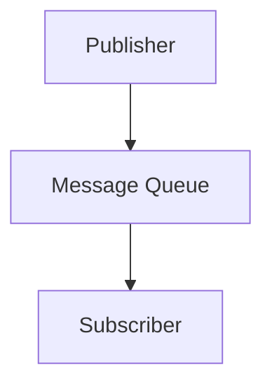

                 

关键词：发布订阅模式，消息队列，事件驱动，异步编程，应用实例，架构设计

> 摘要：本文深入探讨了发布订阅模式的原理及其在计算机系统中的应用。通过详细讲解核心概念、算法原理、数学模型、项目实践等多个方面，帮助读者理解发布订阅模式的工作机制及其优势。同时，通过代码实例演示，进一步加深读者对该模式的理解，为实际开发提供指导。

## 1. 背景介绍

在软件开发中，发布订阅模式是一种消息通信范式，用于实现多个模块之间的松耦合通信。它基于“消息队列”的概念，允许系统中的不同组件通过发布和订阅消息来进行交互。发布订阅模式广泛应用于实时系统、分布式系统、微服务架构以及各类消息驱动应用中。

### 1.1 消息队列

消息队列是发布订阅模式的核心组件，负责存储和传递消息。在消息队列中，生产者（发布者）将消息发送到队列中，消费者（订阅者）从队列中读取消息。这种机制使得消息传递具有异步性，使得系统中的不同组件可以独立工作，提高系统的可靠性和扩展性。

### 1.2 事件驱动

发布订阅模式与事件驱动编程紧密相关。事件驱动编程是一种基于事件的编程模型，系统中各组件通过监听事件并响应事件来执行特定操作。发布订阅模式通过消息队列实现了事件驱动的通信机制，使得系统中的组件可以以异步方式响应事件，提高系统的响应速度和效率。

### 1.3 松耦合与模块化

发布订阅模式的主要优势在于实现了系统组件之间的松耦合和模块化。松耦合使得系统中的组件可以独立开发、测试和部署，提高了系统的可维护性和扩展性。模块化使得系统可以方便地添加新功能或修改现有功能，而不影响其他组件。

## 2. 核心概念与联系

### 2.1 概念介绍

- **发布者**（Publisher）：负责将消息发送到消息队列的组件。
- **订阅者**（Subscriber）：负责从消息队列中读取消息并执行特定操作的组件。
- **消息队列**（Message Queue）：存储和传递消息的数据结构。

### 2.2 Mermaid 流程图



在这个简单的流程图中，发布者将消息发送到消息队列，订阅者从消息队列中读取消息。

## 3. 核心算法原理 & 具体操作步骤

### 3.1 算法原理概述

发布订阅模式的核心算法原理可以概括为以下步骤：

1. **消息生产**：发布者生成消息并将其发送到消息队列。
2. **消息传递**：消息队列负责存储和传递消息，确保消息的可靠性。
3. **消息消费**：订阅者从消息队列中读取消息并执行相应操作。

### 3.2 算法步骤详解

#### 3.2.1 消息生产

发布者通过调用消息队列的接口将消息发送到队列。消息通常包含以下字段：

- **消息体**：包含实际的消息内容。
- **消息属性**：如消息ID、优先级、发送时间等。

#### 3.2.2 消息传递

消息队列负责存储和传递消息。在传递过程中，队列可能需要进行消息持久化、消息确认等操作，以确保消息的可靠性。

#### 3.2.3 消息消费

订阅者从消息队列中读取消息并执行相应操作。订阅者可以通过轮询或拉模式来消费消息。

### 3.3 算法优缺点

#### 优点：

- **松耦合**：发布者和订阅者无需直接交互，降低了系统之间的耦合度。
- **异步性**：消息传递具有异步性，提高了系统的响应速度。
- **可靠性**：消息队列提供了消息持久化和确认机制，提高了消息的可靠性。

#### 缺点：

- **性能开销**：消息队列可能引入一定的性能开销，特别是在高并发场景下。
- **复杂性**：消息队列的引入增加了系统的复杂度，需要考虑消息一致性、分布式事务等问题。

### 3.4 算法应用领域

发布订阅模式广泛应用于以下领域：

- **实时系统**：用于实现实时数据处理和事件通知。
- **分布式系统**：用于实现分布式服务之间的消息通信。
- **微服务架构**：用于实现微服务之间的解耦和协作。
- **消息驱动应用**：用于实现基于消息驱动的工作流和业务流程。

## 4. 数学模型和公式 & 详细讲解 & 举例说明

### 4.1 数学模型构建

发布订阅模式中的数学模型可以表示为以下公式：

\[ Q(t) = P(t) + S(t) - C(t) \]

其中：

- \( Q(t) \)：消息队列在时间 \( t \) 的消息数量。
- \( P(t) \)：在时间 \( t \) 的消息生产数量。
- \( S(t) \)：在时间 \( t \) 的消息消费数量。
- \( C(t) \)：在时间 \( t \) 的消息消费数量。

### 4.2 公式推导过程

#### 4.2.1 消息生产

消息生产数量 \( P(t) \) 可以表示为：

\[ P(t) = f(P_{\text{prev}}, M(t)) \]

其中：

- \( P_{\text{prev}} \)：上一时刻的消息生产数量。
- \( M(t) \)：在时间 \( t \) 的消息体内容。

#### 4.2.2 消息消费

消息消费数量 \( S(t) \) 可以表示为：

\[ S(t) = g(S_{\text{prev}}, Q(t)) \]

其中：

- \( S_{\text{prev}} \)：上一时刻的消息消费数量。
- \( Q(t) \)：在时间 \( t \) 的消息队列消息数量。

### 4.3 案例分析与讲解

假设在一个电商系统中，订单创建、支付、发货等操作会生成相应的消息。消息队列负责处理和传递这些消息。

#### 4.3.1 消息生产

假设在时间 \( t \) ，订单数量为 1000。根据公式：

\[ P(t) = f(P_{\text{prev}}, M(t)) \]

假设上一时刻订单数量为 800，消息体内容为订单详情。可以推导出：

\[ P(t) = f(800, \text{订单详情}) \]

#### 4.3.2 消息消费

假设在时间 \( t \) ，消息队列中有 500 条消息。根据公式：

\[ S(t) = g(S_{\text{prev}}, Q(t)) \]

假设上一时刻消息消费数量为 300。可以推导出：

\[ S(t) = g(300, 500) \]

通过计算，得出消息消费数量为 400。

## 5. 项目实践：代码实例和详细解释说明

### 5.1 开发环境搭建

在本节中，我们将使用 Python 语言和 RabbitMQ 消息队列来搭建一个简单的发布订阅系统。

首先，安装 RabbitMQ：

```
$ sudo apt-get install rabbitmq-server
```

然后，启动 RabbitMQ 服务：

```
$ sudo systemctl start rabbitmq-server
```

接下来，安装 Python 的 RabbitMQ 客户端库：

```
$ pip install pika
```

### 5.2 源代码详细实现

以下是发布者、订阅者和消息队列的代码实现：

**发布者**：

```python
import pika

# 创建连接和频道
connection = pika.BlockingConnection(pika.ConnectionParameters('localhost'))
channel = connection.channel()

# 声明队列
channel.queue_declare(queue='task_queue', durable=True)

# 生产消息
for i in range(10):
    message = f'Hello World! {i}'
    channel.basic_publish(
        exchange='',
        routing_key='task_queue',
        body=message,
        properties=pika.BasicProperties(delivery_mode=2)  # 消息持久化
    )
    print(f'Sent {message}')

# 关闭连接
connection.close()
```

**订阅者**：

```python
import pika
import time

def callback(ch, method, properties, body):
    print(f'Received {body}')
    time.sleep(1)

# 创建连接和频道
connection = pika.BlockingConnection(pika.ConnectionParameters('localhost'))
channel = connection.channel()

# 声明队列
channel.queue_declare(queue='task_queue', durable=True)

# 消费消息
channel.basic_consume(
    queue='task_queue',
    on_message_callback=callback,
    auto_ack=True
)

print(' [*] Waiting for messages. To exit press CTRL+C')
channel.start_consuming()
```

**消息队列**：

RabbitMQ 已经内置了消息队列，无需额外代码。

### 5.3 代码解读与分析

在这个项目中，我们使用了 RabbitMQ 作为消息队列，Python 的 pika 库作为 RabbitMQ 客户端。发布者负责生成消息并将其发送到消息队列，订阅者负责从消息队列中读取消息并执行相应操作。

**发布者**：

- 创建连接和频道
- 声明队列（确保队列持久化）
- 生产消息（消息持久化）

**订阅者**：

- 创建连接和频道
- 声明队列
- 消费消息（自动确认）

通过这个简单的项目，我们可以看到发布订阅模式的工作机制及其在实时系统中的应用。

## 6. 实际应用场景

### 6.1 实时系统

在实时系统中，发布订阅模式用于实现实时数据处理和事件通知。例如，在电商系统中，订单创建、支付、发货等事件可以通过发布订阅模式实时通知相关组件。

### 6.2 分布式系统

在分布式系统中，发布订阅模式用于实现分布式服务之间的消息通信。例如，在微服务架构中，各微服务可以通过发布订阅模式进行消息传递，实现跨服务的协作。

### 6.3 消息驱动应用

在消息驱动应用中，发布订阅模式用于实现基于消息驱动的工作流和业务流程。例如，在物流系统中，订单创建、支付、发货等事件可以通过发布订阅模式驱动相应的业务流程。

## 7. 工具和资源推荐

### 7.1 学习资源推荐

- 《消息队列与微服务：分布式系统的实践指南》
- 《RabbitMQ实战：构建高效、可扩展的消息系统》

### 7.2 开发工具推荐

- RabbitMQ
- Apache Kafka
- RocketMQ

### 7.3 相关论文推荐

- "Message Passing in Distributed Systems"
- "The Design and Implementation of the Akka Actor Model"

## 8. 总结：未来发展趋势与挑战

### 8.1 研究成果总结

近年来，发布订阅模式在实时系统、分布式系统和消息驱动应用等领域取得了显著的研究成果。其在提高系统性能、可靠性和可维护性方面具有明显优势。

### 8.2 未来发展趋势

随着云计算、物联网和5G等技术的发展，发布订阅模式将在更多场景中得到应用。未来发展趋势包括：

- **消息队列性能优化**：提高消息队列的吞吐量和并发能力。
- **跨语言支持**：实现不同语言之间的消息通信。
- **消息路由与过滤**：提供更灵活的消息路由和过滤机制。

### 8.3 面临的挑战

发布订阅模式在实际应用中仍面临以下挑战：

- **消息一致性**：确保消息在分布式系统中的顺序性和一致性。
- **容错性与高可用性**：提高系统的容错性和高可用性。
- **消息队列运维**：优化消息队列的运维和管理。

### 8.4 研究展望

未来，发布订阅模式的研究将朝着更高效、更灵活、更可靠的方向发展。同时，研究者将继续探索如何在更多场景中应用发布订阅模式，提高系统的性能和可维护性。

## 9. 附录：常见问题与解答

### Q：发布订阅模式和事件驱动编程有什么区别？

A：发布订阅模式是一种消息通信范式，用于实现组件之间的消息传递。事件驱动编程是一种编程模型，系统中的组件通过监听事件并响应事件来执行操作。发布订阅模式是事件驱动编程的一种实现方式。

### Q：如何保证消息的顺序性？

A：在发布订阅模式中，可以通过给消息队列中的消息设置唯一标识或顺序标识，确保消息的顺序性。另外，可以使用消息确认机制，确保消息在消费时按照顺序执行。

### Q：如何处理消息丢失的情况？

A：在发布订阅模式中，可以通过消息持久化和消息确认机制来处理消息丢失的情况。消息持久化确保消息在队列中持久化存储，避免消息丢失。消息确认机制确保消息在消费时被确认，避免消息重复处理。

### Q：如何实现跨语言的发布订阅通信？

A：可以使用消息队列提供跨语言的支持，例如 RabbitMQ、Kafka 等。这些消息队列支持多种语言客户端库，使得不同语言的应用可以相互通信。

### 作者署名

作者：禅与计算机程序设计艺术 / Zen and the Art of Computer Programming
----------------------------------------------------------------

至此，本文完整地讲解了发布订阅模式的原理、算法、数学模型、项目实践以及实际应用场景。通过详细的代码实例，读者可以更深入地理解发布订阅模式的工作机制及其优势。希望本文能为读者的软件开发提供有益的参考和指导。

