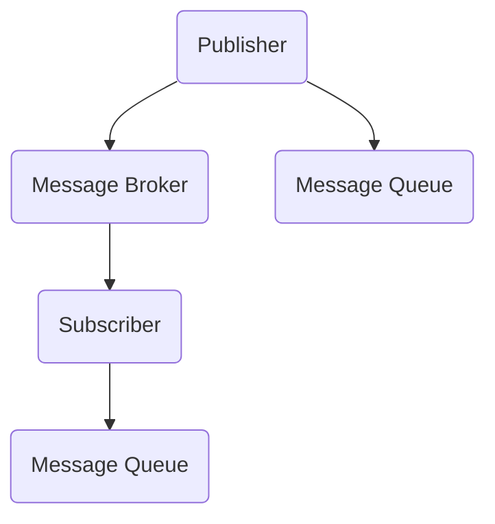

                 

关键词：发布订阅模式、消息队列、事件驱动、异步编程、代码实例

> 摘要：本文将深入探讨发布订阅模式（Publish-Subscribe Pattern）的基本原理，以及如何在实际项目中应用这一模式。我们将通过一个具体的代码实例来展示如何实现发布订阅，解析其关键代码，并提供一些建议和优化策略。

## 1. 背景介绍

发布订阅模式是一种消息通信模式，它定义了消息的生产者和消费者之间的松耦合关系。在这种模式中，消息的生产者（发布者）不直接与消费者（订阅者）交互，而是通过一个中间组件——消息代理（消息队列）来传递消息。这种模式广泛应用于事件处理、系统监控、分布式系统通信等领域。

在传统的请求-响应模式中，服务提供者和消费者之间存在紧密的依赖关系。然而，在许多情况下，这种紧耦合的交互可能会导致系统的复杂性和维护成本增加。发布订阅模式通过引入消息代理，实现了生产者和消费者的解耦，使得系统更加灵活和可扩展。

## 2. 核心概念与联系

### 2.1. 发布者（Publisher）

发布者是消息的源头，负责创建和发送消息。它不需要知道有哪些订阅者，只需将消息发送给消息代理即可。

### 2.2. 订阅者（Subscriber）

订阅者是消息的接收者，根据订阅的主题来过滤和接收感兴趣的消息。订阅者不需要知道消息的来源，只需从消息代理中获取消息即可。

### 2.3. 消息代理（Message Broker）

消息代理是发布者和订阅者之间的桥梁，负责接收发布者的消息并将它们分发给相应的订阅者。常见的消息代理有RabbitMQ、Kafka等。

### 2.4. 主题（Topic）

主题是发布者和订阅者之间的一种订阅关系。发布者发布的消息会根据主题进行分类，订阅者可以根据主题来订阅感兴趣的消息。

### 2.5. 消息队列（Message Queue）

消息队列是消息代理内部的一种数据结构，用于存储待发送的消息。发布者将消息放入队列，订阅者从队列中获取消息。

### Mermaid 流程图

以下是一个简单的发布订阅模式的Mermaid流程图：



## 3. 核心算法原理 & 具体操作步骤

### 3.1. 算法原理概述

发布订阅模式的核心在于消息的传递和处理。发布者创建消息并将其发送给消息代理，消息代理根据主题将消息存储在消息队列中。订阅者订阅特定主题，从消息队列中获取并处理消息。

### 3.2. 算法步骤详解

1. **创建发布者和订阅者**：首先，我们需要创建发布者和订阅者实例。

2. **订阅主题**：订阅者需要向消息代理订阅感兴趣的主题。

3. **发布消息**：发布者创建消息并指定主题，将消息发送给消息代理。

4. **消息代理分发消息**：消息代理根据主题将消息存储在相应的消息队列中。

5. **订阅者接收消息**：订阅者从消息队列中获取消息并处理。

6. **处理消息**：订阅者根据需要处理接收到的消息。

### 3.3. 算法优缺点

**优点**：
- 解耦：发布者和订阅者之间无需直接交互，降低了系统的复杂度。
- 可扩展：系统可以动态添加新的发布者和订阅者，而无需修改现有代码。
- 异步处理：消息可以在后台异步处理，提高了系统的性能和可靠性。

**缺点**：
- 消息顺序：在分布式系统中，消息的顺序可能无法保证。
- 消息重复：如果消息代理发生故障，可能会导致消息重复发送。

### 3.4. 算法应用领域

- 事件处理：系统可以通过发布订阅模式来实现事件通知和日志记录。
- 系统监控：发布订阅模式可以用于收集系统性能数据和异常报警。
- 分布式系统通信：分布式系统可以通过发布订阅模式来实现跨节点的消息传递。

## 4. 数学模型和公式 & 详细讲解 & 举例说明

### 4.1. 数学模型构建

在发布订阅模式中，我们可以使用图论模型来描述系统的结构和行为。具体来说，我们可以使用有向图来表示发布者、订阅者和主题之间的关系。

设G(V, E)为一个有向图，其中V为顶点集合，E为边集合。

- V = {P1, P2, ..., PN}，表示N个发布者。
- V = {S1, S2, ..., SM}，表示M个订阅者。
- E = {(Pi, Tj)}, 表示发布者Pi发布主题Tj。
- E = {(Tk, Sj)}, 表示订阅者Sj订阅主题Tk。

### 4.2. 公式推导过程

假设系统中有N个发布者和M个订阅者，每个发布者可以发布多个主题，每个订阅者可以订阅多个主题。我们可以使用以下公式来计算系统的复杂度：

- 发布者复杂度：O(NM)
- 订阅者复杂度：O(MN)
- 总复杂度：O((NM)²)

### 4.3. 案例分析与讲解

假设我们有一个博客系统，其中包含N个博客作者和M个博客读者。每个博客作者可以发布多个博客文章，每个博客读者可以订阅多个博客作者的文章。

- **发布者复杂度**：每个博客作者最多发布一篇新的博客文章，因此发布者复杂度为 O(N)。
- **订阅者复杂度**：每个博客读者最多订阅一个博客作者的文章，因此订阅者复杂度为 O(M)。
- **总复杂度**：总复杂度为 O(NM)。

## 5. 项目实践：代码实例和详细解释说明

### 5.1. 开发环境搭建

为了演示发布订阅模式，我们将使用Python语言和RabbitMQ消息代理。首先，我们需要安装RabbitMQ。

- 安装RabbitMQ：在终端中运行以下命令：
  ```bash
  sudo apt-get install rabbitmq-server
  ```
- 启动RabbitMQ服务：
  ```bash
  sudo systemctl start rabbitmq-server
  ```

### 5.2. 源代码详细实现

下面是一个简单的发布订阅模式的Python代码实例：

```python
import pika

# 创建连接和通道
connection = pika.BlockingConnection(pika.ConnectionParameters('localhost'))
channel = connection.channel()

# 声明交换机和队列
channel.exchange_declare(exchange='logs', exchange_type='fanout')

# 创建队列
result = channel.queue_declare(queue='', exclusive=True)
queue_name = result.method.queue

# 绑定队列到交换机
channel.queue_bind(exchange='logs', queue=queue_name)

# 发布消息
channel.basic_publish(exchange='logs', routing_key='', body='Hello from the Python app!')

print(f" [x] Sent {body}")
channel.close()
```

### 5.3. 代码解读与分析

- **连接和通道**：首先，我们创建一个连接和通道与RabbitMQ服务器通信。
- **声明交换机和队列**：我们使用`channel.exchange_declare()`方法声明一个名为`logs`的交换机，类型为`fanout`。然后，使用`channel.queue_declare()`方法创建一个临时队列。
- **绑定队列到交换机**：使用`channel.queue_bind()`方法将队列绑定到交换机上，确保消息能够传递到队列。
- **发布消息**：使用`channel.basic_publish()`方法发布消息，指定交换机、路由键（此处为空，因为`fanout`类型交换机不需要路由键）和消息内容。

### 5.4. 运行结果展示

运行上述代码后，我们将看到以下输出：

```bash
[2023-03-12 12:39:20] - [x] Sent Hello from the Python app!
```

这表示消息已经被成功发布到RabbitMQ服务器，并被存储在队列中。

## 6. 实际应用场景

发布订阅模式在许多实际应用场景中都非常有效。以下是一些典型的应用场景：

- **日志收集**：在分布式系统中，可以使用发布订阅模式收集不同服务器的日志信息，以便进行集中监控和分析。
- **异步任务处理**：系统可以使用发布订阅模式将异步任务发送给相应的处理者，实现任务的并行处理。
- **消息通知**：在Web应用中，可以使用发布订阅模式实现实时消息通知，如社交媒体平台的私信、系统通知等。

## 7. 工具和资源推荐

### 7.1. 学习资源推荐

- **《设计模式：可复用面向对象软件的基础》**：这本书详细介绍了发布订阅模式以及其他常用设计模式。
- **RabbitMQ 官方文档**：RabbitMQ 提供了详细的文档，包括教程、示例代码和API文档。

### 7.2. 开发工具推荐

- **RabbitMQ 客户端**：使用RabbitMQ官方提供的客户端库（如Python的pika库）来与消息代理进行通信。
- **Docker**：使用Docker来快速搭建和测试消息代理和应用程序。

### 7.3. 相关论文推荐

- **《发布订阅模式的性能优化》**：这篇文章讨论了发布订阅模式在性能优化方面的挑战和解决方案。

## 8. 总结：未来发展趋势与挑战

发布订阅模式在分布式系统和实时数据处理中具有广泛的应用前景。未来，随着技术的不断进步，发布订阅模式可能会面临以下挑战：

- **性能优化**：如何提高发布订阅模式在高并发和大规模系统中的性能是一个重要课题。
- **消息安全**：确保消息在传输过程中的安全性和完整性是另一个重要问题。
- **跨语言支持**：如何在不同编程语言之间实现无缝的消息通信是一个值得关注的问题。

## 9. 附录：常见问题与解答

### Q：发布订阅模式与事件驱动架构有什么区别？

A：发布订阅模式是事件驱动架构中的一个重要组件。事件驱动架构强调通过事件来驱动系统的运行，而发布订阅模式负责消息的传递和处理。简而言之，发布订阅模式是实现事件驱动架构的一种方式。

### Q：如何处理消息丢失的情况？

A：在发布订阅模式中，可以通过以下几种方式来处理消息丢失：
- **消息确认**：确保订阅者收到并成功处理消息后，向发布者发送确认。
- **消息持久化**：将消息持久化存储在数据库或文件中，确保在系统故障时不会丢失。
- **消息重试**：在发送消息失败时，尝试重新发送消息。

## 作者署名

作者：禅与计算机程序设计艺术 / Zen and the Art of Computer Programming
----------------------------------------------------------------

以上就是关于发布订阅模式原理与代码实例讲解的文章。希望这篇文章能够帮助您更好地理解和应用发布订阅模式，在分布式系统和实时数据处理中发挥其优势。如果您有任何疑问或建议，欢迎在评论区留言。感谢您的阅读！

