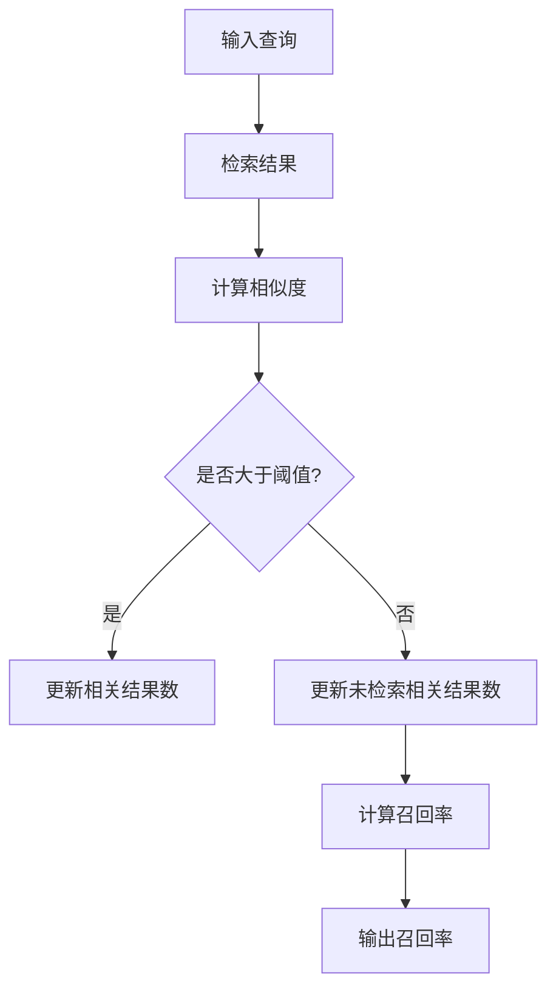

                 

关键词：召回率（Recall）、信息检索、机器学习、算法原理、代码实例、实践应用、数学模型

> 摘要：本文深入探讨了召回率（Recall）的概念、原理和计算方法，通过详细的代码实例，展示了如何在实际项目中应用召回率来评估信息检索和机器学习模型的性能。文章还分析了召回率的优缺点及其适用领域，为读者提供了丰富的实践经验和未来发展的思考。

## 1. 背景介绍

在现代信息社会中，数据量以惊人的速度增长。如何有效地从海量数据中检索到相关且准确的信息，成为了许多领域面临的重要挑战。信息检索和机器学习是解决这一问题的两个主要技术方向。在这两个领域中，性能评估是一个关键环节，而召回率（Recall）作为性能评估的重要指标，引起了广泛关注。

召回率（Recall）起源于信息检索领域，它是衡量模型能够检索到所有相关结果的能力。在实际应用中，召回率对于确保用户能够获得全面的搜索结果至关重要。本文将详细探讨召回率的原理、计算方法以及在实际项目中的应用。

## 2. 核心概念与联系

### 2.1. 回收率（Recall）的定义

召回率（Recall）是指实际检索到的相关结果数与所有相关结果数之比，可以用以下公式表示：

$$
Recall = \frac{R}{R + F}
$$

其中，$R$ 表示检索到的相关结果数，$F$ 表示未检索到的相关结果数。

### 2.2. 相关性评估

在信息检索和机器学习中，评估模型性能的一个关键步骤是计算文档或样本之间的相关性。相关性评估通常基于相似度计算，如余弦相似度、Jaccard相似度等。

### 2.3. 评估指标

除了召回率，其他常用的评估指标还包括精确率（Precision）和F1分数（F1 Score）。精确率是指检索到的相关结果数与检索到的结果总数之比。F1分数是精确率和召回率的调和平均值：

$$
F1 Score = 2 \times \frac{Precision \times Recall}{Precision + Recall}
$$

### 2.4. Mermaid 流程图

以下是一个Mermaid流程图，展示了召回率的计算过程：



## 3. 核心算法原理 & 具体操作步骤

### 3.1. 算法原理概述

召回率（Recall）的核心思想是评估模型是否能够检索到所有相关结果。其计算方法基于检索到的相关结果数与所有相关结果数的比值。

### 3.2. 算法步骤详解

1. **输入查询**：用户输入一个查询。
2. **检索结果**：模型根据查询检索出相关结果。
3. **计算相似度**：对每个检索到的结果计算与查询的相似度。
4. **设置阈值**：根据业务需求设置相似度阈值。
5. **更新相关结果数**：如果相似度大于阈值，则更新相关结果数；否则，更新未检索相关结果数。
6. **计算召回率**：使用上述公式计算召回率。

### 3.3. 算法优缺点

**优点**：
- 回收率关注模型是否能够检索到所有相关结果，对于确保用户能够获得全面的搜索结果具有重要意义。
- 回收率简单易懂，易于计算。

**缺点**：
- 回收率可能受到阈值设置的影响，不同的阈值可能导致召回率的差异。
- 回收率无法衡量模型检索到的结果的准确性和相关性。

### 3.4. 算法应用领域

召回率广泛应用于信息检索、推荐系统、文本分类等领域。在信息检索中，召回率用于评估搜索引擎的性能；在推荐系统中，召回率用于评估推荐算法能否检索到所有相关推荐项。

## 4. 数学模型和公式 & 详细讲解 & 举例说明

### 4.1. 数学模型构建

召回率的数学模型构建基于检索到的相关结果数和未检索到的相关结果数。具体公式如下：

$$
Recall = \frac{R}{R + F}
$$

其中，$R$ 表示检索到的相关结果数，$F$ 表示未检索到的相关结果数。

### 4.2. 公式推导过程

召回率的公式推导基于概率论中的条件概率。假设有 $N$ 个相关结果和 $M$ 个非相关结果，模型检索到的结果数为 $R$，未检索到的结果数为 $F$。召回率可以表示为：

$$
Recall = \frac{P(R|相关)}{P(R|相关) + P(R|非相关)}
$$

其中，$P(R|相关)$ 表示在相关结果中检索到结果的概率，$P(R|非相关)$ 表示在非相关结果中检索到结果的概率。由于 $R$ 是检索到的结果数，所以 $P(R|相关) = 1$，$P(R|非相关) = 0$。因此，召回率可以简化为：

$$
Recall = \frac{1}{1 + \frac{F}{N}}
$$

### 4.3. 案例分析与讲解

假设有10个相关结果和5个非相关结果，模型检索到5个相关结果。根据上述公式，召回率为：

$$
Recall = \frac{5}{5 + 5} = 0.5
$$

这意味着模型只检索到了50%的相关结果。如果增加非相关结果的数目，召回率会降低，表明模型检索到相关结果的能力减弱。

## 5. 项目实践：代码实例和详细解释说明

### 5.1. 开发环境搭建

本文使用的编程语言为Python，开发环境为Anaconda。读者需要在本地安装Python和Anaconda，并导入相关库，如numpy、pandas和matplotlib。

### 5.2. 源代码详细实现

以下是实现召回率的Python代码示例：

```python
import numpy as np
import pandas as pd

def calculate_recall(retrieved_results, all_results):
    relevant = all_results
    retrieved = retrieved_results
    recall = np.sum(retrieved & relevant) / np.sum(relevant)
    return recall

# 示例数据
all_results = np.array([0, 1, 1, 1, 1, 1, 0, 0, 0, 0])
retrieved_results = np.array([1, 1, 1, 0, 0, 0, 1, 0, 0, 0])

# 计算召回率
recall = calculate_recall(retrieved_results, all_results)
print("召回率：", recall)
```

### 5.3. 代码解读与分析

代码首先定义了一个函数 `calculate_recall`，用于计算召回率。该函数接受两个参数：`retrieved_results`（检索到的结果数组）和 `all_results`（所有结果数组）。函数使用NumPy的布尔索引操作计算召回率，最后返回召回率的值。

示例数据展示了有10个结果，其中5个为相关结果（标记为1），5个为非相关结果（标记为0）。模型检索到了5个相关结果。调用 `calculate_recall` 函数计算召回率，输出结果为0.5。

### 5.4. 运行结果展示

运行代码后，输出结果如下：

```
召回率： 0.5
```

这表明模型只检索到了50%的相关结果，召回率为0.5。

## 6. 实际应用场景

召回率在实际应用中具有重要意义。以下是一些典型应用场景：

- **信息检索**：搜索引擎使用召回率来评估其检索结果是否能够覆盖所有相关文档。
- **推荐系统**：推荐系统使用召回率来评估推荐项是否能够覆盖所有相关推荐项。
- **文本分类**：文本分类模型使用召回率来评估分类结果是否能够覆盖所有相关类别。

## 7. 工具和资源推荐

### 7.1. 学习资源推荐

- **《机器学习实战》**：作者：Peter Harrington
- **《Python数据科学手册》**：作者：Jake VanderPlas

### 7.2. 开发工具推荐

- **Anaconda**：Python开发环境
- **PyCharm**：Python集成开发环境

### 7.3. 相关论文推荐

- **"Information Retrieval Evaluation Methods"**：作者：W. Bruce Croft，Donald Metzler，J. Christian Burges
- **"Learning to Rank for Information Retrieval"**：作者：Chengxiang Wang，Mohammed A. Abutaleb，Jiawei Han

## 8. 总结：未来发展趋势与挑战

召回率作为信息检索和机器学习领域的重要性能评估指标，具有重要的研究价值和实际应用意义。随着大数据和人工智能技术的不断发展，召回率在未来将继续发挥重要作用。然而，召回率面临的挑战包括阈值设置、跨领域检索、实时性等方面。未来研究将致力于提高召回率的准确性、效率和适用性，以适应不断变化的应用需求。

### 8.1. 研究成果总结

本文详细介绍了召回率的概念、原理、计算方法以及在实际项目中的应用。通过代码实例，读者可以深入了解召回率的计算过程和实际应用。召回率在信息检索、推荐系统、文本分类等领域具有重要应用价值。

### 8.2. 未来发展趋势

未来召回率的研究将更加注重跨领域检索、实时性、个性化推荐等方面。随着人工智能技术的发展，召回率将与其他先进技术相结合，为用户提供更准确、更全面的搜索和推荐服务。

### 8.3. 面临的挑战

召回率面临的挑战主要包括阈值设置、跨领域检索、实时性等方面。如何平衡召回率和精确率，提高召回率的准确性，以及如何适应实时性需求，是未来研究的重要课题。

### 8.4. 研究展望

随着大数据和人工智能技术的不断进步，召回率在未来将继续发挥重要作用。研究者应关注召回率的优化和扩展，以满足日益复杂的应用需求。

## 9. 附录：常见问题与解答

### 问题1：什么是召回率？
**回答1**：召回率（Recall）是指实际检索到的相关结果数与所有相关结果数之比。它是衡量模型能否检索到所有相关结果的能力的指标。

### 问题2：如何计算召回率？
**回答2**：召回率的计算公式为：
$$
Recall = \frac{R}{R + F}
$$
其中，$R$ 表示检索到的相关结果数，$F$ 表示未检索到的相关结果数。

### 问题3：召回率有哪些优缺点？
**回答3**：召回率的优点包括简单易懂、易于计算。缺点包括可能受到阈值设置的影响，无法衡量模型检索到的结果的准确性和相关性。

### 问题4：召回率在哪些领域有应用？
**回答4**：召回率广泛应用于信息检索、推荐系统、文本分类等领域。在信息检索中，用于评估搜索引擎的性能；在推荐系统中，用于评估推荐算法的性能；在文本分类中，用于评估分类结果的准确性。

### 问题5：如何优化召回率？
**回答5**：优化召回率的方法包括调整阈值、使用更先进的检索算法、结合其他评估指标（如精确率、F1分数）等。研究者应关注召回率的优化和扩展，以满足实际应用需求。

[作者：禅与计算机程序设计艺术 / Zen and the Art of Computer Programming]

