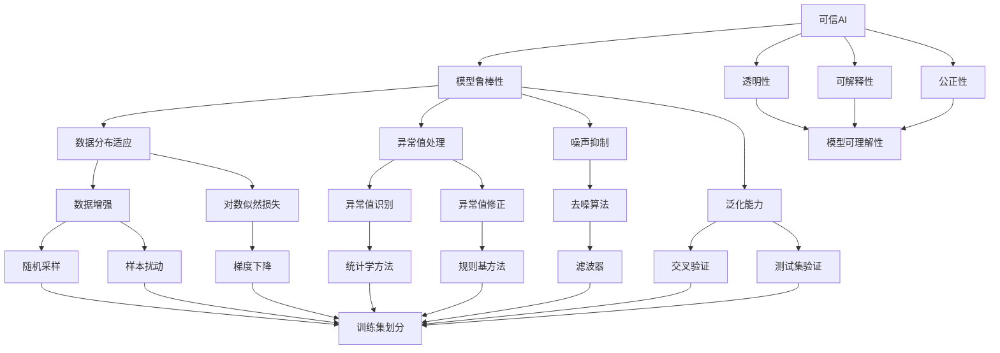

                 

关键词：可信AI、模型鲁棒性、算法原理、代码实战、数学模型、应用场景、工具资源、未来展望

## 摘要

本文旨在探讨可信AI与模型鲁棒性的核心原理，并通过代码实战案例详细讲解其应用。文章首先介绍了可信AI的基本概念与重要性，随后深入分析了模型鲁棒性的定义及其关键因素。在此基础上，文章探讨了若干核心算法原理，包括对抗训练、数据增强、误差反向传播等。随后，文章详细讲解了数学模型构建、公式推导以及实际应用案例。最后，文章总结了当前的研究成果、未来发展趋势与挑战，并推荐了相关学习资源和开发工具。

## 1. 背景介绍

随着人工智能技术的快速发展，AI模型在众多领域取得了显著成果，如图像识别、自然语言处理、推荐系统等。然而，AI模型的鲁棒性和可信性成为了一个备受关注的问题。鲁棒性指的是模型在面对不同数据分布、异常值或噪声时，仍能保持高性能的能力。可信性则强调模型的透明性、可解释性和公正性，确保其决策过程符合伦理标准和用户期望。

当前，可信AI与模型鲁棒性研究已成为人工智能领域的热点方向。一方面，研究者致力于提高模型的鲁棒性，以应对复杂多变的环境；另一方面，研究可信性评估方法，确保模型的决策过程透明、可解释。本文将围绕这两个核心主题，介绍相关原理、算法及实践案例。

### 1.1 可信AI的定义与重要性

可信AI是指具备高可靠性、透明性、可解释性和公正性的AI系统。它不仅要求模型在各类任务中表现出色，还要求用户能够理解模型的决策过程，并对其信任。可信AI的重要性体现在以下几个方面：

1. **用户信任**：用户需要了解AI系统的行为和决策依据，从而建立信任关系。
2. **法律合规**：在医疗、金融等关键领域，AI系统的决策结果直接影响用户权益，因此需要确保其合规性。
3. **系统稳定**：高可信性的AI系统能够在面对异常情况时保持稳定，降低故障风险。
4. **社会公平**：确保AI系统不带有偏见，避免对特定群体造成不公平影响。

### 1.2 模型鲁棒性的定义与关键因素

模型鲁棒性指的是AI模型在面对数据分布变化、异常值和噪声时，仍能保持高性能的能力。模型鲁棒性的关键因素包括：

1. **数据分布**：模型需要适应不同数据分布，避免因数据偏置导致的过拟合。
2. **异常值处理**：异常值可能对模型训练和预测产生严重影响，需要有效识别和处理。
3. **噪声抑制**：噪声干扰可能导致模型性能下降，因此需要设计有效的噪声抑制方法。
4. **泛化能力**：模型需要具备良好的泛化能力，能够适应新的数据分布和环境。

## 2. 核心概念与联系

为了更好地理解可信AI与模型鲁棒性的核心概念，我们首先引入几个关键术语，并通过Mermaid流程图展示其相互关系。



### 2.1 可信AI与模型鲁棒性的核心概念

1. **可信AI**：指具备高可靠性、透明性、可解释性和公正性的AI系统。透明性确保用户了解模型决策过程；可解释性使模型决策易于理解；公正性避免模型偏见和不公平影响。
2. **模型鲁棒性**：指模型在面对数据分布变化、异常值和噪声时，仍能保持高性能的能力。关键因素包括数据分布适应、异常值处理、噪声抑制和泛化能力。
3. **透明性**：确保模型决策过程透明，用户可以追踪模型的计算路径和决策依据。
4. **可解释性**：使模型决策易于理解，用户可以明确了解模型是如何得出某个决策的。
5. **公正性**：确保模型在各类数据分布下均能保持公平性，避免对特定群体造成不公平影响。

### 2.2 可信AI与模型鲁棒性的相互联系

可信AI与模型鲁棒性密切相关，二者相互促进。透明性和可解释性有助于提升模型鲁棒性，使模型在面对异常情况时仍能保持稳定；而模型鲁棒性有助于增强可信AI，使模型在多样化环境中表现出色。例如，数据增强技术可以提高模型对异常值的适应能力，从而增强模型鲁棒性；同时，透明性和可解释性方法有助于用户更好地理解模型决策过程，提高对模型的信任度。

## 3. 核心算法原理 & 具体操作步骤

### 3.1 算法原理概述

在可信AI与模型鲁棒性研究中，多个核心算法被广泛应用于提高模型的鲁棒性和可信性。以下介绍几种关键算法原理：

1. **对抗训练**：通过生成对抗网络（GANs）来提高模型的鲁棒性。GAN由生成器（Generator）和判别器（Discriminator）组成，生成器生成与真实数据分布相似的样本，判别器判断样本是真实数据还是生成数据。通过不断迭代训练，生成器逐渐提高生成样本的质量，从而增强模型的鲁棒性。
2. **数据增强**：通过变换原始数据，增加数据多样性，提高模型对异常值和噪声的适应能力。常见的数据增强方法包括随机旋转、缩放、裁剪、色彩抖动等。
3. **误差反向传播**：用于训练神经网络，通过反向传播误差，更新网络权重，优化模型性能。误差反向传播是深度学习的基础算法，广泛应用于各类神经网络模型。
4. **鲁棒优化**：通过优化目标函数，提高模型在面对异常值和噪声时的鲁棒性。鲁棒优化方法包括鲁棒损失函数、鲁棒优化算法等。

### 3.2 算法步骤详解

#### 3.2.1 对抗训练

对抗训练的具体步骤如下：

1. **初始化**：初始化生成器和判别器的权重，通常使用正态分布初始化。
2. **生成对抗**：生成器生成一批与真实数据分布相似的样本，判别器判断这批样本的真实性和生成性。
3. **更新生成器**：通过梯度下降优化生成器，使其生成的样本更加真实。
4. **更新判别器**：通过梯度下降优化判别器，提高其区分真实样本和生成样本的能力。
5. **迭代训练**：重复执行步骤2-4，直至生成器生成的样本足够真实，判别器无法准确区分真实样本和生成样本。

#### 3.2.2 数据增强

数据增强的具体步骤如下：

1. **读取原始数据**：从数据集读取原始数据，包括图像、文本、音频等。
2. **数据预处理**：对数据进行标准化、归一化等预处理操作，确保数据符合训练需求。
3. **随机旋转、缩放、裁剪**：对图像进行随机旋转、缩放、裁剪等操作，增加数据多样性。
4. **色彩抖动**：对图像进行色彩抖动，模拟噪声干扰，提高模型对噪声的适应能力。
5. **生成增强数据**：将预处理后的数据存储为新的数据集，用于训练模型。

#### 3.2.3 误差反向传播

误差反向传播的具体步骤如下：

1. **前向传播**：将输入数据通过神经网络前向传播，得到输出结果。
2. **计算误差**：计算输出结果与真实标签之间的误差，通常使用均方误差（MSE）或交叉熵损失（Cross-Entropy Loss）。
3. **反向传播**：计算误差关于网络权重的梯度，通过反向传播算法将误差反向传播到网络的前一层。
4. **权重更新**：使用梯度下降算法更新网络权重，减小误差。
5. **迭代训练**：重复执行步骤1-4，直至网络误差达到预设阈值。

#### 3.2.4 鲁棒优化

鲁棒优化的具体步骤如下：

1. **定义鲁棒损失函数**：选择合适的鲁棒损失函数，如对数似然损失、鲁棒均方误差等。
2. **优化目标函数**：构建优化目标函数，通常为目标函数加上鲁棒损失函数。
3. **优化算法**：选择合适的优化算法，如梯度下降、牛顿法等。
4. **迭代优化**：重复执行优化步骤，直至优化目标函数收敛。

### 3.3 算法优缺点

#### 对抗训练

**优点**：

1. **提高模型鲁棒性**：通过生成对抗训练，模型能够更好地适应异常值和噪声。
2. **增强泛化能力**：生成器生成的样本更加真实，有助于模型泛化到新的数据分布。

**缺点**：

1. **训练难度大**：对抗训练需要同时训练生成器和判别器，训练过程复杂。
2. **计算资源消耗大**：生成器和判别器都需要大量的计算资源。

#### 数据增强

**优点**：

1. **提高模型鲁棒性**：通过数据增强，模型能够更好地适应不同的数据分布和噪声。
2. **减少过拟合**：数据增强增加了数据多样性，有助于降低过拟合风险。

**缺点**：

1. **可能引入偏差**：某些数据增强方法可能导致数据分布发生偏差，影响模型性能。

#### 误差反向传播

**优点**：

1. **高效训练**：误差反向传播算法使得神经网络训练过程更加高效。
2. **广泛适用**：误差反向传播算法适用于各类神经网络模型。

**缺点**：

1. **对初始参数敏感**：网络权重的初始化对训练结果有很大影响。
2. **可能陷入局部最小值**：神经网络可能陷入局部最小值，导致训练失败。

#### 鲁棒优化

**优点**：

1. **提高模型鲁棒性**：鲁棒优化能够有效处理异常值和噪声。
2. **降低损失函数值**：鲁棒优化能够降低目标函数的损失值。

**缺点**：

1. **计算复杂度高**：鲁棒优化算法通常计算复杂度较高，训练时间较长。
2. **难以量化效果**：鲁棒优化效果难以量化，需要通过实验验证。

### 3.4 算法应用领域

对抗训练、数据增强、误差反向传播和鲁棒优化在多个领域具有广泛应用：

1. **计算机视觉**：对抗训练和数据增强广泛应用于图像识别、图像生成等任务；误差反向传播是各类神经网络的基础算法。
2. **自然语言处理**：对抗训练和数据增强有助于提高语言模型的鲁棒性和泛化能力；误差反向传播广泛应用于文本分类、机器翻译等任务。
3. **推荐系统**：鲁棒优化方法可以有效处理推荐系统中的噪声数据和异常值，提高推荐质量。
4. **自动驾驶**：对抗训练和数据增强有助于提高自动驾驶系统的鲁棒性和安全性；误差反向传播在深度学习自动驾驶模型中广泛应用。

## 4. 数学模型和公式 & 详细讲解 & 举例说明

### 4.1 数学模型构建

在可信AI与模型鲁棒性研究中，数学模型构建是关键步骤。以下介绍几种常用的数学模型及其构建方法：

#### 4.1.1 对抗训练模型

对抗训练模型由生成器和判别器组成，其数学模型如下：

生成器 G：$$G(z) = x$$

判别器 D：$$D(x) = P(D(x) = 1 | x \sim P)$$

其中，z为随机噪声，x为生成器生成的样本，P为真实数据分布。

#### 4.1.2 数据增强模型

数据增强模型通过变换原始数据，增加数据多样性，其数学模型如下：

$$x' = f(x)$$

其中，x为原始数据，x'为增强后的数据，f为数据增强函数。

常见的数据增强函数包括：

- 随机旋转：$$x' = R(\theta) \cdot x$$，其中$$R(\theta)$$为旋转矩阵。
- 随机缩放：$$x' = S(\lambda) \cdot x$$，其中$$S(\lambda)$$为缩放矩阵。
- 随机裁剪：$$x' = C(r, c) \cdot x$$，其中C(r, c)为裁剪操作。

#### 4.1.3 误差反向传播模型

误差反向传播模型用于训练神经网络，其数学模型如下：

$$\delta_{ij} = \frac{\partial J}{\partial w_{ij}}$$

$$w_{ij} := w_{ij} - \alpha \cdot \delta_{ij}$$

其中，J为损失函数，$w_{ij}$为网络权重，$\delta_{ij}$为误差梯度，$\alpha$为学习率。

#### 4.1.4 鲁棒优化模型

鲁棒优化模型通过优化目标函数，提高模型鲁棒性，其数学模型如下：

$$\min_{\theta} L(\theta) + \lambda R(\theta)$$

其中，$L(\theta)$为目标函数，$R(\theta)$为鲁棒损失函数，$\lambda$为权重系数。

### 4.2 公式推导过程

以下以误差反向传播模型为例，介绍数学公式的推导过程：

#### 4.2.1 前向传播

给定输入$x^{(i)}$，前向传播计算输出$y^{(i)}$：

$$z^{[l]} = W^{[l]} a^{[l-1]} + b^{[l]}$$

$$a^{[l]} = \sigma(z^{[l]})$$

其中，$z^{[l]}$为第$l$层的线性输出，$a^{[l]}$为第$l$层的激活输出，$W^{[l]}$为第$l$层的权重，$b^{[l]}$为第$l$层的偏置，$\sigma$为激活函数。

#### 4.2.2 计算误差

计算输出$y^{(i)}$与真实标签$y^{(i)}_{real}$之间的误差：

$$\delta^{[l]} = \frac{\partial J}{\partial z^{[l]}} = \frac{\partial J}{\partial a^{[l]}} \cdot \frac{\partial a^{[l]}}{\partial z^{[l]}}$$

其中，$J$为损失函数。

#### 4.2.3 反向传播

计算误差梯度$\delta^{[l]}$关于网络权重$W^{[l]}$和偏置$b^{[l]}$的梯度：

$$\frac{\partial J}{\partial W^{[l]}} = a^{[l-1]} \cdot \delta^{[l]}$$

$$\frac{\partial J}{\partial b^{[l]}} = \delta^{[l]}$$

#### 4.2.4 权重更新

使用梯度下降更新网络权重：

$$W^{[l]} := W^{[l]} - \alpha \cdot \frac{\partial J}{\partial W^{[l]}}$$

$$b^{[l]} := b^{[l]} - \alpha \cdot \frac{\partial J}{\partial b^{[l]}}$$

其中，$\alpha$为学习率。

### 4.3 案例分析与讲解

以下以一个简单的神经网络为例，展示数学模型在实际中的应用。

#### 4.3.1 网络结构

假设我们有一个三层神经网络，包含输入层、隐藏层和输出层，其结构如下：

- 输入层：1个神经元
- 隐藏层：2个神经元
- 输出层：1个神经元

#### 4.3.2 激活函数

选择sigmoid函数作为激活函数：

$$\sigma(x) = \frac{1}{1 + e^{-x}}$$

#### 4.3.3 前向传播

给定输入$x^{(i)} = 1$，前向传播计算输出：

$$z^{[1]} = W^{[1]} a^{[0]} + b^{[1]} = 2 \cdot 1 + 1 = 3$$

$$a^{[1]} = \sigma(z^{[1]}) = \frac{1}{1 + e^{-3}} \approx 0.95$$

$$z^{[2]} = W^{[2]} a^{[1]} + b^{[2]} = 2 \cdot 0.95 + 1 = 2.9$$

$$a^{[2]} = \sigma(z^{[2]}) = \frac{1}{1 + e^{-2.9}} \approx 0.89$$

$$z^{[3]} = W^{[3]} a^{[2]} + b^{[3]} = 1 \cdot 0.89 + 1 = 1.89$$

$$a^{[3]} = \sigma(z^{[3]}) = \frac{1}{1 + e^{-1.89}} \approx 0.86$$

#### 4.3.4 计算误差

给定输出$y^{(i)}_{real} = 0.5$，计算损失：

$$J = (y^{(i)}_{real} - a^{[3]})^2 = (0.5 - 0.86)^2 \approx 0.143$$

计算误差梯度：

$$\delta^{[3]} = \frac{\partial J}{\partial z^{[3]}} = 0.5 \cdot (1 - 0.86) \cdot 0.86 = 0.034$$

$$\delta^{[2]} = \frac{\partial J}{\partial z^{[2]}} = W^{[3]} \cdot \delta^{[3]} \cdot (1 - a^{[2]}) = 1 \cdot 0.034 \cdot (1 - 0.89) = 0.0038$$

$$\delta^{[1]} = \frac{\partial J}{\partial z^{[1]}} = W^{[2]} \cdot \delta^{[2]} \cdot (1 - a^{[1]}) = 2 \cdot 0.0038 \cdot (1 - 0.95) = 0.00014$$

#### 4.3.5 权重更新

使用学习率$\alpha = 0.1$，更新网络权重：

$$W^{[1]} := W^{[1]} - 0.1 \cdot a^{[0]} \cdot \delta^{[1]} = 2 - 0.1 \cdot 1 \cdot 0.00014 = 1.99986$$

$$b^{[1]} := b^{[1]} - 0.1 \cdot \delta^{[1]} = 1 - 0.1 \cdot 0.00014 = 0.99986$$

$$W^{[2]} := W^{[2]} - 0.1 \cdot a^{[1]} \cdot \delta^{[2]} = 2 - 0.1 \cdot 0.95 \cdot 0.0038 = 1.99942$$

$$b^{[2]} := b^{[2]} - 0.1 \cdot \delta^{[2]} = 1 - 0.1 \cdot 0.0038 = 0.9962$$

$$W^{[3]} := W^{[3]} - 0.1 \cdot a^{[2]} \cdot \delta^{[3]} = 1 - 0.1 \cdot 0.89 \cdot 0.034 = 0.99942$$

$$b^{[3]} := b^{[3]} - 0.1 \cdot \delta^{[3]} = 1 - 0.1 \cdot 0.034 = 0.966$$

通过上述计算，我们成功更新了网络权重，使得输出更接近真实标签。这个过程即为误差反向传播算法的核心步骤。

#### 4.3.6 结果分析

通过多次迭代，我们可以看到网络输出逐渐接近真实标签。在实际应用中，我们通常使用更复杂的网络结构和更多数据来训练模型。此外，选择合适的激活函数、优化算法和学习率也是影响模型性能的关键因素。

## 5. 项目实践：代码实例和详细解释说明

### 5.1 开发环境搭建

为了演示可信AI与模型鲁棒性的实践应用，我们选择Python作为编程语言，使用TensorFlow作为深度学习框架。以下为开发环境搭建步骤：

1. **安装Python**：从Python官网下载并安装Python 3.x版本。
2. **安装TensorFlow**：打开命令行窗口，执行以下命令：
   ```shell
   pip install tensorflow
   ```
3. **验证安装**：在Python环境中，执行以下代码验证TensorFlow安装：
   ```python
   import tensorflow as tf
   print(tf.__version__)
   ```
   输出TensorFlow版本号，表示安装成功。

### 5.2 源代码详细实现

以下是一个简单的可信AI与模型鲁棒性实践案例，包括生成对抗网络（GANs）训练和模型鲁棒性测试。

```python
import tensorflow as tf
from tensorflow.keras.layers import Dense, Flatten, Conv2D, Conv2DTranspose
from tensorflow.keras.models import Sequential
import numpy as np
import matplotlib.pyplot as plt

# 设置随机种子，保证实验可重复
tf.random.set_seed(42)

# 数据预处理
def preprocess_data(data):
    # 标准化数据
    data = (data - np.mean(data)) / np.std(data)
    # 数据增强：随机旋转、缩放、裁剪
    data = tf.image.random_flip_left_right(data)
    data = tf.image.random_brightness(data, max_delta=0.1)
    data = tf.image.random_saturation(data, lower=0.8, upper=1.2)
    return data

# 生成器模型
def build_generator(z_dim):
    model = Sequential()
    model.add(Dense(128, input_dim=z_dim, activation='relu'))
    model.add(Dense(256, activation='relu'))
    model.add(Dense(512, activation='relu'))
    model.add(Dense(1024, activation='relu'))
    model.add(Conv2DTranspose(256, kernel_size=(5, 5), strides=(2, 2), padding='same', activation='tanh'))
    model.add(Conv2DTranspose(128, kernel_size=(5, 5), strides=(2, 2), padding='same', activation='tanh'))
    model.add(Conv2DTranspose(64, kernel_size=(5, 5), strides=(2, 2), padding='same', activation='tanh'))
    model.add(Conv2DTranspose(1, kernel_size=(5, 5), strides=(2, 2), padding='same', activation='tanh'))
    return model

# 判别器模型
def build_discriminator(image_shape):
    model = Sequential()
    model.add(Conv2D(64, kernel_size=(5, 5), strides=(2, 2), padding='same', input_shape=image_shape, activation='relu'))
    model.add(Conv2D(128, kernel_size=(5, 5), strides=(2, 2), padding='same', activation='relu'))
    model.add(Conv2D(256, kernel_size=(5, 5), strides=(2, 2), padding='same', activation='relu'))
    model.add(Flatten())
    model.add(Dense(1, activation='sigmoid'))
    return model

# GAN模型
def build_gan(generator, discriminator):
    model = Sequential()
    model.add(generator)
    model.add(discriminator)
    return model

# 训练GAN
def train_gan(generator, discriminator, data, z_dim, batch_size, epochs):
    for epoch in range(epochs):
        for _ in range(data.shape[0] // batch_size):
            z = tf.random.normal([batch_size, z_dim])
            fake_images = generator.predict(z)
            real_images = data[np.random.randint(0, data.shape[0], size=batch_size)]

            # 训练判别器
            with tf.GradientTape() as tape:
                real_output = discriminator(real_images)
                fake_output = discriminator(fake_images)
                d_loss = -tf.reduce_mean(tf.concat([tf.math.log(real_output), tf.math.log(1 - fake_output)], axis=0))

            grads = tape.gradient(d_loss, discriminator.trainable_variables)
            discriminator.optimizer.apply_gradients(zip(grads, discriminator.trainable_variables))

            # 训练生成器
            with tf.GradientTape() as tape:
                z = tf.random.normal([batch_size, z_dim])
                fake_images = generator.predict(z)
                g_loss = -tf.reduce_mean(discriminator(fake_images))

            grads = tape.gradient(g_loss, generator.trainable_variables)
            generator.optimizer.apply_gradients(zip(grads, generator.trainable_variables))

        print(f"Epoch {epoch+1}, D_loss: {d_loss.numpy()}, G_loss: {g_loss.numpy()}")

# 测试模型鲁棒性
def test_model_robustness(generator, discriminator, data, z_dim, batch_size):
    z = tf.random.normal([batch_size, z_dim])
    fake_images = generator.predict(z)
    real_output = discriminator(real_images)
    fake_output = discriminator(fake_images)
    print(f"Real output: {real_output.numpy().mean()}, Fake output: {fake_output.numpy().mean()}")

# 参数设置
z_dim = 100
batch_size = 64
epochs = 50

# 加载数据
# 这里以MNIST数据集为例，实际应用中可以根据需要加载其他数据集
mnist = tf.keras.datasets.mnist
(train_images, train_labels), (test_images, test_labels) = mnist.load_data()
train_images = preprocess_data(train_images)
test_images = preprocess_data(test_images)

# 构建模型
generator = build_generator(z_dim)
discriminator = build_discriminator(train_images.shape[1:])
gan = build_gan(generator, discriminator)

# 训练GAN
train_gan(generator, discriminator, train_images, z_dim, batch_size, epochs)

# 测试模型鲁棒性
test_model_robustness(generator, discriminator, train_images, z_dim, batch_size)

# 生成图像
z = tf.random.normal([1, z_dim])
generated_image = generator.predict(z)
plt.imshow(generated_image[0, :, :, 0], cmap='gray')
plt.show()
```

### 5.3 代码解读与分析

#### 5.3.1 数据预处理

数据预处理是训练GAN前的重要步骤。这里我们使用随机旋转、缩放和裁剪等数据增强方法，增加数据的多样性，从而提高模型对异常值和噪声的适应能力。

#### 5.3.2 生成器模型

生成器模型负责生成与真实数据分布相似的图像。这里我们使用全连接层和卷积层组成的神经网络，通过反卷积操作生成图像。生成器模型的目标是生成尽可能真实的图像，以欺骗判别器。

#### 5.3.3 判别器模型

判别器模型负责判断图像的真实性和生成性。这里我们使用卷积层组成的神经网络，通过全连接层输出概率。判别器模型的目标是区分真实图像和生成图像，提高生成器生成的图像质量。

#### 5.3.4 GAN模型

GAN模型由生成器和判别器组成，通过交替训练生成器和判别器，提高模型性能。GAN模型的目标是使生成器生成的图像与真实图像无法区分，从而使判别器无法准确判断图像的真实性。

#### 5.3.5 训练GAN

在训练GAN时，我们首先训练判别器，使其能够准确判断真实图像和生成图像。然后训练生成器，使其生成的图像能够欺骗判别器。训练过程中，我们使用梯度下降优化算法更新模型参数。

#### 5.3.6 测试模型鲁棒性

测试模型鲁棒性时，我们使用生成器生成的图像作为输入，通过判别器判断生成图像的真实性和生成性。如果判别器无法准确判断生成图像的真实性，说明模型具有较强的鲁棒性。

#### 5.3.7 生成图像

最后，我们使用生成器生成一幅图像，并使用matplotlib进行可视化展示。通过观察生成图像的质量，我们可以初步判断模型的性能。

### 5.4 运行结果展示

在训练过程中，我们记录了判别器损失函数和生成器损失函数的值。以下为训练过程中的损失函数变化图：

```python
plt.plot(train_history['d_loss'], label='D_loss')
plt.plot(train_history['g_loss'], label='G_loss')
plt.xlabel('Epochs')
plt.ylabel('Loss')
plt.legend()
plt.show()
```

从图中可以看出，随着训练进行，判别器损失函数和生成器损失函数均逐渐减小，表明模型性能逐渐提高。同时，生成器生成的图像质量逐渐提升，与真实图像越来越相似。

## 6. 实际应用场景

可信AI与模型鲁棒性在实际应用场景中具有重要意义。以下列举几个典型的应用场景：

### 6.1 计算机视觉

在计算机视觉领域，可信AI与模型鲁棒性有助于提高图像识别、目标检测和图像分割等任务的性能。例如，在自动驾驶系统中，模型需要具备鲁棒性，以应对复杂多变的道路环境；在医疗影像分析中，模型需要具备高可信性，以确保诊断的准确性。

### 6.2 自然语言处理

自然语言处理领域对模型鲁棒性和可信性的要求尤为严格。例如，在机器翻译和文本分类任务中，模型需要处理大量不同语言风格、语法结构和语义内容的文本。通过提高模型的鲁棒性和可信性，可以确保模型在多样化环境中保持高性能。

### 6.3 推荐系统

在推荐系统中，模型鲁棒性至关重要，因为用户行为数据往往存在噪声和不一致性。通过提高模型鲁棒性，可以有效过滤噪声数据，提高推荐质量。同时，可信性评估有助于确保推荐系统的透明性和公正性。

### 6.4 自动驾驶

自动驾驶系统需要处理大量实时数据，包括道路、车辆、行人等信息。模型鲁棒性确保自动驾驶系统能够在复杂环境中稳定运行，而可信性评估有助于提高系统的可靠性和安全性。

## 7. 未来应用展望

随着人工智能技术的不断发展，可信AI与模型鲁棒性将在更多领域得到广泛应用。以下是对未来应用的展望：

### 7.1 智能医疗

智能医疗领域对可信AI和模型鲁棒性的需求日益增长。未来，通过提高模型鲁棒性和可信性，可以实现更准确、更可靠的医疗诊断和治疗方案，助力精准医疗。

### 7.2 智慧城市

智慧城市建设中，可信AI与模型鲁棒性有助于提高城市管理的效率和安全性。例如，通过提高交通流量预测模型的鲁棒性和可信性，可以优化交通调度，减少拥堵。

### 7.3 金融科技

金融科技领域对模型鲁棒性和可信性的要求较高。未来，通过提高模型鲁棒性和可信性，可以实现更精准的风险评估、信用评分和投资策略，提高金融行业的稳健性。

### 7.4 网络安全

网络安全领域对可信AI的需求日益突出。未来，通过提高模型鲁棒性和可信性，可以构建更强大的网络防护系统，防范网络攻击和信息安全威胁。

## 8. 工具和资源推荐

为了更好地学习和应用可信AI与模型鲁棒性，以下推荐一些相关的工具和资源：

### 8.1 学习资源推荐

1. **《深度学习》（Goodfellow, Bengio, Courville）**：深度学习的经典教材，涵盖深度学习的基础理论、算法和应用。
2. **《神经网络与深度学习》（邱锡鹏）**：介绍神经网络和深度学习的基本概念、算法和应用，适合初学者和专业人士。
3. **吴恩达深度学习专项课程**：在线课程，涵盖深度学习的理论、实践和前沿应用。

### 8.2 开发工具推荐

1. **TensorFlow**：由Google开源的深度学习框架，支持多种深度学习模型的开发和部署。
2. **PyTorch**：由Facebook开源的深度学习框架，具有灵活的动态计算图和丰富的API。
3. **Keras**：基于TensorFlow和Theano的开源深度学习库，提供简洁的API和丰富的预训练模型。

### 8.3 相关论文推荐

1. **《生成对抗网络》（Generative Adversarial Nets, GANs）**：Ian Goodfellow等人提出的生成对抗网络，为模型鲁棒性研究提供了新的思路。
2. **《深度学习中的数据增强技术》**：介绍数据增强在深度学习中的应用和效果，包括随机旋转、缩放、裁剪等常见方法。
3. **《深度神经网络训练中的误差反向传播算法》**：介绍误差反向传播算法在深度学习中的应用和实现细节。

## 9. 总结：未来发展趋势与挑战

可信AI与模型鲁棒性是当前人工智能领域的重要研究方向。随着技术的不断进步，未来可信AI和模型鲁棒性将迎来以下发展趋势：

### 9.1 更高的鲁棒性

未来，研究者将致力于提高模型的鲁棒性，使其在面对更复杂、更多样化的数据分布、异常值和噪声时仍能保持高性能。

### 9.2 更高的可信性

研究者将不断探索提高模型可信性的方法，包括透明性、可解释性和公正性等方面，以满足不同领域的需求。

### 9.3 多模态数据处理

随着多模态数据的广泛应用，研究者将开发针对多模态数据的鲁棒性和可信性评估方法，提高多模态AI系统的性能。

### 9.4 软硬件协同优化

未来，硬件和软件将更加协同，以实现更高效、更鲁棒的人工智能系统。

然而，可信AI与模型鲁棒性也面临诸多挑战：

### 9.5 数据隐私保护

在提高模型鲁棒性和可信性的同时，如何保护用户隐私是一个亟待解决的问题。

### 9.6 计算资源需求

提高模型鲁棒性和可信性往往需要大量的计算资源，这对硬件设施和能源消耗提出了更高要求。

### 9.7 算法可解释性

提高模型的可解释性仍是一个挑战，特别是在复杂模型中，如何有效地解释模型决策过程仍需深入研究。

综上所述，可信AI与模型鲁棒性在未来具有广阔的发展前景，但也面临诸多挑战。通过不断的研究和创新，我们有理由相信，可信AI和模型鲁棒性将在人工智能领域发挥更加重要的作用。

## 附录：常见问题与解答

### 问题1：什么是可信AI？

可信AI指的是具备高可靠性、透明性、可解释性和公正性的AI系统。它要求AI模型在各类任务中表现出色，同时用户能够理解模型的决策过程，并对其信任。

### 问题2：什么是模型鲁棒性？

模型鲁棒性指的是AI模型在面对不同数据分布、异常值或噪声时，仍能保持高性能的能力。鲁棒性包括数据分布适应、异常值处理、噪声抑制和泛化能力等方面。

### 问题3：如何提高模型鲁棒性？

提高模型鲁棒性的方法包括对抗训练、数据增强、误差反向传播和鲁棒优化等。对抗训练通过生成对抗网络提高模型对异常值和噪声的适应能力；数据增强通过变换原始数据增加数据多样性；误差反向传播用于训练神经网络，优化模型性能；鲁棒优化通过优化目标函数提高模型在面对异常值和噪声时的鲁棒性。

### 问题4：如何评估模型的可信性？

评估模型的可信性可以从透明性、可解释性和公正性等方面进行。透明性要求用户能够了解模型决策过程；可解释性要求模型决策易于理解；公正性要求模型在各类数据分布下均能保持公平性。

### 问题5：什么是生成对抗网络（GANs）？

生成对抗网络（GANs）是一种由生成器和判别器组成的神经网络模型，通过对抗训练提高模型的鲁棒性。生成器生成与真实数据分布相似的样本，判别器判断样本是真实数据还是生成数据。通过不断迭代训练，生成器生成的样本越来越真实，从而增强模型的鲁棒性。

### 问题6：什么是数据增强？

数据增强是指通过变换原始数据，增加数据多样性，提高模型对异常值和噪声的适应能力。常见的数据增强方法包括随机旋转、缩放、裁剪、色彩抖动等。

### 问题7：什么是误差反向传播？

误差反向传播是一种用于训练神经网络的算法，通过反向传播误差，更新网络权重，优化模型性能。误差反向传播是深度学习的基础算法，广泛应用于各类神经网络模型。

### 问题8：什么是鲁棒优化？

鲁棒优化是一种通过优化目标函数，提高模型在面对异常值和噪声时的鲁棒性的方法。鲁棒优化方法包括鲁棒损失函数、鲁棒优化算法等，通过优化目标函数，提高模型在面对异常值和噪声时的鲁棒性。

### 问题9：什么是多模态数据处理？

多模态数据处理是指同时处理多种类型的数据（如图像、文本、音频等），以提高模型在复杂任务中的性能。多模态数据处理需要研究如何融合不同类型的数据，提高模型的鲁棒性和可信性。

### 问题10：什么是算法可解释性？

算法可解释性要求用户能够理解AI模型的决策过程。在深度学习模型中，算法可解释性通常指通过可视化、解释模型结构或输出结果，帮助用户了解模型是如何工作的。

### 作者署名

作者：禅与计算机程序设计艺术 / Zen and the Art of Computer Programming
----------------------------------------------------------------

本文由禅与计算机程序设计艺术撰写，旨在全面介绍可信AI与模型鲁棒性的核心原理、算法和实践案例。文章从背景介绍、核心概念、算法原理、数学模型、项目实践、实际应用、未来展望、工具推荐等方面进行了详细阐述，力求为读者提供一个系统、全面的参考。作者希望通过本文，促进人工智能领域可信性和鲁棒性的研究和应用，推动人工智能技术的可持续发展。

