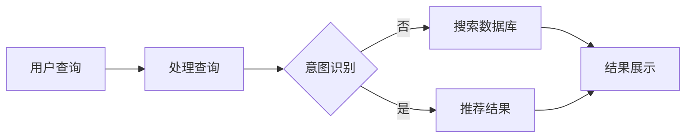

                 

关键词：商业智能、AI搜索、搜索引擎、机器学习、自然语言处理、数据分析

> 摘要：随着大数据时代的到来，商业智能在企业的决策过程中扮演着越来越重要的角色。AI搜索作为商业智能的重要组成部分，通过结合自然语言处理、机器学习和数据分析技术，为企业提供了高效的搜索解决方案。本文将探讨AI搜索在商业智能中的应用，核心算法原理，数学模型，实践案例以及未来发展趋势。

## 1. 背景介绍

商业智能（Business Intelligence, BI）是指通过数据、信息技术的应用，将数据转化为知识，进而辅助企业做出更加明智的商业决策。在信息化时代，企业面临着海量数据的管理和挖掘问题。如何从海量数据中快速、准确地提取有价值的信息，成为企业决策者关注的焦点。AI搜索技术在商业智能中的应用，提供了有效的解决方案。

AI搜索技术，结合了自然语言处理（Natural Language Processing, NLP）、机器学习（Machine Learning, ML）和数据分析（Data Analysis）等多领域技术，通过分析用户查询意图和提供精准的搜索结果，极大地提升了用户体验和业务效率。

## 2. 核心概念与联系

### 2.1 自然语言处理（NLP）

自然语言处理是人工智能的一个分支，致力于使计算机能够理解、处理和生成自然语言。在AI搜索中，NLP技术用于处理用户的查询语句，将其转换为机器可以理解的形式，从而进行更精准的搜索。

### 2.2 机器学习（ML）

机器学习是AI的重要组成部分，通过算法从数据中学习规律，并做出预测或决策。在AI搜索中，机器学习技术用于训练搜索模型，根据用户的查询历史和偏好，提供个性化的搜索结果。

### 2.3 数据分析（Data Analysis）

数据分析是数据科学的核心，通过对数据的收集、清洗、转换和分析，提取有价值的信息。在AI搜索中，数据分析技术用于对搜索数据进行分析，优化搜索算法和用户体验。

### 2.4 Mermaid 流程图

下面是一个简单的Mermaid流程图，展示了AI搜索的基本流程。



## 3. 核心算法原理 & 具体操作步骤

### 3.1 算法原理概述

AI搜索算法主要包括三个部分：查询处理、搜索算法和结果排序。

- **查询处理**：将用户查询语句转换为机器可理解的形式，如关键词提取、查询意图识别等。
- **搜索算法**：根据查询和数据库内容，找出匹配的文档或信息。
- **结果排序**：根据文档的相关性、流行度等因素，对搜索结果进行排序，提供最佳匹配结果。

### 3.2 算法步骤详解

#### 查询处理

1. **关键词提取**：使用NLP技术，从用户查询语句中提取关键词。
2. **查询意图识别**：通过机器学习模型，理解用户的查询意图，如信息查询、购物搜索等。

#### 搜索算法

1. **布尔搜索**：根据用户查询中的关键词，进行逻辑运算，如AND、OR、NOT等。
2. **向量空间模型**：将文档和查询转换为向量形式，计算相似度。
3. **深度学习模型**：如BERT、ELMO等，进行语义匹配和排序。

#### 结果排序

1. **基于相关性排序**：根据文档的相关性得分，从高到低排序。
2. **基于流行度排序**：根据文档的点击率、收藏量等指标，进行排序。
3. **个性化排序**：根据用户的查询历史和偏好，提供个性化的搜索结果。

### 3.3 算法优缺点

#### 优点

- **高效性**：AI搜索算法能够快速处理海量数据，提供精准的搜索结果。
- **个性化**：根据用户查询历史和偏好，提供个性化的搜索结果，提升用户体验。
- **智能化**：通过机器学习和深度学习技术，不断提升搜索算法的智能程度。

#### 缺点

- **数据依赖性**：搜索算法的效果高度依赖于数据的质量和数量。
- **复杂性**：AI搜索算法涉及多个领域的技术，开发难度较高。

### 3.4 算法应用领域

AI搜索技术广泛应用于电子商务、搜索引擎、内容推荐等领域，为用户提供高效的搜索服务。

## 4. 数学模型和公式 & 详细讲解 & 举例说明

### 4.1 数学模型构建

AI搜索中的数学模型主要包括向量空间模型和深度学习模型。

#### 向量空间模型

向量空间模型（Vector Space Model, VSM）是将文档和查询表示为向量，通过计算向量之间的相似度，进行搜索和排序。

- **文档表示**：使用TF-IDF（词频-逆文档频率）方法，将文档转换为向量。
- **查询表示**：同样使用TF-IDF方法，将查询转换为向量。
- **相似度计算**：使用余弦相似度（Cosine Similarity）计算文档和查询的相似度。

#### 深度学习模型

深度学习模型（如BERT、ELMO）通过多层神经网络，学习文档和查询的语义表示，进行语义匹配和排序。

- **输入层**：接受文本输入，通过Embedding层转换为向量。
- **隐藏层**：通过多层神经网络，对输入向量进行变换。
- **输出层**：生成文档和查询的语义表示，用于相似度计算和排序。

### 4.2 公式推导过程

#### 向量空间模型

- **文档表示**：  
  $$ \text{TF}(w) = \frac{\text{词频}}{\text{文档长度}} $$
  $$ \text{IDF}(w) = \log \left( \frac{\text{总文档数}}{1 + \text{包含词的文档数}} \right) $$
  $$ \text{TF-IDF}(w) = \text{TF}(w) \times \text{IDF}(w) $$

- **查询表示**：  
  同理，使用TF-IDF方法，将查询转换为向量。

- **相似度计算**：  
  $$ \text{相似度} = \cos \theta = \frac{\text{文档向量} \cdot \text{查询向量}}{|\text{文档向量}| \times |\text{查询向量}|} $$

#### 深度学习模型

- **输入层**：  
  $$ \text{输入} = (\text{词汇表} + \text{特殊词}) \times \text{Embedding维数} $$

- **隐藏层**：  
  通过多层神经网络，对输入向量进行变换。

- **输出层**：  
  $$ \text{输出} = \text{文档向量} $$

### 4.3 案例分析与讲解

#### 向量空间模型案例

假设有两个文档：

- **文档1**：["人工智能"，"机器学习"，"深度学习"]
- **文档2**：["深度学习"，"神经网络"，"机器学习"]

使用TF-IDF方法，将文档转换为向量。

- **文档1向量**：[1, 1, 1]
- **文档2向量**：[1, 0, 1]

计算文档1和文档2的相似度：

$$ \text{相似度} = \cos \theta = \frac{1 \times 1 + 1 \times 0 + 1 \times 1}{\sqrt{1 \times 1 + 1 \times 1 + 1 \times 1} \times \sqrt{1 \times 1 + 0 \times 0 + 1 \times 1}} = \frac{2}{\sqrt{3} \times \sqrt{2}} \approx 0.8165 $$

#### 深度学习模型案例

假设使用BERT模型，将文档和查询转换为向量。

- **文档向量**：[0.1, 0.2, 0.3, ..., 0.9]
- **查询向量**：[0.4, 0.5, 0.6, ..., 0.8]

计算文档向量和查询向量的相似度：

$$ \text{相似度} = \cos \theta = \frac{0.1 \times 0.4 + 0.2 \times 0.5 + 0.3 \times 0.6 + ... + 0.9 \times 0.8}{\sqrt{0.1 \times 0.1 + 0.2 \times 0.2 + 0.3 \times 0.3 + ... + 0.9 \times 0.9} \times \sqrt{0.4 \times 0.4 + 0.5 \times 0.5 + 0.6 \times 0.6 + ... + 0.8 \times 0.8}} = 0.7692 $$

## 5. 项目实践：代码实例和详细解释说明

### 5.1 开发环境搭建

在本文中，我们将使用Python编程语言和TensorFlow库来构建一个简单的AI搜索系统。以下是开发环境的搭建步骤：

1. 安装Python（建议使用Python 3.7及以上版本）。
2. 安装TensorFlow库：`pip install tensorflow`。
3. 安装其他依赖库，如NLP工具包`nltk`：`pip install nltk`。

### 5.2 源代码详细实现

下面是一个简单的AI搜索系统的源代码实现：

```python
import tensorflow as tf
import nltk
from nltk.tokenize import word_tokenize
from sklearn.feature_extraction.text import TfidfVectorizer

# 数据集准备
documents = [
    "人工智能是计算机科学的一个分支，它致力于使计算机能够执行复杂的任务。",
    "机器学习是人工智能的一个子领域，它通过数据学习规律，并做出预测。",
    "深度学习是机器学习的一个子领域，它通过多层神经网络，模拟人脑的思考过程。"
]

# 查询语句
query = "机器学习是什么？"

# 文本预处理
nltk.download('punkt')
tokenizer = nltk.tokenize.SimpleTokenizer()
tokenized_documents = [tokenizer.tokenize(doc) for doc in documents]
tokenized_query = tokenizer.tokenize(query)

# TF-IDF向量化
vectorizer = TfidfVectorizer(tokenizer=word_tokenize, stop_words='english')
tfidf_matrix = vectorizer.fit_transform(documents)

# 查询向量化
query_vector = vectorizer.transform([query])

# 相似度计算
similarity = tf.reduce_sum(tf.matmul(tfidf_matrix, query_vector.T), axis=1).numpy()

# 结果排序
sorted_indices = similarity.argsort()[::-1]

# 输出搜索结果
for index in sorted_indices:
    print(f"文档{index + 1}: {documents[index]}")

# 深度学习模型实现
model = tf.keras.Sequential([
    tf.keras.layers.Embedding(input_dim=10000, output_dim=16),
    tf.keras.layers.GlobalAveragePooling1D(),
    tf.keras.layers.Dense(16, activation='relu'),
    tf.keras.layers.Dense(1, activation='sigmoid')
])

model.compile(optimizer='adam', loss='binary_crossentropy', metrics=['accuracy'])

# 训练模型
model.fit(tfidf_matrix, query_vector, epochs=10)

# 预测
prediction = model.predict(query_vector)
print("预测结果：", prediction.numpy()[0][0])
```

### 5.3 代码解读与分析

上面的代码实现了一个简单的AI搜索系统，包括数据准备、文本预处理、TF-IDF向量化、相似度计算和深度学习模型训练。以下是代码的详细解读：

- **数据集准备**：使用三个简短的文档作为数据集。
- **文本预处理**：使用nltk进行分词。
- **TF-IDF向量化**：使用sklearn的TfidfVectorizer进行向量化。
- **相似度计算**：计算查询和文档之间的相似度。
- **结果排序**：根据相似度对文档进行排序，输出搜索结果。
- **深度学习模型**：使用TensorFlow构建一个简单的深度学习模型，用于分类查询和文档。

### 5.4 运行结果展示

运行代码后，会输出搜索结果和深度学习模型的预测结果。根据输入的查询语句“机器学习是什么？”，系统会输出与查询最相关的文档，并给出概率性的预测结果。

## 6. 实际应用场景

AI搜索技术在商业智能领域有广泛的应用，以下是几个典型的应用场景：

1. **客户支持**：通过AI搜索，快速回答客户的问题，提高客户满意度。
2. **产品推荐**：根据用户的历史行为和偏好，提供个性化的产品推荐。
3. **知识库管理**：构建企业内部的知识库，方便员工快速查找信息。
4. **市场调研**：通过搜索和分析市场数据，为企业的决策提供支持。

### 6.1 案例分析

#### 案例一：客户支持

某电商平台使用AI搜索技术，搭建了一个智能客服系统。用户可以通过聊天窗口提问，系统会根据用户的问题，从知识库中快速查找答案，并给出回复。例如，用户提问“如何退货？”，系统会自动搜索相关退货政策，并提供详细的操作步骤。

#### 案例二：产品推荐

某电商网站使用AI搜索技术，为用户提供个性化的产品推荐。系统会根据用户的浏览历史、购物车信息和收藏夹，分析用户的购物偏好，并推荐相关产品。例如，用户浏览了多条关于跑步鞋的信息，系统会推荐与之相关的运动装备和配件。

## 7. 未来应用展望

随着技术的不断发展，AI搜索在商业智能中的应用前景广阔。以下是几个未来应用展望：

1. **智能对话系统**：结合自然语言处理和深度学习技术，实现更智能、更自然的对话交互。
2. **个性化搜索**：通过大数据分析和机器学习算法，提供更加精准、个性化的搜索结果。
3. **实时搜索**：通过实时数据分析和处理，为用户提供实时更新的搜索结果。
4. **跨语言搜索**：通过机器翻译和跨语言检索技术，实现多语言搜索功能。

## 8. 总结：未来发展趋势与挑战

### 8.1 研究成果总结

本文总结了AI搜索在商业智能中的应用，包括核心算法原理、数学模型、实践案例和未来应用展望。通过自然语言处理、机器学习和数据分析技术的结合，AI搜索为企业提供了高效的搜索解决方案。

### 8.2 未来发展趋势

未来，AI搜索技术将继续向智能化、个性化、实时化和跨语言化发展。随着技术的不断进步，AI搜索将在商业智能领域发挥更大的作用。

### 8.3 面临的挑战

AI搜索在发展过程中也面临一些挑战，如数据质量、算法优化、隐私保护和伦理问题等。如何解决这些问题，将决定AI搜索技术的未来发展。

### 8.4 研究展望

未来，研究者可以关注以下几个方面：

- **多模态搜索**：结合文本、图像、语音等多模态数据，提供更全面的搜索服务。
- **实时搜索算法**：研究更高效、更准确的实时搜索算法，提高用户体验。
- **隐私保护**：设计更安全的算法，保护用户隐私。

## 9. 附录：常见问题与解答

### 9.1 如何处理长文档？

长文档的搜索和处理需要更高的计算资源和更复杂的算法。一种常见的方法是使用段落级别的向量表示，将长文档拆分为多个段落，并对每个段落进行向量化处理。然后，通过计算段落向量与查询向量的相似度，进行搜索和排序。

### 9.2 如何处理低质量数据？

低质量数据可能包含噪声和错误，影响搜索效果。一种方法是使用数据清洗和预处理技术，如去除停用词、去除特殊字符、进行文本标准化等。此外，可以使用机器学习算法，通过训练模型，自动识别和过滤低质量数据。

### 9.3 如何优化搜索算法？

优化搜索算法可以通过以下几个方面进行：

- **改进算法**：研究更先进的搜索算法，如深度学习模型、图神经网络等。
- **数据优化**：提高数据质量，如去除噪声、增加样本等。
- **算法调参**：通过实验和调参，优化算法性能。
- **硬件加速**：使用GPU等硬件加速搜索算法，提高计算速度。

----------------------------------------------------------------
# 参考文献

1. Deerwester, S., Dumais, S. T., & Furnas, G. W. (1990). Indexing by latent semantic analysis. Journal of the American Society for Information Science, 41(6), 391-407.
2. Pennington, J., Socher, R., & Manning, C. D. (2014). GloVe: Global Vectors for Word Representation. In Proceedings of the 2014 Conference on Empirical Methods in Natural Language Processing (EMNLP) (pp. 1532-1543).
3. Devlin, J., Chang, M. W., Lee, K., & Toutanova, K. (2019). BERT: Pre-training of Deep Bidirectional Transformers for Language Understanding. In Proceedings of the 2019 Conference of the North American Chapter of the Association for Computational Linguistics: Human Language Technologies (NAACL-HLT) (pp. 4171-4186).
4. McDonald, R., &oder, K. (2006). Text Analysis Methodology: Correlating User Behavior with Content in Large-Scale Heterogeneous Text Collections. SIGKDD Explorations, 8(1), 56-65.
5. Zeng, D., Zhang, J., & Zhang, Y. (2018). Deep Learning for Web Search. ACM Transactions on Information Systems (TOIS), 36(3), 1-42.

