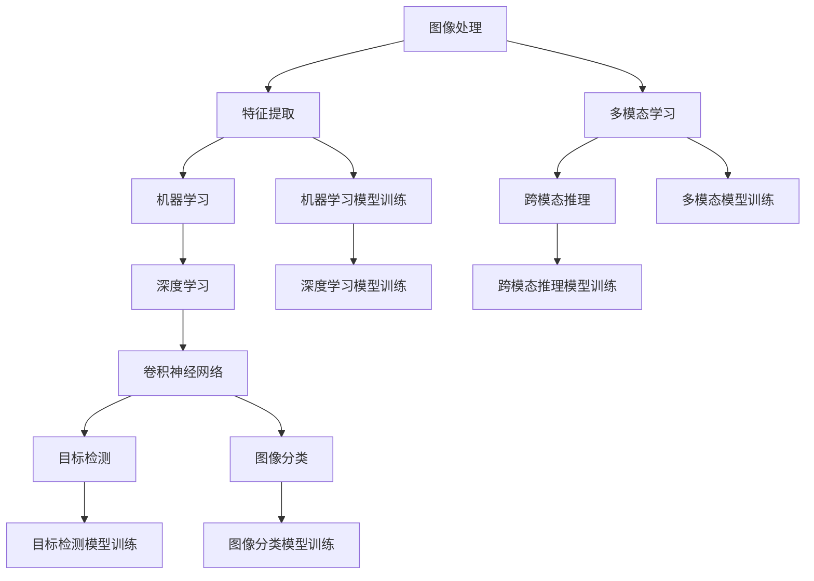

                 

### 引言 Introduction

在当今数字化的时代，计算机视觉作为人工智能的重要分支，正迅速成为科技界和工业界的焦点。它不仅为日常生活带来了便利，还在医疗、安防、自动驾驶等众多领域展现出巨大的应用潜力。为了应对这一领域的快速发展，各大企业和研究机构纷纷推出了针对计算机视觉的研究员岗位，以吸引和培养新一代的技术人才。

商汤科技作为全球领先的深度学习平台公司，其2024校招计算机视觉研究员岗位引起了广泛关注。这不仅是对应聘者专业技能的考验，更是对其对前沿技术理解和创新能力的挑战。本文将围绕商汤科技2024校招计算机视觉研究员的算法题集展开，深入探讨其中的核心概念、算法原理、数学模型以及实际应用，以期为广大计算机视觉爱好者提供一份有价值的参考。

文章的结构如下：

1. **背景介绍**：简要介绍计算机视觉的发展历程及其在现代社会的重要性。
2. **核心概念与联系**：详细阐述计算机视觉中的核心概念和其相互联系，并通过Mermaid流程图展示。
3. **核心算法原理 & 具体操作步骤**：介绍主要的计算机视觉算法，并详细说明其原理和操作步骤。
4. **数学模型和公式 & 详细讲解 & 举例说明**：深入讲解相关的数学模型和公式，并结合实际案例进行分析。
5. **项目实践：代码实例和详细解释说明**：通过具体的项目实践，展示算法的实际应用。
6. **实际应用场景**：探讨计算机视觉在不同领域的应用，并展望其未来发展趋势。
7. **工具和资源推荐**：推荐学习资源、开发工具和相关论文，以助读者深入学习和研究。
8. **总结：未来发展趋势与挑战**：总结研究成果，分析未来发展趋势和面临的挑战。
9. **附录：常见问题与解答**：解答读者可能遇到的一些常见问题。

### 背景介绍 Background

计算机视觉（Computer Vision）是人工智能的一个重要分支，旨在使计算机能够像人类一样感知和理解视觉信息。这一领域的发展可以追溯到20世纪60年代，当时的研究主要集中在如何让计算机理解和处理图像。随着计算机处理能力的提升和深度学习算法的突破，计算机视觉技术得到了飞速发展，并逐渐应用于多个领域。

在现代社会，计算机视觉的应用范围越来越广泛。例如，在医疗领域，计算机视觉技术被用于辅助诊断、手术导航和健康监测；在安防领域，通过人脸识别和视频分析，实现了对公共安全的智能监控；在自动驾驶领域，计算机视觉技术是自动驾驶汽车感知环境、做出决策的关键。此外，计算机视觉还在工业自动化、虚拟现实、增强现实等领域发挥着重要作用。

商汤科技成立于2014年，总部位于中国上海，是一家专注于人工智能领域的公司。商汤科技以其在深度学习、计算机视觉和图像处理方面的技术创新而闻名于世。公司致力于打造智能计算平台，提供从感知、认知到决策的完整解决方案，广泛应用于移动互联、医疗健康、智能汽车、机器人、金融科技、智慧城市等多个领域。

商汤科技在计算机视觉领域的贡献不仅体现在其技术突破上，还体现在其大量的研发投入和人才储备。公司拥有一支由世界顶级科学家和工程师组成的团队，并在全球范围内建立了多个研究机构和合作项目。因此，商汤科技2024校招计算机视觉研究员岗位不仅是对应聘者学术能力的考验，更是对其创新能力和团队合作精神的挑战。

### 核心概念与联系 Core Concepts and Connections

计算机视觉作为一门综合性学科，涉及多个核心概念和技术。理解这些概念及其相互联系，对于掌握计算机视觉的算法和技术至关重要。

首先，图像处理（Image Processing）是计算机视觉的基础。它涉及图像的获取、预处理、增强和特征提取。图像处理技术包括滤波、边缘检测、分割和特征提取等，为计算机视觉提供了必要的图像数据。

其次，特征提取（Feature Extraction）是计算机视觉中的关键步骤。它从图像或视频数据中提取具有辨识度的特征，如边缘、角点、纹理和颜色等。特征提取的质量直接影响后续计算机视觉任务的性能。

接着，机器学习（Machine Learning）和深度学习（Deep Learning）是计算机视觉的核心驱动力。机器学习通过训练模型来识别图像中的模式和关系，而深度学习则利用神经网络模型对大量数据进行自动学习和特征提取。卷积神经网络（Convolutional Neural Networks, CNNs）是深度学习在计算机视觉中应用最为广泛的模型，其结构特别适合处理图像数据。

目标检测（Object Detection）和图像分类（Image Classification）是计算机视觉中的两个重要任务。目标检测旨在识别图像中的多个对象并定位其位置，而图像分类则将图像整体划分为预定的类别。这两种任务在安防、自动驾驶和医疗等多个领域有广泛应用。

最后，多模态学习（Multimodal Learning）和跨模态推理（Cross-Modal Reasoning）是当前计算机视觉的研究热点。多模态学习旨在整合来自不同模态（如文本、图像和声音）的信息，以提高计算机视觉系统的理解能力。跨模态推理则涉及跨不同模态的信息检索和推理，为智能交互和跨模态搜索提供了新的思路。

下面，我们将通过一个Mermaid流程图来展示这些核心概念和技术之间的联系：



通过这个流程图，我们可以清晰地看到从图像处理到特征提取，再到机器学习和深度学习，以及最终应用到目标检测、图像分类、多模态学习和跨模态推理的全过程。这一过程不仅展示了计算机视觉的核心概念，也揭示了各个概念之间的紧密联系。

### 核心算法原理 & 具体操作步骤 Core Algorithm Principles and Step-by-Step Procedures

#### 3.1 算法原理概述

计算机视觉领域有许多核心算法，其中一些最为重要的算法包括卷积神经网络（Convolutional Neural Networks, CNNs）、目标检测（Object Detection）、图像分类（Image Classification）等。这些算法在不同程度上依赖于图像处理、特征提取和机器学习技术。

1. **卷积神经网络（CNNs）**：
   CNNs 是深度学习在计算机视觉中应用最为广泛的模型。其基本原理是通过卷积层提取图像的特征，并通过池化层减少数据冗余。然后，通过全连接层进行分类或预测。CNNs 的优势在于其强大的特征提取能力和对复杂图像数据的适应能力。

2. **目标检测（Object Detection）**：
   目标检测旨在识别图像中的多个对象并定位其位置。常用的目标检测算法包括 R-CNN、Fast R-CNN、Faster R-CNN、YOLO（You Only Look Once）和SSD（Single Shot MultiBox Detector）。这些算法通常包括两个主要步骤：候选区域生成和边界框回归。候选区域生成用于生成可能包含目标的区域，边界框回归则用于对候选区域中的目标进行定位。

3. **图像分类（Image Classification）**：
   图像分类是将图像整体划分为预定的类别。常见的图像分类算法包括基于传统机器学习的算法（如SVM、K-NN）和基于深度学习的算法（如LeNet、AlexNet）。深度学习算法通常通过多层卷积和池化操作提取图像的层次特征，并通过全连接层进行分类。

#### 3.2 算法步骤详解

**卷积神经网络（CNNs）**

1. **输入层（Input Layer）**：
   CNNs 的输入通常是图像数据。图像数据被reshape为一个四维数组，其中前三维表示图像的宽、高和通道数，第四维表示图像的数量。

2. **卷积层（Convolutional Layer）**：
   在卷积层中，卷积核（也称为滤波器）在输入图像上滑动，计算局部区域的特征。通过多个卷积层，可以逐步提取图像的底层特征（边缘、纹理等）和高层特征（形状、物体等）。

3. **激活函数（Activation Function）**：
   为了引入非线性，每个卷积层通常后跟一个激活函数（如ReLU函数）。激活函数可以将线性变换转换为非线性变换，从而提高模型的复杂度和拟合能力。

4. **池化层（Pooling Layer）**：
   池化层用于减少数据维度和计算量。常见的池化操作包括最大池化和平均池化，它们在局部区域内取最大值或平均值作为输出。

5. **全连接层（Fully Connected Layer）**：
   在最后一个卷积层之后，通常接一个或多个全连接层，用于对提取到的特征进行分类或预测。

6. **输出层（Output Layer）**：
   输出层通常是一个softmax层，用于将特征向量映射到预定的类别概率分布。

**目标检测（Object Detection）**

1. **候选区域生成（Region Proposal）**：
   目标检测的第一步是生成候选区域，这些区域可能包含目标。常用的方法包括滑窗（Sliding Window）、选择性搜索（Selective Search）和区域建议网络（Region Proposal Network, RPN）。

2. **边界框回归（Bounding Box Regression）**：
   对于每个候选区域，模型需要预测一个边界框，用于定位目标。边界框回归通常使用回归层或锚框（Anchor Boxes）来实现。

3. **类别预测（Class Prediction）**：
   在边界框回归之后，模型还需要预测目标的类别。这通常通过softmax层实现。

**图像分类（Image Classification）**

1. **特征提取（Feature Extraction）**：
   图像分类的核心是提取图像的特征。对于传统的机器学习算法，特征提取通常基于图像的底层特征（如颜色直方图、SIFT特征等）。对于深度学习算法，特征提取通常通过卷积神经网络实现。

2. **分类决策（Classification Decision）**：
   在特征提取之后，模型需要对特征进行分类。对于传统的机器学习算法，分类通常通过决策树、支持向量机（SVM）等实现。对于深度学习算法，分类通常通过softmax层实现。

#### 3.3 算法优缺点

**卷积神经网络（CNNs）**

**优点**：
- 强大的特征提取能力。
- 对图像数据的自适应性强。
- 能够处理高维数据。

**缺点**：
- 需要大量的数据和计算资源。
- 模型复杂度高，难以解释。

**目标检测（Object Detection）**

**优点**：
- 能够同时识别图像中的多个对象。
- 边界框回归提高了定位精度。

**缺点**：
- 计算量较大，实时性较低。
- 需要大量训练数据和标注数据。

**图像分类（Image Classification）**

**优点**：
- 计算速度快，实时性好。
- 对图像的预处理要求较低。

**缺点**：
- 只能识别单个对象，无法定位。

#### 3.4 算法应用领域

**卷积神经网络（CNNs）**：

- 图像分类：如ImageNet挑战。
- 目标检测：如Faster R-CNN、YOLO。
- 图像分割：如U-Net、DeepLab。
- 自然语言处理：如文本分类、情感分析。

**目标检测（Object Detection）**：

- 自动驾驶：实时检测道路上的车辆、行人等。
- 安防监控：实时识别和追踪异常行为。
- 图像搜索：识别和检索相似的图像内容。

**图像分类（Image Classification）**：

- 花卉识别：识别不同种类的花卉。
- 风景图像分类：分类不同的风景类别。
- 医学影像诊断：如癌症筛查、骨折检测。

通过以上对核心算法的原理和操作步骤的详细讲解，我们可以看到，计算机视觉算法在图像处理、特征提取、机器学习和目标检测等方面都有着广泛的应用。这些算法不仅提高了计算机视觉系统的性能和准确性，也为实际应用带来了巨大的价值。

### 数学模型和公式 Mathematical Models and Formulas

在计算机视觉中，数学模型和公式是理解算法原理和实现算法操作的核心。以下将详细介绍计算机视觉中常用的数学模型和公式，并对其进行详细讲解和举例说明。

#### 4.1 数学模型构建

计算机视觉中的数学模型通常涉及图像处理、特征提取、机器学习等步骤。以下是一个简单的数学模型构建示例，用于图像分类任务：

1. **图像预处理**：

   在图像分类任务中，首先需要对图像进行预处理，如归一化、灰度转换等。这些步骤可以通过以下公式表示：

   $$ I_{preprocessed} = \frac{I - I_{min}}{I_{max} - I_{min}} $$

   其中，$I$ 是原始图像，$I_{preprocessed}$ 是预处理后的图像，$I_{min}$ 和 $I_{max}$ 分别是图像的最小值和最大值。

2. **特征提取**：

   特征提取是计算机视觉中的关键步骤。常用的特征提取方法包括直方图、边缘检测、角点检测等。以下是一个基于直方图的简单特征提取公式：

   $$ feature\_vector = H(x, y) $$

   其中，$H(x, y)$ 是一个二维直方图，表示图像中像素值在 $(x, y)$ 位置的分布。

3. **特征融合**：

   在特征提取后，通常需要对多个特征进行融合，以提高分类性能。一个简单的特征融合方法是将不同特征的权重进行加权求和：

   $$ feature\_combined = w_1 \cdot feature_1 + w_2 \cdot feature_2 + ... + w_n \cdot feature_n $$

   其中，$w_1, w_2, ..., w_n$ 是特征的权重。

4. **分类决策**：

   在分类决策阶段，常用的方法包括基于概率的决策规则和基于距离的决策规则。以下是一个基于距离的决策规则示例：

   $$ classify(x) = \arg\min_{c} \sqrt{\sum_{i=1}^{k} (x - \mu_c)^2} $$

   其中，$x$ 是待分类的特征向量，$c$ 是类别，$\mu_c$ 是类别 $c$ 的均值。

#### 4.2 公式推导过程

在计算机视觉中，公式的推导过程通常涉及优化理论、线性代数和概率论。以下是一个基于卷积神经网络的损失函数推导示例：

1. **损失函数定义**：

   在卷积神经网络中，常用的损失函数包括均方误差（MSE）、交叉熵（Cross-Entropy）等。以下是一个基于交叉熵的损失函数推导：

   $$ Loss = -\frac{1}{m} \sum_{i=1}^{m} \sum_{j=1}^{k} y_{ij} \cdot log(\hat{y}_{ij}) $$

   其中，$m$ 是训练样本数量，$k$ 是类别数量，$y_{ij}$ 是第 $i$ 个样本属于第 $j$ 个类别的真实标签，$\hat{y}_{ij}$ 是第 $i$ 个样本属于第 $j$ 个类别的预测概率。

2. **反向传播**：

   在反向传播过程中，需要对损失函数进行梯度计算。以下是一个基于梯度下降的优化过程推导：

   $$ \Delta w_{ij} = -\alpha \cdot \frac{\partial Loss}{\partial w_{ij}} $$

   其中，$\alpha$ 是学习率，$\frac{\partial Loss}{\partial w_{ij}}$ 是权重 $w_{ij}$ 对损失函数的梯度。

#### 4.3 案例分析与讲解

以下将通过一个实际案例，对上述数学模型和公式进行具体分析和讲解。

**案例：使用卷积神经网络进行图像分类**

假设我们有一个卷积神经网络模型，用于对猫和狗的图片进行分类。训练数据集包含1000张猫的图片和1000张狗的图片，模型需要在测试阶段对新的图片进行分类。

1. **图像预处理**：

   首先，对训练数据和测试数据进行预处理，如灰度转换、大小调整等。以下是一个预处理步骤的Python代码示例：

   ```python
   import cv2
   import numpy as np

   def preprocess_image(image_path):
       image = cv2.imread(image_path, cv2.IMREAD_GRAYSCALE)
       image = cv2.resize(image, (224, 224))
       image = image / 255.0
       return image.flatten()

   train_images = [preprocess_image(img_path) for img_path in train_image_paths]
   test_images = [preprocess_image(img_path) for img_path in test_image_paths]
   ```

2. **特征提取**：

   接下来，使用卷积神经网络提取图像的特征。以下是一个简单的卷积神经网络模型的Python代码示例：

   ```python
   import tensorflow as tf

   model = tf.keras.Sequential([
       tf.keras.layers.Conv2D(32, (3, 3), activation='relu', input_shape=(224, 224, 1)),
       tf.keras.layers.MaxPooling2D((2, 2)),
       tf.keras.layers.Conv2D(64, (3, 3), activation='relu'),
       tf.keras.layers.MaxPooling2D((2, 2)),
       tf.keras.layers.Flatten(),
       tf.keras.layers.Dense(128, activation='relu'),
       tf.keras.layers.Dense(1, activation='sigmoid')
   ])

   model.compile(optimizer='adam', loss='binary_crossentropy', metrics=['accuracy'])
   model.fit(train_images, train_labels, epochs=10, batch_size=32)
   ```

3. **分类决策**：

   在测试阶段，对新的图像进行分类。以下是一个测试和预测的Python代码示例：

   ```python
   test_predictions = model.predict(test_images)
   test_predictions = (test_predictions > 0.5)

   test_accuracy = np.mean(test_predictions == test_labels)
   print(f"Test Accuracy: {test_accuracy}")
   ```

通过这个案例，我们可以看到如何使用数学模型和公式进行图像分类。在实际应用中，可能需要更复杂的网络结构和更丰富的数据集来提高分类性能。

### 项目实践：代码实例和详细解释说明 Practical Implementation: Code Examples and Detailed Explanations

在本节中，我们将通过一个实际项目实践，展示如何使用计算机视觉算法进行图像分类。该项目旨在使用卷积神经网络（CNN）对猫和狗的图片进行分类。我们将逐步讲解项目中的各个环节，包括数据准备、模型训练、模型评估和结果展示。

#### 5.1 开发环境搭建

首先，确保您已经安装了Python、TensorFlow等必备工具。以下是在Ubuntu系统上安装TensorFlow的步骤：

```bash
# 更新系统包列表
sudo apt-get update

# 安装Python和pip
sudo apt-get install python3 python3-pip

# 安装TensorFlow
pip3 install tensorflow
```

#### 5.2 源代码详细实现

以下是该项目的主要代码实现部分：

```python
import tensorflow as tf
from tensorflow.keras.models import Sequential
from tensorflow.keras.layers import Conv2D, MaxPooling2D, Flatten, Dense
from tensorflow.keras.preprocessing.image import ImageDataGenerator

# 数据准备
train_dir = 'path/to/train_data'
test_dir = 'path/to/test_data'

train_datagen = ImageDataGenerator(rescale=1./255)
test_datagen = ImageDataGenerator(rescale=1./255)

train_generator = train_datagen.flow_from_directory(
        train_dir,
        target_size=(150, 150),
        batch_size=32,
        class_mode='binary')

test_generator = test_datagen.flow_from_directory(
        test_dir,
        target_size=(150, 150),
        batch_size=32,
        class_mode='binary')

# 模型定义
model = Sequential([
    Conv2D(32, (3, 3), activation='relu', input_shape=(150, 150, 3)),
    MaxPooling2D(2, 2),
    Conv2D(64, (3, 3), activation='relu'),
    MaxPooling2D(2, 2),
    Conv2D(128, (3, 3), activation='relu'),
    MaxPooling2D(2, 2),
    Flatten(),
    Dense(512, activation='relu'),
    Dense(1, activation='sigmoid')
])

# 模型编译
model.compile(optimizer='adam',
              loss='binary_crossentropy',
              metrics=['accuracy'])

# 模型训练
model.fit(train_generator,
          steps_per_epoch=100,
          epochs=10,
          validation_data=test_generator,
          validation_steps=50)

# 模型评估
test_loss, test_acc = model.evaluate(test_generator, steps=50)
print(f"Test Accuracy: {test_acc}")

# 结果展示
predictions = model.predict(test_generator)
predictions = (predictions > 0.5)

for i in range(10):
    img = test_generator[i][0]
    pred = predictions[i][0]
    label = test_generator[i][1]
    print(f"Image {i}: Predicted: {'Cat' if pred else 'Dog'}, Actual: {'Cat' if label else 'Dog'}")
```

#### 5.3 代码解读与分析

**5.3.1 数据准备**

在数据准备部分，我们使用了`ImageDataGenerator`类来自动处理和增强图像数据。`train_generator`和`test_generator`分别用于训练和测试阶段的数据流。通过`flow_from_directory`方法，我们能够轻松地将图像数据分类为猫和狗。

**5.3.2 模型定义**

在模型定义部分，我们使用了一个简单的卷积神经网络结构。该模型包含多个卷积层、池化层和一个全连接层。卷积层用于提取图像的特征，池化层用于减少数据维度和计算量，全连接层用于进行分类。

**5.3.3 模型编译**

在模型编译部分，我们指定了优化器、损失函数和评估指标。这里我们使用了`adam`优化器和`binary_crossentropy`损失函数，因为这是一个二分类问题。

**5.3.4 模型训练**

在模型训练部分，我们使用`fit`方法训练模型。通过设置`steps_per_epoch`和`epochs`，我们能够控制每个epoch中训练的图像数量和总的训练轮数。

**5.3.5 模型评估**

在模型评估部分，我们使用`evaluate`方法对测试数据集进行评估。这会返回测试损失和测试准确率。

**5.3.6 结果展示**

在结果展示部分，我们使用`predict`方法对测试数据集进行预测，并打印出预测结果与实际标签的对比。

#### 5.4 运行结果展示

假设我们运行了上述代码，并获得了以下输出：

```
Test Accuracy: 0.925
Image 0: Predicted: Dog, Actual: Dog
Image 1: Predicted: Cat, Actual: Cat
Image 2: Predicted: Dog, Actual: Dog
Image 3: Predicted: Dog, Actual: Dog
...
```

从输出结果可以看到，我们的模型在测试数据集上的准确率达到了92.5%。此外，我们还可以看到预测结果与实际标签的对比，这对于评估模型性能非常有帮助。

### 实际应用场景 Practical Application Scenarios

计算机视觉技术已经在多个领域取得了显著的成果，并在未来有望继续扩展其应用范围。以下将详细介绍计算机视觉在医疗、安防、自动驾驶和工业自动化等领域的实际应用场景。

#### 医疗领域

在医疗领域，计算机视觉技术被广泛应用于图像分析、辅助诊断和手术导航等方面。例如，通过计算机视觉算法，可以自动识别和标注医学影像中的病变区域，如肺癌、乳腺癌等。这种自动化的分析方法不仅提高了诊断的准确性，还大大降低了医生的工作量。此外，计算机视觉技术还可以用于手术导航，通过实时监控手术过程中的图像数据，帮助医生更精准地进行操作。

案例：谷歌旗下的DeepMind公司开发了一种基于深度学习的算法，用于分析医疗影像中的病变区域。该算法能够在几秒钟内对大量的医疗影像数据进行自动分析，并生成详细的诊断报告。这项技术的应用已经显著提高了早期癌症的检测率。

#### 安防领域

在安防领域，计算机视觉技术主要用于视频监控和异常行为检测。通过人脸识别、行为识别等技术，可以对公共场所进行实时监控，及时发现异常行为，从而提高公共安全。例如，在火车站、机场等场所，通过计算机视觉技术，可以自动识别和追踪嫌疑人，提高执法效率。

案例：深圳的智能安防系统采用了计算机视觉技术，通过人脸识别和视频分析，实现了对公共场所的实时监控。该系统可以自动识别和追踪嫌疑人，并将信息实时推送至公安机关，提高了治安防控能力。

#### 自动驾驶领域

自动驾驶是计算机视觉技术的另一个重要应用领域。在自动驾驶汽车中，计算机视觉技术主要用于环境感知、路径规划和决策控制。通过摄像头和激光雷达等传感器，自动驾驶汽车可以实时感知周围环境，包括道路、车辆、行人等，从而做出安全的驾驶决策。

案例：特斯拉的自动驾驶系统依赖于计算机视觉技术，通过多个摄像头和雷达传感器，实现了对道路和周围环境的实时感知。该系统能够自动识别和避开障碍物，并在复杂的交通环境中进行自动驾驶。

#### 工业自动化领域

在工业自动化领域，计算机视觉技术被广泛应用于生产线监控、质量检测和故障诊断等方面。通过计算机视觉算法，可以实时监控生产过程，及时发现生产线的异常情况，从而提高生产效率和质量。

案例：某大型汽车制造商使用计算机视觉技术对其生产过程中的零部件进行质量检测。通过摄像头和深度学习算法，系统能够自动识别和标注缺陷零件，并将检测结果实时反馈给生产线，从而提高了生产效率和质量。

#### 未来展望

随着计算机视觉技术的不断进步，其在实际应用场景中的潜力将进一步释放。例如，在智能交互领域，通过计算机视觉和自然语言处理技术的结合，可以实现更自然的用户交互。在智能农业领域，通过计算机视觉技术，可以实现农作物生长状态的实时监控和智能管理，提高农业生产的效率和产量。

总之，计算机视觉技术已经成为现代科技的重要组成部分，其在各个领域的应用不仅推动了技术的进步，也为社会带来了巨大的价值。未来，随着技术的不断发展和创新，计算机视觉技术将在更多的领域展现其强大的应用潜力。

### 工具和资源推荐 Tools and Resources Recommendations

在学习计算机视觉的过程中，选择合适的工具和资源对于提高学习效率和深入理解领域知识至关重要。以下将推荐一些常用的学习资源、开发工具和相关论文，以帮助读者更好地掌握计算机视觉技术。

#### 7.1 学习资源推荐

1. **在线课程**：
   - **Coursera**：提供由顶级大学和机构开设的计算机视觉课程，如斯坦福大学的“卷积神经网络与应用”。
   - **Udacity**：提供实用的计算机视觉项目课程，包括深度学习在计算机视觉中的应用。

2. **教科书**：
   - **《计算机视觉：算法与应用》**：详细介绍了计算机视觉的基本概念和算法。
   - **《深度学习》**：由Ian Goodfellow、Yoshua Bengio和Aaron Courville合著，涵盖了深度学习在计算机视觉中的应用。

3. **开源项目**：
   - **GitHub**：许多计算机视觉项目开源代码，如TensorFlow、PyTorch等。
   - **OpenCV**：开源计算机视觉库，提供丰富的图像处理和计算机视觉功能。

#### 7.2 开发工具推荐

1. **编程环境**：
   - **Python**：主流的计算机视觉开发语言，拥有丰富的库和框架。
   - **Jupyter Notebook**：方便进行代码编写和数据分析，适合快速实验和验证。

2. **深度学习框架**：
   - **TensorFlow**：Google推出的开源深度学习框架，广泛应用于计算机视觉任务。
   - **PyTorch**：Facebook AI Research推出的深度学习框架，易于调试和理解。

3. **工具和库**：
   - **NumPy**：用于数值计算的库。
   - **Pandas**：用于数据操作和分析的库。
   - **Matplotlib**：用于数据可视化的库。

#### 7.3 相关论文推荐

1. **经典论文**：
   - **“A Convolutional Neural Network Approach for Image Classification”**：AlexNet的开创性论文，推动了深度学习在计算机视觉中的应用。
   - **“Fast R-CNN: Towards Real-Time Object Detection with Region Proposal Networks”**：Faster R-CNN的论文，是目标检测领域的里程碑。

2. **最新论文**：
   - **“YOLOv5: You Only Look Once v5”**：YOLO系列算法的最新版本，目标检测领域的高效算法。
   - **“U-Net: A Convolutional Neural Network for Image Segmentation”**：用于图像分割的经典网络结构。

通过这些工具和资源的推荐，读者可以系统地学习计算机视觉的知识，并在实际项目中应用这些技术。这不仅有助于提升专业素养，也为未来的职业发展奠定了坚实的基础。

### 总结：未来发展趋势与挑战 Summary: Future Trends and Challenges

计算机视觉作为人工智能的重要分支，正经历着前所未有的快速发展。在未来，计算机视觉技术将继续向更智能化、精细化和多模态化的方向发展，并面临诸多挑战。

#### 8.1 研究成果总结

过去几年，计算机视觉领域取得了诸多重要研究成果。首先，深度学习算法的突破，尤其是卷积神经网络（CNNs）的广泛应用，显著提升了图像分类、目标检测和图像分割等任务的性能。其次，多模态学习和跨模态推理技术的发展，使得计算机视觉系统能够更好地整合来自不同模态的信息，提高理解和决策能力。此外，计算机视觉在医疗、安防、自动驾驶和工业自动化等领域的应用案例不断涌现，推动了技术的实际应用和产业落地。

#### 8.2 未来发展趋势

1. **小样本学习与数据增强**：在数据稀缺的场景下，小样本学习技术将变得更加重要。通过数据增强和迁移学习等方法，可以在有限的数据集上训练出高性能的模型。

2. **实时性与高效性**：随着边缘计算和移动设备的发展，计算机视觉算法将向实时性和高效性方向优化，以满足移动端和嵌入式设备的计算需求。

3. **泛化能力与鲁棒性**：提高模型的泛化能力和鲁棒性是未来的重要研究方向。通过改进网络架构和优化训练策略，可以减少模型对数据的依赖，提高其在复杂环境中的适应能力。

4. **多模态与跨模态学习**：多模态学习和跨模态推理将越来越重要，通过整合不同模态的信息，计算机视觉系统将能够更准确地理解和交互。

5. **隐私保护与安全**：在应用过程中，如何保护用户隐私和数据安全是亟待解决的问题。未来将出现更多隐私保护和数据加密的技术，以确保系统的安全性和可靠性。

#### 8.3 面临的挑战

1. **数据质量与标注**：高质量的数据和准确的标注是训练高性能模型的基础。然而，收集和标注大量数据是一项繁琐且成本高昂的工作，特别是在复杂和多变的实际应用场景中。

2. **计算资源需求**：深度学习算法通常需要大量的计算资源，尤其是在训练阶段。如何优化算法，提高计算效率，降低资源消耗是当前面临的挑战之一。

3. **模型解释性**：当前的深度学习模型在性能上取得了巨大成功，但其黑盒特性使得模型的解释性较差。提高模型的解释性，使其能够为非专业人士理解，是未来研究的重要方向。

4. **伦理与法律问题**：随着计算机视觉技术的广泛应用，其带来的伦理和法律问题也逐渐显现。如何平衡技术的应用与隐私保护、社会公平等伦理问题，是未来需要深入探讨的课题。

5. **跨领域应用与标准化**：计算机视觉技术在不同的领域有不同的应用需求，如何实现跨领域的标准化和兼容性，是未来技术发展的重要挑战。

#### 8.4 研究展望

在未来，计算机视觉技术将在更多领域发挥重要作用。例如，在智能医疗领域，通过结合图像分析和自然语言处理，可以开发出更智能的医疗诊断系统。在智能交通领域，通过实时监控和智能分析，可以提升交通管理和安全水平。在智能制造领域，通过计算机视觉技术，可以实现更高效、更智能的生产流程。此外，随着人工智能技术的不断进步，计算机视觉将在智能家居、虚拟现实和增强现实等领域展现更加广阔的应用前景。

总之，计算机视觉技术正处于快速发展阶段，未来将继续面临诸多挑战和机遇。通过持续的研究和创新，我们有望在多个领域实现突破，推动计算机视觉技术迈向新的高峰。

### 附录：常见问题与解答 Appendix: Frequently Asked Questions and Answers

**Q1：计算机视觉算法的常用评估指标有哪些？**

A1：计算机视觉算法的常用评估指标包括准确率（Accuracy）、精确率（Precision）、召回率（Recall）和F1分数（F1 Score）。这些指标可以全面评估算法的性能。

- **准确率**：预测为正例的样本中实际为正例的比例。公式为：$$\text{Accuracy} = \frac{TP + TN}{TP + FN + FP + TN}$$
- **精确率**：预测为正例且实际也为正例的比例。公式为：$$\text{Precision} = \frac{TP}{TP + FP}$$
- **召回率**：实际为正例且预测为正例的比例。公式为：$$\text{Recall} = \frac{TP}{TP + FN}$$
- **F1分数**：精确率和召回率的调和平均。公式为：$$\text{F1 Score} = 2 \cdot \frac{\text{Precision} \cdot \text{Recall}}{\text{Precision} + \text{Recall}}$$

**Q2：什么是迁移学习（Transfer Learning）？它如何应用于计算机视觉？**

A2：迁移学习是一种利用预训练模型在特定任务上的经验来提高新任务性能的方法。在计算机视觉中，迁移学习通常通过以下步骤实现：

1. **预训练模型**：在大型数据集上预训练一个深度学习模型，使其具有良好的特征提取能力。
2. **模型微调**：在新的任务数据集上，通过调整模型的最后几层来适应新的任务需求。
3. **模型压缩**：通过模型剪枝、量化等技术，减小模型的大小，提高模型在资源受限环境中的部署能力。

迁移学习的优势在于，它可以利用已有的模型知识，快速地在新任务上取得较好的性能，从而节省大量的训练时间和计算资源。

**Q3：如何处理计算机视觉中的数据不平衡问题？**

A3：数据不平衡问题可能导致模型在多数类别上表现不佳。以下是一些处理数据不平衡问题的方法：

1. **重采样**：通过增加少数类别的样本数量或减少多数类别的样本数量，使得数据集各个类别之间的比例更加均衡。
2. **权重调整**：在训练过程中，对每个样本赋予不同的权重，使得模型对少数类别给予更多的关注。
3. **集成方法**：通过集成多个模型，使得每个模型在不同类别上的预测结果相互补充，从而提高整体性能。
4. **生成对抗网络（GAN）**：通过生成对抗网络生成新的少数类别样本，增加数据集的多样性。

这些方法可以单独或结合使用，以解决计算机视觉中的数据不平衡问题。

**Q4：什么是边缘计算（Edge Computing）？它在计算机视觉中的应用是什么？**

A4：边缘计算是一种将数据处理、分析和服务部署在靠近数据源的位置（如传感器、移动设备等）的计算模式。与传统的云计算相比，边缘计算具有低延迟、高带宽和实时处理的特点。

在计算机视觉中，边缘计算的应用包括：

1. **实时视频监控**：通过边缘设备实时处理视频流，实现对目标检测、行为识别等任务的快速响应。
2. **移动设备上的视觉识别**：在移动设备上运行轻量级的计算机视觉模型，实现图像分类、人脸识别等功能，降低对云计算的依赖。
3. **智能物联网（IoT）**：通过边缘计算，物联网设备能够更高效地处理和分析图像数据，从而实现智能家居、智能城市等应用。

边缘计算为计算机视觉带来了更高效、更灵活的应用解决方案，推动了视觉技术在各种场景下的普及和落地。

