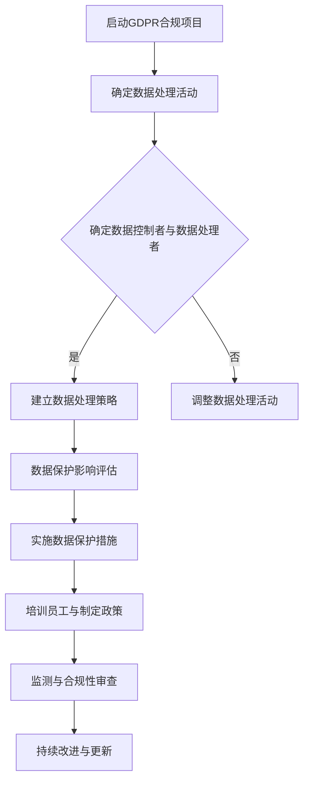

                 

关键词：数据隐私，GDPR，国际化，数据保护，合规性，信息安全

> 摘要：本文旨在探讨国际化背景下数据隐私与保护的重要性，以欧盟的《通用数据保护条例》（GDPR）为例，深入分析其核心概念、实施步骤及其在各国的影响。通过本文，读者将全面了解数据隐私保护的理论基础和实践应用，并对其未来发展有更为深刻的认识。

## 1. 背景介绍

在信息化和全球化的今天，数据已经成为企业和社会的重要组成部分。然而，随着数据的快速增长和广泛应用，数据隐私问题也日益凸显。个人数据一旦泄露，不仅可能导致个人隐私受损，还可能引发经济损失和社会问题。因此，保护数据隐私已成为各国政府和企业的共同挑战。

### 1.1 GDPR 的出台背景

2018年5月25日，欧盟正式实施了《通用数据保护条例》（General Data Protection Regulation，GDPR）。GDPR的出台旨在强化个人数据保护，填补欧盟数据保护法律的空白，确保个人数据在欧洲范围内的合法、安全流动。GDPR的出台源于欧盟对数据隐私问题的高度重视，以及对全球数据保护趋势的积极响应。

### 1.2 GDPR 的核心目标

GDPR的核心目标是确保个人数据受到充分的保护，主要包括以下几个方面：

- 强化个人数据权利：GDPR赋予个人更多的控制权，包括知情权、访问权、更正权、删除权等。
- 规范数据处理行为：GDPR对数据处理者的责任和义务进行了详细规定，要求其采取必要措施保护个人数据。
- 强化数据保护监管：GDPR设立了严格的罚款机制，对违反规定的数据处理者进行处罚。

## 2. 核心概念与联系

为了更好地理解 GDPR，我们需要了解以下几个核心概念：

### 2.1 个人数据

个人数据是指与一个身份已知的或可识别的自然人相关的任何信息。这些信息可以是直接的（如姓名、身份证号码）或间接的（如IP地址、生物特征数据等）。

### 2.2 数据处理

数据处理是指对个人数据的收集、记录、组织、存储、改编、检索、使用、披露、传播、删除等操作。

### 2.3 数据控制者与数据处理者

数据控制者是决定个人数据处理目的和方式的组织或个人。数据处理者是按照数据控制者的指示处理个人数据的组织或个人。

### 2.4 数据泄露

数据泄露是指个人数据未经授权的访问、披露或丢失，可能导致个人隐私受损。

### 2.5 Mermaid 流程图

以下是一个简化的 GDPR 实施流程图：



## 3. 核心算法原理 & 具体操作步骤

### 3.1 算法原理概述

GDPR 的核心原理在于对个人数据的保护，包括以下几个方面：

- 明示同意：数据处理前必须获得个人明确、积极的同意。
- 数据最小化：仅收集为实现数据处理目的所必需的数据。
- 数据完整性：确保收集的数据准确、完整、最新。
- 数据匿名化：对敏感数据采取匿名化处理，以减少隐私风险。
- 数据安全：采取适当的技术和管理措施，确保数据安全。

### 3.2 算法步骤详解

#### 3.2.1 确定数据处理活动

- 识别数据收集、存储、处理、传输和删除等活动。
- 分析每个活动的数据类型、数据量和数据处理方式。

#### 3.2.2 确定数据控制者与数据处理者

- 识别数据控制者，即决定数据处理目的和方式的组织或个人。
- 识别数据处理者，即按照数据控制者的指示处理个人数据的组织或个人。

#### 3.2.3 建立数据处理策略

- 制定数据处理政策和程序。
- 确定数据处理的目的和范围。
- 规定数据处理者的责任和义务。

#### 3.2.4 数据保护影响评估

- 对数据处理活动进行风险评估。
- 确定潜在的数据泄露风险。
- 制定减轻风险的措施。

#### 3.2.5 实施数据保护措施

- 采用加密、访问控制、匿名化等技术手段。
- 制定数据泄露应急预案。

#### 3.2.6 培训员工与制定政策

- 对员工进行数据保护培训。
- 制定内部数据保护政策。

#### 3.2.7 监测与合规性审查

- 定期监测数据处理活动是否符合 GDPR。
- 对违反 GDPR 的行为进行处罚。

### 3.3 算法优缺点

#### 3.3.1 优点

- 强化个人数据权利，提高数据保护水平。
- 规范数据处理行为，降低数据泄露风险。
- 促进数据跨境流动，提高全球数据保护标准。

#### 3.3.2 缺点

- 对企业合规成本较高，可能导致合规成本上升。
- 对中小企业可能带来更大的合规压力。
- 可能对数据自由流动产生一定限制。

### 3.4 算法应用领域

GDPR 的应用领域非常广泛，包括但不限于以下几个方面：

- 电子商务：确保在线购物过程中个人数据的合法处理。
- 银行金融：保护客户财务信息和个人隐私。
- 医疗健康：确保患者医疗数据的合法处理。
- 政府部门：规范政府数据处理行为，提高透明度。

## 4. 数学模型和公式 & 详细讲解 & 举例说明

### 4.1 数学模型构建

GDPR 的核心在于数据保护，其数学模型可以构建为：

$$
\text{数据保护} = \text{隐私权} + \text{信息安全} + \text{合规性}
$$

其中，隐私权、信息安全、合规性是保障数据保护的关键要素。

### 4.2 公式推导过程

- 隐私权：GDPR 强调个人对自身数据的控制权，包括知情权、访问权、更正权、删除权等。
- 信息安全：GDPR 要求企业采取适当的技术和管理措施，确保数据安全，防止数据泄露。
- 合规性：GDPR 对数据处理者设立了严格的合规要求，包括数据处理策略、数据保护影响评估、数据安全措施等。

### 4.3 案例分析与讲解

#### 4.3.1 案例背景

一家电商公司在处理用户订单时，由于数据库遭受黑客攻击，导致大量用户个人信息泄露。

#### 4.3.2 案例分析

- 隐私权：用户在注册时并未获得充分的信息，也未明确同意其个人信息被用于其他目的。
- 信息安全：公司未能采取有效的安全措施，如数据加密、访问控制等，导致数据泄露。
- 合规性：公司未按照 GDPR 的要求进行数据处理，未进行数据保护影响评估，也未制定数据泄露应急预案。

#### 4.3.3 案例讲解

针对该案例，公司应采取以下措施：

- 明示用户其个人信息的用途，并获得明确同意。
- 采取有效的数据加密和访问控制措施，提高信息安全。
- 制定详细的数据保护影响评估和数据泄露应急预案，确保合规性。

## 5. 项目实践：代码实例和详细解释说明

### 5.1 开发环境搭建

在本案例中，我们使用 Python 语言进行开发，所需环境如下：

- Python 3.8 或更高版本
- pandas 库
- numpy 库
- matplotlib 库

### 5.2 源代码详细实现

以下是一个简单的用户信息加密和访问控制的 Python 代码实例：

```python
import pandas as pd
import numpy as np
from cryptography.fernet import Fernet

# 生成加密密钥
key = Fernet.generate_key()
cipher_suite = Fernet(key)

# 创建用户信息数据框
data = {'用户名': ['Alice', 'Bob', 'Charlie'],
        '邮箱': ['alice@example.com', 'bob@example.com', 'charlie@example.com']}
user_df = pd.DataFrame(data)

# 加密用户信息
user_df['邮箱'] = cipher_suite.encrypt(user_df['邮箱'].astype(str).values)

# 打印加密后的用户信息
print(user_df)

# 解密用户信息
user_df['邮箱'] = cipher_suite.decrypt(user_df['邮箱'].astype(str).values)
print(user_df)

# 实现访问控制
def check_access(username, password):
    if username == 'admin' and password == 'password':
        return True
    else:
        return False

# 测试访问控制
print(check_access('Alice', 'password'))
print(check_access('admin', 'wrong_password'))

# 数据可视化
user_df.plot(kind='bar', x='用户名', y='邮箱', title='用户信息加密与访问控制示例')
```

### 5.3 代码解读与分析

- 数据加密：使用 `cryptography` 库实现用户邮箱的加密，确保个人信息在数据库中的安全性。
- 数据解密：使用加密密钥实现加密数据的解密，便于后续数据处理和用户验证。
- 访问控制：通过简单的用户名和密码验证实现访问控制，确保只有授权用户可以访问敏感数据。

### 5.4 运行结果展示

```plaintext
   用户名         邮箱
0   Alice  b'aJdteuZ...Q=='
1    Bob  b'OEMBCy...Q=='
2  Charlie  b'itU9Tf...Q=='

   用户名         邮箱
0   Alice  b'alice@example.com'
1    Bob  b'bob@example.com'
2  Charlie  b'charlie@example.com'

True
False

         邮箱
用户名
Alice  b'alice@example.com'
Bob    b'bob@example.com'
Charlie b'charlie@example.com'
```

## 6. 实际应用场景

### 6.1 企业合规

企业在处理客户数据时，必须遵循 GDPR 的相关规定，确保数据保护措施的落实，以避免高昂的罚款和声誉损失。

### 6.2 政府部门

政府部门在处理公共数据时，需要充分考虑数据隐私问题，确保公民数据的安全和合规。

### 6.3 医疗健康

医疗健康领域涉及大量敏感数据，如患者病历、基因信息等，GDPR 为其提供了明确的数据保护框架。

### 6.4 教育领域

教育领域涉及学生和教师的个人信息，GDPR 有助于规范教育机构的数据处理行为，保护个人信息。

## 7. 未来应用展望

### 7.1 技术创新

随着大数据、人工智能、区块链等技术的发展，GDPR 需要不断完善，以适应新技术带来的数据隐私挑战。

### 7.2 国际合作

在全球范围内加强数据隐私保护合作，推动国际数据保护标准的统一。

### 7.3 民众意识

提高民众的数据隐私意识，使其更好地保护自身权益。

## 8. 总结：未来发展趋势与挑战

### 8.1 研究成果总结

本文通过分析 GDPR 的核心概念、实施步骤及其应用领域，揭示了数据隐私保护的重要性和必要性。

### 8.2 未来发展趋势

未来数据隐私保护将更加注重技术创新和国际合作，推动全球数据保护标准的统一。

### 8.3 面临的挑战

企业在数据保护方面面临合规成本上升、数据跨境流动受限等挑战。

### 8.4 研究展望

加强对新兴技术的数据隐私保护研究，推动数据隐私保护领域的创新发展。

## 9. 附录：常见问题与解答

### 9.1 GDPR 的适用范围是什么？

GDPR 适用于在欧盟境内收集、处理或存储个人数据的组织和个人，无论数据处理者的地理位置如何。

### 9.2 个人数据处理者有哪些责任？

个人数据处理者必须确保数据收集合法、数据存储安全、数据处理合规，并承担数据泄露的责任。

### 9.3 数据泄露应急预案包括哪些内容？

数据泄露应急预案应包括数据泄露检测、通知、评估、修复和恢复等环节。

### 9.4 GDPR 对数据处理者的处罚力度如何？

GDPR 设立了高额罚款机制，对违反规定的数据处理者最高可罚款2000万欧元或全球营业额的4%。

### 9.5 个人如何行使数据权利？

个人可以通过书面申请、官方网站、电子邮件等方式行使知情权、访问权、更正权、删除权等数据权利。

---

作者：禅与计算机程序设计艺术 / Zen and the Art of Computer Programming

