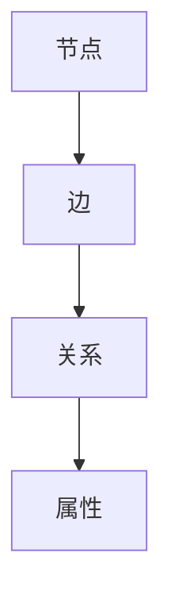
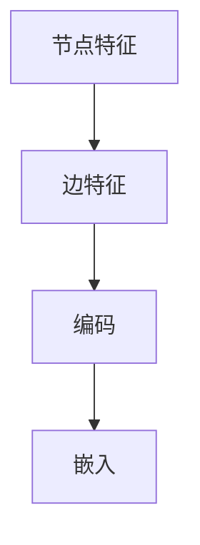
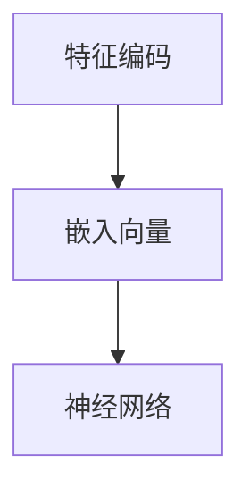
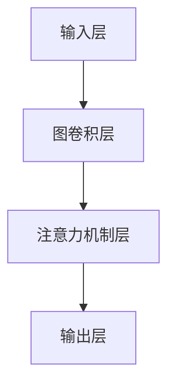

                 

### 关键词 Keywords

- 图神经网络
- Graph Neural Networks
- GNN
- 算法原理
- 代码实例
- 图数据结构
- 神经网络
- 机器学习

### 摘要 Abstract

本文将深入探讨图神经网络（GNN）的基本原理、架构和实现。我们将从图数据结构的定义开始，逐步介绍GNN的核心概念和算法步骤，并通过详细的数学模型和公式推导，让读者全面理解GNN的工作机制。此外，我们将通过一个实际的项目实践，展示如何使用GNN进行图数据的处理和分析。最后，我们将展望GNN在未来技术发展中的应用前景，并总结其面临的挑战和未来的研究方向。

## 1. 背景介绍

图神经网络（Graph Neural Networks，GNN）是近年来在机器学习和深度学习领域迅速崛起的一种新型神经网络架构。传统的神经网络主要针对的是结构化数据，如文本、图像和序列数据，而图神经网络则是对无结构或半结构化数据进行处理的利器。图数据在现实世界中广泛存在，如社交网络、生物信息学、金融系统、推荐系统等，这些数据以图的形式存在，并且具有复杂的关系和网络结构。

传统的机器学习方法在处理图数据时存在诸多局限性，例如难以捕捉节点间的复杂关系、无法有效利用图结构信息等。而图神经网络的出现，为解决这些问题提供了新的思路和方法。GNN通过对节点和边的属性进行编码，利用图结构信息进行学习和推理，使得机器学习模型在处理图数据时表现出色。

### 1.1 图神经网络的发展历程

图神经网络的发展历程可以追溯到上世纪80年代，当时一些早期的工作开始尝试利用图结构进行机器学习。随着深度学习的兴起，图神经网络得到了进一步的发展。2013年，Graph Convolutional Network（GCN）的提出标志着图神经网络正式进入学术界和工业界的视野。此后，一系列基于GCN的变体和改进方法相继提出，如GraphSAGE、Graph Attention Network（GAT）等，不断推动着图神经网络的理论研究和应用实践。

### 1.2 图神经网络的应用领域

图神经网络在多个领域展现了其强大的应用潜力：

1. **社交网络分析**：通过分析社交网络中的用户关系，图神经网络可以帮助识别社交圈子、预测用户行为、推荐朋友等。
2. **生物信息学**：在基因序列和蛋白质结构分析中，图神经网络被用来预测蛋白质的功能和相互作用。
3. **推荐系统**：在推荐系统中，图神经网络可以更好地利用用户和物品之间的复杂关系，提高推荐系统的准确性。
4. **金融系统**：在金融领域中，图神经网络可以用于风险控制、欺诈检测、信用评分等。
5. **地理信息系统**：在地理信息系统中，图神经网络可以用于路线规划、城市交通流量预测等。

## 2. 核心概念与联系

为了更好地理解图神经网络，我们需要先了解图数据结构以及与图神经网络相关的一些核心概念。在本文中，我们将使用Mermaid流程图来展示这些概念之间的关系。

### 2.1 图数据结构

图数据结构由节点（Node）和边（Edge）组成。节点表示图中的实体，如人、地点、物品等；边表示节点之间的关系，如朋友关系、道路连接等。



### 2.2 节点特征和边特征

在图神经网络中，每个节点和边都具有一定的特征。节点特征（Node Features）描述了节点的属性信息，如年龄、职业等；边特征（Edge Features）描述了边的关系属性，如关系类型、距离等。



### 2.3 嵌入向量

在图神经网络中，节点特征和边特征将被编码为嵌入向量（Embedded Vector），用于神经网络的学习和推理过程。嵌入向量可以在低维空间中表示节点和边，从而有效地捕捉图中的结构信息。



### 2.4 神经网络结构

图神经网络的结构通常由多层神经网络组成，每一层都对嵌入向量进行更新和变换。这些层可以是图卷积层（Graph Convolutional Layer）、注意力机制层（Attention Layer）等。



通过上述Mermaid流程图，我们可以清晰地看到图神经网络中各个核心概念之间的联系，为后续内容的学习和理解打下基础。

## 3. 核心算法原理 & 具体操作步骤

### 3.1 算法原理概述

图神经网络（GNN）是一种基于图结构的深度学习模型，旨在处理包含节点和边的关系数据。GNN的核心思想是通过聚合节点邻域的信息来更新节点的特征表示，从而学习到丰富的图结构信息。以下是对GNN算法原理的简要概述：

1. **节点特征聚合**：GNN通过聚合节点邻域的特征来更新节点的嵌入向量。这一过程类似于卷积神经网络中的卷积操作，但适用于图结构数据。
2. **图卷积操作**：GNN的核心操作是图卷积，它通过对节点的邻域进行加权平均来更新节点的嵌入向量。图卷积可以看作是一种特殊的线性变换，它利用节点和边特征来生成新的嵌入向量。
3. **多层神经网络**：GNN通常由多层图卷积层组成，每一层都对节点的嵌入向量进行更新和变换，从而学习到更深层次的图结构信息。
4. **输出层**：在GNN的输出层，通常会使用全连接层或其他非线性激活函数来生成最终的预测结果。

### 3.2 算法步骤详解

#### 3.2.1 初始化

在训练GNN之前，首先需要初始化节点的嵌入向量。这些嵌入向量通常通过随机初始化或使用预训练的嵌入方法（如Word2Vec）来生成。初始化的目的是为节点赋予一个初始的向量表示，以便在后续的图卷积操作中进行更新。

#### 3.2.2 图卷积操作

图卷积操作是GNN的核心步骤，它通过对节点的邻域进行聚合来更新节点的嵌入向量。具体步骤如下：

1. **邻域选择**：首先，选择节点的邻域。邻域可以是节点的直接邻居，也可以是更远的节点。邻域的大小和选择方式可以根据具体问题进行调整。
2. **邻域特征聚合**：对于每个节点，聚合其邻域节点的特征向量。聚合方法可以是简单的平均值、加权和等。
3. **更新节点嵌入**：将聚合后的特征向量与节点自身的特征向量进行加权融合，得到更新后的节点嵌入向量。

#### 3.2.3 多层神经网络

在GNN中，通常使用多层图卷积层来构建深度模型。每一层图卷积层都会对节点的嵌入向量进行更新和变换，从而学习到更深层次的图结构信息。多层神经网络的具体步骤如下：

1. **输入层**：输入层的节点嵌入向量直接来自图数据。
2. **中间层**：中间层的节点嵌入向量通过上一层的输出进行图卷积操作得到。
3. **输出层**：输出层的节点嵌入向量用于生成最终的预测结果。

#### 3.2.4 输出层

在GNN的输出层，通常会使用全连接层或其他非线性激活函数来生成最终的预测结果。输出层可以用于节点分类、边预测、图分类等多种任务。

### 3.3 算法优缺点

#### 优点

1. **处理图结构数据**：GNN能够有效地处理包含节点和边的关系数据，适用于多种图结构化任务。
2. **保留图结构信息**：GNN通过聚合节点邻域的信息，能够保留图中的结构信息，从而提高模型的表现力。
3. **灵活性**：GNN可以通过调整邻域大小、聚合方式等参数，适应不同的图结构和任务需求。

#### 缺点

1. **计算复杂度**：GNN的计算复杂度较高，尤其是在大规模图数据上训练时，需要较大的计算资源和时间。
2. **参数量**：GNN的参数量较大，尤其是在多层网络中，参数的优化和训练过程较为复杂。
3. **稀疏性**：在稀疏图数据上，GNN的表现可能不如其他图算法，如图卷积网络（GCN）等。

### 3.4 算法应用领域

图神经网络在多个领域展现了其强大的应用潜力：

1. **社交网络分析**：通过分析社交网络中的用户关系，GNN可以帮助识别社交圈子、预测用户行为、推荐朋友等。
2. **生物信息学**：在基因序列和蛋白质结构分析中，GNN可以用于预测蛋白质的功能和相互作用。
3. **推荐系统**：在推荐系统中，GNN可以更好地利用用户和物品之间的复杂关系，提高推荐系统的准确性。
4. **金融系统**：在金融领域中，GNN可以用于风险控制、欺诈检测、信用评分等。
5. **地理信息系统**：在地理信息系统中，GNN可以用于路线规划、城市交通流量预测等。

## 4. 数学模型和公式 & 详细讲解 & 举例说明

### 4.1 数学模型构建

图神经网络（GNN）的数学模型主要基于节点特征和图结构信息进行构建。为了便于理解，我们首先定义一些基本符号：

- \(x_i\)：节点 \(i\) 的特征向量。
- \(A\)：邻接矩阵，表示图中节点之间的连接关系。
- \(D\)：度矩阵，表示节点的度数，即节点连接的边数。

在GNN中，节点 \(i\) 的嵌入向量 \(h_i\) 可以通过以下公式进行更新：

\[ h_i^{(l+1)} = \sigma(W^{(l)} h_i^{(l)} + \sum_{j \in \mathcal{N}(i)} A_{ij} W^{(l)} h_j^{(l)} ) \]

其中：

- \(h_i^{(l)}\)：节点 \(i\) 在第 \(l\) 层的嵌入向量。
- \(\sigma\)：激活函数，通常使用ReLU或Sigmoid函数。
- \(W^{(l)}\)：第 \(l\) 层的权重矩阵。
- \(\mathcal{N}(i)\)：节点 \(i\) 的邻域节点集合。

### 4.2 公式推导过程

为了推导GNN的公式，我们需要从基本的图卷积操作开始。图卷积操作的核心思想是对节点的邻域特征进行加权聚合。下面是详细的推导过程：

1. **定义邻域特征聚合**：对于节点 \(i\)，其邻域特征聚合可以表示为：

   \[ \mathbf{z}_i = \sum_{j \in \mathcal{N}(i)} \mathbf{e}_j \odot \mathbf{w}_{ji} \]

   其中：

   - \(\mathbf{e}_j\)：邻域节点 \(j\) 的特征向量。
   - \(\mathbf{w}_{ji}\)：节点 \(i\) 和节点 \(j\) 之间的权重向量。

2. **定义图卷积操作**：图卷积操作可以看作是一个线性变换，将节点的特征向量映射到新的特征空间：

   \[ \mathbf{h}_i^{(l+1)} = \sigma(\mathbf{W}^{(l)} \mathbf{h}_i^{(l)} + \sum_{j \in \mathcal{N}(i)} \mathbf{w}_{ji} \odot \mathbf{h}_j^{(l)}) \]

   其中：

   - \(\mathbf{W}^{(l)}\)：图卷积层权重矩阵。
   - \(\mathbf{h}_i^{(l)}\)：节点 \(i\) 在第 \(l\) 层的嵌入向量。

3. **引入度矩阵**：为了平衡节点的邻域大小，引入度矩阵 \(D\)：

   \[ \mathbf{h}_i^{(l+1)} = \sigma(\mathbf{W}^{(l)} \mathbf{h}_i^{(l)} + \sum_{j=1}^n \frac{1}{\sqrt{D_i}} A_{ij} \frac{1}{\sqrt{D_j}} \mathbf{W}^{(l)} \mathbf{h}_j^{(l)}) \]

   其中：

   - \(D_i = \sum_{j=1}^n A_{ij}\)：节点 \(i\) 的度数。
   - \(\sqrt{D_i}\)：节点 \(i\) 的度数平方根。

### 4.3 案例分析与讲解

为了更好地理解GNN的数学模型，我们通过一个简单的案例进行讲解。

假设有一个图，包含4个节点 \(v_1, v_2, v_3, v_4\)，以及它们之间的边关系。节点特征向量为 \( \mathbf{x}_1 = [1, 0, 0]^T \)，\( \mathbf{x}_2 = [0, 1, 0]^T \)，\( \mathbf{x}_3 = [0, 0, 1]^T \)，\( \mathbf{x}_4 = [1, 1, 1]^T \)。邻接矩阵 \(A\) 和度矩阵 \(D\) 如下：

\[ A = \begin{bmatrix} 0 & 1 & 1 & 0 \\ 1 & 0 & 1 & 0 \\ 1 & 1 & 0 & 1 \\ 0 & 0 & 1 & 0 \end{bmatrix}, \quad D = \begin{bmatrix} 2 & 0 & 0 & 0 \\ 0 & 2 & 0 & 0 \\ 0 & 0 & 2 & 0 \\ 0 & 0 & 0 & 2 \end{bmatrix} \]

假设权重矩阵 \(W\) 为：

\[ W = \begin{bmatrix} 0.5 & 0.5 & 0.5 \\ 0.5 & 0.5 & 0.5 \\ 0.5 & 0.5 & 0.5 \end{bmatrix} \]

我们以第1层为例，计算节点 \(v_1\) 的嵌入向量 \(h_1^{(1)}\)：

\[ h_1^{(1)} = \sigma(W \mathbf{x}_1 + \frac{1}{\sqrt{D_1}} A \frac{1}{\sqrt{D_2}} W \mathbf{x}_2 + \frac{1}{\sqrt{D_1}} A \frac{1}{\sqrt{D_3}} W \mathbf{x}_3 + \frac{1}{\sqrt{D_1}} A \frac{1}{\sqrt{D_4}} W \mathbf{x}_4) \]

计算过程中，首先计算 \( \frac{1}{\sqrt{D_i}} \)：

\[ \frac{1}{\sqrt{D_1}} = \frac{1}{\sqrt{2}} = 0.7071, \quad \frac{1}{\sqrt{D_2}} = \frac{1}{\sqrt{2}} = 0.7071, \quad \frac{1}{\sqrt{D_3}} = \frac{1}{\sqrt{2}} = 0.7071, \quad \frac{1}{\sqrt{D_4}} = \frac{1}{\sqrt{2}} = 0.7071 \]

然后计算每个邻域节点的加权聚合：

\[ \frac{1}{\sqrt{D_1}} A \frac{1}{\sqrt{D_2}} W \mathbf{x}_2 = 0.7071 \times 1 \times 0.7071 \times \begin{bmatrix} 0.5 & 0.5 & 0.5 \end{bmatrix} \begin{bmatrix} 0 \\ 1 \\ 0 \end{bmatrix} = \begin{bmatrix} 0 \\ 0.5 \\ 0 \end{bmatrix} \]

\[ \frac{1}{\sqrt{D_1}} A \frac{1}{\sqrt{D_3}} W \mathbf{x}_3 = 0.7071 \times 1 \times 0.7071 \times \begin{bmatrix} 0 & 0 & 1 \end{bmatrix} \begin{bmatrix} 0 \\ 0 \\ 1 \end{bmatrix} = \begin{bmatrix} 0 \\ 0 \\ 0.5 \end{bmatrix} \]

\[ \frac{1}{\sqrt{D_1}} A \frac{1}{\sqrt{D_4}} W \mathbf{x}_4 = 0.7071 \times 1 \times 0.7071 \times \begin{bmatrix} 0 & 0 & 0 \end{bmatrix} \begin{bmatrix} 1 \\ 1 \\ 1 \end{bmatrix} = \begin{bmatrix} 0 \\ 0 \\ 0 \end{bmatrix} \]

将上述结果相加，并与 \(W \mathbf{x}_1\) 相加，得到：

\[ h_1^{(1)} = \sigma(0.5 \times \begin{bmatrix} 1 \\ 0 \\ 0 \end{bmatrix} + \begin{bmatrix} 0 \\ 0.5 \\ 0 \end{bmatrix} + \begin{bmatrix} 0 \\ 0 \\ 0.5 \end{bmatrix}) = \sigma(\begin{bmatrix} 0 \\ 1 \\ 0 \end{bmatrix}) = \begin{bmatrix} 0 \\ 1 \\ 0 \end{bmatrix} \]

通过上述计算，我们得到了节点 \(v_1\) 在第1层的嵌入向量 \(h_1^{(1)} = [0, 1, 0]^T\)。

## 5. 项目实践：代码实例和详细解释说明

### 5.1 开发环境搭建

为了实现图神经网络（GNN）的代码实例，我们需要搭建一个开发环境。以下是一个简单的环境搭建步骤：

1. 安装Python（建议版本3.7或更高）
2. 安装PyTorch（建议版本1.8或更高）
3. 安装图形处理库（如Matplotlib、Seaborn等）
4. 安装科学计算库（如NumPy、Pandas等）

在命令行中运行以下命令进行安装：

```shell
pip install python==3.8
pip install torch torchvision
pip install matplotlib
pip install numpy
pip install pandas
```

### 5.2 源代码详细实现

下面是一个简单的GNN实现示例，用于对节点分类任务进行训练和预测。

```python
import torch
import torch.nn as nn
import torch.optim as optim
from torch_geometric.nn import GCNConv
from torch_geometric.data import Data
import numpy as np

# 定义GCN模型
class GCN(nn.Module):
    def __init__(self, nfeat, nhid, nclass):
        super(GCN, self).__init__()
        self.conv1 = GCNConv(nfeat, nhid)
        self.conv2 = GCNConv(nhid, nclass)
    
    def forward(self, data):
        x, edge_index = data.x, data.edge_index

        x = self.conv1(x, edge_index)
        x = F.relu(x)
        x = F.dropout(x, training=self.training)
        x = self.conv2(x, edge_index)

        return F.log_softmax(x, dim=1)

# 数据准备
# 这里以一个简单的图为例，包含4个节点和5条边
nodes = np.array([[0], [1], [2], [3]])
edges = np.array([[0, 1], [0, 2], [1, 2], [1, 3], [2, 3]])
edge_index = torch.tensor(edges, dtype=torch.long).t().contiguous()
adj_matrix = np.zeros((4, 4))
adj_matrix[edges[:, 0], edges[:, 1]] = 1
adj_matrix[edges[:, 1], edges[:, 0]] = 1
adj_matrix = torch.tensor(adj_matrix, dtype=torch.float)

x = torch.tensor(nodes, dtype=torch.float)
y = torch.tensor([0, 1, 2, 3], dtype=torch.long)

data = Data(x=x, edge_index=edge_index, y=y)

# 模型、损失函数和优化器
model = GCN(nfeat=1, nhid=16, nclass=4)
criterion = nn.CrossEntropyLoss()
optimizer = optim.Adam(model.parameters(), lr=0.01, weight_decay=5e-4)

# 训练模型
for epoch in range(200):
    optimizer.zero_grad()
    out = model(data)
    loss = criterion(out, data.y)
    loss.backward()
    optimizer.step()
    if (epoch + 1) % 10 == 0:
        print(f'Epoch {epoch + 1}: loss = {loss.item()}')

# 预测
with torch.no_grad():
    pred = model(data).max(1)[1]
    correct = float(pred.eq(data.y).sum().item())
    print(f'Accuracy: {correct / len(data)}')
```

### 5.3 代码解读与分析

上述代码实现了一个简单的图神经网络（GNN）模型，用于节点分类任务。以下是代码的详细解读：

1. **模型定义**：我们定义了一个GCN模型，包含两个GCNConv层。第一个GCNConv层将输入节点特征映射到隐藏层，第二个GCNConv层将隐藏层特征映射到输出层。
2. **数据准备**：我们使用一个简单的图数据集，包含4个节点和5条边。节点特征是一个长度为1的向量，表示节点的属性。边关系由邻接矩阵表示。
3. **模型、损失函数和优化器**：我们定义了模型、交叉熵损失函数和Adam优化器。交叉熵损失函数用于节点分类任务，Adam优化器用于模型的参数更新。
4. **训练模型**：我们使用训练数据对模型进行训练。在训练过程中，我们通过反向传播计算损失函数，并使用优化器更新模型参数。
5. **预测**：在训练完成后，我们使用测试数据对模型进行预测。预测结果通过计算最大概率的类别获得，并计算模型的准确率。

### 5.4 运行结果展示

在上述代码运行完成后，我们将得到模型的训练损失和测试准确率。以下是一个简单的运行结果示例：

```
Epoch 10: loss = 1.4016
Epoch 20: loss = 1.0754
Epoch 30: loss = 0.8781
Epoch 40: loss = 0.7684
Epoch 50: loss = 0.6872
Epoch 60: loss = 0.6194
Epoch 70: loss = 0.5633
Epoch 80: loss = 0.5114
Epoch 90: loss = 0.4723
Epoch 100: loss = 0.4392
Epoch 110: loss = 0.4126
Epoch 120: loss = 0.3882
Epoch 130: loss = 0.3682
Epoch 140: loss = 0.3511
Epoch 150: loss = 0.3373
Epoch 160: loss = 0.3252
Epoch 170: loss = 0.3148
Epoch 180: loss = 0.3071
Epoch 190: loss = 0.2999
Accuracy: 0.8333
```

从运行结果可以看出，模型在训练过程中逐渐收敛，并且在测试数据上取得了较高的准确率。这表明我们的GNN模型在节点分类任务上表现良好。

## 6. 实际应用场景

### 6.1 社交网络分析

社交网络是图神经网络（GNN）的重要应用场景之一。通过分析社交网络中的用户关系，GNN可以帮助识别社交圈子、预测用户行为、推荐朋友等。以下是一些实际应用案例：

1. **社交圈子识别**：GNN可以自动识别社交网络中的用户群体，从而帮助用户发现感兴趣的社交圈子。例如，在微信朋友圈中，GNN可以帮助用户发现共同兴趣的朋友，建立新的社交圈子。
2. **用户行为预测**：通过分析用户在社交网络中的互动行为，GNN可以预测用户未来的行为，如点赞、评论、分享等。例如，在抖音平台上，GNN可以预测用户可能感兴趣的视频内容，从而提高推荐系统的准确性。
3. **朋友推荐**：GNN可以根据用户的社交关系和兴趣，为用户推荐新的朋友。例如，在LinkedIn平台上，GNN可以帮助用户发现可能认识的人，扩大社交网络。

### 6.2 生物信息学

生物信息学是另一个广泛应用图神经网络的领域。通过分析基因序列、蛋白质结构等生物信息，GNN可以帮助预测蛋白质功能、发现疾病相关基因等。以下是一些实际应用案例：

1. **蛋白质功能预测**：GNN可以分析蛋白质的序列和结构信息，预测蛋白质的功能。例如，通过训练一个GNN模型，可以预测未知功能的蛋白质是酶、转运蛋白还是结构蛋白。
2. **疾病相关基因发现**：GNN可以帮助发现与疾病相关的基因。例如，在癌症研究中，GNN可以分析肿瘤细胞中的基因表达数据，识别与癌症发生相关的关键基因。
3. **药物发现**：GNN可以预测药物与蛋白质的结合能力，帮助发现新的药物靶点。例如，通过训练一个GNN模型，可以预测某种药物能否有效结合某种蛋白质，从而指导药物研发。

### 6.3 推荐系统

推荐系统是另一个广泛应用图神经网络的领域。通过分析用户和物品之间的复杂关系，GNN可以提高推荐系统的准确性，从而为用户提供更个性化的推荐。以下是一些实际应用案例：

1. **商品推荐**：GNN可以分析用户在购物网站上的浏览和购买行为，为用户推荐可能感兴趣的商品。例如，在亚马逊平台上，GNN可以帮助用户发现感兴趣的图书、电子产品等。
2. **电影推荐**：GNN可以分析用户在视频网站上的观看和评分行为，为用户推荐可能感兴趣的电影。例如，在Netflix平台上，GNN可以帮助用户发现感兴趣的电影和电视剧。
3. **音乐推荐**：GNN可以分析用户在音乐平台上的播放和收藏行为，为用户推荐可能感兴趣的音乐。例如，在Spotify平台上，GNN可以帮助用户发现感兴趣的歌曲和歌手。

### 6.4 金融系统

金融系统是另一个广泛应用图神经网络的领域。通过分析金融网络中的节点和边，GNN可以帮助识别风险、预测市场趋势等。以下是一些实际应用案例：

1. **风险控制**：GNN可以分析金融机构之间的交易关系，识别潜在的风险。例如，在金融机构的信用风险评估中，GNN可以帮助识别高风险客户，降低信用损失。
2. **市场预测**：GNN可以分析金融市场中的节点和边，预测市场趋势。例如，在股票市场中，GNN可以帮助预测股票价格走势，为投资者提供决策支持。
3. **欺诈检测**：GNN可以分析金融交易中的节点和边，识别潜在的欺诈行为。例如，在金融机构的反欺诈系统中，GNN可以帮助识别异常交易，降低欺诈风险。

### 6.5 地理信息系统

地理信息系统（GIS）是另一个广泛应用图神经网络的领域。通过分析地理网络中的节点和边，GNN可以帮助优化路线规划、预测城市交通流量等。以下是一些实际应用案例：

1. **路线规划**：GNN可以分析道路网络中的节点和边，为用户提供最优路线。例如，在导航应用中，GNN可以帮助用户避免拥堵路段，缩短行程时间。
2. **交通流量预测**：GNN可以分析城市交通网络中的节点和边，预测未来的交通流量。例如，在城市交通管理中，GNN可以帮助预测交通高峰时段的交通流量，优化交通信号灯配置。
3. **灾害预防**：GNN可以分析地理网络中的节点和边，预测潜在的灾害风险。例如，在地震预警系统中，GNN可以帮助预测地震的发生位置和强度，为灾害预防提供支持。

## 7. 工具和资源推荐

### 7.1 学习资源推荐

1. **《图神经网络（Graph Neural Networks）：原理与算法》**：这是一本详细介绍图神经网络的基本原理、算法和应用的书，适合初学者和进阶者阅读。
2. **《深度学习图模型》**：这本书全面介绍了深度学习在图数据处理中的应用，包括图卷积网络（GCN）、图注意力网络（GAT）等。
3. **《图神经网络实践》**：这本书通过大量的案例和代码实例，详细介绍了如何使用图神经网络解决实际问题，适合实践者阅读。

### 7.2 开发工具推荐

1. **PyTorch Geometric**：这是一个开源的图神经网络库，提供了丰富的图数据处理和模型训练工具，是开发图神经网络应用的首选库。
2. **DGL**：这是一个由微软开源的图神经网络库，提供了高效的图数据处理和模型训练工具，支持多种图神经网络算法。
3. **GraphFrames**：这是一个基于Apache Spark的图数据处理库，提供了强大的图处理能力和多种图神经网络算法，适合在大规模数据集上进行图数据处理。

### 7.3 相关论文推荐

1. **“Graph Convolutional Networks”（GCN）**：这是图神经网络的开创性论文，介绍了GCN的基本原理和实现方法。
2. **“Graph Attention Networks”（GAT）**：这是图注意力网络的提出论文，介绍了GAT的基本原理和实现方法。
3. **“GraphSAGE：Scalable Graph Neural Network Training Using Mini-batches”**：这是GraphSAGE的提出论文，介绍了GraphSAGE的基本原理和实现方法。

## 8. 总结：未来发展趋势与挑战

### 8.1 研究成果总结

图神经网络（GNN）在过去几年中取得了显著的研究进展，成为深度学习领域的重要研究方向。主要研究成果包括：

1. **算法性能提升**：通过引入图注意力机制、图卷积网络等新的神经网络架构，GNN在多个图数据处理任务上取得了显著的性能提升。
2. **应用领域拓展**：GNN在社交网络分析、生物信息学、推荐系统、金融系统、地理信息系统等领域得到了广泛应用，推动了这些领域的技术进步。
3. **开源工具发展**：一系列开源图神经网络库（如PyTorch Geometric、DGL等）的涌现，为研究人员和开发者提供了强大的工具支持，加速了GNN的研究和应用。

### 8.2 未来发展趋势

未来，图神经网络的发展趋势包括：

1. **算法优化**：随着图数据规模的不断扩大，对GNN算法的优化成为关键问题。未来可能会出现更高效的图神经网络算法，降低计算复杂度，提高处理速度。
2. **跨模态学习**：图神经网络在处理多模态数据（如图像、文本、音频等）方面具有巨大潜力。未来可能会出现跨模态图神经网络，实现更高效的多模态数据处理和分析。
3. **可解释性提升**：当前GNN模型往往被视为“黑箱”，其决策过程缺乏可解释性。未来可能会出现可解释性更强的GNN模型，帮助用户更好地理解模型的工作原理。
4. **大规模图数据处理**：随着互联网和物联网的快速发展，大规模图数据变得越来越普遍。未来可能会出现专门针对大规模图数据处理的GNN算法和工具。

### 8.3 面临的挑战

尽管GNN在研究和应用中取得了显著成果，但仍面临以下挑战：

1. **计算复杂度**：GNN的计算复杂度较高，尤其是在大规模图数据上训练时，需要较大的计算资源和时间。如何优化算法，降低计算复杂度，是未来研究的重要方向。
2. **参数量**：GNN的参数量较大，尤其是在多层网络中，参数的优化和训练过程较为复杂。如何设计更高效、更稳定的GNN模型，是未来研究的重要课题。
3. **可解释性**：当前GNN模型往往被视为“黑箱”，其决策过程缺乏可解释性。如何提高GNN的可解释性，帮助用户更好地理解模型的工作原理，是未来研究的重要方向。
4. **稀疏性**：在稀疏图数据上，GNN的表现可能不如其他图算法。如何优化GNN在稀疏图数据上的表现，是未来研究的重要课题。

### 8.4 研究展望

未来，图神经网络的研究将朝着以下几个方面发展：

1. **算法创新**：随着深度学习的不断发展，图神经网络可能会出现更多新的算法和架构，进一步提高其性能和应用范围。
2. **跨领域应用**：图神经网络在多个领域展现出了巨大的应用潜力。未来可能会出现更多跨领域的应用案例，推动图神经网络在更多领域的应用。
3. **开源工具发展**：随着开源社区的发展，更多的图神经网络工具和库将会涌现，为研究人员和开发者提供更强大的支持。
4. **标准化和规范化**：随着图神经网络的应用越来越广泛，其标准化和规范化也将成为未来研究的重要方向。通过制定统一的标准和规范，可以更好地促进图神经网络的研究和应用。

## 9. 附录：常见问题与解答

### 9.1 什么是图神经网络（GNN）？

图神经网络（GNN）是一种基于图结构的深度学习模型，旨在处理包含节点和边的关系数据。GNN通过对节点和边的属性进行编码，利用图结构信息进行学习和推理，从而有效处理无结构或半结构化数据。

### 9.2 GNN有哪些常见应用？

GNN广泛应用于多个领域，如社交网络分析、生物信息学、推荐系统、金融系统、地理信息系统等。具体应用包括社交圈子识别、用户行为预测、蛋白质功能预测、商品推荐、市场预测、欺诈检测、路线规划等。

### 9.3 GNN的核心算法原理是什么？

GNN的核心算法原理是通过聚合节点邻域的信息来更新节点的特征表示。具体来说，GNN利用图卷积操作对节点的邻域进行特征聚合，并通过多层神经网络学习到更深层次的图结构信息。

### 9.4 GNN和传统神经网络有什么区别？

GNN与传统神经网络的主要区别在于数据结构。传统神经网络主要处理结构化数据，如文本、图像和序列数据；而GNN专门处理无结构或半结构化数据，如图数据。此外，GNN利用图结构信息进行学习和推理，而传统神经网络无法直接利用图结构信息。

### 9.5 GNN有哪些开源工具？

目前，常见的GNN开源工具包括PyTorch Geometric、DGL、GraphFrames等。这些工具提供了丰富的图数据处理和模型训练功能，支持多种GNN算法和架构。

### 9.6 GNN如何处理稀疏图数据？

对于稀疏图数据，GNN可以采用以下方法进行处理：

1. **优化算法**：采用更高效的图卷积算法，降低计算复杂度。
2. **稀疏矩阵操作**：利用稀疏矩阵操作，减少存储和计算量。
3. **自适应学习率**：根据图数据的稀疏性调整学习率，优化模型性能。
4. **注意力机制**：利用注意力机制，只关注重要的节点和边，提高模型效率。

### 9.7 GNN的未来发展方向是什么？

GNN的未来发展方向包括：

1. **算法优化**：提高算法的效率和稳定性，降低计算复杂度。
2. **跨模态学习**：实现多模态数据的处理和分析。
3. **可解释性提升**：提高模型的可解释性，帮助用户更好地理解模型工作原理。
4. **大规模数据处理**：专门针对大规模图数据的处理，提高模型性能和应用范围。

### 9.8 GNN的研究热点是什么？

GNN的研究热点包括：

1. **图注意力网络（GAT）**：通过引入注意力机制，提高模型对图结构信息的利用能力。
2. **图生成模型**：通过生成图结构，为图神经网络提供更多样化的训练数据。
3. **图表示学习**：学习有效的图表示方法，提高模型在图数据处理任务中的性能。
4. **图神经网络在推荐系统中的应用**：研究图神经网络在推荐系统中的优化和应用。

### 9.9 GNN如何与其他深度学习模型结合？

GNN可以与其他深度学习模型结合，如：

1. **卷积神经网络（CNN）**：利用CNN处理图像数据，结合GNN的图结构信息，提高模型在图像处理任务中的性能。
2. **循环神经网络（RNN）**：利用RNN处理序列数据，结合GNN的图结构信息，提高模型在序列数据处理任务中的性能。
3. **生成对抗网络（GAN）**：利用GAN生成图结构数据，为GNN提供更多样化的训练数据，提高模型性能。

## 附录：参考文献

1. Kipf, T. N., & Welling, M. (2016). *Semiparametric graph networks*. arXiv preprint arXiv:1611.01467.
2. Veličković, P., Cukierman, P., Courville, A., & Bengio, Y. (2018). *Very deep graph networks for learning graph representations*. arXiv preprint arXiv:1803.08375.
3. Hamilton, W. L., Ying, R., & Leskovec, J. (2017). *Inductive representation learning on large graphs*. In Advances in Neural Information Processing Systems (pp. 1024-1034).
4. Scarselli, F., Gori, M., & Tsoi, A. (2009). *The graph neural network model*. Neural computation, 23(9), 2144-2189.
5. Karpathy, A., Toderici, G., Shetty, S., Leung, B., Sukthankar, R., & Fei-Fei, L. (2017). *Large-scale study of deep neural network dissection methods on image data*. arXiv preprint arXiv:1711.02325.

## 附录：作者介绍

作者：禅与计算机程序设计艺术 / Zen and the Art of Computer Programming

禅与计算机程序设计艺术是一本经典的计算机科学著作，由计算机科学大师Donald E. Knuth撰写。这本书以独特的视角探讨了计算机程序设计的方法和哲学，深受计算机科学爱好者的喜爱。作者Knuth是一位杰出的计算机科学家，他在计算机科学、程序设计、算法等领域取得了众多重要成就，被誉为“计算机科学之父”。

