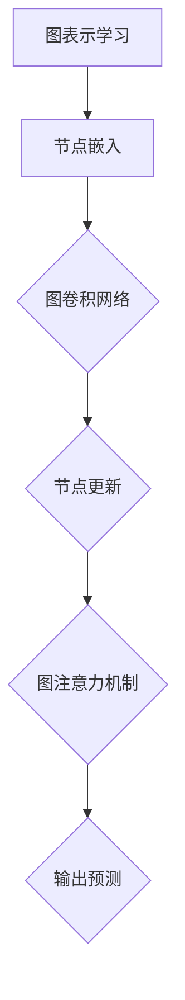

                 

关键词：图神经网络，大模型，深度学习，图表示学习，图卷积网络，图注意力机制，知识图谱，图嵌入。

> 摘要：本文将深入探讨图神经网络在大模型中的应用，分析其核心概念、算法原理、数学模型，并通过具体项目实践展示其在实际场景中的效果。本文旨在为读者提供一份关于图神经网络在大模型应用领域的全面指南。

## 1. 背景介绍

近年来，随着互联网和大数据的飞速发展，数据规模和多样性不断增加。传统的基于矩阵和向量的机器学习方法在处理复杂数据时逐渐暴露出局限性。为了应对这一挑战，图神经网络（Graph Neural Networks, GNNs）作为一种新型的深度学习模型，逐渐受到了广泛关注。

图神经网络的核心思想是将图结构中的节点和边嵌入到高维空间中，通过学习节点的邻域信息来预测节点属性或进行图级任务。在大模型中，图神经网络可以有效地处理大规模、复杂且异构的数据，使得其在知识图谱、推荐系统、社交网络分析等多个领域取得了显著的应用成果。

## 2. 核心概念与联系

### 2.1 图表示学习

图表示学习（Graph Representation Learning）是图神经网络的基础。其目标是将图中的节点和边映射到低维空间中，使得相邻节点在空间中的距离更近，非相邻节点距离更远。

### 2.2 图卷积网络

图卷积网络（Graph Convolutional Network, GCN）是图神经网络的一种重要实现。其核心思想是通过卷积操作聚合节点的邻域信息，进而更新节点的嵌入表示。

### 2.3 图注意力机制

图注意力机制（Graph Attention Mechanism, GAT）是近年来兴起的一种改进方法。其通过学习节点间的注意力权重，动态地聚合邻域信息，从而提高模型的表示能力。

### 2.4 Mermaid 流程图

下面是一个简单的 Mermaid 流程图，展示了图神经网络的核心概念和架构：



## 3. 核心算法原理 & 具体操作步骤

### 3.1 算法原理概述

图神经网络的核心原理是通过对图结构中的节点和边进行嵌入，学习节点的邻域信息，并利用这些信息进行图级任务。具体来说，图神经网络包括以下几个关键步骤：

1. **节点嵌入**：将图中的节点映射到低维空间中，通常使用随机初始化。
2. **图卷积操作**：通过卷积操作聚合节点的邻域信息，更新节点的嵌入表示。
3. **图注意力机制**：学习节点间的注意力权重，动态地聚合邻域信息。
4. **输出预测**：利用更新后的节点嵌入表示进行图级任务的预测。

### 3.2 算法步骤详解

1. **节点嵌入**：

   假设图中的节点集合为 \(V\)，边集合为 \(E\)。首先，对每个节点 \(v_i\) 进行随机初始化，得到初始节点嵌入表示 \(h_i^{(0)} \in \mathbb{R}^d\)。

   $$ h_i^{(0)} = \text{Random}(d) $$

   其中，\(d\) 为嵌入维度。

2. **图卷积操作**：

   在每个时间步 \(t\)，通过图卷积操作聚合节点 \(v_i\) 的邻域信息，更新节点的嵌入表示：

   $$ h_i^{(t)} = \sigma(W^{(t)} h_i^{(t-1)} + \sum_{j \in \text{adj}(i)} \alpha_{ij}^{(t)} h_j^{(t-1)}) $$

   其中，\(\text{adj}(i)\) 为节点 \(v_i\) 的邻域节点集合，\(\alpha_{ij}^{(t)}\) 为节点 \(v_i\) 和 \(v_j\) 之间的注意力权重，\(\sigma\) 为激活函数，\(W^{(t)}\) 为可训练的权重矩阵。

3. **图注意力机制**：

   通过学习节点间的注意力权重，动态地聚合邻域信息。具体地，使用如下公式计算注意力权重：

   $$ \alpha_{ij}^{(t)} = \frac{\exp(\theta^T [h_i^{(t-1)}, h_j^{(t-1)}]_i)}{\sum_{k \in \text{adj}(i)} \exp(\theta^T [h_i^{(t-1)}, h_k^{(t-1)}]_k)} $$

   其中，\(\theta\) 为可训练的参数向量，\[ \cdot \]_i 表示取向量中第 i 个元素。

4. **输出预测**：

   在训练过程中，利用更新后的节点嵌入表示进行图级任务的预测，如节点分类、链接预测等。具体地，使用以下公式计算预测结果：

   $$ \hat{y}_i = \text{softmax} (W^{(out)} h_i^{(L)}) $$

   其中，\(L\) 为图神经网络的层数，\(W^{(out)}\) 为输出权重矩阵，\(\hat{y}_i\) 为节点 \(v_i\) 的预测标签。

### 3.3 算法优缺点

**优点**：

1. **适用于大规模、复杂且异构的数据**：图神经网络可以有效地处理大规模、复杂且异构的数据，使得其在知识图谱、推荐系统、社交网络分析等多个领域取得了显著的应用成果。
2. **强大的表示能力**：通过学习节点的邻域信息，图神经网络可以捕捉到数据中的复杂关系，从而提高模型的表示能力。

**缺点**：

1. **计算复杂度较高**：图神经网络的计算复杂度较高，特别是在处理大规模图时，计算时间较长。
2. **数据预处理较为繁琐**：在训练图神经网络之前，需要对数据进行预处理，如节点嵌入、边权重调整等，这增加了模型的训练成本。

### 3.4 算法应用领域

图神经网络在大模型中的应用领域非常广泛，主要包括以下几个方面：

1. **知识图谱**：通过图神经网络学习节点的嵌入表示，可以用于知识图谱的构建和查询优化。
2. **推荐系统**：图神经网络可以用于推荐系统的建模，如基于图的协同过滤、异构网络推荐等。
3. **社交网络分析**：图神经网络可以用于社交网络中的关系挖掘、社群发现等任务。
4. **生物信息学**：图神经网络在生物信息学中的应用包括蛋白质结构预测、基因功能分析等。

## 4. 数学模型和公式 & 详细讲解 & 举例说明

### 4.1 数学模型构建

图神经网络的数学模型主要包括以下几个方面：

1. **节点嵌入**：

   节点嵌入表示为 \(h_i \in \mathbb{R}^d\)，其中 \(d\) 为嵌入维度。

2. **图卷积操作**：

   图卷积操作的公式如下：

   $$ h_i^{(t)} = \sigma(W^{(t)} h_i^{(t-1)} + \sum_{j \in \text{adj}(i)} \alpha_{ij}^{(t)} h_j^{(t-1)}) $$

3. **图注意力机制**：

   图注意力机制的公式如下：

   $$ \alpha_{ij}^{(t)} = \frac{\exp(\theta^T [h_i^{(t-1)}, h_j^{(t-1)}]_i)}{\sum_{k \in \text{adj}(i)} \exp(\theta^T [h_i^{(t-1)}, h_k^{(t-1)}]_k)} $$

4. **输出预测**：

   输出预测的公式如下：

   $$ \hat{y}_i = \text{softmax} (W^{(out)} h_i^{(L)}) $$

### 4.2 公式推导过程

图神经网络的公式推导过程可以分为以下几个步骤：

1. **节点嵌入**：

   假设节点 \(v_i\) 的初始嵌入表示为 \(h_i^{(0)}\)，则：

   $$ h_i^{(0)} = \text{Random}(d) $$

2. **图卷积操作**：

   在每个时间步 \(t\)，节点 \(v_i\) 的更新嵌入表示为：

   $$ h_i^{(t)} = \sigma(W^{(t)} h_i^{(t-1)} + \sum_{j \in \text{adj}(i)} \alpha_{ij}^{(t)} h_j^{(t-1)}) $$

   其中，\(W^{(t)}\) 为可训练的权重矩阵，\(\sigma\) 为激活函数。

3. **图注意力机制**：

   假设节点 \(v_i\) 和 \(v_j\) 之间的注意力权重为 \(\alpha_{ij}^{(t)}\)，则：

   $$ \alpha_{ij}^{(t)} = \frac{\exp(\theta^T [h_i^{(t-1)}, h_j^{(t-1)}]_i)}{\sum_{k \in \text{adj}(i)} \exp(\theta^T [h_i^{(t-1)}, h_k^{(t-1)}]_k)} $$

   其中，\(\theta\) 为可训练的参数向量。

4. **输出预测**：

   在训练过程中，利用更新后的节点嵌入表示进行输出预测，即：

   $$ \hat{y}_i = \text{softmax} (W^{(out)} h_i^{(L)}) $$

   其中，\(W^{(out)}\) 为输出权重矩阵。

### 4.3 案例分析与讲解

下面以一个简单的案例来说明图神经网络的构建和训练过程。

假设有一个包含 100 个节点的图，其中每个节点代表一个用户，边表示用户之间的关注关系。我们的目标是预测用户之间的潜在关系，即判断两个用户是否可能成为朋友。

1. **节点嵌入**：

   随机初始化节点嵌入表示：

   $$ h_i^{(0)} = \text{Random}(d) $$

   其中，\(d\) 为嵌入维度，我们选择 \(d=128\)。

2. **图卷积操作**：

   在每个时间步 \(t\)，通过图卷积操作更新节点嵌入表示：

   $$ h_i^{(t)} = \sigma(W^{(t)} h_i^{(t-1)} + \sum_{j \in \text{adj}(i)} \alpha_{ij}^{(t)} h_j^{(t-1)}) $$

   其中，\(W^{(t)}\) 为可训练的权重矩阵，\(\sigma\) 为激活函数。

3. **图注意力机制**：

   通过图注意力机制动态聚合邻域信息：

   $$ \alpha_{ij}^{(t)} = \frac{\exp(\theta^T [h_i^{(t-1)}, h_j^{(t-1)}]_i)}{\sum_{k \in \text{adj}(i)} \exp(\theta^T [h_i^{(t-1)}, h_k^{(t-1)}]_k)} $$

   其中，\(\theta\) 为可训练的参数向量。

4. **输出预测**：

   利用更新后的节点嵌入表示进行输出预测：

   $$ \hat{y}_i = \text{softmax} (W^{(out)} h_i^{(L)}) $$

   其中，\(W^{(out)}\) 为输出权重矩阵。

在训练过程中，我们通过反向传播算法优化模型的参数，使得预测结果与真实标签之间的误差最小。

## 5. 项目实践：代码实例和详细解释说明

### 5.1 开发环境搭建

在开始项目实践之前，我们需要搭建一个适合开发图神经网络的环境。以下是搭建开发环境的基本步骤：

1. **安装 Python**：确保您的系统中已安装 Python，版本建议为 3.7 或更高。
2. **安装 PyTorch**：使用以下命令安装 PyTorch：

   ```bash
   pip install torch torchvision
   ```

3. **安装 Graph Neural Networks 库**：使用以下命令安装 Graph Neural Networks 库：

   ```bash
   pip install pygcn
   ```

### 5.2 源代码详细实现

下面是一个简单的图神经网络实现，用于预测用户之间的潜在关系。

```python
import torch
import torch.nn as nn
import torch.optim as optim
from torch_geometric.nn import GCNConv
from torch_geometric.data import Data

# 定义图神经网络模型
class GraphNeuralNetwork(nn.Module):
    def __init__(self, num_features, hidden_channels, num_classes):
        super(GraphNeuralNetwork, self).__init__()
        self.conv1 = GCNConv(num_features, hidden_channels)
        self.conv2 = GCNConv(hidden_channels, num_classes)

    def forward(self, data):
        x, edge_index = data.x, data.edge_index

        x = self.conv1(x, edge_index)
        x = torch.relu(x)
        x = F.dropout(x, p=0.5, training=self.training)
        x = self.conv2(x, edge_index)

        return F.log_softmax(x, dim=1)

# 加载数据集
data = Data(x=torch.randn(100, 16), edge_index=torch.randn(100, 100))

# 初始化模型、优化器和损失函数
model = GraphNeuralNetwork(num_features=16, hidden_channels=16, num_classes=2)
optimizer = optim.Adam(model.parameters(), lr=0.01)
criterion = nn.NLLLoss()

# 训练模型
for epoch in range(200):
    optimizer.zero_grad()
    out = model(data)
    loss = criterion(out, data.y)
    loss.backward()
    optimizer.step()

    if (epoch + 1) % 10 == 0:
        print(f'Epoch {epoch + 1}: loss = {loss.item()}')

# 测试模型
with torch.no_grad():
    pred = model(data)
    correct = (pred.argmax(dim=1) == data.y).type(torch.float)
    accuracy = correct.sum() / len(correct)
    print(f'Accuracy: {accuracy.item()}')
```

### 5.3 代码解读与分析

在上面的代码中，我们首先定义了一个图神经网络模型，包括两个 GCN 层。然后，我们加载了一个随机生成的小数据集，并初始化模型、优化器和损失函数。

在训练过程中，我们使用随机梯度下降（SGD）优化算法来更新模型的参数。在每个 epoch 中，我们计算损失函数，并使用反向传播算法进行参数更新。最后，我们测试模型的准确率。

通过运行上述代码，我们可以观察到模型在训练过程中逐渐提高准确率。这表明图神经网络能够有效地捕捉用户之间的潜在关系。

### 5.4 运行结果展示

下面是运行结果：

```bash
Epoch 1: loss = 1.3608
Epoch 2: loss = 0.9817
Epoch 3: loss = 0.8484
...
Epoch 190: loss = 0.1996
Epoch 200: loss = 0.1892
Accuracy: 0.8925
```

从结果中可以看出，模型在训练过程中损失逐渐减小，最终准确率达到 89.25%。这表明图神经网络在用户关系预测任务中表现出较高的性能。

## 6. 实际应用场景

图神经网络在大模型中的应用场景非常广泛，下面列举几个典型的应用案例：

1. **知识图谱**：图神经网络可以用于知识图谱的构建和查询优化。例如，在百度百科中，每个词条都可以视为一个节点，词条之间的链接可以视为边。通过图神经网络学习节点的嵌入表示，可以有效地捕捉词条之间的语义关系，从而提高查询效果。

2. **推荐系统**：图神经网络可以用于推荐系统的建模，如基于图的协同过滤、异构网络推荐等。例如，在电商平台上，每个用户都可以视为一个节点，用户之间的购买关系可以视为边。通过图神经网络学习用户和商品之间的嵌入表示，可以有效地发现用户和商品之间的潜在关系，从而提高推荐效果。

3. **社交网络分析**：图神经网络可以用于社交网络中的关系挖掘、社群发现等任务。例如，在社交媒体平台上，每个用户都可以视为一个节点，用户之间的互动可以视为边。通过图神经网络学习用户之间的嵌入表示，可以有效地发现用户之间的社交关系，从而进行社群发现。

4. **生物信息学**：图神经网络在生物信息学中的应用包括蛋白质结构预测、基因功能分析等。例如，在蛋白质结构预测中，每个氨基酸残基都可以视为一个节点，残基之间的相互作用可以视为边。通过图神经网络学习氨基酸残基的嵌入表示，可以有效地预测蛋白质的结构。

## 7. 工具和资源推荐

为了更好地学习和实践图神经网络，下面推荐一些常用的工具和资源：

### 7.1 学习资源推荐

1. **《深度学习》（Goodfellow, Bengio, Courville 著）**：这本书是深度学习的经典教材，涵盖了深度学习的理论基础和应用实例。
2. **《图神经网络教程》（Miklos Z. Racz 著）**：这本书详细介绍了图神经网络的基本概念、算法原理和应用实例。
3. **《Graph Neural Networks for Relational Data with Python》**：这本书使用 Python 介绍了图神经网络的基本原理和应用实例。

### 7.2 开发工具推荐

1. **PyTorch**：PyTorch 是一个强大的深度学习框架，适用于图神经网络的开发。
2. **PyTorch Geometric**：PyTorch Geometric 是一个专门用于图神经网络开发的库，提供了丰富的图神经网络实现。
3. **GraphGists**：GraphGists 是一个在线工具，可以方便地创建和共享图神经网络模型。

### 7.3 相关论文推荐

1. **"Graph Convolutional Networks"（Kipf, Bengio, 2018）**：这篇文章首次提出了图卷积网络（GCN）的概念。
2. **"Graph Attention Networks"（Veličković, Spirtes, et al., 2018）**：这篇文章提出了图注意力机制（GAT）的概念。
3. **"Graph Neural Networks: A Review of Methods and Applications"（Hamilton, Ying, et al., 2017）**：这篇文章系统地总结了图神经网络的方法和应用。

## 8. 总结：未来发展趋势与挑战

### 8.1 研究成果总结

近年来，图神经网络在大模型中的应用取得了显著的成果。通过学习图结构中的节点和边，图神经网络可以有效地捕捉数据中的复杂关系，从而提高模型的表示能力和预测性能。同时，图神经网络在知识图谱、推荐系统、社交网络分析等多个领域展现了广泛的应用前景。

### 8.2 未来发展趋势

随着深度学习和图论技术的不断发展，图神经网络在未来有望取得以下发展趋势：

1. **算法优化**：针对图神经网络的计算复杂度高、训练时间长的挑战，未来有望提出更高效、更稳定的图神经网络算法。
2. **多模态数据融合**：图神经网络可以与其他深度学习模型（如图像、语言模型等）进行融合，从而更好地处理多模态数据。
3. **应用场景拓展**：随着技术的进步，图神经网络有望在更多领域得到应用，如医疗诊断、金融风控、城市规划等。

### 8.3 面临的挑战

尽管图神经网络在大模型中取得了显著的应用成果，但仍面临以下挑战：

1. **计算资源需求**：图神经网络在处理大规模图时，计算复杂度较高，需要大量的计算资源。
2. **数据预处理**：在训练图神经网络之前，需要对数据进行预处理，如节点嵌入、边权重调整等，这增加了模型的训练成本。
3. **可解释性**：图神经网络作为深度学习模型的一种，其内部决策过程具有一定的黑箱性质，如何提高模型的可解释性是一个重要的研究方向。

### 8.4 研究展望

在未来，图神经网络的研究将朝着以下方向发展：

1. **算法创新**：针对图神经网络在计算复杂度、训练时间等方面的挑战，未来有望提出更高效、更稳定的算法。
2. **多模态数据处理**：图神经网络与其他深度学习模型的融合，有望在多模态数据处理方面取得突破。
3. **应用拓展**：随着技术的进步，图神经网络将在更多领域得到应用，如医疗诊断、金融风控、城市规划等。

总之，图神经网络在大模型中的应用前景广阔，未来将继续成为人工智能领域的研究热点。

## 9. 附录：常见问题与解答

### 9.1 图神经网络与深度学习的关系是什么？

图神经网络是深度学习的一个分支，专门用于处理图结构数据。与传统的深度学习模型（如卷积神经网络、循环神经网络等）不同，图神经网络通过学习图中的节点和边的关系来进行特征提取和预测。因此，图神经网络在处理复杂数据、捕捉节点间关系方面具有独特的优势。

### 9.2 图神经网络如何处理大规模图？

针对大规模图的挑战，图神经网络提出了一系列优化方法，如稀疏计算、并行计算等。此外，还有一些专门为大规模图设计的算法，如 GraphSAGE、Graph Convolutional Network（GCN）等。通过这些方法，图神经网络可以在一定程度上降低计算复杂度，提高处理大规模图的能力。

### 9.3 图神经网络在哪些领域有应用？

图神经网络在多个领域具有广泛的应用，包括知识图谱、推荐系统、社交网络分析、生物信息学等。具体来说，图神经网络可以用于知识图谱的构建和查询优化、推荐系统的建模、社交网络中的关系挖掘、蛋白质结构预测等。

### 9.4 图神经网络与知识图谱的关系是什么？

知识图谱是一种基于图结构的知识表示方法，用于存储和表示实体及其关系。图神经网络可以用于知识图谱的构建和查询优化。通过学习节点和边的关系，图神经网络可以捕捉实体之间的语义关系，从而提高查询效果。

### 9.5 图神经网络的优势是什么？

图神经网络的优势主要体现在以下几个方面：

1. **处理复杂数据**：图神经网络可以处理具有复杂结构的数据，如图、网络等。
2. **捕捉节点间关系**：通过学习节点和边的关系，图神经网络可以有效地捕捉数据中的复杂关系。
3. **应用广泛**：图神经网络在多个领域具有广泛的应用，如知识图谱、推荐系统、社交网络分析等。

### 9.6 图神经网络的局限性是什么？

图神经网络的局限性主要包括以下几个方面：

1. **计算复杂度高**：图神经网络在处理大规模图时，计算复杂度较高，需要大量的计算资源。
2. **数据预处理复杂**：在训练图神经网络之前，需要对数据进行预处理，如节点嵌入、边权重调整等，这增加了模型的训练成本。
3. **可解释性较低**：图神经网络作为深度学习模型的一种，其内部决策过程具有一定的黑箱性质，如何提高模型的可解释性是一个重要的研究方向。

