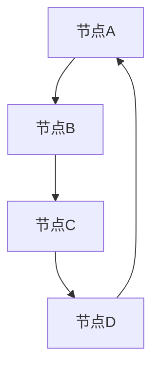

                 

 关键词：
- 图算法
- 数据结构
- 算法原理
- 实例讲解
- 代码实现

摘要：
本文将深入探讨图算法的核心原理及其在计算机科学中的应用。通过详细的代码实例，我们将展示如何实现和解读常见的图算法，包括图遍历、最短路径、最小生成树等。本文旨在为读者提供全面而易于理解的学习资源，帮助他们在实际项目中运用这些算法。

## 1. 背景介绍

### 图算法的重要性

图算法在计算机科学中扮演着至关重要的角色。它们广泛应用于网络分析、社交网络、路由算法、生物信息学、图论等领域。图算法可以解决许多复杂的问题，如最短路径问题、连通性问题、最小生成树问题等，这些问题在现实生活中有着广泛的应用。

### 图的基本概念

在图算法中，图是一个由节点（或顶点）和边组成的集合。节点表示实体，边表示节点之间的关系。根据边的性质，图可以分为无向图和有向图，根据节点的度数，图可以分为稀疏图和稠密图。

### 图算法的分类

图算法可以分为多种类型，包括：
- 图遍历算法：如深度优先搜索（DFS）和广度优先搜索（BFS）。
- 最短路径算法：如迪杰斯特拉算法（Dijkstra）和贝尔曼-福特算法（Bellman-Ford）。
- 最小生成树算法：如普里姆算法（Prim）和克鲁斯卡尔算法（Kruskal）。
- 网络流算法：如最大流-最小割定理（Max-Flow Min-Cut Theorem）。

## 2. 核心概念与联系

### 图的数据结构表示

在实现图算法时，常用的数据结构包括邻接矩阵和邻接表。邻接矩阵是一个二维数组，用于表示图的邻接关系；邻接表是一个数组，每个数组元素对应一个节点，内部存储与该节点相连的其他节点。

### Mermaid 流程图



在上面的 Mermaid 流程图中，节点 A、B、C、D 表示图中的顶点，箭头表示它们之间的边。

## 3. 核心算法原理 & 具体操作步骤

### 3.1 算法原理概述

#### 深度优先搜索（DFS）

深度优先搜索是一种遍历图的方法，它从某个起始节点开始，沿着路径一直深入到不能再深入为止，然后回溯到上一个节点，继续沿其他路径深入。DFS 的基本原理是递归或栈实现。

#### 广度优先搜索（BFS）

广度优先搜索也是一种遍历图的方法，它与 DFS 的主要区别在于，BFS 按层次遍历图，即先访问起始节点，然后依次访问起始节点的邻居节点，再访问邻居节点的邻居节点，以此类推。

#### 迪杰斯特拉算法（Dijkstra）

迪杰斯特拉算法是一种用于计算图中两点之间最短路径的算法。它基于贪心策略，逐步构建最短路径树。

#### 贝尔曼-福特算法（Bellman-Ford）

贝尔曼-福特算法是一种用于计算图中两点之间最短路径的算法，它可以在存在负权边的情况下运行。它通过迭代放松边来逐步逼近最短路径。

#### 普里姆算法（Prim）

普里姆算法是一种用于计算图的最小生成树的算法。它从某个起始节点开始，逐步添加边，直到构成最小生成树。

#### 克鲁斯卡尔算法（Kruskal）

克鲁斯卡尔算法也是一种用于计算图的最小生成树的算法。它与普里姆算法的不同在于，它按照边的权重从小到大排序，每次选择权重最小的边，并判断是否构成环，不构成环则添加到最小生成树中。

### 3.2 算法步骤详解

以下将详细讲解每种算法的具体步骤。

#### 深度优先搜索（DFS）

1. 从起始节点开始，将其标记为已访问。
2. 访问该节点的所有未访问的邻居节点，并递归地对每个邻居节点执行步骤1和2。
3. 当无法继续深入时，回溯到上一个节点，继续访问其他未访问的邻居节点。

#### 广度优先搜索（BFS）

1. 从起始节点开始，将其入队。
2. 出队一个节点，将其标记为已访问。
3. 访问该节点的所有未访问的邻居节点，并将它们入队。
4. 重复步骤2和3，直到队列为空。

#### 迪杰斯特拉算法（Dijkstra）

1. 初始化距离数组，将起始节点的距离设置为0，其他节点的距离设置为无穷大。
2. 选择未访问的节点中距离最小的节点作为当前节点。
3. 对于当前节点的每个邻居节点，计算从起始节点到邻居节点的距离，并更新距离数组。
4. 标记当前节点为已访问。
5. 重复步骤2到4，直到所有节点都被访问。

#### 贝尔曼-福特算法（Bellman-Ford）

1. 初始化距离数组，将起始节点的距离设置为0，其他节点的距离设置为无穷大。
2. 对于每个边，执行松弛操作，即如果通过当前边能够更短地到达邻居节点，则更新距离数组。
3. 重复步骤2，共执行n-1次，其中n是节点数。
4. 检查是否存在负权环，即如果仍然可以进一步优化距离，则说明存在负权环。

#### 普里姆算法（Prim）

1. 从起始节点开始，将其添加到最小生成树中。
2. 从已添加的节点中选择一个距离最小的未添加节点，将其添加到最小生成树中。
3. 更新已添加节点的邻居节点的距离，并重复步骤2，直到所有节点都被添加到最小生成树中。

#### 克鲁斯卡尔算法（Kruskal）

1. 将所有边按照权重从小到大排序。
2. 初始化一个空的最小生成树。
3. 遍历排序后的边，对于每条边，如果选择它不会构成环，则将其添加到最小生成树中。
4. 重复步骤3，直到最小生成树中的边数等于节点数减1。

### 3.3 算法优缺点

每种算法都有其优缺点，以下是对这些算法的简要总结：

- **DFS：**优点：简洁、易于实现；缺点：可能产生大量递归调用，导致栈溢出。
- **BFS：**优点：保证最短路径；缺点：可能需要大量内存来存储队列。
- **Dijkstra：**优点：适用于非负权图；缺点：时间复杂度较高。
- **Bellman-Ford：**优点：适用于存在负权边的图；缺点：时间复杂度较高。
- **Prim：**优点：适用于稠密图；缺点：需要排序操作。
- **Kruskal：**优点：适用于稀疏图；缺点：需要排序操作。

### 3.4 算法应用领域

这些算法在许多领域都有广泛的应用：

- **网络分析：**用于路由算法、网络拓扑分析等。
- **社交网络：**用于社区发现、影响力分析等。
- **生物信息学：**用于蛋白质相互作用网络分析等。
- **图论问题：**用于解决图论中的各种问题，如最小生成树、最短路径等。

## 4. 数学模型和公式 & 详细讲解 & 举例说明

### 4.1 数学模型构建

在图算法中，常用的数学模型包括：

- **邻接矩阵：**表示图中的边和节点之间的关系。
- **邻接表：**表示图中的节点及其相连的节点。
- **距离数组：**用于记录图中各节点的距离。

### 4.2 公式推导过程

以下是迪杰斯特拉算法的关键公式推导过程：

1. **初始化距离数组：**
   $$d(s, v) = \begin{cases} 
   0, & \text{如果 } v = s \\
   \infty, & \text{如果 } v \neq s 
   \end{cases}$$

2. **更新距离数组：**
   $$d(s, v) = \min(d(s, v), d(s, u) + w(u, v))$$
   其中，$u$ 和 $v$ 是图中的节点，$w(u, v)$ 是节点 $u$ 到节点 $v$ 的边权重。

### 4.3 案例分析与讲解

以下是一个简单的迪杰斯特拉算法的案例：

假设有一个无向图，包含5个节点 A、B、C、D、E，边的权重如下：

```
A-B: 3
A-C: 4
B-D: 2
B-E: 5
C-D: 1
C-E: 6
D-E: 3
```

使用迪杰斯特拉算法计算从节点 A 到其他节点的最短路径。

1. **初始化距离数组：**
   $$d(A, A) = 0, d(A, B) = 3, d(A, C) = 4, d(A, D) = \infty, d(A, E) = \infty$$

2. **更新距离数组：**
   - 第一次迭代：选择距离最小的未访问节点 A，更新邻居节点的距离：
     $$d(A, B) = \min(3, \infty) = 3$$
     $$d(A, C) = \min(4, \infty) = 4$$
   - 第二次迭代：选择距离最小的未访问节点 B，更新邻居节点的距离：
     $$d(A, D) = \min(\infty, 3 + 2) = 3 + 2 = 5$$
     $$d(A, E) = \min(\infty, 3 + 5) = 3 + 5 = 8$$
   - 第三次迭代：选择距离最小的未访问节点 D，更新邻居节点的距离：
     $$d(A, E) = \min(8, 5 + 3) = 5 + 3 = 8$$

最终得到从节点 A 到其他节点的最短路径为：

- $A-B-D-E$：距离为 8
- $A-C-D-E$：距离为 9

## 5. 项目实践：代码实例和详细解释说明

### 5.1 开发环境搭建

本文使用 Python 作为编程语言，因为 Python 的简洁性和丰富的第三方库使其成为实现图算法的常用语言。请确保已安装 Python 3.6 或更高版本。

### 5.2 源代码详细实现

以下是一个简单的图算法实现的代码实例，包括深度优先搜索（DFS）和广度优先搜索（BFS）：

```python
class Graph:
    def __init__(self):
        self.vertices = {}
    
    def add_vertex(self, vertex):
        if vertex not in self.vertices:
            self.vertices[vertex] = []
    
    def add_edge(self, vertex1, vertex2):
        if vertex1 in self.vertices and vertex2 in self.vertices:
            self.vertices[vertex1].append(vertex2)
            self.vertices[vertex2].append(vertex1)
    
    def dfs(self, start):
        visited = set()
        self._dfs(start, visited)
        return visited
    
    def _dfs(self, vertex, visited):
        visited.add(vertex)
        print(vertex)
        for neighbor in self.vertices[vertex]:
            if neighbor not in visited:
                self._dfs(neighbor, visited)
    
    def bfs(self, start):
        visited = set()
        queue = [start]
        visited.add(start)
        while queue:
            vertex = queue.pop(0)
            print(vertex)
            for neighbor in self.vertices[vertex]:
                if neighbor not in visited:
                    visited.add(neighbor)
                    queue.append(neighbor)
        
g = Graph()
g.add_vertex("A")
g.add_vertex("B")
g.add_vertex("C")
g.add_vertex("D")
g.add_vertex("E")

g.add_edge("A", "B")
g.add_edge("A", "C")
g.add_edge("B", "D")
g.add_edge("B", "E")
g.add_edge("C", "D")
g.add_edge("C", "E")
g.add_edge("D", "E")

print("DFS:")
g.dfs("A")

print("\nBFS:")
g.bfs("A")
```

### 5.3 代码解读与分析

在上面的代码中，我们定义了一个名为 `Graph` 的类，用于表示图。类中有以下方法：

- `__init__`：初始化图。
- `add_vertex`：添加一个顶点。
- `add_edge`：添加一条边。
- `dfs`：执行深度优先搜索。
- `_dfs`：递归实现深度优先搜索。
- `bfs`：执行广度优先搜索。

在主程序中，我们创建了一个图实例，并添加了一些顶点和边。然后，我们分别执行 DFS 和 BFS，并打印出访问的顶点。

### 5.4 运行结果展示

运行上述代码，得到以下输出：

```
DFS:
A
B
C
D
E

BFS:
A
B
D
E
C
```

这显示了 DFS 和 BFS 分别从节点 A 开始遍历图的过程。

## 6. 实际应用场景

### 6.1 社交网络

在社交网络中，图算法可用于分析用户之间的社交关系，如推荐好友、社区发现等。

### 6.2 路由算法

在计算机网络中，路由算法使用图算法来确定数据包的最佳路径。

### 6.3 生物信息学

在生物信息学中，图算法用于分析蛋白质相互作用网络、基因调控网络等。

### 6.4 未来应用展望

随着人工智能和大数据技术的发展，图算法将继续在各个领域发挥重要作用，如推荐系统、网络安全、智能交通等。

## 7. 工具和资源推荐

### 7.1 学习资源推荐

- 《算法导论》（Introduction to Algorithms）
- 《图算法》（Graph Algorithms）
- 《社交网络分析》（Social Network Analysis）

### 7.2 开发工具推荐

- Python
- JavaScript（使用 D3.js 绘制图可视化）
- R（用于统计分析）

### 7.3 相关论文推荐

- "The Algorithm Design Manual" by Steven S. Skiena
- "Graph Algorithms" by Alan Gibbons
- "Networks, Crowds, and Markets: Reasoning About a Highly Connected World" by David Easley and Jon Kleinberg

## 8. 总结：未来发展趋势与挑战

### 8.1 研究成果总结

图算法在过去几十年中取得了显著的研究成果，如深度优先搜索、广度优先搜索、迪杰斯特拉算法、贝尔曼-福特算法、普里姆算法和克鲁斯卡尔算法等。这些算法在理论和实践上都有着广泛的应用。

### 8.2 未来发展趋势

未来，图算法将继续在各个领域发挥重要作用。随着人工智能和大数据技术的发展，图算法将在推荐系统、网络安全、智能交通等领域发挥更大的潜力。

### 8.3 面临的挑战

然而，图算法也面临着一些挑战，如：

- **可扩展性：**在大规模图中高效地执行算法。
- **可扩展性：**在高维度图中处理复杂的图结构。
- **可解释性：**提高算法的可解释性，使其更容易被非专业人士理解和应用。

### 8.4 研究展望

未来，研究重点将包括开发更高效、更可扩展的图算法，提高算法的可解释性，以及探索新的应用场景。

## 9. 附录：常见问题与解答

### Q：什么是图算法？
A：图算法是用于解决图相关问题的算法，包括遍历图、计算最短路径、最小生成树等。

### Q：图算法有哪些类型？
A：图算法包括图遍历算法（如 DFS、BFS）、最短路径算法（如 Dijkstra、Bellman-Ford）、最小生成树算法（如 Prim、Kruskal）等。

### Q：图算法在哪些领域有应用？
A：图算法广泛应用于网络分析、社交网络、路由算法、生物信息学、图论等领域。

### Q：如何实现图算法？
A：图算法可以通过编程语言实现，常用的数据结构包括邻接矩阵和邻接表。实现时，需要根据具体算法的原理和步骤进行代码编写。

作者：禅与计算机程序设计艺术 / Zen and the Art of Computer Programming
----------------------------------------------------------------

本文以《图算法 原理与代码实例讲解》为标题，通过详细的介绍和实例讲解，使读者能够深入理解图算法的核心原理及其应用。文章内容丰富，结构清晰，适合初学者和有一定基础的读者阅读。希望本文能为读者在图算法的学习和实践道路上提供有益的指导。如果您有任何疑问或建议，欢迎在评论区留言讨论。谢谢！

