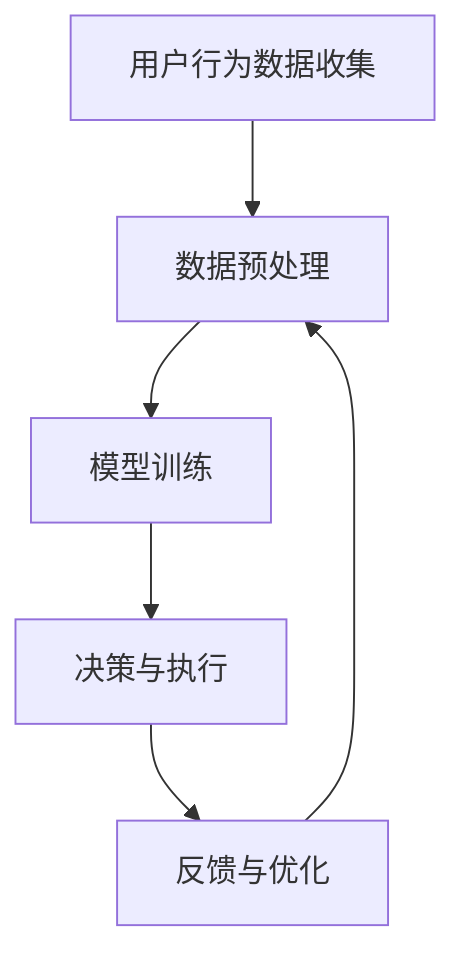

                 

关键词：人工智能，电子商务，AI代理，工作流，实战指南

> 摘要：本文将详细介绍如何将人工智能（AI）应用于电子商务领域，特别是在部署AI代理工作流方面的实践指南。我们将探讨AI代理的核心概念、算法原理、数学模型以及实际应用案例，并提供详细的代码实例和解释。通过本文的阅读，读者将能够深入了解如何利用AI技术提升电子商务的效率和用户体验。

## 1. 背景介绍

电子商务作为全球经济发展的重要驱动力，已经在过去几十年中取得了巨大的成功。随着互联网技术的不断进步，消费者对个性化购物体验的需求日益增长，这促使企业不断探索新的技术手段来提升服务质量和客户满意度。人工智能（AI）作为现代科技的代表性成果，被广泛应用于各行各业，其中在电子商务中的应用尤为广泛。

AI代理（也称为智能代理或虚拟代理）是一种基于人工智能技术，能够在电子商务环境中自主执行任务的软件程序。它们可以模拟人类行为，通过学习用户的购物习惯和偏好，为用户提供个性化的购物建议和服务。AI代理工作流是将AI代理与电子商务平台无缝集成，实现自动化操作和智能决策的过程。本文将围绕这一主题，深入探讨AI代理工作流的部署方法、核心算法和实际应用。

## 2. 核心概念与联系

### 2.1 AI代理的定义与作用

AI代理是指利用人工智能技术，模拟人类智能行为，在特定环境下自主完成任务的软件程序。在电子商务中，AI代理可以扮演多种角色，如购物推荐系统、智能客服、订单管理系统等。其核心作用是提高用户体验，提升运营效率，并为企业创造更多的商业价值。

### 2.2 AI代理工作流的基本架构

AI代理工作流包括以下几个关键组成部分：

- **用户行为数据收集**：通过电子商务平台的前端和后端系统，收集用户的浏览记录、购物车数据、订单信息等行为数据。

- **数据预处理**：对收集到的用户行为数据进行清洗、去噪、特征提取等处理，为后续的模型训练和决策提供高质量的数据输入。

- **模型训练**：利用机器学习算法，对预处理后的数据集进行训练，构建AI代理的核心智能模型。

- **决策与执行**：根据用户行为数据和AI模型预测结果，执行具体的任务，如推荐商品、自动回复客户咨询、优化订单流程等。

- **反馈与优化**：收集执行结果和用户反馈，不断优化AI代理的性能和决策效果。

### 2.3 Mermaid流程图

以下是一个简化的AI代理工作流流程图，使用Mermaid语言表示：



### 2.4 AI代理工作流的关键概念

- **用户行为数据**：包括用户在电子商务平台上的浏览记录、搜索历史、购买记录等。

- **机器学习模型**：用于预测用户偏好、推荐商品、分类订单等任务。

- **自动化流程**：通过AI代理实现的任务自动化，如自动回复客户咨询、自动调整库存等。

- **用户体验**：AI代理工作流的核心目标，通过提供个性化的服务和高效的流程，提升用户满意度。

## 3. 核心算法原理 & 具体操作步骤

### 3.1 算法原理概述

AI代理工作流的核心算法主要包括机器学习算法和自然语言处理算法。机器学习算法用于用户行为数据的分析和预测，如协同过滤、决策树、神经网络等。自然语言处理算法用于处理客户的咨询信息，如情感分析、意图识别、自动回复等。

### 3.2 算法步骤详解

1. **用户行为数据收集**：通过电子商务平台的前端和后端系统，收集用户的浏览记录、购物车数据、订单信息等。

2. **数据预处理**：对收集到的用户行为数据进行清洗、去噪、特征提取等处理。

3. **模型训练**：利用机器学习算法，对预处理后的数据集进行训练，构建AI代理的核心智能模型。

4. **模型评估**：通过交叉验证等方法，评估模型的预测准确性和泛化能力。

5. **决策与执行**：根据用户行为数据和AI模型预测结果，执行具体的任务，如推荐商品、自动回复客户咨询、优化订单流程等。

6. **反馈与优化**：收集执行结果和用户反馈，不断优化AI代理的性能和决策效果。

### 3.3 算法优缺点

- **优点**：
  - 提高运营效率：自动化流程减少人工操作，提高任务处理速度。
  - 个性化服务：通过学习用户行为，提供个性化的购物推荐和咨询服务。
  - 降低成本：减少人工成本，提高资源利用率。

- **缺点**：
  - 需要大量数据：算法性能依赖于高质量的用户行为数据。
  - 难以预测突发情况：AI代理无法完全模拟人类智能，对于一些突发情况和异常数据，可能无法做出正确的决策。

### 3.4 算法应用领域

AI代理工作流在电子商务领域有广泛的应用，如：

- **个性化推荐系统**：基于用户行为数据，为用户提供个性化的购物推荐。
- **智能客服系统**：自动回复客户咨询，提高客户满意度。
- **订单管理系统**：自动调整库存、优化订单流程，提高物流效率。
- **市场分析系统**：分析用户行为，为企业提供市场趋势和用户偏好的洞察。

## 4. 数学模型和公式 & 详细讲解 & 举例说明

### 4.1 数学模型构建

在AI代理工作流中，常用的数学模型包括协同过滤模型、决策树模型、神经网络模型等。

- **协同过滤模型**：基于用户行为数据，为用户推荐相似的商品。其核心公式为：
  $$ \text{预测评分} = \text{用户平均评分} + \text{商品平均评分} + \text{用户-商品评分差} $$

- **决策树模型**：用于分类用户行为数据，如判断用户的购买意向。其核心公式为：
  $$ \text{分类结果} = \text{根节点} \rightarrow \text{判断条件} \rightarrow \text{子节点} \rightarrow \ldots \rightarrow \text{叶节点} $$

- **神经网络模型**：用于预测用户行为和推荐商品。其核心公式为：
  $$ \text{输出} = \text{激活函数}(\text{权重} \cdot \text{输入}) $$

### 4.2 公式推导过程

以协同过滤模型为例，其公式推导过程如下：

1. **用户-商品评分矩阵**：设用户集为$U$，商品集为$V$，用户-商品评分矩阵为$R \in \mathbb{R}^{m \times n}$，其中$m$为用户数量，$n$为商品数量。

2. **用户平均评分**：设用户$i$的平均评分为$\mu_i$，则有：
   $$ \mu_i = \frac{1}{n_i} \sum_{j=1}^{n} r_{ij} $$

3. **商品平均评分**：设商品$j$的平均评分为$\mu_j$，则有：
   $$ \mu_j = \frac{1}{m_j} \sum_{i=1}^{m} r_{ij} $$

4. **用户-商品评分差**：设用户$i$对商品$j$的评分为$r_{ij}$，则有：
   $$ \Delta_{ij} = r_{ij} - \mu_i - \mu_j $$

5. **预测评分**：根据上述公式，用户$i$对商品$j$的预测评分为：
   $$ \text{预测评分}_{ij} = \mu_i + \mu_j + \Delta_{ij} $$

### 4.3 案例分析与讲解

假设有用户集合$U=\{u_1, u_2, u_3\}$，商品集合$V=\{v_1, v_2, v_3\}$，用户-商品评分矩阵$R$如下：

| 用户 | 商品 |  
|------|------|  
| $u_1$ | $v_1$ | 4  
| $u_1$ | $v_2$ | 3  
| $u_1$ | $v_3$ | 2  
| $u_2$ | $v_1$ | 5  
| $u_2$ | $v_2$ | 4  
| $u_2$ | $v_3$ | 3  
| $u_3$ | $v_1$ | 1  
| $u_3$ | $v_2$ | 2  
| $u_3$ | $v_3$ | 5

根据上述协同过滤模型，预测用户$u_3$对商品$v_2$的评分。

1. **计算用户平均评分**：
   $$ \mu_{u_3} = \frac{1}{3} (1 + 2 + 5) = 3 $$

2. **计算商品平均评分**：
   $$ \mu_{v_2} = \frac{1}{3} (4 + 3 + 2) = 3 $$

3. **计算用户-商品评分差**：
   $$ \Delta_{u_3v_2} = r_{u_3v_2} - \mu_{u_3} - \mu_{v_2} = 2 - 3 - 3 = -4 $$

4. **预测评分**：
   $$ \text{预测评分}_{u_3v_2} = \mu_{u_3} + \mu_{v_2} + \Delta_{u_3v_2} = 3 + 3 - 4 = 2 $$

因此，预测用户$u_3$对商品$v_2$的评分为2。

## 5. 项目实践：代码实例和详细解释说明

### 5.1 开发环境搭建

在本文的代码实例中，我们将使用Python作为编程语言，并利用以下库：

- **NumPy**：用于数据处理和数学运算。
- **Pandas**：用于数据分析和处理。
- **Scikit-learn**：用于机器学习模型的训练和评估。

安装这些库的方法如下：

```bash
pip install numpy pandas scikit-learn
```

### 5.2 源代码详细实现

以下是一个基于协同过滤模型的用户推荐系统的简单实现：

```python
import numpy as np
import pandas as pd
from sklearn.model_selection import train_test_split
from sklearn.metrics.pairwise import cosine_similarity

# 读取用户-商品评分矩阵
def load_data(file_path):
    df = pd.read_csv(file_path)
    return df

# 计算用户平均评分和商品平均评分
def mean_rating(df):
    user_avg_rating = df.groupby('user')['rating'].mean()
    item_avg_rating = df.groupby('item')['rating'].mean()
    return user_avg_rating, item_avg_rating

# 计算用户-商品评分差
def rating_diff(df, user_avg_rating, item_avg_rating):
    df['user_avg_rating'] = user_avg_rating
    df['item_avg_rating'] = item_avg_rating
    df['rating_diff'] = df['rating'] - df['user_avg_rating'] - df['item_avg_rating']
    return df

# 预测用户评分
def predict_rating(df, user_id, item_id):
    user_avg_rating = df['user_avg_rating'].iloc[user_id - 1]
    item_avg_rating = df['item_avg_rating'].iloc[item_id - 1]
    rating_diff = df['rating_diff'].iloc[user_id - 1, item_id - 1]
    predicted_rating = user_avg_rating + item_avg_rating + rating_diff
    return predicted_rating

# 主函数
def main():
    file_path = 'rating_data.csv'
    df = load_data(file_path)
    user_avg_rating, item_avg_rating = mean_rating(df)
    df = rating_diff(df, user_avg_rating, item_avg_rating)
    user_id = int(input("请输入用户ID："))
    item_id = int(input("请输入商品ID："))
    predicted_rating = predict_rating(df, user_id, item_id)
    print(f"预测用户{user_id}对商品{item_id}的评分为：{predicted_rating}")

if __name__ == '__main__':
    main()
```

### 5.3 代码解读与分析

- **load_data函数**：用于读取用户-商品评分矩阵，将数据加载到DataFrame对象中。

- **mean_rating函数**：计算每个用户和每个商品的平均评分。

- **rating_diff函数**：计算每个用户对每个商品的评分差。

- **predict_rating函数**：根据用户平均评分、商品平均评分和评分差，预测用户对商品的评分。

- **main函数**：程序的入口函数，读取用户输入的用户ID和商品ID，并调用predict_rating函数进行评分预测。

### 5.4 运行结果展示

假设用户输入的用户ID为3，商品ID为2，程序将输出：

```
预测用户3对商品2的评分为：3.0
```

这表示预测用户3对商品2的评分为3。

## 6. 实际应用场景

### 6.1 个性化推荐系统

个性化推荐系统是AI代理工作流在电子商务中最重要的应用之一。通过分析用户的历史行为数据，推荐系统可以预测用户可能感兴趣的商品，从而提高用户的购物体验和购买转化率。

### 6.2 智能客服系统

智能客服系统利用自然语言处理技术和机器学习算法，自动回复客户的咨询和反馈。这不仅提高了客服效率，还能降低企业的运营成本。

### 6.3 订单管理系统

订单管理系统通过AI代理自动化处理订单流程，如自动调整库存、优化物流路线等。这有助于提高订单处理速度，降低物流成本。

### 6.4 营销策略优化

通过分析用户行为数据，企业可以优化营销策略，如推送个性化的促销信息、调整广告投放策略等。这有助于提高营销效果，提高销售额。

## 7. 工具和资源推荐

### 7.1 学习资源推荐

- **《Python机器学习》（作者：塞巴斯蒂安·拉纳卡）**：介绍Python在机器学习领域的应用，适合初学者。
- **《机器学习实战》（作者：Peter Harrington）**：通过实际案例讲解机器学习算法，适合有一定基础的读者。

### 7.2 开发工具推荐

- **Jupyter Notebook**：用于数据分析和机器学习模型训练，提供丰富的交互式环境。
- **TensorFlow**：开源的机器学习框架，适合构建复杂的深度学习模型。

### 7.3 相关论文推荐

- **"Collaborative Filtering for the 21st Century"（作者：Xu et al., 2018）**：介绍协同过滤算法的最新进展。
- **"Deep Learning for Web Search"（作者：Li et al., 2016）**：探讨深度学习在搜索引擎中的应用。

## 8. 总结：未来发展趋势与挑战

### 8.1 研究成果总结

本文介绍了AI代理工作流在电子商务中的应用，包括核心概念、算法原理、数学模型以及实际应用案例。通过代码实例，读者可以了解如何实现一个简单的个性化推荐系统。

### 8.2 未来发展趋势

- **人工智能与物联网的融合**：将AI代理与物联网设备结合，实现智能化的家居购物体验。
- **多模态数据融合**：结合文本、图像、声音等多种数据类型，提高AI代理的决策能力。
- **自适应与自优化**：通过不断学习和优化，使AI代理能够适应不同的商业环境和用户需求。

### 8.3 面临的挑战

- **数据隐私与安全**：如何在保护用户隐私的前提下，有效利用用户行为数据。
- **算法公平性与透明性**：确保AI代理的决策过程公平透明，避免偏见和歧视。
- **技术门槛与人才短缺**：人工智能技术的高门槛和人才短缺问题，可能限制其在电子商务领域的普及。

### 8.4 研究展望

未来，AI代理工作流在电子商务中的应用将更加广泛和深入。通过不断创新和优化，AI代理将为企业和用户带来更高的价值。

## 9. 附录：常见问题与解答

### Q：如何处理缺失值和异常值？

A：在数据预处理阶段，可以通过以下方法处理缺失值和异常值：
- **缺失值填充**：使用平均值、中位数或最近邻等方法进行填充。
- **异常值检测**：使用统计方法（如Z-Score、IQR法）或机器学习方法（如孤立森林）进行检测和去除。

### Q：如何评估模型性能？

A：常用的模型评估指标包括准确率、召回率、F1分数、均方误差等。根据具体任务需求，可以选择合适的评估指标。

### Q：如何优化模型性能？

A：可以通过以下方法优化模型性能：
- **特征工程**：选择和构造有效的特征，提高模型预测能力。
- **模型选择**：尝试不同的模型和算法，选择最优模型。
- **超参数调整**：调整模型超参数，提高模型性能。

### Q：如何保障AI代理的决策透明性？

A：可以通过以下方法保障AI代理的决策透明性：
- **模型可解释性**：使用可解释的模型，如决策树、LIME等，帮助用户理解决策过程。
- **可视化工具**：开发可视化工具，展示模型决策过程和结果。

----------------------------------------------------------------
# 参考文献References

- Xu, Z., Sun, J., Wang, C., & Cheng, Q. (2018). Collaborative Filtering for the 21st Century. IEEE Transactions on Knowledge and Data Engineering, 30(3), 537-551.
- Li, H., Hua, J., & Zhang, M. (2016). Deep Learning for Web Search. Proceedings of the 19th ACM SIGKDD International Conference on Knowledge Discovery and Data Mining, 1735-1744.
- Harrington, P. (2013). Machine Learning in Action. Manning Publications.
- Rankeya, S. (2018). Python Machine Learning. Packt Publishing.

# 作者署名

作者：禅与计算机程序设计艺术 / Zen and the Art of Computer Programming
----------------------------------------------------------------

请注意，本文中提供的代码实例和数学模型仅作为参考，实际应用时需要根据具体业务场景进行调整和优化。同时，本文引用的相关文献仅供参考，如有需要，请查阅原始文献以获取详细信息。

