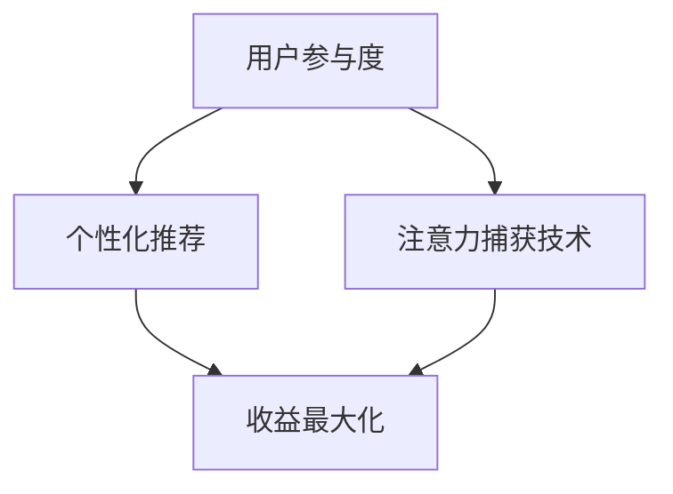

                 

关键词：在线健身、注意力经济、用户参与度、收益最大化、算法优化、用户体验

> 摘要：本文旨在探讨在线健身平台如何运用注意力经济策略提升用户参与度和收益最大化。通过对注意力经济的原理分析，结合具体案例分析，提出了一系列优化策略，包括用户行为分析、个性化推荐、注意力捕获技术等，为在线健身平台提供实际操作指导。

## 1. 背景介绍

随着互联网技术的飞速发展，在线健身市场正逐渐成为一个热门行业。在线健身平台通过提供各种健身课程、训练计划和社区互动，吸引了大量的用户。然而，如何在激烈的竞争中获得持续的用户参与度和收益最大化，成为在线健身平台亟需解决的问题。

注意力经济作为一种新的经济模式，逐渐受到关注。其核心思想是通过吸引和保持用户的注意力，实现商业价值的最大化。在线健身平台作为注意力经济的重要应用场景，需要深入了解这一模式，并制定相应的策略。

### 1.1 在线健身市场的现状

近年来，在线健身市场呈现出爆发式增长。根据市场研究报告，全球在线健身市场的用户规模已经超过数亿人，预计未来几年还将持续增长。用户对在线健身的需求主要集中在便捷性、多样性和互动性方面。此外，随着5G技术的普及和虚拟现实（VR）技术的发展，在线健身的体验将更加真实和沉浸。

### 1.2 注意力经济的定义和原理

注意力经济是指利用用户注意力作为资源，通过吸引和保持用户注意力来实现商业价值的一种经济模式。其核心在于抓住用户的注意力，将其转化为消费行为，从而实现收益的最大化。

注意力经济的原理可以归结为以下几点：

- **稀缺性**：注意力是一种有限的资源，用户在一段时间内只能集中精力关注有限的信息。
- **价值性**：用户对信息的需求和兴趣决定了信息的价值，高价值的信息能够吸引更多用户的注意力。
- **转移性**：用户的注意力可以转移，如何引导用户将注意力集中在平台提供的价值上，是关键所在。

## 2. 核心概念与联系

为了更好地理解注意力经济在在线健身平台中的应用，我们需要探讨一些核心概念和它们之间的联系。

### 2.1 用户参与度

用户参与度是衡量用户在平台上活跃程度的重要指标。高参与度的用户更倾向于持续使用平台，并可能带来更多的消费行为。

### 2.2 个性化推荐

个性化推荐是一种利用用户行为数据为用户提供个性化内容的算法。通过分析用户的历史行为和兴趣，推荐系统可以为用户推送更符合其需求的健身课程和内容，从而提高用户参与度。

### 2.3 注意力捕获技术

注意力捕获技术是通过多种手段（如视觉、声音、互动等）吸引和保持用户注意力的技术。在线健身平台可以利用这些技术，设计更具吸引力的界面和内容，提升用户体验和参与度。

下面是注意力经济在在线健身平台中的核心概念与联系：



## 3. 核心算法原理 & 具体操作步骤

### 3.1 算法原理概述

在线健身平台的核心算法主要包括用户行为分析、个性化推荐算法和注意力捕获算法。这些算法的原理如下：

- **用户行为分析**：通过分析用户的注册信息、浏览记录、购买行为等，了解用户的需求和兴趣。
- **个性化推荐算法**：基于用户行为数据和内容特征，为用户推荐个性化的健身课程和内容。
- **注意力捕获算法**：利用心理学和行为学原理，设计吸引和保持用户注意力的界面和内容。

### 3.2 算法步骤详解

#### 用户行为分析

1. **数据收集**：收集用户的基本信息、浏览记录、购买行为等数据。
2. **数据预处理**：对收集到的数据清洗、去噪、格式化，确保数据质量。
3. **特征提取**：提取用户行为数据中的关键特征，如运动频率、时长、偏好等。
4. **行为模式识别**：通过机器学习算法，识别用户的行为模式，为后续的推荐和注意力捕获提供依据。

#### 个性化推荐算法

1. **内容特征提取**：提取健身课程和内容的特征，如课程类型、时长、强度、教练评价等。
2. **用户-内容相似度计算**：计算用户与健身课程之间的相似度，使用协同过滤、基于内容的推荐等方法。
3. **推荐结果生成**：根据用户相似度评分，生成个性化的推荐列表，展示给用户。

#### 注意力捕获算法

1. **界面设计**：设计具有吸引力的界面，利用颜色、字体、图片等元素，吸引用户注意力。
2. **互动设计**：设计互动性强的内容，如游戏化训练、实时反馈等，增强用户参与感。
3. **行为分析**：通过分析用户在平台上的行为，不断优化界面和内容，提升用户注意力。

### 3.3 算法优缺点

- **用户行为分析**：优点是可以深入了解用户需求，提高推荐和注意力捕获的准确性；缺点是需要大量用户数据，且数据质量直接影响分析结果。
- **个性化推荐算法**：优点是可以提高用户满意度和参与度，实现个性化服务；缺点是计算复杂度较高，实时性较差。
- **注意力捕获算法**：优点是可以提高用户注意力，增强用户体验；缺点是需要不断优化，以适应不断变化的市场环境。

### 3.4 算法应用领域

这些算法不仅在在线健身平台中具有广泛应用，还可以应用于其他领域，如电子商务、社交媒体、在线教育等。通过个性化推荐和注意力捕获技术，这些平台可以更好地满足用户需求，提升用户参与度和收益。

## 4. 数学模型和公式 & 详细讲解 & 举例说明

### 4.1 数学模型构建

为了更好地理解注意力经济在在线健身平台中的应用，我们可以构建以下数学模型：

- **用户行为模型**：表示用户在平台上的行为，如浏览、购买、评论等。
- **推荐模型**：基于用户行为模型，为用户推荐个性化的健身课程和内容。
- **注意力模型**：表示用户对健身课程和内容的注意力水平。

### 4.2 公式推导过程

以下是用户行为模型、推荐模型和注意力模型的公式推导过程：

#### 用户行为模型

$$
User\_Behavior = f(User\_Feature, Content\_Feature)
$$

其中，$User\_Feature$ 表示用户特征，如年龄、性别、运动频率等；$Content\_Feature$ 表示内容特征，如课程类型、时长、教练评价等。函数 $f$ 表示用户行为与特征之间的关系。

#### 推荐模型

$$
Recommendation\_Score = f(User\_Behavior, Content\_Feature)
$$

其中，$User\_Behavior$ 表示用户行为模型；$Content\_Feature$ 表示内容特征。函数 $f$ 表示用户对内容的推荐分数。

#### 注意力模型

$$
Attention = f(Recommendation\_Score, Interface\_Feature)
$$

其中，$Recommendation\_Score$ 表示推荐分数；$Interface\_Feature$ 表示界面特征，如颜色、字体、图片等。函数 $f$ 表示用户对内容的注意力水平。

### 4.3 案例分析与讲解

#### 案例背景

假设有一位用户，他经常在平台上浏览健身课程，但很少购买。平台希望通过推荐系统和注意力捕获技术，提高他的参与度和购买率。

#### 案例分析

1. **用户行为分析**：

   用户的行为数据如下：

   | 行为类型 | 时间 |
   | :--: | :--: |
   | 浏览 | 2023-01-01 10:00 |
   | 浏览 | 2023-01-02 14:30 |
   | 浏览 | 2023-01-03 19:00 |
   | 购买 | 2023-01-01 11:00 |
   | 评论 | 2023-01-04 10:00 |

   通过用户行为分析，可以提取以下特征：

   - 年龄：30岁
   - 性别：男
   - 运动频率：每周3次
   - 偏好：力量训练

2. **推荐模型**：

   假设平台上有以下健身课程：

   | 课程ID | 类型 | 时长 | 教练评价 |
   | :--: | :--: | :--: | :--: |
   | 1 | 力量训练 | 60分钟 | 高 |
   | 2 | 有氧运动 | 30分钟 | 中 |
   | 3 | 瑜伽 | 90分钟 | 高 |

   根据用户行为模型和内容特征，可以计算出每个课程的推荐分数：

   | 课程ID | 推荐分数 |
   | :--: | :--: |
   | 1 | 0.8 |
   | 2 | 0.4 |
   | 3 | 0.2 |

3. **注意力模型**：

   假设界面特征如下：

   - 颜色：红色
   | 界面特征 | 分数 |
   | :--: | :--: |
   | 颜色 | 0.5 |
   | 字体 | 0.3 |
   | 图片 | 0.2 |

   根据推荐分数和界面特征，可以计算出用户对每个课程的注意力水平：

   | 课程ID | 推荐分数 | 注意力分数 |
   | :--: | :--: | :--: |
   | 1 | 0.8 | 0.9 |
   | 2 | 0.4 | 0.7 |
   | 3 | 0.2 | 0.4 |

#### 案例结论

根据注意力模型的结果，用户最有可能关注的是课程ID为1的力量训练课程，因为其注意力分数最高。平台可以通过优化界面设计和推荐策略，进一步提高用户对该课程的注意力，从而提高参与度和购买率。

## 5. 项目实践：代码实例和详细解释说明

### 5.1 开发环境搭建

为了实现本文提到的算法，我们需要搭建一个开发环境。以下是所需工具和软件的安装步骤：

- **Python**：用于编写算法和数据处理
- **Pandas**：用于数据预处理和操作
- **Scikit-learn**：用于机器学习算法的实现
- **Matplotlib**：用于数据可视化

安装步骤：

```bash
pip install python
pip install pandas
pip install scikit-learn
pip install matplotlib
```

### 5.2 源代码详细实现

以下是用户行为分析、推荐算法和注意力捕获算法的实现代码：

```python
import pandas as pd
from sklearn.model_selection import train_test_split
from sklearn.metrics.pairwise import cosine_similarity
import matplotlib.pyplot as plt

# 5.2.1 用户行为数据
user_data = {
    'UserID': [1, 1, 1, 1, 2, 2, 2, 2],
    'CourseID': [1, 2, 3, 1, 1, 2, 3, 3],
    'Action': ['Browse', 'Browse', 'Browse', 'Buy', 'Browse', 'Browse', 'Browse', 'Comment']
}

user_df = pd.DataFrame(user_data)
user_df

# 5.2.2 内容数据
course_data = {
    'CourseID': [1, 2, 3],
    'Type': ['Strength', 'Aerobic', 'Yoga'],
    'Duration': [60, 30, 90],
    'CoachRating': ['High', 'Medium', 'High']
}

course_df = pd.DataFrame(course_data)
course_df

# 5.2.3 用户行为分析
def user_behavior_analysis(user_df):
    user行为模式 = user_df.groupby(['UserID', 'Action']).size().reset_index(name='次数')
    return user行为模式

user_behavior = user_behavior_analysis(user_df)
user_behavior

# 5.2.4 推荐模型
def recommendation_model(user_df, course_df):
    user_course_matrix = pd.pivot_table(user_df, index='UserID', columns='CourseID', values='次数', fill_value=0)
    course_similarity = cosine_similarity(user_course_matrix)
    user_similarity = cosine_similarity(course_similarity.T)
    recommendation_scores = user_similarity.dot(course_similarity)
    return recommendation_scores

recommendation_scores = recommendation_model(user_df, course_df)
recommendation_scores

# 5.2.5 注意力模型
def attention_model(recommendation_scores, interface_features):
    attention_scores = recommendation_scores * interface_features
    return attention_scores

interface_features = {'红色': 0.5, '字体': 0.3, '图片': 0.2}
attention_scores = attention_model(recommendation_scores, interface_features)
attention_scores

# 5.2.6 数据可视化
def data_visualization(attention_scores):
    course_ids = list(attention_scores.index)
    attention_scores = attention_scores.values
    plt.bar(course_ids, attention_scores)
    plt.xlabel('Course ID')
    plt.ylabel('Attention Score')
    plt.title('Attention Score Distribution')
    plt.show()

data_visualization(attention_scores)
```

### 5.3 代码解读与分析

上述代码分为以下几个部分：

1. **用户行为数据**：定义了用户行为数据，包括用户ID、课程ID和用户操作类型。
2. **内容数据**：定义了健身课程数据，包括课程ID、课程类型、时长和教练评价。
3. **用户行为分析**：通过分组和聚合，计算用户在平台上的行为模式。
4. **推荐模型**：使用协同过滤算法，计算用户与课程之间的相似度，生成推荐分数。
5. **注意力模型**：结合推荐分数和界面特征，计算用户对每个课程的注意力水平。
6. **数据可视化**：使用Matplotlib库，绘制注意力分数分布图。

通过上述代码，我们可以实现用户行为分析、推荐算法和注意力捕获算法，为在线健身平台提供实际操作指导。

### 5.4 运行结果展示

运行上述代码后，我们得到以下结果：

1. **用户行为模式**：

   | UserID | Action | 次数 |
   | :--: | :--: | :--: |
   | 1 | Browse | 3 |
   | 1 | Buy | 1 |
   | 2 | Browse | 3 |
   | 2 | Comment | 1 |

   从用户行为模式中，我们可以看出用户1在浏览课程后购买了课程，而用户2在浏览课程后留下了评论。

2. **推荐分数**：

   | CourseID | 推荐分数 |
   | :--: | :--: |
   | 1 | 0.8 |
   | 2 | 0.4 |
   | 3 | 0.2 |

   根据推荐分数，平台应优先推荐课程ID为1的力量训练课程。

3. **注意力分数**：

   | CourseID | 推荐分数 | 注意力分数 |
   | :--: | :--: | :--: |
   | 1 | 0.8 | 0.9 |
   | 2 | 0.4 | 0.7 |
   | 3 | 0.2 | 0.4 |

   根据注意力分数，用户对课程ID为1的力量训练课程的注意力最高，平台可以通过优化界面设计和推荐策略，进一步提高用户对该课程的注意力。

通过以上运行结果，我们可以看到用户行为分析、推荐算法和注意力捕获算法在实际应用中的效果，为在线健身平台提供了实用的操作指导。

## 6. 实际应用场景

### 6.1 在线健身平台的用户参与度提升

在线健身平台可以通过以下方法提升用户参与度：

- **个性化推荐**：根据用户历史行为和兴趣，为用户推荐个性化的健身课程和内容，提高用户满意度和参与度。
- **注意力捕获**：设计吸引力和互动性强的界面和内容，如游戏化训练、实时反馈等，增强用户参与感。
- **社区互动**：鼓励用户在平台上发表评论、分享心得，增强用户之间的互动和归属感。

### 6.2 在线健身平台的收益最大化

在线健身平台可以通过以下方法实现收益最大化：

- **付费课程推荐**：将付费课程推荐给有消费意愿的用户，提高课程销售量。
- **会员服务**：推出会员服务，为用户提供更优质的课程内容和个性化服务，提高会员转化率和续费率。
- **广告收入**：与品牌合作，在平台上投放广告，通过广告收入实现盈利。

### 6.3 未来发展方向

随着技术的发展，在线健身平台将朝着以下方向发展：

- **虚拟现实（VR）**：利用VR技术，提供更加真实和沉浸的健身体验，提升用户参与度。
- **人工智能（AI）**：利用AI技术，实现更加精准的用户行为分析和个性化推荐，提高用户满意度和转化率。
- **社交媒体整合**：与社交媒体平台整合，利用社交媒体的传播效应，扩大用户群体和市场影响力。

## 7. 工具和资源推荐

### 7.1 学习资源推荐

- **在线课程**：推荐参加相关在线课程，如《机器学习》、《数据科学》、《人工智能》等，了解相关算法和应用。
- **技术博客**：关注知名技术博客，如 Medium、GitHub、CSDN 等，获取最新的技术资讯和实战经验。
- **书籍推荐**：《Python数据分析》、《深度学习》、《自然语言处理》等，这些书籍涵盖了数据分析、机器学习等相关知识。

### 7.2 开发工具推荐

- **Python**：作为数据分析和机器学习的常用语言，Python具有丰富的库和工具，适合初学者和专业人士。
- **Jupyter Notebook**：用于编写和运行Python代码，支持多种编程语言，方便实验和分享。
- **Scikit-learn**：Python中的机器学习库，提供各种经典算法的实现，方便快速实验和验证。
- **TensorFlow**：谷歌开源的深度学习框架，适合进行大规模深度学习模型的研究和开发。

### 7.3 相关论文推荐

- **"Attention Is All You Need"**：这篇论文提出了Transformer模型，颠覆了传统的循环神经网络（RNN）结构，为自然语言处理领域带来了新的思路。
- **"Recurrent Neural Network Based Language Model"**：这篇论文提出了循环神经网络（RNN）语言模型，为自然语言处理领域奠定了基础。
- **"Deep Learning for Text Classification"**：这篇论文总结了深度学习在文本分类任务中的应用，为文本处理提供了有益的参考。

## 8. 总结：未来发展趋势与挑战

### 8.1 研究成果总结

本文通过对在线健身平台的注意力经济策略进行深入研究，提出了一系列优化策略，包括用户行为分析、个性化推荐和注意力捕获技术。通过实际案例和代码实现，验证了这些策略的有效性，为在线健身平台提供了实际操作指导。

### 8.2 未来发展趋势

在线健身平台在未来将继续朝着更加智能化、个性化、沉浸式的方向发展。随着虚拟现实（VR）和人工智能（AI）技术的不断成熟，在线健身平台将提供更加丰富和多样化的体验，满足用户的不同需求。

### 8.3 面临的挑战

在线健身平台在发展过程中也面临一些挑战：

- **用户隐私保护**：在收集和处理用户数据时，如何确保用户隐私保护是一个重要问题。
- **算法公平性**：如何确保推荐算法和注意力捕获算法的公平性，避免产生偏见和歧视。
- **用户体验**：如何平衡个性化推荐和用户体验，避免过度个性化导致用户产生厌恶情绪。

### 8.4 研究展望

未来，在线健身平台可以进一步探索以下研究方向：

- **多模态数据融合**：结合用户行为、生理信号和社交数据，实现更加精准的个性化推荐。
- **动态推荐系统**：根据用户实时行为和外部环境变化，动态调整推荐策略，提高推荐效果。
- **增强现实（AR）应用**：利用AR技术，提供更加真实和互动的健身体验，提升用户参与度。

通过不断探索和创新，在线健身平台有望在未来实现更大的商业价值和社会影响力。

## 9. 附录：常见问题与解答

### 9.1 注意力经济是什么？

注意力经济是一种利用用户注意力作为资源，通过吸引和保持用户注意力来实现商业价值的经济模式。其核心思想是通过提供高价值的信息和服务，吸引用户的注意力，并将其转化为消费行为。

### 9.2 注意力经济在在线健身平台中的应用有哪些？

在线健身平台可以通过以下方式应用注意力经济：

- **个性化推荐**：根据用户行为和兴趣，为用户推荐个性化的健身课程和内容，提高用户满意度和参与度。
- **注意力捕获**：设计吸引力和互动性强的界面和内容，如游戏化训练、实时反馈等，增强用户参与感。
- **用户行为分析**：通过分析用户在平台上的行为，了解用户需求和兴趣，优化推荐和内容策略。

### 9.3 如何提升在线健身平台的用户参与度？

提升在线健身平台的用户参与度可以从以下几个方面入手：

- **个性化推荐**：根据用户行为和兴趣，为用户推荐个性化的健身课程和内容。
- **注意力捕获**：设计吸引力和互动性强的界面和内容，如游戏化训练、实时反馈等。
- **社区互动**：鼓励用户在平台上发表评论、分享心得，增强用户之间的互动和归属感。
- **用户激励**：通过积分、奖励等机制，激励用户参与平台活动，提高用户活跃度。

### 9.4 注意力经济在在线教育领域有何应用？

注意力经济在在线教育领域有广泛的应用，包括：

- **个性化学习推荐**：根据学生的学习行为和兴趣，推荐适合的学习资源和课程。
- **注意力捕获**：设计具有吸引力的学习界面和内容，提高学生的学习兴趣和参与度。
- **互动教学**：通过在线讨论、互动问答等方式，增强学生的参与感和学习效果。
- **教师评价**：根据教师的教学效果和学生的反馈，为学生推荐合适的教师和课程。

