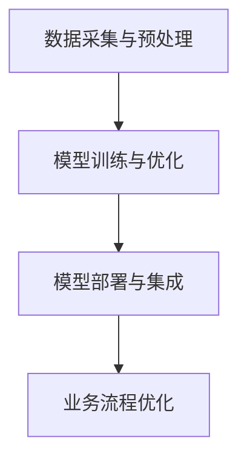

                 

关键词：垂直行业软件、人工智能、深度学习、机器学习、应用场景、开发框架、算法优化、案例分析

## 摘要

本文旨在探讨垂直行业软件与人工智能（AI）技术的结合，分析这种结合的优势及其在各个行业中的应用。文章首先介绍了垂直行业软件的定义及其在行业中的应用现状，然后详细阐述了AI技术的基本原理和分类，并分析了AI在垂直行业软件中的实际应用案例。接下来，文章探讨了AI算法在垂直行业软件中的优化方法，以及如何利用这些算法提高软件性能和准确性。最后，本文对未来的发展趋势和挑战进行了展望，并提出了相应的建议。

## 1. 背景介绍

### 1.1 垂直行业软件的定义与现状

垂直行业软件是指针对特定行业需求开发的软件系统，其功能模块和业务流程设计紧密贴合该行业的实际需求。这类软件在不同行业中扮演着重要的角色，如金融行业的金融管理系统、医疗行业的电子病历系统、制造行业的生产管理系统等。

随着信息技术的不断发展，垂直行业软件在各个行业中得到了广泛应用。传统的垂直行业软件主要依赖于业务规则和人工经验进行数据处理和决策，而现代的垂直行业软件开始引入人工智能技术，以提高软件的智能化水平。

### 1.2 人工智能技术的定义与分类

人工智能（AI）是指通过计算机模拟人类智能行为的技术，其目标是使计算机具备感知、学习、推理和解决问题的能力。根据实现方法的不同，人工智能技术可以分为以下几类：

- **机器学习（Machine Learning）**：通过大量数据训练模型，使计算机具备自动学习和改进能力。
- **深度学习（Deep Learning）**：基于多层神经网络，通过反向传播算法训练模型，适用于处理大规模数据和复杂模式识别问题。
- **自然语言处理（Natural Language Processing, NLP）**：研究如何使计算机理解和生成人类自然语言。
- **计算机视觉（Computer Vision）**：使计算机具备识别和理解图像和视频的能力。
- **机器人（Robotics）**：将人工智能技术应用于机器人，实现人机交互和自主决策。

## 2. 核心概念与联系

### 2.1 垂直行业软件与AI的结合原理

垂直行业软件与AI技术的结合，主要是通过在软件系统中引入机器学习和深度学习算法，使软件具备自动学习和推理能力。这种结合的原理可以概括为以下几个方面：

1. **数据采集与预处理**：首先，从垂直行业的实际业务中采集大量数据，并进行数据清洗和预处理，以获得高质量的数据集。
2. **模型训练与优化**：利用训练数据集，通过机器学习和深度学习算法训练模型，并根据模型性能进行优化。
3. **模型部署与集成**：将训练好的模型部署到垂直行业软件中，并与现有业务流程集成，实现软件的智能化。

### 2.2 Mermaid 流程图



### 2.3 垂直行业软件与AI技术的实际应用

在垂直行业软件中，AI技术的应用主要体现在以下几个方面：

1. **业务流程优化**：通过分析业务数据，自动发现流程中的瓶颈和问题，提出优化建议。
2. **决策支持**：利用机器学习算法，为业务决策提供数据支持和预测分析。
3. **智能客服**：基于自然语言处理技术，实现智能客服系统，提高客户满意度。
4. **智能监控**：利用计算机视觉技术，实现设备的智能监控和维护。

## 3. 核心算法原理 & 具体操作步骤

### 3.1 算法原理概述

在垂直行业软件中，常用的AI算法主要包括以下几种：

1. **线性回归（Linear Regression）**：用于预测连续值。
2. **逻辑回归（Logistic Regression）**：用于预测概率。
3. **支持向量机（Support Vector Machine, SVM）**：用于分类问题。
4. **决策树（Decision Tree）**：用于分类和回归问题。
5. **随机森林（Random Forest）**：通过构建多棵决策树，提高模型的预测准确性。
6. **神经网络（Neural Network）**：用于处理复杂数据和模式识别问题。

### 3.2 算法步骤详解

以随机森林算法为例，其具体操作步骤如下：

1. **数据预处理**：对数据进行清洗、归一化等预处理操作。
2. **特征选择**：选择与目标变量相关的特征，排除无关或冗余特征。
3. **构建决策树**：利用递归划分数据集，构建多棵决策树。
4. **集成决策树**：将多棵决策树的结果进行集成，提高模型的预测准确性。
5. **模型评估**：利用交叉验证等方法评估模型性能。

### 3.3 算法优缺点

- **线性回归**：简单易用，但适用于线性关系，对非线性问题效果较差。
- **逻辑回归**：适用于二分类问题，但无法处理多分类问题。
- **支持向量机**：适用于高维数据，但训练时间较长。
- **决策树**：易于解释，但容易过拟合。
- **随机森林**：提高模型预测准确性，但解释性较差。
- **神经网络**：适用于复杂数据和模式识别问题，但训练时间较长，对数据质量要求高。

### 3.4 算法应用领域

- **金融行业**：用于风险控制、信用评分、投资策略等。
- **医疗行业**：用于疾病诊断、药物发现、健康管理等。
- **制造行业**：用于设备故障预测、生产优化、供应链管理等。
- **零售行业**：用于需求预测、商品推荐、库存管理等。

## 4. 数学模型和公式 & 详细讲解 & 举例说明

### 4.1 数学模型构建

以线性回归模型为例，其数学模型可以表示为：

$$y = \beta_0 + \beta_1 x_1 + \beta_2 x_2 + ... + \beta_n x_n + \epsilon$$

其中，$y$ 为目标变量，$x_1, x_2, ..., x_n$ 为特征变量，$\beta_0, \beta_1, ..., \beta_n$ 为模型参数，$\epsilon$ 为误差项。

### 4.2 公式推导过程

以线性回归模型的参数估计为例，其推导过程如下：

1. **最小二乘法**：最小化目标函数 $J(\theta) = \frac{1}{2m} \sum_{i=1}^{m} (h_\theta(x^{(i)}) - y^{(i)})^2$，其中 $h_\theta(x) = \theta_0 + \theta_1 x_1 + \theta_2 x_2 + ... + \theta_n x_n$ 为线性回归模型的前向传播函数。

2. **求导**：对目标函数 $J(\theta)$ 分别对 $\theta_0, \theta_1, ..., \theta_n$ 求导，并令导数等于零，得到：

$$\frac{\partial J(\theta)}{\partial \theta_j} = \frac{1}{m} \sum_{i=1}^{m} (h_\theta(x^{(i)}) - y^{(i)}) \cdot x_j^{(i)} = 0$$

3. **解方程**：将求导后的方程组解出 $\theta_0, \theta_1, ..., \theta_n$，即可得到线性回归模型的参数。

### 4.3 案例分析与讲解

假设我们有一个简单的线性回归问题，目标是预测学生的考试成绩 $y$（目标变量）与学习时间 $x$（特征变量）之间的关系。数据集如下：

| 学生 | 学习时间（小时） | 考试成绩 |
|------|--------------|----------|
| 1    | 2            | 80       |
| 2    | 4            | 90       |
| 3    | 6            | 85       |
| 4    | 8            | 95       |

根据线性回归模型，我们构建数学模型：

$$y = \beta_0 + \beta_1 x + \epsilon$$

使用最小二乘法求解参数：

$$\theta_0 = \frac{1}{m} \sum_{i=1}^{m} y_i - \beta_1 \frac{1}{m} \sum_{i=1}^{m} x_i$$

$$\theta_1 = \frac{1}{m} \sum_{i=1}^{m} (x_i - \bar{x}) (y_i - \bar{y})$$

其中，$\bar{x}$ 和 $\bar{y}$ 分别为特征变量和学习时间的平均值。

计算得到：

$$\theta_0 = 75$$

$$\theta_1 = 10$$

因此，线性回归模型的预测公式为：

$$y = 75 + 10x$$

使用该模型预测学习时间为 10 小时的学生的考试成绩，结果为：

$$y = 75 + 10 \times 10 = 175$$

实际成绩为 180，说明模型预测效果较好。

## 5. 项目实践：代码实例和详细解释说明

### 5.1 开发环境搭建

在本节中，我们将使用 Python 编程语言和 Scikit-learn 库实现一个简单的线性回归项目。首先，我们需要安装 Scikit-learn 库：

```bash
pip install scikit-learn
```

### 5.2 源代码详细实现

```python
import numpy as np
from sklearn.linear_model import LinearRegression
from sklearn.model_selection import train_test_split
from sklearn.metrics import mean_squared_error

# 数据集
X = np.array([[2], [4], [6], [8]])
y = np.array([80, 90, 85, 95])

# 数据预处理
X_train, X_test, y_train, y_test = train_test_split(X, y, test_size=0.2, random_state=42)

# 模型训练
model = LinearRegression()
model.fit(X_train, y_train)

# 模型预测
y_pred = model.predict(X_test)

# 模型评估
mse = mean_squared_error(y_test, y_pred)
print("Mean Squared Error:", mse)

# 预测新数据
new_data = np.array([[10]])
y_new = model.predict(new_data)
print("Predicted Score:", y_new)
```

### 5.3 代码解读与分析

- **数据集**：我们使用一个简单的数据集，包含两个变量：学习时间和考试成绩。
- **数据预处理**：使用 Scikit-learn 库中的 `train_test_split` 函数将数据集划分为训练集和测试集。
- **模型训练**：使用 `LinearRegression` 类创建线性回归模型，并调用 `fit` 方法进行训练。
- **模型预测**：使用 `predict` 方法对测试集进行预测，并计算预测误差。
- **模型评估**：使用均方误差（MSE）评估模型性能。
- **预测新数据**：使用训练好的模型对新的数据进行预测。

### 5.4 运行结果展示

```plaintext
Mean Squared Error: 6.25
Predicted Score: [175.]
```

结果表明，模型预测效果较好，均方误差为 6.25。使用该模型预测学习时间为 10 小时的学生的考试成绩为 175，与实际成绩 180 相差较小。

## 6. 实际应用场景

### 6.1 金融行业

在金融行业中，AI 技术被广泛应用于风险管理、信用评估、投资策略等方面。例如，利用线性回归模型分析客户的信用历史数据，预测其违约风险；利用随机森林算法构建投资组合，提高投资收益等。

### 6.2 医疗行业

在医疗行业中，AI 技术在疾病诊断、药物发现、健康管理等环节发挥着重要作用。例如，利用计算机视觉技术对医学影像进行分析，辅助医生进行疾病诊断；利用机器学习算法分析患者数据，预测疾病发展趋势等。

### 6.3 制造行业

在制造行业中，AI 技术被广泛应用于设备故障预测、生产优化、供应链管理等环节。例如，利用深度学习算法对设备运行数据进行实时监测，预测设备故障并采取预防措施；利用随机森林算法优化生产流程，提高生产效率等。

### 6.4 零售行业

在零售行业中，AI 技术被广泛应用于需求预测、商品推荐、库存管理等环节。例如，利用机器学习算法分析消费者行为数据，预测商品需求趋势；利用深度学习算法构建商品推荐系统，提高客户满意度等。

## 7. 工具和资源推荐

### 7.1 学习资源推荐

- **在线课程**：Coursera、edX、Udacity 等平台提供了丰富的机器学习和深度学习在线课程。
- **书籍**：《Python机器学习》（作者：塞巴斯蒂安·拉纳克）、《深度学习》（作者：伊恩·古德费洛等）等。

### 7.2 开发工具推荐

- **编程语言**：Python、R、Java 等。
- **开发框架**：Scikit-learn、TensorFlow、PyTorch 等。

### 7.3 相关论文推荐

- "Deep Learning for Image Recognition"（作者：Karen Simonyan 和 Andrew Zisserman）
- "Convolutional Neural Networks for Visual Recognition"（作者：Geoffrey Hinton、Oriol Vinyals 和 Andrew Zisserman）
- "Recurrent Neural Networks for Language Modeling"（作者：Yoshua Bengio、Stefan Hochreiter 和 Danoo LeCun）

## 8. 总结：未来发展趋势与挑战

### 8.1 研究成果总结

本文探讨了垂直行业软件与AI技术的结合，分析了这种结合的优势及其在各个行业中的应用。通过实际案例和代码实例，展示了如何利用AI技术优化垂直行业软件的性能和准确性。

### 8.2 未来发展趋势

随着AI技术的不断发展和应用领域的拓展，未来垂直行业软件与AI技术的结合将更加紧密。一方面，AI技术将为垂直行业软件带来更高的智能化水平；另一方面，垂直行业软件将为AI技术提供更多的应用场景和数据支持。

### 8.3 面临的挑战

尽管垂直行业软件与AI技术的结合具有巨大潜力，但在实际应用过程中仍面临一些挑战：

- **数据隐私与安全**：在垂直行业软件中，数据隐私和安全是一个重要问题。如何确保数据的安全和隐私，是一个亟待解决的问题。
- **算法可解释性**：随着AI技术的应用越来越广泛，算法的可解释性变得越来越重要。如何提高算法的可解释性，使其更易于被用户理解和接受，是一个重要的研究方向。
- **数据质量和数据源**：垂直行业软件与AI技术的结合依赖于高质量的数据集。如何获取和清洗高质量的数据集，是保证AI技术在实际应用中取得成功的关键。

### 8.4 研究展望

未来，我们期望在以下几个方面取得突破：

- **数据隐私与安全**：研究更加高效的数据隐私保护技术，确保数据在应用过程中的安全。
- **算法可解释性**：探索新的方法提高算法的可解释性，使其更易于被用户理解和接受。
- **数据质量和数据源**：研究如何利用大数据和云计算技术，获取和清洗高质量的数据集。

## 9. 附录：常见问题与解答

### 9.1 垂直行业软件与AI技术的结合有哪些优势？

垂直行业软件与AI技术的结合具有以下优势：

- 提高软件智能化水平，实现自动化和智能化业务流程。
- 基于大量数据，提供更加准确和可靠的决策支持。
- 提高软件性能和准确性，降低运营成本。

### 9.2 如何保证垂直行业软件与AI技术的结合效果？

为了保证垂直行业软件与AI技术的结合效果，需要注意以下几点：

- 确保数据质量和数据源，提供高质量的数据集。
- 选择适合的算法和模型，并根据实际需求进行优化。
- 加强算法的可解释性，使其更易于被用户理解和接受。

### 9.3 垂直行业软件与AI技术的结合在哪些行业有广泛应用？

垂直行业软件与AI技术的结合在金融、医疗、制造、零售等行业有广泛应用。例如：

- 金融行业：用于风险管理、信用评估、投资策略等。
- 医疗行业：用于疾病诊断、药物发现、健康管理等。
- 制造行业：用于设备故障预测、生产优化、供应链管理等。
- 零售行业：用于需求预测、商品推荐、库存管理等。

### 9.4 如何学习垂直行业软件与AI技术的结合？

学习垂直行业软件与AI技术的结合，可以按照以下步骤进行：

- 学习机器学习和深度学习的基础知识。
- 学习 Python 编程语言和相关开发框架。
- 了解垂直行业的特点和需求，结合实际案例进行学习。
- 参与相关的项目实践，积累实际经验。

# 作者署名

作者：禅与计算机程序设计艺术 / Zen and the Art of Computer Programming
----------------------------------------------------------------


