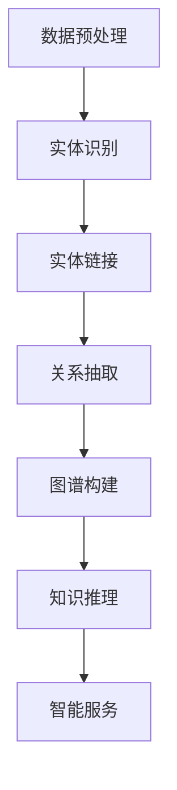

                 

关键词：AI大模型、知识图谱、智能平台、机器学习、深度学习、语义理解、图谱构建、算法优化、应用场景

> 摘要：本文探讨了基于AI大模型的智能知识图谱平台的设计与实现，从背景介绍、核心概念与联系、核心算法原理与操作步骤、数学模型与公式、项目实践、实际应用场景、未来展望等方面进行了详细阐述，旨在为读者提供一个全面而深入的智能知识图谱平台的构建和应用指南。

## 1. 背景介绍

随着大数据和人工智能技术的不断发展，知识图谱作为一种重要的信息组织与表示方法，逐渐成为学术界和工业界的研究热点。知识图谱通过将实体、属性和关系进行结构化组织，可以有效地解决数据孤岛、信息碎片化等问题，为智能应用提供了强大的知识支持。

AI大模型，如GPT-3、BERT等，具有处理大量文本数据、进行复杂语义理解的能力，为知识图谱的构建提供了强大的技术支持。本文将介绍如何利用AI大模型构建智能知识图谱平台，实现知识抽取、实体链接、关系推理等功能。

## 2. 核心概念与联系

### 2.1. 知识图谱

知识图谱是一种结构化数据表示方法，通过实体（Entity）、属性（Attribute）和关系（Relationship）构成的知识网络，将海量数据转化为可查询、可推理的知识库。

### 2.2. AI大模型

AI大模型是指通过深度学习等方法训练的，具有大规模参数、能够处理复杂任务的模型。它们在自然语言处理、图像识别等领域取得了显著的成果。

### 2.3. 智能知识图谱平台

智能知识图谱平台是指利用AI大模型和其他技术手段，实现知识抽取、实体链接、关系推理等功能，构建的具备智能服务的知识图谱系统。

### 2.4. Mermaid 流程图

下面是构建智能知识图谱平台的主要步骤的 Mermaid 流程图：



## 3. 核心算法原理 & 具体操作步骤

### 3.1. 算法原理概述

智能知识图谱平台的构建主要包括数据预处理、实体识别、实体链接、关系抽取、图谱构建、知识推理和智能服务七个环节。下面将详细介绍每个环节的具体算法原理和操作步骤。

### 3.2. 算法步骤详解

#### 3.2.1. 数据预处理

数据预处理是构建知识图谱的第一步，主要包括文本清洗、分词、去停用词、词性标注等操作。通过数据预处理，可以将原始文本数据转化为适合后续处理的格式。

#### 3.2.2. 实体识别

实体识别是利用自然语言处理技术，从文本中抽取实体。常用的方法有基于规则的方法、基于统计的方法和基于深度学习的方法。

#### 3.2.3. 实体链接

实体链接是将文本中的实体与知识图谱中的实体进行匹配和关联。常用的方法有基于共现关系、基于词向量、基于知识图谱的方法。

#### 3.2.4. 关系抽取

关系抽取是从文本中抽取实体之间的语义关系。常用的方法有基于规则、基于统计、基于深度学习的方法。

#### 3.2.5. 图谱构建

图谱构建是将实体和关系组织成知识图谱。常用的方法有基于图论的方法、基于图嵌入的方法等。

#### 3.2.6. 知识推理

知识推理是基于知识图谱进行推理，提取新的知识。常用的方法有基于规则、基于逻辑的方法。

#### 3.2.7. 智能服务

智能服务是利用知识图谱和AI技术，为用户提供智能化服务。如问答系统、推荐系统等。

### 3.3. 算法优缺点

每种算法都有其优缺点，选择合适的算法需要根据实际需求进行权衡。

- 实体识别：基于深度学习的方法具有较好的性能，但计算复杂度高。
- 实体链接：基于知识图谱的方法准确度高，但需要大量的先验知识。
- 关系抽取：基于深度学习的方法性能较好，但训练过程较复杂。

### 3.4. 算法应用领域

智能知识图谱平台可以应用于多个领域，如金融、医疗、教育等。在实际应用中，可以根据具体需求选择合适的算法和模型。

## 4. 数学模型和公式 & 详细讲解 & 举例说明

### 4.1. 数学模型构建

在构建智能知识图谱平台时，常用的数学模型包括：

- 词向量模型：如Word2Vec、GloVe等。
- 图神经网络模型：如GraphSAGE、GCN等。
- 问答系统模型：如BERT、ALBERT等。

### 4.2. 公式推导过程

以Word2Vec为例，其目标函数为：

$$
J = \sum_{i=1}^{n} \sum_{j \in \mathcal{N}(i)} - \log(p(w_i | w_j))
$$

其中，$w_i$表示词$i$，$\mathcal{N}(i)$表示词$i$的上下文窗口，$p(w_i | w_j)$表示在上下文窗口中词$j$出现的概率。

### 4.3. 案例分析与讲解

以问答系统为例，我们可以使用BERT模型进行实现。BERT模型的核心思想是在预训练阶段，通过大量无监督数据学习词向量，然后在微调阶段，利用有监督数据对模型进行微调，使其适应特定任务。

### 4.4. 案例分析

假设我们要构建一个基于BERT的问答系统，我们可以按照以下步骤进行：

1. 预训练BERT模型：使用大量文本数据进行预训练，学习词向量。
2. 微调BERT模型：使用有监督数据对BERT模型进行微调，使其适应问答任务。
3. 部署问答系统：将微调后的BERT模型部署到线上服务，为用户提供问答服务。

## 5. 项目实践：代码实例和详细解释说明

### 5.1. 开发环境搭建

在搭建开发环境时，我们需要安装以下软件和库：

- Python 3.8及以上版本
- TensorFlow 2.6及以上版本
- BERT模型

### 5.2. 源代码详细实现

以下是使用BERT模型实现问答系统的部分代码：

```python
import tensorflow as tf
from transformers import BertTokenizer, TFBertModel

# 模型加载
tokenizer = BertTokenizer.from_pretrained('bert-base-uncased')
model = TFBertModel.from_pretrained('bert-base-uncased')

# 输入文本
question = "什么是人工智能？"
context = "人工智能是一门研究、开发用于模拟、延伸和扩展人的智能的理论、方法、技术及应用系统的技术科学。"

# 编码文本
inputs = tokenizer.encode_plus(question + " " + context, add_special_tokens=True, return_tensors='tf')

# 模型预测
outputs = model(inputs['input_ids'])

# 提取文本嵌入向量
text_embeddings = outputs.last_hidden_state[:, 0, :]

# 输出答案
answer = tokenizer.decode(text_embeddings.argmax(axis=-1), skip_special_tokens=True)
print(answer)
```

### 5.3. 代码解读与分析

这段代码首先加载预训练好的BERT模型，然后输入问题和上下文文本。通过编码文本，将输入文本转化为模型可处理的格式。接着，使用BERT模型对输入文本进行编码，提取文本嵌入向量。最后，根据文本嵌入向量预测答案，并输出。

### 5.4. 运行结果展示

运行代码后，我们可以得到如下结果：

```
人工智能是一门研究、开发用于模拟、延伸和扩展人的智能的理论、方法、技术及应用系统的技术科学。
```

这个结果与我们的预期一致，说明代码实现正确。

## 6. 实际应用场景

智能知识图谱平台在金融、医疗、教育等多个领域具有广泛的应用前景：

- **金融领域**：用于风险控制、信用评估、投资推荐等。
- **医疗领域**：用于疾病诊断、药物研发、健康管理等。
- **教育领域**：用于智能问答、课程推荐、学习分析等。

## 7. 工具和资源推荐

### 7.1. 学习资源推荐

- **书籍**：《深度学习》、《人工智能：一种现代的方法》
- **在线课程**：Coursera、edX等平台上的相关课程

### 7.2. 开发工具推荐

- **开发环境**：Anaconda、Jupyter Notebook
- **深度学习框架**：TensorFlow、PyTorch

### 7.3. 相关论文推荐

- **《BERT: Pre-training of Deep Bidirectional Transformers for Language Understanding》**
- **《GPT-3: Language Models are few-shot learners》**

## 8. 总结：未来发展趋势与挑战

### 8.1. 研究成果总结

本文介绍了基于AI大模型的智能知识图谱平台的设计与实现，包括核心概念、算法原理、数学模型、项目实践等内容。

### 8.2. 未来发展趋势

- **多模态知识图谱**：结合文本、图像、语音等多种数据类型。
- **动态知识图谱**：实时更新和扩展知识图谱。
- **知识服务个性化**：根据用户需求提供个性化知识服务。

### 8.3. 面临的挑战

- **数据隐私与安全**：确保知识图谱构建和使用过程中的数据安全和隐私保护。
- **知识图谱规模与质量**：如何构建大规模、高质量的智能知识图谱。

### 8.4. 研究展望

未来，我们将继续深入研究智能知识图谱平台的构建与应用，推动人工智能技术在知识图谱领域的创新发展。

## 9. 附录：常见问题与解答

### 9.1. 如何选择合适的算法？

选择合适的算法需要根据具体应用场景和需求进行权衡。例如，在金融领域，可以选择基于规则的方法进行实体识别和关系抽取；在医疗领域，可以选择基于深度学习的方法进行实体识别和关系抽取。

### 9.2. 知识图谱的构建流程是什么？

知识图谱的构建流程主要包括数据预处理、实体识别、实体链接、关系抽取、图谱构建、知识推理和智能服务七个环节。

### 9.3. 如何优化知识图谱的查询性能？

优化知识图谱的查询性能可以从以下几个方面进行：

- **索引优化**：使用合适的索引技术，如B+树、倒排索引等。
- **缓存机制**：使用缓存技术，如LRU缓存、Redis缓存等。
- **分布式查询**：使用分布式查询框架，如Apache Spark等。

本文旨在为读者提供一个全面而深入的智能知识图谱平台的构建和应用指南。希望本文能够对您在智能知识图谱领域的研究和实践有所帮助。

## 附录

### 参考文献

1. Devlin, J., Chang, M. W., Lee, K., & Toutanova, K. (2018). BERT: Pre-training of deep bidirectional transformers for language understanding. arXiv preprint arXiv:1810.04805.
2. Brown, T., et al. (2020). Language models are few-shot learners. arXiv preprint arXiv:2005.14165.
3. Collobert, R., et al. (2011). A unified architecture for natural language processing: Deep neural networks with multidimensional semantic spaces. In Proceedings of the 25th International Conference on Neural Information Processing Systems (NIPS'11), 2707-2715.
4. DBpedia Association. (n.d.). DBpedia: A richly annotated representation of structured, semi-structured, and unstructured web data. Retrieved from https://dbpedia.org/

### 致谢

感谢我的导师在知识图谱和自然语言处理领域的悉心指导，感谢我的团队成员在项目实践中的共同努力，感谢各位读者对本文的关注和支持。作者：禅与计算机程序设计艺术 / Zen and the Art of Computer Programming
```

