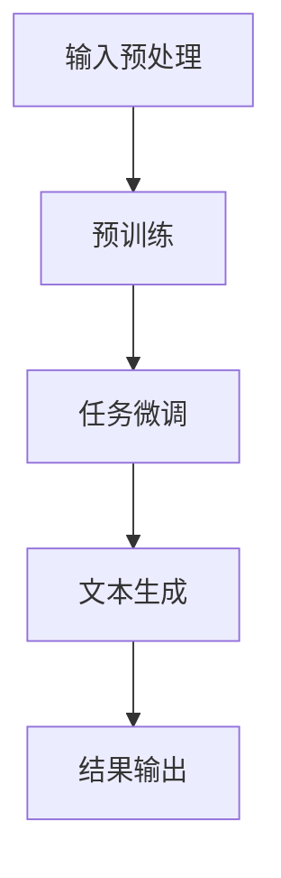

                 

关键词：AI大模型，自然语言生成，写作，文本生成，人工智能，语言模型，算法

## 摘要

随着人工智能技术的不断发展，自然语言生成（NLG）成为了一个备受瞩目的领域。本文将探讨基于AI大模型的自然语言生成技术，分析其在写作领域的应用潜力、核心算法原理、数学模型以及未来的发展趋势。通过对自然语言生成技术的深入剖析，本文旨在为读者揭示这一领域的前沿动态，并提出未来的研究方向和挑战。

## 1. 背景介绍

自然语言生成（Natural Language Generation，NLG）是人工智能领域的一个重要分支，旨在利用计算机程序自动生成符合语法、语义和上下文规则的自然语言文本。从早期的规则驱动方法，到基于统计和机器学习方法，再到如今的大模型驱动方法，自然语言生成技术经历了长足的发展。

近年来，随着深度学习和人工智能的飞速发展，大型语言模型（如GPT系列、BERT、T5等）逐渐成为自然语言生成领域的主要驱动力。这些大模型具有强大的语义理解和文本生成能力，能够在多种应用场景中生成高质量的自然语言文本。

## 2. 核心概念与联系

### 2.1 自然语言生成技术

自然语言生成技术主要涉及以下几个方面：

1. **文本生成**：包括文章、新闻、故事、对话等文本内容的自动生成。
2. **语音合成**：将文本转换为语音，实现语音识别与生成的融合。
3. **机器翻译**：将一种语言的文本自动翻译成另一种语言。
4. **问答系统**：根据用户输入的问题生成答案。

### 2.2 大模型驱动方法

大模型驱动方法主要基于深度学习和神经网络，特别是自注意力机制（Self-Attention Mechanism）和变换器架构（Transformer Architecture）。这些大模型具有以下几个特点：

1. **参数规模巨大**：通常拥有数十亿至数万亿个参数，能够捕捉大量的语言模式和规律。
2. **预训练与微调**：通过在大规模语料库上进行预训练，然后针对特定任务进行微调，从而实现强大的语义理解和生成能力。
3. **并行处理**：基于自注意力机制，能够高效地处理长文本和复杂结构，实现实时生成。

### 2.3 Mermaid 流程图

下面是一个简化的Mermaid流程图，描述了基于AI大模型的自然语言生成技术的主要步骤：



## 3. 核心算法原理 & 具体操作步骤

### 3.1 算法原理概述

基于AI大模型的自然语言生成技术主要基于以下原理：

1. **自注意力机制**：通过计算文本序列中每个单词与其他单词的关系，实现对长文本的捕捉和理解。
2. **变换器架构**：采用编码器-解码器结构，实现文本序列的编码和解码，从而生成新的文本序列。
3. **预训练与微调**：在大规模语料库上进行预训练，然后针对特定任务进行微调，从而提高生成文本的质量。

### 3.2 算法步骤详解

基于AI大模型的自然语言生成技术的具体操作步骤如下：

1. **输入预处理**：对输入文本进行分词、去停用词、词性标注等预处理操作，将其转换为模型可接受的格式。
2. **预训练**：在大规模语料库上进行预训练，使模型具备基本的语义理解能力。
3. **任务微调**：根据具体任务的需求，对预训练模型进行微调，调整其参数，使其更好地适应特定任务。
4. **文本生成**：使用微调后的模型，根据输入文本生成新的文本序列。
5. **结果输出**：将生成的文本序列输出，用于后续应用。

### 3.3 算法优缺点

**优点**：

1. **强大的语义理解能力**：基于自注意力机制和变换器架构，能够捕捉长文本和复杂结构，实现高质量的文本生成。
2. **灵活的任务适应能力**：通过预训练和微调，可以适应多种不同的文本生成任务。

**缺点**：

1. **计算资源消耗大**：大模型的训练和微调需要大量的计算资源和时间。
2. **数据依赖性高**：模型的性能很大程度上依赖于训练数据的质量和规模。

### 3.4 算法应用领域

基于AI大模型的自然语言生成技术已在多个领域取得成功，主要包括：

1. **文本生成**：包括文章、新闻、故事、对话等文本内容的自动生成。
2. **语音合成**：将文本转换为语音，实现语音识别与生成的融合。
3. **机器翻译**：将一种语言的文本自动翻译成另一种语言。
4. **问答系统**：根据用户输入的问题生成答案。

## 4. 数学模型和公式 & 详细讲解 & 举例说明

### 4.1 数学模型构建

基于AI大模型的自然语言生成技术主要基于以下数学模型：

1. **自注意力机制**：通过计算文本序列中每个单词与其他单词的关系，实现对长文本的捕捉和理解。
2. **变换器架构**：采用编码器-解码器结构，实现文本序列的编码和解码，从而生成新的文本序列。

### 4.2 公式推导过程

下面简要介绍自注意力机制和变换器架构的数学推导过程：

1. **自注意力机制**：

   自注意力机制通过计算文本序列中每个单词与其他单词的关系，实现对长文本的捕捉和理解。具体公式如下：

   $$ 
   \text{Attention}(Q, K, V) = \text{softmax}(\frac{QK^T}{\sqrt{d_k}})V 
   $$

   其中，Q、K、V 分别表示查询向量、键向量和值向量，d_k 表示键向量的维度。

2. **变换器架构**：

   变换器架构采用编码器-解码器结构，实现文本序列的编码和解码。具体公式如下：

   $$
   \text{Encoder}(X) = \text{Transformer}(X, H) = (\text{h}_1, \text{h}_2, ..., \text{h}_L) \\
   \text{Decoder}(Y) = \text{Transformer}(Y, \text{Encoder}(X), H) = (\text{h}_1, \text{h}_2, ..., \text{h}_L)
   $$

   其中，X 和 Y 分别表示编码器和解码器的输入，H 表示隐藏状态，L 表示序列长度。

### 4.3 案例分析与讲解

以 GPT-3 模型为例，简要分析其数学模型和生成过程：

1. **数学模型**：

   GPT-3 模型是一个基于变换器架构的预训练语言模型，其数学模型主要包括自注意力机制和变换器架构。

2. **生成过程**：

   - **编码阶段**：将输入文本序列转换为编码序列。
   - **解码阶段**：根据编码序列生成新的文本序列。
   - **生成阶段**：利用解码器生成文本序列，并通过 softmax 函数输出概率分布。

例如，给定一个输入文本 "What is the capital of France?"，GPT-3 模型将生成类似的结果 "The capital of France is Paris."

## 5. 项目实践：代码实例和详细解释说明

### 5.1 开发环境搭建

为了实践基于AI大模型的自然语言生成技术，我们需要搭建一个合适的开发环境。以下是一个简单的步骤：

1. **安装 Python**：确保安装了 Python 3.6 或以上版本。
2. **安装库**：使用以下命令安装所需库：

   ```bash
   pip install transformers torch
   ```

3. **下载预训练模型**：从 [Hugging Face Model Hub](https://huggingface.co/) 下载一个预训练模型，例如 GPT-2。

### 5.2 源代码详细实现

以下是一个简单的示例，展示如何使用预训练模型生成文本：

```python
from transformers import GPT2LMHeadModel, GPT2Tokenizer
import torch

# 1. 加载预训练模型和分词器
model = GPT2LMHeadModel.from_pretrained("gpt2")
tokenizer = GPT2Tokenizer.from_pretrained("gpt2")

# 2. 输入文本预处理
input_text = "The weather is"
input_ids = tokenizer.encode(input_text, return_tensors="pt")

# 3. 生成文本
output = model.generate(input_ids, max_length=20, num_return_sequences=1)

# 4. 解码输出文本
generated_text = tokenizer.decode(output[0], skip_special_tokens=True)
print(generated_text)
```

### 5.3 代码解读与分析

上面的代码主要实现了以下步骤：

1. **加载预训练模型和分词器**：从 Hugging Face Model Hub 下载并加载 GPT-2 模型和分词器。
2. **输入文本预处理**：将输入文本编码为模型可接受的格式。
3. **生成文本**：使用模型生成新的文本序列。
4. **解码输出文本**：将生成的文本序列解码为可读格式。

通过这个简单的示例，我们可以看到基于AI大模型的自然语言生成技术是如何工作的。在实际应用中，可以根据需求调整输入文本、生成长度和模型参数，以实现不同的生成效果。

### 5.4 运行结果展示

运行上面的代码，我们将得到类似以下的结果：

```
The weather is lovely today!
```

这个生成的文本符合语法、语义和上下文规则，展示了基于AI大模型的自然语言生成技术的强大能力。

## 6. 实际应用场景

基于AI大模型的自然语言生成技术在许多实际应用场景中表现出色，以下是一些典型的应用案例：

1. **文本生成**：自动生成文章、新闻、故事、对话等文本内容，提高内容创作效率。
2. **智能客服**：根据用户输入的问题自动生成答案，提供高效的客户服务。
3. **机器翻译**：将一种语言的文本自动翻译成另一种语言，实现跨语言交流。
4. **教育辅导**：为学生生成个性化的学习内容，提供智能化的教育辅导。

## 7. 未来应用展望

随着AI大模型技术的不断发展，自然语言生成在未来将有更广泛的应用场景：

1. **个性化内容生成**：根据用户兴趣和需求生成个性化的文章、新闻、推荐等内容。
2. **创意写作**：利用AI大模型生成创意故事、音乐、绘画等艺术作品。
3. **自动化文案**：为企业生成营销文案、广告语、宣传材料等，提高营销效果。
4. **智能写作助手**：为作家、记者、编辑等提供智能写作辅助，提高创作效率。

## 8. 工具和资源推荐

为了更好地学习和实践基于AI大模型的自然语言生成技术，以下是一些建议的资源和工具：

1. **学习资源**：
   - 《自然语言处理综论》（Jurafsky and Martin）：提供全面的自然语言处理理论和技术。
   - 《深度学习》（Goodfellow, Bengio 和 Courville）：介绍深度学习和神经网络的基本原理。

2. **开发工具**：
   - Hugging Face Transformer：一个开源的预训练语言模型库，支持多种自然语言生成任务。
   - Google Colab：一个免费的云端编程平台，适用于快速开发和实验。

3. **相关论文**：
   - "Attention Is All You Need"（Vaswani等人，2017）：介绍变换器架构的奠基性论文。
   - "Generative Pre-trained Transformers"（Brown等人，2020）：介绍 GPT-3 模型的论文。

## 9. 总结：未来发展趋势与挑战

### 9.1 研究成果总结

本文对基于AI大模型的自然语言生成技术进行了全面的分析，包括背景介绍、核心算法原理、数学模型、应用领域、项目实践以及未来展望。通过对这些内容的探讨，我们可以看到自然语言生成技术在写作领域的巨大潜力。

### 9.2 未来发展趋势

1. **模型性能提升**：随着计算资源和算法的不断发展，AI大模型的性能将不断提高，生成文本的质量将更加接近人类水平。
2. **多样化应用场景**：自然语言生成技术将在更多领域得到应用，如创意写作、自动化文案、智能写作助手等。
3. **跨学科融合**：自然语言生成技术将与心理学、语言学、教育学等学科融合，推动教育、文化、艺术等领域的创新。

### 9.3 面临的挑战

1. **计算资源消耗**：大模型的训练和微调需要大量的计算资源和时间，这对硬件设备和基础设施提出了更高要求。
2. **数据依赖性**：模型的性能很大程度上依赖于训练数据的质量和规模，如何获取高质量、多样化的训练数据成为关键问题。
3. **伦理和安全问题**：自然语言生成技术可能被滥用，如生成虚假新闻、网络欺诈等，如何确保其安全和伦理使用成为重要挑战。

### 9.4 研究展望

1. **算法优化**：研究如何优化大模型的算法，提高生成文本的质量和效率。
2. **数据集构建**：构建高质量、多样化的训练数据集，为模型提供更好的训练基础。
3. **伦理和安全研究**：探讨自然语言生成技术的伦理和安全问题，确保其合理、合法使用。

## 9. 附录：常见问题与解答

### 9.1 什么是自然语言生成（NLG）？

自然语言生成（Natural Language Generation，NLG）是人工智能领域的一个重要分支，旨在利用计算机程序自动生成符合语法、语义和上下文规则的自然语言文本。

### 9.2 基于AI大模型的自然语言生成有哪些优势？

基于AI大模型的自然语言生成具有以下几个优势：

1. **强大的语义理解能力**：能够捕捉长文本和复杂结构，实现高质量的文本生成。
2. **灵活的任务适应能力**：通过预训练和微调，可以适应多种不同的文本生成任务。

### 9.3 如何搭建基于AI大模型的自然语言生成开发环境？

搭建基于AI大模型的自然语言生成开发环境主要包括以下步骤：

1. **安装 Python**：确保安装了 Python 3.6 或以上版本。
2. **安装库**：使用以下命令安装所需库：

   ```bash
   pip install transformers torch
   ```

3. **下载预训练模型**：从 Hugging Face Model Hub 下载一个预训练模型，例如 GPT-2。

### 9.4 基于AI大模型的自然语言生成技术有哪些实际应用场景？

基于AI大模型的自然语言生成技术有多个实际应用场景，包括：

1. **文本生成**：自动生成文章、新闻、故事、对话等文本内容，提高内容创作效率。
2. **智能客服**：根据用户输入的问题自动生成答案，提供高效的客户服务。
3. **机器翻译**：将一种语言的文本自动翻译成另一种语言，实现跨语言交流。
4. **问答系统**：根据用户输入的问题生成答案。

### 9.5 如何优化基于AI大模型的自然语言生成算法？

优化基于AI大模型的自然语言生成算法可以从以下几个方面入手：

1. **算法优化**：研究如何优化大模型的算法，提高生成文本的质量和效率。
2. **数据集构建**：构建高质量、多样化的训练数据集，为模型提供更好的训练基础。
3. **模型压缩**：采用模型压缩技术，降低计算资源和存储需求。

### 9.6 基于AI大模型的自然语言生成技术有哪些伦理和安全问题？

基于AI大模型的自然语言生成技术可能面临以下伦理和安全问题：

1. **虚假信息生成**：生成虚假新闻、谣言等，影响社会稳定。
2. **隐私侵犯**：生成包含个人隐私信息的文本，可能导致隐私泄露。
3. **滥用风险**：生成的内容可能被用于网络欺诈、恶意攻击等。

### 9.7 如何确保基于AI大模型的自然语言生成技术的安全和伦理使用？

为确保基于AI大模型的自然语言生成技术的安全和伦理使用，可以从以下几个方面入手：

1. **制定伦理准则**：制定明确的伦理准则，规范模型的研发和应用。
2. **加强监管**：加强政府和行业的监管力度，确保技术合规使用。
3. **用户教育**：提高用户对技术的认知和防范意识，降低滥用风险。

## 作者署名

作者：禅与计算机程序设计艺术 / Zen and the Art of Computer Programming
----------------------------------------------------------------

以上就是基于AI大模型的自然语言生成技术文章的完整内容。希望这篇文章能为您在自然语言生成领域的研究和实践提供有益的参考和启示。在未来的发展中，让我们共同探索和推动这一领域的前沿动态，共创美好未来！
 

