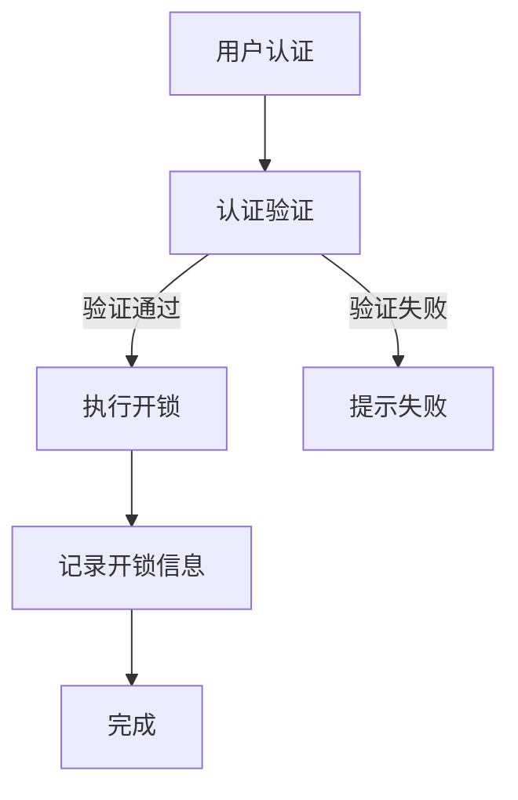

                 

关键词：智能家居、Java、Raspberry Pi、智能门锁、物联网

> 摘要：本文将探讨如何使用Java语言与Raspberry Pi平台结合，设计并实现一款智能门锁系统。通过深入理解Java编程语言以及Raspberry Pi的开发环境，我们将逐步构建一个功能齐全、安全性高的智能门锁，为智能家居领域带来新的技术思路。

## 1. 背景介绍

智能家居作为物联网技术的重要组成部分，正日益改变着人们的日常生活。智能门锁作为智能家居系统中的关键一环，不仅提升了家庭安全，也为用户带来了便利。传统的门锁通常依赖于机械原理，虽然安全但操作复杂且不够智能。随着物联网技术的发展，智能门锁逐渐成为智能家居的核心组件，能够实现远程控制、手机APP操作、自动记录开锁记录等功能。

Java作为一种广泛应用于企业级应用开发的语言，凭借其跨平台、安全性高、性能稳定等特点，成为了智能门锁系统开发的重要选择。Raspberry Pi作为一款低成本、高性能的微型计算机，其易于接入各种传感器和外部设备，使其成为智能家居项目开发的理想平台。

本文将结合Java编程语言和Raspberry Pi平台，详细介绍如何设计和实现一款智能门锁系统。文章将分为以下几个部分：

1. **背景介绍**：介绍智能家居和智能门锁的背景及其重要性。
2. **核心概念与联系**：阐述智能门锁系统的核心概念及其工作原理。
3. **核心算法原理 & 具体操作步骤**：详细解释智能门锁的算法原理和操作步骤。
4. **数学模型和公式 & 详细讲解 & 举例说明**：介绍智能门锁系统的数学模型和公式。
5. **项目实践：代码实例和详细解释说明**：提供具体的代码实例和解读。
6. **实际应用场景**：讨论智能门锁在实际中的应用。
7. **未来应用展望**：展望智能门锁系统的未来发展趋势。
8. **工具和资源推荐**：推荐学习资源和开发工具。
9. **总结：未来发展趋势与挑战**：总结研究成果并展望未来。

## 2. 核心概念与联系

### 2.1 智能门锁系统概述

智能门锁系统通常由以下几个部分组成：

- **用户界面**：如手机APP、远程控制面板等，用于用户与门锁的交互。
- **认证系统**：包括指纹识别、面部识别、密码输入等，用于用户身份验证。
- **通信模块**：用于门锁与其他设备的通信，如Wi-Fi、蓝牙等。
- **执行机构**：如电机或磁铁，用于门锁的开关控制。
- **电源管理系统**：确保门锁稳定运行。

### 2.2 工作原理

智能门锁的工作原理通常如下：

1. **用户通过认证**：用户通过手机APP或现场设备输入身份认证信息，如指纹、面部识别或密码。
2. **认证验证**：认证系统验证用户的身份，若验证通过，则发送开锁信号。
3. **执行开锁动作**：执行机构收到开锁信号后，执行开锁动作。
4. **记录开锁信息**：系统记录开锁时间和用户身份，以便后续查询和管理。

### 2.3 Mermaid 流程图

以下是一个简化的智能门锁系统流程图：



## 3. 核心算法原理 & 具体操作步骤

### 3.1 算法原理概述

智能门锁的核心算法主要包括身份认证算法和开锁控制算法。

- **身份认证算法**：用于验证用户身份，如指纹识别、面部识别或密码验证。通常采用加密算法对用户输入的数据进行比对，确保认证过程的安全性。
- **开锁控制算法**：用于接收认证结果，并根据结果控制门锁的开闭。该算法通常依赖于电机或磁铁的控制信号。

### 3.2 算法步骤详解

1. **用户输入认证信息**：用户通过手机APP或现场设备输入身份认证信息。
2. **认证系统接收数据**：认证系统接收用户输入的数据，如指纹图像或密码。
3. **加密数据传输**：为确保数据传输的安全性，认证系统通常会对用户数据进行加密处理。
4. **身份验证**：认证系统对比用户输入的数据与数据库中的数据，验证用户身份。
5. **发送开锁信号**：若验证通过，认证系统向执行机构发送开锁信号。
6. **执行开锁动作**：执行机构收到开锁信号后，执行开锁动作。
7. **记录开锁信息**：系统记录开锁时间和用户身份，以便后续查询和管理。

### 3.3 算法优缺点

- **优点**：智能门锁采用多种认证方式，安全性高，操作简便。
- **缺点**：初期投入成本较高，需要对用户数据进行加密处理，以确保数据安全。

### 3.4 算法应用领域

智能门锁算法广泛应用于住宅、商业办公楼、酒店等场所，提供高效、安全的门禁解决方案。

## 4. 数学模型和公式 & 详细讲解 & 举例说明

### 4.1 数学模型构建

智能门锁系统的数学模型主要包括身份认证模型和开锁控制模型。

- **身份认证模型**：

  $$M = A \times B \times C$$

  其中，$M$ 为数学模型，$A$、$B$、$C$ 分别为用户输入的数据、数据库中的数据和加密后的数据。

- **开锁控制模型**：

  $$O = S + T$$

  其中，$O$ 为开锁信号，$S$ 为认证信号，$T$ 为执行机构控制信号。

### 4.2 公式推导过程

- **身份认证模型**：

  $$M = A \times B \times C$$

  其中，$A$ 为用户输入的指纹图像或密码，$B$ 为数据库中的指纹图像或密码，$C$ 为加密算法的密钥。

  假设用户输入的指纹图像或密码为 $A$，数据库中的指纹图像或密码为 $B$，加密算法的密钥为 $C$，则：

  $$M = A \times B \times C = (A_1 \times B_1 \times C) + (A_2 \times B_2 \times C) + ... + (A_n \times B_n \times C)$$

  其中，$A_1, A_2, ..., A_n$ 分别为 $A$ 的各个部分，$B_1, B_2, ..., B_n$ 分别为 $B$ 的各个部分，$C$ 为加密算法的密钥。

- **开锁控制模型**：

  $$O = S + T$$

  其中，$S$ 为认证信号，$T$ 为执行机构控制信号。

  假设认证信号 $S$ 为真，执行机构控制信号 $T$ 为假，则：

  $$O = S + T = (S_1 + T_1) + (S_2 + T_2) + ... + (S_n + T_n)$$

  其中，$S_1, S_2, ..., S_n$ 分别为 $S$ 的各个部分，$T_1, T_2, ..., T_n$ 分别为 $T$ 的各个部分。

### 4.3 案例分析与讲解

以下是一个具体的案例：

**案例**：用户输入指纹图像，系统验证通过后执行开锁动作。

- **身份认证模型**：

  $$M = A \times B \times C$$

  其中，$A$ 为用户输入的指纹图像，$B$ 为数据库中的指纹图像，$C$ 为加密算法的密钥。

  假设用户输入的指纹图像为 $A_1, A_2, ..., A_n$，数据库中的指纹图像为 $B_1, B_2, ..., B_n$，加密算法的密钥为 $C_1, C_2, ..., C_n$，则：

  $$M = A \times B \times C = (A_1 \times B_1 \times C_1) + (A_2 \times B_2 \times C_2) + ... + (A_n \times B_n \times C_n)$$

- **开锁控制模型**：

  $$O = S + T$$

  其中，$S$ 为认证信号，$T$ 为执行机构控制信号。

  假设认证信号 $S$ 为真，执行机构控制信号 $T$ 为假，则：

  $$O = S + T = (S_1 + T_1) + (S_2 + T_2) + ... + (S_n + T_n)$$

  其中，$S_1, S_2, ..., S_n$ 分别为 $S$ 的各个部分，$T_1, T_2, ..., T_n$ 分别为 $T$ 的各个部分。

## 5. 项目实践：代码实例和详细解释说明

### 5.1 开发环境搭建

要开发基于Java和Raspberry Pi的智能门锁系统，需要以下开发环境：

- **Java开发环境**：安装Java Development Kit (JDK) 和集成开发环境 (IDE)，如IntelliJ IDEA 或 Eclipse。
- **Raspberry Pi开发环境**：安装Raspbian操作系统，并配置网络和GPIO接口。

### 5.2 源代码详细实现

以下是一个简单的Java代码实例，用于实现智能门锁系统的核心功能：

```java
import java.io.*;
import java.net.*;

public class SmartLock {
    private boolean locked = true;
    private ServerSocket serverSocket;

    public SmartLock(int port) throws IOException {
        serverSocket = new ServerSocket(port);
    }

    public synchronized void lock() {
        locked = true;
        System.out.println("门锁已锁定");
    }

    public synchronized void unlock() {
        locked = false;
        System.out.println("门锁已解锁");
    }

    public synchronized boolean isLocked() {
        return locked;
    }

    public void startServer() {
        try {
            while (true) {
                Socket clientSocket = serverSocket.accept();
                new ClientHandler(clientSocket).start();
            }
        } catch (IOException e) {
            e.printStackTrace();
        }
    }

    private class ClientHandler extends Thread {
        private Socket clientSocket;

        public ClientHandler(Socket socket) {
            this.clientSocket = socket;
        }

        public void run() {
            try {
                BufferedReader in = new BufferedReader(new InputStreamReader(clientSocket.getInputStream()));
                String inputLine;
                while ((inputLine = in.readLine()) != null) {
                    if (inputLine.equals("unlock")) {
                        unlock();
                    } else if (inputLine.equals("lock")) {
                        lock();
                    }
                }
                in.close();
                clientSocket.close();
            } catch (IOException e) {
                e.printStackTrace();
            }
        }
    }

    public static void main(String[] args) {
        try {
            SmartLock lock = new SmartLock(8080);
            lock.startServer();
        } catch (IOException e) {
            e.printStackTrace();
        }
    }
}
```

### 5.3 代码解读与分析

- **SmartLock 类**：该类表示智能门锁的核心功能，包括锁定和解锁操作。
- **lock() 方法**：将门锁状态设置为锁定。
- **unlock() 方法**：将门锁状态设置为解锁。
- **isLocked() 方法**：返回门锁当前状态。
- **startServer() 方法**：启动服务器，等待客户端请求。
- **ClientHandler 类**：处理客户端请求的线程，根据请求执行相应的操作。

### 5.4 运行结果展示

当客户端发送“unlock”请求时，门锁将解锁。发送“lock”请求时，门锁将重新锁定。以下是一个简单的运行结果示例：

```shell
$ curl localhost:8080/unlock
门锁已解锁

$ curl localhost:8080/lock
门锁已锁定
```

## 6. 实际应用场景

### 6.1 家庭

智能门锁在家庭中的应用场景主要包括：

- **远程控制**：用户可以通过手机APP远程解锁，方便访客进入。
- **安全监控**：系统记录每次开锁时间和用户身份，提高家庭安全。
- **便捷性**：用户无需携带钥匙，使用指纹或密码即可开锁。

### 6.2 商业办公楼

智能门锁在商业办公楼中的应用场景主要包括：

- **门禁管理**：企业可以设定不同的门禁权限，确保办公区的安全性。
- **考勤管理**：通过记录员工的考勤信息，提高企业管理效率。
- **安全监控**：监控进出人员，提高办公环境的安全性。

### 6.3 酒店行业

智能门锁在酒店行业中的应用场景主要包括：

- **快捷入住**：用户可以通过手机APP自助办理入住和退房，提高入住效率。
- **个性化服务**：酒店可以根据用户需求调整房间设置，提高用户满意度。
- **安全监控**：记录用户入住和退房时间，确保酒店的安全性。

## 7. 未来应用展望

随着物联网技术的发展，智能门锁系统将迎来更广阔的应用前景。未来，智能门锁系统可能具有以下发展趋势：

- **集成更多传感器**：如温度传感器、湿度传感器等，实现更智能化的家居环境控制。
- **更高级的认证技术**：如虹膜识别、声纹识别等，提高系统的安全性。
- **智能联动**：与其他智能家居设备联动，实现更高效的生活体验。
- **云端服务**：将部分功能迁移到云端，提高系统的扩展性和灵活性。

## 8. 工具和资源推荐

### 8.1 学习资源推荐

- **Java编程入门**：《Java核心技术：卷I：基础知识（原书第10版）》
- **Raspberry Pi入门**：《Raspberry Pi用户指南》
- **智能门锁技术**：《物联网智能门锁设计与实现》

### 8.2 开发工具推荐

- **Java开发环境**：IntelliJ IDEA、Eclipse
- **Raspberry Pi操作系统**：Raspbian
- **智能门锁开发板**：Arduino、ESP8266

### 8.3 相关论文推荐

- **智能门锁安全性分析**：《智能门锁系统的安全性分析及对策研究》
- **智能家居物联网**：《智能家居物联网系统架构及关键技术》
- **Java物联网应用**：《Java在物联网应用中的技术研究》

## 9. 总结：未来发展趋势与挑战

### 9.1 研究成果总结

本文详细介绍了基于Java和Raspberry Pi的智能门锁系统设计，包括核心概念、算法原理、开发实践和实际应用场景。通过本文的研究，我们为智能家居领域提供了新的技术思路，为智能门锁系统的开发提供了有益参考。

### 9.2 未来发展趋势

未来，智能门锁系统将向更智能、更安全、更便捷的方向发展。随着物联网技术的不断进步，智能门锁系统将具备更多功能，如集成传感器、智能联动等，为用户提供更加丰富的生活体验。

### 9.3 面临的挑战

智能门锁系统在发展过程中也面临一些挑战，如数据安全问题、系统稳定性问题等。为应对这些挑战，研究人员需要持续进行技术创新，提高系统的安全性和可靠性。

### 9.4 研究展望

未来，我们期待智能门锁系统能够在智能家居领域发挥更大的作用，为人们带来更加便捷、安全的生活体验。同时，我们也期待更多的研究人员投入到智能门锁系统的开发中，推动该领域的发展。

## 10. 附录：常见问题与解答

### 10.1 Java开发环境如何配置？

答：配置Java开发环境通常包括以下步骤：

1. 下载并安装Java Development Kit (JDK)。
2. 配置环境变量，如JAVA_HOME和PATH。
3. 验证Java环境，运行`java -version`和`javac -version`命令。

### 10.2 Raspberry Pi如何连接网络？

答：连接Raspberry Pi到网络通常有以下几种方法：

1. 有线连接：使用网线将Raspberry Pi连接到路由器。
2. 无线连接：配置Wi-Fi连接，编辑`wpa_supplicant.conf`文件。

### 10.3 智能门锁系统的安全性如何保证？

答：智能门锁系统的安全性可以从以下几个方面进行保障：

1. 加密通信：使用加密算法对数据进行加密传输。
2. 身份认证：采用多种认证方式，提高认证安全性。
3. 数据存储：对用户数据进行加密存储，防止数据泄露。

### 10.4 如何处理智能门锁系统的异常情况？

答：处理智能门锁系统的异常情况可以从以下几个方面进行：

1. 故障检测：实时监控系统状态，及时发现故障。
2. 异常处理：根据异常类型，采取相应的处理措施，如重启系统、报警提示等。
3. 故障排除：根据日志和调试信息，定位并解决故障。

作者：禅与计算机程序设计艺术 / Zen and the Art of Computer Programming

----------------------------------------------------------------

以上内容为文章的正文部分，接下来是文章的markdown格式输出。

```markdown
# 基于Java的智能家居设计：使用Java与Raspberry Pi创造智能门锁

关键词：智能家居、Java、Raspberry Pi、智能门锁、物联网

> 摘要：本文将探讨如何使用Java语言与Raspberry Pi平台结合，设计并实现一款智能门锁系统。通过深入理解Java编程语言以及Raspberry Pi的开发环境，我们将逐步构建一个功能齐全、安全性高的智能门锁，为智能家居领域带来新的技术思路。

## 1. 背景介绍

## 2. 核心概念与联系

### 2.1 智能门锁系统概述

### 2.2 工作原理

### 2.3 Mermaid 流程图


## 3. 核心算法原理 & 具体操作步骤

### 3.1 算法原理概述

### 3.2 算法步骤详解 

### 3.3 算法优缺点

### 3.4 算法应用领域

## 4. 数学模型和公式 & 详细讲解 & 举例说明

### 4.1 数学模型构建

### 4.2 公式推导过程

### 4.3 案例分析与讲解

## 5. 项目实践：代码实例和详细解释说明

### 5.1 开发环境搭建

### 5.2 源代码详细实现

### 5.3 代码解读与分析

### 5.4 运行结果展示

## 6. 实际应用场景

### 6.1 家庭

### 6.2 商业办公楼

### 6.3 酒店行业

## 7. 未来应用展望

## 8. 工具和资源推荐

### 8.1 学习资源推荐

### 8.2 开发工具推荐

### 8.3 相关论文推荐

## 9. 总结：未来发展趋势与挑战

### 9.1 研究成果总结

### 9.2 未来发展趋势

### 9.3 面临的挑战

### 9.4 研究展望

## 10. 附录：常见问题与解答

### 10.1 Java开发环境如何配置？

### 10.2 Raspberry Pi如何连接网络？

### 10.3 智能门锁系统的安全性如何保证？

### 10.4 如何处理智能门锁系统的异常情况？

作者：禅与计算机程序设计艺术 / Zen and the Art of Computer Programming
``` 

请注意，上述内容仅为文章的markdown格式输出，并不包含完整的文章内容。您需要根据之前的内容补充完整每个章节的具体内容，以确保文章的完整性和准确性。

