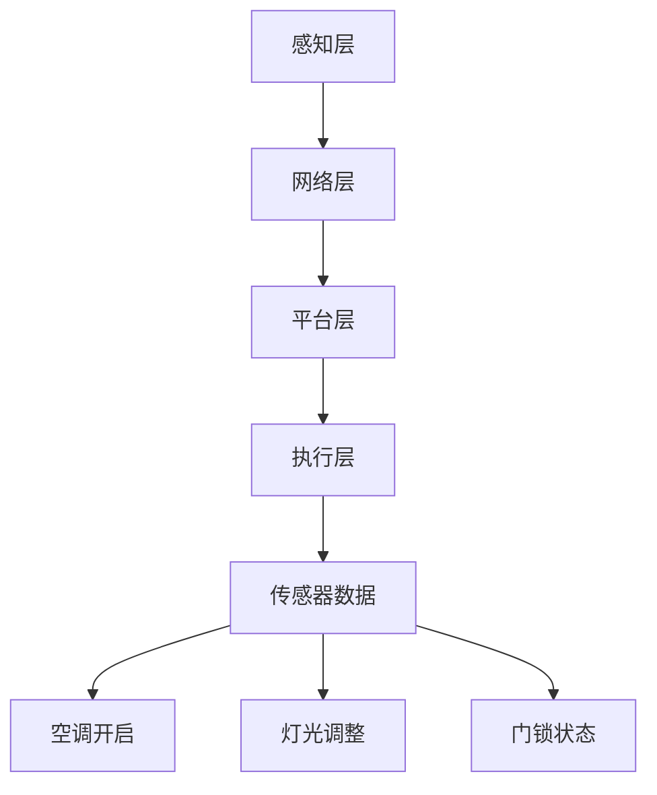

                 

关键词：智能家居、Java、规则引擎、自定义、编程、物联网、自动化、技术解决方案。

> 摘要：本文将深入探讨如何使用Java语言为智能家居系统开发自定义规则引擎。我们将讨论智能家居的背景、Java编程语言的优势、规则引擎的核心概念、算法原理、数学模型、项目实践，并展望其未来应用和挑战。

## 1. 背景介绍

随着物联网（IoT）技术的迅猛发展，智能家居市场正在迅速扩张。智能家居系统通过将家庭设备连接到互联网，实现了远程监控和控制，提高了生活便利性。然而，实现这一目标的关键在于一个强大的规则引擎，它能够根据家庭环境的变化自动调整设备状态，优化用户体验。

Java作为一门历史悠久且广泛应用于企业级开发的编程语言，具有跨平台、安全性高、可扩展性强等优点，使其成为开发智能家居规则引擎的理想选择。本文将围绕这一主题展开讨论，介绍如何使用Java编写一个自定义的规则引擎。

### 1.1 智能家居概述

智能家居是指利用网络技术，将家中的各种设备连接起来，实现自动化控制和远程监控的系统。它涵盖了照明控制、温度控制、安全监控、能源管理等多个方面，旨在提升居住的舒适性和安全性。智能家居系统一般由以下几个主要组成部分构成：

- **感知层**：包括传感器和摄像头等设备，用于收集环境数据。
- **网络层**：通过各种通信协议，将感知层的数据传输到家庭网络中。
- **平台层**：智能家居系统的核心，负责处理数据、执行规则和发送指令。
- **执行层**：包括各种家庭设备，如灯光、空调、门锁等，用于执行平台层的指令。

### 1.2 Java编程语言的优势

Java语言具有以下优势，使其成为智能家居开发的热门选择：

- **跨平台性**：Java是跨平台的，可以在不同类型的设备上运行，无需担心兼容性问题。
- **安全性**：Java有强大的安全模型，可以有效保护系统和数据安全。
- **丰富的类库**：Java拥有丰富的类库和框架，可以简化开发过程，提高开发效率。
- **社区支持**：Java拥有庞大的开发者社区，遇到问题时可以快速得到帮助。

## 2. 核心概念与联系

### 2.1 规则引擎概述

规则引擎是一种用于自动化决策的软件组件，它可以根据一系列预定义的规则来执行特定的操作。在智能家居系统中，规则引擎负责根据传感器收集的数据，自动调整家庭设备的状态。例如，当温度传感器检测到房间温度高于设定值时，规则引擎可以指令空调开启制冷。

### 2.2 架构与原理

智能家居系统的架构可以分为以下几个层次：

1. **感知层**：传感器负责采集环境数据，如温度、湿度、光线等。
2. **网络层**：将传感器数据传输到家庭网络，一般使用Wi-Fi、Zigbee等协议。
3. **平台层**：规则引擎位于平台层，负责处理感知层的数据，并根据规则进行决策。
4. **执行层**：家庭设备接收平台层的指令，执行相应的操作。

### 2.3 Mermaid流程图

以下是一个Mermaid流程图，展示了智能家居系统的基本架构：



## 3. 核心算法原理 & 具体操作步骤

### 3.1 算法原理概述

智能家居规则引擎的核心在于其算法。该算法需要能够处理各种环境数据，并根据预设的规则进行决策。基本的算法原理包括以下步骤：

1. **数据采集**：从传感器获取实时数据。
2. **数据预处理**：对采集到的数据进行清洗和处理，确保数据的有效性。
3. **规则匹配**：根据预设的规则，匹配当前的数据。
4. **决策执行**：根据匹配结果，执行相应的操作。

### 3.2 算法步骤详解

1. **数据采集**：
    - 使用传感器定期采集环境数据。
    - 数据包括温度、湿度、光照强度、噪音水平等。

2. **数据预处理**：
    - 去除无效或异常数据。
    - 标准化数据格式，确保数据一致性。

3. **规则匹配**：
    - 根据数据，与预定义的规则进行匹配。
    - 规则可以是简单的条件判断，也可以是复杂的逻辑运算。

4. **决策执行**：
    - 根据匹配结果，执行相应的操作。
    - 例如，开启空调、调整灯光亮度、锁定门锁等。

### 3.3 算法优缺点

**优点**：

- **灵活性**：可以根据需求灵活定义规则。
- **可扩展性**：易于扩展，支持多种传感器和设备。
- **自动化**：减少人工干预，提高家居自动化水平。

**缺点**：

- **复杂度高**：需要处理大量的数据和规则，系统复杂度高。
- **实时性要求**：需要快速响应，对系统性能有较高要求。

### 3.4 算法应用领域

规则引擎在智能家居系统中的应用广泛，包括：

- **环境监测**：实时监测家庭环境，确保居住舒适和安全。
- **设备控制**：自动化控制家庭设备，如灯光、空调、门锁等。
- **能源管理**：优化能源使用，降低家庭能耗。

## 4. 数学模型和公式 & 详细讲解 & 举例说明

### 4.1 数学模型构建

智能家居规则引擎的数学模型主要涉及以下几个方面：

- **传感器数据模型**：描述传感器采集到的环境数据。
- **规则模型**：定义规则的表达式和逻辑结构。
- **决策模型**：根据规则模型和传感器数据模型，计算决策结果。

### 4.2 公式推导过程

假设我们有一个温度传感器，其数据可以用以下公式表示：

\[ T = T_{min} + (T_{max} - T_{min}) \cdot f \]

其中，\( T \) 是当前的温度，\( T_{min} \) 和 \( T_{max} \) 分别是最小和最大温度阈值，\( f \) 是一个介于 0 和 1 之间的系数，用于调整温度。

### 4.3 案例分析与讲解

以下是一个简单的案例：

**场景**：当房间温度超过 30 摄氏度时，空调开启制冷。

**数学模型**：

\[ T > 30 \]

**决策规则**：

- 如果 \( T > 30 \)，则空调开启。
- 否则，空调关闭。

**公式推导**：

\[ T > 30 \implies 空调开启 \]
\[ T \leq 30 \implies 空调关闭 \]

## 5. 项目实践：代码实例和详细解释说明

### 5.1 开发环境搭建

为了实现智能家居规则引擎，我们需要搭建一个Java开发环境。以下是基本步骤：

1. **安装Java开发工具包（JDK）**：
    - 访问 [Oracle官网](https://www.oracle.com/java/technologies/javase-jdk14-downloads.html) 下载最新版本的JDK。
    - 解压安装包并配置环境变量。

2. **安装集成开发环境（IDE）**：
    - 推荐使用 IntelliJ IDEA 或 Eclipse。

3. **创建Java项目**：
    - 在IDE中创建一个新的Java项目。

4. **添加依赖库**：
    - 使用 Maven 或 Gradle 管理项目依赖。

### 5.2 源代码详细实现

以下是一个简单的Java代码示例，用于实现智能家居规则引擎的核心功能：

```java
import java.util.ArrayList;
import java.util.List;

public class SmartHomeRuleEngine {

    // 定义传感器数据类
    static class SensorData {
        double temperature;
        double humidity;
        // ... 其他传感器数据

        public SensorData(double temperature, double humidity) {
            this.temperature = temperature;
            this.humidity = humidity;
        }
    }

    // 定义规则类
    static class Rule {
        String condition;
        String action;

        public Rule(String condition, String action) {
            this.condition = condition;
            this.action = action;
        }

        public boolean match(SensorData data) {
            // 根据条件判断是否匹配
            // 示例：if (data.temperature > 30) return true;
            return false;
        }

        public void execute() {
            // 根据动作执行操作
            // 示例：System.out.println("空调开启");
        }
    }

    // 主函数
    public static void main(String[] args) {
        // 创建传感器数据
        SensorData data = new SensorData(35.0, 60.0);

        // 创建规则列表
        List<Rule> rules = new ArrayList<>();
        rules.add(new Rule("温度 > 30", "空调开启"));
        rules.add(new Rule("湿度 > 70", "加湿器开启"));
        // ... 其他规则

        // 遍历规则列表并匹配
        for (Rule rule : rules) {
            if (rule.match(data)) {
                rule.execute();
                break;
            }
        }
    }
}
```

### 5.3 代码解读与分析

上述代码示例实现了一个简单的智能家居规则引擎，其主要组成部分如下：

1. **SensorData 类**：表示传感器数据，包括温度、湿度等。

2. **Rule 类**：表示规则，包含条件（condition）和动作（action）。

3. **main 方法**：创建传感器数据实例，定义规则列表，并遍历规则列表进行匹配和执行。

### 5.4 运行结果展示

假设我们运行上述代码，输入的传感器数据为温度 35.0 摄氏度，湿度 60.0%，则运行结果将输出“空调开启”，因为规则列表中的第一个规则匹配成功并执行。

## 6. 实际应用场景

智能家居规则引擎可以应用于多种场景，以下是一些典型应用案例：

- **家庭环境监测**：实时监测家庭环境，如温度、湿度、空气质量等，自动调整设备以保持舒适度。
- **设备自动化控制**：自动控制家庭设备，如灯光、空调、窗帘等，提高生活便利性。
- **安全监控**：通过摄像头和传感器，实时监控家庭安全，及时发现异常情况并采取措施。

## 7. 工具和资源推荐

### 7.1 学习资源推荐

- **Java官方文档**：[Oracle Java Documentation](https://docs.oracle.com/javase/8/docs/api/)
- **智能 homes 白皮书**：[IEEE Smart Home White Paper](https://www.ieee.org/content/documents/smart_home_white_paper.pdf)
- **Java开源框架**：Spring Framework, Spring Boot

### 7.2 开发工具推荐

- **IDE**：IntelliJ IDEA, Eclipse
- **版本控制**：Git, GitHub

### 7.3 相关论文推荐

- **"Smart Home Automation System using IoT"**：研究智能家居系统如何利用物联网实现自动化。
- **"Java for Real-Time Applications"**：讨论Java在实时应用开发中的优势和挑战。

## 8. 总结：未来发展趋势与挑战

### 8.1 研究成果总结

本文介绍了如何使用Java语言开发智能家居规则引擎，从背景介绍、核心概念、算法原理到项目实践，全面阐述了智能家居规则引擎的设计和实现。通过本文的学习，读者可以掌握智能家居系统的基本架构和规则引擎的开发方法。

### 8.2 未来发展趋势

- **更加智能化的算法**：随着机器学习和人工智能技术的发展，未来智能家居规则引擎将更加智能化，能够根据用户行为和习惯进行个性化调整。
- **更广泛的设备支持**：随着物联网技术的普及，智能家居系统将支持更多的设备类型，实现更全面的自动化。
- **更高的安全性**：随着智能家居系统与家庭隐私和安全息息相关，未来将更加重视系统的安全性，采用更严格的加密和认证机制。

### 8.3 面临的挑战

- **数据处理和存储**：随着传感器数据的激增，如何高效地处理和存储这些数据将成为一大挑战。
- **系统性能**：在实时性要求较高的场景中，如何保证系统的高性能将是需要解决的关键问题。
- **用户体验**：如何设计一个易于使用、操作简便的智能家居系统，提高用户体验，将是未来需要关注的重点。

### 8.4 研究展望

未来智能家居规则引擎的研究可以从以下几个方面进行：

- **跨平台兼容性**：研究如何在不同的操作系统和设备上实现兼容性，提供一致的用户体验。
- **实时数据分析**：研究如何高效地处理和分析实时数据，提高系统的决策速度和准确性。
- **用户隐私保护**：研究如何在保护用户隐私的同时，提供高效的智能家居服务。

## 9. 附录：常见问题与解答

### 9.1 如何处理传感器数据异常？

- **数据清洗**：在数据处理阶段，采用异常检测算法，去除异常数据。
- **数据修正**：对于可修正的异常数据，采用插值、回归等方法进行修正。
- **数据替代**：对于无法修正的异常数据，采用历史数据或预测值进行替代。

### 9.2 如何保证规则引擎的实时性？

- **优化算法**：选择高效的算法和数据处理方法，减少计算和传输延迟。
- **分布式架构**：采用分布式架构，将计算和存储任务分散到多个节点上，提高系统并发能力和响应速度。
- **缓存机制**：采用缓存机制，减少重复计算和数据传输。

通过本文的讨论，我们深入了解了智能家居规则引擎的设计和实现方法，展望了其未来发展趋势和挑战。希望本文能够为读者在智能家居开发领域提供有价值的参考和启示。作者：禅与计算机程序设计艺术 / Zen and the Art of Computer Programming。|end|

