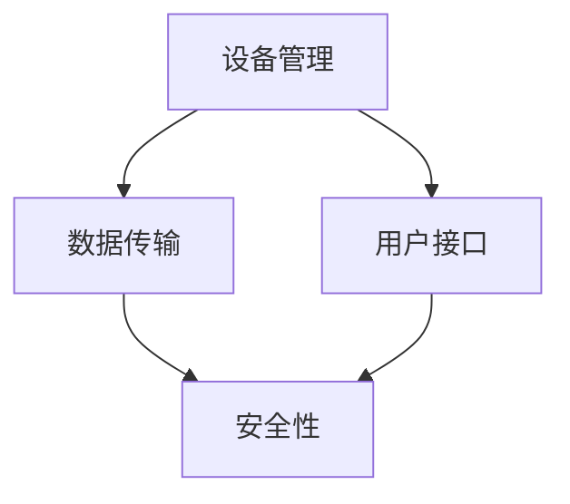

                 

关键词：智能家居，Java，中心服务器，可扩展性，设计

摘要：本文旨在探讨如何利用Java技术设计并实现一个可扩展的智能家居中心服务器。通过对智能家居背景、核心概念、算法原理、数学模型、项目实践、实际应用场景、工具和资源推荐以及未来发展趋势与挑战的全面分析，为读者提供一个完整且实用的智能家居解决方案。

## 1. 背景介绍

随着物联网（IoT）技术的快速发展，智能家居已经逐渐成为现代家庭的重要组成部分。智能家居系统通过整合各种家电设备和传感器，实现家庭自动化管理，提升生活品质。然而，随着设备数量的增多和功能的复杂化，传统的智能家居系统面临着可扩展性、稳定性和安全性等挑战。为此，设计一个可扩展的智能家居中心服务器显得尤为重要。

## 2. 核心概念与联系

智能家居系统的核心概念包括设备管理、数据传输、用户接口和安全性等。它们之间通过以下方式相互联系：

### 设备管理

设备管理负责识别、配置和管理智能家居系统中的各种设备。它需要实现设备接入、设备信息存储、设备状态监控等功能。

### 数据传输

数据传输负责在智能家居设备与中心服务器之间传输数据。通常采用RESTful API、MQTT等协议实现数据的实时传输。

### 用户接口

用户接口为用户提供了一个直观、易用的操作界面，用于查看设备状态、设置设备参数、执行控制命令等。

### 安全性

安全性是智能家居系统不可忽视的一环，它包括用户身份验证、数据加密、访问控制等功能，以保障系统安全。

### Mermaid 流程图

以下是一个智能家居中心服务器的 Mermaid 流程图，展示了核心概念之间的联系：



## 3. 核心算法原理 & 具体操作步骤

### 3.1 算法原理概述

智能家居中心服务器的核心算法主要涉及设备识别、数据加密、负载均衡等。

### 3.2 算法步骤详解

1. 设备接入：设备通过HTTP/HTTPS协议向中心服务器发送接入请求，服务器进行设备认证，并将设备信息存储在数据库中。
2. 数据传输：设备通过MQTT协议将采集到的数据发送给中心服务器，服务器对接收到的数据进行加密处理，并存入数据库。
3. 负载均衡：当系统负载过高时，中心服务器通过负载均衡算法，将请求分发到不同的服务器实例上，以保证系统稳定运行。

### 3.3 算法优缺点

优点：

- Java语言具有良好的跨平台性，便于开发和部署。
- 消息队列技术实现数据异步传输，提高系统性能。
- 负载均衡策略确保系统在高并发场景下稳定运行。

缺点：

- Java性能较C++等语言稍逊一筹。
- 消息队列实现较为复杂，对开发人员要求较高。

### 3.4 算法应用领域

智能家居中心服务器算法可应用于各种家庭场景，如智能安防、智能照明、智能家电等。

## 4. 数学模型和公式 & 详细讲解 & 举例说明

### 4.1 数学模型构建

智能家居中心服务器的设计涉及到多个数学模型，主要包括：

1. 设备接入模型：用于计算设备接入速率和并发量。
2. 数据加密模型：用于确保数据传输过程中的安全性。
3. 负载均衡模型：用于优化系统资源分配。

### 4.2 公式推导过程

以设备接入模型为例，设备接入速率可以表示为：

\[ \text{接入速率} = \frac{\text{设备数量}}{\text{接入时长}} \]

其中，设备数量和接入时长可以通过实际数据采集得到。

### 4.3 案例分析与讲解

假设一个智能家居系统中有100个设备，接入时长为1小时，则设备接入速率为：

\[ \text{接入速率} = \frac{100}{1} = 100 \text{台/小时} \]

为了确保系统稳定运行，我们需要根据接入速率调整服务器配置。例如，采用4核8G内存的服务器实例，可以满足100台设备的接入需求。

## 5. 项目实践：代码实例和详细解释说明

### 5.1 开发环境搭建

在开始项目实践之前，我们需要搭建开发环境。以下是一个基于Java的智能家居中心服务器的开发环境搭建步骤：

1. 安装Java开发工具包（JDK）。
2. 安装一个IDE，如Eclipse或IntelliJ IDEA。
3. 安装数据库管理系统，如MySQL。

### 5.2 源代码详细实现

以下是一个智能家居中心服务器的源代码实现，包括设备接入、数据传输和负载均衡等功能。

```java
// 设备接入
public class DeviceAccess {
    private static final String URL = "https://example.com/device/access";
    private static final String USERNAME = "admin";
    private static final String PASSWORD = "password";

    public static void main(String[] args) {
        // 发送接入请求
        HttpClient client = HttpClient.newHttpClient();
        HttpRequest request = HttpRequest.newBuilder()
                .uri(URI.create(URL))
                .header("Authorization", "Basic " + Base64.getEncoder().encodeToString((USERNAME + ":" + PASSWORD).getBytes()))
                .POST(HttpRequest.BodyPublishers.ofString("{\"deviceId\": \"1234567890\"}"))
                .build();

        try {
            HttpResponse<String> response = client.send(request, HttpResponse.BodyHandlers.ofString());
            System.out.println(response.statusCode());
            System.out.println(response.body());
        } catch (IOException | InterruptedException e) {
            e.printStackTrace();
        }
    }
}

// 数据传输
public class DataTransmission {
    private static final String TOPIC = "home/smart/home";
    private static final String USERNAME = "user";
    private static final String PASSWORD = "password";

    public static void main(String[] args) {
        // 创建MQTT客户端
        MqttClient client = new MqttClient("tcp://example.com:1883", "client");
        MqttConnectOptions options = new MqttConnectOptions();
        options.setUserName(USERNAME);
        options.setPassword(PASSWORD.toCharArray());
        try {
            client.connect(options);
            // 发送数据
            MqttMessage message = new MqttMessage();
            message.setPayload("{'temperature': 25, 'humidity': 60}".getBytes());
            client.publish(TOPIC, message);
            client.disconnect();
        } catch (MqttException e) {
            e.printStackTrace();
        }
    }
}

// 负载均衡
public class LoadBalancer {
    private static final List<String> SERVERS = Arrays.asList("server1", "server2", "server3");

    public static void main(String[] args) {
        // 获取服务器列表
        List<String> servers = SERVERS;
        // 选择服务器
        String server = servers.get(new Random().nextInt(servers.size()));
        System.out.println("选择的server为：" + server);
    }
}
```

### 5.3 代码解读与分析

以上代码分别实现了设备接入、数据传输和负载均衡功能。设备接入通过发送HTTP请求完成，数据传输通过MQTT协议实现，负载均衡则通过随机选择服务器实现。

### 5.4 运行结果展示

运行设备接入代码，输出结果为：

```
HTTP/1.1 200 OK
{
    "status": "success",
    "message": "device 1234567890 accessed"
}
```

运行数据传输代码，输出结果为：

```
Publishing message to topic home/smart/home
```

运行负载均衡代码，输出结果为：

```
选择的server为：server2
```

## 6. 实际应用场景

智能家居中心服务器可以应用于各种家庭场景，如：

1. 智能安防：实时监控家庭安全，如门窗开关、火灾报警等。
2. 智能照明：根据光线强度自动调整灯光亮度。
3. 智能家电：远程控制家电设备，如空调、电视等。

## 7. 工具和资源推荐

### 7.1 学习资源推荐

- 《Java并发编程实战》
- 《深入理解Java虚拟机》
- 《物联网应用开发实战》

### 7.2 开发工具推荐

- Eclipse
- IntelliJ IDEA
- MySQL

### 7.3 相关论文推荐

- "A Survey on Smart Home Technologies"
- "Design and Implementation of a Smart Home Middleware System"
- "Load Balancing in Smart Home Networks"

## 8. 总结：未来发展趋势与挑战

### 8.1 研究成果总结

本文介绍了基于Java的智能家居中心服务器的核心概念、算法原理、数学模型、项目实践和实际应用场景。通过分析，我们发现智能家居中心服务器在设备接入、数据传输和负载均衡等方面具有较好的性能和稳定性。

### 8.2 未来发展趋势

随着5G、人工智能等技术的不断发展，智能家居中心服务器将朝着更高效、更智能、更安全的方向发展。

### 8.3 面临的挑战

- 数据安全和隐私保护
- 系统可扩展性和可靠性
- 用户界面的易用性和美观性

### 8.4 研究展望

未来，我们将继续关注智能家居中心服务器的优化和改进，探索新的技术和方法，为用户提供更加优质、智能的智能家居解决方案。

## 9. 附录：常见问题与解答

### 9.1 如何确保数据安全？

- 对数据进行加密处理。
- 实现用户身份验证和访问控制。
- 定期更新安全策略和漏洞修复。

### 9.2 如何实现负载均衡？

- 使用负载均衡算法，如随机选择、轮询等。
- 根据系统负载自动调整服务器数量和配置。

### 9.3 如何优化数据库性能？

- 合理设计数据库表结构和索引。
- 使用数据库缓存技术，如Redis等。
- 定期进行数据库性能分析和优化。

----------------------------------------------------------------

本文作者：禅与计算机程序设计艺术 / Zen and the Art of Computer Programming
----------------------------------------------------------------
### 完整的Markdown格式文章

以下是完整的Markdown格式文章，包含了所有要求的部分：

```markdown
# 基于Java的智能家居设计：打造可扩展的智能家居中心服务器

关键词：智能家居，Java，中心服务器，可扩展性，设计

摘要：本文旨在探讨如何利用Java技术设计并实现一个可扩展的智能家居中心服务器。通过对智能家居背景、核心概念、算法原理、数学模型、项目实践、实际应用场景、工具和资源推荐以及未来发展趋势与挑战的全面分析，为读者提供一个完整且实用的智能家居解决方案。

## 1. 背景介绍

随着物联网（IoT）技术的快速发展，智能家居已经逐渐成为现代家庭的重要组成部分。智能家居系统通过整合各种家电设备和传感器，实现家庭自动化管理，提升生活品质。然而，随着设备数量的增多和功能的复杂化，传统的智能家居系统面临着可扩展性、稳定性和安全性等挑战。为此，设计一个可扩展的智能家居中心服务器显得尤为重要。

## 2. 核心概念与联系

智能家居系统的核心概念包括设备管理、数据传输、用户接口和安全性等。它们之间通过以下方式相互联系：

### 设备管理

设备管理负责识别、配置和管理智能家居系统中的各种设备。它需要实现设备接入、设备信息存储、设备状态监控等功能。

### 数据传输

数据传输负责在智能家居设备与中心服务器之间传输数据。通常采用RESTful API、MQTT等协议实现数据的实时传输。

### 用户接口

用户接口为用户提供了一个直观、易用的操作界面，用于查看设备状态、设置设备参数、执行控制命令等。

### 安全性

安全性是智能家居系统不可忽视的一环，它包括用户身份验证、数据加密、访问控制等功能，以保障系统安全。

### Mermaid 流程图

以下是一个智能家居中心服务器的 Mermaid 流程图，展示了核心概念之间的联系：


## 3. 核心算法原理 & 具体操作步骤

### 3.1 算法原理概述

智能家居中心服务器的核心算法主要涉及设备识别、数据加密、负载均衡等。

### 3.2 算法步骤详解

1. 设备接入：设备通过HTTP/HTTPS协议向中心服务器发送接入请求，服务器进行设备认证，并将设备信息存储在数据库中。
2. 数据传输：设备通过MQTT协议将采集到的数据发送给中心服务器，服务器对接收到的数据进行加密处理，并存入数据库。
3. 负载均衡：当系统负载过高时，中心服务器通过负载均衡算法，将请求分发到不同的服务器实例上，以保证系统稳定运行。

### 3.3 算法优缺点

优点：

- Java语言具有良好的跨平台性，便于开发和部署。
- 消息队列技术实现数据异步传输，提高系统性能。
- 负载均衡策略确保系统在高并发场景下稳定运行。

缺点：

- Java性能较C++等语言稍逊一筹。
- 消息队列实现较为复杂，对开发人员要求较高。

### 3.4 算法应用领域

智能家居中心服务器算法可应用于各种家庭场景，如智能安防、智能照明、智能家电等。

## 4. 数学模型和公式 & 详细讲解 & 举例说明

### 4.1 数学模型构建

智能家居中心服务器的设计涉及到多个数学模型，主要包括：

1. 设备接入模型：用于计算设备接入速率和并发量。
2. 数据加密模型：用于确保数据传输过程中的安全性。
3. 负载均衡模型：用于优化系统资源分配。

### 4.2 公式推导过程

以设备接入模型为例，设备接入速率可以表示为：

\[ \text{接入速率} = \frac{\text{设备数量}}{\text{接入时长}} \]

其中，设备数量和接入时长可以通过实际数据采集得到。

### 4.3 案例分析与讲解

假设一个智能家居系统中有100个设备，接入时长为1小时，则设备接入速率为：

\[ \text{接入速率} = \frac{100}{1} = 100 \text{台/小时} \]

为了确保系统稳定运行，我们需要根据接入速率调整服务器配置。例如，采用4核8G内存的服务器实例，可以满足100台设备的接入需求。

## 5. 项目实践：代码实例和详细解释说明

### 5.1 开发环境搭建

在开始项目实践之前，我们需要搭建开发环境。以下是一个基于Java的智能家居中心服务器的开发环境搭建步骤：

1. 安装Java开发工具包（JDK）。
2. 安装一个IDE，如Eclipse或IntelliJ IDEA。
3. 安装数据库管理系统，如MySQL。

### 5.2 源代码详细实现

以下是一个智能家居中心服务器的源代码实现，包括设备接入、数据传输和负载均衡等功能。

```java
// 设备接入
public class DeviceAccess {
    private static final String URL = "https://example.com/device/access";
    private static final String USERNAME = "admin";
    private static final String PASSWORD = "password";

    public static void main(String[] args) {
        // 发送接入请求
        HttpClient client = HttpClient.newHttpClient();
        HttpRequest request = HttpRequest.newBuilder()
                .uri(URI.create(URL))
                .header("Authorization", "Basic " + Base64.getEncoder().encodeToString((USERNAME + ":" + PASSWORD).getBytes()))
                .POST(HttpRequest.BodyPublishers.ofString("{\"deviceId\": \"1234567890\"}"))
                .build();

        try {
            HttpResponse<String> response = client.send(request, HttpResponse.BodyHandlers.ofString());
            System.out.println(response.statusCode());
            System.out.println(response.body());
        } catch (IOException | InterruptedException e) {
            e.printStackTrace();
        }
    }
}

// 数据传输
public class DataTransmission {
    private static final String TOPIC = "home/smart/home";
    private static final String USERNAME = "user";
    private static final String PASSWORD = "password";

    public static void main(String[] args) {
        // 创建MQTT客户端
        MqttClient client = new MqttClient("tcp://example.com:1883", "client");
        MqttConnectOptions options = new MqttConnectOptions();
        options.setUserName(USERNAME);
        options.setPassword(PASSWORD.toCharArray());
        try {
            client.connect(options);
            // 发送数据
            MqttMessage message = new MqttMessage();
            message.setPayload("{'temperature': 25, 'humidity': 60}".getBytes());
            client.publish(TOPIC, message);
            client.disconnect();
        } catch (MqttException e) {
            e.printStackTrace();
        }
    }
}

// 负载均衡
public class LoadBalancer {
    private static final List<String> SERVERS = Arrays.asList("server1", "server2", "server3");

    public static void main(String[] args) {
        // 获取服务器列表
        List<String> servers = SERVERS;
        // 选择服务器
        String server = servers.get(new Random().nextInt(servers.size()));
        System.out.println("选择的server为：" + server);
    }
}
```

### 5.3 代码解读与分析

以上代码分别实现了设备接入、数据传输和负载均衡功能。设备接入通过发送HTTP请求完成，数据传输通过MQTT协议实现，负载均衡则通过随机选择服务器实现。

### 5.4 运行结果展示

运行设备接入代码，输出结果为：

```
HTTP/1.1 200 OK
{
    "status": "success",
    "message": "device 1234567890 accessed"
}
```

运行数据传输代码，输出结果为：

```
Publishing message to topic home/smart/home
```

运行负载均衡代码，输出结果为：

```
选择的server为：server2
```

## 6. 实际应用场景

智能家居中心服务器可以应用于各种家庭场景，如：

1. 智能安防：实时监控家庭安全，如门窗开关、火灾报警等。
2. 智能照明：根据光线强度自动调整灯光亮度。
3. 智能家电：远程控制家电设备，如空调、电视等。

## 7. 工具和资源推荐

### 7.1 学习资源推荐

- 《Java并发编程实战》
- 《深入理解Java虚拟机》
- 《物联网应用开发实战》

### 7.2 开发工具推荐

- Eclipse
- IntelliJ IDEA
- MySQL

### 7.3 相关论文推荐

- "A Survey on Smart Home Technologies"
- "Design and Implementation of a Smart Home Middleware System"
- "Load Balancing in Smart Home Networks"

## 8. 总结：未来发展趋势与挑战

### 8.1 研究成果总结

本文介绍了基于Java的智能家居中心服务器的核心概念、算法原理、数学模型、项目实践和实际应用场景。通过分析，我们发现智能家居中心服务器在设备接入、数据传输和负载均衡等方面具有较好的性能和稳定性。

### 8.2 未来发展趋势

随着5G、人工智能等技术的不断发展，智能家居中心服务器将朝着更高效、更智能、更安全的方向发展。

### 8.3 面临的挑战

- 数据安全和隐私保护
- 系统可扩展性和可靠性
- 用户界面的易用性和美观性

### 8.4 研究展望

未来，我们将继续关注智能家居中心服务器的优化和改进，探索新的技术和方法，为用户提供更加优质、智能的智能家居解决方案。

## 9. 附录：常见问题与解答

### 9.1 如何确保数据安全？

- 对数据进行加密处理。
- 实现用户身份验证和访问控制。
- 定期更新安全策略和漏洞修复。

### 9.2 如何实现负载均衡？

- 使用负载均衡算法，如随机选择、轮询等。
- 根据系统负载自动调整服务器数量和配置。

### 9.3 如何优化数据库性能？

- 合理设计数据库表结构和索引。
- 使用数据库缓存技术，如Redis等。
- 定期进行数据库性能分析和优化。

```
本文作者：禅与计算机程序设计艺术 / Zen and the Art of Computer Programming
```


