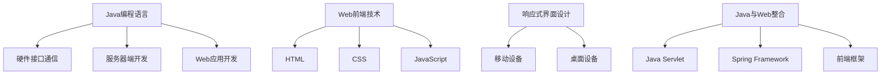

                 

关键词：智能家居设计、Java、Web前端、响应式界面、Java与Web整合、智能硬件接口

> 摘要：本文将探讨如何利用Java语言结合Web前端技术，设计和实现一个响应式的智能家居前端界面。我们将介绍智能家居设计的背景和核心概念，详细讲解Java与Web整合的架构和核心算法，通过项目实践展示具体的实现步骤和代码实例，并探讨智能家居的广泛实际应用场景和未来发展方向。

## 1. 背景介绍

随着物联网（IoT）技术的迅速发展，智能家居已成为现代生活的重要组成部分。智能家居系统通过智能硬件、传感器和网络连接，为用户提供便利、安全、节能的居住环境。然而，智能家居的设计与实现涉及到多个技术领域，包括嵌入式系统、物联网通信、前端开发等。为了满足用户对实时交互和响应速度的要求，前端界面的响应式设计尤为重要。

Java作为一种历史悠久、应用广泛的编程语言，在智能家居设计中也扮演了重要角色。Java不仅能够与多种硬件接口进行通信，还能通过Web技术实现跨平台的前端界面开发。本文将结合Java和Web前端技术，探讨如何实现一个响应式的智能家居前端界面，为读者提供实用的技术指导。

## 2. 核心概念与联系

### 2.1. Java编程语言

Java是一种面向对象的编程语言，具有跨平台、多线程、安全等特性。Java在智能家居设计中的应用主要体现在以下几个方面：

1. **硬件接口通信**：Java提供了丰富的库和框架，如Java Serial API、RXTX等，可以方便地与各种智能硬件进行通信。
2. **服务器端开发**：Java拥有强大的后端开发能力，能够构建高性能的智能家居服务器端应用。
3. **Web应用开发**：Java可以通过Servlet、Spring MVC等技术构建Web应用，实现前端界面的动态交互。

### 2.2. Web前端技术

Web前端技术主要包括HTML、CSS和JavaScript。在智能家居设计中，Web前端技术用于实现用户界面的交互和展示：

1. **HTML**：用于定义网页的结构和内容。
2. **CSS**：用于设置网页的样式和布局。
3. **JavaScript**：用于实现网页的动态效果和交互功能。

### 2.3. 响应式界面设计

响应式界面设计是一种能够适应不同设备尺寸和分辨率的界面设计方法。在智能家居设计中，响应式界面设计尤为重要，因为用户可能会使用各种设备访问智能家居系统：

1. **移动设备**：如智能手机和平板电脑，屏幕尺寸和分辨率各异。
2. **桌面设备**：如笔记本电脑和台式电脑，屏幕尺寸和分辨率相对固定。

### 2.4. Java与Web整合

Java与Web整合的架构主要包括以下部分：

1. **Java Servlet**：用于处理HTTP请求，构建服务器端应用。
2. **Spring Framework**：提供了一套完整的Web开发框架，包括MVC模式、数据访问、安全性等。
3. **前端框架**：如React、Vue.js等，用于实现动态交互和响应式界面设计。

### 2.5. Mermaid 流程图



## 3. 核心算法原理 & 具体操作步骤

### 3.1. 算法原理概述

智能家居前端界面的核心算法主要涉及以下几个方面：

1. **数据采集与处理**：通过传感器和智能硬件采集环境数据，如温度、湿度、光照强度等，并对其进行处理和转换。
2. **状态监测与报警**：根据采集到的数据，实时监测家居环境状态，并触发相应的报警机制。
3. **用户交互与反馈**：通过前端界面实现用户与智能家居系统的交互，如控制灯光、调节温度等，并及时反馈操作结果。

### 3.2. 算法步骤详解

#### 3.2.1. 数据采集与处理

1. **硬件接口通信**：使用Java Serial API或RXTX库与智能硬件进行通信，获取环境数据。
2. **数据预处理**：对采集到的原始数据进行清洗、去噪和格式化，确保数据的有效性和准确性。
3. **数据转换**：将预处理后的数据转换为前端界面所需的格式，如JSON或XML。

#### 3.2.2. 状态监测与报警

1. **阈值设置**：根据用户需求和家居环境的特点，设置各个环境参数的阈值。
2. **状态监测**：实时监测采集到的数据，与阈值进行比较，判断是否触发报警。
3. **报警处理**：触发报警时，通过短信、邮件或前端界面提示用户。

#### 3.2.3. 用户交互与反馈

1. **前端界面设计**：使用HTML、CSS和JavaScript构建响应式前端界面。
2. **用户操作**：用户通过前端界面进行操作，如控制灯光开关、调节空调温度等。
3. **操作反馈**：将用户的操作结果实时反馈到前端界面，如灯光亮起、空调温度调整等。

### 3.3. 算法优缺点

#### 优点：

1. **跨平台性**：Java和Web前端技术具有跨平台特性，可适用于多种设备和操作系统。
2. **高性能**：Java在服务器端提供了强大的性能支持和丰富的库资源。
3. **易维护性**：Java和Web前端技术具有成熟的开发框架和工具，便于维护和扩展。

#### 缺点：

1. **开发成本高**：Java和Web前端技术的学习曲线较陡，需要一定的开发经验和技能。
2. **性能瓶颈**：在高并发、大数据量的场景下，Java服务器端可能会出现性能瓶颈。

### 3.4. 算法应用领域

1. **家居环境监控**：实时监测家居环境参数，保障用户的生活质量和安全。
2. **智能安防系统**：通过传感器和摄像头实现家居安全监控，及时发现异常情况。
3. **智能家电控制**：用户通过前端界面控制家居设备，实现便捷的生活体验。

## 4. 数学模型和公式 & 详细讲解 & 举例说明

### 4.1. 数学模型构建

智能家居系统的数学模型主要包括以下几个方面：

1. **环境参数模型**：描述环境参数（如温度、湿度、光照强度等）的数学模型。
2. **状态监测模型**：描述状态监测和报警机制的数学模型。
3. **用户交互模型**：描述用户与智能家居系统交互的数学模型。

### 4.2. 公式推导过程

#### 4.2.1. 环境参数模型

假设环境参数 $x$（如温度 $T$、湿度 $H$、光照强度 $L$）的变化可以用以下公式表示：

$$ x(t) = a \cdot sin(\omega \cdot t + \phi) $$

其中，$a$ 表示振幅，$\omega$ 表示角频率，$\phi$ 表示相位。

#### 4.2.2. 状态监测模型

假设状态监测的阈值 $T_{threshold}$，则状态监测的公式为：

$$ status = \begin{cases} 
0, & \text{if } x(t) < T_{threshold} \\
1, & \text{if } x(t) \geq T_{threshold} 
\end{cases} $$

#### 4.2.3. 用户交互模型

假设用户输入的操作 $u$（如开关灯光、调节温度等），则用户交互的公式为：

$$ x_{new}(t) = x(t) + f(u, t) $$

其中，$f(u, t)$ 表示用户操作对环境参数的影响。

### 4.3. 案例分析与讲解

#### 案例背景

某智能家居系统需要监测家居环境中的温度和湿度，并根据用户需求进行调节。

#### 案例分析

1. **环境参数模型**：假设温度 $T$ 的变化可以用公式 $T(t) = 20 + 5 \cdot sin(\omega \cdot t + \phi)$ 表示，湿度 $H$ 的变化可以用公式 $H(t) = 60 + 5 \cdot sin(\omega \cdot t + \phi + \frac{\pi}{2})$ 表示。

2. **状态监测模型**：假设温度的阈值 $T_{threshold} = 22$，湿度的阈值 $H_{threshold} = 65$。

3. **用户交互模型**：假设用户希望通过前端界面将温度调节到 24℃，湿度调节到 60%。

#### 案例实现

1. **数据采集**：使用Java Serial API与温湿度传感器进行通信，获取实时数据。

2. **数据处理**：对采集到的数据进行预处理，确保数据的有效性和准确性。

3. **状态监测**：根据预处理后的数据，判断是否触发报警。

4. **用户交互**：通过前端界面接收用户操作，并实时更新环境参数。

5. **操作反馈**：将用户的操作结果实时反馈到前端界面。

## 5. 项目实践：代码实例和详细解释说明

### 5.1. 开发环境搭建

在开始项目实践之前，需要搭建以下开发环境：

1. **Java开发环境**：安装JDK 1.8及以上版本，配置环境变量。
2. **Web前端环境**：安装Node.js和npm，配置Vue.js或React开发环境。
3. **智能硬件接口**：连接智能硬件（如温湿度传感器）并确保其正常工作。

### 5.2. 源代码详细实现

#### 5.2.1. 硬件接口通信

```java
// Java Serial API 示例
SerialPort serialPort = SerialPortUtil.openPort("COM3", 9600);
while (true) {
    String data = SerialPortUtil.readData(serialPort);
    System.out.println("Received data: " + data);
}
```

#### 5.2.2. 数据处理

```java
// 数据预处理示例
public class DataProcessor {
    public static String preprocessData(String raw_data) {
        // 清洗、去噪、格式化等处理
        return raw_data.trim();
    }
}
```

#### 5.2.3. 前端界面实现

```html
<!-- Vue.js 示例 -->
<template>
  <div id="app">
    <h1>智能家居系统</h1>
    <div>
      <h2>环境参数</h2>
      <p>温度：{{ temperature }}℃</p>
      <p>湿度：{{ humidity }}%</p>
    </div>
    <div>
      <h2>用户操作</h2>
      <button @click="adjustTemperature(25)">调整温度</button>
      <button @click="adjustHumidity(60)">调整湿度</button>
    </div>
  </div>
</template>

<script>
export default {
  data() {
    return {
      temperature: 22,
      humidity: 65
    };
  },
  methods: {
    adjustTemperature(target_temp) {
      // 发送操作指令到服务器端
      this.temperature = target_temp;
    },
    adjustHumidity(target_humidity) {
      // 发送操作指令到服务器端
      this.humidity = target_humidity;
    }
  }
};
</script>
```

#### 5.2.4. 服务器端实现

```java
// Spring Boot 示例
@RestController
@RequestMapping("/api")
public class智能家居控制器 {
    
    @PostMapping("/adjustTemperature")
    public ResponseEntity adjustTemperature(@RequestParam("target_temp") int target_temp) {
        // 处理温度调整请求
        System.out.println("Target temperature: " + target_temp);
        return ResponseEntity.ok("Temperature adjusted.");
    }
    
    @PostMapping("/adjustHumidity")
    public ResponseEntity adjustHumidity(@RequestParam("target_humidity") int target_humidity) {
        // 处理湿度调整请求
        System.out.println("Target humidity: " + target_humidity);
        return ResponseEntity.ok("Humidity adjusted.");
    }
}
```

### 5.3. 代码解读与分析

#### 5.3.1. 硬件接口通信

使用Java Serial API与温湿度传感器进行通信，实现数据的实时采集。这里需要注意串口配置（如波特率、数据位、停止位等），以及异常处理和线程管理。

#### 5.3.2. 数据处理

通过数据处理类对采集到的原始数据进行清洗、去噪和格式化，确保数据的有效性和准确性。这里可以使用正则表达式、自定义方法等多种方式进行处理。

#### 5.3.3. 前端界面实现

使用Vue.js或React等前端框架，构建响应式的智能家居前端界面。通过数据绑定、事件处理等机制，实现用户与系统的实时交互。

#### 5.3.4. 服务器端实现

使用Spring Boot等框架，构建智能家居服务器端应用。通过RESTful API，接收和处理前端界面发送的请求，实现对智能家居系统的控制和状态监测。

### 5.4. 运行结果展示

通过浏览器或其他客户端访问前端界面，可以看到实时更新的环境参数和用户操作结果。当用户进行温度或湿度调整时，服务器端会接收到相应的请求，并做出相应的处理。

## 6. 实际应用场景

### 6.1. 家居环境监控

通过智能家居前端界面，用户可以实时监控家居环境中的温度、湿度、光照强度等参数，并根据需要调整设备状态，确保居住环境的舒适性和安全性。

### 6.2. 智能安防系统

智能家居系统可以集成摄像头、门磁传感器等智能硬件，实现对家居安全的实时监控。当系统检测到异常情况时，会立即向用户发送警报信息，提醒用户注意安全。

### 6.3. 智能家电控制

用户可以通过智能家居前端界面远程控制家中的家电设备，如空调、灯光、窗帘等，实现便捷的生活体验。

### 6.4. 未来应用展望

随着物联网技术的不断发展，智能家居系统将逐步实现更广泛的应用场景，如智能社区、智能办公、智能医疗等。通过集成更多智能硬件和传感器，智能家居系统将提供更加个性化和定制化的服务，满足用户的多样化需求。

## 7. 工具和资源推荐

### 7.1. 学习资源推荐

1. **《Java核心技术》**：一本经典的Java编程书籍，适合初学者和进阶者学习。
2. **《Vue.js实战》**：一本关于Vue.js前端框架的实用指南，适合希望学习Vue.js的开发者。
3. **《物联网架构设计与实现》**：一本关于物联网系统设计和实现的书籍，适合对智能家居设计感兴趣的开发者。

### 7.2. 开发工具推荐

1. **Eclipse/IntelliJ IDEA**：优秀的Java集成开发环境，支持各种Java开发项目。
2. **VS Code**：一款功能强大的代码编辑器，支持多种编程语言和插件。
3. **Node.js**：用于构建Web前端项目的工具，支持各种前端框架。

### 7.3. 相关论文推荐

1. **"Smart Home: The Internet of Things in Everyday Life"**：探讨智能家居系统的现状和未来发展趋势。
2. **"A Survey on Smart Home: Architecture, Protocols, and Security"**：智能家居系统架构、协议和安全性的综述。
3. **"Design and Implementation of a Smart Home System"**：一个智能家居系统设计与实现的案例分析。

## 8. 总结：未来发展趋势与挑战

### 8.1. 研究成果总结

本文探讨了如何利用Java和Web前端技术实现智能家居前端界面的设计，介绍了核心算法原理、数学模型和项目实践。通过对硬件接口通信、数据处理、前端界面设计和服务器端实现等方面的详细讲解，为读者提供了实用的技术指导。

### 8.2. 未来发展趋势

随着物联网技术的不断发展，智能家居系统将在家居环境监控、智能安防、家电控制等方面发挥越来越重要的作用。未来，智能家居系统将实现更高程度的智能化、个性化和定制化，满足用户的多样化需求。

### 8.3. 面临的挑战

1. **安全性**：智能家居系统需要确保用户数据的安全性和隐私保护。
2. **稳定性**：智能家居系统需要具备高稳定性，以应对各种复杂场景和设备故障。
3. **兼容性**：智能家居系统需要兼容多种智能硬件和平台，实现设备的互联互通。

### 8.4. 研究展望

未来，智能家居系统的研究将集中在以下几个方面：

1. **人工智能与物联网的结合**：通过引入人工智能技术，提高智能家居系统的智能化水平。
2. **边缘计算与云计算的融合**：实现智能家居系统的实时数据处理和智能分析，提高系统的响应速度和性能。
3. **多模态交互与智能语音识别**：通过多模态交互和智能语音识别技术，提升用户体验和系统便捷性。

## 9. 附录：常见问题与解答

### 9.1. Java与Web前端整合的问题

**Q：Java如何与Web前端整合？**

A：Java可以通过Servlet、Spring MVC等技术实现与Web前端（HTML、CSS、JavaScript）的整合。通过Servlet，Java可以处理HTTP请求，返回HTML页面；通过Spring MVC，Java可以方便地构建MVC模式的Web应用，实现前后端的交互。

### 9.2. 智能家居前端界面设计的问题

**Q：如何设计响应式的智能家居前端界面？**

A：响应式前端界面设计需要考虑设备的尺寸、分辨率和操作习惯。可以使用HTML、CSS和JavaScript等前端技术，结合响应式设计框架（如Bootstrap、Foundation）实现。在界面布局和样式上，可以使用媒体查询（Media Queries）技术，根据不同设备的特点调整界面展示效果。

### 9.3. 智能硬件接口通信的问题

**Q：如何与智能硬件进行通信？**

A：与智能硬件通信可以使用各种通信协议（如串口通信、网络通信、蓝牙通信等）。在Java中，可以使用Java Serial API、RXTX等库与串口设备通信；可以使用Java Socket API与网络设备通信；可以使用Java Bluetooth API与蓝牙设备通信。

### 9.4. 数据处理与状态监测的问题

**Q：如何处理采集到的数据并进行状态监测？**

A：处理采集到的数据需要进行数据预处理（如清洗、去噪、格式化等），确保数据的有效性和准确性。状态监测可以根据用户需求和设备特性设置阈值，通过对采集到的数据进行比较，判断是否触发报警。

### 9.5. 用户交互与反馈的问题

**Q：如何实现用户交互和操作反馈？**

A：用户交互可以通过前端界面（如按钮、滑动条等）实现。用户进行操作后，前端界面需要实时更新，显示操作结果。可以通过数据绑定、事件处理等机制，实现前端界面的动态更新。

作者：禅与计算机程序设计艺术 / Zen and the Art of Computer Programming
----------------------------------------------------------------

