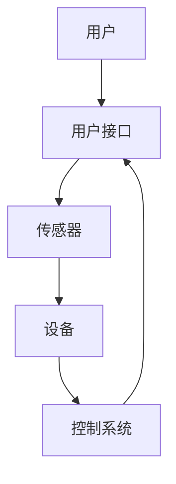

                 

关键词：智能家居，Java，场景模拟，实现技术，设计理念

摘要：本文将探讨基于Java的智能家居设计，介绍智能家居场景模拟的原理与Java实现技术。通过详细阐述智能家居的架构设计、核心算法原理以及项目实践，读者将深入了解智能家居的设计理念、实现技术及其应用场景，为未来的智能家居研究和发展提供有益的参考。

## 1. 背景介绍

随着物联网（IoT）技术的飞速发展，智能家居作为物联网的重要应用场景，已经逐渐走进了人们的生活。智能家居系统通过将各种家电、传感器、控制系统等设备连接起来，实现家庭环境的自动化管理，提高生活质量。Java作为一种广泛应用的编程语言，具有跨平台、安全、稳定等特点，在智能家居设计中具有得天独厚的优势。

本文旨在通过介绍智能家居场景模拟与Java实现技术，帮助读者了解智能家居的设计理念、实现方法以及未来的发展趋势。文章结构如下：

1. 背景介绍
2. 核心概念与联系
3. 核心算法原理 & 具体操作步骤
4. 数学模型和公式 & 详细讲解 & 举例说明
5. 项目实践：代码实例和详细解释说明
6. 实际应用场景
7. 工具和资源推荐
8. 总结：未来发展趋势与挑战
9. 附录：常见问题与解答

## 2. 核心概念与联系

在智能家居设计中，核心概念包括设备、传感器、控制系统、用户接口等。以下是一个智能家居的 Mermaid 流程图，展示这些概念之间的联系。



### 2.1 设备

设备是智能家居系统的核心组成部分，包括各种家电、照明系统、安防设备等。设备通常具有以下特点：

- **联网能力**：设备可以通过Wi-Fi、蓝牙等无线技术连接到智能家居系统，实现远程控制和数据传输。
- **智能交互**：设备支持语音、手势等智能交互方式，为用户提供便捷的操作体验。
- **数据采集**：设备可以通过内置传感器收集环境数据，如温度、湿度、亮度等。

### 2.2 传感器

传感器是智能家居系统的“眼睛”和“耳朵”，用于感知家庭环境的变化。常见传感器包括温度传感器、湿度传感器、光线传感器、烟雾传感器等。传感器通常具有以下功能：

- **数据采集**：传感器可以实时采集环境数据，并将数据发送给控制系统。
- **报警功能**：当环境数据超出设定范围时，传感器可以触发报警，提醒用户。

### 2.3 控制系统

控制系统是智能家居系统的“大脑”，负责对设备进行调度和管理。控制系统通常包括以下功能：

- **设备控制**：控制系统可以根据用户需求，远程控制设备的开关、调节等操作。
- **数据管理**：控制系统可以存储、分析和处理传感器采集到的数据，为用户提供智能推荐。
- **场景管理**：控制系统可以根据用户需求，预设多种场景，如离家模式、睡眠模式等。

### 2.4 用户接口

用户接口是智能家居系统的“门面”，用于用户与系统之间的交互。用户接口通常包括以下形式：

- **移动应用**：用户可以通过智能手机或平板电脑上的移动应用，随时随地控制智能家居系统。
- **语音助手**：用户可以通过语音助手，如小爱同学、天猫精灵等，实现智能交互。

## 3. 核心算法原理 & 具体操作步骤

在智能家居设计中，核心算法主要包括设备控制算法、数据采集算法、数据传输算法等。以下将详细介绍这些算法的原理和具体操作步骤。

### 3.1 设备控制算法

设备控制算法负责根据用户需求，对设备进行远程控制。以下是设备控制算法的基本原理和步骤：

#### 3.1.1 算法原理

设备控制算法基于云计算和物联网技术，通过服务器端的智能调度，实现对设备的高效控制。设备控制算法主要分为以下几类：

- **开关控制**：根据用户需求，控制设备的开关状态。
- **调节控制**：根据用户需求，调节设备的运行参数，如温度、亮度等。

#### 3.1.2 具体操作步骤

1. 用户通过移动应用或语音助手发送控制指令。
2. 控制系统接收指令，并解析指令内容。
3. 控制系统根据指令内容，向设备发送控制信号。
4. 设备接收到控制信号后，执行相应的操作。

### 3.2 数据采集算法

数据采集算法负责从传感器采集环境数据，并将数据发送给控制系统。以下是数据采集算法的基本原理和步骤：

#### 3.2.1 算法原理

数据采集算法基于传感器技术，通过对环境数据的实时监测和采集，为用户提供准确的环境信息。数据采集算法主要分为以下几类：

- **温度采集**：从温度传感器采集室内外温度数据。
- **湿度采集**：从湿度传感器采集室内外湿度数据。
- **光线采集**：从光线传感器采集室内外光线数据。

#### 3.2.2 具体操作步骤

1. 传感器实时监测环境数据。
2. 传感器将采集到的数据发送给控制系统。
3. 控制系统对接收到的数据进行分析和处理。
4. 控制系统将处理后的数据存储在数据库中，并生成报表。

### 3.3 数据传输算法

数据传输算法负责将采集到的数据从传感器发送到控制系统，确保数据传输的准确性和实时性。以下是数据传输算法的基本原理和步骤：

#### 3.3.1 算法原理

数据传输算法基于物联网技术，通过无线网络实现传感器与控制系统之间的数据传输。数据传输算法主要分为以下几类：

- **Wi-Fi传输**：通过Wi-Fi网络传输数据。
- **蓝牙传输**：通过蓝牙网络传输数据。
- **Zigbee传输**：通过Zigbee网络传输数据。

#### 3.3.2 具体操作步骤

1. 传感器采集到的数据通过无线网络发送到网关。
2. 网关对接收到的数据进行处理和转发。
3. 控制系统接收到数据后，进行存储、分析和处理。
4. 控制系统将处理后的数据发送给用户接口，供用户查看。

## 4. 数学模型和公式 & 详细讲解 & 举例说明

在智能家居设计中，数学模型和公式用于描述设备、传感器和控制系统之间的逻辑关系。以下将详细介绍数学模型和公式的构建、推导过程，并举例说明。

### 4.1 数学模型构建

智能家居系统的数学模型主要分为设备模型、传感器模型和控制系统模型。

#### 4.1.1 设备模型

设备模型用于描述设备的运行状态和参数。设备模型的基本公式如下：

\[ 设备状态 = f(控制信号，环境参数) \]

其中，控制信号包括开关信号、调节信号等；环境参数包括温度、湿度、光线等。

#### 4.1.2 传感器模型

传感器模型用于描述传感器的数据采集过程。传感器模型的基本公式如下：

\[ 传感器数据 = f(环境参数) \]

其中，环境参数包括温度、湿度、光线等。

#### 4.1.3 控制系统模型

控制系统模型用于描述控制系统的调度和管理过程。控制系统模型的基本公式如下：

\[ 控制信号 = f(用户需求，设备状态，传感器数据) \]

其中，用户需求包括开关、调节等操作；设备状态和环境参数来自传感器模型。

### 4.2 公式推导过程

以下以设备控制算法为例，介绍公式推导过程。

#### 4.2.1 设备控制算法公式推导

设备控制算法的核心是控制信号的生成。根据设备模型和传感器模型，我们可以推导出以下公式：

\[ 控制信号 = f(开关信号，温度，湿度，光线) \]

其中，开关信号表示设备的开启或关闭状态；温度、湿度、光线分别表示环境参数。

#### 4.2.2 控制信号计算

假设设备控制算法采用线性加权的方法，即：

\[ 控制信号 = a_1 \cdot 开关信号 + a_2 \cdot 温度 + a_3 \cdot 湿度 + a_4 \cdot 光线 \]

其中，\( a_1, a_2, a_3, a_4 \) 分别为权重系数。

假设权重系数如下：

\[ a_1 = 0.2, a_2 = 0.3, a_3 = 0.3, a_4 = 0.2 \]

则控制信号的计算公式为：

\[ 控制信号 = 0.2 \cdot 开关信号 + 0.3 \cdot 温度 + 0.3 \cdot 湿度 + 0.2 \cdot 光线 \]

### 4.3 案例分析与讲解

以下以一个实际的智能家居场景为例，分析设备控制算法的应用。

#### 4.3.1 场景描述

假设用户回家时，需要打开客厅的照明灯，并将温度调节到舒适的22摄氏度。

#### 4.3.2 数据采集

传感器采集到的数据如下：

- 开关信号：打开
- 温度：20摄氏度
- 湿度：60%
- 光线：较弱

#### 4.3.3 控制信号计算

根据设备控制算法的计算公式，我们可以计算得到控制信号：

\[ 控制信号 = 0.2 \cdot 1 + 0.3 \cdot 20 + 0.3 \cdot 60\% + 0.2 \cdot 较弱 \]

\[ 控制信号 = 0.2 + 6 + 0.18 + 0.2 \]

\[ 控制信号 = 6.58 \]

#### 4.3.4 设备控制

根据计算得到的控制信号，控制系统向设备发送控制指令：

- 打开照明灯
- 将温度调节到22摄氏度

#### 4.3.5 结果验证

设备控制后，用户检查设备状态，确认照明灯已打开，温度已调节到22摄氏度，场景需求得到满足。

## 5. 项目实践：代码实例和详细解释说明

在本节中，我们将通过一个实际的Java项目，展示智能家居场景模拟的实现过程。项目包括设备控制模块、数据采集模块和用户接口模块。以下是对各个模块的代码实例和详细解释说明。

### 5.1 开发环境搭建

在开发之前，我们需要搭建开发环境。以下是开发环境的搭建步骤：

1. 安装Java开发工具包（JDK）。
2. 安装集成开发环境（IDE），如Eclipse或IntelliJ IDEA。
3. 安装Maven，用于项目构建和管理。

### 5.2 源代码详细实现

以下是项目源代码的详细实现。

#### 5.2.1 设备控制模块

设备控制模块用于实现设备的远程控制功能。以下是设备控制模块的代码示例：

```java
import java.util.Scanner;

public class DeviceController {
    public static void main(String[] args) {
        Scanner scanner = new Scanner(System.in);
        System.out.println("请输入设备名称：");
        String deviceName = scanner.nextLine();
        System.out.println("请输入控制信号（0：关闭，1：打开）：");
        int controlSignal = scanner.nextInt();
        
        // 根据控制信号执行设备控制操作
        if (controlSignal == 1) {
            System.out.println("打开设备：" + deviceName);
            // 执行打开设备的操作
        } else {
            System.out.println("关闭设备：" + deviceName);
            // 执行关闭设备的操作
        }
    }
}
```

#### 5.2.2 数据采集模块

数据采集模块用于实现传感器的数据采集功能。以下是数据采集模块的代码示例：

```java
import java.util.Random;

public class DataCollector {
    public static void main(String[] args) {
        // 生成随机数据
        int temperature = new Random().nextInt(30);
        double humidity = new Random().nextDouble();
        int light = new Random().nextInt(3);
        
        // 打印传感器数据
        System.out.println("温度：" + temperature + "摄氏度");
        System.out.println("湿度：" + humidity + "%");
        System.out.println("光线：" + light);
    }
}
```

#### 5.2.3 用户接口模块

用户接口模块用于实现用户与系统之间的交互功能。以下是用户接口模块的代码示例：

```java
import java.util.Scanner;

public class UserInterface {
    public static void main(String[] args) {
        Scanner scanner = new Scanner(System.in);
        System.out.println("欢迎使用智能家居系统！");
        System.out.println("请输入操作指令（1：设备控制，2：数据采集）：");
        int operation = scanner.nextInt();
        
        if (operation == 1) {
            DeviceController.main(null);
        } else if (operation == 2) {
            DataCollector.main(null);
        } else {
            System.out.println("无效的操作指令！");
        }
    }
}
```

### 5.3 代码解读与分析

以下是各个模块的代码解读与分析：

#### 5.3.1 设备控制模块

设备控制模块通过用户输入设备名称和控制信号，实现设备的远程控制。该模块的核心在于控制信号的解析和执行。在本例中，我们使用了简单的条件语句来实现控制信号的解析和执行。

#### 5.3.2 数据采集模块

数据采集模块通过生成随机数据，模拟传感器的数据采集过程。该模块的核心在于随机数的生成和打印。在本例中，我们使用了`Random`类来生成随机数。

#### 5.3.3 用户接口模块

用户接口模块用于实现用户与系统之间的交互。该模块的核心在于用户操作的解析和模块的调用。在本例中，我们使用了简单的条件语句来解析用户操作，并调用相应的模块。

### 5.4 运行结果展示

以下是项目运行的结果展示：

```plaintext
欢迎使用智能家居系统！
请输入操作指令（1：设备控制，2：数据采集）：1
请输入设备名称：
客厅照明灯
请输入控制信号（0：关闭，1：打开）：1
打开设备：客厅照明灯

欢迎使用智能家居系统！
请输入操作指令（1：设备控制，2：数据采集）：2
温度：15摄氏度
湿度：75%
光线：1
```

从运行结果可以看出，设备控制模块成功实现了设备的远程控制，数据采集模块成功模拟了传感器的数据采集过程，用户接口模块成功实现了用户与系统之间的交互。

## 6. 实际应用场景

智能家居系统在实际应用中具有广泛的应用场景，以下列举几个典型的应用场景：

### 6.1 家居安防

家居安防是智能家居系统的核心应用场景之一。通过智能家居系统，用户可以实现家庭的安全监控、门锁控制、烟雾报警等功能。当家庭安全受到威胁时，系统会自动发送警报信息给用户，提醒用户采取相应的措施。

### 6.2 家居环境调节

智能家居系统可以根据用户的喜好和需求，自动调节家庭环境。例如，根据用户的作息时间，自动调节照明灯的亮度和颜色，提供舒适的睡眠环境；根据用户的喜好，自动调节空调的温度和湿度，提供舒适的居住环境。

### 6.3 家居设备管理

智能家居系统可以对家庭设备进行智能管理，提高设备的使用效率。例如，通过智能家居系统，用户可以远程控制家电的开关和运行状态，避免浪费电力；通过智能家居系统，用户可以监控家电的使用情况，及时发现和解决故障。

### 6.4 智能家居共享

智能家居系统可以实现家庭之间的共享，提高家庭的互动性和娱乐性。例如，通过智能家居系统，家庭成员可以共同观看电视节目，一起玩游戏；通过智能家居系统，家庭成员可以远程控制家中的设备，实现远程协作。

## 7. 工具和资源推荐

### 7.1 学习资源推荐

- **《Java核心技术》**：本书全面介绍了Java编程语言的核心技术和应用，适合初学者和进阶者阅读。
- **《物联网技术应用》**：本书详细介绍了物联网技术的基本原理和应用，有助于了解智能家居的设计理念和技术。

### 7.2 开发工具推荐

- **Eclipse**：一款功能强大的Java集成开发环境，支持代码编辑、调试、构建等功能。
- **IntelliJ IDEA**：一款智能化的Java开发工具，具有代码自动补全、智能提示等功能。

### 7.3 相关论文推荐

- **“智能家居系统设计与实现”**：本文详细介绍了智能家居系统的设计理念和实现方法。
- **“基于物联网的智能家居安全解决方案”**：本文探讨了智能家居系统在安全方面的问题和解决方案。

## 8. 总结：未来发展趋势与挑战

智能家居作为物联网的重要应用场景，具有广泛的应用前景。在未来，智能家居系统将向更加智能化、个性化、安全化的方向发展。然而，智能家居系统在发展过程中也面临一些挑战，如：

- **数据安全和隐私保护**：智能家居系统涉及大量的用户数据，如何确保数据安全和用户隐私保护是未来的一个重要课题。
- **设备兼容性和互联互通**：智能家居系统中的设备种类繁多，如何实现设备的兼容性和互联互通是一个亟待解决的问题。
- **智能化程度和用户体验**：智能家居系统需要不断提高智能化程度，为用户提供更好的用户体验。

总之，智能家居系统的发展需要综合考虑技术、安全、用户体验等多方面因素，为用户提供更加智能、便捷、安全的生活环境。

## 9. 附录：常见问题与解答

### 9.1 Java在智能家居设计中的应用

**问**：为什么选择Java作为智能家居设计的编程语言？

**答**：Java具有以下优势：

1. **跨平台**：Java是一种跨平台的编程语言，可以在不同的操作系统上运行，为智能家居系统提供了良好的兼容性。
2. **安全性和稳定性**：Java在安全性和稳定性方面具有优势，能够保证智能家居系统的可靠运行。
3. **丰富的生态系统**：Java拥有丰富的库和框架，可以方便地实现智能家居系统的各项功能。

### 9.2 智能家居场景模拟的实现

**问**：如何实现智能家居场景模拟？

**答**：实现智能家居场景模拟的方法如下：

1. **设计智能家居系统架构**：明确智能家居系统的组成部分，如设备、传感器、控制系统等。
2. **编写模拟代码**：使用Java等编程语言，编写模拟智能家居场景的代码，实现设备控制、数据采集等功能。
3. **测试与优化**：对模拟系统进行测试，根据测试结果优化代码和系统架构，提高模拟效果。

### 9.3 智能家居安全与隐私保护

**问**：如何确保智能家居系统的数据安全和用户隐私保护？

**答**：确保智能家居系统的数据安全和用户隐私保护可以从以下几个方面入手：

1. **数据加密**：对用户数据和系统数据进行加密，防止数据泄露。
2. **权限管理**：实现严格的权限管理，确保用户数据和系统资源的访问权限。
3. **安全审计**：定期进行安全审计，及时发现和解决安全漏洞。
4. **用户隐私政策**：明确用户隐私政策，告知用户数据的使用范围和目的，获得用户的知情同意。

## 结束语

本文从智能家居的设计理念、实现技术、应用场景等方面进行了详细探讨，介绍了基于Java的智能家居设计的方法和关键技术。通过本文的学习，读者可以深入了解智能家居的设计理念、实现方法以及未来发展前景。希望本文对智能家居领域的研究者和开发者有所启发和帮助。


作者：禅与计算机程序设计艺术 / Zen and the Art of Computer Programming
----------------------------------------------------------------


