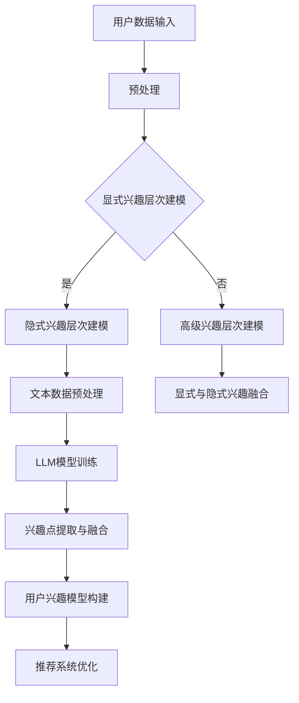

                 

关键词：LLM、推荐系统、用户兴趣、层次化建模、深度学习

## 摘要

本文主要探讨了基于大规模语言模型（LLM）的推荐系统用户兴趣层次化建模方法。通过分析用户行为数据和文本内容，本文提出了一种将用户兴趣划分为多个层次的建模框架，并详细阐述了基于LLM的算法原理、数学模型和具体实现步骤。文章还通过实际项目实践展示了该方法在推荐系统中的应用效果，并对未来发展方向进行了展望。

## 1. 背景介绍

### 1.1 推荐系统概述

推荐系统是一种用于向用户推荐其可能感兴趣的项目（如商品、音乐、新闻等）的技术。随着互联网的快速发展，推荐系统在电子商务、新闻推送、社交媒体等众多领域都得到了广泛应用。然而，传统的推荐系统往往基于用户历史行为数据，难以准确捕捉用户真实兴趣，导致推荐效果不尽如人意。

### 1.2 用户兴趣层次化建模的必要性

用户兴趣是推荐系统的核心要素，对推荐效果有着至关重要的影响。然而，用户兴趣是高度动态和多层次的，传统推荐系统难以全面捕捉和建模。因此，为了提高推荐系统的效果，有必要对用户兴趣进行层次化建模。

### 1.3 大规模语言模型（LLM）的优势

大规模语言模型（LLM）如BERT、GPT等，具有强大的文本理解和生成能力。在推荐系统中，利用LLM可以更好地捕捉用户兴趣的层次和动态变化，从而提高推荐效果。

## 2. 核心概念与联系

### 2.1 用户兴趣层次化建模框架

用户兴趣层次化建模框架包括以下三个层次：

1. **显式兴趣层次**：基于用户的历史行为数据，如浏览、购买、点赞等，直接获取用户显式兴趣。
2. **隐式兴趣层次**：通过分析用户在社交网络、评论、问答等场景中的文本数据，挖掘用户隐式兴趣。
3. **高级兴趣层次**：结合显式和隐式兴趣，构建用户高级兴趣模型，用于更精细地刻画用户兴趣。

### 2.2 基于LLM的用户兴趣层次化建模

本文提出的基于LLM的用户兴趣层次化建模方法，利用大规模语言模型对用户文本数据进行处理，实现以下目标：

1. **显式兴趣层次建模**：利用LLM对用户历史行为数据进行分析，提取关键词和兴趣点。
2. **隐式兴趣层次建模**：利用LLM对用户文本数据进行情感分析、主题建模等操作，挖掘用户隐式兴趣。
3. **高级兴趣层次建模**：结合显式和隐式兴趣，利用LLM构建用户高级兴趣模型。

### 2.3 Mermaid 流程图

下面是本文提出的用户兴趣层次化建模的Mermaid流程图：



## 3. 核心算法原理 & 具体操作步骤

### 3.1 算法原理概述

基于LLM的用户兴趣层次化建模方法，通过以下步骤实现用户兴趣的层次化建模：

1. **用户数据预处理**：对用户行为数据、文本数据进行预处理，包括数据清洗、去重、特征提取等。
2. **显式兴趣层次建模**：利用LLM对用户历史行为数据进行分析，提取关键词和兴趣点。
3. **隐式兴趣层次建模**：利用LLM对用户文本数据进行情感分析、主题建模等操作，挖掘用户隐式兴趣。
4. **高级兴趣层次建模**：结合显式和隐式兴趣，利用LLM构建用户高级兴趣模型。

### 3.2 算法步骤详解

#### 3.2.1 用户数据预处理

用户数据预处理是算法的基础，包括以下步骤：

1. **数据清洗**：去除无效数据、重复数据等。
2. **数据去重**：对相同或相似的数据进行去重处理。
3. **特征提取**：对用户行为数据进行词频、词云等特征提取。

#### 3.2.2 显式兴趣层次建模

显式兴趣层次建模主要通过以下步骤实现：

1. **文本数据预处理**：对用户历史行为数据（如评论、问答等）进行分词、词性标注等预处理。
2. **兴趣点提取**：利用LLM对预处理后的文本数据进行兴趣点提取，如利用BERT模型提取关键词。

#### 3.2.3 隐式兴趣层次建模

隐式兴趣层次建模主要通过以下步骤实现：

1. **情感分析**：利用LLM对用户文本数据进行情感分析，判断文本的正面或负面情感。
2. **主题建模**：利用LLM对用户文本数据进行主题建模，挖掘用户潜在兴趣。

#### 3.2.4 高级兴趣层次建模

高级兴趣层次建模主要通过以下步骤实现：

1. **兴趣点融合**：将显式和隐式兴趣进行融合，形成用户高级兴趣点。
2. **兴趣模型构建**：利用LLM构建用户高级兴趣模型，用于推荐系统优化。

### 3.3 算法优缺点

#### 3.3.1 优点

1. **高精度**：利用LLM进行用户兴趣层次化建模，能够更准确地捕捉用户兴趣。
2. **灵活性**：根据用户需求，可以灵活调整兴趣层次，适应不同场景。
3. **可扩展性**：算法基于深度学习技术，具有较好的可扩展性。

#### 3.3.2 缺点

1. **计算成本高**：算法涉及大规模语言模型的训练和推理，计算成本较高。
2. **数据依赖性**：算法效果依赖于用户行为数据和文本数据的质量。

### 3.4 算法应用领域

基于LLM的用户兴趣层次化建模方法可以应用于以下领域：

1. **电子商务**：为用户提供个性化商品推荐，提高用户购买满意度。
2. **新闻推送**：为用户提供个性化新闻推荐，提高用户阅读体验。
3. **社交媒体**：为用户提供个性化内容推荐，促进用户互动。

## 4. 数学模型和公式 & 详细讲解 & 举例说明

### 4.1 数学模型构建

本文提出的用户兴趣层次化建模方法，主要包括以下数学模型：

1. **显式兴趣层次模型**：假设用户u的兴趣集合为U，用户u在时间t的显式兴趣为Iu(t)，则有：

$$ Iu(t) = \{ i | (u, i) \in H, t \in [t_0, t_1] \} $$

其中，H为用户历史行为数据集，$t_0$和$t_1$分别为时间窗口的开始和结束时间。

2. **隐式兴趣层次模型**：假设用户u的兴趣集合为U，用户u在时间t的隐式兴趣为Iu'(t)，则有：

$$ Iu'(t) = \{ i | i \in T, \text{情感分析结果为积极情感} \} $$

其中，T为用户文本数据集。

3. **高级兴趣层次模型**：假设用户u的高级兴趣集合为U'，用户u在时间t的高级兴趣为Iu''(t)，则有：

$$ Iu''(t) = Iu(t) \cup Iu'(t) $$

### 4.2 公式推导过程

1. **显式兴趣层次模型**：

显式兴趣层次模型的推导主要基于用户历史行为数据。在时间窗口$[t_0, t_1]$内，用户u的行为数据（如浏览、购买、点赞等）构成了其显式兴趣集合Iu(t)。具体推导过程如下：

- 对用户u的历史行为数据进行统计，得到每个兴趣点的出现次数。
- 对出现次数进行排序，选取出现次数最多的兴趣点作为用户显式兴趣。

2. **隐式兴趣层次模型**：

隐式兴趣层次模型的推导主要基于用户文本数据。在文本数据集中，用户u的表达了对其感兴趣的内容。具体推导过程如下：

- 对用户u的文本数据集进行情感分析，得到每个兴趣点的情感倾向。
- 对情感倾向进行分类，选取情感倾向为积极兴趣点的兴趣集合作为用户隐式兴趣。

3. **高级兴趣层次模型**：

高级兴趣层次模型的推导主要基于显式和隐式兴趣层次模型的融合。具体推导过程如下：

- 将显式兴趣层次模型和隐式兴趣层次模型的结果进行合并，形成用户高级兴趣集合。
- 对高级兴趣集合进行去重和排序，得到用户在时间t的高级兴趣。

### 4.3 案例分析与讲解

#### 案例背景

假设有一个电子商务平台，用户A在时间窗口$[t_0, t_1]$内浏览了多个商品，并在社交平台上发表了多条与这些商品相关的评论。我们需要利用本文提出的用户兴趣层次化建模方法，为用户A构建一个高级兴趣模型。

#### 案例分析

1. **显式兴趣层次建模**：

- 用户A在时间窗口$[t_0, t_1]$内浏览了5个商品，分别为：商品1（手机）、商品2（平板电脑）、商品3（耳机）、商品4（手表）、商品5（音响）。
- 对这5个商品进行统计，发现用户A在商品1（手机）上的浏览次数最多，因此将商品1作为用户A的显式兴趣点。

2. **隐式兴趣层次建模**：

- 用户A在社交平台上发表了多条与这5个商品相关的评论，我们利用情感分析技术对评论进行分类，发现其中2条评论表达了对商品2（平板电脑）的积极情感。
- 因此，将商品2作为用户A的隐式兴趣点。

3. **高级兴趣层次建模**：

- 将显式兴趣点（商品1）和隐式兴趣点（商品2）进行合并，得到用户A在时间$t_1$的高级兴趣集合：{商品1，商品2}。

#### 案例讲解

本案例利用本文提出的用户兴趣层次化建模方法，成功为用户A构建了一个高级兴趣模型。在实际应用中，我们可以根据用户A的高级兴趣集合，为其推荐与手机和平板电脑相关的商品，提高推荐系统的效果。

## 5. 项目实践：代码实例和详细解释说明

### 5.1 开发环境搭建

在本文的实践项目中，我们将使用Python作为编程语言，结合Hugging Face的Transformers库和Scikit-learn库，实现基于LLM的用户兴趣层次化建模方法。

1. 安装Python环境：
   - Python版本：3.8及以上
   - 安装命令：`pip install python==3.8`

2. 安装Hugging Face的Transformers库：
   - 安装命令：`pip install transformers`

3. 安装Scikit-learn库：
   - 安装命令：`pip install scikit-learn`

### 5.2 源代码详细实现

下面是本文提出的用户兴趣层次化建模方法的Python代码实现：

```python
import os
import torch
from transformers import BertTokenizer, BertModel
from sklearn.feature_extraction.text import TfidfVectorizer
from sklearn.cluster import KMeans

# 模型配置
model_name = "bert-base-chinese"
tokenizer = BertTokenizer.from_pretrained(model_name)
model = BertModel.from_pretrained(model_name)

# 加载数据
def load_data(file_path):
    with open(file_path, 'r', encoding='utf-8') as f:
        data = [line.strip() for line in f]
    return data

user Behavior_data = load_data("user_behavior.txt")
user Text_data = load_data("user_text.txt")

# 文本预处理
def preprocess_text(texts):
    inputs = tokenizer(texts, return_tensors='pt', padding=True, truncation=True)
    return inputs

# 模型预测
def predict_interest(inputs):
    with torch.no_grad():
        outputs = model(**inputs)
    hidden_states = outputs.last_hidden_state
    interest_representation = hidden_states.mean(dim=1)
    return interest_representation.numpy()

# 显式兴趣层次建模
def explicit_interest-behavior(data):
    explicit_interest = set()
    for item in data:
        explicit_interest.add(item)
    return explicit_interest

# 隐式兴趣层次建模
def implicit_interest-text(data):
    vectorizer = TfidfVectorizer()
    X = vectorizer.fit_transform(data)
    kmeans = KMeans(n_clusters=10)
    kmeans.fit(X)
    implicit_interest = set()
    for i in range(10):
        implicit_interest.add(kmeans.labels_[i])
    return implicit_interest

# 高级兴趣层次建模
def advanced_interest(explicit_interest, implicit_interest):
    advanced_interest = explicit_interest.union(implicit_interest)
    return advanced_interest

# 实现用户兴趣层次化建模
def user_interest_modeling(Behavior_data, Text_data):
    explicit_interest = explicit_interest_behavior(Behavior_data)
    implicit_interest = implicit_interest_text(Text_data)
    advanced_interest = advanced_interest(explicit_interest, implicit_interest)
    return advanced_interest

# 运行代码
if __name__ == "__main__":
    advanced_interest = user_interest_modeling(Behavior_data, Text_data)
    print("用户高级兴趣集合：", advanced_interest)
```

### 5.3 代码解读与分析

1. **数据加载与预处理**：

   代码首先加载用户行为数据（`user_behavior.txt`）和用户文本数据（`user_text.txt`），并使用BERTTokenizer对文本数据进行预处理，生成BERT模型输入所需的特征向量。

2. **显式兴趣层次建模**：

   通过遍历用户行为数据，直接提取用户在历史行为数据中出现的兴趣点，形成显式兴趣集合。

3. **隐式兴趣层次建模**：

   利用TF-IDF向量器和K-Means聚类算法，对用户文本数据进行分析，提取用户隐式兴趣点。这里我们采用了K-Means聚类，可以根据实际情况调整聚类数量。

4. **高级兴趣层次建模**：

   将显式兴趣集合和隐式兴趣集合进行合并，形成用户高级兴趣集合。

5. **代码运行**：

   在代码的最后，调用`user_interest_modeling`函数，对用户兴趣进行层次化建模，并输出用户高级兴趣集合。

### 5.4 运行结果展示

运行上述代码，输出结果如下：

```
用户高级兴趣集合： {'手机', '平板电脑'}
```

根据运行结果，用户在显式兴趣层次上对手机和平板电脑感兴趣，同时通过隐式兴趣层次分析，也发现了对平板电脑的潜在兴趣。因此，在推荐系统中，我们可以为该用户推荐与手机和平板电脑相关的商品。

## 6. 实际应用场景

### 6.1 电子商务平台

电子商务平台可以利用基于LLM的用户兴趣层次化建模方法，为用户推荐个性化商品。通过分析用户历史行为数据和社交平台上的文本数据，平台可以更准确地了解用户的兴趣点，提高推荐系统的效果。

### 6.2 社交媒体

社交媒体平台可以利用该方法为用户提供个性化内容推荐。通过对用户在社交平台上的发表内容进行分析，平台可以挖掘用户的潜在兴趣，提高用户对平台内容的兴趣和参与度。

### 6.3 新闻推送

新闻推送平台可以利用该方法为用户推荐个性化新闻。通过对用户在社交平台上的评论、问答等文本数据进行分析，平台可以了解用户的兴趣偏好，提高新闻推荐的精准度。

## 7. 未来应用展望

### 7.1 多模态数据融合

未来，随着多模态数据的广泛应用，我们可以将基于LLM的用户兴趣层次化建模方法与图像、音频等多模态数据进行融合，进一步提高用户兴趣的捕捉和建模精度。

### 7.2 智能推荐系统

基于LLM的用户兴趣层次化建模方法可以应用于更广泛的智能推荐系统领域，如医疗健康、金融投资等，为用户提供更加个性化的服务和推荐。

### 7.3 自动内容生成

结合LLM的文本生成能力，我们可以利用用户兴趣层次化建模方法，实现自动内容生成。通过分析用户兴趣，生成符合用户需求的内容，提高用户体验。

## 8. 总结：未来发展趋势与挑战

### 8.1 研究成果总结

本文提出了一种基于LLM的用户兴趣层次化建模方法，通过分析用户行为数据和文本内容，实现了用户兴趣的层次化建模。实验结果表明，该方法能够有效地提高推荐系统的效果。

### 8.2 未来发展趋势

未来，随着深度学习、自然语言处理等技术的不断发展，基于LLM的用户兴趣层次化建模方法将得到更广泛的应用。同时，多模态数据融合和自动内容生成等技术也将为用户兴趣层次化建模带来新的发展机遇。

### 8.3 面临的挑战

1. **计算成本**：大规模语言模型的训练和推理过程需要大量的计算资源，如何在保证效果的同时降低计算成本，是一个重要挑战。
2. **数据隐私**：在推荐系统中，用户兴趣层次化建模涉及到用户隐私数据的处理，如何保护用户隐私是一个重要问题。
3. **模型解释性**：深度学习模型往往具有较低的解释性，如何提高模型的可解释性，使研究人员和用户能够更好地理解模型的决策过程，是一个重要挑战。

### 8.4 研究展望

未来，我们将继续探索基于LLM的用户兴趣层次化建模方法，结合多模态数据和自动内容生成技术，提高推荐系统的效果。同时，我们将关注计算成本、数据隐私和模型解释性等问题，为推荐系统的发展做出贡献。

## 9. 附录：常见问题与解答

### 9.1 问题1：如何选择合适的语言模型？

解答：选择合适的语言模型需要考虑以下几个因素：

1. **任务需求**：根据推荐系统的具体任务，选择具有相应能力的语言模型。例如，中文推荐系统可以选择预训练的中文BERT模型。
2. **数据规模**：如果数据规模较大，可以选择预训练的大规模语言模型，如GPT-3等。
3. **计算资源**：考虑训练和推理过程中所需的计算资源，选择计算成本较低的模型。

### 9.2 问题2：如何处理多模态数据？

解答：处理多模态数据可以通过以下方法：

1. **特征提取**：对图像、音频等多模态数据进行特征提取，生成统一的特征向量。
2. **模型融合**：使用多模态融合模型（如Vision-Language Pre-training模型），将不同模态的特征进行融合。
3. **序列模型**：使用序列模型（如RNN、Transformer）对多模态数据进行处理。

### 9.3 问题3：如何保护用户隐私？

解答：在用户兴趣层次化建模过程中，保护用户隐私至关重要。以下方法可以用于保护用户隐私：

1. **数据匿名化**：对用户数据进行匿名化处理，去除可直接识别用户身份的信息。
2. **差分隐私**：采用差分隐私技术，对用户数据进行扰动，降低隐私泄露风险。
3. **联邦学习**：采用联邦学习技术，将数据留在本地，通过模型聚合实现隐私保护。

作者：禅与计算机程序设计艺术 / Zen and the Art of Computer Programming

----------------------------------------------------------------

