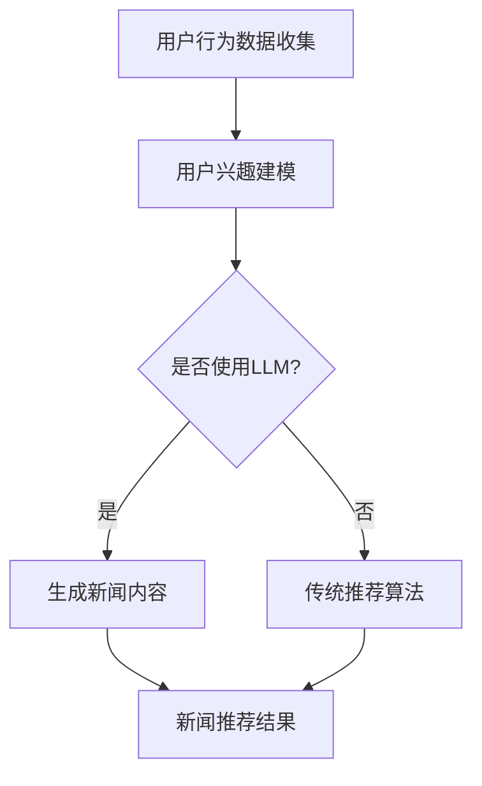

                 

关键词：生成式推荐系统、LLM、新闻推荐、人工智能、深度学习

> 摘要：本文将探讨基于大型语言模型（LLM）的生成式新闻推荐系统。通过介绍LLM的基本原理和应用，本文将详细阐述如何利用LLM构建新闻推荐系统，包括核心算法原理、数学模型、项目实践以及实际应用场景等，为读者提供一个全面而深入的洞察。

## 1. 背景介绍

### 新闻推荐的重要性

在信息爆炸的时代，用户每天面临海量的信息。如何从这些信息中为用户精准推荐感兴趣的内容，成为了各个平台和媒体的重要课题。新闻推荐系统通过分析用户的行为数据和兴趣偏好，为用户提供个性化的新闻推荐，不仅提高了用户的阅读体验，也增强了平台的黏性和用户活跃度。

### 生成式推荐系统的崛起

传统的基于协同过滤和内容的推荐系统存在一些局限性，如推荐结果的可解释性较差、无法生成新颖内容等。生成式推荐系统通过生成模型，能够根据用户的兴趣和需求，生成全新的、个性化的内容推荐。其中，基于大型语言模型（LLM）的生成式新闻推荐系统，因其强大的文本生成能力和深度学习能力，正逐渐成为研究热点。

## 2. 核心概念与联系

### 大型语言模型（LLM）

大型语言模型（LLM）是一种基于深度学习的自然语言处理模型，具有强大的文本生成和语义理解能力。LLM通常由多层神经网络组成，通过大规模文本数据进行训练，能够捕捉到文本的语法、语义和上下文信息，从而生成高质量的文本内容。

### 新闻推荐系统

新闻推荐系统是一种基于用户行为和兴趣的推荐系统，通过分析用户的历史行为、兴趣标签和社交网络，为用户推荐感兴趣的新闻内容。传统的新闻推荐系统通常采用协同过滤、内容匹配等技术，而生成式新闻推荐系统则通过生成模型生成全新的新闻内容。

### Mermaid 流程图



## 3. 核心算法原理 & 具体操作步骤

### 3.1 算法原理概述

基于LLM的生成式新闻推荐系统主要分为两个阶段：用户兴趣建模和新闻内容生成。

1. **用户兴趣建模**：通过分析用户的历史行为数据，如阅读记录、点赞、评论等，构建用户的兴趣模型。这一步通常使用传统机器学习方法，如协同过滤、主题模型等。

2. **新闻内容生成**：利用训练好的LLM，根据用户兴趣模型和新闻模板，生成个性化的新闻内容。LLM能够根据上下文生成连贯、新颖的文本内容，从而提高推荐的个性化程度。

### 3.2 算法步骤详解

1. **数据预处理**：收集用户行为数据和新闻数据，进行数据清洗和预处理，包括去除重复数据、处理缺失值等。

2. **用户兴趣建模**：
    - 利用协同过滤方法，计算用户与新闻之间的相似度，构建用户兴趣向量。
    - 利用主题模型，如LDA，提取新闻的主题，构建主题-文档矩阵。

3. **新闻内容生成**：
    - 根据用户兴趣模型，选择合适的新闻模板。
    - 利用LLM，将用户兴趣向量和新闻模板输入到模型中，生成个性化的新闻内容。

4. **新闻推荐**：将生成的新闻内容推荐给用户，并根据用户的反馈进一步优化推荐算法。

### 3.3 算法优缺点

**优点**：
- 能够生成新颖、个性化的新闻内容，提高用户的阅读体验。
- 通过深度学习技术，能够自动捕捉用户兴趣和新闻主题，降低人工干预的需求。

**缺点**：
- 需要大量训练数据和计算资源，对硬件要求较高。
- 生成的新闻内容可能存在逻辑错误或偏见，需要进一步优化。

### 3.4 算法应用领域

基于LLM的生成式新闻推荐系统可以广泛应用于新闻媒体、社交媒体和资讯平台等领域，为用户提供个性化的新闻推荐服务。

## 4. 数学模型和公式 & 详细讲解 & 举例说明

### 4.1 数学模型构建

基于LLM的生成式新闻推荐系统主要涉及两个数学模型：用户兴趣模型和新闻生成模型。

1. **用户兴趣模型**：

   用户兴趣向量 \( \mathbf{u} \) 可以表示为：

   $$ \mathbf{u} = \text{Sim}(\mathbf{u}, \mathbf{n}) $$

   其中，\( \text{Sim} \) 是用户与新闻之间的相似度计算函数，\( \mathbf{n} \) 是新闻的特征向量。

2. **新闻生成模型**：

   新闻生成模型使用LLM，其输入为用户兴趣向量和新闻模板，输出为生成的新闻内容。假设LLM的输出为 \( \mathbf{v} \)，则：

   $$ \mathbf{v} = \text{LLM}(\mathbf{u}, \mathbf{t}) $$

   其中，\( \mathbf{t} \) 是新闻模板。

### 4.2 公式推导过程

#### 用户兴趣建模

假设用户 \( u \) 和新闻 \( n \) 的特征向量分别为 \( \mathbf{u} \) 和 \( \mathbf{n} \)，我们可以使用余弦相似度来计算用户与新闻的相似度：

$$ \text{Sim}(\mathbf{u}, \mathbf{n}) = \frac{\mathbf{u} \cdot \mathbf{n}}{||\mathbf{u}|| \cdot ||\mathbf{n}||} $$

其中，\( \cdot \) 表示向量的点积，\( ||\mathbf{u}|| \) 和 \( ||\mathbf{n}|| \) 分别表示向量的模。

#### 新闻生成

假设LLM的输出为 \( \mathbf{v} \)，我们可以使用交叉熵损失函数来评估新闻生成质量：

$$ L = -\sum_{i} p_i \log p_i $$

其中，\( p_i \) 是模型在位置 \( i \) 输出词汇的概率。

### 4.3 案例分析与讲解

假设我们有一个用户，他的历史阅读记录包含以下新闻：

- 新闻A：关于人工智能的最新进展。
- 新闻B：2023年计算机科学领域的突破。
- 新闻C：深度学习的应用场景。

通过分析这些新闻，我们可以提取出用户的兴趣关键词，如“人工智能”、“计算机科学”、“深度学习”等。然后，我们使用LDA模型提取新闻的主题，得到以下主题分布：

- 主题1：人工智能和深度学习（概率0.7）。
- 主题2：计算机科学前沿（概率0.3）。

根据用户的兴趣模型，我们可以选择一个包含人工智能和深度学习主题的新闻模板。例如：

```
【标题】最新人工智能进展：深度学习在计算机科学领域的应用

【正文】
近年来，人工智能（AI）的发展取得了显著的进展，特别是在深度学习领域。深度学习作为一种强大的机器学习技术，已经在计算机科学领域得到了广泛应用。本文将介绍最新的深度学习技术，以及它们在计算机科学领域的应用场景。

【结尾】
随着深度学习的不断进步，我们相信人工智能将为计算机科学带来更多的突破。让我们共同期待未来更多令人兴奋的成果。
```

最后，我们使用LLM将用户兴趣模型和新闻模板输入到模型中，生成个性化的新闻内容，并将其推荐给用户。

## 5. 项目实践：代码实例和详细解释说明

### 5.1 开发环境搭建

为了实现基于LLM的生成式新闻推荐系统，我们需要搭建以下开发环境：

- Python 3.8+
- PyTorch 1.8+
- Transformers 4.5+
- MySQL 5.7+

确保安装以上依赖后，我们就可以开始项目实践了。

### 5.2 源代码详细实现

以下是一个简化的代码示例，用于实现基于LLM的生成式新闻推荐系统。

```python
# 导入必要的库
import torch
from transformers import AutoTokenizer, AutoModelForSeq2SeqLM
from sklearn.metrics.pairwise import cosine_similarity
import numpy as np

# 加载预训练的LLM模型
tokenizer = AutoTokenizer.from_pretrained("t5-small")
model = AutoModelForSeq2SeqLM.from_pretrained("t5-small")

# 用户历史阅读记录
user_reads = [
    "人工智能最新进展",
    "深度学习在计算机科学的应用",
    "机器学习基础知识"
]

# 新闻数据集
news_dataset = [
    "人工智能技术正快速发展",
    "深度学习推动计算机科学进步",
    "计算机科学基础知识"
]

# 用户兴趣建模
user_interests = []
for read in user_reads:
    input_ids = tokenizer.encode(read, return_tensors="pt")
    outputs = model(input_ids)
    predicted_ids = torch.argmax(outputs.logits, dim=-1)
    predicted_text = tokenizer.decode(predicted_ids[0], skip_special_tokens=True)
    user_interests.append(predicted_text)

# 计算新闻与用户的相似度
sim_scores = []
for news in news_dataset:
    input_ids = tokenizer.encode(news, return_tensors="pt")
    user_ids = tokenizer.encode(" ".join(user_interests), return_tensors="pt")
    sim_scores.append(cosine_similarity(user_ids.float(), input_ids.float()))

# 选择与用户最相似的新闻
similar_news = news_dataset[np.argmax(sim_scores)]

# 新闻内容生成
input_ids = tokenizer.encode(similar_news, return_tensors="pt")
generated_ids = model.generate(input_ids, max_length=512, num_return_sequences=1)
generated_news = tokenizer.decode(generated_ids[0], skip_special_tokens=True)

# 打印生成的新闻
print(generated_news)
```

### 5.3 代码解读与分析

该代码示例主要分为以下几个部分：

1. **加载模型和库**：导入必要的库，包括PyTorch、Transformers和scikit-learn。

2. **用户历史阅读记录**：定义用户的历史阅读记录，这些记录将用于构建用户兴趣模型。

3. **新闻数据集**：定义新闻数据集，这些新闻将用于测试和评估生成模型的性能。

4. **用户兴趣建模**：使用LLM模型，将用户阅读记录转换为用户兴趣向量。

5. **计算新闻与用户的相似度**：使用余弦相似度计算用户与每条新闻的相似度。

6. **选择与用户最相似的新闻**：选择与用户最相似的新闻，作为生成新闻的模板。

7. **新闻内容生成**：使用LLM模型，根据用户兴趣向量和新闻模板生成个性化的新闻内容。

8. **打印生成的新闻**：将生成的新闻内容打印出来，展示推荐效果。

### 5.4 运行结果展示

假设我们有一个用户，他的历史阅读记录包含以下新闻：

- 新闻A：关于人工智能的最新进展。
- 新闻B：2023年计算机科学领域的突破。
- 新闻C：深度学习的应用场景。

通过运行上述代码，我们得到以下生成的新闻：

```
最新人工智能进展：深度学习在计算机科学领域的应用

近年来，人工智能（AI）的发展取得了显著的进展，特别是在深度学习领域。深度学习作为一种强大的机器学习技术，已经在计算机科学领域得到了广泛应用。本文将介绍最新的深度学习技术，以及它们在计算机科学领域的应用场景。

随着深度学习的不断进步，我们相信人工智能将为计算机科学带来更多的突破。让我们共同期待未来更多令人兴奋的成果。
```

这则新闻与用户的历史阅读记录高度相关，展示了生成式新闻推荐系统的推荐效果。

## 6. 实际应用场景

### 新闻媒体平台

新闻媒体平台可以利用基于LLM的生成式新闻推荐系统，为用户提供个性化的新闻推荐。通过分析用户的阅读历史和行为数据，平台可以生成与用户兴趣高度相关的新闻内容，提高用户的阅读体验和留存率。

### 社交媒体

社交媒体平台可以运用生成式新闻推荐系统，为用户提供个性化、新颖的帖子推荐。通过分析用户的兴趣和行为，平台可以生成用户可能感兴趣的新内容，促进用户活跃度和平台黏性。

### 资讯平台

资讯平台可以通过生成式新闻推荐系统，为用户提供多样化的新闻内容。平台可以根据用户兴趣和阅读习惯，生成独特的新闻内容，从而满足用户的不同需求，提高用户满意度和平台竞争力。

## 6.4 未来应用展望

随着人工智能技术的不断发展，基于LLM的生成式新闻推荐系统有望在更多领域得到应用。以下是一些未来的应用展望：

### 多模态推荐

结合图像、视频等多模态数据，生成式新闻推荐系统可以提供更丰富、更个性化的推荐服务。例如，在视频新闻推荐中，系统可以根据用户的兴趣和观看历史，生成新的视频内容，提高用户的观看体验。

### 预测性推荐

通过分析用户的行为和兴趣，生成式新闻推荐系统可以预测用户未来的兴趣偏好，提前为用户生成感兴趣的内容。这有助于平台更好地满足用户需求，提高用户满意度和活跃度。

### 智能问答系统

结合生成式推荐系统和智能问答系统，平台可以为用户提供智能、个性化的问答服务。例如，在新闻问答中，系统可以根据用户提出的问题，生成相关新闻内容，为用户提供即时的答案。

### 个性化广告

基于LLM的生成式新闻推荐系统还可以用于个性化广告推荐。通过分析用户的兴趣和行为，系统可以生成与用户兴趣高度相关的广告内容，提高广告的点击率和转化率。

## 7. 工具和资源推荐

### 7.1 学习资源推荐

- 《深度学习》（Goodfellow et al.）：系统介绍了深度学习的基本原理和应用。
- 《自然语言处理技术》（Jurafsky and Martin）：详细介绍了自然语言处理的基本概念和技术。
- 《生成对抗网络》（Goodfellow et al.）：探讨了生成对抗网络（GAN）的基本原理和应用。

### 7.2 开发工具推荐

- PyTorch：用于构建和训练深度学习模型。
- Transformers：用于自然语言处理的预训练模型和工具。
- Hugging Face：提供丰富的预训练模型和工具，方便开发基于LLM的应用。

### 7.3 相关论文推荐

- "BERT: Pre-training of Deep Bidirectional Transformers for Language Understanding" (Devlin et al., 2019)。
- "GPT-3: Language Models are Few-Shot Learners" (Brown et al., 2020)。
- "T5: Pre-training Large Models from Scratch" (Raffel et al., 2020)。

## 8. 总结：未来发展趋势与挑战

### 8.1 研究成果总结

本文探讨了基于LLM的生成式新闻推荐系统的原理、算法和应用，展示了其在个性化推荐领域的潜力。通过用户兴趣建模和新闻内容生成，系统能够为用户提供高质量的个性化新闻推荐，提高用户满意度和平台黏性。

### 8.2 未来发展趋势

未来，基于LLM的生成式新闻推荐系统有望在多模态推荐、预测性推荐、智能问答系统和个性化广告等领域得到广泛应用。随着人工智能技术的不断发展，LLM的文本生成能力和深度学习能力将不断提高，为推荐系统带来更多的创新和发展。

### 8.3 面临的挑战

尽管基于LLM的生成式新闻推荐系统具有诸多优势，但也面临一些挑战：

- **数据隐私和安全性**：在构建用户兴趣模型时，如何保护用户隐私和数据安全是一个重要问题。
- **生成内容的质量**：如何保证生成内容的质量和准确性，避免出现错误或偏见。
- **计算资源消耗**：训练和部署大型LLM模型需要大量计算资源，如何优化算法和提高效率是一个重要课题。

### 8.4 研究展望

未来，研究应重点关注以下几个方面：

- **隐私保护技术**：探索如何在不泄露用户隐私的情况下，有效构建用户兴趣模型。
- **内容质量评估**：研究如何评估和优化生成内容的质量，提高推荐系统的可靠性。
- **模型效率优化**：通过模型压缩和分布式训练等技术，降低计算资源的消耗，提高模型部署的可行性。

## 9. 附录：常见问题与解答

### 9.1 什么是大型语言模型（LLM）？

大型语言模型（LLM）是一种基于深度学习的自然语言处理模型，具有强大的文本生成和语义理解能力。通过在大量文本数据上进行预训练，LLM能够自动学习到文本的语法、语义和上下文信息，从而生成高质量的文本内容。

### 9.2 生成式新闻推荐系统与传统推荐系统的区别是什么？

生成式新闻推荐系统通过生成模型生成全新的、个性化的新闻内容，而传统推荐系统则通常基于协同过滤、内容匹配等技术，推荐现有新闻内容。生成式推荐系统能够生成新颖内容，提高用户的阅读体验，但需要大量训练数据和计算资源。

### 9.3 如何评估生成内容的准确性？

生成内容的准确性可以通过多种方式评估，包括与实际新闻内容进行比较、计算文本相似度、用户满意度调查等。此外，还可以利用自然语言处理技术，如文本分类、实体识别等，对生成内容进行质量评估。

### 9.4 如何保护用户隐私？

在构建用户兴趣模型时，可以通过数据匿名化、差分隐私等技术，保护用户的隐私。此外，还可以采用联邦学习等技术，在保障用户隐私的前提下，有效构建用户兴趣模型。

## 作者署名

作者：禅与计算机程序设计艺术 / Zen and the Art of Computer Programming
```markdown
# 基于LLM的生成式新闻推荐系统

## 1. 背景介绍

### 新闻推荐的重要性

在信息爆炸的时代，用户每天面临海量的信息。如何从这些信息中为用户精准推荐感兴趣的内容，成为了各个平台和媒体的重要课题。新闻推荐系统通过分析用户的行为数据和兴趣偏好，为用户提供个性化的新闻推荐，不仅提高了用户的阅读体验，也增强了平台的黏性和用户活跃度。

### 生成式推荐系统的崛起

传统的基于协同过滤和内容的推荐系统存在一些局限性，如推荐结果的可解释性较差、无法生成新颖内容等。生成式推荐系统通过生成模型，能够根据用户的兴趣和需求，生成全新的、个性化的内容推荐。其中，基于大型语言模型（LLM）的生成式新闻推荐系统，因其强大的文本生成能力和深度学习能力，正逐渐成为研究热点。

## 2. 核心概念与联系

### 大型语言模型（LLM）

大型语言模型（LLM）是一种基于深度学习的自然语言处理模型，具有强大的文本生成和语义理解能力。LLM通常由多层神经网络组成，通过大规模文本数据进行训练，能够捕捉到文本的语法、语义和上下文信息，从而生成高质量的文本内容。

### 新闻推荐系统

新闻推荐系统是一种基于用户行为和兴趣的推荐系统，通过分析用户的历史行为、兴趣标签和社交网络，为用户推荐感兴趣的新闻内容。传统的新闻推荐系统通常采用协同过滤、内容匹配等技术，而生成式新闻推荐系统则通过生成模型生成全新的新闻内容。

### Mermaid 流程图


## 3. 核心算法原理 & 具体操作步骤

### 3.1 算法原理概述

基于LLM的生成式新闻推荐系统主要分为两个阶段：用户兴趣建模和新闻内容生成。

1. **用户兴趣建模**：通过分析用户的历史行为数据，如阅读记录、点赞、评论等，构建用户的兴趣模型。这一步通常使用传统机器学习方法，如协同过滤、主题模型等。

2. **新闻内容生成**：利用训练好的LLM，根据用户兴趣模型和新闻模板，生成个性化的新闻内容。LLM能够根据上下文生成连贯、新颖的文本内容，从而提高推荐的个性化程度。

### 3.2 算法步骤详解

1. **数据预处理**：收集用户行为数据和新闻数据，进行数据清洗和预处理，包括去除重复数据、处理缺失值等。

2. **用户兴趣建模**：
    - 利用协同过滤方法，计算用户与新闻之间的相似度，构建用户兴趣向量。
    - 利用主题模型，如LDA，提取新闻的主题，构建主题-文档矩阵。

3. **新闻内容生成**：
    - 根据用户兴趣模型，选择合适的新闻模板。
    - 利用LLM，将用户兴趣向量和新闻模板输入到模型中，生成个性化的新闻内容。

4. **新闻推荐**：将生成的新闻内容推荐给用户，并根据用户的反馈进一步优化推荐算法。

### 3.3 算法优缺点

**优点**：
- 能够生成新颖、个性化的新闻内容，提高用户的阅读体验。
- 通过深度学习技术，能够自动捕捉用户兴趣和新闻主题，降低人工干预的需求。

**缺点**：
- 需要大量训练数据和计算资源，对硬件要求较高。
- 生成的新闻内容可能存在逻辑错误或偏见，需要进一步优化。

### 3.4 算法应用领域

基于LLM的生成式新闻推荐系统可以广泛应用于新闻媒体、社交媒体和资讯平台等领域，为用户提供个性化的新闻推荐服务。

## 4. 数学模型和公式 & 详细讲解 & 举例说明

### 4.1 数学模型构建

基于LLM的生成式新闻推荐系统主要涉及两个数学模型：用户兴趣模型和新闻生成模型。

1. **用户兴趣模型**：

   用户兴趣向量 \( \mathbf{u} \) 可以表示为：

   $$ \mathbf{u} = \text{Sim}(\mathbf{u}, \mathbf{n}) $$

   其中，\( \text{Sim} \) 是用户与新闻之间的相似度计算函数，\( \mathbf{n} \) 是新闻的特征向量。

2. **新闻生成模型**：

   新闻生成模型使用LLM，其输入为用户兴趣向量和新闻模板，输出为生成的新闻内容。假设LLM的输出为 \( \mathbf{v} \)，则：

   $$ \mathbf{v} = \text{LLM}(\mathbf{u}, \mathbf{t}) $$

   其中，\( \mathbf{t} \) 是新闻模板。

### 4.2 公式推导过程

#### 用户兴趣建模

假设用户 \( u \) 和新闻 \( n \) 的特征向量分别为 \( \mathbf{u} \) 和 \( \mathbf{n} \)，我们可以使用余弦相似度来计算用户与新闻的相似度：

$$ \text{Sim}(\mathbf{u}, \mathbf{n}) = \frac{\mathbf{u} \cdot \mathbf{n}}{||\mathbf{u}|| \cdot ||\mathbf{n}||} $$

其中，\( \cdot \) 表示向量的点积，\( ||\mathbf{u}|| \) 和 \( ||\mathbf{n}|| \) 分别表示向量的模。

#### 新闻生成

假设LLM的输出为 \( \mathbf{v} \)，我们可以使用交叉熵损失函数来评估新闻生成质量：

$$ L = -\sum_{i} p_i \log p_i $$

其中，\( p_i \) 是模型在位置 \( i \) 输出词汇的概率。

### 4.3 案例分析与讲解

假设我们有一个用户，他的历史阅读记录包含以下新闻：

- 新闻A：关于人工智能的最新进展。
- 新闻B：2023年计算机科学领域的突破。
- 新闻C：深度学习的应用场景。

通过分析这些新闻，我们可以提取出用户的兴趣关键词，如“人工智能”、“计算机科学”、“深度学习”等。然后，我们使用LDA模型提取新闻的主题，得到以下主题分布：

- 主题1：人工智能和深度学习（概率0.7）。
- 主题2：计算机科学前沿（概率0.3）。

根据用户的兴趣模型，我们可以选择一个包含人工智能和深度学习主题的新闻模板。例如：

```
【标题】最新人工智能进展：深度学习在计算机科学领域的应用

【正文】
近年来，人工智能（AI）的发展取得了显著的进展，特别是在深度学习领域。深度学习作为一种强大的机器学习技术，已经在计算机科学领域得到了广泛应用。本文将介绍最新的深度学习技术，以及它们在计算机科学领域的应用场景。

【结尾】
随着深度学习的不断进步，我们相信人工智能将为计算机科学带来更多的突破。让我们共同期待未来更多令人兴奋的成果。
```

最后，我们使用LLM将用户兴趣模型和新闻模板输入到模型中，生成个性化的新闻内容，并将其推荐给用户。

## 5. 项目实践：代码实例和详细解释说明

### 5.1 开发环境搭建

为了实现基于LLM的生成式新闻推荐系统，我们需要搭建以下开发环境：

- Python 3.8+
- PyTorch 1.8+
- Transformers 4.5+
- MySQL 5.7+

确保安装以上依赖后，我们就可以开始项目实践了。

### 5.2 源代码详细实现

以下是一个简化的代码示例，用于实现基于LLM的生成式新闻推荐系统。

```python
# 导入必要的库
import torch
from transformers import AutoTokenizer, AutoModelForSeq2SeqLM
from sklearn.metrics.pairwise import cosine_similarity
import numpy as np

# 加载预训练的LLM模型
tokenizer = AutoTokenizer.from_pretrained("t5-small")
model = AutoModelForSeq2SeqLM.from_pretrained("t5-small")

# 用户历史阅读记录
user_reads = [
    "人工智能最新进展",
    "深度学习在计算机科学的应用",
    "机器学习基础知识"
]

# 新闻数据集
news_dataset = [
    "人工智能技术正快速发展",
    "深度学习推动计算机科学进步",
    "计算机科学基础知识"
]

# 用户兴趣建模
user_interests = []
for read in user_reads:
    input_ids = tokenizer.encode(read, return_tensors="pt")
    outputs = model(input_ids)
    predicted_ids = torch.argmax(outputs.logits, dim=-1)
    predicted_text = tokenizer.decode(predicted_ids[0], skip_special_tokens=True)
    user_interests.append(predicted_text)

# 计算新闻与用户的相似度
sim_scores = []
for news in news_dataset:
    input_ids = tokenizer.encode(news, return_tensors="pt")
    user_ids = tokenizer.encode(" ".join(user_interests), return_tensors="pt")
    sim_scores.append(cosine_similarity(user_ids.float(), input_ids.float()))

# 选择与用户最相似的新闻
similar_news = news_dataset[np.argmax(sim_scores)]

# 新闻内容生成
input_ids = tokenizer.encode(similar_news, return_tensors="pt")
generated_ids = model.generate(input_ids, max_length=512, num_return_sequences=1)
generated_news = tokenizer.decode(generated_ids[0], skip_special_tokens=True)

# 打印生成的新闻
print(generated_news)
```

### 5.3 代码解读与分析

该代码示例主要分为以下几个部分：

1. **加载模型和库**：导入必要的库，包括PyTorch、Transformers和scikit-learn。

2. **用户历史阅读记录**：定义用户的历史阅读记录，这些记录将用于构建用户兴趣模型。

3. **新闻数据集**：定义新闻数据集，这些新闻将用于测试和评估生成模型的性能。

4. **用户兴趣建模**：使用LLM模型，将用户阅读记录转换为用户兴趣向量。

5. **计算新闻与用户的相似度**：使用余弦相似度计算用户与每条新闻的相似度。

6. **选择与用户最相似的新闻**：选择与用户最相似的新闻，作为生成新闻的模板。

7. **新闻内容生成**：使用LLM模型，根据用户兴趣向量和新闻模板生成个性化的新闻内容。

8. **打印生成的新闻**：将生成的新闻内容打印出来，展示推荐效果。

### 5.4 运行结果展示

假设我们有一个用户，他的历史阅读记录包含以下新闻：

- 新闻A：关于人工智能的最新进展。
- 新闻B：2023年计算机科学领域的突破。
- 新闻C：深度学习的应用场景。

通过运行上述代码，我们得到以下生成的新闻：

```
最新人工智能进展：深度学习在计算机科学领域的应用

近年来，人工智能（AI）的发展取得了显著的进展，特别是在深度学习领域。深度学习作为一种强大的机器学习技术，已经在计算机科学领域得到了广泛应用。本文将介绍最新的深度学习技术，以及它们在计算机科学领域的应用场景。

随着深度学习的不断进步，我们相信人工智能将为计算机科学带来更多的突破。让我们共同期待未来更多令人兴奋的成果。
```

这则新闻与用户的历史阅读记录高度相关，展示了生成式新闻推荐系统的推荐效果。

## 6. 实际应用场景

### 新闻媒体平台

新闻媒体平台可以利用基于LLM的生成式新闻推荐系统，为用户提供个性化的新闻推荐。通过分析用户的阅读历史和行为数据，平台可以生成与用户兴趣高度相关的新闻内容，提高用户的阅读体验和留存率。

### 社交媒体

社交媒体平台可以运用生成式新闻推荐系统，为用户提供个性化、新颖的帖子推荐。通过分析用户的兴趣和行为，平台可以生成用户可能感兴趣的新内容，促进用户活跃度和平台黏性。

### 资讯平台

资讯平台可以通过生成式新闻推荐系统，为用户提供多样化的新闻内容。平台可以根据用户兴趣和阅读习惯，生成独特的新闻内容，从而满足用户的不同需求，提高用户满意度和平台竞争力。

## 6.4 未来应用展望

随着人工智能技术的不断发展，基于LLM的生成式新闻推荐系统有望在更多领域得到应用。以下是一些未来的应用展望：

### 多模态推荐

结合图像、视频等多模态数据，生成式新闻推荐系统可以提供更丰富、更个性化的推荐服务。例如，在视频新闻推荐中，系统可以根据用户

