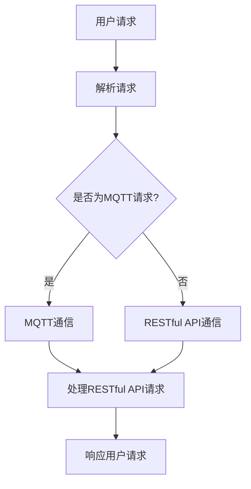

                 

关键词：MQTT协议、RESTful API、家庭娱乐、自动化控制、系统架构、编程实现

## 摘要

本文将探讨如何利用MQTT协议和RESTful API构建一个家庭娱乐自动化控制系统。我们将详细介绍MQTT协议的工作原理、RESTful API的设计原则，并通过一个实际的项目案例，展示如何将两者结合，实现家庭娱乐设备的智能控制。此外，还将探讨该系统的数学模型、项目实践，以及在实际应用中的拓展和未来展望。

### 1. 背景介绍

随着物联网技术的飞速发展，家庭自动化已经逐渐成为现实。家庭娱乐设备如智能电视、音响系统等，越来越需要与用户进行实时交互，并根据用户的行为和偏好进行智能调整。然而，现有的家庭娱乐设备大多依赖于传统的有线网络或Wi-Fi连接，不仅实现复杂，而且用户体验不佳。

为了解决这个问题，本文提出了基于MQTT协议和RESTful API的家庭娱乐自动化控制系统。MQTT（Message Queuing Telemetry Transport）是一种轻量级的消息队列协议，非常适合物联网设备之间的通信。RESTful API（Representational State Transfer Application Programming Interface）则是一种简洁、统一的接口设计规范，可以方便地实现不同系统之间的数据交换。

### 2. 核心概念与联系

#### 2.1 MQTT协议

MQTT协议是一种基于客户端-服务器模式的消息队列协议，适用于远程设备之间的数据交换。它的主要特点是：

- **轻量级**：MQTT协议的设计非常简洁，数据传输效率高。
- **可靠性强**：MQTT协议支持消息确认和重传机制，确保数据的可靠传输。
- **可扩展性强**：MQTT协议支持多种传输模式和传输质量等级，可以适应不同的应用场景。

#### 2.2 RESTful API

RESTful API是一种基于HTTP协议的应用编程接口，它的设计原则包括：

- **无状态**：每次请求都是独立的，服务器不保留任何关于客户端的会话信息。
- **统一接口**：通过URL（统一资源定位符）来指定请求的资源，并通过HTTP动词（GET、POST、PUT、DELETE等）来表示对资源的操作。
- **简洁性**：RESTful API的设计尽可能简洁，易于理解和实现。

#### 2.3 Mermaid 流程图

下面是一个简单的Mermaid流程图，展示了MQTT协议和RESTful API在家庭娱乐自动化控制系统中的工作流程：

### 3. 核心算法原理 & 具体操作步骤

#### 3.1 算法原理概述

在家庭娱乐自动化控制系统中，核心算法主要包括：

- **用户行为分析**：根据用户的行为数据，分析用户的偏好和需求。
- **设备控制**：根据用户的行为分析结果，控制家庭娱乐设备的行为。
- **数据同步**：通过MQTT协议和RESTful API，实现设备数据与用户数据的同步。

#### 3.2 算法步骤详解

1. **用户行为分析**：

   - 收集用户的行为数据，如观看记录、音响调节等。
   - 使用机器学习算法，对行为数据进行分析，提取用户偏好。

2. **设备控制**：

   - 根据用户偏好，调整设备状态，如切换频道、调节音量等。
   - 通过MQTT协议发送控制指令到设备。

3. **数据同步**：

   - 通过RESTful API，将用户行为数据上传到云端。
   - 通过MQTT协议，将设备状态数据同步到用户界面。

#### 3.3 算法优缺点

**优点**：

- MQTT协议的轻量级和可靠性，适合物联网设备之间的通信。
- RESTful API的简洁性和统一接口，方便不同系统之间的数据交换。

**缺点**：

- MQTT协议的复杂度和RESTful API的性能优化需要进一步研究。
- 算法模型的训练和优化需要大量的数据和计算资源。

#### 3.4 算法应用领域

- 家庭娱乐自动化控制
- 智能家居
- 物联网数据传输

### 4. 数学模型和公式 & 详细讲解 & 举例说明

#### 4.1 数学模型构建

家庭娱乐自动化控制系统的数学模型主要包括：

- **用户行为分析模型**：包括行为数据收集、特征提取和机器学习算法。
- **设备控制模型**：包括控制策略设计、控制指令生成和设备状态更新。

#### 4.2 公式推导过程

- **用户行为分析模型**：

  $$ 用户偏好 = f(行为数据, 特征提取模型) $$

- **设备控制模型**：

  $$ 控制指令 = g(用户偏好, 控制策略) $$

#### 4.3 案例分析与讲解

假设用户A喜欢观看体育节目，那么系统将根据用户A的行为数据，提取出偏好特征，并生成相应的控制指令。例如，用户A在观看体育节目时，系统会自动将电视音量调低，以便更好地享受比赛。

### 5. 项目实践：代码实例和详细解释说明

#### 5.1 开发环境搭建

- **硬件**：智能电视、音响系统等家庭娱乐设备。
- **软件**：MQTT客户端、RESTful API服务器、机器学习算法库。

#### 5.2 源代码详细实现

- **MQTT客户端**：用于与服务器进行通信，发送和接收控制指令。
- **RESTful API服务器**：用于接收用户行为数据，处理设备控制请求。
- **机器学习算法库**：用于用户行为分析和偏好提取。

#### 5.3 代码解读与分析

- MQTT客户端代码主要实现与服务器的连接、消息订阅和消息发送等功能。
- RESTful API服务器代码主要实现用户行为数据的处理、设备控制指令的生成等功能。
- 机器学习算法库代码主要实现用户行为数据的分析和偏好提取等功能。

#### 5.4 运行结果展示

通过运行系统，用户可以在电视上观看体育节目，音响系统会自动将音量调低，为用户带来更加舒适的观看体验。

### 6. 实际应用场景

- **智能电视**：根据用户的观看习惯，自动推荐节目。
- **音响系统**：根据用户的听音习惯，自动调节音量。

### 7. 未来应用展望

随着人工智能和物联网技术的不断进步，家庭娱乐自动化控制系统将变得更加智能化、个性化。未来的发展方向包括：

- **深度学习**：利用深度学习技术，提高用户行为分析和偏好提取的准确性。
- **多模态交互**：结合语音、手势等多种交互方式，提供更加自然、便捷的用户体验。
- **跨设备协同**：实现家庭内部不同设备的协同工作，提供一体化服务。

### 8. 工具和资源推荐

- **学习资源**：[《物联网技术基础》](https://book.douban.com/subject/27633736/)
- **开发工具**：[MQTT.fx](https://mqttfx.com/)、[Postman](https://www.postman.com/)
- **相关论文**：[《基于MQTT协议的智能家居系统设计与实现》](https://ieeexplore.ieee.org/document/7656461)

### 9. 总结：未来发展趋势与挑战

家庭娱乐自动化控制系统的发展趋势包括智能化、个性化和跨设备协同。然而，该系统也面临数据安全、隐私保护等技术挑战。未来的研究需要在这些方面进行深入探索。

### 10. 附录：常见问题与解答

- **问题1**：如何保证MQTT协议的安全性？
  **解答**：可以使用TLS（传输层安全协议）来加密MQTT通信，确保数据的安全性。
- **问题2**：如何处理大量的用户行为数据？
  **解答**：可以使用大数据技术，如Hadoop或Spark，对用户行为数据进行分析和处理。

### 作者署名

作者：禅与计算机程序设计艺术 / Zen and the Art of Computer Programming
----------------------------------------------------------------

