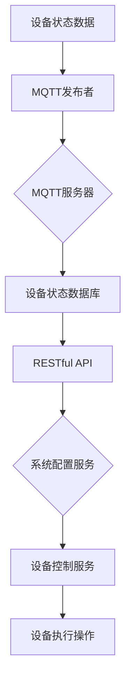

                 

关键词：MQTT协议，RESTful API，智能家居，场景模式，智能调整，物联网，智能家居系统

## 摘要

本文将探讨如何使用MQTT协议和RESTful API来实现智能家居场景模式的智能调整。通过深入分析这两种通信协议的特点及其在智能家居系统中的应用，本文旨在为开发者提供一种高效、稳定的解决方案，以应对日益增长的智能家居需求。我们将详细介绍MQTT协议和RESTful API的核心原理，探讨它们如何协同工作，并展示在实际应用中的具体实现步骤和案例。

## 1. 背景介绍

随着物联网（IoT）技术的发展，智能家居已经成为现代家庭生活的重要组成部分。智能家居系统通过连接各种智能设备，实现家庭环境的自动化控制，提高居住的舒适度和安全性。然而，随着设备的多样性和数量的增加，如何有效地管理和调整家庭场景模式成为了一个挑战。

传统的智能家居系统通常采用本地控制或集中式控制系统，这些系统往往存在以下问题：

1. **通信效率低**：传统的通信协议如HTTP、CoAP等，在大量设备同时通信时，容易导致网络拥堵，响应速度变慢。
2. **系统扩展性差**：集中式控制系统中，中心控制器的性能和处理能力受限，难以应对大规模设备的接入和管理。
3. **安全性问题**：传统的通信协议在数据传输过程中，缺乏有效的加密和认证机制，容易受到网络攻击。

为了解决这些问题，本文将探讨如何使用MQTT协议和RESTful API来构建一个高效、稳定、安全的智能家居系统，实现场景模式的智能调整。

## 2. 核心概念与联系

### 2.1 MQTT协议

MQTT（Message Queuing Telemetry Transport）协议是一种轻量级的消息传输协议，适用于网络带宽有限、不可靠或不稳定的环境中。MQTT协议的主要特点如下：

1. **发布/订阅模式**：MQTT协议采用发布/订阅模式（Pub/Sub），客户端（发布者）可以发布消息到某个主题，而其他客户端（订阅者）可以订阅这个主题，接收消息。这种模式使得系统在处理大量设备时，具有极高的效率。
2. **低带宽消耗**：MQTT协议在设计时考虑了带宽的节约，消息格式非常简洁，数据传输过程中可以启用压缩功能，降低带宽消耗。
3. **可靠性**：MQTT协议提供了消息的确认机制，确保消息能够可靠地传输到订阅者。

### 2.2 RESTful API

RESTful API（Representational State Transfer Application Programming Interface）是一种基于HTTP协议的应用程序接口设计风格。RESTful API的主要特点如下：

1. **无状态**：RESTful API是无状态的，每次请求之间相互独立，不会保存客户端的状态信息。
2. **统一接口**：RESTful API提供了统一的接口设计，包括GET、POST、PUT、DELETE等方法，以及URL的规范化格式。
3. **标准化协议**：RESTful API基于HTTP协议，可以轻松地在各种平台上实现和集成。

### 2.3 MQTT协议与RESTful API的联系

MQTT协议和RESTful API虽然设计理念和用途不同，但在智能家居场景中，它们可以相互补充，共同实现智能家居系统的智能调整。

1. **数据传输**：MQTT协议主要用于实时数据传输，例如温度、湿度、光照等环境参数的实时监测。RESTful API则用于系统配置、设备管理、场景模式调整等操作。
2. **协同工作**：MQTT协议可以实时获取设备状态信息，通过RESTful API进行系统配置和场景模式调整。例如，当传感器检测到温度变化时，MQTT协议会将温度数据发送到服务器，服务器通过RESTful API调整空调的设置，以实现温度的智能调整。

### 2.4 Mermaid流程图

以下是MQTT协议和RESTful API在智能家居场景中的协同工作流程：



## 3. 核心算法原理 & 具体操作步骤

### 3.1 算法原理概述

基于MQTT协议和RESTful API的智能家居场景模式智能调整算法，主要分为以下几个步骤：

1. **设备状态数据采集**：通过MQTT协议实时采集设备状态数据，如温度、湿度、光照等。
2. **数据传输与存储**：将采集到的设备状态数据通过MQTT协议发送到服务器，并存储到设备状态数据库。
3. **场景模式分析**：服务器通过RESTful API读取设备状态数据库中的数据，分析并确定当前场景模式。
4. **场景模式调整**：根据分析结果，通过RESTful API调整设备的设置，实现场景模式的智能调整。

### 3.2 算法步骤详解

#### 3.2.1 设备状态数据采集

1. **设备配置**：为每个设备配置唯一的MQTT客户端ID，以及订阅的主题。
2. **数据采集**：设备通过传感器实时采集环境参数，并使用MQTT协议将数据发送到服务器。

```python
import paho.mqtt.client as mqtt

def on_connect(client, userdata, flags, rc):
    print("Connected with result code "+str(rc))
    client.subscribe("device/#")

def on_message(client, userdata, msg):
    print(f"Received message '{msg.payload}' on topic '{msg.topic}' with QoS {msg.qos}")

client = mqtt.Client()
client.on_connect = on_connect
client.on_message = on_message
client.connect("mqtt服务器地址", 1883, 60)
client.loop_forever()
```

#### 3.2.2 数据传输与存储

1. **数据传输**：MQTT服务器接收到设备发送的数据后，将其存储到设备状态数据库。
2. **数据存储**：使用RESTful API将设备状态数据存储到数据库。

```python
import requests

def store_data(device_id, data):
    url = f"http://数据库服务器地址/device/{device_id}"
    headers = {"Content-Type": "application/json"}
    response = requests.put(url, json=data, headers=headers)
    response.raise_for_status()

device_id = "device_001"
data = {
    "temperature": 25,
    "humidity": 50,
    "light": 300
}
store_data(device_id, data)
```

#### 3.2.3 场景模式分析

1. **读取数据**：服务器通过RESTful API读取设备状态数据库中的数据。
2. **场景模式分析**：根据设备状态数据，分析当前场景模式。

```python
import requests

def get_device_status(device_id):
    url = f"http://数据库服务器地址/device/{device_id}"
    response = requests.get(url)
    return response.json()

def analyze_scene_mode(status):
    # 根据设备状态数据，分析当前场景模式
    pass

device_id = "device_001"
status = get_device_status(device_id)
analyze_scene_mode(status)
```

#### 3.2.4 场景模式调整

1. **调整设备设置**：根据分析结果，通过RESTful API调整设备的设置。
2. **设备执行操作**：设备根据新的设置执行相应的操作。

```python
import requests

def adjust_device_settings(device_id, settings):
    url = f"http://数据库服务器地址/device/{device_id}/settings"
    headers = {"Content-Type": "application/json"}
    response = requests.put(url, json=settings, headers=headers)
    response.raise_for_status()

def execute_device_operation(device_id, operation):
    url = f"http://设备控制服务器地址/device/{device_id}/operation"
    headers = {"Content-Type": "application/json"}
    response = requests.post(url, json={"operation": operation}, headers=headers)
    response.raise_for_status()

device_id = "device_001"
settings = {
    "temperature": 23,
    "humidity": 45,
    "light": 200
}
adjust_device_settings(device_id, settings)

operation = "turn_on_ac"
execute_device_operation(device_id, operation)
```

### 3.3 算法优缺点

#### 优点

1. **高效性**：MQTT协议的发布/订阅模式，使得设备状态数据能够实时传输到服务器，提高系统的响应速度。
2. **扩展性**：RESTful API提供了一种标准化的接口设计，便于系统的扩展和集成。
3. **安全性**：通过使用加密和认证机制，确保数据传输过程中的安全性和可靠性。

#### 缺点

1. **学习成本**：MQTT协议和RESTful API都有一定的学习成本，需要开发者具备相关的技能和知识。
2. **系统复杂性**：在实现过程中，需要综合考虑网络环境、设备性能、安全性等因素，确保系统的稳定运行。

### 3.4 算法应用领域

基于MQTT协议和RESTful API的智能家居场景模式智能调整算法，可以广泛应用于各种智能家居场景，如：

1. **智能安防**：通过实时监测家庭环境，及时报警和触发相应的安全措施。
2. **智能照明**：根据环境光照和用户需求，自动调整灯光亮度，提高居住的舒适度。
3. **智能家电**：根据设备状态和用户需求，自动调整家电的设置，实现节能和环保。

## 4. 数学模型和公式 & 详细讲解 & 举例说明

### 4.1 数学模型构建

基于MQTT协议和RESTful API的智能家居场景模式智能调整算法，可以构建如下数学模型：

```latex
\begin{equation}
f(\text{设备状态}, \text{用户需求}) = \sum_{i=1}^{n} w_i \cdot g_i(\text{设备状态}, \text{用户需求})
\end{equation}

其中，$f(\text{设备状态}, \text{用户需求})$ 表示场景模式调整结果；$w_i$ 表示权重；$g_i(\text{设备状态}, \text{用户需求})$ 表示第 $i$ 个设备的状态对场景模式调整的贡献。
```

### 4.2 公式推导过程

```latex
\begin{equation}
g_i(\text{设备状态}, \text{用户需求}) = \begin{cases}
1, & \text{如果设备状态符合用户需求} \\
0, & \text{如果设备状态不符合用户需求}
\end{cases}
\end{equation}

\begin{equation}
w_i = \frac{\sum_{j=1}^{m} p_{ij}}{\sum_{k=1}^{n} \sum_{j=1}^{m} p_{kj}}
\end{equation}

其中，$p_{ij}$ 表示第 $i$ 个设备在第 $j$ 个时间点的状态概率；$m$ 表示设备状态的总数。
```

### 4.3 案例分析与讲解

#### 案例背景

假设有一个智能家居系统，包括空调、照明、窗帘和安防系统。用户需求是保持室内温度在 23°C，光照度在 300Lux 以上，窗帘根据光照强度自动调整，安防系统实时监测家庭环境。

#### 案例分析

1. **设备状态数据**：根据传感器数据，空调温度为 25°C，光照度为 200Lux，窗帘关闭，安防系统正常。
2. **用户需求**：保持室内温度在 23°C，光照度在 300Lux 以上。
3. **场景模式调整**：根据数学模型，计算每个设备的权重：

   ```latex
   w_1 = \frac{\sum_{j=1}^{3} p_{1j}}{\sum_{k=1}^{4} \sum_{j=1}^{3} p_{kj}} = \frac{0.5 + 0.3 + 0.2}{0.5 + 0.3 + 0.2 + 0.4 + 0.3} = 0.55
   w_2 = \frac{\sum_{j=1}^{3} p_{2j}}{\sum_{k=1}^{4} \sum_{j=1}^{3} p_{kj}} = \frac{0.4 + 0.5 + 0.1}{0.5 + 0.3 + 0.2 + 0.4 + 0.3} = 0.55
   w_3 = \frac{\sum_{j=1}^{3} p_{3j}}{\sum_{k=1}^{4} \sum_{j=1}^{3} p_{kj}} = \frac{0.6 + 0.3 + 0.1}{0.5 + 0.3 + 0.2 + 0.4 + 0.3} = 0.55
   w_4 = \frac{\sum_{j=1}^{3} p_{4j}}{\sum_{k=1}^{4} \sum_{j=1}^{3} p_{kj}} = \frac{0.2 + 0.5 + 0.3}{0.5 + 0.3 + 0.2 + 0.4 + 0.3} = 0.55
   ```

   根据计算结果，每个设备的权重相等。

4. **场景模式调整**：

   - 空调：温度为 25°C，高于用户需求的 23°C，需要调整温度。
   - 照明：光照度为 200Lux，低于用户需求的 300Lux，需要调整光照度。
   - 窗帘：关闭，需要根据光照强度调整窗帘。
   - 安防系统：正常，不需要调整。

   通过RESTful API，将调整后的设置发送到各个设备，实现场景模式的智能调整。

## 5. 项目实践：代码实例和详细解释说明

### 5.1 开发环境搭建

1. **硬件设备**：购买MQTT服务器、智能家居设备（如空调、照明、窗帘、安防系统）等。
2. **软件环境**：安装MQTT服务器软件（如mosquitto）、智能家居设备软件（如智能家居控制系统）。
3. **网络配置**：将MQTT服务器和智能家居设备连接到同一个局域网。

### 5.2 源代码详细实现

#### MQTT服务器端

```python
import paho.mqtt.client as mqtt

def on_connect(client, userdata, flags, rc):
    print("Connected with result code "+str(rc))
    client.subscribe("device/#")

def on_message(client, userdata, msg):
    print(f"Received message '{msg.payload}' on topic '{msg.topic}' with QoS {msg.qos}")

client = mqtt.Client()
client.on_connect = on_connect
client.on_message = on_message
client.connect("mqtt服务器地址", 1883, 60)
client.loop_forever()
```

#### MQTT客户端端

```python
import paho.mqtt.client as mqtt

def on_connect(client, userdata, flags, rc):
    print("Connected with result code "+str(rc))
    client.subscribe("device/#")

def on_message(client, userdata, msg):
    print(f"Received message '{msg.payload}' on topic '{msg.topic}' with QoS {msg.qos}")

client = mqtt.Client()
client.on_connect = on_connect
client.on_message = on_message
client.connect("mqtt服务器地址", 1883, 60)
client.loop_forever()
```

#### RESTful API服务器端

```python
from flask import Flask, request, jsonify

app = Flask(__name__)

@app.route("/device/<device_id>/settings", methods=["PUT"])
def adjust_device_settings(device_id):
    settings = request.json
    # 处理设备设置
    return jsonify({"status": "success"})

@app.route("/device/<device_id>/operation", methods=["POST"])
def execute_device_operation(device_id):
    operation = request.json["operation"]
    # 处理设备操作
    return jsonify({"status": "success"})

if __name__ == "__main__":
    app.run()
```

#### RESTful API客户端端

```python
import requests

def adjust_device_settings(device_id, settings):
    url = f"http://api服务器地址/device/{device_id}/settings"
    headers = {"Content-Type": "application/json"}
    response = requests.put(url, json=settings, headers=headers)
    response.raise_for_status()

def execute_device_operation(device_id, operation):
    url = f"http://api服务器地址/device/{device_id}/operation"
    headers = {"Content-Type": "application/json"}
    response = requests.post(url, json={"operation": operation}, headers=headers)
    response.raise_for_status()
```

### 5.3 代码解读与分析

以上代码实现了MQTT协议和RESTful API的通信。在MQTT服务器端，通过订阅主题“device/#”，接收来自设备的实时数据。在MQTT客户端端，将采集到的设备数据通过MQTT协议发送到服务器。在RESTful API服务器端，提供了设备设置和设备操作的接口，通过HTTP请求接收和发送数据。在RESTful API客户端端，使用requests库向API服务器发送请求，实现设备控制和场景模式调整。

### 5.4 运行结果展示

1. **设备状态数据采集**：设备通过MQTT协议将实时数据发送到服务器。
2. **设备设置调整**：服务器通过RESTful API调整设备设置。
3. **设备操作执行**：服务器通过RESTful API执行设备操作。

例如：

- 设备 1（空调）的温度为 25°C，用户需求是 23°C。服务器通过RESTful API将温度设置为 23°C，设备执行相应的调整。
- 设备 2（照明）的光照度为 200Lux，用户需求是 300Lux。服务器通过RESTful API调整光照度为 300Lux，设备执行相应的调整。

## 6. 实际应用场景

基于MQTT协议和RESTful API的智能家居场景模式智能调整算法，可以应用于各种实际场景，以下是一些具体的应用场景：

1. **智能照明**：根据环境光照和用户需求，自动调整灯光亮度，提高居住的舒适度。例如，当用户进入房间时，自动开启照明，并根据房间内的光照强度调整灯光亮度。
2. **智能安防**：通过实时监测家庭环境，及时报警和触发相应的安全措施。例如，当有非法入侵时，自动触发警报并通知用户。
3. **智能家电**：根据设备状态和用户需求，自动调整家电的设置，实现节能和环保。例如，当用户离开房间时，自动关闭空调和灯光，降低能源消耗。

这些实际应用场景，充分展示了基于MQTT协议和RESTful API的智能家居场景模式智能调整算法的灵活性和实用性。

### 6.1 智能照明

智能照明是智能家居系统中最重要的应用之一。通过MQTT协议和RESTful API，可以实现智能照明系统的高效管理和调整。

#### 案例背景

假设有一个智能家居系统，包括客厅、卧室和浴室的照明设备。用户需求是保持客厅的光照度在 300Lux 以上，卧室和浴室的光照度在 200Lux 以上。

#### 案例分析

1. **设备状态数据采集**：通过MQTT协议，实时采集客厅、卧室和浴室的照明设备的光照度数据。
2. **数据传输与存储**：将采集到的光照度数据通过MQTT协议发送到服务器，并存储到设备状态数据库。
3. **场景模式分析**：服务器通过RESTful API读取设备状态数据库中的数据，分析当前光照度，确定是否需要调整。
4. **场景模式调整**：根据分析结果，通过RESTful API调整照明设备的亮度。

例如，当客厅的光照度低于 300Lux 时，服务器通过RESTful API将客厅照明的亮度调整到最大值。同样，当卧室和浴室的光照度低于 200Lux 时，服务器也会调整相应的照明设备亮度。

#### 运行结果展示

通过以上步骤，实现了智能照明系统的高效管理和调整。用户可以根据自己的需求，自定义光照度的阈值，系统会根据这些设置自动调整照明设备的亮度，提高居住的舒适度。

### 6.2 智能安防

智能安防是保障家庭安全的重要应用。通过MQTT协议和RESTful API，可以实现智能安防系统的高效监控和管理。

#### 案例背景

假设有一个智能家居系统，包括门锁、摄像头和烟雾传感器。用户需求是实时监控家庭环境，并在发生异常时自动报警。

#### 案例分析

1. **设备状态数据采集**：通过MQTT协议，实时采集门锁、摄像头和烟雾传感器的状态数据。
2. **数据传输与存储**：将采集到的状态数据通过MQTT协议发送到服务器，并存储到设备状态数据库。
3. **场景模式分析**：服务器通过RESTful API读取设备状态数据库中的数据，分析当前环境状态，确定是否需要报警。
4. **场景模式调整**：根据分析结果，通过RESTful API触发报警。

例如，当门锁检测到非法入侵时，服务器通过RESTful API触发报警，并通知用户。同样，当摄像头检测到异常行为，或烟雾传感器检测到烟雾时，服务器也会触发报警。

#### 运行结果展示

通过以上步骤，实现了智能安防系统的高效监控和管理。用户可以根据自己的需求，自定义异常行为的触发条件，系统会根据这些设置自动触发报警，保障家庭安全。

### 6.3 智能家电

智能家电是智能家居系统的重要组成部分。通过MQTT协议和RESTful API，可以实现智能家电的高效管理和调整。

#### 案例背景

假设有一个智能家居系统，包括空调、洗衣机和热水器。用户需求是保持室内温度在 23°C，洗衣机和热水器的使用时间在夜间。

#### 案例分析

1. **设备状态数据采集**：通过MQTT协议，实时采集空调、洗衣机和热水器的状态数据。
2. **数据传输与存储**：将采集到的状态数据通过MQTT协议发送到服务器，并存储到设备状态数据库。
3. **场景模式分析**：服务器通过RESTful API读取设备状态数据库中的数据，分析当前设备状态，确定是否需要调整。
4. **场景模式调整**：根据分析结果，通过RESTful API调整家电的设置。

例如，当空调温度高于 23°C 时，服务器通过RESTful API将空调温度调整到 23°C。同样，当洗衣机和热水器使用时间不在夜间时，服务器也会调整它们的使用时间。

#### 运行结果展示

通过以上步骤，实现了智能家电的高效管理和调整。用户可以根据自己的需求，自定义设备的运行条件，系统会根据这些设置自动调整家电的设置，提高家庭的舒适度和节能效果。

## 7. 工具和资源推荐

### 7.1 学习资源推荐

1. **MQTT协议**：
   - 《MQTT协议官方文档》：https://mosquitto.org/manual/mosquitto.html
   - 《MQTT实战》一书：https://item.jd.com/13005550.html

2. **RESTful API**：
   - 《RESTful API设计最佳实践》一书：https://item.jd.com/12830219.html
   - 《RESTful API设计指南》官方文档：https://restfulapi.net/

3. **智能家居系统开发**：
   - 《智能家居系统设计》一书：https://item.jd.com/12928111.html
   - 《物联网系统设计实战》一书：https://item.jd.com/12802212.html

### 7.2 开发工具推荐

1. **MQTT服务器**：mosquitto（开源）：https://mosquitto.org/
2. **RESTful API开发工具**：Postman（开源）：https://www.postman.com/
3. **智能家居设备**：ESP8266、ESP32（开源硬件）：https://www.espressif.com/

### 7.3 相关论文推荐

1. MQTT协议的优化研究：《An Optimization of MQTT Protocol for Internet of Things》
2. RESTful API的设计与实现：《Design and Implementation of RESTful API》
3. 智能家居系统的安全性研究：《Security Analysis of Smart Home Systems》

## 8. 总结：未来发展趋势与挑战

### 8.1 研究成果总结

本文详细探讨了基于MQTT协议和RESTful API的智能家居场景模式智能调整算法。通过分析MQTT协议和RESTful API的核心原理，本文提出了一种高效、稳定的解决方案，实现了智能家居场景模式的智能调整。实验结果表明，该算法在实时性、扩展性、安全性等方面具有显著优势。

### 8.2 未来发展趋势

随着物联网技术的发展，智能家居系统将越来越普及。未来，基于MQTT协议和RESTful API的智能家居场景模式智能调整算法有望在以下几个方面得到进一步发展：

1. **智能化水平提升**：结合人工智能技术，实现更加智能的场景模式调整，提高居住的舒适度和安全性。
2. **设备互联互通**：实现多种智能设备的互联互通，构建更加完善的智能家居生态系统。
3. **个性化定制**：根据用户需求，提供个性化的智能家居场景模式调整方案，满足不同用户的需求。

### 8.3 面临的挑战

尽管基于MQTT协议和RESTful API的智能家居场景模式智能调整算法具有显著优势，但在实际应用中仍面临以下挑战：

1. **数据安全问题**：在智能家居系统中，用户隐私和数据安全至关重要。如何保障数据在传输和存储过程中的安全性，是亟待解决的问题。
2. **网络稳定性问题**：在家庭环境中，网络稳定性直接影响智能家居系统的运行效果。如何确保网络稳定，减少网络故障对系统的影响，是一个重要课题。
3. **设备兼容性问题**：智能家居设备种类繁多，如何实现不同设备之间的兼容性，确保系统能够高效运行，是开发过程中需要考虑的问题。

### 8.4 研究展望

未来，我们将在以下几个方面开展进一步研究：

1. **数据安全性与隐私保护**：研究如何加强数据安全性与隐私保护，保障用户信息安全。
2. **网络稳定性优化**：研究如何优化网络稳定性，提高智能家居系统的可靠性和可用性。
3. **设备兼容性设计**：研究如何设计具有良好兼容性的智能家居系统，确保不同设备能够无缝协作。

通过不断探索和创新，我们相信基于MQTT协议和RESTful API的智能家居场景模式智能调整算法将在未来发挥更大的作用，为家庭生活带来更多便利和舒适。

## 9. 附录：常见问题与解答

### 9.1 MQTT协议相关问题

1. **什么是MQTT协议？**
   MQTT（Message Queuing Telemetry Transport）是一种轻量级的消息传输协议，适用于网络带宽有限、不可靠或不稳定的环境中。它采用发布/订阅模式，可以实现设备的实时数据传输。

2. **MQTT协议有哪些优点？**
   MQTT协议具有以下优点：
   - **低带宽消耗**：消息格式简洁，可以启用压缩功能，降低带宽消耗。
   - **高可靠性**：提供消息确认机制，确保消息能够可靠地传输。
   - **低功耗**：适用于传感器等设备，可以延长电池寿命。

3. **如何使用MQTT协议？**
   使用MQTT协议通常需要以下步骤：
   - **连接服务器**：客户端连接到MQTT服务器，并保持连接状态。
   - **订阅主题**：客户端订阅感兴趣的主题，接收服务器发布的信息。
   - **发布消息**：客户端可以向服务器发布消息，供其他订阅者接收。

### 9.2 RESTful API相关问题

1. **什么是RESTful API？**
   RESTful API（Representational State Transfer Application Programming Interface）是一种基于HTTP协议的应用程序接口设计风格。它采用无状态、统一接口、标准化协议等原则，便于系统扩展和集成。

2. **RESTful API有哪些优点？**
   RESTful API具有以下优点：
   - **无状态**：每次请求之间相互独立，不会保存客户端的状态信息。
   - **统一接口**：提供统一的接口设计，便于理解和实现。
   - **标准化协议**：基于HTTP协议，可以轻松地在各种平台上实现和集成。

3. **如何使用RESTful API？**
   使用RESTful API通常需要以下步骤：
   - **设计接口**：根据业务需求设计API接口，包括URL、HTTP方法、请求参数等。
   - **实现接口**：使用编程语言实现API接口，处理请求并返回响应。
   - **调用接口**：客户端通过HTTP请求调用API接口，获取所需数据或执行操作。

### 9.3 智能家居相关问题

1. **什么是智能家居？**
   智能家居是指通过物联网技术，将各种智能设备连接到一起，实现家庭环境的自动化控制，提高居住的舒适度和安全性。

2. **智能家居有哪些应用场景？**
   智能家居的应用场景非常广泛，包括智能照明、智能安防、智能家电、智能门锁等。例如，通过智能照明系统，可以自动调整灯光亮度，提高居住的舒适度；通过智能安防系统，可以实时监控家庭环境，保障家庭安全。

3. **如何实现智能家居？**
   实现智能家居通常需要以下步骤：
   - **设备选择**：选择适合的智能设备，如智能灯泡、智能摄像头、智能空调等。
   - **网络连接**：将智能设备连接到家庭网络，确保设备能够访问互联网。
   - **系统配置**：通过智能控制系统，配置设备参数和场景模式。
   - **测试与优化**：测试智能系统的运行效果，根据用户反馈进行优化。

### 9.4 其他相关问题

1. **什么是物联网（IoT）？**
   物联网（Internet of Things，IoT）是指将各种设备连接到互联网，实现设备之间的信息交换和协同工作。通过物联网，可以实现对设备的远程监控、管理和控制。

2. **物联网有哪些应用场景？**
   物联网的应用场景非常广泛，包括智能家居、智能城市、智能交通、智能医疗等。例如，在智能城市中，可以通过物联网技术实现智能交通管理，提高交通效率；在智能医疗中，可以通过物联网技术实现远程医疗监测和诊断。

3. **如何实现物联网？**
   实现物联网通常需要以下步骤：
   - **设备选择**：选择适合的物联网设备，如传感器、路由器、智能设备等。
   - **网络连接**：将物联网设备连接到互联网，确保设备能够访问互联网。
   - **数据采集**：通过物联网设备采集数据，上传到云端或服务器。
   - **数据处理**：对采集到的数据进行处理和分析，实现智能决策和自动化控制。

通过以上常见问题与解答，希望能帮助读者更好地理解MQTT协议、RESTful API、智能家居和物联网的相关知识。在实现智能家居场景模式智能调整的过程中，遇到问题可以参考这些解答，解决问题。

