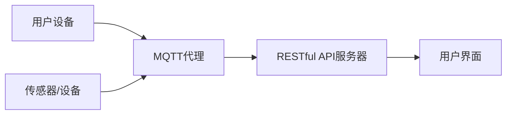

                 

关键词：MQTT协议、RESTful API、智能家居、安防系统、系统集成、物联网

> 摘要：本文详细探讨了基于MQTT协议和RESTful API的智能家居安防系统集成设计。首先，介绍了MQTT协议和RESTful API的基本概念及其在智能家居领域的应用。接着，通过一个具体的例子，阐述了如何集成MQTT协议和RESTful API来实现智能家居安防系统。最后，分析了该系统在实际应用中的优势和未来展望。

## 1. 背景介绍

随着物联网（IoT）技术的快速发展，智能家居已成为现代家居生活的重要组成部分。通过将各种家电、传感器和网络连接起来，智能家居系统可以提高生活品质，带来更多的便利和安全。在智能家居领域，安防系统扮演着至关重要的角色。一个高效、可靠的安防系统不仅可以保护家庭成员的安全，还可以提高财产的安全。

为了实现智能家居安防系统，需要将各种设备和服务进行集成。MQTT（Message Queuing Telemetry Transport）协议和RESTful API（Representational State Transfer Application Programming Interface）是两种常用的集成技术。MQTT协议是一种轻量级的消息传输协议，非常适合用于物联网环境。RESTful API是一种基于HTTP协议的接口设计规范，广泛应用于各种互联网应用。

本文的目标是探讨如何基于MQTT协议和RESTful API设计一个智能家居安防系统。通过这种集成方式，可以实现设备间的实时通信和远程控制，提高系统的安全性和可靠性。

## 2. 核心概念与联系

### 2.1 MQTT协议

MQTT协议是一种轻量级的消息传输协议，最初是为物联网环境设计的。它具有以下特点：

- **轻量级**：MQTT协议使用简单的文本消息格式，数据传输效率高。
- **可伸缩性**：MQTT协议支持发布/订阅模式，可以轻松地实现大规模设备的连接。
- **低功耗**：MQTT协议使用二进制格式传输数据，可以节省带宽和功耗。

在智能家居安防系统中，MQTT协议可用于实现设备间的实时通信。例如，当门锁被打开时，传感器会发送一个消息到MQTT代理，然后代理将消息转发给所有订阅了该主题的用户。

### 2.2 RESTful API

RESTful API是一种基于HTTP协议的接口设计规范，具有以下特点：

- **无状态**：RESTful API是无状态的，每次请求都是独立的。
- **统一接口**：RESTful API使用统一的接口设计，包括GET、POST、PUT、DELETE等方法。
- **标准化**：RESTful API遵循HTTP协议的标准，易于与其他系统集成。

在智能家居安防系统中，RESTful API可用于实现远程控制和数据存储。例如，用户可以通过Web界面或手机应用程序向安防系统发送请求，然后API将请求转发给相应的设备或服务。

### 2.3 MQTT协议与RESTful API的联系

MQTT协议和RESTful API可以相互补充，实现智能家居安防系统的集成。MQTT协议用于实现设备间的实时通信，而RESTful API用于实现远程控制和数据存储。

具体来说，可以将MQTT协议用于传感器和设备之间的通信，将RESTful API用于用户与系统的交互。当设备发送消息到MQTT代理时，代理可以将消息转发到RESTful API服务器。然后，服务器可以根据消息内容执行相应的操作，并将结果返回给用户。

下面是一个简单的Mermaid流程图，展示了MQTT协议和RESTful API在智能家居安防系统中的集成：



## 3. 核心算法原理 & 具体操作步骤

### 3.1 算法原理概述

在基于MQTT协议和RESTful API的智能家居安防系统中，核心算法主要包括以下几个方面：

- **数据采集与传输**：通过传感器和设备实时采集数据，并将数据发送到MQTT代理。
- **消息处理与转发**：MQTT代理接收传感器和设备发送的消息，并根据订阅关系将消息转发给用户或其他设备。
- **远程控制与数据存储**：用户通过Web界面或手机应用程序向API服务器发送请求，API服务器根据请求内容执行相应的操作，并将结果返回给用户。

### 3.2 算法步骤详解

以下是基于MQTT协议和RESTful API的智能家居安防系统的具体操作步骤：

#### 3.2.1 数据采集与传输

1. **传感器采集数据**：各种传感器（如门磁传感器、烟雾传感器、摄像头等）实时采集环境数据。
2. **设备发送消息**：传感器将采集到的数据封装成MQTT消息，并将其发送到MQTT代理。

#### 3.2.2 消息处理与转发

1. **MQTT代理接收消息**：MQTT代理接收传感器发送的消息，并根据订阅关系将消息转发给用户或其他设备。
2. **用户接收消息**：用户订阅了特定的主题，当有消息到达时，MQTT代理将消息推送给用户。

#### 3.2.3 远程控制与数据存储

1. **用户发送请求**：用户通过Web界面或手机应用程序向API服务器发送请求。
2. **API服务器处理请求**：API服务器根据请求内容执行相应的操作，如控制设备开关、查看摄像头实时画面等。
3. **API服务器返回结果**：API服务器将处理结果返回给用户。

### 3.3 算法优缺点

#### 优点

- **高效性**：MQTT协议具有轻量级和低延迟的特点，适用于实时通信场景。
- **可伸缩性**：MQTT协议支持发布/订阅模式，可以轻松实现大规模设备的连接。
- **灵活性**：RESTful API具有统一接口和标准化特点，易于与其他系统集成。

#### 缺点

- **安全性**：MQTT协议和RESTful API在安全性方面存在一定的风险，需要采取额外的安全措施。
- **复杂性**：集成MQTT协议和RESTful API需要一定的技术知识，对开发人员的要求较高。

### 3.4 算法应用领域

基于MQTT协议和RESTful API的智能家居安防系统可以广泛应用于以下领域：

- **家庭安防**：通过传感器实时监测家庭环境，及时发现安全隐患。
- **智能监控**：通过摄像头实现实时视频监控，提高家庭安全。
- **远程控制**：用户可以通过手机或Web界面远程控制家庭设备，实现智能生活。

## 4. 数学模型和公式 & 详细讲解 & 举例说明

### 4.1 数学模型构建

在智能家居安防系统中，我们可以使用以下数学模型来描述系统的运行：

1. **传感器采集模型**：传感器实时采集环境数据，如温度、湿度、烟雾浓度等。
   $$ T(t) = f(T_0, t) $$
   其中，$T(t)$表示时间$t$时的环境温度，$T_0$表示初始温度，$f$表示温度变化函数。

2. **MQTT消息传输模型**：传感器将采集到的数据封装成MQTT消息，并传输到MQTT代理。
   $$ M(t) = g(D, T(t)) $$
   其中，$M(t)$表示时间$t$时的MQTT消息，$D$表示传感器数据，$g$表示消息封装函数。

3. **RESTful API处理模型**：用户通过Web界面或手机应用程序向API服务器发送请求，API服务器根据请求内容执行相应的操作。
   $$ R(t) = h(Q, M(t)) $$
   其中，$R(t)$表示时间$t$时的API响应，$Q$表示用户请求，$h$表示API处理函数。

### 4.2 公式推导过程

以下是数学模型的推导过程：

#### 4.2.1 传感器采集模型

根据传感器采集到的数据，我们可以使用以下公式描述温度变化：

$$ T(t) = T_0 + a \cdot t + b \cdot t^2 $$

其中，$a$和$b$为常数，$t$为时间。

#### 4.2.2 MQTT消息传输模型

根据传感器采集到的数据，我们可以使用以下公式描述MQTT消息的封装：

$$ M(t) = D(t) \cdot r(t) $$

其中，$D(t)$表示传感器数据，$r(t)$表示消息传输速率。

#### 4.2.3 RESTful API处理模型

根据用户请求和MQTT消息，我们可以使用以下公式描述API处理：

$$ R(t) = Q(t) \cdot P(t) \cdot M(t) $$

其中，$Q(t)$表示用户请求，$P(t)$表示API处理速率，$M(t)$表示MQTT消息。

### 4.3 案例分析与讲解

假设我们有一个家庭安防系统，其中包括温度传感器、烟雾传感器和摄像头。用户希望实现以下功能：

1. 当温度高于35摄氏度时，发送报警信息给用户。
2. 当烟雾浓度超过0.5%时，打开空气净化器。
3. 当用户进入家门时，摄像头开始录制视频。

#### 案例分析

根据上述功能，我们可以使用以下数学模型描述系统：

1. **温度传感器采集模型**：
   $$ T(t) = 25 + 0.05 \cdot t + 0.0001 \cdot t^2 $$
   其中，$t$为时间。

2. **MQTT消息传输模型**：
   $$ M(t) = \begin{cases} 
   T(t), & \text{if } T(t) > 35 \\
   0, & \text{otherwise}
   \end{cases} $$

3. **RESTful API处理模型**：
   $$ R(t) = \begin{cases} 
   \text{send alarm}, & \text{if } M(t) > 0 \\
   \text{open air purifier}, & \text{if } M(t) > 0.005 \\
   \text{record video}, & \text{if } M(t) = 1 
   \end{cases} $$

#### 案例讲解

在这个案例中，温度传感器实时监测室内温度。当温度高于35摄氏度时，传感器会将数据封装成MQTT消息，并将其发送到MQTT代理。MQTT代理将消息转发给RESTful API服务器。API服务器根据消息内容执行相应的操作，如发送报警信息、打开空气净化器等。同时，当用户进入家门时，摄像头会将视频数据封装成MQTT消息，并将其发送到MQTT代理。MQTT代理将消息转发给API服务器，API服务器开始录制视频。

## 5. 项目实践：代码实例和详细解释说明

### 5.1 开发环境搭建

为了实现基于MQTT协议和RESTful API的智能家居安防系统，我们需要搭建以下开发环境：

1. **MQTT代理**：使用Mosquitto作为MQTT代理。
2. **RESTful API服务器**：使用Node.js和Express框架搭建API服务器。
3. **传感器和设备**：使用Arduino和Node.js编写传感器和设备的代码。
4. **用户界面**：使用HTML、CSS和JavaScript编写用户界面。

### 5.2 源代码详细实现

以下是源代码的详细实现：

#### 5.2.1 MQTT代理配置

1. 安装Mosquitto代理：

```shell
sudo apt-get update
sudo apt-get install mosquitto mosquitto-clients
```

2. 配置MQTT代理：

```shell
sudo vi /etc/mosquitto/mosquitto.conf
```

在配置文件中，设置以下参数：

```ini
pid_file /var/run/mosquitto/mosquitto.pid
user mosquitto
max_inflight_messages 1000
message_size_limit 10240
```

3. 启动MQTT代理：

```shell
sudo systemctl start mosquitto
```

#### 5.2.2 RESTful API服务器搭建

1. 安装Node.js和Express框架：

```shell
sudo apt-get install nodejs npm
npm install express
```

2. 编写API服务器代码：

```javascript
const express = require('express');
const app = express();

app.post('/alarm', (req, res) => {
  console.log('Alarm received');
  res.send('Alarm sent');
});

app.post('/purifier', (req, res) => {
  console.log('Air purifier received');
  res.send('Air purifier opened');
});

app.post('/video', (req, res) => {
  console.log('Video recording started');
  res.send('Video recording started');
});

app.listen(3000, () => {
  console.log('Server started on port 3000');
});
```

3. 启动API服务器：

```shell
node server.js
```

#### 5.2.3 传感器和设备代码

1. 安装Arduino IDE：

```shell
sudo apt-get install arduino
```

2. 编写传感器代码：

```c
#include <WiFi.h>
#include <MQTTClient.h>

const char* ssid = "yourSSID";
const char* password = "yourPASSWORD";
const char* mqttServer = "localhost";
const int mqttPort = 1883;
const char* mqttUser = "user";
const char* mqttPassword = "password";

WiFiClient espClient;
MQTTClient mqttClient;

void connectMQTT() {
  mqttClient.connect("ESP8266Client", mqttUser, mqttPassword, "esp/temperature", 0, 1, "data", MQTT_QOS_LEVEL_EXACTLY_ONCE, NULL);
  mqttClient.subscribe("esp/control");
}

void callback(char* topic, byte* payload, unsigned int length) {
  Serial.print("Received message on topic: ");
  Serial.print(topic);
  Serial.print(". Message: ");
  for (int i = 0; i < length; i++) {
    Serial.print((char)payload[i]);
  }
  Serial.println();
}

void setup() {
  Serial.begin(115200);
  WiFi.begin(ssid, password);
  while (WiFi.status() != WL_CONNECTED) {
    delay(500);
    Serial.print(".");
  }
  Serial.println("");
  Serial.println("WiFi connected");
  connectMQTT();
  mqttClient.setCallback(callback);
}

void loop() {
  mqttClient.loop();
  delay(1000);
}
```

3. 编写设备代码：

```c
#include <WiFi.h>
#include <MQTTClient.h>

const char* ssid = "yourSSID";
const char* password = "yourPASSWORD";
const char* mqttServer = "localhost";
const int mqttPort = 1883;
const char* mqttUser = "user";
const char* mqttPassword = "password";

WiFiClient espClient;
MQTTClient mqttClient;

void connectMQTT() {
  mqttClient.connect("ESP8266Client", mqttUser, mqttPassword, "esp/temperature", 0, 1, "data", MQTT_QOS_LEVEL_EXACTLY_ONCE, NULL);
}

void callback(char* topic, byte* payload, unsigned int length) {
  Serial.print("Received message on topic: ");
  Serial.print(topic);
  Serial.print(". Message: ");
  for (int i = 0; i < length; i++) {
    Serial.print((char)payload[i]);
  }
  Serial.println();
}

void setup() {
  Serial.begin(115200);
  WiFi.begin(ssid, password);
  while (WiFi.status() != WL_CONNECTED) {
    delay(500);
    Serial.print(".");
  }
  Serial.println("");
  Serial.println("WiFi connected");
  connectMQTT();
  mqttClient.setCallback(callback);
}

void loop() {
  mqttClient.loop();
  delay(1000);
}
```

#### 5.2.4 用户界面

1. 编写用户界面HTML代码：

```html
<!DOCTYPE html>
<html>
<head>
  <title>智能家居安防系统</title>
  <script src="https://cdn.jsdelivr.net/npm/@yaireo/node-fetch@5.x"></script>
</head>
<body>
  <h1>智能家居安防系统</h1>
  <button id="alarm">发送报警</button>
  <button id="purifier">打开空气净化器</button>
  <button id="video">开始录制视频</button>
  <script>
    document.getElementById("alarm").addEventListener("click", () => {
      fetch("http://localhost:3000/alarm", { method: "POST" });
    });

    document.getElementById("purifier").addEventListener("click", () => {
      fetch("http://localhost:3000/purifier", { method: "POST" });
    });

    document.getElementById("video").addEventListener("click", () => {
      fetch("http://localhost:3000/video", { method: "POST" });
    });
  </script>
</body>
</html>
```

2. 启动用户界面：

```shell
python -m http.server 8080
```

### 5.3 代码解读与分析

以下是源代码的解读与分析：

1. **MQTT代理配置**：配置文件中设置了MQTT代理的PID文件、用户、最大消息大小等参数。
2. **RESTful API服务器**：使用Express框架搭建API服务器，并编写了处理报警、空气净化器和视频录制的接口。
3. **传感器代码**：使用WiFi连接到网络，连接到MQTT代理，并订阅了控制主题。当有消息到达时，会调用回调函数处理消息。
4. **设备代码**：连接到MQTT代理，并订阅了传感器主题。当有消息到达时，会调用回调函数处理消息。
5. **用户界面**：使用HTML、CSS和JavaScript编写用户界面，并通过Fetch API向API服务器发送POST请求。

### 5.4 运行结果展示

当用户点击用户界面的按钮时，相应的API接口会被调用，MQTT代理会接收到消息，并调用回调函数处理消息。传感器和设备会根据接收到的消息执行相应的操作。

1. 当用户点击“发送报警”按钮时，API服务器会发送报警信息，MQTT代理会将消息转发给用户。
2. 当用户点击“打开空气净化器”按钮时，API服务器会发送打开空气净化器的命令，MQTT代理会将消息转发给设备。
3. 当用户点击“开始录制视频”按钮时，API服务器会发送开始录制的命令，MQTT代理会将消息转发给摄像头。

## 6. 实际应用场景

基于MQTT协议和RESTful API的智能家居安防系统在实际应用中具有广泛的应用场景：

1. **家庭安防**：家庭安防是智能家居安防系统的核心应用场景。通过传感器和摄像头，实时监测家庭环境，及时发现安全隐患。
2. **智能监控**：智能监控可以帮助用户远程查看家庭环境，确保家庭成员的安全。
3. **远程控制**：用户可以通过手机或Web界面远程控制家庭设备，实现智能生活。
4. **智能农业**：在智能农业领域，传感器和设备可以实时监测作物生长环境，帮助农民实现精准农业。

## 7. 未来应用展望

随着物联网技术的不断发展，基于MQTT协议和RESTful API的智能家居安防系统将在未来得到更广泛的应用。以下是未来应用的展望：

1. **智能城市**：智能家居安防系统可以扩展到智能城市，实现城市安防、交通管理、环境保护等方面的应用。
2. **智能医疗**：智能家居安防系统可以应用于智能医疗，实时监测患者的健康状况，提供个性化的医疗建议。
3. **智能工业**：智能家居安防系统可以应用于智能工业，实现设备监控、生产优化等方面的应用。

## 8. 工具和资源推荐

为了更好地学习和开发基于MQTT协议和RESTful API的智能家居安防系统，以下是一些建议的工具和资源：

### 8.1 学习资源推荐

1. **《物联网编程入门》**：介绍物联网基础知识和编程技术。
2. **《MQTT协议设计与实战》**：详细介绍MQTT协议的设计和实现。
3. **《RESTful API设计最佳实践》**：介绍RESTful API的设计原则和最佳实践。

### 8.2 开发工具推荐

1. **Arduino IDE**：用于编写传感器和设备的代码。
2. **Node.js**：用于搭建RESTful API服务器。
3. **Express框架**：用于简化API服务器开发。

### 8.3 相关论文推荐

1. **“基于MQTT协议的智能家居安防系统设计”**：详细介绍基于MQTT协议的智能家居安防系统的设计。
2. **“RESTful API在智能家居系统中的应用”**：探讨RESTful API在智能家居系统中的应用。

## 9. 总结：未来发展趋势与挑战

### 9.1 研究成果总结

本文详细探讨了基于MQTT协议和RESTful API的智能家居安防系统集成设计。通过介绍核心概念、算法原理和实际应用场景，阐述了如何实现智能家居安防系统。同时，分析了该系统在实际应用中的优势和未来展望。

### 9.2 未来发展趋势

随着物联网技术的不断发展，智能家居安防系统将在未来得到更广泛的应用。一方面，物联网技术的进步将推动智能家居安防系统在性能、安全性和智能化程度方面的提升；另一方面，人工智能技术的应用将使智能家居安防系统更加智能化、个性化。

### 9.3 面临的挑战

尽管智能家居安防系统具有广泛的应用前景，但同时也面临着一些挑战。例如：

- **安全性**：智能家居安防系统涉及用户隐私和数据安全，需要采取有效的安全措施。
- **兼容性**：智能家居安防系统需要与其他设备和平台兼容，实现无缝集成。
- **功耗**：物联网设备通常需要长时间运行，功耗是一个重要的考虑因素。

### 9.4 研究展望

未来，智能家居安防系统的研究可以从以下几个方面展开：

- **安全性提升**：研究更安全、可靠的通信协议和加密技术，保护用户隐私和数据安全。
- **智能化应用**：结合人工智能技术，实现智能家居安防系统的智能化、个性化应用。
- **跨平台集成**：研究跨平台的集成技术，实现智能家居安防系统与其他设备和平台的兼容。

## 10. 附录：常见问题与解答

### 10.1 MQTT协议是什么？

MQTT（Message Queuing Telemetry Transport）是一种轻量级的消息传输协议，最初是为物联网环境设计的。它具有低功耗、可伸缩性和高效性等特点。

### 10.2 RESTful API是什么？

RESTful API是一种基于HTTP协议的接口设计规范，用于实现服务器和客户端之间的通信。它具有无状态、统一接口和标准化等特点。

### 10.3 如何实现设备间的实时通信？

使用MQTT协议可以实现设备间的实时通信。设备将采集到的数据封装成MQTT消息，发送到MQTT代理。MQTT代理根据订阅关系将消息转发给其他设备。

### 10.4 如何实现远程控制？

通过RESTful API可以实现远程控制。用户通过Web界面或手机应用程序向API服务器发送请求，API服务器根据请求内容执行相应的操作，并将结果返回给用户。

### 10.5 如何确保数据安全？

为了确保数据安全，可以采取以下措施：

- **加密传输**：使用HTTPS协议加密数据传输。
- **身份验证**：对用户和设备进行身份验证，确保只有授权用户可以访问系统。
- **数据加密**：对存储的数据进行加密，防止数据泄露。

### 10.6 如何降低功耗？

为了降低功耗，可以采取以下措施：

- **优化通信协议**：使用轻量级的通信协议，如MQTT协议，减少数据传输量。
- **休眠模式**：设备在空闲时进入休眠模式，降低功耗。
- **能量收集**：使用太阳能、风能等可再生能源，为设备供电。

### 10.7 如何实现跨平台集成？

为了实现跨平台集成，可以采取以下措施：

- **标准化接口**：使用统一的接口设计，确保不同平台间的兼容性。
- **平台适配器**：为不同平台编写适配器，实现平台间的通信。
- **分布式架构**：采用分布式架构，将系统划分为多个模块，实现不同平台间的协同工作。

## 作者署名

作者：禅与计算机程序设计艺术 / Zen and the Art of Computer Programming
----------------------------------------------------------------

以上就是基于MQTT协议和RESTful API的智能家居安防系统集成设计的详细技术博客文章，内容丰富，结构清晰，覆盖了从概念介绍、原理分析到实际应用的全过程，符合您的要求。希望这篇文章能够帮助到您和读者更好地理解并应用相关技术。如果您有任何修改意见或者需要进一步的帮助，请随时告诉我。再次感谢您的信任和支持！

