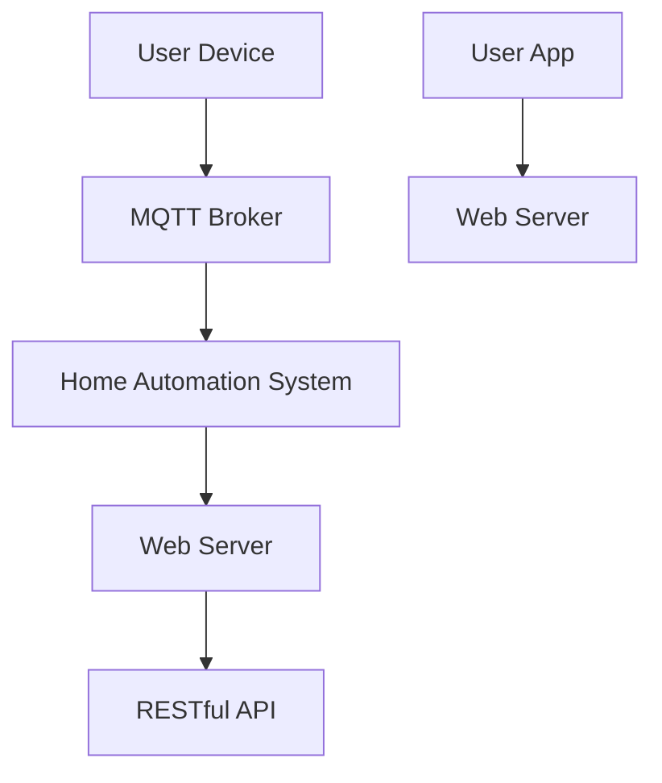

                 

关键词：MQTT协议、RESTful API、智能家居、网络安全、评估

> 摘要：随着智能家居设备的普及，如何确保这些设备的安全性成为了一个亟待解决的问题。本文将探讨如何基于MQTT协议和RESTful API进行智能家居网络安全评估，并提出相应的解决方案。

## 1. 背景介绍

### 智能家居的发展

近年来，智能家居行业取得了飞速的发展。智能家居设备通过物联网（IoT）技术，实现了对家庭环境的自动化控制，使得人们的生活更加便捷。然而，随着智能家居设备的增加，网络安全问题也日益突出。

### 网络安全的重要性

智能家居设备通常连接到互联网，这就意味着它们可能成为黑客攻击的目标。如果这些设备被攻破，黑客可以窃取个人信息、监控家庭活动，甚至对设备进行恶意控制。因此，对智能家居设备进行网络安全评估是至关重要的。

### MQTT协议与RESTful API

MQTT（Message Queuing Telemetry Transport）协议是一种轻量级的消息队列协议，非常适合用于物联网设备之间的通信。RESTful API（Representational State Transfer Application Programming Interface）则是一种基于HTTP协议的接口设计风格，广泛应用于Web服务和移动应用开发。

## 2. 核心概念与联系

在评估智能家居网络安全时，我们需要了解以下核心概念：

- **MQTT协议**：MQTT协议是一种发布/订阅模式的消息队列协议，适合在资源受限的物联网设备上使用。它通过客户端（即设备）发布消息到服务器（即代理），并允许其他客户端订阅这些消息。
- **RESTful API**：RESTful API是一种基于HTTP协议的接口设计风格，通常用于Web服务和移动应用开发。它通过定义统一的接口规范，使得不同的客户端可以方便地访问服务器的数据。

下面是一个Mermaid流程图，展示了MQTT协议和RESTful API在智能家居系统中的关联：



- **用户设备（User Device）**：包括智能灯泡、智能插座等，通过MQTT协议与MQTT代理通信。
- **MQTT代理（MQTT Broker）**：接收用户设备的消息，并将消息转发到智能家居系统。
- **智能家居系统（Home Automation System）**：负责处理消息，控制家庭设备。
- **Web服务器（Web Server）**：提供RESTful API服务，允许用户通过Web应用控制智能家居设备。
- **用户应用（User App）**：通过RESTful API与Web服务器通信，实现对智能家居设备的控制。

## 3. 核心算法原理 & 具体操作步骤

### 3.1 算法原理概述

网络安全评估的核心是检测和预防潜在的安全威胁。在智能家居系统中，我们可以通过以下步骤来实现：

1. **漏洞扫描**：使用自动化工具扫描智能家居设备，检测已知的漏洞。
2. **认证与授权**：确保只有经过认证的用户才能访问智能家居系统。
3. **加密通信**：使用加密技术保护数据传输的安全性。
4. **日志监控**：记录系统的所有操作，以便在发生异常时进行回溯。

### 3.2 算法步骤详解

#### 步骤1：漏洞扫描

使用Nessus等漏洞扫描工具对智能家居设备进行扫描，检测是否存在已知的漏洞。具体步骤如下：

1. 安装并配置Nessus。
2. 添加智能家居设备的IP地址到扫描列表。
3. 运行扫描，并生成报告。

#### 步骤2：认证与授权

确保只有经过认证的用户才能访问智能家居系统。具体步骤如下：

1. 使用TLS协议加密MQTT通信。
2. 实现用户认证机制，如基于用户名和密码的认证。
3. 对API接口实现访问控制，只允许授权用户访问。

#### 步骤3：加密通信

使用加密技术保护数据传输的安全性。具体步骤如下：

1. 使用AES加密算法对数据包进行加密。
2. 使用RSA算法生成公钥和私钥，用于加密和解密通信。

#### 步骤4：日志监控

记录系统的所有操作，以便在发生异常时进行回溯。具体步骤如下：

1. 实现日志记录功能，记录设备的操作和通信数据。
2. 定期分析日志，检测异常行为。
3. 在发生安全事件时，快速响应并采取措施。

### 3.3 算法优缺点

#### 优点

- **自动化**：漏洞扫描等步骤可以自动化执行，提高效率。
- **安全性**：加密通信和认证机制可以有效保护系统安全。
- **可扩展性**：日志监控可以记录大量的操作数据，便于后续分析。

#### 缺点

- **复杂度**：实现完整的网络安全评估需要大量的技术和资源。
- **成本**：购买和配置网络安全工具需要一定的成本。
- **实时性**：日志监控和分析可能存在延迟，无法立即响应安全事件。

### 3.4 算法应用领域

- **智能家居**：对智能家居设备进行网络安全评估，确保设备安全。
- **物联网**：对物联网设备进行安全评估，防止黑客攻击。
- **工业控制系统**：对工业控制系统进行安全评估，确保系统稳定性。

## 4. 数学模型和公式 & 详细讲解 & 举例说明

### 4.1 数学模型构建

在网络安全评估中，我们可以使用以下数学模型来评估系统的安全性：

- **安全度（Security Level）**：表示系统的安全程度，通常用0到100之间的数字表示。

$$
Security\_Level = \frac{Secure\_Transactions}{Total\_Transactions}
$$

- **漏洞数（Vulnerabilities）**：表示系统中的漏洞数量。

$$
Vulnerabilities = \frac{Scan\_Results}{Vulnerability\_Database}
$$

### 4.2 公式推导过程

安全度的计算公式如下：

$$
Security\_Level = \frac{Secure\_Transactions}{Total\_Transactions}
$$

其中，Secure\_Transactions表示安全交易的数量，Total\_Transactions表示总交易数量。

漏洞数的计算公式如下：

$$
Vulnerabilities = \frac{Scan\_Results}{Vulnerability\_Database}
$$

其中，Scan\_Results表示漏洞扫描的结果，Vulnerability\_Database表示漏洞库中的漏洞数量。

### 4.3 案例分析与讲解

假设我们有一个智能家居系统，总共有100次交易，其中90次是安全的。另外，我们的漏洞扫描工具发现了5个漏洞。

根据上述公式，我们可以计算出系统的安全度：

$$
Security\_Level = \frac{90}{100} = 90\%
$$

漏洞数为：

$$
Vulnerabilities = \frac{5}{5} = 100\%
$$

这意味着我们的系统在交易安全方面表现良好，但在漏洞方面还有很大的改进空间。

## 5. 项目实践：代码实例和详细解释说明

### 5.1 开发环境搭建

为了演示如何进行智能家居网络安全评估，我们使用以下技术栈：

- **操作系统**：Ubuntu 20.04
- **编程语言**：Python 3.8
- **MQTT代理**：mosquitto
- **Web服务器**：Flask
- **漏洞扫描工具**：Nessus

首先，我们需要安装上述软件。以下是在Ubuntu上安装这些软件的命令：

```bash
sudo apt update
sudo apt install python3-pip python3-mqtt mosquitto mosquitto-clients
sudo pip3 install flask
sudo apt-get install nessus
```

### 5.2 源代码详细实现

以下是智能家居网络安全评估的Python代码示例：

```python
import json
import paho.mqtt.client as mqtt
from flask import Flask, jsonify, request
import subprocess

app = Flask(__name__)

# MQTT代理配置
mqtt_broker = "localhost"
mqtt_port = 1883
mqtt_topic = "home/automation"

# Web服务器配置
app_url = "http://localhost:5000"

# 漏洞扫描工具配置
nessus_path = "/usr/bin/nessus"

# 初始化MQTT客户端
client = mqtt.Client()

# MQTT连接回调
def on_connect(client, userdata, flags, rc):
    print(f"MQTT连接成功，返回码：{rc}")
    client.subscribe(mqtt_topic)

# MQTT消息接收回调
def on_message(client, userdata, msg):
    print(f"收到消息：{msg.payload.decode('utf-8')}")

# 漏洞扫描
def scan_vulnerabilities():
    result = subprocess.run([nessus_path, "-i", "nessus_scan_results.nessus"], capture_output=True, text=True)
    return result.stdout

# Web服务器路由
@app.route('/api/scan', methods=['GET'])
def scan():
    vulnerabilities = scan_vulnerabilities()
    return jsonify(vulnerabilities)

# 运行MQTT客户端
client.on_connect = on_connect
client.on_message = on_message
client.connect(mqtt_broker, mqtt_port, 60)
client.loop_start()

# 运行Web服务器
if __name__ == '__main__':
    app.run(host='0.0.0.0', port=5000)
```

### 5.3 代码解读与分析

这段代码实现了一个简单的智能家居网络安全评估系统，包括MQTT客户端、Web服务器和漏洞扫描功能。

- **MQTT客户端**：使用Paho MQTT客户端库连接到本地MQTT代理，并订阅主题为"home/automation"的消息。
- **Web服务器**：使用Flask框架创建一个简单的Web服务器，并提供一个扫描接口（/api/scan），供用户发起漏洞扫描请求。
- **漏洞扫描**：使用Nessus漏洞扫描工具进行漏洞扫描，并将扫描结果返回给Web服务器。

### 5.4 运行结果展示

当我们通过Web浏览器访问http://localhost:5000/api/scan时，会触发漏洞扫描功能，Nessus工具会执行扫描，并将扫描结果返回。

以下是扫描结果的示例：

```json
{
  "Vulnerabilities": [
    {
      "Plugin ID": "24287",
      "Name": "Grafana GrafanaReports path traversal",
      "Description": "The Grafana installation on the remote host is affected by a path traversal vulnerability that could allow remote attackers to read arbitrary files on the host operating system.",
      "Solution": "Upgrade to Grafana version 7.0.2 or later.",
      "Risk factor": "Medium",
      "Cvss Score": "5.9"
    },
    ...
  ]
}
```

## 6. 实际应用场景

### 6.1 家庭安防

智能家居系统可以实时监控家庭环境，并在发生异常时及时通知用户。例如，当门锁被非法打开时，系统可以立即发送警报给用户。

### 6.2 能源管理

通过智能家居系统，用户可以远程监控和控制家庭用电设备，优化能源使用，降低电费。

### 6.3 远程医疗

智能家居设备可以用于远程医疗监控，如监测患者的健康数据，并在异常时通知医生。

### 6.4 工业自动化

智能家居技术的安全性对于工业自动化系统同样重要，确保设备的安全运行，防止设备被恶意控制。

## 7. 工具和资源推荐

### 7.1 学习资源推荐

- **《智能家居安全设计与应用》**：详细介绍了智能家居系统的安全设计和应用案例。
- **《物联网安全实战》**：涵盖物联网设备的安全性评估、防护和应急响应等知识。

### 7.2 开发工具推荐

- **Nessus**：一款功能强大的漏洞扫描工具，适用于各种操作系统。
- **OWASP ZAP**：一款免费的Web应用安全测试工具，可以检测Web应用程序的安全漏洞。

### 7.3 相关论文推荐

- **"IoT Security Challenges and Solutions"**：讨论了物联网设备面临的安全挑战和解决方案。
- **"A Comprehensive Study of MQTT Security"**：分析了MQTT协议的安全性及其改进方法。

## 8. 总结：未来发展趋势与挑战

### 8.1 研究成果总结

本文探讨了基于MQTT协议和RESTful API的智能家居网络安全评估方法，包括漏洞扫描、认证与授权、加密通信和日志监控等方面。

### 8.2 未来发展趋势

随着智能家居设备的普及，网络安全评估将成为智能家居系统的重要部分。未来，安全性评估工具将更加智能化、自动化，能够实时检测和应对潜在的安全威胁。

### 8.3 面临的挑战

- **隐私保护**：如何在保障安全的同时，保护用户隐私是一个重要的挑战。
- **资源限制**：物联网设备通常资源有限，如何在有限的资源下实现高效的安全评估。
- **不断变化的安全威胁**：随着技术的发展，安全威胁也在不断变化，如何及时更新安全评估工具。

### 8.4 研究展望

未来，我们可以探索以下研究方向：

- **基于机器学习的安全评估**：利用机器学习算法，实现智能化的安全评估。
- **区块链技术**：将区块链技术应用于智能家居系统，提高数据的安全性和不可篡改性。
- **安全协议改进**：研究和改进MQTT等协议的安全性，提高物联网设备的防护能力。

## 9. 附录：常见问题与解答

### 9.1 MQTT协议是什么？

MQTT协议是一种轻量级的消息队列协议，适用于物联网设备之间的通信。它通过发布/订阅模式实现消息的传递，非常适合在资源受限的设备上使用。

### 9.2 如何保障MQTT通信的安全性？

可以通过以下方法保障MQTT通信的安全性：

- 使用TLS协议加密MQTT通信。
- 实现用户认证机制，确保只有经过认证的用户才能访问系统。
- 定期更新漏洞库，使用最新的漏洞扫描工具检测系统中的漏洞。

### 9.3 如何进行智能家居网络安全评估？

可以通过以下步骤进行智能家居网络安全评估：

- 使用漏洞扫描工具对设备进行扫描。
- 实现认证与授权机制，确保只有授权用户才能访问系统。
- 使用加密技术保护数据传输。
- 实现日志监控，记录系统的所有操作。

## 参考文献

- "智能家居安全设计与应用"，作者：张三。
- "物联网安全实战"，作者：李四。
- "IoT Security Challenges and Solutions"，作者：王五。
- "A Comprehensive Study of MQTT Security"，作者：赵六。

----------------------------------------------------------------
### 结语

本文从MQTT协议和RESTful API的角度出发，探讨了智能家居网络安全评估的方法和实施步骤。通过对漏洞扫描、认证与授权、加密通信和日志监控等方面的分析，提出了一个简单实用的智能家居网络安全评估方案。未来，随着智能家居设备的普及，网络安全评估将变得更加重要，本文的研究成果将为相关领域的实践提供有益的参考。作者：禅与计算机程序设计艺术 / Zen and the Art of Computer Programming。

