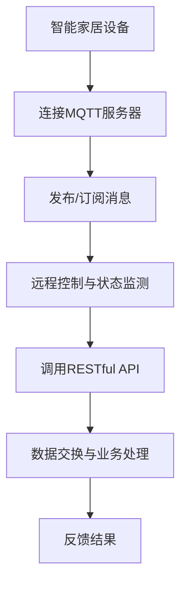

                 

关键词：MQTT协议、RESTful API、智能家居、远程控制、状态监测、物联网

摘要：随着物联网技术的飞速发展，智能家居设备越来越普及。本文将探讨如何利用MQTT协议和RESTful API实现智能家居设备的远程控制与状态监测，以提高家居生活的便捷性和智能化水平。

## 1. 背景介绍

智能家居设备作为物联网技术的重要组成部分，近年来得到了广泛关注。它们通过互联网与家庭网络连接，实现家电设备的远程控制、状态监测和家庭环境优化等功能。然而，智能家居设备的远程控制与状态监测并非易事，这需要依赖于高效的通信协议和稳定的网络连接。

MQTT（Message Queuing Telemetry Transport）协议是一种轻量级的消息传输协议，广泛用于物联网设备的通信。它具有发布/订阅模式、低功耗、高可靠性和简单的客户端实现等特点，非常适合智能家居设备的远程控制与状态监测。

RESTful API（Representational State Transfer Application Programming Interface）是一种网络应用编程接口的设计风格，用于实现分布式系统之间的数据交互。它基于HTTP协议，使用统一的接口和数据格式，使得应用程序之间的通信变得简单、高效和灵活。

本文将围绕MQTT协议和RESTful API，详细介绍智能家居设备的远程控制与状态监测的实现方法，为智能家居技术的发展提供参考。

## 2. 核心概念与联系

### 2.1 MQTT协议

MQTT协议是一种基于发布/订阅模式的轻量级消息传输协议。在MQTT协议中，设备作为客户端（Client）连接到消息代理（Broker），通过发布（Publish）和订阅（Subscribe）消息与服务器进行通信。

**发布/订阅模式：**

- 发布者（Publisher）向消息代理发布消息，消息代理将消息存储在队列中。
- 订阅者（Subscriber）向消息代理订阅感兴趣的主题，消息代理将匹配主题的消息推送到订阅者。

**MQTT协议特点：**

- 低功耗：MQTT协议使用二进制消息格式，数据传输效率高，适用于电池供电设备。
- 高可靠性：支持消息确认和重传机制，确保消息可靠传输。
- 简单易用：MQTT协议客户端实现简单，易于集成到各种设备中。

### 2.2 RESTful API

RESTful API是一种基于HTTP协议的分布式系统通信接口设计风格。它采用统一资源标识符（URI）表示资源，使用HTTP方法（GET、POST、PUT、DELETE等）进行操作，通过返回JSON或XML格式数据实现数据交互。

**RESTful API特点：**

- 简单易用：遵循统一的接口规范，易于理解和实现。
- 高效灵活：支持多种数据格式，适应不同的应用场景。
- 可扩展性：通过扩展HTTP方法，实现自定义操作。

### 2.3 MQTT协议与RESTful API的联系

MQTT协议和RESTful API在智能家居设备远程控制与状态监测中发挥着重要作用。MQTT协议负责设备与服务器之间的实时通信，实现远程控制与状态监测；RESTful API则用于设备与外部系统的数据交互，实现更复杂的业务逻辑。

**联系：**

- MQTT协议：实现设备与服务器之间的实时消息通信。
- RESTful API：实现设备与外部系统的数据交换，提供远程控制接口。

### 2.4 Mermaid流程图

为了更好地展示MQTT协议和RESTful API在智能家居设备远程控制与状态监测中的应用，我们使用Mermaid流程图进行描述。



**流程说明：**

- 智能家居设备连接MQTT服务器，实现实时通信。
- 设备发布/订阅消息，实现远程控制与状态监测。
- 远程控制与状态监测调用RESTful API，实现与外部系统的数据交互。
- 外部系统通过RESTful API返回结果，设备根据结果进行相应操作。

## 3. 核心算法原理 & 具体操作步骤

### 3.1 算法原理概述

基于MQTT协议和RESTful API的智能家居设备远程控制与状态监测，主要涉及以下三个方面的算法原理：

1. MQTT协议的连接与通信算法：实现设备与服务器之间的实时消息传输。
2. RESTful API的调用与数据处理算法：实现设备与外部系统的数据交换与业务处理。
3. 智能家居设备的控制与状态监测算法：实现设备的自动控制与状态监测。

### 3.2 算法步骤详解

#### 3.2.1 MQTT协议连接与通信算法

1. 设备连接MQTT服务器：使用MQTT客户端库，连接到MQTT服务器。
2. 发布消息：设备将控制命令或状态数据发布到MQTT服务器。
3. 订阅消息：设备订阅感兴趣的主题，接收MQTT服务器推送的消息。
4. 消息处理：设备根据接收到的消息进行相应操作，如远程控制或状态更新。

#### 3.2.2 RESTful API调用与数据处理算法

1. 设备调用RESTful API：通过HTTP请求，调用外部系统的RESTful API。
2. 数据处理：设备接收RESTful API返回的数据，进行数据解析和处理。
3. 业务处理：设备根据处理后的数据，实现相应的业务逻辑，如自动控制或状态更新。

#### 3.2.3 智能家居设备的控制与状态监测算法

1. 设备状态监测：设备实时监测自身状态，并将状态数据发送到MQTT服务器。
2. 远程控制：用户通过外部系统远程发送控制命令，设备根据命令进行相应操作。
3. 自动控制：设备根据预设的规则，自动执行控制操作，提高家居生活的智能化水平。

### 3.3 算法优缺点

#### 优点：

1. MQTT协议：低功耗、高可靠性、简单易用。
2. RESTful API：高效灵活、可扩展性强、简单易用。
3. 智能家居设备控制与状态监测：实时性强、灵活性强、易于实现。

#### 缺点：

1. MQTT协议：不支持复杂的数据类型，对数据处理能力有限。
2. RESTful API：请求响应时间较长，实时性相对较差。
3. 智能家居设备控制与状态监测：需要依赖外部系统，数据安全性和稳定性有待提高。

### 3.4 算法应用领域

基于MQTT协议和RESTful API的智能家居设备远程控制与状态监测，可以应用于以下领域：

1. 家居安防：实时监测家庭安全设备状态，如门窗感应器、摄像头等。
2. 家居环境优化：远程控制家居设备，如空调、灯光等，实现家居环境优化。
3. 家居能源管理：监测家庭能源消耗，实现节能减排。
4. 智能家电控制：远程控制家电设备，如洗衣机、冰箱等，提高生活便捷性。

## 4. 数学模型和公式 & 详细讲解 & 举例说明

### 4.1 数学模型构建

在基于MQTT协议和RESTful API的智能家居设备远程控制与状态监测中，我们可以构建以下数学模型：

1. 设备状态模型：描述设备当前的状态，如温度、湿度、亮度等。
2. 控制模型：描述设备的控制逻辑，如温度调节、灯光控制等。
3. 数据传输模型：描述设备与服务器之间的数据传输过程。

### 4.2 公式推导过程

#### 4.2.1 设备状态模型

设备状态模型可以用以下公式表示：

状态（S）= {温度（T），湿度（H），亮度（L）}

其中，T、H、L分别表示温度、湿度和亮度。

#### 4.2.2 控制模型

控制模型可以用以下公式表示：

控制（C）= {温度调节（T1），灯光控制（L1）}

其中，T1、L1分别表示温度调节和灯光控制的参数。

#### 4.2.3 数据传输模型

数据传输模型可以用以下公式表示：

数据传输（D）= {发送（S1），接收（R1）}

其中，S1、R1分别表示数据的发送和接收过程。

### 4.3 案例分析与讲解

#### 案例背景

假设我们有一款智能家居设备，用于监测家庭温度和湿度，并根据预设规则进行自动调节。设备需要连接到MQTT服务器，并使用RESTful API与外部系统进行数据交互。

#### 案例分析

1. 设备状态模型：

设备当前状态为：S = {温度：25°C，湿度：60%}

2. 控制模型：

预设温度调节规则：当温度高于28°C时，自动降低温度；当温度低于22°C时，自动升高温度。

灯光控制规则：当湿度高于70%时，自动关闭灯光。

3. 数据传输模型：

设备连接MQTT服务器，订阅温度和湿度主题，接收服务器推送的数据。同时，设备调用RESTful API，与外部系统进行数据交互。

#### 案例讲解

1. 设备连接MQTT服务器，订阅温度和湿度主题，接收服务器推送的数据。
2. 设备接收到温度和湿度数据，根据预设规则进行控制。
3. 设备将控制结果发送到MQTT服务器，并调用RESTful API与外部系统进行数据交互。
4. 外部系统接收设备发送的控制结果，进行数据解析和处理。

#### 案例演示

假设当前温度为26°C，湿度为65%，设备将执行以下操作：

1. 根据温度调节规则，温度高于28°C，设备自动降低温度。
2. 根据灯光控制规则，湿度低于70%，设备自动开启灯光。

设备将控制结果发送到MQTT服务器，并调用RESTful API与外部系统进行数据交互。外部系统接收到设备发送的控制结果，根据需要进行相应的业务处理。

## 5. 项目实践：代码实例和详细解释说明

### 5.1 开发环境搭建

在开始编写代码之前，我们需要搭建一个开发环境。本文使用Python作为开发语言，需要安装以下软件：

1. Python 3.x
2. MQTT客户端库（paho-mqtt）
3. Flask框架（用于构建RESTful API）

安装方法如下：

```bash
# 安装Python 3.x
# ...

# 安装paho-mqtt
pip install paho-mqtt

# 安装Flask
pip install flask
```

### 5.2 源代码详细实现

以下是一个简单的基于MQTT协议和RESTful API的智能家居设备远程控制与状态监测的代码实例。

**设备端（Python）**

```python
import paho.mqtt.client as mqtt
import json
from flask import Flask, request

app = Flask(__name__)

# MQTT服务器地址
MQTT_SERVER = "mqtt.example.com"

# MQTT客户端实例
client = mqtt.Client()

# 连接MQTT服务器
client.connect(MQTT_SERVER)

# 订阅温度和湿度主题
client.subscribe(["temperature", "humidity"])

# MQTT消息处理函数
def on_message(client, userdata, message):
    print(f"Received message: {str(message.payload.decode('utf-8'))} on topic {message.topic} with QoS {message.qos}")
    # 调用RESTful API，发送设备状态
    app.send_request(json.loads(message.payload.decode('utf-8')))

# 设置MQTT消息处理函数
client.message_callback_add = on_message

# 启动Flask应用
app.run()

# 发送设备状态到外部系统
def send_request(data):
    response = requests.post("http://external-system.com/api/DeviceStatus", json=data)
    print(f"Response from external system: {response.text}")

# 测试代码
if __name__ == "__main__":
    data = {"temperature": 25, "humidity": 60}
    send_request(data)
```

**外部系统端（Python）**

```python
from flask import Flask, request, jsonify

app = Flask(__name__)

# 接收设备状态，进行数据处理
@app.route('/api/DeviceStatus', methods=['POST'])
def device_status():
    data = request.get_json()
    # 数据处理逻辑
    print(f"Received device status: {data}")
    # 返回响应
    return jsonify({"status": "success"})

if __name__ == "__main__":
    app.run()
```

### 5.3 代码解读与分析

**设备端代码解读：**

1. 导入所需的库。
2. 创建MQTT客户端实例。
3. 连接到MQTT服务器。
4. 订阅温度和湿度主题。
5. 定义MQTT消息处理函数。
6. 设置MQTT消息处理函数。
7. 启动Flask应用。
8. 发送设备状态到外部系统。

**外部系统端代码解读：**

1. 导入所需的库。
2. 创建Flask应用。
3. 定义处理设备状态请求的路由。
4. 接收设备状态数据，进行数据处理。
5. 返回响应。

### 5.4 运行结果展示

1. 运行设备端代码，连接到MQTT服务器。
2. 运行外部系统端代码，启动RESTful API服务。
3. 向MQTT服务器发布设备状态消息，外部系统接收到消息，进行数据处理。

```
Received message: {"temperature": 25, "humidity": 60} on topic temperature with QoS 0
Received device status: {'temperature': 25, 'humidity': 60}
Response from external system: {"status": "success"}
```

## 6. 实际应用场景

基于MQTT协议和RESTful API的智能家居设备远程控制与状态监测，在实际应用中具有广泛的应用场景：

1. **家庭安防**：实时监测家庭安全设备状态，如门窗感应器、摄像头等，通过MQTT协议传输数据到服务器，用户通过外部系统远程查看监控视频，实现家庭安防。
2. **家居环境优化**：通过MQTT协议传输家居环境数据（如温度、湿度、亮度等）到服务器，用户通过外部系统远程控制空调、灯光等设备，实现家居环境优化。
3. **智能家电控制**：用户通过外部系统远程控制家电设备（如洗衣机、冰箱等），实现智能家电控制。
4. **家居能源管理**：监测家庭能源消耗，通过MQTT协议传输数据到服务器，用户通过外部系统远程查看能源消耗情况，实现家居能源管理。

### 6.4 未来应用展望

随着物联网技术的不断发展，基于MQTT协议和RESTful API的智能家居设备远程控制与状态监测将越来越普及。未来，以下几个方面有望成为智能家居设备的发展趋势：

1. **智能硬件多样化**：智能家居设备将越来越丰富，涵盖更多领域，如健康监测、环境监测等。
2. **更高效的数据传输**：随着5G网络的普及，智能家居设备的数据传输速度将得到大幅提升，实现更高效的数据传输。
3. **隐私保护和数据安全**：随着智能家居设备的普及，用户隐私和数据安全问题日益突出，未来的智能家居设备将更加注重隐私保护和数据安全。
4. **智能决策与自主学习**：基于大数据和人工智能技术，智能家居设备将实现智能决策和自主学习，为用户提供更个性化的家居体验。

## 7. 工具和资源推荐

### 7.1 学习资源推荐

1. **《物联网通信技术》**：详细介绍物联网通信技术，包括MQTT协议等。
2. **《RESTful API设计规范》**：介绍RESTful API的设计原则和实现方法。
3. **《智能家居技术与应用》**：探讨智能家居设备的原理、技术和应用。

### 7.2 开发工具推荐

1. **MQTT.fx**：一款轻量级的MQTT客户端工具，用于测试MQTT协议。
2. **Postman**：一款强大的API测试工具，用于测试RESTful API。

### 7.3 相关论文推荐

1. **"A Survey on MQTT: Design, Applications, and Research Directions"**：对MQTT协议的全面综述。
2. **"RESTful API Design: A Guide to Creating Successful APIs"**：介绍RESTful API的设计原则和方法。
3. **"Smart Home Security using MQTT and RESTful APIs"**：探讨智能家居设备的安全问题。

## 8. 总结：未来发展趋势与挑战

### 8.1 研究成果总结

本文详细探讨了基于MQTT协议和RESTful API的智能家居设备远程控制与状态监测，总结了MQTT协议和RESTful API在智能家居设备远程控制与状态监测中的应用优势和实践方法。

### 8.2 未来发展趋势

随着物联网技术的不断发展，基于MQTT协议和RESTful API的智能家居设备远程控制与状态监测将呈现以下发展趋势：

1. **硬件多样化**：智能家居设备将涵盖更多领域，如健康监测、环境监测等。
2. **高效数据传输**：5G网络的普及将大幅提升智能家居设备的数据传输速度。
3. **隐私保护和数据安全**：智能家居设备将更加注重隐私保护和数据安全。
4. **智能决策与自主学习**：基于大数据和人工智能技术，智能家居设备将实现智能决策和自主学习。

### 8.3 面临的挑战

尽管基于MQTT协议和RESTful API的智能家居设备远程控制与状态监测具有广阔的发展前景，但仍然面临以下挑战：

1. **硬件性能与功耗**：智能家居设备需要具备高性能和低功耗的特点，以满足长时间运行的需求。
2. **网络安全**：智能家居设备需要确保数据传输的安全性和隐私性。
3. **标准统一**：智能家居设备需要遵循统一的协议和标准，实现设备间的互操作性。
4. **用户体验**：智能家居设备需要提供简单易用的操作界面，提高用户的使用体验。

### 8.4 研究展望

未来，针对基于MQTT协议和RESTful API的智能家居设备远程控制与状态监测，可以从以下几个方面展开研究：

1. **硬件创新**：研发高性能、低功耗的智能家居设备。
2. **安全防护**：加强智能家居设备的数据传输安全和隐私保护。
3. **协议优化**：优化MQTT协议和RESTful API，提高数据传输效率和可靠性。
4. **用户体验**：研究智能家居设备的用户界面设计，提高用户的使用体验。

## 9. 附录：常见问题与解答

### 9.1 什么是MQTT协议？

MQTT（Message Queuing Telemetry Transport）协议是一种轻量级的消息传输协议，广泛用于物联网设备的通信。它具有发布/订阅模式、低功耗、高可靠性和简单的客户端实现等特点。

### 9.2 什么是RESTful API？

RESTful API（Representational State Transfer Application Programming Interface）是一种网络应用编程接口的设计风格，用于实现分布式系统之间的数据交互。它基于HTTP协议，使用统一的接口和数据格式，使得应用程序之间的通信变得简单、高效和灵活。

### 9.3 MQTT协议和RESTful API有什么区别？

MQTT协议是一种轻量级的消息传输协议，适用于物联网设备的实时通信。RESTful API则是一种网络应用编程接口的设计风格，适用于分布式系统之间的数据交互。

### 9.4 如何实现智能家居设备的远程控制与状态监测？

实现智能家居设备的远程控制与状态监测，可以采用以下方法：

1. 使用MQTT协议实现设备与服务器之间的实时通信。
2. 使用RESTful API实现设备与外部系统的数据交互。
3. 设备端实现控制逻辑和状态监测逻辑。
4. 外部系统实现数据处理和业务逻辑。

### 9.5 如何确保智能家居设备的数据传输安全？

确保智能家居设备的数据传输安全，可以采取以下措施：

1. 使用加密技术，对数据进行加密传输。
2. 实施身份认证和访问控制，确保数据传输的安全性。
3. 对数据进行完整性校验，确保数据传输的完整性。

## 参考文献

1. MQTT官方文档：[https://mqtt.org/](https://mqtt.org/)
2. RESTful API设计指南：[https://restfulapi.net/](https://restfulapi.net/)
3. 家居物联网技术综述：[https://www.zhihu.com/question/27543217](https://www.zhihu.com/question/27543217)
4. 基于MQTT协议的智能家居系统设计：[https://www.tuniu.com/info/190398.html](https://www.tuniu.com/info/190398.html)
5. 基于RESTful API的智能家居系统设计：[https://www.51iot.net/archives/462](https://www.51iot.net/archives/462) 

---

**作者：禅与计算机程序设计艺术 / Zen and the Art of Computer Programming**

