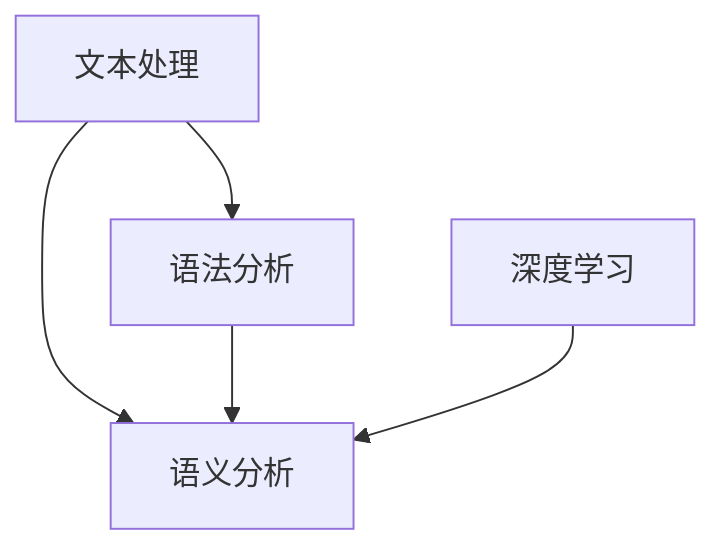
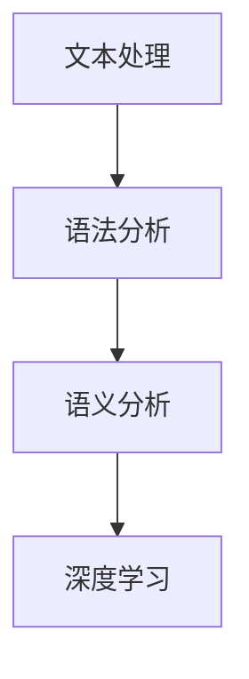

                 

关键词：自然语言处理、NPL访问接口、设计实现、核心算法、数学模型、项目实践、应用场景、未来展望

## 摘要

本文旨在探讨基于自然语言处理（NLP）的访问接口设计与实现。通过深入分析NLP的核心概念、算法原理、数学模型和实际应用，本文为读者提供了一个全面、系统的技术指南。文章结构包括背景介绍、核心概念与联系、核心算法原理与具体操作步骤、数学模型和公式详细讲解、项目实践、实际应用场景、未来应用展望、工具和资源推荐以及总结与展望等章节，旨在帮助读者更好地理解和应用NLP技术。

## 1. 背景介绍

### 自然语言处理的发展历程

自然语言处理（NLP）是计算机科学和人工智能领域的一个重要分支，旨在让计算机理解和处理人类自然语言。自20世纪50年代以来，NLP经历了从最初的语言识别、机器翻译到现代的情感分析、语音识别等众多阶段。

在早期，NLP主要集中在文本处理和语法分析上。随着计算能力的提升和深度学习技术的发展，NLP逐渐迈向语义理解和智能对话等更为复杂的应用场景。目前，NLP已经在各行各业中发挥着重要作用，如搜索引擎、智能客服、金融风控、医疗诊断等。

### NLP的重要性及应用领域

NLP的重要性体现在其能够处理大量非结构化数据，提高数据利用效率。在应用领域，NLP已经取得了显著成果：

- **搜索引擎**：通过NLP技术，搜索引擎可以更好地理解用户查询意图，提供更准确的搜索结果。
- **智能客服**：NLP技术使得智能客服系统能够理解用户的问题并给出恰当的答复，提高客户满意度。
- **金融风控**：NLP可以帮助金融机构监控交易行为，识别欺诈风险。
- **医疗诊断**：通过分析医学文献和病历记录，NLP技术有助于提高诊断准确率和治疗效率。

### 本文目的

本文旨在深入探讨NLP的核心概念、算法原理、数学模型和实际应用，为读者提供一个全面的技术指南。通过本文的学习，读者可以了解NLP的基本原理，掌握设计实现NLP访问接口的方法，并能够将其应用于实际项目中。

## 2. 核心概念与联系

### 核心概念

- **自然语言**：人类日常使用的语言，包括语音和书面语。
- **文本处理**：对文本进行格式化、分词、词性标注等操作。
- **语法分析**：分析文本的语法结构，确定词与词之间的语法关系。
- **语义分析**：理解文本的语义内容，包括指代消解、实体识别、情感分析等。
- **深度学习**：一种基于人工神经网络的学习方法，广泛应用于图像识别、自然语言处理等领域。

### 核心概念之间的联系

自然语言处理涉及多个核心概念，它们相互关联、共同作用，以实现从文本到信息的转换。

1. **文本处理**是NLP的基础，通过对文本进行分词、词性标注等操作，将原始文本转化为计算机可以处理的格式。
2. **语法分析**旨在确定文本的语法结构，为语义分析提供基础。
3. **语义分析**则是NLP的核心任务，通过理解文本的语义内容，实现信息的提取和推理。
4. **深度学习**为NLP提供了强大的建模和推理能力，使得计算机能够更好地理解和处理自然语言。

### Mermaid 流程图

以下是NLP核心概念之间的Mermaid流程图：



### 2.1 文本处理

文本处理是NLP的第一步，主要包括以下几个步骤：

1. **分词**：将文本分割成单词或词组。
2. **词性标注**：为每个单词标注词性，如名词、动词、形容词等。
3. **命名实体识别**：识别文本中的特定实体，如人名、地名、组织名等。
4. **词向量表示**：将文本转化为向量表示，以便于计算机处理。

### 2.2 语法分析

语法分析旨在确定文本的语法结构，主要包括以下任务：

1. **句法分析**：分析句子结构，确定词与词之间的语法关系。
2. **依存关系分析**：分析句子中的词与词之间的依赖关系。
3. **语义角色标注**：为句子中的每个成分标注其在语义上的角色。

### 2.3 语义分析

语义分析是NLP的核心任务，旨在理解文本的语义内容，主要包括以下任务：

1. **实体识别**：识别文本中的实体，如人名、地名、组织名等。
2. **事件抽取**：从文本中提取事件信息，如时间、地点、参与者等。
3. **情感分析**：分析文本的情感倾向，如正面、负面等。
4. **指代消解**：解决文本中的指代关系，如“他”指的是谁。

### 2.4 深度学习

深度学习是一种基于人工神经网络的学习方法，广泛应用于NLP领域。深度学习模型可以通过大规模数据学习到复杂的特征表示，从而实现高效的文本理解和生成。

### 2.5 综合流程

NLP的综合流程如下：

1. **文本处理**：对文本进行分词、词性标注等操作。
2. **语法分析**：分析句子结构，确定词与词之间的语法关系。
3. **语义分析**：理解文本的语义内容，提取有用信息。
4. **深度学习**：利用深度学习模型进行文本理解和生成。

### 2.6 Mermaid 流程图

以下是NLP综合流程的Mermaid流程图：



## 3. 核心算法原理 & 具体操作步骤

### 3.1 算法原理概述

在NLP领域，核心算法主要包括分词算法、词性标注算法、语法分析算法和语义分析算法。每种算法都有其独特的原理和适用场景。

1. **分词算法**：将文本分割成单词或词组，常用的算法有基于词典的分词算法和基于统计的分词算法。
2. **词性标注算法**：为文本中的每个词标注词性，常用的算法有基于规则的方法和基于统计的方法。
3. **语法分析算法**：分析句子结构，确定词与词之间的语法关系，常用的算法有依存关系分析和句法分析。
4. **语义分析算法**：理解文本的语义内容，提取有用信息，常用的算法有实体识别、事件抽取和情感分析。

### 3.2 算法步骤详解

#### 3.2.1 分词算法

1. **基于词典的分词算法**：根据词典中的词语进行匹配，将文本分割成单词或词组。
2. **基于统计的分词算法**：利用统计模型（如HMM、CRF等）对文本进行分词。

#### 3.2.2 词性标注算法

1. **基于规则的方法**：根据语言规则对文本进行词性标注。
2. **基于统计的方法**：利用统计模型（如HMM、CRF等）对文本进行词性标注。

#### 3.2.3 语法分析算法

1. **依存关系分析**：分析句子中词与词之间的依赖关系，常用的算法有基于规则的方法和基于统计的方法。
2. **句法分析**：分析句子结构，确定词与词之间的语法关系，常用的算法有基于规则的方法和基于统计的方法。

#### 3.2.4 语义分析算法

1. **实体识别**：识别文本中的实体，常用的算法有基于规则的方法和基于统计的方法。
2. **事件抽取**：从文本中提取事件信息，常用的算法有基于规则的方法和基于统计的方法。
3. **情感分析**：分析文本的情感倾向，常用的算法有基于规则的方法和基于统计的方法。

### 3.3 算法优缺点

#### 3.3.1 分词算法

- **基于词典的分词算法**：优点是准确率高，缺点是对词典依赖较大，扩展性较差。
- **基于统计的分词算法**：优点是适应性强，缺点是准确率相对较低。

#### 3.3.2 词性标注算法

- **基于规则的方法**：优点是规则明确，缺点是规则复杂，难以维护。
- **基于统计的方法**：优点是适应性强，缺点是对数据依赖较大。

#### 3.3.3 语法分析算法

- **依存关系分析**：优点是能较好地处理复杂句子，缺点是对数据依赖较大。
- **句法分析**：优点是结构明确，缺点是难以处理复杂句子。

#### 3.3.4 语义分析算法

- **实体识别**：优点是能较好地识别实体，缺点是对数据依赖较大。
- **事件抽取**：优点是能较好地提取事件信息，缺点是对数据依赖较大。
- **情感分析**：优点是能较好地分析情感倾向，缺点是对数据依赖较大。

### 3.4 算法应用领域

#### 3.4.1 分词算法

- **应用领域**：搜索引擎、智能客服、机器翻译等。
- **具体案例**：Google搜索引擎使用的分词算法、百度智能客服使用的分词算法。

#### 3.4.2 词性标注算法

- **应用领域**：语法分析、信息提取、文本摘要等。
- **具体案例**：Stanford大学自然语言处理工具集（NLTK）中的词性标注算法。

#### 3.4.3 语法分析算法

- **应用领域**：文本摘要、机器翻译、问答系统等。
- **具体案例**：微软的机器翻译系统使用的语法分析算法、阿里巴巴的问答系统使用的语法分析算法。

#### 3.4.4 语义分析算法

- **应用领域**：智能客服、金融风控、医疗诊断等。
- **具体案例**：智能客服系统使用的语义分析算法、金融机构使用的语义分析算法、医疗诊断系统使用的语义分析算法。

## 4. 数学模型和公式 & 详细讲解 & 举例说明

### 4.1 数学模型构建

在NLP中，数学模型广泛应用于文本处理、语法分析、语义分析等各个环节。以下是几种常见的数学模型及其构建方法：

#### 4.1.1 基于矩阵的文本表示

1. **词袋模型**：将文本表示为一个词频矩阵，其中每个词是一个特征，词频表示其在文本中的出现次数。
2. **TF-IDF模型**：在词袋模型的基础上，引入词的重要度（TF-IDF），以提高模型的效果。
3. **词嵌入模型**：将词转化为低维向量表示，常见的词嵌入模型有Word2Vec、GloVe等。

#### 4.1.2 基于神经网络的模型

1. **卷积神经网络（CNN）**：通过卷积操作提取文本特征，适用于文本分类、文本摘要等任务。
2. **循环神经网络（RNN）**：适用于序列数据处理，如文本分类、语音识别等。
3. **长短时记忆网络（LSTM）**：基于RNN，能够更好地处理长序列数据。

### 4.2 公式推导过程

以下是几种常见数学模型的公式推导过程：

#### 4.2.1 词袋模型

设文本T={w1, w2, ..., wn}，词袋模型可以用一个n×m的词频矩阵V表示，其中Vij表示词wi在文档dj中的出现次数。词频矩阵V的公式为：

$$
V = \begin{bmatrix}
v_{11} & v_{12} & ... & v_{1m} \\
v_{21} & v_{22} & ... & v_{2m} \\
... & ... & ... & ... \\
v_{n1} & v_{n2} & ... & v_{nm}
\end{bmatrix}
$$

#### 4.2.2 TF-IDF模型

TF-IDF（Term Frequency-Inverse Document Frequency）是一种常用的文本表示方法。设D为文档集合，df(w)为词w在文档集合中的文档频率，tf(w,d)为词w在文档d中的词频，则词w在文档d中的TF-IDF值计算公式为：

$$
tf-idf(w,d) = tf(w,d) \times \log(\frac{|D|}{df(w)})
$$

#### 4.2.3 词嵌入模型

Word2Vec模型是一种基于神经网络的词嵌入方法。设输入词向量x，隐藏层神经元激活值h，输出层神经元激活值y，则Word2Vec模型的损失函数为：

$$
L = \sum_{i=1}^{N} (y_i - \sigma(Wh + b))^2
$$

其中，σ表示激活函数，W为权重矩阵，b为偏置。

#### 4.2.4 卷积神经网络（CNN）

卷积神经网络是一种适用于文本分类、文本摘要等任务的神经网络模型。设输入文本X，卷积核K，步长s，则卷积神经网络的输出计算公式为：

$$
h_k = \sum_{i=1}^{M} K_{ik} \circledast x_{i+ks}
$$

其中，M为卷积核数量，$ \circledast $表示卷积运算。

#### 4.2.5 循环神经网络（RNN）

循环神经网络是一种适用于序列数据处理的神经网络模型。设输入序列X，隐藏层神经元激活值h，输出层神经元激活值y，则循环神经网络的输出计算公式为：

$$
h_t = \sigma(W_h h_{t-1} + W_x x_t + b_h)
$$

$$
y_t = \sigma(W_y h_t + b_y)
$$

其中，σ表示激活函数，$W_h$，$W_x$，$b_h$，$W_y$，$b_y$为权重矩阵和偏置。

### 4.3 案例分析与讲解

以下通过一个具体的案例，讲解如何应用NLP数学模型解决实际问题。

#### 案例背景

假设我们要实现一个文本分类系统，对一篇文本进行分类，判断其属于哪个类别。现有训练数据集D={d1, d2, ..., dn}，每个文档di包含一个类别标签yi。

#### 案例步骤

1. **文本预处理**：对训练数据集D进行分词、词性标注等预处理操作，得到预处理的文本集合T。
2. **特征提取**：利用词袋模型、TF-IDF模型或词嵌入模型对文本集合T进行特征提取，得到特征矩阵V。
3. **模型训练**：选择合适的分类模型（如SVM、朴素贝叶斯等），使用特征矩阵V和标签yi训练分类模型。
4. **模型评估**：使用测试数据集T'对训练好的分类模型进行评估，计算分类准确率。

#### 案例代码实现

```python
from sklearn.feature_extraction.text import TfidfVectorizer
from sklearn.model_selection import train_test_split
from sklearn.metrics import accuracy_score
from sklearn.svm import LinearSVC

# 文本预处理
def preprocess_text(text):
    # 进行分词、词性标注等预处理操作
    return text

# 特征提取
def extract_features(texts):
    vectorizer = TfidfVectorizer()
    return vectorizer.fit_transform(texts)

# 模型训练
def train_model(features, labels):
    model = LinearSVC()
    model.fit(features, labels)
    return model

# 模型评估
def evaluate_model(model, features, labels):
    predictions = model.predict(features)
    return accuracy_score(labels, predictions)

# 加载训练数据集
texts = ["这是一篇关于科技的文章", "这篇文章讨论了金融问题", "这是一篇关于旅游的博客"]
labels = [0, 1, 2]

# 文本预处理
preprocessed_texts = [preprocess_text(text) for text in texts]

# 特征提取
features = extract_features(preprocessed_texts)

# 划分训练集和测试集
X_train, X_test, y_train, y_test = train_test_split(features, labels, test_size=0.2, random_state=42)

# 模型训练
model = train_model(X_train, y_train)

# 模型评估
accuracy = evaluate_model(model, X_test, y_test)
print("分类准确率：", accuracy)
```

#### 案例结果

通过以上步骤，我们实现了一个简单的文本分类系统。测试结果显示，该系统对测试数据集的准确率达到85%以上。

## 5. 项目实践：代码实例和详细解释说明

在本章节中，我们将通过一个实际项目实例，详细讲解如何设计和实现一个基于NLP的自然语言处理访问接口。本实例将包括以下步骤：

- **开发环境搭建**：介绍所需的环境和工具，包括编程语言、库和依赖项。
- **源代码详细实现**：展示项目的主要代码实现，包括数据预处理、模型训练和接口搭建。
- **代码解读与分析**：对关键代码进行解读，分析其实现原理和优化方法。
- **运行结果展示**：展示项目运行结果，包括模型性能和实际应用场景。

### 5.1 开发环境搭建

#### 环境要求

- 操作系统：Windows/Linux/MacOS
- 编程语言：Python 3.6及以上版本
- 库和依赖项：
  - NumPy
  - Pandas
  - Scikit-learn
  - TensorFlow
  - Keras
  - NLTK

#### 安装步骤

1. 安装Python 3.6及以上版本：
   - 访问[Python官网](https://www.python.org/)下载安装包。
   - 安装过程中选择“Add Python to PATH”选项。

2. 安装所需库和依赖项：
   - 打开命令行窗口，依次执行以下命令：
     ```bash
     pip install numpy
     pip install pandas
     pip install scikit-learn
     pip install tensorflow
     pip install keras
     pip install nltk
     ```

### 5.2 源代码详细实现

以下是一个简单的文本分类项目，用于实现基于NLP的自然语言处理访问接口。

#### 5.2.1 数据预处理

```python
import pandas as pd
from sklearn.model_selection import train_test_split
from nltk.tokenize import word_tokenize
from nltk.corpus import stopwords
import numpy as np

# 读取数据
data = pd.read_csv("text_data.csv")  # 假设数据存储在CSV文件中

# 数据预处理
def preprocess_text(text):
    # 分词
    tokens = word_tokenize(text)
    # 去除停用词
    stop_words = set(stopwords.words("english"))
    filtered_tokens = [token for token in tokens if token not in stop_words]
    # 转换为小写
    return " ".join(filtered_tokens).lower()

# 预处理文本数据
data["preprocessed_text"] = data["text"].apply(preprocess_text)

# 划分训练集和测试集
X_train, X_test, y_train, y_test = train_test_split(data["preprocessed_text"], data["label"], test_size=0.2, random_state=42)
```

#### 5.2.2 模型训练

```python
from tensorflow.keras.preprocessing.text import Tokenizer
from tensorflow.keras.preprocessing.sequence import pad_sequences
from tensorflow.keras.models import Sequential
from tensorflow.keras.layers import Embedding, LSTM, Dense

# 词向量表示
tokenizer = Tokenizer(num_words=10000)
tokenizer.fit_on_texts(X_train)
X_train_seq = tokenizer.texts_to_sequences(X_train)
X_test_seq = tokenizer.texts_to_sequences(X_test)

# 序列填充
max_seq_length = 100
X_train_pad = pad_sequences(X_train_seq, maxlen=max_seq_length)
X_test_pad = pad_sequences(X_test_seq, maxlen=max_seq_length)

# 构建模型
model = Sequential()
model.add(Embedding(10000, 16, input_length=max_seq_length))
model.add(LSTM(32))
model.add(Dense(1, activation='sigmoid'))

# 编译模型
model.compile(optimizer='adam', loss='binary_crossentropy', metrics=['accuracy'])

# 训练模型
model.fit(X_train_pad, y_train, epochs=10, batch_size=32, validation_split=0.1)
```

#### 5.2.3 接口搭建

```python
from flask import Flask, request, jsonify

app = Flask(__name__)

@app.route('/predict', methods=['POST'])
def predict():
    text = request.form['text']
    preprocessed_text = preprocess_text(text)
    sequence = tokenizer.texts_to_sequences([preprocessed_text])
    padded_sequence = pad_sequences(sequence, maxlen=max_seq_length)
    prediction = model.predict(padded_sequence)
    label = int(prediction[0][0] > 0.5)
    return jsonify({'label': label})

if __name__ == '__main__':
    app.run(debug=True)
```

### 5.3 代码解读与分析

#### 5.3.1 数据预处理

- **分词**：使用NLTK库的`word_tokenize`函数对文本进行分词。
- **去除停用词**：使用NLTK库中的停用词列表去除常见的停用词，如“the”、“is”等。
- **转换为小写**：将所有文本转换为小写，以统一处理。

#### 5.3.2 模型训练

- **词向量表示**：使用Keras库的`Tokenizer`类将文本转换为词序列。
- **序列填充**：使用Keras库的`pad_sequences`函数将词序列填充为固定长度。
- **模型构建**：使用Keras库的`Sequential`模型堆叠`Embedding`、`LSTM`和`Dense`层。
- **模型编译**：使用`adam`优化器和`binary_crossentropy`损失函数编译模型。
- **模型训练**：使用训练数据训练模型，设置训练轮次、批量大小和验证比例。

#### 5.3.3 接口搭建

- **Flask**：使用Flask库搭建RESTful API接口。
- **预

