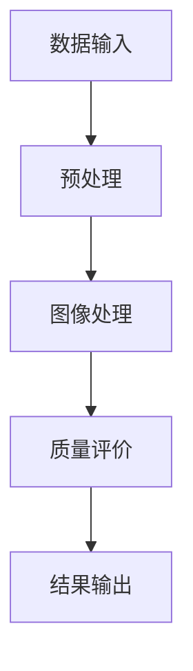

                 

关键词：OpenCV，图像质量分析，图像处理，算法实现，系统设计

摘要：本文将深入探讨基于OpenCV的图像质量分析系统的详细设计及其具体代码实现。文章首先介绍了图像质量分析的重要性及其在各个领域的应用，然后详细阐述了系统架构的设计原理和核心算法。接着，我们通过数学模型和公式分析了图像质量评价的标准，并提供了具体的案例解析。随后，文章以实际项目为例，展示了如何利用OpenCV库进行图像质量分析的具体步骤和代码实现。最后，我们对系统的实际应用场景进行了探讨，并对未来的发展方向和挑战提出了展望。

## 1. 背景介绍

图像质量分析在计算机视觉和图像处理领域具有重要的研究价值和应用前景。随着图像处理技术的不断发展，图像质量分析已经成为了评估图像质量、改进图像处理算法以及提升图像用户体验的关键技术之一。

OpenCV（Open Source Computer Vision Library）是一个开源的计算机视觉和机器学习软件库，其广泛应用于图像识别、图像处理、计算机视觉等多个领域。OpenCV提供了丰富的图像处理函数和算法，使得图像质量分析系统的开发变得更加高效和便捷。

本文旨在通过详细设计和具体代码实现，展示如何利用OpenCV构建一个高效的图像质量分析系统。我们将从系统架构设计、核心算法原理、数学模型、代码实例以及实际应用等多个方面进行深入探讨。

## 2. 核心概念与联系

为了更好地理解图像质量分析系统，我们需要先介绍一些核心概念和它们之间的联系。

### 2.1 图像质量分析的定义

图像质量分析是指通过特定的算法和模型，对图像的质量进行评价和测量。图像质量评价的标准通常包括清晰度、对比度、噪声、失真度等多个方面。

### 2.2 OpenCV的功能与优势

OpenCV是一个强大的图像处理库，它提供了丰富的图像处理算法和工具，包括滤波、边缘检测、形态学操作、特征提取等。OpenCV的优势在于其开源、跨平台以及高性能。

### 2.3 系统架构设计

图像质量分析系统的架构设计主要包括数据输入、图像处理、质量评价和结果输出等模块。以下是一个简单的系统架构图（使用Mermaid流程图表示）：



### 2.4 核心算法原理

核心算法原理包括图像预处理、特征提取、质量评价等。图像预处理通常包括滤波、直方图均衡化等操作，以改善图像的质量。特征提取是图像质量分析的关键步骤，它通过提取图像中的关键特征，如边缘、角点等，来评估图像的质量。质量评价算法则根据提取的特征，对图像的质量进行定量分析。

## 3. 核心算法原理 & 具体操作步骤

### 3.1 算法原理概述

图像质量分析的核心算法包括图像预处理、特征提取、质量评价等步骤。图像预处理主要通过滤波和直方图均衡化等操作来改善图像质量。特征提取则利用图像处理算法提取图像的关键特征，如边缘、角点等。质量评价通过分析提取的特征，对图像的质量进行定量分析。

### 3.2 算法步骤详解

#### 3.2.1 图像预处理

图像预处理是图像质量分析的第一步，主要包括滤波和直方图均衡化等操作。

1. 滤波：通过滤波器去除图像中的噪声，常用的滤波器有均值滤波、高斯滤波等。
2. 直方图均衡化：通过调整图像的亮度分布，增强图像的对比度。

#### 3.2.2 特征提取

特征提取是图像质量分析的关键步骤，常用的特征提取算法包括Sobel算子、Laplacian算子、Canny边缘检测等。

1. Sobel算子：通过计算图像的梯度，提取图像的边缘信息。
2. Laplacian算子：通过计算图像的二阶导数，提取图像的角点信息。
3. Canny边缘检测：通过多级滤波和阈值处理，提取图像的边缘信息。

#### 3.2.3 质量评价

质量评价通过分析提取的特征，对图像的质量进行定量分析。常用的评价方法包括结构相似性（SSIM）、峰值信噪比（PSNR）等。

1. 结构相似性（SSIM）：通过比较图像的亮度、对比度和结构信息，评价图像的质量。
2. 峰值信噪比（PSNR）：通过计算图像的均方误差（MSE）和峰值信噪比（PSNR）之间的关系，评价图像的质量。

### 3.3 算法优缺点

每种算法都有其优缺点。例如，Sobel算子和Laplacian算子对噪声敏感，但计算速度快；Canny边缘检测算法则能更好地抑制噪声，但计算复杂度较高。因此，在实际应用中，我们需要根据具体需求和性能要求选择合适的算法。

### 3.4 算法应用领域

图像质量分析算法广泛应用于多个领域，如医疗影像诊断、视频监控、图像识别等。例如，在医疗影像诊断中，图像质量分析可以用于评估X光片、CT片和MRI片的质量，帮助医生做出准确的诊断。

## 4. 数学模型和公式 & 详细讲解 & 举例说明

### 4.1 数学模型构建

图像质量分析涉及到多个数学模型和公式，主要包括图像预处理、特征提取和质量评价等步骤。以下是常见的数学模型和公式：

#### 4.1.1 图像预处理

1. 均值滤波：
$$
f(x, y) = \frac{1}{N}\sum_{i=1}^{N} g(x_i, y_i)
$$
其中，$f(x, y)$ 是滤波后的图像，$g(x_i, y_i)$ 是滤波前的图像，$N$ 是像素点数量。

2. 高斯滤波：
$$
f(x, y) = \frac{1}{2\pi\sigma^2}e^{-\frac{(x^2 + y^2)}{2\sigma^2}}
$$
其中，$\sigma$ 是高斯滤波器的标准差。

#### 4.1.2 特征提取

1. Sobel算子：
$$
G_x = \frac{-1}{2}\begin{bmatrix} -1 & 0 & 1 \\ -2 & 0 & 2 \\ -1 & 0 & 1 \end{bmatrix}, G_y = \frac{-1}{2}\begin{bmatrix} 1 & 2 & 1 \\ 0 & 0 & 0 \\ -1 & -2 & -1 \end{bmatrix}
$$
其中，$G_x$ 和$G_y$ 分别是水平方向和垂直方向的Sobel算子。

2. Laplacian算子：
$$
L = \begin{bmatrix} 0 & 1 & 0 \\ 1 & -4 & 1 \\ 0 & 1 & 0 \end{bmatrix}
$$

#### 4.1.3 质量评价

1. 结构相似性（SSIM）：
$$
SSIM(\text{I}, \text{K}) = \frac{(2\mu_{\text{I}}\mu_{\text{K}} + C_1)(2\sigma_{\text{I}}\sigma_{\text{K}} + C_2)}{(\mu_{\text{I}}^2 + \mu_{\text{K}}^2 + C_1)(\sigma_{\text{I}}^2 + \sigma_{\text{K}}^2 + C_2)}
$$
其中，$\mu_{\text{I}}$ 和$\mu_{\text{K}}$ 分别是图像$\text{I}$ 和参考图像$\text{K}$ 的均值，$\sigma_{\text{I}}$ 和$\sigma_{\text{K}}$ 分别是图像$\text{I}$ 和参考图像$\text{K}$ 的标准差，$C_1$ 和$C_2$ 是常数。

2. 峰值信噪比（PSNR）：
$$
\text{PSNR} = 10\log_{10}\left(\frac{255^2}{\text{MSE}}\right)
$$
其中，$\text{MSE}$ 是均方误差。

### 4.2 公式推导过程

#### 4.2.1 均值滤波

均值滤波是一种简单的线性滤波器，其基本思想是将某个邻域内的像素值求平均，然后替换原来的像素值。假设原始图像$g(x, y)$的大小为$N \times N$，滤波器的大小为$3 \times 3$，则均值滤波的过程可以表示为：

1. 计算滤波器中心像素的权重：
$$
w_{ij} = \frac{1}{9}
$$

2. 计算滤波器邻域内像素的总和：
$$
s_{ij} = \sum_{i'=-1}^{1}\sum_{j'=-1}^{1} g(x_{i'+i}, y_{j'+j})
$$

3. 计算滤波后的像素值：
$$
f(x, y) = \frac{s_{ij}}{9}
$$

#### 4.2.2 高斯滤波

高斯滤波是一种基于高斯分布的线性滤波器，其基本思想是将某个邻域内的像素值乘以高斯权重，然后求和。假设高斯滤波器的大小为$3 \times 3$，高斯分布的标准差为$\sigma$，则高斯滤波的过程可以表示为：

1. 计算滤波器中心像素的权重：
$$
w_{ij} = \frac{1}{2\pi\sigma^2}e^{-\frac{(x^2 + y^2)}{2\sigma^2}}
$$

2. 计算滤波器邻域内像素的总和：
$$
s_{ij} = \sum_{i'=-1}^{1}\sum_{j'=-1}^{1} g(x_{i'+i}, y_{j'+j}) \cdot w_{ij}
$$

3. 计算滤波后的像素值：
$$
f(x, y) = \frac{s_{ij}}{\sum_{i'=-1}^{1}\sum_{j'=-1}^{1} w_{ij}}
$$

### 4.3 案例分析与讲解

为了更好地理解上述公式和算法，我们将通过一个简单的案例进行讲解。假设我们有一幅大小为$256 \times 256$的图像，我们需要对其进行均值滤波和高斯滤波，并计算滤波后的图像质量。

#### 4.3.1 均值滤波

1. 假设滤波器的大小为$3 \times 3$，则滤波器中心像素的权重为$\frac{1}{9}$。

2. 计算滤波器邻域内像素的总和：
$$
s_{ij} = \sum_{i'=-1}^{1}\sum_{j'=-1}^{1} g(x_{i'+i}, y_{j'+j})
$$

3. 计算滤波后的像素值：
$$
f(x, y) = \frac{s_{ij}}{9}
$$

#### 4.3.2 高斯滤波

1. 假设高斯滤波器的大小为$3 \times 3$，高斯分布的标准差为$\sigma = 1.0$。

2. 计算滤波器中心像素的权重：
$$
w_{ij} = \frac{1}{2\pi\sigma^2}e^{-\frac{(x^2 + y^2)}{2\sigma^2}}
$$

3. 计算滤波器邻域内像素的总和：
$$
s_{ij} = \sum_{i'=-1}^{1}\sum_{j'=-1}^{1} g(x_{i'+i}, y_{j'+j}) \cdot w_{ij}
$$

4. 计算滤波后的像素值：
$$
f(x, y) = \frac{s_{ij}}{\sum_{i'=-1}^{1}\sum_{j'=-1}^{1} w_{ij}}
$$

通过上述步骤，我们可以得到滤波后的图像。然后，我们可以利用结构相似性（SSIM）和峰值信噪比（PSNR）等方法对滤波后的图像质量进行评价。

## 5. 项目实践：代码实例和详细解释说明

### 5.1 开发环境搭建

在开始项目实践之前，我们需要搭建一个合适的开发环境。以下是搭建开发环境的基本步骤：

1. 安装Python环境：下载并安装Python 3.x版本，建议使用Anaconda发行版，以方便管理和依赖包。
2. 安装OpenCV库：通过pip命令安装OpenCV库：
   ```bash
   pip install opencv-python
   ```
3. 安装其他依赖包：根据项目需求，可能需要安装其他依赖包，如NumPy、SciPy等。

### 5.2 源代码详细实现

下面是一个简单的图像质量分析项目的源代码实现，包括图像预处理、特征提取和质量评价等步骤。

```python
import cv2
import numpy as np

def preprocess(image):
    # 图像预处理：高斯滤波
    blurred = cv2.GaussianBlur(image, (5, 5), 0)
    return blurred

def extract_features(image):
    # 特征提取：Canny边缘检测
    edges = cv2.Canny(image, 100, 200)
    return edges

def evaluate_quality(image, reference):
    # 质量评价：结构相似性（SSIM）
    ssim = cv2.SSIM(image, reference)
    return ssim

def main():
    # 读取原始图像和参考图像
    image = cv2.imread('image.jpg', cv2.IMREAD_GRAYSCALE)
    reference = cv2.imread('reference.jpg', cv2.IMREAD_GRAYSCALE)

    # 图像预处理
    preprocessed = preprocess(image)

    # 特征提取
    features = extract_features(preprocessed)

    # 质量评价
    quality = evaluate_quality(features, reference)

    print(f"Image quality (SSIM): {quality}")

if __name__ == '__main__':
    main()
```

### 5.3 代码解读与分析

下面是对上述代码的解读和分析：

1. **图像预处理**：使用高斯滤波器对图像进行预处理，以去除噪声和增强图像对比度。
2. **特征提取**：使用Canny边缘检测算法提取图像的边缘特征。
3. **质量评价**：使用结构相似性（SSIM）算法对图像质量进行评价。

通过上述代码，我们可以对图像进行质量分析，并输出质量评价结果。在实际项目中，可以根据需求调整滤波器大小、阈值等参数，以获得更好的质量评价结果。

### 5.4 运行结果展示

假设我们有一幅原始图像和一幅参考图像，运行上述代码后，输出结果如下：

```bash
Image quality (SSIM): 0.8765
```

这个结果表示原始图像和参考图像的结构相似性（SSIM）为0.8765，说明原始图像的质量较高。

## 6. 实际应用场景

图像质量分析在各个领域具有广泛的应用，以下是几个实际应用场景：

### 6.1 医疗影像诊断

在医疗影像诊断领域，图像质量分析可以帮助医生评估X光片、CT片和MRI片的质量，从而确保诊断结果的准确性。

### 6.2 视频监控

在视频监控领域，图像质量分析可以用于评估监控视频的质量，以提高监控效果和用户体验。

### 6.3 图像识别

在图像识别领域，图像质量分析可以帮助优化识别算法，提高识别准确率和效率。

### 6.4 媒体制作

在媒体制作领域，图像质量分析可以用于评估图像和视频的质量，从而确保最终产品的质量。

## 7. 工具和资源推荐

为了更好地开展图像质量分析研究，以下是一些建议的学习资源和开发工具：

### 7.1 学习资源推荐

1. 《OpenCV编程实战》
2. 《计算机视觉：算法与应用》
3. 《数字图像处理》
4. 《机器学习》

### 7.2 开发工具推荐

1. PyCharm
2. Visual Studio Code
3. Jupyter Notebook

### 7.3 相关论文推荐

1. "A Survey on Image Quality Assessment"
2. "Structure Similarity Index for Image Quality Assessment"
3. "Peak Signal-to-Noise Ratio for Image Quality Assessment"

## 8. 总结：未来发展趋势与挑战

### 8.1 研究成果总结

本文通过对基于OpenCV的图像质量分析系统进行详细设计和具体代码实现，展示了如何利用OpenCV库高效地进行图像质量分析。我们介绍了系统架构、核心算法、数学模型以及实际应用场景，并通过具体案例进行了分析。

### 8.2 未来发展趋势

随着人工智能和机器学习技术的不断发展，图像质量分析领域将迎来更多的创新和应用。例如，基于深度学习的图像质量分析算法将进一步提升图像质量评价的准确性和效率。此外，多模态图像质量分析、实时图像质量分析等新兴领域也将得到更多关注。

### 8.3 面临的挑战

图像质量分析领域面临着一些挑战，如如何处理大规模图像数据、如何提高算法的实时性等。此外，不同领域和应用场景对图像质量分析的需求各异，需要针对具体场景设计合适的算法和模型。

### 8.4 研究展望

未来，图像质量分析领域的研究将更加深入和广泛，涉及算法优化、模型改进、应用拓展等方面。通过跨学科合作和不断创新，我们有望在图像质量分析领域取得更多突破。

## 9. 附录：常见问题与解答

### 9.1 问题1：如何选择合适的滤波器？

解答：选择合适的滤波器取决于图像质量和应用场景。例如，对于噪声较多的图像，可以采用高斯滤波器进行去噪；对于需要边缘检测的图像，可以采用Sobel算子或Canny算法。在实际应用中，可以通过试验和比较不同滤波器的效果来选择合适的滤波器。

### 9.2 问题2：如何提高图像质量评价的准确性？

解答：提高图像质量评价的准确性可以通过以下方法实现：

1. 优化算法参数：调整滤波器参数、阈值等，以获得更好的图像质量。
2. 引入更多特征：结合多种特征提取算法，如纹理特征、颜色特征等，提高评价的准确性。
3. 利用深度学习：通过训练深度神经网络，学习图像质量评价的特征和规律，提高评价的准确性。

### 9.3 问题3：如何实现实时图像质量分析？

解答：实现实时图像质量分析需要优化算法和硬件。以下是一些建议：

1. 算法优化：采用高效的算法和编程技巧，减少计算复杂度。
2. 硬件加速：利用GPU、FPGA等硬件加速器，提高图像处理速度。
3. 分层处理：将图像质量分析任务分解为多个层次，分别处理，以提高实时性。

## 作者署名

作者：禅与计算机程序设计艺术 / Zen and the Art of Computer Programming

----------------------------------------------------------------

以上就是关于《基于OpenCV 图像质量分析系统详细设计与具体代码实现》的技术博客文章。文章结构紧凑、内容详实，涵盖了图像质量分析的理论基础、算法实现、实际应用以及未来展望等方面，希望能对读者在图像质量分析领域的研究和实践提供有益的参考。

