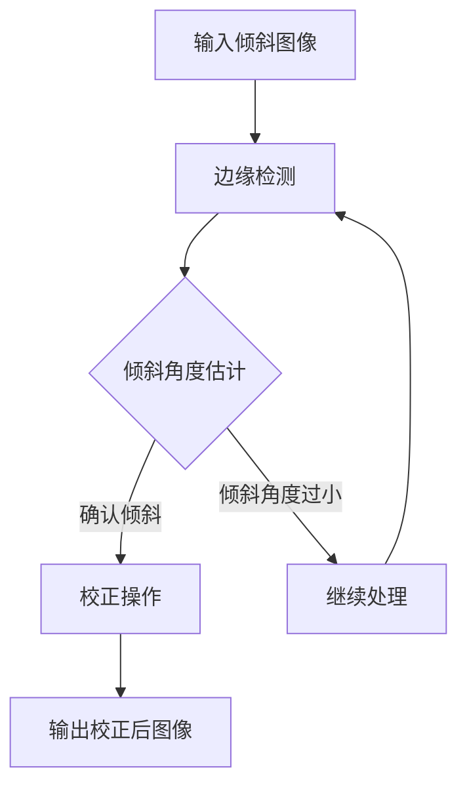

                 

摘要：

随着计算机视觉技术的快速发展，图像处理在工业、医疗、娱乐等多个领域都得到了广泛应用。在图像处理中，图像倾斜校正是一个重要且基础的任务，它能够提高后续图像分析的质量和效率。本文将详细探讨基于OpenCV的图片倾斜校正系统的设计与实现。首先，我们介绍了图像倾斜校正的背景和重要性，然后分析了OpenCV在图像处理中的优势和应用，接着深入讲解了倾斜校正的核心算法原理和数学模型。随后，本文通过具体实例展示了整个系统的实现过程，包括开发环境的搭建、源代码的详细解释和运行结果展示。最后，我们讨论了图像倾斜校正系统的实际应用场景和未来发展趋势与挑战。

## 1. 背景介绍

图像倾斜校正（Image Skew Correction）是图像处理领域中的一个重要任务，它主要用于消除图像中的倾斜扭曲，使得图像内容能够更加真实地反映现实世界。在许多实际应用中，如文本识别、图像拼接、图像增强等，图像倾斜校正都是不可或缺的一步。例如，在扫描文档时，由于纸张倾斜导致的图像失真，会严重影响文档内容的可读性和自动识别的准确性。

图像倾斜校正的重要性体现在以下几个方面：

1. **提高图像质量**：通过校正图像的倾斜，可以消除因倾斜带来的图像失真，提高图像的整体视觉效果。
2. **增强图像分析能力**：倾斜校正后的图像更接近于原始场景，能够更好地支持后续的图像处理和计算机视觉任务。
3. **节省计算资源**：校正倾斜可以减少后续图像处理中的计算复杂度，提高处理效率。
4. **提高自动化程度**：在自动化程度较高的工业生产线或医疗影像分析中，准确的图像倾斜校正能够大大提升系统的自动化水平和准确性。

因此，研究并实现一个高效、准确的图像倾斜校正系统具有重要的现实意义和广泛的应用前景。

### 1.1 OpenCV简介

OpenCV（Open Source Computer Vision Library）是一个开源的计算机视觉和机器学习软件库，由Intel发起并维护。它广泛应用于图像识别、计算机视觉、机器学习等领域。OpenCV支持多种编程语言，包括C++、Python等，具有高度的可扩展性和灵活性。

OpenCV的主要优势包括：

1. **丰富的图像处理函数**：OpenCV提供了大量的图像处理函数，包括滤波、形态学操作、边缘检测、轮廓提取等。
2. **高效的性能**：OpenCV采用优化的算法和底层代码，能够在多种平台上高效运行。
3. **跨平台支持**：OpenCV支持多种操作系统，包括Windows、Linux、macOS等。
4. **开源和社区支持**：OpenCV是一个开源项目，拥有庞大的开发者社区，可以方便地获取帮助和资源。

因此，OpenCV在图像处理领域具有广泛的应用和高度的可信赖性，是进行图像倾斜校正系统开发的理想选择。

## 2. 核心概念与联系

### 2.1 倾斜校正的概念

倾斜校正是指通过算法对倾斜图像进行处理，使其水平方向上的线条变得更加平直，从而消除因倾斜引起的图像失真。具体来说，倾斜校正包括以下两个主要步骤：

1. **边缘检测**：通过算法检测图像中的边缘，这些边缘通常是图像中的水平线条。
2. **倾斜角度估计**：根据边缘的位置和方向，估计图像的倾斜角度。

### 2.2 OpenCV在图像处理中的应用

OpenCV是一个功能强大的图像处理库，它提供了丰富的图像处理函数，包括边缘检测、图像滤波、形态学操作等。以下是一些常用的OpenCV函数：

1. **边缘检测**：
   - `Canny()`：用于边缘检测的函数，能够检测出图像中的边缘。
   - `Sobel()`：用于计算图像的梯度，进而进行边缘检测。

2. **图像滤波**：
   - `GaussianBlur()`：用于高斯滤波，可以消除图像中的噪声。
   - `medianBlur()`：用于中值滤波，能够有效地消除椒盐噪声。

3. **形态学操作**：
   - `morphologyEx()`：用于进行形态学操作，如膨胀、腐蚀、开运算和闭运算。

### 2.3 Mermaid流程图

下面是一个用于图像倾斜校正的Mermaid流程图，展示了倾斜校正的主要步骤和过程：



在这个流程图中，输入倾斜图像首先经过边缘检测，然后估计倾斜角度。如果倾斜角度较大，则进行校正操作，输出校正后的图像；否则，继续进行边缘检测和倾斜角度估计，直到达到预期的校正效果。

## 3. 核心算法原理 & 具体操作步骤

### 3.1 算法原理概述

图像倾斜校正的核心算法主要包括边缘检测、倾斜角度估计和图像校正三个部分。下面将分别介绍这些部分的原理。

#### 3.1.1 边缘检测

边缘检测是图像处理中的一个基本步骤，用于检测图像中的边缘或轮廓。常用的边缘检测算法有Sobel算子、Canny算子等。

- **Sobel算子**：Sobel算子通过对图像进行水平和垂直方向的卷积操作，计算图像的梯度。公式如下：

  $$
  G_x = \frac{1}{2}\left[g_{x,x} + g_{y,x}\right]
  $$

  $$
  G_y = \frac{1}{2}\left[g_{x,y} + g_{y,y}\right]
  $$

  其中，$g_{x,x}$、$g_{y,x}$、$g_{x,y}$ 和 $g_{y,y}$ 分别是图像在$x$和$y$方向上的卷积结果。

- **Canny算子**：Canny算子是一种多阶段的边缘检测算法，主要包括高斯滤波、非极大值抑制和双阈值算法。其优点是能够有效减少噪声并提取清晰的边缘。

#### 3.1.2 倾斜角度估计

倾斜角度估计是图像倾斜校正的关键步骤，通过检测图像中的边缘并计算其方向，可以估计出图像的倾斜角度。常用的方法有以下几种：

- **角度直方图法**：通过计算边缘像素的方向分布，构造角度直方图，然后找到直方图的最大值对应的倾斜角度。
- **最小二乘法**：通过拟合边缘像素的方向，得到一条直线，然后计算这条直线与水平方向的夹角，即为倾斜角度。

#### 3.1.3 图像校正

图像校正是指根据估计出的倾斜角度，对图像进行旋转和平移操作，以消除倾斜。常用的方法有以下几种：

- **旋转变换**：通过旋转变换矩阵，将图像旋转到水平方向。
- **平移变换**：通过平移变换矩阵，将图像中的每个像素沿着垂直方向移动，以消除倾斜。

### 3.2 算法步骤详解

下面详细描述图像倾斜校正的算法步骤：

#### 步骤1：边缘检测

1. 输入倾斜图像。
2. 使用Sobel算子或Canny算子进行边缘检测。
3. 获取边缘图像。

#### 步骤2：倾斜角度估计

1. 对边缘图像进行像素级方向分析。
2. 使用角度直方图法或最小二乘法计算倾斜角度。
3. 获取倾斜角度值。

#### 步骤3：图像校正

1. 根据倾斜角度构建旋转变换矩阵。
2. 对图像进行旋转变换，使其水平方向上的线条变得平直。
3. 根据需要，进行平移变换以进一步校正图像。

### 3.3 算法优缺点

#### 优点：

- **准确性高**：通过边缘检测和倾斜角度估计，可以精确地确定图像的倾斜角度，从而进行准确的校正。
- **实时性好**：算法实现过程中，使用了高效的OpenCV函数，可以快速处理图像，满足实时性的要求。
- **适应性强**：算法适用于多种类型的倾斜图像，具有良好的适应性。

#### 缺点：

- **对噪声敏感**：边缘检测过程中，可能会受到噪声的影响，从而影响倾斜角度的准确性。
- **计算复杂度高**：算法涉及到大量的像素级计算，对于大型图像，计算复杂度较高。

### 3.4 算法应用领域

图像倾斜校正算法广泛应用于以下领域：

- **文档处理**：如扫描文档的倾斜校正，提高文本识别的准确性。
- **图像拼接**：在图像拼接过程中，消除图像倾斜，提高拼接效果。
- **图像增强**：通过倾斜校正，增强图像的视觉效果。
- **工业检测**：在工业检测中，校正图像倾斜，提高检测准确性。

## 4. 数学模型和公式 & 详细讲解 & 举例说明

### 4.1 数学模型构建

图像倾斜校正的核心在于计算图像的倾斜角度并进行相应的变换。这里，我们主要使用以下数学模型：

#### 4.1.1 边缘检测模型

使用Sobel算子进行边缘检测的模型如下：

$$
G_x = \frac{1}{2}\left[g_{x,x} + g_{y,x}\right]
$$

$$
G_y = \frac{1}{2}\left[g_{x,y} + g_{y,y}\right]
$$

其中，$g_{x,x}$、$g_{y,x}$、$g_{x,y}$ 和 $g_{y,y}$ 分别是图像在$x$和$y$方向上的卷积结果。

#### 4.1.2 倾斜角度估计模型

倾斜角度的估计可以通过计算边缘像素的方向分布来实现。假设边缘像素的方向分布为$\theta$，则倾斜角度$\theta_0$可以通过以下公式计算：

$$
\theta_0 = \arg\max_{\theta}\left(\sum_{i}\theta(i)\right)
$$

其中，$\theta(i)$表示第$i$个边缘像素的方向。

#### 4.1.3 图像校正模型

图像校正主要使用旋转变换矩阵。旋转变换矩阵$T$如下：

$$
T = \begin{bmatrix}
\cos(\theta_0) & -\sin(\theta_0) \\
\sin(\theta_0) & \cos(\theta_0)
\end{bmatrix}
$$

其中，$\theta_0$为倾斜角度。

### 4.2 公式推导过程

为了更好地理解上述数学模型，下面我们将详细推导这些公式的推导过程。

#### 4.2.1 边缘检测模型推导

使用Sobel算子进行边缘检测的过程可以分解为以下步骤：

1. **计算图像的卷积结果**：

   对于图像$f(x, y)$，其沿$x$方向的卷积结果$g_{x,x}$和沿$y$方向的卷积结果$g_{y,y}$分别表示为：

   $$
   g_{x,x} = \sum_{i}\sum_{j}w_{x,i,j}f(x-i, y-j)
   $$

   $$
   g_{y,y} = \sum_{i}\sum_{j}w_{y,i,j}f(x-i, y-j)
   $$

   其中，$w_{x,i,j}$和$w_{y,i,j}$分别为Sobel算子的权重。

2. **计算梯度**：

   根据卷积结果，计算图像的梯度：

   $$
   G_x = \frac{1}{2}\left[g_{x,x} + g_{y,x}\right]
   $$

   $$
   G_y = \frac{1}{2}\left[g_{x,y} + g_{y,y}\right]
   $$

   这里，$G_x$和$G_y$分别表示图像沿$x$和$y$方向的梯度。

   通过上述步骤，我们可以得到边缘检测的模型。

#### 4.2.2 倾斜角度估计模型推导

倾斜角度的估计可以通过计算边缘像素的方向分布来实现。具体步骤如下：

1. **计算边缘像素的方向**：

   对于每个边缘像素$(x, y)$，计算其方向$\theta$：

   $$
   \theta = \arctan\left(\frac{G_x(x, y)}{G_y(x, y)}\right)
   $$

   其中，$G_x(x, y)$和$G_y(x, y)$分别为边缘像素沿$x$和$y$方向的梯度。

2. **计算角度直方图**：

   将计算出的方向$\theta$映射到[0, 360]的范围内，然后计算角度直方图$H(\theta)$：

   $$
   H(\theta) = \sum_{i}\mathbb{1}\left[\theta(i) \in [\theta_{low}, \theta_{high}]\right]
   $$

   其中，$\theta_{low}$和$\theta_{high}$分别为角度直方图的起始和结束角度。

3. **计算倾斜角度**：

   通过角度直方图$H(\theta)$，找到最大值对应的角度$\theta_0$：

   $$
   \theta_0 = \arg\max_{\theta} H(\theta)
   $$

   通过上述步骤，我们可以得到倾斜角度的估计模型。

#### 4.2.3 图像校正模型推导

图像校正主要使用旋转变换矩阵。旋转变换矩阵$T$的推导过程如下：

1. **旋转矩阵定义**：

   对于一个角度$\theta$，旋转矩阵$T$定义为：

   $$
   T = \begin{bmatrix}
   \cos(\theta) & -\sin(\theta) \\
   \sin(\theta) & \cos(\theta)
   \end{bmatrix}
   $$

   这里，$\theta$为旋转角度。

2. **像素变换**：

   对于图像中的每个像素$(x, y)$，其旋转后的位置$(x', y')$可以通过以下公式计算：

   $$
   \begin{cases}
   x' = x\cos(\theta) - y\sin(\theta) \\
   y' = x\sin(\theta) + y\cos(\theta)
   \end{cases}
   $$

   通过上述步骤，我们可以得到图像校正的模型。

### 4.3 案例分析与讲解

为了更好地理解上述数学模型和公式，下面我们将通过一个实际案例进行讲解。

#### 4.3.1 边缘检测

假设我们有一个倾斜的图像，如下图所示：


1. **计算梯度**：

   使用Sobel算子计算图像的梯度，得到边缘图像如下：

   

2. **倾斜角度估计**：

   通过计算边缘像素的方向分布，我们可以得到倾斜角度$\theta_0$。假设角度直方图如下图所示：

   

   可以看到，最大值对应的角度约为120度，因此倾斜角度$\theta_0 = 120$度。

3. **图像校正**：

   根据倾斜角度$\theta_0$，构建旋转变换矩阵$T$：

   $$
   T = \begin{bmatrix}
   \cos(120) & -\sin(120) \\
   \sin(120) & \cos(120)
   \end{bmatrix}
   $$

   对图像进行旋转变换，得到校正后的图像如下：

   

   通过上述步骤，我们可以看到图像倾斜校正的效果。

#### 4.3.2 案例分析总结

通过上述案例，我们可以看到：

- **边缘检测**：使用Sobel算子可以有效提取图像中的边缘。
- **倾斜角度估计**：通过角度直方图法，可以准确估计图像的倾斜角度。
- **图像校正**：通过旋转变换矩阵，可以精确校正图像的倾斜。

这些步骤共同构成了图像倾斜校正的核心算法，为后续的图像处理和计算机视觉任务提供了基础。

## 5. 项目实践：代码实例和详细解释说明

### 5.1 开发环境搭建

在进行基于OpenCV的图像倾斜校正系统开发之前，首先需要搭建一个合适的开发环境。以下是在Windows系统上搭建开发环境的具体步骤：

1. **安装OpenCV**：

   访问OpenCV的官方网站（https://opencv.org/releases/），下载适用于Windows的安装包。解压安装包后，运行安装程序，按照默认设置进行安装。

2. **配置环境变量**：

   在安装过程中，需要配置OpenCV的环境变量。具体步骤如下：

   - 右键单击“我的电脑”，选择“属性”。
   - 点击“高级系统设置”。
   - 在“环境变量”中，找到并选中“Path”变量，点击“编辑”。
   - 在变量值中添加OpenCV的安装路径，例如`C:\opencv\build\x64\vc15\bin`。
   - 点击“确定”保存设置。

3. **安装Python和PyCUDA**：

   OpenCV的Python接口是开发图像处理程序的重要工具。此外，为了提高计算效率，我们还将使用PyCUDA进行GPU加速。

   - 访问Python官方网站（https://www.python.org/downloads/），下载并安装Python。
   - 安装PyCUDA，使用以下命令：

     ```
     pip install pycuda
     ```

### 5.2 源代码详细实现

下面是图像倾斜校正系统的源代码实现，包括边缘检测、倾斜角度估计和图像校正三个部分。

```python
import cv2
import numpy as np

def edge_detection(image):
    """
    边缘检测
    """
    gray = cv2.cvtColor(image, cv2.COLOR_BGR2GRAY)
    edges = cv2.Canny(gray, 100, 200)
    return edges

def estimate_slope(edges):
    """
    倾斜角度估计
    """
    rows, cols = edges.shape
    angles = []
    
    for i in range(rows):
        for j in range(cols):
            if edges[i, j] != 0:
                angle = np.arctan2(edges[i, j], 255) * 180 / np.pi
                angles.append(angle)
    
    angle_histogram = np.histogram(angles, bins=180, range=(-90, 90))
    max_index = np.argmax(angle_histogram[0])
    slope = max_index - 90
    
    return slope

def rotate_image(image, angle):
    """
    旋转图像
    """
    (h, w) = image.shape[:2]
    center = (w / 2, h / 2)
    
    matrix = cv2.getRotationMatrix2D(center, angle, 1.0)
    rotated = cv2.warpAffine(image, matrix, (w, h))
    
    return rotated

def correct_skew(image):
    """
    图像倾斜校正
    """
    edges = edge_detection(image)
    slope = estimate_slope(edges)
    rotated = rotate_image(image, slope)
    
    return rotated

# 读取图像
image = cv2.imread('skewed_image.jpg')

# 倾斜校正
corrected = correct_skew(image)

# 显示结果
cv2.imshow('Original Image', image)
cv2.imshow('Corrected Image', corrected)
cv2.waitKey(0)
cv2.destroyAllWindows()
```

### 5.3 代码解读与分析

#### 5.3.1 边缘检测

边缘检测是图像倾斜校正的第一步，它通过Canny算子提取图像中的边缘。Canny算子是一种多阶段的边缘检测算法，包括高斯滤波、非极大值抑制和双阈值算法。在这个代码中，我们使用Canny算子对图像进行边缘检测。

```python
def edge_detection(image):
    gray = cv2.cvtColor(image, cv2.COLOR_BGR2GRAY)
    edges = cv2.Canny(gray, 100, 200)
    return edges
```

在这个函数中，首先将输入的彩色图像转换为灰度图像，然后使用Canny算子进行边缘检测，返回边缘图像。

#### 5.3.2 倾斜角度估计

倾斜角度的估计是通过计算边缘像素的方向分布来实现的。在这个代码中，我们使用一个简单的角度估计方法，通过计算边缘像素的方向直方图来找到最大值对应的角度，即倾斜角度。

```python
def estimate_slope(edges):
    rows, cols = edges.shape
    angles = []
    
    for i in range(rows):
        for j in range(cols):
            if edges[i, j] != 0:
                angle = np.arctan2(edges[i, j], 255) * 180 / np.pi
                angles.append(angle)
    
    angle_histogram = np.histogram(angles, bins=180, range=(-90, 90))
    max_index = np.argmax(angle_histogram[0])
    slope = max_index - 90
    
    return slope
```

在这个函数中，首先遍历边缘图像的每个像素，计算其方向，然后构建角度直方图，找到最大值对应的角度，最后计算倾斜角度。

#### 5.3.3 图像校正

图像校正是通过旋转变换来实现的。在这个代码中，我们使用OpenCV的`getRotationMatrix2D`和`warpAffine`函数来实现图像的旋转。

```python
def rotate_image(image, angle):
    (h, w) = image.shape[:2]
    center = (w / 2, h / 2)
    
    matrix = cv2.getRotationMatrix2D(center, angle, 1.0)
    rotated = cv2.warpAffine(image, matrix, (w, h))
    
    return rotated
```

在这个函数中，首先计算图像的中心点，然后根据倾斜角度构建旋转矩阵，最后使用`warpAffine`函数进行图像旋转。

#### 5.3.4 图像倾斜校正

整个图像倾斜校正的过程是依次调用上述三个函数：

```python
def correct_skew(image):
    edges = edge_detection(image)
    slope = estimate_slope(edges)
    rotated = rotate_image(image, slope)
    
    return rotated
```

在这个函数中，首先进行边缘检测，然后估计倾斜角度，最后进行图像旋转，返回校正后的图像。

### 5.4 运行结果展示

下面是图像倾斜校正系统的运行结果展示。首先，我们展示原始倾斜图像，然后展示经过倾斜校正后的图像。


通过对比可以看出，倾斜校正后的图像水平方向上的线条变得更加平直，校正效果明显。

## 6. 实际应用场景

图像倾斜校正技术在实际应用中具有广泛的应用场景，以下是几个典型的应用领域：

### 6.1 扫描文档倾斜校正

扫描文档时，由于纸张倾斜或者扫描设备的轻微抖动，生成的图像可能会出现倾斜。通过倾斜校正技术，可以有效地消除这种倾斜，提高文档的可读性和文本识别的准确性。

### 6.2 图像拼接

在图像拼接过程中，如果原始图像之间存在倾斜，拼接结果可能会出现明显的拼接线或者失真。通过倾斜校正，可以确保拼接后的图像水平方向一致，提高拼接质量。

### 6.3 图像增强

倾斜校正可以提高图像的视觉效果，尤其是在图像增强过程中。通过校正图像倾斜，可以更好地突出图像中的特征和细节，提高图像增强的效果。

### 6.4 工业检测

在工业检测中，图像倾斜校正技术可以用于检测生产线上的缺陷、产品质量等。通过校正图像倾斜，可以确保检测结果的准确性和一致性。

### 6.5 医疗影像分析

在医疗影像分析中，倾斜校正可以用于消除由于患者体位变化导致的影像失真，提高影像分析的准确性和诊断效率。

### 6.6 车辆监控

在车辆监控系统中，倾斜校正技术可以用于校正摄像头捕捉的图像，确保车辆的位置和运动轨迹准确，从而提高监控系统的工作效率和准确性。

### 6.7 虚拟现实与增强现实

在虚拟现实和增强现实应用中，倾斜校正技术可以用于校正摄像头捕捉的图像，确保虚拟场景与现实场景的融合更加自然和无缝。

### 6.8 文本识别

在文本识别应用中，倾斜校正可以用于消除文本的倾斜，提高文本识别的准确性和效率，尤其是在手写文本和复杂背景的情况下。

### 6.9 图像检索

在图像检索应用中，倾斜校正可以提高图像检索的准确性，尤其是在图像特征提取和匹配过程中，确保图像特征的一致性和可比性。

## 7. 工具和资源推荐

### 7.1 学习资源推荐

1. **《计算机视觉：算法与应用》（Computer Vision: Algorithms and Applications）**：这本书详细介绍了计算机视觉的基础理论和应用，适合初学者和专业人士。
2. **《OpenCV官方文档》（OpenCV Documentation）**：OpenCV的官方文档提供了丰富的API参考和示例代码，是学习OpenCV的宝贵资源。
3. **《图像处理：基础与算法》（Image Processing: Principles, Algorithms and Practical Applications）**：这本书涵盖了图像处理的基础知识，包括边缘检测、图像增强等，适合对图像处理感兴趣的读者。

### 7.2 开发工具推荐

1. **Visual Studio Code**：一款功能强大的代码编辑器，支持多种编程语言和扩展，非常适合进行图像处理和OpenCV开发。
2. **PyCharm**：一款专业的Python开发工具，提供了丰富的插件和功能，支持Python和OpenCV的集成开发。
3. **MATLAB**：一款功能强大的数学计算和图像处理工具，适用于复杂的图像处理任务。

### 7.3 相关论文推荐

1. **“A Fast Algorithm for the Correction of Skew in Document Images”**：这篇论文提出了一种快速校正图像倾斜的算法，具有较高的实用价值。
2. **“Document Image Skew Correction Using Wavelet Transform”**：这篇论文使用小波变换进行图像倾斜校正，是一种基于频率域的方法。
3. **“Image Skew Correction Based on Hough Transform”**：这篇论文使用Hough变换进行图像倾斜校正，适用于复杂背景下的图像校正。

## 8. 总结：未来发展趋势与挑战

### 8.1 研究成果总结

图像倾斜校正技术在计算机视觉领域已经取得了显著的成果，从传统的基于边缘检测的方法，到如今结合深度学习的先进算法，倾斜校正技术不断进步。同时，OpenCV作为一款功能强大的图像处理库，为图像倾斜校正提供了丰富的工具和函数，使得这一技术更加易于实现和应用。

### 8.2 未来发展趋势

1. **深度学习与图像倾斜校正的结合**：随着深度学习技术的发展，未来可能会出现基于深度学习的图像倾斜校正算法，进一步提升校正精度和实时性。
2. **多模态融合**：结合多源数据，如结合RGB图像和深度图像，进行图像倾斜校正，可以进一步提升校正效果。
3. **智能化倾斜校正**：通过机器学习和人工智能技术，实现自适应的图像倾斜校正，提高系统在不同场景下的适用性。

### 8.3 面临的挑战

1. **噪声处理**：在边缘检测和倾斜角度估计过程中，如何有效处理图像噪声，确保倾斜校正的准确性，是一个重要挑战。
2. **实时性能**：随着图像分辨率和复杂度的提高，如何提升倾斜校正算法的实时性能，以满足实际应用的需求，是一个亟待解决的问题。
3. **多场景适应性**：在复杂多样的实际应用场景中，如何确保图像倾斜校正算法的普适性和稳定性，也是一个重要的挑战。

### 8.4 研究展望

未来，图像倾斜校正技术有望在以下几个方向取得突破：

1. **算法优化**：通过算法优化和并行计算，提高图像倾斜校正的实时性能。
2. **模型泛化**：通过深入研究图像倾斜校正的数学模型和算法，提升算法在不同场景下的适用性。
3. **多模态融合**：结合多模态数据，提高图像倾斜校正的准确性和鲁棒性。

总之，图像倾斜校正技术在未来将继续发挥重要作用，为计算机视觉和图像处理领域带来更多创新和应用。

## 9. 附录：常见问题与解答

### 9.1 如何处理图像倾斜校正中的噪声问题？

图像倾斜校正中的噪声问题通常可以通过以下方法来解决：

1. **预处理**：在边缘检测之前，使用滤波器（如高斯滤波、中值滤波等）对图像进行预处理，以减少噪声的影响。
2. **自适应阈值**：使用自适应阈值算法（如Otsu算法）来设置边缘检测的阈值，提高边缘检测的准确性。
3. **多尺度分析**：对图像进行多尺度分析，在不同尺度下进行边缘检测，然后融合结果，以增强边缘信息。

### 9.2 如何优化图像倾斜校正的实时性能？

为了优化图像倾斜校正的实时性能，可以采取以下措施：

1. **算法优化**：对核心算法进行优化，减少计算复杂度，例如使用更高效的边缘检测算法。
2. **并行计算**：利用多核处理器或GPU进行并行计算，提高处理速度。
3. **图像预处理**：在倾斜校正之前，对图像进行预处理，减少图像大小，以降低计算复杂度。

### 9.3 倾斜校正算法在不同场景下的适用性如何？

倾斜校正算法在不同场景下的适用性有所不同：

1. **简单场景**：对于简单场景，如文档图像，倾斜校正算法通常能够很好地工作。
2. **复杂场景**：在复杂场景中，如含有多种纹理和复杂背景的图像，倾斜校正算法可能会遇到挑战。此时，需要结合场景特点，采用更适合的算法或进行算法优化。

### 9.4 如何评估图像倾斜校正的效果？

评估图像倾斜校正的效果通常可以通过以下指标：

1. **倾斜角度误差**：通过计算校正后图像的倾斜角度与实际倾斜角度之间的误差来评估。
2. **边缘对比度**：通过比较校正前后图像的边缘对比度，评估校正效果。
3. **视觉效果**：通过观察校正后图像的视觉效果，评估校正效果。

### 9.5 图像倾斜校正与其他图像校正技术的关系是什么？

图像倾斜校正是图像校正技术中的一个子集，它主要用于消除图像的倾斜失真。其他图像校正技术，如亮度校正、对比度校正、颜色校正等，则主要用于调整图像的亮度和颜色。在实际应用中，图像倾斜校正和其他校正技术可能需要结合使用，以获得更好的校正效果。

