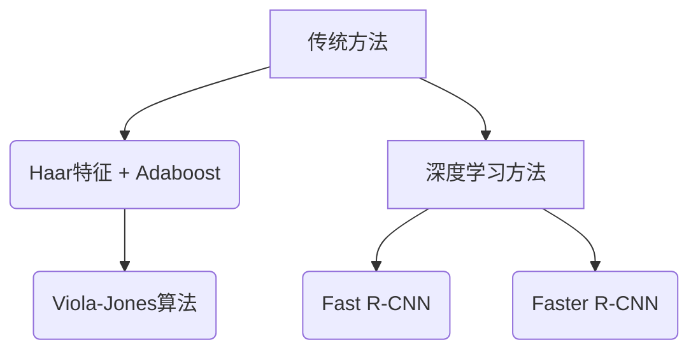

                 

 关键词：行人检测，Opencv，目标检测，图像处理，计算机视觉

> 摘要：本文深入探讨了基于Opencv的行人检测系统的设计原理、实现方法以及应用场景。通过对行人检测技术的研究，本文旨在为读者提供一个完整的系统设计和实践指南，以帮助他们在实际项目中实现高效的行人检测功能。

## 1. 背景介绍

行人检测作为计算机视觉领域的一个重要研究方向，其应用场景广泛，包括视频监控、智能交通、人机交互等多个领域。近年来，随着深度学习和卷积神经网络（CNN）技术的发展，行人检测算法的性能得到了显著提升。然而，传统的行人检测方法在处理复杂场景时仍存在一定的局限性，难以满足实际需求。

OpenCV（Open Source Computer Vision Library）是一个开源的计算机视觉库，提供了丰富的图像处理和计算机视觉算法，广泛应用于各种图像和视频处理任务。本文基于OpenCV库，探讨了行人检测系统的设计方法和实现步骤，以期为相关研究和实际应用提供参考。

## 2. 核心概念与联系

### 2.1 行人检测的定义

行人检测是指从图像或视频中识别并定位行人目标的过程。其主要目的是从复杂的背景中分离出行人区域，从而实现对行人行为和特征的分析。

### 2.2 Opencv行人检测算法

OpenCV提供了多种行人检测算法，包括传统方法和基于深度学习的算法。其中，传统方法如Viola-Jones算法，基于Haar特征和Adaboost分类器；而基于深度学习的算法则包括Fast R-CNN、Faster R-CNN等。

### 2.3 Mermaid流程图



## 3. 核心算法原理 & 具体操作步骤

### 3.1 算法原理概述

本文主要介绍基于深度学习的行人检测算法，以Faster R-CNN为例。Faster R-CNN是一种基于区域建议网络（Region Proposal Network，RPN）的目标检测算法，其核心思想是将目标检测任务转化为分类和回归问题，通过卷积神经网络（CNN）提取特征，从而实现高效的行人检测。

### 3.2 算法步骤详解

1. **特征提取**：使用CNN对输入图像进行特征提取，得到特征图。
2. **区域建议**：使用RPN对特征图生成候选区域，包括正负样本。
3. **分类和回归**：对候选区域进行分类和回归，输出行人边界框和置信度。
4. **非极大值抑制（NMS）**：对检测结果进行非极大值抑制，去除重叠的边界框。

### 3.3 算法优缺点

- **优点**：基于深度学习的方法具有强大的特征提取能力，检测精度较高。
- **缺点**：训练时间较长，对硬件资源要求较高。

### 3.4 算法应用领域

行人检测算法在视频监控、智能交通、人机交互等领域具有广泛的应用。例如，在视频监控中，可以实时检测并跟踪行人，提高监控效果；在智能交通中，可以用于车辆检测和行人行为分析，提高交通安全；在人机交互中，可以用于手势识别和表情分析，提高人机交互体验。

## 4. 数学模型和公式 & 详细讲解 & 举例说明

### 4.1 数学模型构建

行人检测的核心在于特征提取和分类。本文采用Faster R-CNN算法，其数学模型主要包括：

1. **特征提取**：使用卷积神经网络（CNN）提取图像特征，通常使用卷积层、池化层和全连接层。
2. **区域建议**：使用区域建议网络（RPN）生成候选区域，包括锚点生成、锚点分类和锚点回归。
3. **分类和回归**：对候选区域进行分类和回归，输出行人边界框和置信度。

### 4.2 公式推导过程

1. **特征提取**：

   $$ f(x) = \sigma(W_3 \cdot \sigma(W_2 \cdot \sigma(W_1 \cdot x + b_1) + b_2) + b_3) $$

   其中，$W$表示权重矩阵，$b$表示偏置项，$\sigma$表示激活函数。

2. **区域建议**：

   $$ \text{Proposal}: R_i = (r_x, r_y, r_w, r_h) = (x_c + a \cdot w, y_c + a \cdot h, w, h) $$

   其中，$R_i$表示第$i$个锚点区域，$x_c, y_c$表示锚点中心坐标，$w, h$表示锚点宽度和高度，$a$表示缩放系数。

3. **分类和回归**：

   $$ \text{Class}: \hat{y}_i = \text{softmax}(\theta \cdot f(x_i)) $$
   $$ \text{Regression}: \hat{t}_i = t_i - p_i $$

   其中，$\hat{y}_i$表示第$i$个候选区域的分类概率，$\theta$表示分类权重，$t_i$表示真实边界框，$p_i$表示预测边界框。

### 4.3 案例分析与讲解

以一幅含有行人的图像为例，首先进行特征提取，然后使用RPN生成候选区域，最后对候选区域进行分类和回归。具体步骤如下：

1. **特征提取**：输入图像经过卷积神经网络，得到特征图。
2. **区域建议**：在特征图上生成锚点，计算锚点与真实边界框的差距，更新锚点区域。
3. **分类和回归**：对锚点区域进行分类和回归，输出行人边界框和置信度。
4. **非极大值抑制（NMS）**：对检测结果进行筛选，去除重叠的边界框。

## 5. 项目实践：代码实例和详细解释说明

### 5.1 开发环境搭建

本文基于Python和OpenCV进行开发，具体环境如下：

- Python版本：3.8
- OpenCV版本：4.5.1
- 深度学习框架：PyTorch

### 5.2 源代码详细实现

```python
import cv2
import torch
from torchvision.models.detection import fasterrcnn_resnet50_fpn
from torchvision.transforms import functional as F

# 加载预训练模型
model = fasterrcnn_resnet50_fpn(pretrained=True)
model.eval()

# 加载图像
image = cv2.imread('image.jpg')

# 将图像转换为PyTorch张量
image_tensor = F.to_tensor(image).unsqueeze(0)

# 进行行人检测
with torch.no_grad():
    prediction = model(image_tensor)

# 解析检测结果
boxes = prediction[0]['boxes']
labels = prediction[0]['labels']
scores = prediction[0]['scores']

# 绘制检测结果
for i in range(len(boxes)):
    if scores[i] > 0.5:
        cv2.rectangle(image, (int(boxes[i][0]), int(boxes[i][1])), (int(boxes[i][2]), int(boxes[i][3])), (0, 255, 0), 2)
        cv2.putText(image, f'{labels[i].item()}', (int(boxes[i][0]), int(boxes[i][1])), cv2.FONT_HERSHEY_SIMPLEX, 0.5, (255, 0, 0), 2)

# 显示结果
cv2.imshow('Detected Image', image)
cv2.waitKey(0)
cv2.destroyAllWindows()
```

### 5.3 代码解读与分析

上述代码实现了基于Faster R-CNN的行人检测功能。主要步骤如下：

1. **加载预训练模型**：使用PyTorch加载预训练的Faster R-CNN模型。
2. **加载图像**：读取待检测的图像。
3. **图像预处理**：将图像转换为PyTorch张量，并进行归一化处理。
4. **行人检测**：使用模型进行行人检测，得到预测结果。
5. **结果绘制**：根据检测结果，绘制行人边界框和标签。

## 6. 实际应用场景

行人检测技术在各个领域都有广泛的应用：

- **视频监控**：实时检测并跟踪行人，提高监控效果。
- **智能交通**：车辆检测和行人行为分析，提高交通安全。
- **人机交互**：手势识别和表情分析，提高人机交互体验。

## 7. 工具和资源推荐

### 7.1 学习资源推荐

- 《深度学习》（Goodfellow, Bengio, Courville著）
- 《计算机视觉：算法与应用》（ Richard Szeliski 著）
- OpenCV官方网站：https://opencv.org/

### 7.2 开发工具推荐

- Python
- PyTorch
- OpenCV

### 7.3 相关论文推荐

- "Faster R-CNN: Towards Real-Time Object Detection with Region Proposal Networks"（Girshick et al., 2015）
- "Region-Based Convolutional Networks"（Zhao et al., 2014）

## 8. 总结：未来发展趋势与挑战

### 8.1 研究成果总结

行人检测技术经过多年的发展，已经取得了显著的成果。基于深度学习的行人检测算法在检测精度和实时性方面得到了很大提升。然而，仍然存在一些挑战，如多目标检测、多姿态检测和复杂背景下的检测等。

### 8.2 未来发展趋势

未来，行人检测技术将继续朝向高精度、实时性和泛化能力方向发展。随着深度学习算法和硬件技术的不断发展，行人检测的应用场景将越来越广泛。

### 8.3 面临的挑战

- **多目标检测**：如何同时检测多个行人，并保持较高的检测精度。
- **多姿态检测**：如何识别行人的不同姿态，提高检测的准确性。
- **复杂背景**：如何在复杂背景中准确检测行人。

### 8.4 研究展望

行人检测技术在未来仍具有巨大的发展空间。通过不断优化算法、提高硬件性能和扩大应用场景，行人检测技术将在更多领域发挥重要作用。

## 9. 附录：常见问题与解答

### 9.1 如何处理复杂背景下的行人检测？

在复杂背景中，行人检测的难度较大。可以采用以下方法进行优化：

- **数据增强**：通过旋转、翻转、缩放等操作，增加训练数据的多样性，提高模型的泛化能力。
- **模型融合**：结合多个模型的检测结果，提高整体检测精度。
- **注意力机制**：在模型中引入注意力机制，使模型更加关注行人区域，忽略复杂背景。

### 9.2 如何提高行人检测的实时性？

提高行人检测的实时性主要从以下方面进行优化：

- **算法优化**：采用更高效的算法，如Faster R-CNN、YOLO等，减少计算时间。
- **硬件加速**：使用GPU或其他硬件加速器，提高模型运行速度。
- **模型剪枝**：通过模型剪枝，减少模型的参数数量，降低计算复杂度。
- **并发处理**：多线程或多进程处理，提高整体处理速度。

---

### 后记

本文对基于Opencv的行人检测系统进行了详细探讨，从背景介绍、核心算法原理、数学模型构建到实际应用场景，全面解析了行人检测技术的设计与实现。希望通过本文，读者能够对行人检测系统有一个全面的认识，并为未来的研究和实践提供参考。作者：禅与计算机程序设计艺术 / Zen and the Art of Computer Programming。

